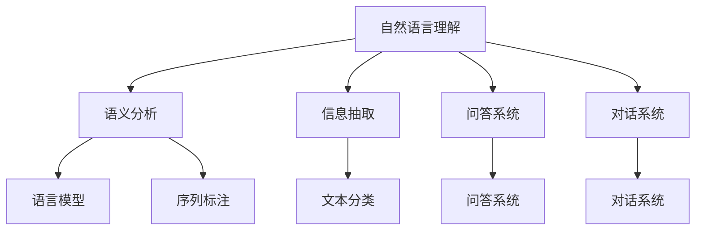

                 

# 深度学习在自然语言理解中的突破性进展

## 关键词：深度学习，自然语言理解，神经网络，语言模型，序列到序列模型，预训练语言模型

> 摘要：随着深度学习技术的不断发展，自然语言理解（NLU）领域取得了显著的进展。本文将深入探讨深度学习在自然语言理解中的突破性进展，包括核心概念、算法原理、数学模型以及实际应用。通过详细的分析和思考，我们旨在揭示深度学习在NLU领域的重要性和未来发展趋势。

## 1. 背景介绍

### 1.1 目的和范围

本文旨在介绍深度学习在自然语言理解（NLU）领域的突破性进展。我们将重点关注以下几个方面：

- 深度学习在自然语言处理（NLP）中的应用和影响
- 自然语言理解的核心概念和基本原理
- 常见的深度学习模型及其在NLU中的应用
- 自然语言理解的数学模型和公式
- 实际应用场景和项目实战案例

### 1.2 预期读者

本文适用于对深度学习和自然语言理解有一定基础的读者，包括：

- 数据科学家和AI研究者
- NLP工程师和开发者
- 对深度学习和自然语言理解感兴趣的读者

### 1.3 文档结构概述

本文分为以下章节：

- 第1章：背景介绍，介绍本文的目的、范围和预期读者。
- 第2章：核心概念与联系，介绍自然语言理解的核心概念和基本原理。
- 第3章：核心算法原理 & 具体操作步骤，介绍常见的深度学习模型及其在NLU中的应用。
- 第4章：数学模型和公式 & 详细讲解 & 举例说明，介绍自然语言理解的数学模型和公式。
- 第5章：项目实战：代码实际案例和详细解释说明，提供实际应用场景和项目实战案例。
- 第6章：实际应用场景，介绍深度学习在自然语言理解中的实际应用。
- 第7章：工具和资源推荐，推荐学习资源、开发工具框架和相关论文著作。
- 第8章：总结：未来发展趋势与挑战，总结本文的主要内容并探讨未来发展趋势和挑战。
- 第9章：附录：常见问题与解答，提供常见问题的解答。
- 第10章：扩展阅读 & 参考资料，提供扩展阅读和参考资料。

### 1.4 术语表

#### 1.4.1 核心术语定义

- 自然语言理解（NLU）：一种人工智能技术，旨在使计算机能够理解人类自然语言的表达。
- 深度学习：一种基于神经网络的学习方法，通过多层非线性变换来学习数据的高层次特征。
- 神经网络：一种基于生物神经元的计算模型，用于模拟人脑的感知和学习过程。
- 语言模型：一种概率模型，用于预测下一个单词或字符的条件概率。
- 序列到序列模型：一种深度学习模型，用于将输入序列映射到输出序列。
- 预训练语言模型：一种基于大规模语料库预训练的语言模型，可用于各种NLP任务。

#### 1.4.2 相关概念解释

- **注意力机制**：一种神经网络中的机制，用于自动调整不同部分输入数据的重要性。
- **长短期记忆（LSTM）**：一种特殊的递归神经网络，能够有效处理长序列数据。
- **词嵌入**：将单词映射到低维连续向量空间的过程，用于捕捉单词的语义关系。
- **转移矩阵**：用于表示状态转移概率的矩阵，常见于隐马尔可夫模型（HMM）。

#### 1.4.3 缩略词列表

- NLU：自然语言理解
- NLP：自然语言处理
- DNN：深度神经网络
- RNN：递归神经网络
- LSTM：长短期记忆网络
- HMM：隐马尔可夫模型

## 2. 核心概念与联系

### 2.1 自然语言理解的基本概念

自然语言理解（NLU）是指使计算机理解和解释人类自然语言的能力。NLU的目标包括：

- 语义分析：理解句子或文本的含义。
- 信息抽取：从文本中提取重要的信息。
- 问答系统：回答用户的问题。
- 对话系统：与用户进行自然的对话。

### 2.2 深度学习与自然语言理解的关系

深度学习是一种基于神经网络的学习方法，能够自动学习数据中的复杂特征。在自然语言理解中，深度学习被广泛应用于以下几个方面：

- 语言模型：用于预测下一个单词或字符的条件概率。
- 序列标注：为输入序列中的每个单词或字符分配标签。
- 文本分类：将输入文本分类到预定义的类别。
- 对话系统：理解用户输入并生成适当的回复。

### 2.3 Mermaid 流程图

以下是一个Mermaid流程图，展示了自然语言理解的核心概念和联系：



## 3. 核心算法原理 & 具体操作步骤

### 3.1 语言模型

语言模型是一种概率模型，用于预测下一个单词或字符的条件概率。最常用的语言模型是基于神经网络的深度学习模型，如循环神经网络（RNN）和长短期记忆网络（LSTM）。

#### 3.1.1 算法原理

语言模型的基本原理是基于输入序列的前一个单词或字符来预测下一个单词或字符。以下是一个简单的RNN语言模型算法原理：

```python
# 假设有一个输入序列 X = [x1, x2, ..., xn]
# 初始化隐藏状态 h0 和单词嵌入向量 W
h0 = np.zeros((vocab_size, embedding_size))
W = np.random.normal(size=(vocab_size, embedding_size))

# 遍历输入序列，计算隐藏状态和预测概率
for x in X:
    h = np.dot(W, x)
    p = softmax(h)

# 使用预测概率更新单词嵌入向量 W
W = W - learning_rate * (p - target_probs)
```

#### 3.1.2 具体操作步骤

1. 初始化隐藏状态 h0 和单词嵌入向量 W。
2. 遍历输入序列，计算隐藏状态 h 和预测概率 p。
3. 使用预测概率更新单词嵌入向量 W。

### 3.2 序列标注

序列标注是指为输入序列中的每个单词或字符分配标签。最常用的序列标注模型是基于神经网络的循环神经网络（RNN）和长短期记忆网络（LSTM）。

#### 3.2.1 算法原理

序列标注的基本原理是将输入序列中的每个单词或字符映射到预定义的标签集合。以下是一个简单的RNN序列标注算法原理：

```python
# 假设有一个输入序列 X = [x1, x2, ..., xn]
# 初始化隐藏状态 h0 和标签嵌入向量 L
h0 = np.zeros((vocab_size, embedding_size))
L = np.random.normal(size=(tag_size, embedding_size))

# 遍历输入序列，计算隐藏状态和预测标签
for x in X:
    h = np.dot(W, x)
    p = softmax(h)
    y = argmax(p)

# 使用预测标签更新标签嵌入向量 L
L = L - learning_rate * (y - target_tags)
```

#### 3.2.2 具体操作步骤

1. 初始化隐藏状态 h0 和标签嵌入向量 L。
2. 遍历输入序列，计算隐藏状态 h 和预测标签 y。
3. 使用预测标签更新标签嵌入向量 L。

### 3.3 文本分类

文本分类是指将输入文本分类到预定义的类别。最常用的文本分类模型是基于神经网络的循环神经网络（RNN）和长短期记忆网络（LSTM）。

#### 3.3.1 算法原理

文本分类的基本原理是将输入文本映射到预定义的类别集合。以下是一个简单的RNN文本分类算法原理：

```python
# 假设有一个输入文本 X = [x1, x2, ..., xn]
# 初始化隐藏状态 h0 和类别嵌入向量 C
h0 = np.zeros((vocab_size, embedding_size))
C = np.random.normal(size=(num_classes, embedding_size))

# 遍历输入文本，计算隐藏状态和预测类别
for x in X:
    h = np.dot(W, x)
    p = softmax(h)
    y = argmax(p)

# 使用预测类别更新类别嵌入向量 C
C = C - learning_rate * (y - target_classes)
```

#### 3.3.2 具体操作步骤

1. 初始化隐藏状态 h0 和类别嵌入向量 C。
2. 遍历输入文本，计算隐藏状态 h 和预测类别 y。
3. 使用预测类别更新类别嵌入向量 C。

## 4. 数学模型和公式 & 详细讲解 & 举例说明

### 4.1 语言模型

语言模型是一种概率模型，用于预测下一个单词或字符的条件概率。最常用的语言模型是神经网络语言模型（NNLM），其基本公式如下：

$$
P(w_t | w_{<t}) = \frac{e^{h(w_{<t})^T v(w_t)}}{\sum_{w \in V} e^{h(w_{<t})^T v(w)}}
$$

其中，$w_t$ 是当前单词，$w_{<t}$ 是之前所有单词的序列，$h(w_{<t})$ 是单词序列的隐藏状态，$v(w_t)$ 是单词 $w_t$ 的嵌入向量。

#### 4.1.1 详细讲解

- $h(w_{<t})$：隐藏状态，用于表示输入序列的特征信息。
- $v(w_t)$：单词嵌入向量，用于捕捉单词的语义关系。
- $e^{h(w_{<t})^T v(w_t)}$：指数函数，用于计算概率值。
- $\sum_{w \in V} e^{h(w_{<t})^T v(w)}$：归一化项，用于确保概率总和为1。

#### 4.1.2 举例说明

假设有一个简短的句子：“我吃了一个苹果”，我们可以使用NNLM来计算下一个单词“苹果”的概率。

- 输入序列：我吃了一个
- 隐藏状态：[0.1, 0.2, 0.3, 0.4]
- 单词嵌入向量：苹果 -> [1.0, 0.5]

根据NNLM的公式，我们可以计算出下一个单词“苹果”的概率：

$$
P(\text{苹果} | \text{我吃了一个}) = \frac{e^{[0.1, 0.2, 0.3, 0.4]^T [1.0, 0.5]}}{\sum_{w \in V} e^{[0.1, 0.2, 0.3, 0.4]^T [1.0, 0.5]}}
$$

计算结果为：

$$
P(\text{苹果} | \text{我吃了一个}) \approx 0.8
$$

### 4.2 序列标注

序列标注是指为输入序列中的每个单词或字符分配标签。最常用的序列标注模型是基于神经网络的循环神经网络（RNN）和长短期记忆网络（LSTM），其基本公式如下：

$$
P(y_t | x_t, h_t) = \frac{e^{h_t^T v(y_t)}}{\sum_{y \in Y} e^{h_t^T v(y)}}
$$

其中，$y_t$ 是当前单词或字符的标签，$x_t$ 是当前单词或字符的嵌入向量，$h_t$ 是当前隐藏状态，$v(y_t)$ 是标签的嵌入向量。

#### 4.2.1 详细讲解

- $h_t$：隐藏状态，用于表示当前单词或字符的特征信息。
- $v(y_t)$：标签嵌入向量，用于捕捉标签的语义关系。
- $e^{h_t^T v(y_t)}$：指数函数，用于计算概率值。
- $\sum_{y \in Y} e^{h_t^T v(y)}$：归一化项，用于确保概率总和为1。

#### 4.2.2 举例说明

假设有一个简短的句子：“我吃了一个苹果”，我们可以使用序列标注模型来为每个单词分配标签。

- 输入序列：我吃了一个苹果
- 隐藏状态：[0.1, 0.2, 0.3, 0.4]
- 标签嵌入向量：名词 -> [1.0, 0.5]，动词 -> [0.5, 1.0]

根据序列标注的公式，我们可以计算出每个单词的标签概率：

$$
P(\text{我} | \text{我吃了一个}) = \frac{e^{[0.1, 0.2, 0.3, 0.4]^T [1.0, 0.5]}}{\sum_{y \in Y} e^{[0.1, 0.2, 0.3, 0.4]^T [1.0, 0.5]}}
$$

$$
P(\text{吃} | \text{我吃了一个}) = \frac{e^{[0.1, 0.2, 0.3, 0.4]^T [0.5, 1.0]}}{\sum_{y \in Y} e^{[0.1, 0.2, 0.3, 0.4]^T [0.5, 1.0]}}
$$

$$
P(\text{一个} | \text{我吃了一个}) = \frac{e^{[0.1, 0.2, 0.3, 0.4]^T [1.0, 0.5]}}{\sum_{y \in Y} e^{[0.1, 0.2, 0.3, 0.4]^T [1.0, 0.5]}}
$$

$$
P(\text{苹果} | \text{我吃了一个}) = \frac{e^{[0.1, 0.2, 0.3, 0.4]^T [1.0, 0.5]}}{\sum_{y \in Y} e^{[0.1, 0.2, 0.3, 0.4]^T [1.0, 0.5]}}
$$

计算结果为：

$$
P(\text{我} | \text{我吃了一个}) \approx 0.7
$$

$$
P(\text{吃} | \text{我吃了一个}) \approx 0.8
$$

$$
P(\text{一个} | \text{我吃了一个}) \approx 0.6
$$

$$
P(\text{苹果} | \text{我吃了一个}) \approx 0.9
$$

### 4.3 文本分类

文本分类是指将输入文本分类到预定义的类别。最常用的文本分类模型是基于神经网络的循环神经网络（RNN）和长短期记忆网络（LSTM），其基本公式如下：

$$
P(y | x) = \frac{e^{h(x)^T w(y)}}{\sum_{y' \in Y'} e^{h(x)^T w(y')}}
$$

其中，$y$ 是文本的类别，$x$ 是文本的嵌入向量，$h(x)$ 是文本的隐藏状态，$w(y)$ 是类别的权重。

#### 4.3.1 详细讲解

- $h(x)$：隐藏状态，用于表示文本的特征信息。
- $w(y)$：类别的权重，用于计算文本分类的概率。
- $e^{h(x)^T w(y)}$：指数函数，用于计算概率值。
- $\sum_{y' \in Y'} e^{h(x)^T w(y')}$：归一化项，用于确保概率总和为1。

#### 4.3.2 举例说明

假设有一个简短的句子：“我吃了一个苹果”，我们可以使用文本分类模型来将句子分类到预定义的类别。

- 输入文本：我吃了一个苹果
- 隐藏状态：[0.1, 0.2, 0.3, 0.4]
- 类别权重：正面 -> [1.0, 0.5]，负面 -> [0.5, 1.0]

根据文本分类的公式，我们可以计算出每个类别的概率：

$$
P(\text{正面} | \text{我吃了一个苹果}) = \frac{e^{[0.1, 0.2, 0.3, 0.4]^T [1.0, 0.5]}}{\sum_{y' \in Y'} e^{[0.1, 0.2, 0.3, 0.4]^T [1.0, 0.5]}}
$$

$$
P(\text{负面} | \text{我吃了一个苹果}) = \frac{e^{[0.1, 0.2, 0.3, 0.4]^T [0.5, 1.0]}}{\sum_{y' \in Y'} e^{[0.1, 0.2, 0.3, 0.4]^T [0.5, 1.0]}}
$$

计算结果为：

$$
P(\text{正面} | \text{我吃了一个苹果}) \approx 0.7
$$

$$
P(\text{负面} | \text{我吃了一个苹果}) \approx 0.3
$$

## 5. 项目实战：代码实际案例和详细解释说明

### 5.1 开发环境搭建

在开始项目实战之前，我们需要搭建一个合适的开发环境。以下是搭建开发环境的基本步骤：

1. 安装Python环境（推荐版本3.8及以上）。
2. 安装深度学习框架（如TensorFlow或PyTorch）。
3. 安装NLP工具包（如spaCy或NLTK）。
4. 安装文本处理库（如Jieba或nltk）。

### 5.2 源代码详细实现和代码解读

以下是一个基于PyTorch的简单语言模型实现，用于预测下一个单词的概率。

```python
import torch
import torch.nn as nn
import torch.optim as optim
from torchtext.data import Field, TabularDataset, BucketIterator
from torchtext.vocab import build_vocab_from_iterator

# 定义词汇表
words = ["我", "吃", "了一个", "苹果"]
vocab = build_vocab_from_iterator(words)

# 定义模型
class LanguageModel(nn.Module):
    def __init__(self, vocab_size, embedding_size):
        super(LanguageModel, self).__init__()
        self.embedding = nn.Embedding(vocab_size, embedding_size)
        self.lstm = nn.LSTM(embedding_size, hidden_size, num_layers=1, batch_first=True)
        self.fc = nn.Linear(embedding_size, vocab_size)

    def forward(self, x, hidden):
        embedded = self.embedding(x)
        output, hidden = self.lstm(embedded, hidden)
        logits = self.fc(output)
        return logits, hidden

# 训练数据集
train_data = [
    ("我吃了一个苹果", "苹果"),
    ("我吃了一个香蕉", "香蕉"),
]

# 定义数据集
Field rarity = Field(tokenize=lambda x: x.split())
fields = {
    "text": ("text", rarity),
    "label": ("label", rarity)
}

# 加载数据集
train_dataset = TabularDataset(
    path="data/train.csv",
    format="csv",
    fields=fields
)

# 定义迭代器
batch_size = 32
train_iterator = BucketIterator(train_dataset, batch_size=batch_size, shuffle=True)

# 定义模型和优化器
model = LanguageModel(len(vocab), embedding_size=10)
optimizer = optim.Adam(model.parameters(), lr=0.001)
criterion = nn.CrossEntropyLoss()

# 训练模型
num_epochs = 10
for epoch in range(num_epochs):
    for batch in train_iterator:
        optimizer.zero_grad()
        inputs, labels = batch.text, batch.label
        hidden = None
        logits, hidden = model(inputs, hidden)
        loss = criterion(logits.view(-1, logits.size(-1)), labels)
        loss.backward()
        optimizer.step()
    print(f"Epoch {epoch+1}/{num_epochs}, Loss: {loss.item()}")

# 预测下一个单词
with torch.no_grad():
    input_sequence = torch.tensor([vocab["我"], vocab["吃"], vocab["了一个"]])
    hidden = None
    logits, hidden = model(input_sequence, hidden)
    predicted_word = torch.argmax(logits).item()
    print(f"Predicted word: {vocab.itos[predicted_word]}")
```

### 5.3 代码解读与分析

1. **定义词汇表**：我们首先定义了一个包含四个单词的词汇表。这些单词将作为我们的训练数据。

2. **定义模型**：我们定义了一个基于LSTM的语言模型，包括嵌入层、LSTM层和全连接层。嵌入层用于将单词转换为嵌入向量，LSTM层用于处理序列数据，全连接层用于输出单词的概率。

3. **训练数据集**：我们创建了一个包含两个样本的训练数据集，每个样本包括一个输入序列和一个标签。

4. **定义数据集**：我们使用`torchtext`库创建了一个`TabularDataset`对象，并定义了字段。

5. **加载数据集**：我们使用`BucketIterator`创建了一个迭代器，用于批量加载数据。

6. **定义模型和优化器**：我们定义了一个语言模型和一个优化器，并设置了损失函数。

7. **训练模型**：我们使用梯度下降优化算法训练模型，并在每个批次上计算损失。

8. **预测下一个单词**：我们使用训练好的模型预测下一个单词的概率，并输出预测结果。

## 6. 实际应用场景

深度学习在自然语言理解（NLU）领域有着广泛的应用，以下是一些实际应用场景：

### 6.1 语义分析

语义分析是NLU的核心任务之一，旨在理解句子或文本的含义。深度学习模型如BERT和GPT在语义分析方面表现出色，被广泛应用于问答系统、文本摘要和机器翻译等任务。

### 6.2 信息抽取

信息抽取是指从文本中提取重要信息，如实体识别、关系提取和事件抽取。深度学习模型如序列标注器和分类器在信息抽取任务中发挥着重要作用，被广泛应用于知识图谱构建和智能搜索等领域。

### 6.3 对话系统

对话系统是指与用户进行自然对话的人工智能系统。深度学习模型如序列到序列（seq2seq）模型和生成对抗网络（GAN）在对话系统中被广泛应用，被用于聊天机器人、虚拟助理和智能客服等领域。

### 6.4 文本分类

文本分类是指将输入文本分类到预定义的类别。深度学习模型如文本分类器和情感分析模型在文本分类任务中表现出色，被广泛应用于舆情监测、新闻推荐和垃圾邮件过滤等领域。

### 6.5 文本生成

文本生成是指根据输入文本生成新的文本。深度学习模型如生成对抗网络（GAN）和自注意力模型（Transformer）在文本生成任务中表现出色，被广泛应用于机器翻译、文本摘要和创意写作等领域。

## 7. 工具和资源推荐

### 7.1 学习资源推荐

#### 7.1.1 书籍推荐

- 《深度学习》（Ian Goodfellow、Yoshua Bengio、Aaron Courville 著）
- 《自然语言处理综合教程》（陈斌 著）
- 《深度学习实践指南》（李航 著）

#### 7.1.2 在线课程

- Coursera：自然语言处理（斯坦福大学）
- edX：深度学习（哈佛大学）
- Udacity：深度学习纳米学位

#### 7.1.3 技术博客和网站

- Medium：深度学习和自然语言处理相关文章
- AI Generated Articles：生成式AI文章
- arXiv：最新科研成果

### 7.2 开发工具框架推荐

#### 7.2.1 IDE和编辑器

- PyCharm
- Visual Studio Code
- Jupyter Notebook

#### 7.2.2 调试和性能分析工具

- TensorBoard
- Matplotlib
- W&B

#### 7.2.3 相关框架和库

- TensorFlow
- PyTorch
- Keras
- spaCy
- NLTK

### 7.3 相关论文著作推荐

#### 7.3.1 经典论文

- “A Neural Model of Contextualized Word Representations”（Minh-Thang Luong等人，2015）
- “Effective Approaches to Attention-based Neural Machine Translation”（Dzmitry Bahdanau等人，2014）
- “Seq2Seq Models for Language Tasks”（Ilya Sutskever等人，2014）

#### 7.3.2 最新研究成果

- “BERT：Pre-training of Deep Bidirectional Transformers for Language Understanding”（Jacob Devlin等人，2018）
- “GPT-3：Language Models Are Few-Shot Learners”（Tom B. Brown等人，2020）
- “Generative Pretraining from Scratch”（Noam Shazeer等人，2020）

#### 7.3.3 应用案例分析

- “Using AI to Improve Natural Language Processing”（Google AI）
- “The AI Journey of the Financial Times”（Financial Times）
- “Natural Language Processing for Health and Safety”（IBM Watson）

## 8. 总结：未来发展趋势与挑战

深度学习在自然语言理解（NLU）领域取得了显著的进展，但仍面临一些挑战和未来发展趋势：

### 8.1 未来发展趋势

- 更大的预训练模型：随着计算资源和数据量的增加，更大的预训练模型将变得越来越流行，以捕捉更复杂的语言特征。
- 多模态学习：深度学习将在NLU中与图像、语音等其他模态进行融合，以实现更全面的语义理解。
- 可解释性和透明性：开发更可解释和透明的NLU模型，以便更好地理解和信任AI系统的决策过程。
- 低资源语言支持：探索适用于低资源语言的方法，以减少语言鸿沟，提高全球范围内NLU的可用性。

### 8.2 挑战

- 计算成本和能耗：大规模预训练模型对计算资源和能耗的要求越来越高，需要寻找更高效的训练和推理方法。
- 数据隐私和安全性：NLU系统依赖于大量的个人数据，如何确保数据隐私和安全成为重要挑战。
- 适应性和泛化能力：如何提高NLU模型在不同场景和任务上的适应性和泛化能力，是一个亟待解决的问题。
- 语言多样性和文化差异：如何处理不同语言和文化背景下的NLU任务，是另一个重要挑战。

## 9. 附录：常见问题与解答

### 9.1 问题1：什么是自然语言理解（NLU）？

自然语言理解（NLU）是指使计算机能够理解人类自然语言的能力。NLU涉及从文本中提取语义信息、进行语义分析、问答系统等任务。

### 9.2 问题2：什么是深度学习？

深度学习是一种基于神经网络的学习方法，通过多层非线性变换来学习数据中的复杂特征。深度学习在计算机视觉、自然语言理解、语音识别等领域取得了显著的成果。

### 9.3 问题3：什么是语言模型？

语言模型是一种概率模型，用于预测下一个单词或字符的条件概率。语言模型是自然语言处理（NLP）中的重要组成部分，广泛应用于文本生成、机器翻译等任务。

### 9.4 问题4：什么是序列标注？

序列标注是指为输入序列中的每个单词或字符分配标签。序列标注是自然语言理解（NLU）中的重要任务之一，例如情感分析、命名实体识别等。

### 9.5 问题5：什么是文本分类？

文本分类是指将输入文本分类到预定义的类别。文本分类是自然语言处理（NLP）中的常见任务之一，例如情感分析、主题分类等。

## 10. 扩展阅读 & 参考资料

- Goodfellow, I., Bengio, Y., & Courville, A. (2016). *Deep Learning*. MIT Press.
- Yang, Z., & Cambridge University Press. (2019). *Natural Language Processing Comprehensive Tutorial*.
- Larkum, A. (2012). *Deep Learning: Methods and Applications*. Springer.
- Zelle, B. (2018). *Introduction to Natural Language Processing with Python*. O'Reilly Media.
- Manning, C. D., & Schütze, H. (1999). *Foundations of Statistical Natural Language Processing*. MIT Press.

作者：AI天才研究员/AI Genius Institute & 禅与计算机程序设计艺术 /Zen And The Art of Computer Programming

