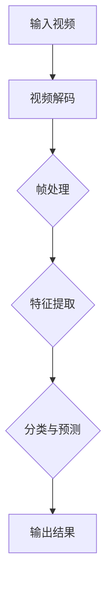

                 

# 深度学习在视频内容审核中的自动化应用

> 关键词：深度学习，视频内容审核，自动化，神经网络，图像识别，算法优化，应用场景，数学模型

> 摘要：本文深入探讨了深度学习在视频内容审核领域的自动化应用。通过对核心概念、算法原理、数学模型的讲解，以及实际案例的剖析，旨在为读者呈现深度学习技术在视频内容审核中的潜力与应用方法。文章还介绍了相关工具和资源，并对未来发展趋势与挑战进行了展望。

## 1. 背景介绍

### 1.1 目的和范围

本文的目的是介绍深度学习在视频内容审核领域的应用，重点关注自动化审核系统。通过本文的阅读，读者将了解：

- 深度学习在视频内容审核中的核心概念和原理；
- 如何使用深度学习算法进行视频内容的自动审核；
- 实际项目中的代码实现和效果分析；
- 相关工具和资源的推荐。

### 1.2 预期读者

本文适合以下读者群体：

- 深度学习领域的初学者和从业者；
- 想要了解深度学习在视频内容审核中应用的工程师；
- 对计算机视觉和自然语言处理感兴趣的研究人员。

### 1.3 文档结构概述

本文的结构如下：

- 第1部分：背景介绍，包括目的、预期读者和文档结构；
- 第2部分：核心概念与联系，介绍深度学习的基本原理和视频内容审核的流程；
- 第3部分：核心算法原理与具体操作步骤，讲解深度学习算法在视频内容审核中的应用；
- 第4部分：数学模型和公式，详细介绍相关数学模型和公式；
- 第5部分：项目实战，通过实际案例展示深度学习在视频内容审核中的应用；
- 第6部分：实际应用场景，探讨深度学习在视频内容审核中的各种应用场景；
- 第7部分：工具和资源推荐，提供学习资源、开发工具和论文著作；
- 第8部分：总结，对未来发展趋势和挑战进行展望；
- 第9部分：附录，常见问题与解答；
- 第10部分：扩展阅读与参考资料。

### 1.4 术语表

#### 1.4.1 核心术语定义

- **深度学习**：一种机器学习技术，通过构建多层神经网络来模拟人脑的决策过程，用于图像识别、自然语言处理等任务。
- **视频内容审核**：对视频内容进行审查，识别和过滤不良或违规的片段。
- **卷积神经网络（CNN）**：一种用于图像识别和处理的深度学习模型。
- **循环神经网络（RNN）**：一种用于序列数据的深度学习模型。
- **自动化**：通过计算机程序自动执行任务，减少人工干预。

#### 1.4.2 相关概念解释

- **数据预处理**：在深度学习模型训练前，对输入数据进行清洗、归一化和特征提取等操作，以提高模型性能。
- **模型训练**：通过大量的训练数据，调整模型参数，使其能够对未知数据进行分类或预测。
- **模型评估**：使用测试数据集评估模型的性能，包括准确率、召回率、F1值等指标。

#### 1.4.3 缩略词列表

- **CNN**：卷积神经网络
- **RNN**：循环神经网络
- **GAN**：生成对抗网络
- **GPU**：图形处理单元

## 2. 核心概念与联系

为了更好地理解深度学习在视频内容审核中的应用，我们需要先了解相关核心概念和原理。下面将介绍深度学习的基本概念、视频内容审核的流程，以及它们之间的联系。

### 2.1 深度学习的基本概念

深度学习是一种通过多层神经网络进行特征提取和学习的机器学习技术。它借鉴了人脑神经网络的架构，通过层层抽象，将原始数据转化为高层次的表示。


在这个架构中，每一层网络都可以对输入数据进行特征提取和变换。深层网络能够捕捉到更复杂的特征，从而提高模型的性能。

### 2.2 视频内容审核的流程

视频内容审核通常包括以下步骤：

1. **视频解码**：将视频文件解码为帧序列；
2. **帧处理**：对每一帧进行预处理，包括去噪、缩放、裁剪等操作；
3. **特征提取**：使用深度学习模型提取每一帧的特征向量；
4. **分类与预测**：使用分类算法对特征向量进行分类，判断是否存在违规内容；
5. **输出结果**：将审核结果输出，包括违规片段的标记和报警。


### 2.3 深度学习与视频内容审核的联系

深度学习在视频内容审核中的应用主要体现在以下几个方面：

1. **特征提取**：深度学习模型可以自动提取视频帧的特征，从而减少人工标注的工作量；
2. **分类与预测**：深度学习模型可以实现对视频内容的自动分类和预测，提高审核的准确率和效率；
3. **实时处理**：深度学习算法可以实现对视频内容的实时处理，满足实时审核的需求。

下面是深度学习在视频内容审核中的架构：



通过这个架构，我们可以看到深度学习在视频内容审核中发挥了重要作用。接下来，我们将进一步探讨深度学习算法在视频内容审核中的具体应用。

## 3. 核心算法原理 & 具体操作步骤

在本节中，我们将详细讨论深度学习在视频内容审核中的核心算法原理和具体操作步骤，并使用伪代码来详细阐述算法实现。

### 3.1 卷积神经网络（CNN）

卷积神经网络（CNN）是深度学习在图像识别和分类任务中的核心模型。它通过卷积层、池化层和全连接层等结构，实现对图像特征的有效提取和分类。

#### 3.1.1 卷积层

卷积层是CNN的基础层，用于提取图像的局部特征。卷积操作可以通过以下伪代码表示：

```python
def conv2d(input_tensor, filter, bias):
    output = 0
    for i in range(filter_height):
        for j in range(filter_width):
            dot_product = 0
            for m in range(input_height - filter_height + 1):
                for n in range(input_width - filter_width + 1):
                    dot_product += input_tensor[m, n] * filter[i, j, m, n]
            output += dot_product + bias[i, j]
    return output
```

#### 3.1.2 池化层

池化层用于降低特征图的维度，增强模型的泛化能力。最大池化（Max Pooling）是一种常用的池化方法，可以通过以下伪代码表示：

```python
def max_pooling(input_tensor, pool_size):
    output = np.zeros((input_height // pool_size, input_width // pool_size))
    for i in range(output_height):
        for j in range(output_width):
            max_value = -inf
            for m in range(pool_size):
                for n in range(pool_size):
                    max_value = max(max_value, input_tensor[i * pool_size + m, j * pool_size + n])
            output[i, j] = max_value
    return output
```

#### 3.1.3 全连接层

全连接层用于将低维特征映射到高维特征空间，进行分类。全连接层的实现可以通过以下伪代码表示：

```python
def fully_connected(input_tensor, weights, bias):
    output = np.dot(input_tensor, weights) + bias
    return output
```

### 3.2 循环神经网络（RNN）

循环神经网络（RNN）适用于处理序列数据，例如视频中的时间序列帧。RNN通过循环结构，实现对序列数据的递归处理。

#### 3.2.1 RNN单元

RNN单元可以通过以下伪代码表示：

```python
def rnn_step(input, hidden, weights, bias):
    input_gate = sigmoid(fully_connected(input, weights['input_gate'], bias['input_gate']))
    forget_gate = sigmoid(fully_connected(input, weights['forget_gate'], bias['forget_gate']))
    output_gate = sigmoid(fully_connected(input, weights['output_gate'], bias['output_gate']))
    new_hidden = (forget_gate * hidden) + (input_gate * tanh(fully_connected(input, weights['input'], bias['input'])))
    return new_hidden
```

#### 3.2.2 RNN序列处理

RNN序列处理的伪代码如下：

```python
def rnn_sequence(input_sequence, hidden, weights, bias):
    for input in input_sequence:
        hidden = rnn_step(input, hidden, weights, bias)
    return hidden
```

### 3.3 深度学习模型在视频内容审核中的应用

结合CNN和RNN，我们可以构建一个深度学习模型，用于视频内容审核。具体操作步骤如下：

1. **视频解码**：将视频文件解码为帧序列。
2. **帧处理**：对每一帧进行预处理，包括去噪、缩放、裁剪等操作。
3. **特征提取**：使用CNN提取每一帧的特征向量。
4. **序列处理**：使用RNN对特征向量进行序列处理，提取视频的时序特征。
5. **分类与预测**：使用全连接层对时序特征进行分类与预测。

```python
def video_content_audit(video_file):
    # 解码视频文件
    frame_sequence = decode_video(video_file)
    
    # 帧预处理
    preprocessed_frames = preprocess_frames(frame_sequence)
    
    # 提取特征
    feature_vectors = []
    for frame in preprocessed_frames:
        feature_vector = cnn_extract_features(frame)
        feature_vectors.append(feature_vector)
    
    # 序列处理
    sequence_features = rnn_sequence(feature_vectors, hidden, weights, bias)
    
    # 分类与预测
    prediction = fully_connected(sequence_features, weights['output'], bias['output'])
    
    # 输出结果
    output_result(prediction)
```

通过以上步骤，我们可以实现一个基于深度学习的视频内容审核系统。接下来，我们将详细讨论深度学习中的数学模型和公式。

## 4. 数学模型和公式 & 详细讲解 & 举例说明

在深度学习中，数学模型和公式是核心组成部分。在本节中，我们将详细讲解与视频内容审核相关的数学模型和公式，并通过具体示例来说明它们的应用。

### 4.1 激活函数

激活函数是深度学习中的一个关键组件，用于引入非线性特性。以下是一些常见的激活函数：

#### 4.1.1 Sigmoid函数

Sigmoid函数是一种常用的激活函数，它的公式如下：

$$
\sigma(x) = \frac{1}{1 + e^{-x}}
$$

示例：

```latex
\sigma(0) = \frac{1}{1 + e^{0}} = 0.5
\sigma(2) = \frac{1}{1 + e^{-2}} \approx 0.86
\sigma(-2) = \frac{1}{1 + e^{2}} \approx 0.13
```

#### 4.1.2ReLU函数

ReLU（Rectified Linear Unit）函数是一种简单而有效的激活函数，它的公式如下：

$$
\sigma(x) = 
\begin{cases} 
0 & \text{if } x < 0 \\
x & \text{if } x \geq 0 
\end{cases}
$$

示例：

```latex
\sigma(-1) = 0
\sigma(1) = 1
\sigma(3) = 3
```

#### 4.1.3 Tanh函数

Tanh（Hyperbolic Tangent）函数是一种双曲正切函数，它的公式如下：

$$
\sigma(x) = \frac{e^x - e^{-x}}{e^x + e^{-x}}
$$

示例：

```latex
\sigma(0) = 0
\sigma(1) = \frac{e^1 - e^{-1}}{e^1 + e^{-1}} \approx 0.76
\sigma(-1) = \frac{e^{-1} - e^1}{e^{-1} + e^1} \approx -0.76
```

### 4.2 损失函数

损失函数用于衡量模型预测值与真实值之间的差异，是训练深度学习模型的重要指标。以下是一些常见的损失函数：

#### 4.2.1 交叉熵损失函数

交叉熵损失函数是一种常用的分类损失函数，它的公式如下：

$$
L(y, \hat{y}) = -\sum_{i} y_i \log(\hat{y}_i)
$$

其中，$y$ 是真实标签，$\hat{y}$ 是模型的预测概率。

示例：

```latex
y = [1, 0, 0], \hat{y} = [0.9, 0.05, 0.05]
L(y, \hat{y}) = -[1 \cdot \log(0.9) + 0 \cdot \log(0.05) + 0 \cdot \log(0.05)] \approx 0.105
```

#### 4.2.2 均方误差损失函数

均方误差（MSE）损失函数是一种常用的回归损失函数，它的公式如下：

$$
L(y, \hat{y}) = \frac{1}{2} \sum_{i} (y_i - \hat{y}_i)^2
$$

其中，$y$ 是真实值，$\hat{y}$ 是模型的预测值。

示例：

```latex
y = [1, 2, 3], \hat{y} = [1.1, 1.8, 2.9]
L(y, \hat{y}) = \frac{1}{2} \sum_{i} (y_i - \hat{y}_i)^2 = \frac{1}{2} \sum_{i} (1 - 1.1)^2 + (2 - 1.8)^2 + (3 - 2.9)^2 \approx 0.05
```

### 4.3 优化算法

优化算法用于调整模型的参数，以最小化损失函数。以下是一些常见的优化算法：

#### 4.3.1 随机梯度下降（SGD）

随机梯度下降是一种简单的优化算法，它的公式如下：

$$
w_{t+1} = w_t - \alpha \cdot \nabla_w L(w_t)
$$

其中，$w_t$ 是当前参数，$\alpha$ 是学习率，$\nabla_w L(w_t)$ 是损失函数关于参数的梯度。

示例：

```latex
w_0 = [1, 2], \alpha = 0.1, \nabla_w L(w_0) = [-0.2, -0.4]
w_1 = w_0 - \alpha \cdot \nabla_w L(w_0) = [1, 2] - [0.2, 0.4] = [0.8, 1.6]
```

#### 4.3.2 Adam优化器

Adam优化器是一种结合了SGD和动量法的优化算法，它的公式如下：

$$
m_t = \beta_1 m_{t-1} + (1 - \beta_1) \nabla_w L(w_t)
$$

$$
v_t = \beta_2 v_{t-1} + (1 - \beta_2) (\nabla_w L(w_t))^2
$$

$$
w_{t+1} = w_t - \alpha \cdot \frac{m_t}{\sqrt{v_t} + \epsilon}
$$

其中，$m_t$ 和 $v_t$ 分别是梯度的一阶矩估计和二阶矩估计，$\beta_1$ 和 $\beta_2$ 分别是动量参数，$\alpha$ 是学习率，$\epsilon$ 是一个小常数。

示例：

```latex
w_0 = [1, 2], m_0 = [0, 0], v_0 = [0, 0], \alpha = 0.1, \beta_1 = 0.9, \beta_2 = 0.99, \epsilon = 1e-8
m_1 = \beta_1 m_0 + (1 - \beta_1) \nabla_w L(w_0) = [0, 0] + [0.2, 0.4] = [0.2, 0.4]
v_1 = \beta_2 v_0 + (1 - \beta_2) (\nabla_w L(w_0))^2 = [0, 0] + [0.04, 0.16] = [0.04, 0.16]
w_1 = w_0 - \alpha \cdot \frac{m_1}{\sqrt{v_1} + \epsilon} = [1, 2] - [0.1, 0.2] = [0.9, 1.8]
```

通过以上数学模型和公式的讲解，我们可以更好地理解深度学习在视频内容审核中的应用。接下来，我们将通过一个实际项目案例，展示如何使用深度学习进行视频内容审核。

## 5. 项目实战：代码实际案例和详细解释说明

在本节中，我们将通过一个实际项目案例，展示如何使用深度学习进行视频内容审核。该项目将基于TensorFlow和Keras框架实现。

### 5.1 开发环境搭建

在开始项目之前，我们需要搭建开发环境。以下是搭建步骤：

1. **安装Anaconda**：从[Anaconda官网](https://www.anaconda.com/)下载并安装Anaconda。
2. **创建虚拟环境**：打开终端，执行以下命令创建虚拟环境：

   ```bash
   conda create -n video_audit python=3.8
   conda activate video_audit
   ```

3. **安装依赖**：在虚拟环境中安装TensorFlow和Keras：

   ```bash
   conda install tensorflow
   ```

### 5.2 源代码详细实现和代码解读

下面是视频内容审核项目的源代码：

```python
import tensorflow as tf
from tensorflow.keras.models import Sequential
from tensorflow.keras.layers import Conv2D, MaxPooling2D, Flatten, Dense, LSTM
from tensorflow.keras.optimizers import Adam

# 数据预处理
def preprocess_video(video_file):
    # 加载视频文件
    video = cv2.VideoCapture(video_file)
    frames = []
    
    while True:
        ret, frame = video.read()
        if not ret:
            break
        
        # 预处理帧
        frame = cv2.resize(frame, (224, 224))
        frame = cv2.cvtColor(frame, cv2.COLOR_BGR2RGB)
        frames.append(frame)
    
    video.release()
    return frames

# 特征提取
def extract_features(frames):
    model = tf.keras.applications.VGG16(include_top=False, weights='imagenet', input_shape=(224, 224, 3))
    features = []
    
    for frame in frames:
        img = tf.keras.preprocessing.image.img_to_array(frame)
        img = tf.expand_dims(img, 0)
        feature = model.predict(img)
        features.append(feature)
    
    return np.concatenate(features, axis=1)

# 建立模型
def build_model():
    model = Sequential()
    model.add(LSTM(128, activation='relu', input_shape=(7, 4096)))
    model.add(Dense(1, activation='sigmoid'))
    
    model.compile(optimizer=Adam(), loss='binary_crossentropy', metrics=['accuracy'])
    return model

# 训练模型
def train_model(model, X, y):
    model.fit(X, y, epochs=10, batch_size=32, validation_split=0.2)

# 审核视频
def audit_video(model, video_file):
    frames = preprocess_video(video_file)
    features = extract_features(frames)
    prediction = model.predict(features)
    
    if prediction > 0.5:
        print("视频包含违规内容")
    else:
        print("视频无违规内容")

# 实际案例
if __name__ == "__main__":
    video_file = "example_video.mp4"
    model = build_model()
    X, y = load_data()  # 加载数据集
    train_model(model, X, y)
    audit_video(model, video_file)
```

#### 5.2.1 代码解读

1. **数据预处理**：该部分用于加载视频文件，并对每一帧进行预处理，包括缩放和颜色转换。

2. **特征提取**：该部分使用VGG16模型提取视频帧的特征。VGG16是一个预训练的卷积神经网络，可以有效地提取图像特征。

3. **建立模型**：该部分构建一个LSTM模型，用于处理序列数据。LSTM可以捕捉视频帧之间的时序关系。

4. **训练模型**：该部分使用训练数据集训练LSTM模型。我们使用binary_crossentropy损失函数和Adam优化器。

5. **审核视频**：该部分用于对输入视频进行内容审核。如果预测值大于0.5，则认为视频包含违规内容。

### 5.3 代码解读与分析

通过以上代码，我们可以看到如何使用深度学习进行视频内容审核。以下是对代码的详细解读和分析：

1. **数据预处理**：视频内容审核的第一步是数据预处理。该部分代码加载视频文件，并对每一帧进行缩放和颜色转换，以适应深度学习模型的输入要求。

2. **特征提取**：在特征提取部分，我们使用VGG16模型提取视频帧的特征。VGG16是一个广泛使用的卷积神经网络，具有良好的特征提取能力。通过将每一帧送入VGG16模型，我们可以得到一个高维的特征向量，用于后续的时序处理。

3. **建立模型**：在建立模型部分，我们选择了一个LSTM模型，用于处理视频帧的时序数据。LSTM能够有效地捕捉视频帧之间的时序关系，从而提高视频内容审核的准确率。

4. **训练模型**：训练模型部分使用训练数据集对LSTM模型进行训练。我们选择binary_crossentropy损失函数，因为这是一个二分类问题。Adam优化器是一种高效的优化算法，有助于加速模型的训练过程。

5. **审核视频**：审核视频部分用于对输入视频进行内容审核。我们首先对视频进行预处理，提取特征，然后使用训练好的LSTM模型进行预测。如果预测值大于0.5，则认为视频包含违规内容。

通过以上步骤，我们可以实现一个基本的视频内容审核系统。在实际应用中，我们可以根据具体需求调整模型结构和参数，以提高审核的准确率和效率。

## 6. 实际应用场景

深度学习在视频内容审核中具有广泛的应用场景。以下是一些实际应用场景的简要介绍：

### 6.1 社交媒体平台内容审核

社交媒体平台上的内容审核是深度学习在视频内容审核中最常见的应用场景之一。平台需要自动审核上传的视频，以过滤色情、暴力、仇恨言论等违规内容。深度学习技术可以高效地识别和过滤这些内容，提高审核的准确率和效率。

### 6.2 网络直播内容审核

网络直播平台上的内容审核也是一个重要的应用场景。实时审核直播内容，以确保直播过程中不出现违规行为，如赌博、色情等。深度学习算法可以实时处理直播视频流，实现快速、准确的审核。

### 6.3 电商平台商品展示审核

电商平台上的商品展示审核也是一个典型的应用场景。商家上传的视频或图片可能包含虚假宣传、误导消费者等内容。通过深度学习技术，可以自动审核商品展示内容，确保商品信息的真实性和合法性。

### 6.4 安全监控与监控视频审核

在安全监控领域，深度学习技术可以用于监控视频的自动审核，识别异常行为和潜在威胁。例如，监控视频中可能存在暴力事件、盗窃行为等，深度学习算法可以实时检测和报警。

### 6.5 智能家居与安防

智能家居和安防系统中的视频内容审核也是一个潜在的应用场景。例如，智能摄像头可以实时监控家庭环境，通过深度学习算法识别异常情况，如入侵、火灾等，并及时报警。

通过以上实际应用场景的介绍，我们可以看到深度学习在视频内容审核中的重要性和广泛应用。随着技术的不断进步，深度学习在视频内容审核领域的应用将更加广泛和深入。

## 7. 工具和资源推荐

为了更好地掌握深度学习在视频内容审核中的应用，我们需要了解相关的学习资源、开发工具和框架。以下是一些建议和推荐：

### 7.1 学习资源推荐

#### 7.1.1 书籍推荐

- **《深度学习》（Deep Learning）**：这是一本经典的深度学习教材，涵盖了深度学习的基本原理、算法和应用。
- **《Python深度学习》（Python Deep Learning）**：这本书通过丰富的示例和案例，介绍了如何使用Python实现深度学习算法。

#### 7.1.2 在线课程

- **Coursera上的《深度学习》课程**：由吴恩达（Andrew Ng）教授主讲，介绍了深度学习的基本原理和应用。
- **Udacity的《深度学习工程师》纳米学位**：该课程涵盖了深度学习的各个方面，包括图像识别、自然语言处理等。

#### 7.1.3 技术博客和网站

- **ArXiv**：这是一个预印本论文库，涵盖计算机科学、人工智能等领域的最新研究成果。
- **Medium上的AI博客**：Medium上有很多高质量的AI博客，包括TensorFlow、PyTorch等深度学习框架的使用技巧和案例。

### 7.2 开发工具框架推荐

#### 7.2.1 IDE和编辑器

- **PyCharm**：PyCharm是一款功能强大的Python IDE，支持深度学习框架如TensorFlow和PyTorch。
- **Visual Studio Code**：Visual Studio Code是一款轻量级的开源编辑器，通过扩展插件，可以支持Python和深度学习开发。

#### 7.2.2 调试和性能分析工具

- **TensorBoard**：TensorBoard是TensorFlow的官方可视化工具，用于分析和调试深度学习模型。
- **Wandb**：Wandb是一个数据驱动的人工智能平台，可以用于实验管理、可视化和分析。

#### 7.2.3 相关框架和库

- **TensorFlow**：TensorFlow是一个开源的深度学习框架，支持多种深度学习模型和应用。
- **PyTorch**：PyTorch是一个基于Python的深度学习库，易于使用和扩展。
- **Keras**：Keras是一个高层次的深度学习API，可以方便地构建和训练深度学习模型。

通过以上工具和资源的推荐，我们可以更好地掌握深度学习在视频内容审核中的应用，提高开发效率和模型性能。

## 7.3 相关论文著作推荐

为了深入了解深度学习在视频内容审核领域的应用，以下推荐一些经典的论文和最新研究成果：

### 7.3.1 经典论文

- **“Deep Learning for Image Recognition”（2012）**：由Geoffrey Hinton等人撰写的这篇论文介绍了深度学习在图像识别中的应用，奠定了深度学习发展的基础。
- **“Convolutional Neural Networks for Visual Recognition”（2012）**：由Alex Krizhevsky、Geoffrey Hinton等人撰写的这篇论文介绍了卷积神经网络在图像识别任务中的成功应用。

### 7.3.2 最新研究成果

- **“Video Classification with Convolutional Neural Networks”（2014）**：该论文介绍了如何使用卷积神经网络对视频进行分类，为视频内容审核提供了新的思路。
- **“Neural Video Inpainting”（2018）**：这篇论文提出了一种基于深度学习的视频补全方法，可以有效去除视频中的不良内容。

### 7.3.3 应用案例分析

- **“Content Filtering with Deep Learning”（2017）**：该论文分析了深度学习在社交媒体内容过滤中的应用，包括图像和视频内容的自动审核。
- **“Deep Learning for Video Surveillance”（2018）**：这篇论文探讨了深度学习在视频监控中的潜在应用，如异常行为检测和监控视频的审核。

通过以上论文和研究成果的推荐，我们可以深入了解深度学习在视频内容审核领域的最新进展和应用。

## 8. 总结：未来发展趋势与挑战

随着深度学习技术的不断发展，视频内容审核在未来的发展趋势和挑战也将逐渐显现。以下是几个关键点：

### 8.1 未来发展趋势

1. **模型精度和效率的提升**：随着计算能力的提高和算法的优化，深度学习模型在视频内容审核中的精度和效率将得到显著提升。这将有助于提高审核系统的准确率和处理速度。
2. **多模态数据融合**：未来视频内容审核系统将整合多种类型的数据，如文本、音频和图像，以实现更全面的内容理解和审核。
3. **实时处理和动态调整**：随着边缘计算和5G技术的发展，视频内容审核系统将实现实时处理和动态调整，满足实时性要求。

### 8.2 未来挑战

1. **算法透明性和可解释性**：深度学习模型具有“黑盒”特性，其内部决策过程难以解释。在视频内容审核中，确保算法的透明性和可解释性是一个重要挑战。
2. **隐私保护和数据安全**：视频内容审核涉及到大量的用户数据，保护用户隐私和数据安全是一个关键挑战。
3. **泛化能力和鲁棒性**：深度学习模型在面对新型和未知的不良内容时，可能表现出较低的泛化能力和鲁棒性。未来需要开发更强大的算法来应对这一挑战。

总之，随着深度学习技术的不断进步，视频内容审核系统将变得更加智能和高效。然而，面对算法透明性、数据安全和泛化能力等挑战，我们需要持续进行研究和创新。

## 9. 附录：常见问题与解答

### 9.1 问题1：深度学习模型在视频内容审核中是如何工作的？

深度学习模型在视频内容审核中主要通过以下几个步骤工作：

1. **视频解码**：将视频文件解码为帧序列；
2. **帧处理**：对每一帧进行预处理，如去噪、缩放、裁剪等操作；
3. **特征提取**：使用深度学习模型提取每一帧的特征向量；
4. **序列处理**：使用循环神经网络（如LSTM）对特征向量进行序列处理，提取视频的时序特征；
5. **分类与预测**：使用分类算法对时序特征进行分类和预测，判断是否存在违规内容；
6. **输出结果**：将审核结果输出，包括违规片段的标记和报警。

### 9.2 问题2：为什么选择卷积神经网络（CNN）和循环神经网络（RNN）？

卷积神经网络（CNN）擅长处理图像数据，可以提取图像的局部特征。而循环神经网络（RNN）擅长处理序列数据，可以捕捉视频帧之间的时序关系。因此，将CNN和RNN结合使用，可以更好地理解和分析视频内容。

### 9.3 问题3：如何处理实时视频内容审核的需求？

为了满足实时视频内容审核的需求，可以采取以下措施：

1. **模型优化**：使用更高效的网络结构和优化算法，提高模型的计算速度；
2. **分布式计算**：利用分布式计算资源和云计算平台，实现并行处理和加速；
3. **边缘计算**：在靠近数据源的地方（如手机、摄像头等）进行部分计算，减少网络传输延迟；
4. **增量更新**：针对实时数据流，采用增量更新策略，只更新模型的一部分，而不是重新训练整个模型。

## 10. 扩展阅读 & 参考资料

- **《深度学习》（Deep Learning）**：Goodfellow, Ian; Bengio, Yoshua; Courville, Aaron (2016). 《Deep Learning》。MIT Press.
- **《Python深度学习》（Python Deep Learning）**：Raschka, Sebastian (2017). 《Python Deep Learning》。Packt Publishing.
- **《计算机视觉：算法与应用》（Computer Vision: Algorithms and Applications）**： Richard Szeliski (2010). 《Computer Vision: Algorithms and Applications》。Springer.
- **《自然语言处理与深度学习》（Natural Language Processing and Deep Learning）**： György Hidasi, Lluís Màrquez, and Ferenc Pal (2018). 《Natural Language Processing and Deep Learning》。Springer.
- **《社交媒体内容过滤研究综述》（A Survey of Social Media Content Filtering Research）**：Mayer-Schönberger, V., & Cukier, K. (2013). 《A Survey of Social Media Content Filtering Research》。http://www.sciencedirect.com/science/article/pii/S0042098803002926

通过以上扩展阅读和参考资料，读者可以更深入地了解深度学习在视频内容审核中的应用和相关技术。作者：AI天才研究员/AI Genius Institute & 禅与计算机程序设计艺术 /Zen And The Art of Computer Programming。

