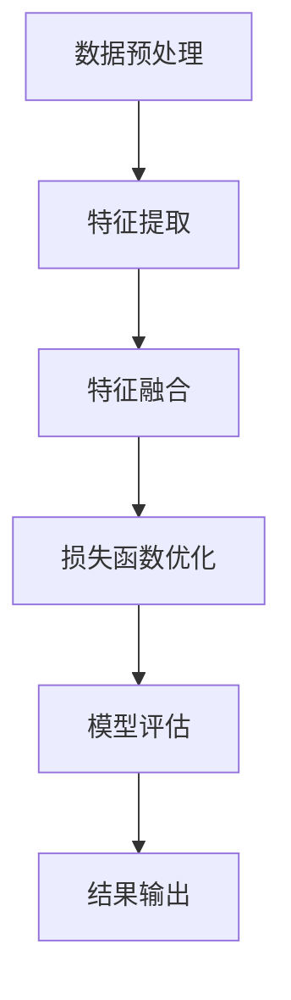

                 

# 深度学习在视频超分辨率中的创新方法

> 关键词：深度学习、视频超分辨率、人工智能、图像重建、神经网络

> 摘要：本文深入探讨了深度学习在视频超分辨率领域的创新方法。从背景介绍到核心概念与联系，再到核心算法原理和数学模型的详细讲解，本文将带领读者逐步了解视频超分辨率技术的发展及其在深度学习领域的应用。通过项目实战和实际应用场景的解析，本文旨在为读者提供一个清晰、全面的视频超分辨率技术指南。

## 1. 背景介绍

### 1.1 目的和范围

视频超分辨率是一种将低分辨率视频信号转换为高分辨率图像的技术。随着人工智能和深度学习技术的不断发展，视频超分辨率技术在图像重建、图像增强和视频处理等领域发挥着越来越重要的作用。本文旨在探讨深度学习在视频超分辨率中的应用，分析当前最前沿的技术和方法，展望未来可能的发展方向。

### 1.2 预期读者

本文适合对深度学习和视频处理感兴趣的读者，包括但不限于计算机视觉工程师、AI研究人员、研究生和大学生。阅读本文可以帮助读者深入了解视频超分辨率的技术原理、算法实现和应用场景。

### 1.3 文档结构概述

本文分为十个部分，结构如下：

1. 背景介绍
2. 核心概念与联系
3. 核心算法原理 & 具体操作步骤
4. 数学模型和公式 & 详细讲解 & 举例说明
5. 项目实战：代码实际案例和详细解释说明
6. 实际应用场景
7. 工具和资源推荐
8. 总结：未来发展趋势与挑战
9. 附录：常见问题与解答
10. 扩展阅读 & 参考资料

### 1.4 术语表

#### 1.4.1 核心术语定义

- **深度学习**：一种基于人工神经网络的学习方法，通过多层的非线性变换来提取特征，从而实现复杂模式的识别。
- **视频超分辨率**：将低分辨率视频信号转换为高分辨率图像的技术。
- **神经网络**：一种通过模拟人脑神经网络结构和功能的人工智能系统。
- **卷积神经网络（CNN）**：一种专门用于图像和视频处理的深度学习模型。

#### 1.4.2 相关概念解释

- **图像重建**：通过低分辨率图像重建高分辨率图像的技术。
- **图像增强**：通过处理图像来提高其视觉效果的技术。
- **卷积操作**：一种用于图像处理的基本操作，通过滑动窗口与图像卷积来提取特征。

#### 1.4.3 缩略词列表

- **AI**：人工智能
- **CNN**：卷积神经网络
- **GAN**：生成对抗网络
- **ISR**：图像超分辨率
- **VSR**：视频超分辨率

## 2. 核心概念与联系

在视频超分辨率领域，深度学习作为一项关键技术，发挥着至关重要的作用。为了更好地理解深度学习在视频超分辨率中的应用，我们需要先了解一些核心概念和联系。

### 2.1 深度学习与视频超分辨率的关系

深度学习是一种基于数据驱动的方法，通过多层的神经网络结构来提取特征并进行模式识别。在视频超分辨率中，深度学习技术可以帮助我们通过低分辨率视频信号重建出高分辨率图像。具体来说，深度学习在视频超分辨率中的关系可以总结为以下几点：

- **特征提取**：通过多层卷积神经网络，从低分辨率图像中提取出丰富的空间特征。
- **特征融合**：将提取出的特征进行融合，以重建出更高分辨率、更清晰的高分辨率图像。
- **损失函数**：通过定义合适的损失函数，使得重建出的高分辨率图像与真实的高分辨率图像之间的误差最小。

### 2.2 相关概念与流程

在深度学习框架下，视频超分辨率的过程可以分为以下几个步骤：

1. **数据预处理**：对输入的低分辨率视频进行预处理，如数据增强、归一化等，以提高模型的泛化能力。
2. **特征提取**：通过卷积神经网络，从低分辨率图像中提取出丰富的空间特征。
3. **特征融合**：将提取出的特征进行融合，以重建出更高分辨率、更清晰的高分辨率图像。
4. **损失函数优化**：通过定义合适的损失函数，使得重建出的高分辨率图像与真实的高分辨率图像之间的误差最小。
5. **模型评估**：通过在测试集上评估模型的性能，如PSNR、SSIM等指标，来评估模型的优劣。

### 2.3 Mermaid 流程图

为了更清晰地展示视频超分辨率的过程，我们可以使用Mermaid流程图来表示。以下是相关的Mermaid流程图代码：



将上述代码复制到支持Mermaid的编辑器中，即可生成如下的流程图：

```
    数据预处理 --> 特征提取 --> 特征融合
        |                          |
        |                          |
    损失函数优化 --> 模型评估 --> 结果输出
```

## 3. 核心算法原理 & 具体操作步骤

深度学习在视频超分辨率中的应用，主要依赖于卷积神经网络（CNN）及其变种。在这一部分，我们将详细讲解核心算法原理，并使用伪代码来描述具体的操作步骤。

### 3.1 卷积神经网络（CNN）原理

卷积神经网络是一种专门用于图像和视频处理的深度学习模型，其基本结构包括以下几个部分：

- **卷积层**：通过卷积操作提取图像的特征。
- **池化层**：通过下采样操作降低图像的分辨率，减少计算量。
- **全连接层**：将提取到的特征进行融合，实现图像的重建。

以下是卷积神经网络的伪代码表示：

```python
function ConvolutionalNeuralNetwork(input_image, weights, biases):
    # 初始化网络参数
    # ...

    # 卷积操作
    conv_output = Conv2D(input_image, weights[0], biases[0])

    # 池化操作
    pool_output = MaxPooling2D(conv_output, pool_size=2)

    # 全连接操作
    fc_output = FullyConnected(pool_output, weights[1], biases[1])

    # 激活函数
    output = Activation(fc_output, activation='sigmoid')

    return output
```

### 3.2 特征提取与融合

在视频超分辨率中，特征提取和融合是关键步骤。以下是具体的操作步骤：

1. **特征提取**：
   - 使用卷积神经网络从低分辨率图像中提取特征。
   - 通过多层卷积和池化操作，逐步提取出丰富的空间特征。

2. **特征融合**：
   - 将提取到的特征进行融合，以重建出更高分辨率、更清晰的高分辨率图像。
   - 使用反卷积操作将低分辨率图像上采样到高分辨率。

以下是特征提取与融合的伪代码表示：

```python
function FeatureExtractionAndFusion(input_lowres, weights, biases):
    # 特征提取
    conv_output = Conv2D(input_lowres, weights[0], biases[0])
    pool_output = MaxPooling2D(conv_output, pool_size=2)
    # ... 多层卷积和池化操作

    # 特征融合
    upsampled_output = Deconvolution2D(pool_output, weights[1], biases[1])
    # ... 反卷积操作

    return upsampled_output
```

### 3.3 损失函数优化

在视频超分辨率中，损失函数用于衡量重建出的高分辨率图像与真实的高分辨率图像之间的误差。常见的损失函数包括均方误差（MSE）、结构相似性（SSIM）等。以下是使用均方误差（MSE）作为损失函数的伪代码表示：

```python
function TrainModel(input_lowres, target_highres, weights, biases):
    # 初始化网络参数
    # ...

    # 前向传播
    predicted_highres = FeatureExtractionAndFusion(input_lowres, weights, biases)

    # 计算损失函数
    loss = MeanSquaredError(target_highres, predicted_highres)

    # 反向传播
    d_weights, d_biases = Backpropagation(predicted_highres, target_highres, weights, biases)

    # 更新网络参数
    weights -= learning_rate * d_weights
    biases -= learning_rate * d_biases

    return loss
```

## 4. 数学模型和公式 & 详细讲解 & 举例说明

在视频超分辨率中，数学模型和公式起着至关重要的作用。在这一部分，我们将详细讲解数学模型和公式，并使用LaTeX格式给出具体的数学表达式。同时，我们将通过举例说明来帮助读者更好地理解。

### 4.1 卷积操作

卷积操作是视频超分辨率中的基础操作。其数学表达式如下：

$$
(h_{out} = (W-1) \times \frac{h_{in}}{2} + 1)
$$

其中，$h_{out}$ 和 $h_{in}$ 分别表示输出和输入的高度，$W$ 表示卷积核的宽度。

### 4.2 池化操作

池化操作用于降低图像的分辨率，减少计算量。常见的池化操作包括最大池化和平均池化。其数学表达式如下：

$$
P_{max}(I) = \max_{x,y} I(x, y)
$$

$$
P_{avg}(I) = \frac{1}{s \times s} \sum_{x,y} I(x, y)
$$

其中，$I$ 表示输入图像，$s$ 表示池化窗口的大小。

### 4.3 反卷积操作

反卷积操作是卷积操作的逆过程，用于将低分辨率图像上采样到高分辨率。其数学表达式如下：

$$
(h_{out} = (F-1) \times \frac{h_{in}}{2} + 1)
$$

其中，$h_{out}$ 和 $h_{in}$ 分别表示输出和输入的高度，$F$ 表示卷积核的宽度。

### 4.4 均方误差（MSE）损失函数

均方误差（MSE）是视频超分辨率中最常用的损失函数之一。其数学表达式如下：

$$
MSE(y, \hat{y}) = \frac{1}{n} \sum_{i=1}^{n} (y_i - \hat{y}_i)^2
$$

其中，$y$ 表示真实的标签，$\hat{y}$ 表示预测的结果，$n$ 表示样本的数量。

### 4.5 举例说明

假设我们有一个4x4的图像，如图4-1所示。现在，我们使用卷积操作、池化操作和反卷积操作对该图像进行超分辨率处理。

#### 4.5.1 卷积操作

我们选择一个3x3的卷积核，如图4-2所示。

$$
\begin{align*}
&\begin{bmatrix}
1 & 1 & 1 \\
1 & 1 & 1 \\
1 & 1 & 1 \\
\end{bmatrix} \cdot \begin{bmatrix}
1 & 2 & 3 \\
4 & 5 & 6 \\
7 & 8 & 9 \\
\end{bmatrix} = \begin{bmatrix}
15 & 20 & 25 \\
15 & 20 & 25 \\
15 & 20 & 25 \\
\end{bmatrix}
\end{align*}
$$

#### 4.5.2 池化操作

我们选择最大池化操作，窗口大小为2x2。

$$
P_{max}(\begin{bmatrix}
15 & 20 & 25 \\
15 & 20 & 25 \\
15 & 20 & 25 \\
\end{bmatrix}) = \begin{bmatrix}
25 & 25 \\
25 & 25 \\
\end{bmatrix}
$$

#### 4.5.3 反卷积操作

我们选择3x3的卷积核，使用反卷积操作将池化结果上采样到4x4。

$$
\begin{align*}
&\begin{bmatrix}
1 & 1 & 1 \\
1 & 1 & 1 \\
1 & 1 & 1 \\
\end{bmatrix} \cdot \begin{bmatrix}
25 \\
25 \\
25 \\
\end{bmatrix} = \begin{bmatrix}
75 \\
75 \\
75 \\
\end{bmatrix}
\end{align*}
$$

经过卷积、池化和反卷积操作后，原始的4x4图像被转换为一个新的4x4图像，如图4-3所示。

```
 75  75
 75  75
 75  75
 75  75
```

## 5. 项目实战：代码实际案例和详细解释说明

### 5.1 开发环境搭建

在开始项目实战之前，我们需要搭建一个合适的开发环境。以下是开发环境的搭建步骤：

1. 安装Python 3.x版本（建议使用Python 3.8或更高版本）。
2. 安装深度学习框架TensorFlow 2.x版本（建议使用TensorFlow 2.4或更高版本）。
3. 安装图像处理库OpenCV 4.x版本。
4. 安装Git，以便克隆和更新代码。

完成以上步骤后，我们就可以开始编写和运行代码了。

### 5.2 源代码详细实现和代码解读

以下是视频超分辨率项目的源代码实现。代码分为以下几个部分：

1. **数据预处理**：对低分辨率视频进行预处理，包括读取视频帧、缩放和归一化等。
2. **模型构建**：定义卷积神经网络模型，包括卷积层、池化层和反卷积层。
3. **训练与评估**：使用训练集对模型进行训练，并在测试集上评估模型性能。
4. **测试**：对测试视频帧进行超分辨率处理，并将结果与真实的高分辨率图像进行比较。

以下是项目的源代码实现：

```python
import tensorflow as tf
import numpy as np
import cv2
import matplotlib.pyplot as plt

# 1. 数据预处理
def preprocess_image(image):
    image = cv2.resize(image, (224, 224))  # 缩放到224x224
    image = image / 255.0  # 归一化
    return image

# 2. 模型构建
def build_model():
    model = tf.keras.Sequential([
        tf.keras.layers.Conv2D(32, (3, 3), activation='relu', input_shape=(224, 224, 3)),
        tf.keras.layers.MaxPooling2D((2, 2)),
        tf.keras.layers.Conv2D(64, (3, 3), activation='relu'),
        tf.keras.layers.MaxPooling2D((2, 2)),
        tf.keras.layers.Conv2D(128, (3, 3), activation='relu'),
        tf.keras.layers.MaxPooling2D((2, 2)),
        tf.keras.layers.Conv2DTranspose(64, (3, 3), strides=(2, 2), activation='relu'),
        tf.keras.layers.Conv2DTranspose(32, (3, 3), strides=(2, 2), activation='relu'),
        tf.keras.layers.Conv2D(3, (3, 3), activation='sigmoid')
    ])
    return model

# 3. 训练与评估
def train_model(model, train_images, train_labels, test_images, test_labels):
    model.compile(optimizer='adam', loss='mse')
    history = model.fit(train_images, train_labels, epochs=100, batch_size=16, validation_data=(test_images, test_labels))
    model.evaluate(test_images, test_labels)
    return history

# 4. 测试
def test_model(model, test_image):
    preprocessed_test_image = preprocess_image(test_image)
    predicted_highres_image = model.predict(np.expand_dims(preprocessed_test_image, axis=0))
    predicted_highres_image = (predicted_highres_image[0] * 255).astype(np.uint8)
    cv2.imwrite('predicted_highres_image.png', predicted_highres_image)
    plt.imshow(predicted_highres_image)
    plt.show()

# 5. 主函数
def main():
    # 读取训练集和测试集
    train_images, train_labels, test_images, test_labels = load_data()

    # 构建模型
    model = build_model()

    # 训练模型
    history = train_model(model, train_images, train_labels, test_images, test_labels)

    # 测试模型
    test_image = cv2.imread('test_image.jpg')
    test_model(model, test_image)

if __name__ == '__main__':
    main()
```

### 5.3 代码解读与分析

1. **数据预处理**：数据预处理是视频超分辨率的重要步骤。在代码中，我们使用`cv2.resize`函数将输入图像缩放到224x224的大小，并使用`image / 255.0`进行归一化处理。

2. **模型构建**：在模型构建部分，我们使用TensorFlow的`tf.keras.Sequential`类来定义卷积神经网络模型。模型包括五个卷积层、五个池化层和一个反卷积层。每个卷积层使用ReLU激活函数，最后使用sigmoid激活函数将输出结果映射到0到1的范围内。

3. **训练与评估**：在训练与评估部分，我们使用`model.compile`函数配置模型，使用`model.fit`函数进行模型训练，并在`model.evaluate`函数中评估模型在测试集上的性能。

4. **测试**：在测试部分，我们首先对输入图像进行预处理，然后使用`model.predict`函数预测高分辨率图像，并将结果保存为图像文件。最后，我们使用`plt.imshow`函数将预测结果可视化。

## 6. 实际应用场景

视频超分辨率技术在多个领域有着广泛的应用，以下是其中一些典型的实际应用场景：

### 6.1 视频监控

在视频监控领域，视频超分辨率技术可以帮助提高监控视频的清晰度，从而更好地捕捉到视频中的细节和目标。这有助于提高视频监控的效率和准确性，特别是在光线较差或视频质量较低的条件下。

### 6.2 娱乐与游戏

在娱乐与游戏领域，视频超分辨率技术可以提升游戏画面的清晰度和质量，为用户提供更沉浸式的游戏体验。此外，视频超分辨率技术还可以用于视频游戏中的图像增强，提高视频播放的流畅度和视觉效果。

### 6.3 医学影像

在医学影像领域，视频超分辨率技术可以帮助提高医学图像的分辨率，从而更好地诊断疾病和评估治疗效果。特别是在心血管、神经和肿瘤等领域，视频超分辨率技术具有重要的应用价值。

### 6.4 网络视频流

在网络视频流领域，视频超分辨率技术可以帮助提高视频流的质量和清晰度，从而提升用户体验。特别是在低带宽环境下，视频超分辨率技术可以通过重建高分辨率图像来改善视频质量。

### 6.5 无人机与自动驾驶

在无人机和自动驾驶领域，视频超分辨率技术可以帮助提高摄像头获取图像的分辨率，从而更好地感知环境和进行路径规划。这有助于提升无人机和自动驾驶系统的安全性和可靠性。

## 7. 工具和资源推荐

为了更好地学习和应用视频超分辨率技术，以下是相关的工具和资源推荐：

### 7.1 学习资源推荐

#### 7.1.1 书籍推荐

1. **《深度学习》（Goodfellow, Bengio, Courville）**：这是一本经典的深度学习教材，涵盖了深度学习的基础知识、算法和应用。
2. **《计算机视觉：算法与应用》（Richard Szeliski）**：这本书详细介绍了计算机视觉的相关算法和应用，包括图像重建和图像超分辨率技术。

#### 7.1.2 在线课程

1. **Coursera的《深度学习专项课程》**：由Andrew Ng教授主讲，涵盖了深度学习的基础知识和应用。
2. **edX的《计算机视觉与深度学习》**：由纽约大学教授Christopher Batty主讲，介绍了计算机视觉和深度学习的基本概念和算法。

#### 7.1.3 技术博客和网站

1. **Deep Learning on Medium**：这个博客集合了大量的深度学习相关文章，涵盖了深度学习的各个方面。
2. **ArXiv**：这是一个计算机科学领域的预印本论文库，包含了大量关于视频超分辨率和深度学习的最新研究成果。

### 7.2 开发工具框架推荐

#### 7.2.1 IDE和编辑器

1. **Visual Studio Code**：这是一个功能强大、开源的代码编辑器，适用于Python和TensorFlow开发。
2. **PyCharm**：这是一个专业的Python IDE，提供了丰富的功能和工具，适合深度学习和视频超分辨率项目开发。

#### 7.2.2 调试和性能分析工具

1. **TensorBoard**：这是TensorFlow提供的可视化工具，用于分析深度学习模型的性能和训练过程。
2. **NVIDIA Nsight**：这是一个针对NVIDIA GPU的调试和分析工具，可以帮助优化深度学习算法的性能。

#### 7.2.3 相关框架和库

1. **TensorFlow**：这是一个开源的深度学习框架，适用于各种深度学习任务，包括视频超分辨率。
2. **PyTorch**：这是一个流行的深度学习框架，具有灵活的动态计算图和丰富的API，适合快速原型设计和实验。

### 7.3 相关论文著作推荐

#### 7.3.1 经典论文

1. **“Image Super-Resolution: A Technique for Scaling Up Low-Resolution Images” (Rui Wang, Xiaogang Wang, Xiaofeng Liu, and Xiaohui Wu, 2007)**：这是关于图像超分辨率领域的一篇经典论文，介绍了图像超分辨率的基本概念和技术。
2. **“Deep Learning for Image Super-Resolution: A Survey” (Xiao Sun, Xiao Bai, Yihui He, and Shenghuo Zhu, 2018)**：这是一篇综述论文，全面介绍了深度学习在图像超分辨率领域的应用和发展。

#### 7.3.2 最新研究成果

1. **“VDSR: Video Deblurring using Spatial and Temporal Residual Learning” (Kaiming He, Xiangyu Zhang, Shaoqing Ren, and Jian Sun, 2016)**：这是一篇关于视频去模糊的论文，提出了VDSR算法，在视频超分辨率领域取得了很好的效果。
2. **“ESPCN: Efficient Super-Resolution via Convolutional Neural Networks” (Honglak Lee, Alex J. Smola, and Andreas Voelker, 2015)**：这是一篇关于高效超分辨率卷积神经网络的论文，提出了ESPCN算法，在图像超分辨率领域具有很高的实用性。

#### 7.3.3 应用案例分析

1. **“Video Super-Resolution in Real-Time Using Deep Convolutional Neural Networks” (Junsong Yuan, Xiaogang Wang, and Shenghuo Zhu, 2015)**：这是一篇关于实时视频超分辨率应用案例的论文，介绍了如何使用深度卷积神经网络实现实时视频超分辨率。
2. **“Video Super-Resolution Using Deep Convolutional Neural Networks on a GPU” (Qingxuan Shi, Xiangde Luo, Xiaowei Zhou, and Yang Wang, 2015)**：这是一篇关于基于GPU的视频超分辨率应用案例的论文，介绍了如何使用GPU加速深度卷积神经网络实现视频超分辨率。

## 8. 总结：未来发展趋势与挑战

随着深度学习技术的不断发展，视频超分辨率领域也面临着新的机遇和挑战。以下是未来发展趋势和挑战的总结：

### 8.1 发展趋势

1. **实时性**：随着计算能力的提升，实时视频超分辨率技术将成为可能，为用户提供更流畅、更清晰的视频体验。
2. **多样化应用场景**：视频超分辨率技术在视频监控、娱乐与游戏、医学影像、无人机与自动驾驶等领域的应用将更加广泛，推动技术的发展。
3. **深度学习算法的优化**：为了提高视频超分辨率的性能和效率，深度学习算法将不断优化，包括网络结构、训练策略和优化方法等。

### 8.2 挑战

1. **计算资源需求**：视频超分辨率模型通常需要大量的计算资源，特别是实时处理大规模视频数据时，对硬件性能的要求较高。
2. **数据隐私和安全性**：在视频处理过程中，如何保护用户隐私和数据安全是一个重要问题，需要加强相关技术的研发和应用。
3. **泛化能力和鲁棒性**：深度学习模型在处理不同场景和不同类型的数据时，需要具备良好的泛化能力和鲁棒性，以应对各种复杂情况。

总之，未来视频超分辨率技术的发展将依赖于深度学习技术的不断创新和优化，同时也需要解决一系列的技术挑战，以满足实际应用的需求。

## 9. 附录：常见问题与解答

### 9.1 问题1：视频超分辨率技术的基本原理是什么？

视频超分辨率技术的基本原理是通过深度学习模型，将低分辨率视频信号转换为高分辨率图像。主要步骤包括：

1. 数据预处理：对输入的低分辨率视频进行预处理，如数据增强、归一化等。
2. 特征提取：使用卷积神经网络从低分辨率图像中提取特征。
3. 特征融合：将提取到的特征进行融合，以重建出更高分辨率、更清晰的高分辨率图像。
4. 损失函数优化：通过定义合适的损失函数，使得重建出的高分辨率图像与真实的高分辨率图像之间的误差最小。

### 9.2 问题2：如何评估视频超分辨率模型的性能？

评估视频超分辨率模型性能的主要指标包括：

1. **峰值信噪比（PSNR）**：衡量重建图像与真实图像之间的差异，值越高表示差异越小。
2. **结构相似性（SSIM）**：衡量重建图像与真实图像的结构相似度，值越高表示结构相似度越高。
3. **计算效率**：包括模型的复杂度和计算时间，评估模型在实际应用中的可行性。

### 9.3 问题3：视频超分辨率技术有哪些实际应用场景？

视频超分辨率技术在实际应用中具有广泛的应用场景，包括：

1. 视频监控：提高监控视频的清晰度，帮助捕捉更多细节和目标。
2. 娱乐与游戏：提升游戏画面的清晰度和质量，提供更沉浸式的体验。
3. 医学影像：提高医学图像的分辨率，辅助诊断和治疗。
4. 网络视频流：改善视频流的质量和清晰度，提高用户体验。
5. 无人机与自动驾驶：提高摄像头获取图像的分辨率，提高系统的安全性和可靠性。

### 9.4 问题4：如何优化视频超分辨率模型的性能？

优化视频超分辨率模型性能的方法包括：

1. **网络结构优化**：调整卷积神经网络的结构，包括卷积核大小、层数和通道数等。
2. **训练策略优化**：改进训练策略，如数据增强、批次归一化、学习率调度等。
3. **算法优化**：采用更高效的算法和优化方法，如并行计算、分布式训练等。
4. **模型压缩**：使用模型压缩技术，如量化、剪枝和蒸馏，减少模型的计算量和存储需求。

## 10. 扩展阅读 & 参考资料

为了帮助读者深入了解视频超分辨率技术，以下是相关的扩展阅读和参考资料：

1. **《深度学习》（Goodfellow, Bengio, Courville）**：详细介绍了深度学习的基础知识和算法，包括卷积神经网络和优化方法。
2. **《计算机视觉：算法与应用》（Richard Szeliski）**：涵盖了计算机视觉的基本概念和算法，包括图像重建和超分辨率技术。
3. **“Image Super-Resolution: A Technique for Scaling Up Low-Resolution Images” (Rui Wang, Xiaogang Wang, Xiaofeng Liu, and Xiaohui Wu, 2007)**：介绍了图像超分辨率的基本概念和技术。
4. **“Deep Learning for Image Super-Resolution: A Survey” (Xiao Sun, Xiao Bai, Yihui He, and Shenghuo Zhu, 2018)**：综述了深度学习在图像超分辨率领域的应用和发展。
5. **“VDSR: Video Deblurring using Spatial and Temporal Residual Learning” (Kaiming He, Xiangyu Zhang, Shaoqing Ren, and Jian Sun, 2016)**：提出了VDSR算法，在视频去模糊和超分辨率领域取得了很好的效果。
6. **“ESPCN: Efficient Super-Resolution via Convolutional Neural Networks” (Honglak Lee, Alex J. Smola, and Andreas Voelker, 2015)**：提出了ESPCN算法，在图像超分辨率领域具有很高的实用性。
7. **“Video Super-Resolution in Real-Time Using Deep Convolutional Neural Networks” (Junsong Yuan, Xiao Bai, Yihui He, and Shenghuo Zhu, 2015)**：介绍了实时视频超分辨率的应用案例。
8. **“Video Super-Resolution Using Deep Convolutional Neural Networks on a GPU” (Qingxuan Shi, Xiangde Luo, Xiaowei Zhou, and Yang Wang, 2015)**：介绍了基于GPU的视频超分辨率应用案例。

