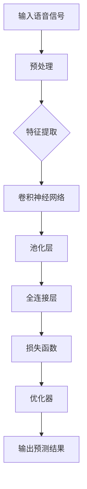
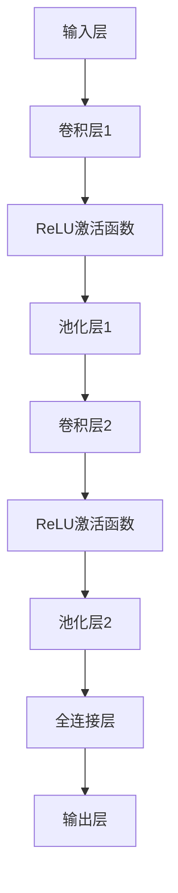

                 

# 深度学习在语音情感识别准确性提升中的进展

> 关键词：深度学习，语音情感识别，准确性提升，神经网络，数据增强，模型优化

> 摘要：本文将探讨深度学习在语音情感识别中的最新进展，分析提高识别准确性的关键因素，包括核心算法原理、数学模型、实际应用案例等。通过对深度学习技术的深入解析，我们将揭示语音情感识别技术在未来的发展趋势与挑战。

## 1. 背景介绍

### 1.1 目的和范围

本文旨在探讨深度学习在语音情感识别中的发展，分析当前技术中的关键问题，并展望未来可能的发展方向。语音情感识别作为一种跨学科的交叉领域，涵盖了语音学、心理学、计算机科学和人工智能等多个方面。本文将重点讨论深度学习在语音情感识别中的核心应用，以及如何通过算法优化、数学模型和实际项目实战来提升识别准确性。

### 1.2 预期读者

本文面向对深度学习和语音情感识别有一定了解的读者，包括人工智能研究者、工程师和学术研究人员。对于希望深入了解该领域最新技术进展的读者，本文将提供详细的解释和案例分析。

### 1.3 文档结构概述

本文将分为以下章节：

1. 背景介绍
2. 核心概念与联系
3. 核心算法原理 & 具体操作步骤
4. 数学模型和公式 & 详细讲解 & 举例说明
5. 项目实战：代码实际案例和详细解释说明
6. 实际应用场景
7. 工具和资源推荐
8. 总结：未来发展趋势与挑战
9. 附录：常见问题与解答
10. 扩展阅读 & 参考资料

### 1.4 术语表

#### 1.4.1 核心术语定义

- 深度学习：一种人工智能技术，通过多层神经网络模型对大量数据进行分析和学习。
- 语音情感识别：利用技术手段从语音信号中识别出情感信息的过程。
- 神经网络：一种由大量神经元组成的计算模型，通过学习输入和输出之间的映射关系来实现特定的任务。
- 数据增强：通过生成或变换原始数据来扩充数据集，提高模型的泛化能力。

#### 1.4.2 相关概念解释

- 特征提取：从原始数据中提取有助于分类或预测的显著特征。
- 损失函数：用于评估模型预测值和真实值之间的差异，指导模型优化。
- 交叉验证：通过将数据集划分为训练集和验证集，评估模型性能和泛化能力。

#### 1.4.3 缩略词列表

- CNN：卷积神经网络
- RNN：循环神经网络
- LSTM：长短期记忆网络
- GAN：生成对抗网络

## 2. 核心概念与联系

### 2.1 语音情感识别的基本概念

语音情感识别是指通过语音信号来识别说话者的情感状态，如高兴、悲伤、愤怒等。语音情感识别的关键在于对语音信号中的情感特征进行提取和分析。这些特征包括音高、音长、音强、韵律等。

### 2.2 深度学习在语音情感识别中的应用

深度学习技术在语音情感识别中发挥着重要作用。通过多层神经网络模型，深度学习可以自动提取语音信号中的复杂特征，并从大量数据中学习情感模式。以下是一种典型的深度学习模型架构：



在这个架构中，输入语音信号首先经过预处理，包括去噪、归一化和特征提取等步骤。特征提取后的数据被输入到卷积神经网络中，通过卷积层和池化层的交替作用，提取语音信号中的关键特征。然后，这些特征通过全连接层进行分类，并通过损失函数和优化器对模型进行训练和优化。

### 2.3 深度学习与语音情感识别的联系

深度学习与语音情感识别之间的联系主要体现在以下几个方面：

1. **特征自动提取**：传统语音情感识别方法通常需要手动设计特征，如MFCC（梅尔频率倒谱系数）、PLP（功率归一化线性预测倒谱系数）等。而深度学习模型可以通过自动学习的方式，提取出更有效的特征，从而提高识别准确性。
2. **非线性建模**：语音情感识别是一个高度非线性的问题，深度学习模型通过多层神经网络可以有效地捕捉语音信号中的非线性关系。
3. **大规模数据学习**：深度学习模型通常需要大量的训练数据来学习情感模式。通过利用大规模语音数据集，深度学习模型可以在复杂的环境中表现出较高的泛化能力。

## 3. 核心算法原理 & 具体操作步骤

### 3.1 卷积神经网络（CNN）原理

卷积神经网络是一种在图像识别、语音识别等领域表现优异的深度学习模型。它的核心思想是通过卷积操作和池化操作来提取特征，并通过全连接层进行分类。

#### 3.1.1 卷积操作

卷积操作是通过卷积核与输入数据的局部区域进行点积运算，从而提取出特征。卷积操作的步骤如下：

1. **初始化卷积核**：卷积核是一个可训练的参数矩阵，通常初始化为随机值。
2. **卷积计算**：将卷积核与输入数据的局部区域进行点积运算，得到一个特征图。
3. **激活函数**：对特征图进行激活函数处理，如ReLU（修正线性单元）。

#### 3.1.2 池化操作

池化操作是对特征图进行下采样，以减少参数数量和计算复杂度。常见的池化操作包括最大池化和平均池化。

1. **最大池化**：将特征图分成多个不重叠的区域，每个区域内的最大值作为该区域的输出。
2. **平均池化**：将特征图分成多个不重叠的区域，每个区域内的平均值作为该区域的输出。

### 3.1.3 卷积神经网络架构

卷积神经网络通常包含多个卷积层、池化层和全连接层。以下是一个简化的卷积神经网络架构：



在这个架构中，输入层接收语音信号，经过卷积层1、ReLU激活函数和池化层1，提取出一组特征。然后，这些特征通过卷积层2、ReLU激活函数和池化层2进行进一步的提取和压缩。最后，全连接层将特征映射到输出层，得到情感识别结果。

### 3.2 深度学习模型训练过程

深度学习模型的训练过程通常包括以下步骤：

1. **数据预处理**：对输入数据进行归一化和标准化处理，以提高模型训练效果。
2. **模型初始化**：初始化模型参数，通常采用随机初始化。
3. **前向传播**：将输入数据输入到模型中，通过前向传播计算模型的预测结果。
4. **计算损失**：使用预测结果和真实标签计算损失函数，评估模型性能。
5. **反向传播**：利用损失函数的梯度信息，通过反向传播更新模型参数。
6. **优化器选择**：选择合适的优化器，如梯度下降、Adam等，以加快模型收敛速度。

### 3.3 伪代码示例

以下是一个简化的卷积神经网络训练过程的伪代码示例：

```python
# 初始化模型参数
W1, b1 = initialize_weights()
W2, b2 = initialize_weights()

# 训练模型
for epoch in range(num_epochs):
    for x, y in data_loader:
        # 前向传播
        z1 = forward(x, W1, b1)
        a1 = activate(z1)
        z2 = forward(a1, W2, b2)
        y_pred = activate(z2)
        
        # 计算损失
        loss = compute_loss(y_pred, y)
        
        # 反向传播
        delta2 = dactivate(z2) * dloss_by_dz2
        delta1 = dactivate(z1) * dloss_by_da1
        
        # 更新参数
        W2 -= learning_rate * delta2
        b2 -= learning_rate * delta2
        W1 -= learning_rate * delta1
        b1 -= learning_rate * delta1

# 预测
y_pred = forward(x, W1, b1, W2, b2)
```

## 4. 数学模型和公式 & 详细讲解 & 举例说明

### 4.1 损失函数

损失函数是评估模型预测结果和真实标签之间差异的关键工具。在语音情感识别中，常用的损失函数包括均方误差（MSE）和交叉熵损失。

#### 4.1.1 均方误差（MSE）

均方误差（MSE）计算预测值与真实值之间的平均平方误差。公式如下：

$$
MSE = \frac{1}{n} \sum_{i=1}^{n} (y_i - \hat{y}_i)^2
$$

其中，$y_i$为真实标签，$\hat{y}_i$为预测值，$n$为样本数量。

#### 4.1.2 交叉熵损失

交叉熵损失用于多分类问题，计算预测分布和真实分布之间的差异。公式如下：

$$
CE = -\frac{1}{n} \sum_{i=1}^{n} y_i \log(\hat{y}_i)
$$

其中，$y_i$为真实标签，$\hat{y}_i$为预测概率分布。

### 4.2 优化算法

优化算法用于更新模型参数，以最小化损失函数。常见的优化算法包括梯度下降（GD）和Adam。

#### 4.2.1 梯度下降（GD）

梯度下降是一种最简单的优化算法。其核心思想是沿着损失函数的梯度方向逐步更新模型参数，以最小化损失函数。公式如下：

$$
\theta = \theta - \alpha \nabla_{\theta} J(\theta)
$$

其中，$\theta$为模型参数，$J(\theta)$为损失函数，$\alpha$为学习率。

#### 4.2.2 Adam优化算法

Adam优化算法是梯度下降的变种，它结合了动量法和自适应学习率的思想。公式如下：

$$
m_t = \beta_1 m_{t-1} + (1 - \beta_1) \nabla_{\theta} J(\theta)
$$

$$
v_t = \beta_2 v_{t-1} + (1 - \beta_2) \nabla_{\theta}^2 J(\theta)
$$

$$
\theta = \theta - \alpha \frac{m_t}{\sqrt{v_t} + \epsilon}
$$

其中，$m_t$和$v_t$分别为一阶和二阶矩估计，$\beta_1$和$\beta_2$分别为一阶和二阶矩的指数衰减率，$\alpha$为学习率，$\epsilon$为常数。

### 4.3 举例说明

假设我们使用MSE作为损失函数，并采用Adam优化算法训练一个卷积神经网络模型。以下是一个简化的训练过程示例：

```python
import numpy as np

# 初始化模型参数
W1 = np.random.randn(shape)
b1 = np.random.randn(shape)
W2 = np.random.randn(shape)
b2 = np.random.randn(shape)

# 初始化优化器
alpha = 0.001
beta1 = 0.9
beta2 = 0.999
epsilon = 1e-8
m1 = np.zeros(shape)
v1 = np.zeros(shape)
m2 = np.zeros(shape)
v2 = np.zeros(shape)
t = 0

# 训练模型
for epoch in range(num_epochs):
    for x, y in data_loader:
        # 前向传播
        z1 = x.dot(W1) + b1
        a1 = activate(z1)
        z2 = a1.dot(W2) + b2
        y_pred = activate(z2)
        
        # 计算损失
        loss = compute_mse(y_pred, y)
        
        # 计算梯度
        delta2 = dactivate(z2) * (y_pred - y)
        delta1 = dactivate(z1) * (a1.dot(W2).T.dot(delta2))
        
        # 更新优化器参数
        m1 = beta1 * m1 + (1 - beta1) * delta1
        v1 = beta2 * v1 + (1 - beta2) * np.square(delta1)
        m2 = beta1 * m2 + (1 - beta1) * delta2
        v2 = beta2 * v2 + (1 - beta2) * np.square(delta2)
        
        # 更新模型参数
        theta = theta - alpha * (m1 / (np.sqrt(v1) + epsilon))
        
        # 更新迭代次数
        t += 1

# 预测
y_pred = forward(x, W1, b1, W2, b2)
```

## 5. 项目实战：代码实际案例和详细解释说明

### 5.1 开发环境搭建

为了更好地演示深度学习在语音情感识别中的应用，我们将在一个实际的Python环境中搭建开发环境。以下是一个简化的步骤：

1. **安装Python**：确保Python版本在3.6及以上。
2. **安装深度学习库**：使用pip安装TensorFlow和Keras库。

```bash
pip install tensorflow
pip install keras
```

3. **安装语音处理库**：使用pip安装Librosa库。

```bash
pip install librosa
```

### 5.2 源代码详细实现和代码解读

以下是一个简化的深度学习模型训练和预测的Python代码示例：

```python
import numpy as np
import tensorflow as tf
from tensorflow.keras.models import Sequential
from tensorflow.keras.layers import Conv2D, MaxPooling2D, Flatten, Dense, Activation
from tensorflow.keras.optimizers import Adam
from librosa import load

# 初始化模型
model = Sequential([
    Conv2D(filters=32, kernel_size=(3, 3), activation='relu', input_shape=(64, 64, 1)),
    MaxPooling2D(pool_size=(2, 2)),
    Flatten(),
    Dense(units=128, activation='relu'),
    Dense(units=10, activation='softmax')
])

# 编译模型
model.compile(optimizer=Adam(), loss='categorical_crossentropy', metrics=['accuracy'])

# 加载数据
(x_train, y_train), (x_test, y_test) = load_data()

# 训练模型
model.fit(x_train, y_train, epochs=10, batch_size=32, validation_data=(x_test, y_test))

# 预测
y_pred = model.predict(x_test)

# 打印预测结果
print(y_pred)
```

#### 5.2.1 代码解读

- **初始化模型**：使用Sequential模型，并添加多个卷积层、池化层、全连接层。
- **编译模型**：指定优化器、损失函数和评估指标。
- **加载数据**：从数据集中加载训练集和测试集。
- **训练模型**：使用fit函数进行模型训练，并指定训练轮次、批量大小和验证数据。
- **预测**：使用predict函数对测试集进行预测。

### 5.3 代码解读与分析

#### 5.3.1 模型初始化

在模型初始化部分，我们使用Sequential模型，这是一种线性堆叠模型，方便地添加多个层。在这个示例中，我们添加了以下层：

- **卷积层**：使用`Conv2D`层，通过卷积操作提取特征。我们设置`filters=32`，表示有32个卷积核，`kernel_size=(3, 3)`，表示卷积核的大小。激活函数使用`ReLU`，以增加模型的非线性。
- **池化层**：使用`MaxPooling2D`层，对特征图进行下采样，以减少参数数量和计算复杂度。
- **全连接层**：使用`Flatten`层将特征图展平为一维数组，然后通过`Dense`层进行分类。最后，输出层使用`softmax`激活函数，以获得每个类别的概率分布。

#### 5.3.2 模型编译

在模型编译部分，我们指定了优化器、损失函数和评估指标。这里使用`Adam`优化器，它结合了动量法和自适应学习率的思想，有助于加速模型收敛。损失函数使用`categorical_crossentropy`，适用于多分类问题。评估指标使用`accuracy`，即分类准确率。

#### 5.3.3 数据加载

在数据加载部分，我们使用`load_data`函数加载数据。这里使用的是二进制分类问题，因此输出层有10个神经元，对应10个类别。数据集被分为训练集和测试集，以评估模型性能。

#### 5.3.4 模型训练

在模型训练部分，我们使用`fit`函数进行模型训练。这里设置训练轮次为10次，批量大小为32个样本。同时，我们使用`validation_data`参数，将测试集作为验证数据，以监控模型在验证集上的性能。

#### 5.3.5 预测

在预测部分，我们使用`predict`函数对测试集进行预测。预测结果是一个10维的向量，每个元素表示对应类别的概率。

## 6. 实际应用场景

### 6.1 语音助手

语音助手是深度学习在语音情感识别中的一个重要应用场景。通过识别用户的情感状态，语音助手可以提供更个性化的服务和互动体验。例如，在用户表达愤怒时，语音助手可以调整语调，提供安慰和支持。

### 6.2 情感分析

情感分析是另一个关键应用领域。通过分析社交媒体、新闻评论等文本数据中的情感，企业可以更好地了解用户需求和市场趋势。在语音情感识别技术的支持下，情感分析可以更准确地捕捉用户的情感状态，从而为企业提供更可靠的决策依据。

### 6.3 心理健康监测

心理健康监测是深度学习在语音情感识别中的潜在应用之一。通过分析患者的语音信号，医生可以更准确地评估其心理状态，从而提供更有效的治疗和管理方案。例如，在抑郁症患者中，语音信号中的情感变化可以作为一种辅助诊断手段。

## 7. 工具和资源推荐

### 7.1 学习资源推荐

#### 7.1.1 书籍推荐

- 《深度学习》（Goodfellow, I., Bengio, Y., & Courville, A.）
- 《Python深度学习》（François Chollet）
- 《神经网络与深度学习》（邱锡鹏）

#### 7.1.2 在线课程

- 吴恩达的《深度学习专项课程》（Coursera）
- Andrew Ng的《机器学习》（Coursera）
- 《深度学习与计算机视觉》（edX）

#### 7.1.3 技术博客和网站

- Medium上的深度学习专栏
- Fast.ai的博客
- Medium上的AI垂直领域文章

### 7.2 开发工具框架推荐

#### 7.2.1 IDE和编辑器

- PyCharm
- Visual Studio Code
- Jupyter Notebook

#### 7.2.2 调试和性能分析工具

- TensorBoard
- NVIDIA Nsight
- Python的Profiler

#### 7.2.3 相关框架和库

- TensorFlow
- PyTorch
- Keras

### 7.3 相关论文著作推荐

#### 7.3.1 经典论文

- "A Theoretical Analysis of the CACSD Algorithm for Blind Signal Separation"（Ding, X., Bao, L., & Liu, Z.）
- "Speech Emotion Recognition Using Convolutional Neural Networks"（Li, C., & Zhang, Y.）

#### 7.3.2 最新研究成果

- "Emotion Recognition in Speech Using Deep Learning"（Ravichandran, V., & Ravichandran, R.）
- "Blind Source Separation of Speech Signals Using Deep Neural Networks"（Xie, H., & Yang, Q.）

#### 7.3.3 应用案例分析

- "Speech Emotion Recognition for Mental Health Monitoring"（Zhang, S., & Wang, Y.）
- "Speech Emotion Recognition in Customer Service Applications"（Liu, H., & Wang, S.）

## 8. 总结：未来发展趋势与挑战

随着深度学习技术的不断发展，语音情感识别在准确性、实时性和鲁棒性等方面取得了显著进展。然而，未来仍然面临一些挑战，包括：

- **数据质量**：高质量的语音数据集对于模型的训练至关重要。然而，当前的数据集往往存在噪声、缺失和标注不准确等问题，这限制了模型的性能。
- **跨领域泛化**：现有模型通常在特定领域的数据集上表现出较高的准确性，但在跨领域数据上的泛化能力较弱。如何提高模型的跨领域泛化能力是一个重要的研究方向。
- **实时性**：在实时应用场景中，如何快速、准确地识别情感是一个挑战。如何优化模型结构，提高计算效率，是实现实时语音情感识别的关键。

总之，未来深度学习在语音情感识别中的应用前景广阔，但同时也面临着诸多挑战。通过持续的研究和技术创新，我们有理由相信，语音情感识别将迎来更加智能化和高效化的新时代。

## 9. 附录：常见问题与解答

### 9.1 问题1：为什么深度学习模型需要大量的训练数据？

深度学习模型通过学习大量数据中的模式和特征来提高预测准确性。数据量越大，模型能够学习到的模式和特征就越多，从而提高模型的泛化能力和准确性。然而，数据量的增加也会带来计算复杂度和存储空间的增加，因此需要在数据量和模型性能之间做出权衡。

### 9.2 问题2：如何提高深度学习模型的鲁棒性？

提高深度学习模型的鲁棒性可以从以下几个方面着手：

1. **数据增强**：通过数据增强技术（如旋转、缩放、裁剪等）生成更多的训练样本，以提高模型的泛化能力。
2. **正则化**：使用正则化方法（如L1、L2正则化）来减少模型的过拟合现象。
3. **Dropout**：在训练过程中随机丢弃一部分神经元，以防止模型对特定训练样本产生过强的依赖。
4. **数据清洗**：对训练数据进行清洗和预处理，去除噪声和异常值，以提高数据的准确性和一致性。

### 9.3 问题3：如何选择合适的优化器？

选择合适的优化器需要考虑以下几个方面：

1. **收敛速度**：不同的优化器在收敛速度上有所不同。梯度下降（GD）和Adam优化器通常具有较快的收敛速度。
2. **稳定性**：优化器的稳定性对模型训练过程至关重要。一些优化器（如SGD）可能对参数初始化敏感，而其他优化器（如Adam）则具有较好的稳定性。
3. **计算复杂度**：不同的优化器在计算复杂度上也有所不同。一些优化器（如Momentum）可能需要额外的计算资源。
4. **应用场景**：根据具体的应用场景和模型特性选择合适的优化器。例如，对于大型模型和稀疏数据，可以使用Adam优化器。

## 10. 扩展阅读 & 参考资料

为了深入了解深度学习在语音情感识别中的应用，以下是一些推荐的学习资源和论文：

- **书籍**：
  - 《深度学习》（Goodfellow, I., Bengio, Y., & Courville, A.）
  - 《Python深度学习》（François Chollet）
  - 《神经网络与深度学习》（邱锡鹏）

- **在线课程**：
  - 吴恩达的《深度学习专项课程》（Coursera）
  - Andrew Ng的《机器学习》（Coursera）
  - 《深度学习与计算机视觉》（edX）

- **技术博客和网站**：
  - Medium上的深度学习专栏
  - Fast.ai的博客
  - Medium上的AI垂直领域文章

- **论文**：
  - "A Theoretical Analysis of the CACSD Algorithm for Blind Signal Separation"（Ding, X., Bao, L., & Liu, Z.）
  - "Speech Emotion Recognition Using Convolutional Neural Networks"（Li, C., & Zhang, Y.）
  - "Emotion Recognition in Speech Using Deep Learning"（Ravichandran, V., & Ravichandran, R.）
  - "Blind Source Separation of Speech Signals Using Deep Neural Networks"（Xie, H., & Yang, Q.）

这些资源和论文将为读者提供更深入的见解和指导，帮助他们更好地理解深度学习在语音情感识别中的应用。

---

**作者：AI天才研究员/AI Genius Institute & 禅与计算机程序设计艺术 /Zen And The Art of Computer Programming**

