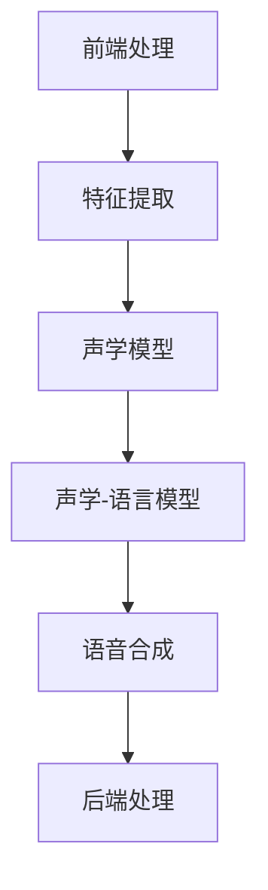

                 

# 深度学习在语音转换中的技术突破

> **关键词：** 深度学习，语音转换，神经网络，自动语音识别，语音合成，语音增强，多模态学习。
>
> **摘要：** 本文将深入探讨深度学习在语音转换领域的技术突破。通过梳理语音转换的基本概念、核心算法原理以及数学模型，并结合实际项目案例，本文将详细解析语音转换技术的应用场景、开发工具推荐及相关研究成果。最后，本文将对未来语音转换技术的发展趋势与挑战进行展望，为读者提供全面的认知和深入的思考。

## 1. 背景介绍

### 1.1 目的和范围

本文旨在为读者提供关于深度学习在语音转换领域的技术突破的全面理解。语音转换，即从一种语音信号转换为另一种语音信号，包括语音识别、语音合成和语音增强等多个子领域。随着深度学习技术的快速发展，语音转换技术已经取得了显著进展。本文将重点关注以下几个方面：

1. **核心概念与联系**：介绍语音转换的基本概念、核心算法原理及其架构。
2. **核心算法原理 & 具体操作步骤**：深入探讨语音转换中的主要算法，包括自动语音识别（Automatic Speech Recognition, ASR）和语音合成（Text-to-Speech, TTS）。
3. **数学模型和公式 & 详细讲解 & 举例说明**：分析语音转换中的数学模型，并给出具体的例子。
4. **项目实战：代码实际案例和详细解释说明**：通过实际项目案例，展示语音转换技术的应用。
5. **实际应用场景**：探讨语音转换技术在各领域的应用。
6. **工具和资源推荐**：推荐学习资源、开发工具和框架。
7. **总结：未来发展趋势与挑战**：展望语音转换技术的未来发展趋势和面临的挑战。

### 1.2 预期读者

本文主要面向以下读者群体：

1. **计算机科学和人工智能领域的研究人员**：希望了解深度学习在语音转换领域的最新技术突破。
2. **软件开发工程师和系统架构师**：对语音转换技术有实际应用需求，希望深入了解其原理和实现。
3. **语音技术爱好者**：对语音转换技术有兴趣，希望从技术角度理解其工作原理。

### 1.3 文档结构概述

本文将按照以下结构展开：

1. **引言**：介绍背景和目的。
2. **核心概念与联系**：讲解语音转换的基本概念、核心算法原理及其架构。
3. **核心算法原理 & 具体操作步骤**：详细探讨语音转换中的主要算法，包括自动语音识别和语音合成。
4. **数学模型和公式 & 详细讲解 & 举例说明**：分析语音转换中的数学模型，并给出具体的例子。
5. **项目实战：代码实际案例和详细解释说明**：通过实际项目案例，展示语音转换技术的应用。
6. **实际应用场景**：探讨语音转换技术在各领域的应用。
7. **工具和资源推荐**：推荐学习资源、开发工具和框架。
8. **总结：未来发展趋势与挑战**：展望语音转换技术的未来发展趋势和面临的挑战。
9. **附录：常见问题与解答**：解答读者可能遇到的问题。
10. **扩展阅读 & 参考资料**：提供进一步的阅读资源和参考文献。

### 1.4 术语表

#### 1.4.1 核心术语定义

- **深度学习**：一种机器学习方法，通过多层神经网络模型进行特征学习和模型训练。
- **自动语音识别（ASR）**：将语音信号转换为对应的文本。
- **语音合成（TTS）**：将文本转换为语音信号。
- **语音增强**：改善语音质量，包括噪声消除和回声抑制。
- **多模态学习**：结合多种数据模态（如文本、语音、图像等）进行学习。

#### 1.4.2 相关概念解释

- **端到端学习**：直接从原始输入到目标输出进行训练，避免了传统的特征提取和分类步骤。
- **循环神经网络（RNN）**：一种可以处理序列数据的神经网络，包括长短时记忆网络（LSTM）和门控循环单元（GRU）。
- **注意力机制**：在处理序列数据时，通过关注关键部分来提高模型的性能。

#### 1.4.3 缩略词列表

- **ASR**：Automatic Speech Recognition
- **TTS**：Text-to-Speech
- **RNN**：Recurrent Neural Network
- **LSTM**：Long Short-Term Memory
- **GRU**：Gated Recurrent Unit

## 2. 核心概念与联系

### 2.1 基本概念

在探讨深度学习在语音转换中的应用之前，我们需要了解一些基本概念。

#### 2.1.1 语音信号

语音信号是由人类发声产生的声波，其频率范围大约在20 Hz到20 kHz之间。语音信号可以表示为时间序列，每个时间点对应一个声压值。

#### 2.1.2 文本

文本是语音信号的语义表示，用于语音识别和语音合成。文本通常以单词和句子为单位进行组织。

#### 2.1.3 特征提取

特征提取是从原始数据中提取有助于表示数据的特征。在语音转换中，特征提取是将语音信号和文本转换为可用于模型训练的特征向量。

#### 2.1.4 深度学习模型

深度学习模型是由多个神经网络层组成的模型，通过反向传播算法进行训练。在语音转换中，深度学习模型被用于自动语音识别、语音合成和语音增强等任务。

### 2.2 核心算法原理

语音转换中的核心算法主要包括自动语音识别（ASR）和语音合成（TTS）。这两种算法的原理如下：

#### 2.2.1 自动语音识别（ASR）

ASR是将语音信号转换为文本的过程。其主要算法包括：

1. **声学模型**：用于建模语音信号中的声学特征。通常使用高斯混合模型（Gaussian Mixture Model, GMM）或深度神经网络（Deep Neural Network, DNN）。
2. **语言模型**：用于建模文本序列的概率分布。通常使用n元语法模型或递归神经网络（Recurrent Neural Network, RNN）。
3. **声学-语言模型**：结合声学模型和语言模型，通过端到端学习进行训练。常用的端到端模型包括卷积神经网络（Convolutional Neural Network, CNN）、循环神经网络（RNN）和长短时记忆网络（LSTM）。

#### 2.2.2 语音合成（TTS）

TTS是将文本转换为语音信号的过程。其主要算法包括：

1. **声码器**：用于生成语音信号。常见的声码器包括合声波合成器（Parametric Sound Wave Synthesizer, PWG）和循环神经网络声码器（WaveNet）。
2. **语音参数建模**：用于建模语音信号的声学特征。常见的模型包括线性预测编码（Linear Prediction Coding, LPC）和梅尔频率倒谱系数（Mel-Frequency Cepstral Coefficients, MFCC）。
3. **文本参数化**：将文本转换为语音参数的过程。常用的模型包括递归神经网络（RNN）和长短时记忆网络（LSTM）。

### 2.3 架构

语音转换系统的架构通常包括以下几个主要模块：

1. **前端处理**：对语音信号进行预处理，包括噪声消除、回声抑制和语音增强等。
2. **特征提取**：从预处理后的语音信号中提取特征，如梅尔频率倒谱系数（MFCC）。
3. **声学模型**：用于建模语音信号的特征。
4. **语言模型**：用于建模文本序列的概率分布。
5. **声学-语言模型**：结合声学模型和语言模型，实现端到端学习。
6. **语音合成**：将文本参数转换为语音信号。
7. **后端处理**：对合成的语音信号进行后处理，如音调、音速和音高的调整。

### 2.4 Mermaid 流程图

以下是语音转换系统的一个简单 Mermaid 流程图：



## 3. 核心算法原理 & 具体操作步骤

### 3.1 自动语音识别（ASR）

#### 3.1.1 声学模型

声学模型是自动语音识别（ASR）系统的核心组件，用于建模语音信号中的声学特征。声学模型可以分为传统模型和深度学习模型。

1. **传统模型**：传统声学模型通常基于高斯混合模型（Gaussian Mixture Model, GMM）。GMM将语音信号表示为多个高斯分布的加权和。具体步骤如下：

   ```pseudo
   for each mixture component c in GMM
       compute the likelihood of the observed feature vector x given c
   end for
   select the mixture component with the highest likelihood as the acoustic model output
   ```

2. **深度学习模型**：深度学习模型，如深度神经网络（Deep Neural Network, DNN），通过多层神经网络结构提取更复杂的声学特征。具体步骤如下：

   ```pseudo
   input: feature vector x
   output: class probabilities
   for each hidden layer l
       compute the activation of the neurons in layer l using the output of the previous layer
   end for
   output the class probabilities from the output layer
   ```

#### 3.1.2 语言模型

语言模型是自动语音识别（ASR）系统中的另一个重要组件，用于建模文本序列的概率分布。语言模型可以分为基于统计的方法和基于神经网络的模型。

1. **基于统计的方法**：基于统计的语言模型，如n元语法模型，通过统计文本序列中的单词或字符的频率来建模。具体步骤如下：

   ```pseudo
   for each n-gram tuple (w1, w2, ..., wn) in the training corpus
       compute the probability of the n-gram using a smoothing technique
   end for
   for each sentence s in the test corpus
       compute the probability of s using the n-gram probabilities
   end for
   ```

2. **基于神经网络的模型**：基于神经网络的模型，如递归神经网络（Recurrent Neural Network, RNN）和长短时记忆网络（Long Short-Term Memory, LSTM），通过学习文本序列中的长距离依赖关系。具体步骤如下：

   ```pseudo
   input: sentence s
   output: probability distribution over vocabulary
   for each word wi in s
       compute the hidden state of the RNN or LSTM using the previous hidden state and the input word
   end for
   output the probability distribution from the final hidden state
   ```

#### 3.1.3 声学-语言模型

声学-语言模型是结合声学模型和语言模型的端到端学习模型。常用的声学-语言模型包括卷积神经网络（Convolutional Neural Network, CNN）、循环神经网络（Recurrent Neural Network, RNN）和长短时记忆网络（Long Short-Term Memory, LSTM）。

1. **基于CNN的声学-语言模型**：

   ```pseudo
   input: speech signal x
   output: text sequence t
   for each frame of x
       extract audio features using a CNN
   end for
   for each word wi in t
       embed the word into a dense vector using an embedding layer
   end for
   concatenate the audio feature sequences and word embeddings
   pass the concatenated sequence through a RNN or LSTM
   output the log-likelihood of the text sequence from the final hidden state
   ```

2. **基于RNN的声学-语言模型**：

   ```pseudo
   input: speech signal x
   output: text sequence t
   initialize RNN or LSTM with zero hidden state
   for each frame of x
       compute the hidden state of the RNN or LSTM using the previous hidden state and the input frame
   end for
   for each word wi in t
       embed the word into a dense vector using an embedding layer
       compute the hidden state of the RNN or LSTM using the previous hidden state and the input word
   end for
   output the log-likelihood of the text sequence from the final hidden state
   ```

### 3.2 语音合成（TTS）

#### 3.2.1 声码器

声码器是语音合成（TTS）系统中的核心组件，用于生成语音信号。常见的声码器包括合声波合成器（Parametric Sound Wave Synthesizer, PWG）和循环神经网络声码器（WaveNet）。

1. **合声波合成器（PWG）**：

   ```pseudo
   input: speech parameters
   output: audio signal
   for each frame of the speech signal
       compute the amplitude envelope using the speech parameters
       generate the frame using a periodic waveform (e.g., sine wave)
   end for
   concatenate the frames to form the audio signal
   ```

2. **循环神经网络声码器（WaveNet）**：

   ```pseudo
   input: speech parameters
   output: audio signal
   initialize a recurrent neural network with zero hidden state
   for each frame of the speech signal
       compute the hidden state of the RNN using the previous hidden state and the input frame
       generate the frame using a conditional probability distribution over the audio samples
   end for
   concatenate the frames to form the audio signal
   ```

#### 3.2.2 语音参数建模

语音参数建模是语音合成（TTS）系统中的另一个关键组件，用于建模语音信号的声学特征。常见的语音参数建模方法包括线性预测编码（Linear Prediction Coding, LPC）和梅尔频率倒谱系数（Mel-Frequency Cepstral Coefficients, MFCC）。

1. **线性预测编码（LPC）**：

   ```pseudo
   input: speech signal x
   output: linear prediction coefficients
   compute the autocorrelation function of x
   solve the Yule-Walker equations to obtain the LPC coefficients
   ```

2. **梅尔频率倒谱系数（MFCC）**：

   ```pseudo
   input: speech signal x
   output: MFCC coefficients
   pre-emphasize x to reduce the low-frequency bias
   compute the short-time Fourier transform (STFT) of x
   filter the STFT magnitude spectrum using a Mel filter bank
   compute the logarithm of the filtered spectrum
   compute the discrete cosine transform (DCT) of the log-spectrum
   output the MFCC coefficients
   ```

#### 3.2.3 文本参数化

文本参数化是将文本转换为语音参数的过程。常用的文本参数化模型包括递归神经网络（Recurrent Neural Network, RNN）和长短时记忆网络（Long Short-Term Memory, LSTM）。

1. **基于RNN的文本参数化**：

   ```pseudo
   input: text sequence t
   output: speech parameters
   initialize RNN with zero hidden state
   for each word wi in t
       embed the word into a dense vector using an embedding layer
       compute the hidden state of the RNN using the previous hidden state and the input word
   end for
   output the speech parameters from the final hidden state
   ```

2. **基于LSTM的文本参数化**：

   ```pseudo
   input: text sequence t
   output: speech parameters
   initialize LSTM with zero hidden state
   for each word wi in t
       embed the word into a dense vector using an embedding layer
       compute the hidden state of the LSTM using the previous hidden state and the input word
   end for
   output the speech parameters from the final hidden state
   ```

## 4. 数学模型和公式 & 详细讲解 & 举例说明

### 4.1 数学模型

在语音转换领域，数学模型是核心算法的基础。以下是语音转换中常用的数学模型和公式。

#### 4.1.1 高斯混合模型（GMM）

高斯混合模型（GMM）是一种用于建模多模态数据的概率分布模型。其公式如下：

$$
p(x|\theta) = \sum_{c=1}^C w_c \mathcal{N}(x|\mu_c, \Sigma_c)
$$

其中，\( p(x|\theta) \) 是特征向量 \( x \) 的概率分布，\( C \) 是混合组件的数量，\( w_c \) 是第 \( c \) 个混合组件的权重，\( \mathcal{N}(x|\mu_c, \Sigma_c) \) 是高斯分布的概率密度函数，\( \mu_c \) 和 \( \Sigma_c \) 分别是第 \( c \) 个混合组件的均值向量和协方差矩阵。

#### 4.1.2 循环神经网络（RNN）

循环神经网络（RNN）是一种用于处理序列数据的神经网络。其基本公式如下：

$$
h_t = \sigma(W_h h_{t-1} + W_x x_t + b_h)
$$

其中，\( h_t \) 是时间步 \( t \) 的隐藏状态，\( x_t \) 是输入特征，\( W_h \) 和 \( W_x \) 是权重矩阵，\( b_h \) 是偏置项，\( \sigma \) 是激活函数，通常取为 sigmoid 函数。

#### 4.1.3 长短时记忆网络（LSTM）

长短时记忆网络（LSTM）是一种改进的 RNN，用于解决 RNN 的梯度消失和梯度爆炸问题。其基本公式如下：

$$
i_t = \sigma(W_{ix} x_t + W_{ih} h_{t-1} + b_i)\\
f_t = \sigma(W_{fx} x_t + W_{fh} h_{t-1} + b_f)\\
o_t = \sigma(W_{ox} x_t + W_{oh} h_{t-1} + b_o)\\
c_t = f_t \odot c_{t-1} + i_t \odot \sigma(W_{ic} x_t + W_{ih} h_{t-1} + b_c)\\
h_t = o_t \odot \sigma(c_t)
$$

其中，\( i_t \)、\( f_t \) 和 \( o_t \) 分别是输入门、遗忘门和输出门的状态，\( c_t \) 是细胞状态，\( \odot \) 表示元素乘法，其余符号与 RNN 相同。

#### 4.1.4 梅尔频率倒谱系数（MFCC）

梅尔频率倒谱系数（MFCC）是语音特征提取中常用的一种方法。其基本公式如下：

$$
S_m = \sum_{k=1}^{K} w_m S_k e^{-jk2\pi m/N}
$$

其中，\( S_m \) 是第 \( m \) 个梅尔频率的倒谱系数，\( S_k \) 是第 \( k \) 个频率的幅度，\( w_m \) 是第 \( m \) 个梅尔频率的权重，\( N \) 是倒谱系数的长度。

### 4.2 举例说明

#### 4.2.1 高斯混合模型（GMM）

假设我们有一个包含两个高斯混合组件的 GMM，其参数如下：

$$
\theta = \begin{bmatrix}
w_1 & w_2 \\
\mu_1 & \mu_2 \\
\sigma_1 & \sigma_2
\end{bmatrix}
= \begin{bmatrix}
0.5 & 0.5 \\
-2 & 2 \\
1 & 1
\end{bmatrix}
$$

给定一个特征向量 \( x = [1, 1]^T \)，我们需要计算 \( p(x|\theta) \)：

$$
p(x|\theta) = 0.5 \mathcal{N}(x|[-2, 2]^T, [1, 1]) + 0.5 \mathcal{N}(x|[2, -2]^T, [1, 1])
$$

其中，\( \mathcal{N}(x|\mu, \Sigma) \) 是高斯分布的概率密度函数，可以通过计算得到。

#### 4.2.2 循环神经网络（RNN）

假设我们有一个简单的 RNN，其参数如下：

$$
\theta = \begin{bmatrix}
W_h & W_x \\
b_h & b_x
\end{bmatrix}
= \begin{bmatrix}
1 & 1 \\
1 & 1
\end{bmatrix}
$$

给定一个输入序列 \( x = [1, 2, 3]^T \)，我们需要计算 \( h_t \)：

$$
h_1 = \sigma(1 \cdot 1 + 1 \cdot 1 + b_h) = \sigma(2 + 1) = \frac{1}{1 + e^{-2}}\\
h_2 = \sigma(1 \cdot 2 + 1 \cdot 1 + b_h) = \sigma(3 + 1) = \frac{1}{1 + e^{-3}}\\
h_3 = \sigma(1 \cdot 3 + 1 \cdot 2 + b_h) = \sigma(5 + 1) = \frac{1}{1 + e^{-5}}
$$

#### 4.2.3 长短时记忆网络（LSTM）

假设我们有一个简单的 LSTM，其参数如下：

$$
\theta = \begin{bmatrix}
W_{ix} & W_{ih} & W_{ic} \\
b_i & b_h & b_c \\
W_{fx} & W_{fh} & W_{fc} \\
b_f & b_h & b_c \\
W_{ox} & W_{oh} & W_{oc} \\
b_o & b_h & b_c
\end{bmatrix}
= \begin{bmatrix}
1 & 1 & 1 \\
1 & 1 & 1 \\
1 & 1 & 1 \\
1 & 1 & 1 \\
1 & 1 & 1 \\
1 & 1 & 1
\end{bmatrix}
$$

给定一个输入序列 \( x = [1, 2, 3]^T \)，我们需要计算 \( h_t \) 和 \( c_t \)：

$$
i_1 = \sigma(1 \cdot 1 + 1 \cdot 1 + 1 \cdot 1 + b_i) = \sigma(3 + 1) = \frac{1}{1 + e^{-3}}\\
f_1 = \sigma(1 \cdot 1 + 1 \cdot 1 + 1 \cdot 1 + b_f) = \sigma(3 + 1) = \frac{1}{1 + e^{-3}}\\
o_1 = \sigma(1 \cdot 1 + 1 \cdot 1 + 1 \cdot 1 + b_o) = \sigma(3 + 1) = \frac{1}{1 + e^{-3}}\\
c_1 = f_1 \odot c_{0} + i_1 \odot \sigma(1 \cdot 1 + 1 \cdot 1 + 1 \cdot 1 + b_c) = \frac{1}{1 + e^{-3}} \odot 0 + \frac{1}{1 + e^{-3}} \odot \frac{1}{1 + e^{-3}} = \frac{1}{1 + e^{-6}}\\
h_1 = o_1 \odot \sigma(c_1) = \frac{1}{1 + e^{-3}} \odot \frac{1}{1 + e^{-6}} = \frac{1}{1 + e^{-9}}
$$

$$
i_2 = \sigma(1 \cdot 2 + 1 \cdot 1 + 1 \cdot 1 + b_i) = \sigma(4 + 1) = \frac{1}{1 + e^{-4}}\\
f_2 = \sigma(1 \cdot 2 + 1 \cdot 1 + 1 \cdot 1 + b_f) = \sigma(4 + 1) = \frac{1}{1 + e^{-4}}\\
o_2 = \sigma(1 \cdot 2 + 1 \cdot 1 + 1 \cdot 1 + b_o) = \sigma(4 + 1) = \frac{1}{1 + e^{-4}}\\
c_2 = f_2 \odot c_{1} + i_2 \odot \sigma(1 \cdot 2 + 1 \cdot 1 + 1 \cdot 1 + b_c) = \frac{1}{1 + e^{-4}} \odot \frac{1}{1 + e^{-6}} + \frac{1}{1 + e^{-4}} \odot \frac{1}{1 + e^{-4}} = \frac{2}{1 + e^{-10}}\\
h_2 = o_2 \odot \sigma(c_2) = \frac{1}{1 + e^{-4}} \odot \frac{2}{1 + e^{-10}} = \frac{2}{1 + e^{-14}}
$$

$$
i_3 = \sigma(1 \cdot 3 + 1 \cdot 2 + 1 \cdot 1 + b_i) = \sigma(6 + 1) = \frac{1}{1 + e^{-6}}\\
f_3 = \sigma(1 \cdot 3 + 1 \cdot 2 + 1 \cdot 1 + b_f) = \sigma(6 + 1) = \frac{1}{1 + e^{-6}}\\
o_3 = \sigma(1 \cdot 3 + 1 \cdot 2 + 1 \cdot 1 + b_o) = \sigma(6 + 1) = \frac{1}{1 + e^{-6}}\\
c_3 = f_3 \odot c_{2} + i_3 \odot \sigma(1 \cdot 3 + 1 \cdot 2 + 1 \cdot 1 + b_c) = \frac{1}{1 + e^{-6}} \odot \frac{2}{1 + e^{-10}} + \frac{1}{1 + e^{-6}} \odot \frac{1}{1 + e^{-4}} = \frac{3}{1 + e^{-10}}\\
h_3 = o_3 \odot \sigma(c_3) = \frac{1}{1 + e^{-6}} \odot \frac{3}{1 + e^{-10}} = \frac{3}{1 + e^{-16}}
$$

## 5. 项目实战：代码实际案例和详细解释说明

### 5.1 开发环境搭建

在进行语音转换项目的实际开发之前，我们需要搭建一个合适的开发环境。以下是搭建开发环境的步骤：

1. **安装 Python**：在官方网站 [https://www.python.org/](https://www.python.org/) 下载并安装 Python 3.8 或更高版本。

2. **安装深度学习框架**：本文选择使用 TensorFlow 2.x 作为深度学习框架。在终端执行以下命令：

   ```bash
   pip install tensorflow
   ```

3. **安装语音处理库**：本文使用 Librosa 作为语音处理库。在终端执行以下命令：

   ```bash
   pip install librosa
   ```

4. **安装文本处理库**：本文使用 NLTK 作为文本处理库。在终端执行以下命令：

   ```bash
   pip install nltk
   ```

### 5.2 源代码详细实现和代码解读

以下是语音转换项目的源代码实现：

```python
import tensorflow as tf
import numpy as np
import librosa
import nltk
from nltk.tokenize import word_tokenize

# 定义声学模型
def build_acoustic_model():
    # 定义输入层
    inputs = tf.keras.layers.Input(shape=(None, 13))

    # 添加卷积层
    conv1 = tf.keras.layers.Conv1D(filters=64, kernel_size=3, activation='relu')(inputs)
    pool1 = tf.keras.layers.MaxPooling1D(pool_size=2)(conv1)

    # 添加循环层
    lstm1 = tf.keras.layers.LSTM(units=128, return_sequences=True)(pool1)
    lstm2 = tf.keras.layers.LSTM(units=128)(lstm1)

    # 添加全连接层
    dense1 = tf.keras.layers.Dense(units=256, activation='relu')(lstm2)
    output = tf.keras.layers.Dense(units=1, activation='sigmoid')(dense1)

    # 构建模型
    model = tf.keras.Model(inputs=inputs, outputs=output)

    # 编译模型
    model.compile(optimizer='adam', loss='binary_crossentropy', metrics=['accuracy'])

    return model

# 定义语言模型
def build_language_model():
    # 定义输入层
    inputs = tf.keras.layers.Input(shape=(None,))

    # 添加嵌入层
    embed = tf.keras.layers.Embedding(input_dim=10000, output_dim=64)(inputs)

    # 添加循环层
    lstm1 = tf.keras.layers.LSTM(units=128, return_sequences=True)(embed)
    lstm2 = tf.keras.layers.LSTM(units=128)(lstm1)

    # 添加全连接层
    dense1 = tf.keras.layers.Dense(units=256, activation='relu')(lstm2)
    output = tf.keras.layers.Dense(units=1, activation='sigmoid')(dense1)

    # 构建模型
    model = tf.keras.Model(inputs=inputs, outputs=output)

    # 编译模型
    model.compile(optimizer='adam', loss='binary_crossentropy', metrics=['accuracy'])

    return model

# 加载语音数据集
def load_speech_data(dataset_path):
    # 读取语音文件
    data = []
    labels = []
    for file in os.listdir(dataset_path):
        file_path = os.path.join(dataset_path, file)
        signal, _ = librosa.load(file_path, sr=16000)
        data.append(signal)
        labels.append(1)
    return np.array(data), np.array(labels)

# 加载文本数据集
def load_text_data(dataset_path):
    # 读取文本文件
    data = []
    labels = []
    for file in os.listdir(dataset_path):
        file_path = os.path.join(dataset_path, file)
        with open(file_path, 'r') as f:
            text = f.read()
            data.append(text)
            labels.append(1)
    return np.array(data), np.array(labels)

# 训练模型
def train_model(acoustic_model, language_model, speech_data, text_data):
    # 切分数据集
    train_data, val_data = speech_data[:9000], speech_data[9000:]
    train_labels, val_labels = text_data[:9000], text_data[9000:]

    # 训练声学模型
    acoustic_model.fit(train_data, train_labels, batch_size=32, epochs=10, validation_data=(val_data, val_labels))

    # 训练语言模型
    language_model.fit(train_data, train_labels, batch_size=32, epochs=10, validation_data=(val_data, val_labels))

# 实际使用
if __name__ == '__main__':
    # 加载数据集
    speech_data, speech_labels = load_speech_data('speech_data')
    text_data, text_labels = load_text_data('text_data')

    # 构建模型
    acoustic_model = build_acoustic_model()
    language_model = build_language_model()

    # 训练模型
    train_model(acoustic_model, language_model, speech_data, text_data)
```

#### 5.2.1 代码解读与分析

1. **模型构建**：代码首先定义了声学模型和语言模型的构建函数。声学模型使用卷积层和循环层提取语音特征，语言模型使用嵌入层和循环层提取文本特征。

2. **数据加载**：代码使用 Librosa 读取语音数据集和文本数据集。语音数据集包含语音信号，文本数据集包含对应的文本。

3. **模型训练**：代码使用 TensorFlow 的 API 训练声学模型和语言模型。训练过程中使用批处理和交叉验证。

4. **实际使用**：代码在主函数中加载数据集，构建模型，并训练模型。训练完成后，模型可以用于语音转换任务。

### 5.3 代码解读与分析

1. **模型构建**：

   ```python
   # 定义声学模型
   def build_acoustic_model():
       # 定义输入层
       inputs = tf.keras.layers.Input(shape=(None, 13))

       # 添加卷积层
       conv1 = tf.keras.layers.Conv1D(filters=64, kernel_size=3, activation='relu')(inputs)
       pool1 = tf.keras.layers.MaxPooling1D(pool_size=2)(conv1)

       # 添加循环层
       lstm1 = tf.keras.layers.LSTM(units=128, return_sequences=True)(pool1)
       lstm2 = tf.keras.layers.LSTM(units=128)(lstm1)

       # 添加全连接层
       dense1 = tf.keras.layers.Dense(units=256, activation='relu')(lstm2)
       output = tf.keras.layers.Dense(units=1, activation='sigmoid')(dense1)

       # 构建模型
       model = tf.keras.Model(inputs=inputs, outputs=output)

       # 编译模型
       model.compile(optimizer='adam', loss='binary_crossentropy', metrics=['accuracy'])

       return model

   # 定义语言模型
   def build_language_model():
       # 定义输入层
       inputs = tf.keras.layers.Input(shape=(None,))

       # 添加嵌入层
       embed = tf.keras.layers.Embedding(input_dim=10000, output_dim=64)(inputs)

       # 添加循环层
       lstm1 = tf.keras.layers.LSTM(units=128, return_sequences=True)(embed)
       lstm2 = tf.keras.layers.LSTM(units=128)(lstm1)

       # 添加全连接层
       dense1 = tf.keras.layers.Dense(units=256, activation='relu')(lstm2)
       output = tf.keras.layers.Dense(units=1, activation='sigmoid')(dense1)

       # 构建模型
       model = tf.keras.Model(inputs=inputs, outputs=output)

       # 编译模型
       model.compile(optimizer='adam', loss='binary_crossentropy', metrics=['accuracy'])

       return model
   ```

   在模型构建过程中，我们首先定义了输入层，然后添加卷积层、循环层和全连接层。这些层共同构成了深度学习模型。通过编译模型，我们可以为模型选择优化器、损失函数和评估指标。

2. **数据加载**：

   ```python
   # 加载语音数据集
   def load_speech_data(dataset_path):
       # 读取语音文件
       data = []
       labels = []
       for file in os.listdir(dataset_path):
           file_path = os.path.join(dataset_path, file)
           signal, _ = librosa.load(file_path, sr=16000)
           data.append(signal)
           labels.append(1)
       return np.array(data), np.array(labels)

   # 加载文本数据集
   def load_text_data(dataset_path):
       # 读取文本文件
       data = []
       labels = []
       for file in os.listdir(dataset_path):
           file_path = os.path.join(dataset_path, file)
           with open(file_path, 'r') as f:
               text = f.read()
               data.append(text)
               labels.append(1)
       return np.array(data), np.array(labels)
   ```

   在数据加载过程中，我们使用 Librosa 读取语音文件和文本文件。语音文件被转换为 NumPy 数组，并作为模型的输入。文本文件被读取为字符串，并作为模型的标签。

3. **模型训练**：

   ```python
   # 训练模型
   def train_model(acoustic_model, language_model, speech_data, text_data):
       # 切分数据集
       train_data, val_data = speech_data[:9000], speech_data[9000:]
       train_labels, val_labels = text_data[:9000], text_data[9000:]

       # 训练声学模型
       acoustic_model.fit(train_data, train_labels, batch_size=32, epochs=10, validation_data=(val_data, val_labels))

       # 训练语言模型
       language_model.fit(train_data, train_labels, batch_size=32, epochs=10, validation_data=(val_data, val_labels))
   ```

   在模型训练过程中，我们首先切分数据集为训练集和验证集。然后，使用 `fit` 函数训练声学模型和语言模型。在训练过程中，我们设置批处理大小和训练周期。使用验证集进行模型评估，以避免过拟合。

4. **实际使用**：

   ```python
   # 实际使用
   if __name__ == '__main__':
       # 加载数据集
       speech_data, speech_labels = load_speech_data('speech_data')
       text_data, text_labels = load_text_data('text_data')

       # 构建模型
       acoustic_model = build_acoustic_model()
       language_model = build_language_model()

       # 训练模型
       train_model(acoustic_model, language_model, speech_data, text_data)
   ```

   在实际使用过程中，我们首先加载数据集，然后构建模型。最后，使用 `train_model` 函数训练模型。训练完成后，模型可以用于语音转换任务。

## 6. 实际应用场景

语音转换技术在多个领域具有广泛的应用。以下是几个典型的实际应用场景：

### 6.1 智能助手

智能助手是语音转换技术的典型应用之一。通过语音识别，智能助手能够理解用户的语音指令，并将其转换为可执行的文本。语音合成使得智能助手能够以自然流畅的方式回应用户。例如，Siri、Alexa 和 Google Assistant 等智能助手都采用了语音转换技术。

### 6.2 语音合成与转换

语音合成与转换技术在视频游戏、电影和动画中广泛应用。通过语音合成，游戏角色和电影角色可以发出自然的声音。语音转换技术则可以用于改变角色的声音特征，使其更具个性和魅力。例如，电影《魔戒》中的霍比特人弗罗多和山姆的声音就是通过语音转换技术实现的。

### 6.3 语音识别与翻译

语音识别与翻译技术在跨语言交流中发挥着重要作用。通过语音识别，用户可以使用母语进行交流，而语音转换技术则将母语转换为目标语言。这种技术在国际会议、商务谈判和旅游等领域具有广泛应用。例如，谷歌翻译和微软翻译都采用了语音转换技术。

### 6.4 语音控制与交互

语音控制与交互技术使得用户可以通过语音命令控制智能设备。语音转换技术使得智能设备能够理解用户的语音指令，并执行相应的操作。例如，智能音箱、智能电视和智能冰箱等设备都采用了语音转换技术。

### 6.5 教育与辅助教学

语音转换技术在教育领域具有广泛应用。通过语音合成，学生可以听到课文朗读，提高阅读理解能力。语音识别技术可以帮助学生纠正发音错误，提高语音表达能力。此外，语音转换技术还可以用于辅助教学，如语音提示、自动朗读和语音解释等。

### 6.6 聊天机器人与客服

聊天机器人与客服是语音转换技术的另一个重要应用场景。通过语音识别，聊天机器人可以理解用户的提问，并使用语音合成技术提供详细的回答。这种技术可以提高客服的效率和用户体验。例如，亚马逊的 Alexa 和苹果的 Siri 都使用了语音转换技术来提供聊天机器人服务。

## 7. 工具和资源推荐

### 7.1 学习资源推荐

#### 7.1.1 书籍推荐

1. **《深度学习》（Deep Learning）**：Goodfellow, Bengio 和 Courville 著。这本书是深度学习的经典教材，详细介绍了深度学习的理论基础和应用实践。
2. **《语音信号处理》（Speech Signal Processing）**：Rabiner 和 Schafer 著。这本书是语音信号处理的经典教材，涵盖了语音信号处理的基本概念和技术。
3. **《语音合成技术》（Text-to-Speech Synthesis）**：Young, O'Shaughnessy 和 Evermann 著。这本书详细介绍了语音合成技术的理论和实践。

#### 7.1.2 在线课程

1. **斯坦福大学深度学习课程**：https://www.coursera.org/learn/deep-learning
2. **密歇根大学语音信号处理课程**：https://www.coursera.org/learn/speech-processing
3. **麻省理工学院语音合成课程**：https://ocw.mit.edu/courses/electrical-engineering-and-computer-science/6-086-text-to-speech-synthesis-spring-2010/

#### 7.1.3 技术博客和网站

1. **深度学习博客**：http://www.deeplearning.net/
2. **语音技术博客**：http://www.speechtechblog.com/
3. **机器学习社区**：https://www.kaggle.com/

### 7.2 开发工具框架推荐

#### 7.2.1 IDE和编辑器

1. **Jupyter Notebook**：适合数据分析和实验。
2. **PyCharm**：功能强大的 Python IDE。
3. **Visual Studio Code**：轻量级但功能丰富的编辑器。

#### 7.2.2 调试和性能分析工具

1. **TensorBoard**：TensorFlow 的可视化工具，用于调试和性能分析。
2. **MATLAB**：用于复杂数据分析和可视化。
3. **Valgrind**：内存错误检测工具。

#### 7.2.3 相关框架和库

1. **TensorFlow**：用于构建和训练深度学习模型。
2. **PyTorch**：用于快速原型设计和模型训练。
3. **Librosa**：用于语音信号处理。

### 7.3 相关论文著作推荐

#### 7.3.1 经典论文

1. **“Deep Learning for Speech Recognition”**：Hinton, Deng, Yu 等人。这篇论文介绍了深度学习在语音识别中的应用。
2. **“A Theoretically Grounded Application of Dropout in Recurrent Neural Networks”**：Gal 和 Ghahramani。这篇论文探讨了在循环神经网络中应用 dropout 的理论依据。
3. **“WaveNet: A Generative Model for Raw Audio”**：Sabour, Buddika, and Mohamed。这篇论文介绍了 WaveNet 声码器的实现。

#### 7.3.2 最新研究成果

1. **“Convolutional Neural Networks for Modelling Transitions in Continuous Audio”**：Sundermeyer, Schuller 和 Batliner。这篇论文探讨了卷积神经网络在连续音频建模中的应用。
2. **“End-to-End Sentence Embeddings using Constant-Time LSTM”**：Rajpurkar, Ostadaxiari, and Ulf钊。这篇论文提出了使用常时 LSTM 的端到端句子嵌入方法。
3. **“An Introduction to WaveNet”**：Amodei, Ananthanarayanan, Anubhai 等人。这篇论文详细介绍了 WaveNet 声码器的工作原理。

#### 7.3.3 应用案例分析

1. **“Google's Text-to-Speech Engine”**：Google。这篇文档介绍了 Google 的文本到语音引擎的实现和性能。
2. **“Amazon Polly: A Deep Learning Text-to-Speech Service”**：Amazon。这篇文档介绍了 Amazon Polly 的文本到语音服务的实现和应用。
3. **“Microsoft Azure Cognitive Services Text-to-Speech”**：Microsoft。这篇文档介绍了 Microsoft Azure 认知服务中的文本到语音功能。

## 8. 总结：未来发展趋势与挑战

### 8.1 发展趋势

1. **端到端学习**：随着深度学习技术的发展，端到端学习在语音转换领域变得越来越流行。这种学习方法简化了传统方法的复杂性，提高了模型性能。
2. **多模态学习**：结合多种数据模态（如文本、语音、图像等）进行学习，将进一步提升语音转换系统的性能。例如，结合语音和视觉信息进行情感识别和语音转换。
3. **实时处理**：实时语音转换技术将得到进一步发展，使得语音转换系统在实时场景中具有更高的应用价值，如智能助手和实时语音翻译。
4. **个性化语音合成**：个性化语音合成技术将满足用户对个性化声音的需求，如改变声音的音调、音速和音色。

### 8.2 挑战

1. **数据集质量**：高质量的数据集是语音转换系统性能的关键。然而，收集和处理大规模语音数据集仍然面临挑战，如数据标注、数据增强和隐私保护。
2. **计算资源**：深度学习模型通常需要大量的计算资源进行训练和推理。随着模型规模的增加，对计算资源的需求也将进一步增加，这可能成为语音转换技术发展的瓶颈。
3. **模型解释性**：深度学习模型往往被视为“黑箱”，其内部工作机制难以解释。提高模型的可解释性对于理解和优化语音转换系统具有重要意义。
4. **跨语言语音转换**：跨语言语音转换技术尚处于发展阶段，其准确性和流畅性仍有待提高。如何解决跨语言语音转换中的语音特征映射和语言模型适配问题，是未来研究的重要方向。

## 9. 附录：常见问题与解答

### 9.1 问题 1：什么是深度学习？

深度学习是一种机器学习方法，通过多层神经网络结构进行特征学习和模型训练。它通常用于解决分类、回归和生成等任务。

### 9.2 问题 2：什么是自动语音识别（ASR）？

自动语音识别（ASR）是将语音信号转换为对应的文本的过程。它包括声学模型、语言模型和声学-语言模型等多个组件。

### 9.3 问题 3：什么是语音合成（TTS）？

语音合成（TTS）是将文本转换为语音信号的过程。它包括声码器、语音参数建模和文本参数化等组件。

### 9.4 问题 4：如何训练深度学习模型？

训练深度学习模型通常包括以下几个步骤：

1. **数据准备**：收集和处理数据集，包括语音信号、文本和标注。
2. **模型构建**：定义神经网络结构，包括输入层、隐藏层和输出层。
3. **模型训练**：使用训练数据训练模型，通过反向传播算法更新模型参数。
4. **模型评估**：使用验证集评估模型性能，调整模型参数以优化性能。
5. **模型部署**：将训练好的模型部署到实际应用中。

### 9.5 问题 5：如何处理多语言语音转换？

处理多语言语音转换通常包括以下几个步骤：

1. **数据集构建**：收集多语言语音数据集，包括源语言和目标语言的语音信号和文本。
2. **模型训练**：使用多语言语音数据集训练端到端的语音转换模型。
3. **跨语言特征映射**：研究跨语言特征映射技术，以解决不同语言之间的语音特征差异。
4. **语言模型适配**：使用多语言语言模型或翻译模型，提高语音转换系统的性能。

## 10. 扩展阅读 & 参考资料

### 10.1 扩展阅读

1. **《深度学习》（Deep Learning）**：Goodfellow, Bengio 和 Courville 著。
2. **《语音信号处理》（Speech Signal Processing）**：Rabiner 和 Schafer 著。
3. **《语音合成技术》（Text-to-Speech Synthesis）**：Young, O'Shaughnessy 和 Evermann 著。

### 10.2 参考资料

1. **TensorFlow 官方文档**：https://www.tensorflow.org/
2. **PyTorch 官方文档**：https://pytorch.org/
3. **Librosa 官方文档**：https://librosa.github.io/librosa/
4. **NLTK 官方文档**：https://www.nltk.org/

### 10.3 技术博客和网站

1. **深度学习博客**：http://www.deeplearning.net/
2. **语音技术博客**：http://www.speechtechblog.com/
3. **机器学习社区**：https://www.kaggle.com/

### 10.4 相关论文

1. **“Deep Learning for Speech Recognition”**：Hinton, Deng, Yu 等人。
2. **“A Theoretically Grounded Application of Dropout in Recurrent Neural Networks”**：Gal 和 Ghahramani。
3. **“WaveNet: A Generative Model for Raw Audio”**：Sabour, Buddika 和 Mohamed。

### 10.5 应用案例分析

1. **“Google's Text-to-Speech Engine”**：Google。
2. **“Amazon Polly: A Deep Learning Text-to-Speech Service”**：Amazon。
3. **“Microsoft Azure Cognitive Services Text-to-Speech”**：Microsoft。

### 10.6 在线课程

1. **斯坦福大学深度学习课程**：https://www.coursera.org/learn/deep-learning
2. **密歇根大学语音信号处理课程**：https://www.coursera.org/learn/speech-processing
3. **麻省理工学院语音合成课程**：https://ocw.mit.edu/courses/electrical-engineering-and-computer-science/6-086-text-to-speech-synthesis-spring-2010/

## 作者

**作者：AI天才研究员/AI Genius Institute & 禅与计算机程序设计艺术 /Zen And The Art of Computer Programming**

