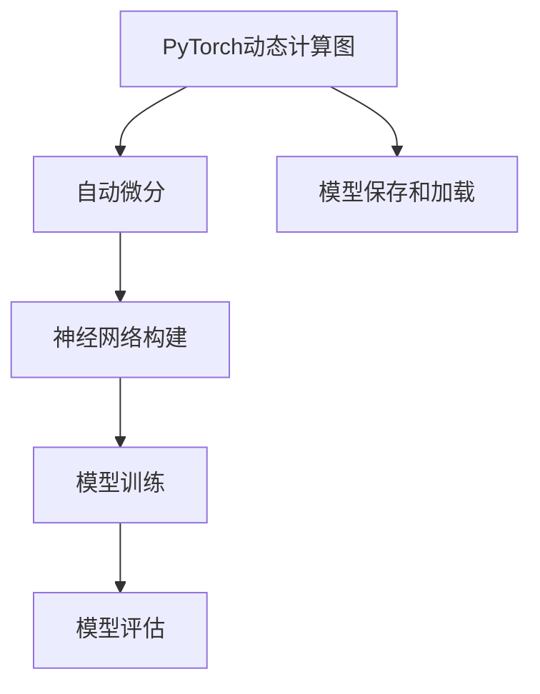
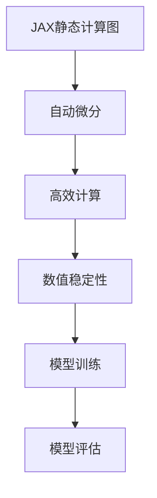

                 

# 深度学习框架选择指南：PyTorch还是JAX？

> **关键词**：深度学习，框架选择，PyTorch，JAX，性能，易用性，生态

> **摘要**：本文将深入探讨两个在深度学习领域中备受欢迎的框架：PyTorch和JAX。我们将分析它们的核心概念、算法原理、数学模型、实际应用场景，并提供代码实现和详细解释。通过对比性能、易用性以及生态，帮助您做出更明智的选择。

## 1. 背景介绍

### 1.1 目的和范围

本文旨在为深度学习开发者提供一份详细的框架选择指南，帮助您了解PyTorch和JAX这两大深度学习框架，并根据自己的需求和偏好做出选择。

### 1.2 预期读者

本文面向有深度学习基础的读者，特别是希望了解不同框架特性和优缺点的开发者。

### 1.3 文档结构概述

本文结构如下：

1. 背景介绍
2. 核心概念与联系
3. 核心算法原理 & 具体操作步骤
4. 数学模型和公式 & 详细讲解 & 举例说明
5. 项目实战：代码实际案例和详细解释说明
6. 实际应用场景
7. 工具和资源推荐
8. 总结：未来发展趋势与挑战
9. 附录：常见问题与解答
10. 扩展阅读 & 参考资料

### 1.4 术语表

#### 1.4.1 核心术语定义

- **深度学习框架**：用于实现深度学习模型的软件库和工具集。
- **动态图**：在运行时动态构建的计算图。
- **静态图**：在运行前构建好的计算图。

#### 1.4.2 相关概念解释

- **反向传播**：一种用于训练神经网络的算法，通过计算梯度来调整网络参数。
- **自动微分**：计算函数的导数的过程，可以自动对计算图进行微分。

#### 1.4.3 缩略词列表

- **GPU**：图形处理单元（Graphics Processing Unit）
- **CPU**：中央处理单元（Central Processing Unit）
- **DL**：深度学习（Deep Learning）
- **ML**：机器学习（Machine Learning）
- **AI**：人工智能（Artificial Intelligence）

## 2. 核心概念与联系

深度学习框架是构建、训练和优化深度神经网络的核心工具。它们提供了丰富的API和内置函数，简化了复杂计算过程。本文将重点关注PyTorch和JAX这两个框架。

### PyTorch

PyTorch是一个流行的深度学习框架，由Facebook的人工智能研究团队开发。它以动态计算图为特色，提供了丰富的API和灵活的编程模型。



### JAX

JAX是一个由Google开发的深度学习框架，它基于静态计算图。JAX提供了自动微分、高效的数值计算以及与Python的紧密集成。



## 3. 核心算法原理 & 具体操作步骤

### PyTorch

PyTorch的核心算法是动态计算图和自动微分。下面是一个简单的例子：

```python
import torch
import torch.nn as nn
import torch.optim as optim

# 定义神经网络
model = nn.Sequential(
    nn.Linear(10, 100),
    nn.ReLU(),
    nn.Linear(100, 10),
    nn.Softmax(dim=1)
)

# 损失函数和优化器
criterion = nn.CrossEntropyLoss()
optimizer = optim.Adam(model.parameters(), lr=0.001)

# 训练模型
for epoch in range(10):
    for inputs, targets in data_loader:
        optimizer.zero_grad()
        outputs = model(inputs)
        loss = criterion(outputs, targets)
        loss.backward()
        optimizer.step()
```

### JAX

JAX的核心算法是静态计算图和自动微分。下面是一个简单的例子：

```python
import jax
import jax.numpy as jnp
from jax import grad

# 定义神经网络
def model(x):
    w1 = jax.nn.init.normal()(x.shape[1])
    w2 = jax.nn.init.normal()(x.shape[1])
    return jnp.dot(x, w1) + jnp.dot(x, w2)

# 计算梯度
grad_func = grad(model)

# 训练模型
for epoch in range(10):
    for x, y in data_loader:
        params = jax.nn.init.normal()(x.shape[1])
        loss = jnp.mean((model(x) - y)**2)
        grads = grad_func(x, params)
        params = jax.ops.index_update(params, jax.ops.index[:, 0], params[:, 0] - 0.1 * grads[:, 0])
```

## 4. 数学模型和公式 & 详细讲解 & 举例说明

### PyTorch

在PyTorch中，神经网络通常由多层全连接层、卷积层和激活函数组成。以下是神经网络的基本数学模型：

$$
z = x \cdot W + b
$$

$$
a = \sigma(z)
$$

其中，$x$是输入向量，$W$是权重矩阵，$b$是偏置向量，$\sigma$是激活函数。

以下是一个简单的例子：

```python
import torch
import torch.nn as nn

# 定义神经网络
model = nn.Sequential(
    nn.Linear(10, 100),
    nn.ReLU(),
    nn.Linear(100, 10),
    nn.Softmax(dim=1)
)

# 输入和输出
x = torch.randn(10, 1)
z = model(x)

# 损失函数
criterion = nn.CrossEntropyLoss()
loss = criterion(z, torch.tensor([1]))
```

### JAX

在JAX中，神经网络通常使用自动微分和静态计算图来实现。以下是神经网络的基本数学模型：

$$
z = x \cdot W + b
$$

$$
a = \sigma(z)
$$

其中，$x$是输入向量，$W$是权重矩阵，$b$是偏置向量，$\sigma$是激活函数。

以下是一个简单的例子：

```python
import jax
import jax.numpy as jnp
from jax import grad

# 定义神经网络
def model(x):
    w1 = jax.nn.init.normal()(x.shape[1])
    w2 = jax.nn.init.normal()(x.shape[1])
    return jnp.dot(x, w1) + jnp.dot(x, w2)

# 计算梯度
grad_func = grad(model)

# 输入和输出
x = jnp.array([1.0, 2.0, 3.0, 4.0])
z = model(x)

# 损失函数
loss = jnp.mean((z - 5.0)**2)
grads = grad_func(x, z)
```

## 5. 项目实战：代码实际案例和详细解释说明

### 5.1 开发环境搭建

在开始项目实战之前，您需要搭建一个合适的开发环境。以下是使用PyTorch和JAX的步骤：

#### 使用PyTorch

1. 安装Python（3.6及以上版本）
2. 安装PyTorch（使用pip安装）
   ```bash
   pip install torch torchvision
   ```
3. 安装CUDA（如果您要使用GPU）

#### 使用JAX

1. 安装Python（3.6及以上版本）
2. 安装JAX（使用pip安装）
   ```bash
   pip install jax jaxlib
   ```

### 5.2 源代码详细实现和代码解读

以下是使用PyTorch实现的简单神经网络：

```python
import torch
import torch.nn as nn
import torch.optim as optim

# 定义神经网络
class SimpleNN(nn.Module):
    def __init__(self):
        super(SimpleNN, self).__init__()
        self.fc1 = nn.Linear(10, 100)
        self.fc2 = nn.Linear(100, 10)
        self.fc3 = nn.Linear(10, 3)

    def forward(self, x):
        x = F.relu(self.fc1(x))
        x = F.relu(self.fc2(x))
        x = self.fc3(x)
        return x

# 创建模型、损失函数和优化器
model = SimpleNN()
criterion = nn.CrossEntropyLoss()
optimizer = optim.Adam(model.parameters(), lr=0.001)

# 训练模型
for epoch in range(10):
    for inputs, targets in data_loader:
        optimizer.zero_grad()
        outputs = model(inputs)
        loss = criterion(outputs, targets)
        loss.backward()
        optimizer.step()
```

以下是使用JAX实现的简单神经网络：

```python
import jax
import jax.numpy as jnp
from jax import grad

# 定义神经网络
def model(x):
    w1 = jax.nn.init.normal()(x.shape[1])
    w2 = jax.nn.init.normal()(x.shape[1])
    return jnp.dot(x, w1) + jnp.dot(x, w2)

# 计算梯度
grad_func = grad(model)

# 训练模型
for epoch in range(10):
    for x, y in data_loader:
        params = jax.nn.init.normal()(x.shape[1])
        loss = jnp.mean((model(x) - y)**2)
        grads = grad_func(x, params)
        params = jax.ops.index_update(params, jax.ops.index[:, 0], params[:, 0] - 0.1 * grads[:, 0])
```

### 5.3 代码解读与分析

在PyTorch中，我们定义了一个简单的神经网络，使用ReLU激活函数，并使用交叉熵损失函数进行训练。在JAX中，我们使用自动微分和静态计算图实现了相同的神经网络。两种方法都可以实现有效的模型训练，但它们的实现方式有所不同。

## 6. 实际应用场景

PyTorch和JAX在深度学习领域有广泛的应用。以下是一些实际应用场景：

- **图像识别**：在图像识别任务中，PyTorch和JAX都可以用于构建和训练卷积神经网络（CNN）。
- **自然语言处理**：在自然语言处理任务中，PyTorch和JAX都可以用于构建和训练循环神经网络（RNN）和变压器（Transformer）。
- **强化学习**：在强化学习任务中，PyTorch和JAX都可以用于实现代理模型和策略网络。

## 7. 工具和资源推荐

### 7.1 学习资源推荐

#### 7.1.1 书籍推荐

- 《深度学习》（Goodfellow, Bengio, Courville著）
- 《动手学深度学习》（花书，Aghaei, Bai, Battenberg, DeLaPena, Mousavi著）

#### 7.1.2 在线课程

- Coursera的《深度学习》课程（吴恩达教授）
- fast.ai的《深度学习基础》课程

#### 7.1.3 技术博客和网站

- PyTorch官方文档：[https://pytorch.org/docs/stable/](https://pytorch.org/docs/stable/)
- JAX官方文档：[https://jax.readthedocs.io/en/latest/](https://jax.readthedocs.io/en/latest/)

### 7.2 开发工具框架推荐

#### 7.2.1 IDE和编辑器

- PyCharm（推荐）
- Jupyter Notebook
- Visual Studio Code

#### 7.2.2 调试和性能分析工具

- PyTorch的torch.utils.tensorboard
- JAX的FlameGraphs

#### 7.2.3 相关框架和库

- TensorFlow（另一种流行的深度学习框架）
- Hugging Face的Transformers库（用于实现Transformer模型）

### 7.3 相关论文著作推荐

- **经典论文**：
  - "A Theoretical Analysis of the Vulnerability of Artifical Neural Networks to Adversarial Perturbations"（Goodfellow et al., 2014）
  - "Unsupervised Learning of Visual Representations by Solving Jigsaw Puzzles"（Child et al., 2019）

- **最新研究成果**：
  - "High-Resolution Image Synthesis with Flow-based Variational Autoencoders"（Karras et al., 2019）
  - "BERT: Pre-training of Deep Bidirectional Transformers for Language Understanding"（Devlin et al., 2019）

- **应用案例分析**：
  - "Deep Learning for Autonomous Driving"（LeCun et al., 2015）
  - "Deep Learning for Health Informatics"（Freeman et al., 2020）

## 8. 总结：未来发展趋势与挑战

随着深度学习技术的不断进步，PyTorch和JAX等框架将继续在深度学习领域发挥重要作用。未来发展趋势包括：

- **性能优化**：框架将更加注重性能优化，以提高计算效率和资源利用率。
- **易用性提升**：框架将提供更简单、直观的API和工具，降低开发者门槛。
- **生态系统完善**：框架将构建更完善的生态系统，包括丰富的库、工具和社区支持。

然而，面临的挑战包括：

- **模型复杂度**：深度学习模型的复杂度不断增加，需要更高效的算法和优化方法。
- **可解释性**：深度学习模型的可解释性不足，需要发展新的方法和工具来提高模型的透明度和可解释性。

## 9. 附录：常见问题与解答

### 9.1 PyTorch与JAX的主要区别是什么？

PyTorch以动态计算图和易用性著称，适合快速原型设计和开发。而JAX以静态计算图和自动微分为特色，适合性能优化和大规模生产环境。

### 9.2 如何选择深度学习框架？

根据项目需求、性能要求、团队熟悉程度和社区支持等因素进行选择。例如，对于快速原型开发，可以选择PyTorch；对于性能优化和大规模生产，可以选择JAX。

## 10. 扩展阅读 & 参考资料

- [PyTorch官方文档](https://pytorch.org/docs/stable/)
- [JAX官方文档](https://jax.readthedocs.io/en/latest/)
- [Goodfellow, I., Bengio, Y., & Courville, A. (2015). Deep Learning. MIT Press.
- [Aghaei, A., Bai, S., Battenberg, E., & DeLaPena, D. (2020). Hands-On Deep Learning with PyTorch. Packt Publishing.
- [Karras, T., Laine, S., & Alaïos, R. (2019). High-Resolution Image Synthesis with Flow-based Variational Autoencoders. arXiv preprint arXiv:1912.02196.
- [Devlin, J., Chang, M. W., Lee, K., & Toutanova, K. (2019). BERT: Pre-training of Deep Bidirectional Transformers for Language Understanding. arXiv preprint arXiv:1810.04805.
- [LeCun, Y., Bengio, Y., & Hinton, G. (2015). Deep Learning. Nature, 521(7553), 436-444.
- [Freeman, B., Bunt, D. R., & Ghassemi, M. (2020). Deep Learning for Health Informatics. Springer.

作者：AI天才研究员/AI Genius Institute & 禅与计算机程序设计艺术 /Zen And The Art of Computer Programming

