                 

# 深度学习模型的性能调优技巧

> **关键词：** 深度学习，模型调优，性能提升，参数调整，优化算法
>
> **摘要：** 本文将深入探讨深度学习模型的性能调优技巧，包括核心概念、算法原理、数学模型、实战案例及未来发展趋势。通过逐步分析推理，本文旨在为读者提供实用的调优策略，帮助提升深度学习模型的性能和效率。

## 1. 背景介绍

### 1.1 目的和范围

本文旨在为深度学习模型的性能调优提供系统性的方法和实践指导。我们将探讨如何通过调整模型参数、优化算法及调整数据预处理方法，来提升深度学习模型的性能和效果。本文内容适用于对深度学习有一定了解的读者，特别是希望在实际项目中提升模型性能的技术人员。

### 1.2 预期读者

预期读者应具备以下条件：
- 对深度学习有基本的了解和实际操作经验。
- 熟悉常见的深度学习框架，如TensorFlow、PyTorch等。
- 希望在实际项目中提升模型性能，提高应用效果。

### 1.3 文档结构概述

本文结构如下：
- 第1章：背景介绍，包括目的和范围、预期读者、文档结构概述。
- 第2章：核心概念与联系，介绍深度学习模型性能调优的关键概念和原理。
- 第3章：核心算法原理与具体操作步骤，详细讲解性能调优的核心算法和操作步骤。
- 第4章：数学模型和公式，阐述与性能调优相关的数学模型和公式。
- 第5章：项目实战，通过实际案例展示性能调优的方法和技巧。
- 第6章：实际应用场景，讨论性能调优在不同领域的应用。
- 第7章：工具和资源推荐，推荐学习资源、开发工具和相关论文。
- 第8章：总结，展望深度学习性能调优的未来发展趋势与挑战。
- 第9章：附录，常见问题与解答。
- 第10章：扩展阅读与参考资料，提供进一步学习的资源。

### 1.4 术语表

#### 1.4.1 核心术语定义

- **深度学习（Deep Learning）：** 一种人工智能方法，通过多层神经网络对数据进行表示和学习，实现从简单到复杂的特征提取。
- **模型调优（Model Tuning）：** 通过调整模型参数、算法和结构，以优化模型性能的过程。
- **性能提升（Performance Improvement）：** 提升模型的准确性、速度、资源利用率等方面的表现。
- **参数调整（Parameter Adjustment）：** 调整模型中的超参数，如学习率、批量大小、隐藏层节点数等。
- **优化算法（Optimization Algorithm）：** 用于优化模型性能的算法，如随机梯度下降、Adam优化器等。

#### 1.4.2 相关概念解释

- **神经网络（Neural Network）：** 由多个神经元组成的层次结构，用于对数据进行表示和学习。
- **正则化（Regularization）：** 防止模型过拟合的方法，通过增加模型复杂度或减少模型权重。
- **批量大小（Batch Size）：** 每次训练时输入数据的数量，影响模型训练速度和收敛性。

#### 1.4.3 缩略词列表

- **GPU（Graphics Processing Unit）：** 图形处理单元，常用于深度学习模型的训练和推理。
- **CNN（Convolutional Neural Network）：** 卷积神经网络，用于图像识别和分类等任务。
- **RNN（Recurrent Neural Network）：** 循环神经网络，用于处理序列数据。
- **TF（TensorFlow）：** Google开发的开源深度学习框架。
- **PyTorch：** Facebook开发的开源深度学习框架。

## 2. 核心概念与联系

深度学习模型的性能调优涉及多个核心概念和原理，理解这些概念和原理有助于更好地进行调优。以下是核心概念与联系的Mermaid流程图：

```mermaid
graph TD
A[模型调优]
B[深度学习]
C[神经网络]
D[正则化]
E[参数调整]
F[优化算法]
G[数据预处理]
H[GPU加速]
I[JAX框架]
J[PyTorch框架]
K[TensorFlow框架]
L[模型评估]

A--->B
B--->C
C--->D
C--->E
C--->F
C--->G
G--->H
F--->I
F--->J
F--->K
I--->L
J--->L
K--->L
```



### 2.1 模型调优

模型调优是指通过调整模型参数、优化算法和结构，以优化模型性能的过程。性能指标包括准确性、速度、资源利用率等。调优的目标是找到最优参数配置，使模型在特定任务上达到最佳表现。

### 2.2 深度学习

深度学习是一种人工智能方法，通过多层神经网络对数据进行表示和学习，实现从简单到复杂的特征提取。深度学习模型由输入层、隐藏层和输出层组成，通过反向传播算法不断调整参数，使模型在训练数据上达到良好的性能。

### 2.3 神经网络

神经网络由多个神经元组成，每个神经元接收输入信号，通过权重和偏置计算输出信号。神经网络通过多层堆叠，实现对数据的复杂表示和学习。常见的神经网络结构包括全连接网络、卷积神经网络（CNN）和循环神经网络（RNN）。

### 2.4 正则化

正则化是一种防止模型过拟合的方法，通过增加模型复杂度或减少模型权重，使模型在训练数据上表现更好。常见的正则化方法有L1正则化、L2正则化和Dropout。

### 2.5 参数调整

参数调整是模型调优的重要环节，包括超参数调整和模型结构调整。超参数如学习率、批量大小、隐藏层节点数等，通过调整这些参数，可以优化模型的性能。模型结构调整包括增加或减少隐藏层、调整网络层数等。

### 2.6 优化算法

优化算法用于优化模型性能，常见的优化算法有随机梯度下降（SGD）、Adam优化器、RMSprop等。优化算法通过迭代计算，不断调整模型参数，使模型在训练数据上达到最佳性能。

### 2.7 数据预处理

数据预处理是模型调优的基础，包括数据清洗、归一化、标准化等操作。数据预处理可以提高模型的训练效果和泛化能力。

### 2.8 GPU加速

GPU加速是深度学习模型训练的重要技术，通过利用图形处理单元（GPU）的高并行计算能力，可以显著提高模型训练速度。常见的GPU加速框架有TensorFlow、PyTorch和MXNet等。

### 2.9 JAX框架

JAX是一个由Google开发的开源深度学习框架，支持自动微分、GPU加速等高级功能，适用于大规模深度学习模型的研究和开发。

### 2.10 PyTorch框架

PyTorch是一个开源的深度学习框架，以其简洁、灵活和易用性而著称。PyTorch支持自动微分和动态计算图，适用于各种深度学习任务。

### 2.11 TensorFlow框架

TensorFlow是一个由Google开发的开源深度学习框架，具有强大的功能和支持广泛的深度学习模型。TensorFlow支持静态和动态计算图，适用于各种规模的深度学习项目。

### 2.12 模型评估

模型评估是模型调优的重要环节，通过评估模型在训练集和测试集上的性能，可以判断模型的泛化能力和准确性。常见的评估指标有准确性、召回率、F1分数等。

## 3. 核心算法原理与具体操作步骤

### 3.1 梯度下降算法

梯度下降算法是一种用于优化模型参数的常见算法，其基本思想是沿着目标函数的梯度方向调整参数，以最小化目标函数。以下是梯度下降算法的伪代码：

```python
初始化模型参数 θ
设置学习率 α 和迭代次数 T
对于每个迭代步骤 t = 1, 2, ..., T：
    计算损失函数关于参数的梯度 ∇θJ(θ)
    更新参数 θ = θ - α * ∇θJ(θ)
```

### 3.2 随机梯度下降（SGD）算法

随机梯度下降（SGD）是梯度下降算法的一种变种，每次迭代只随机选取一部分样本计算梯度，以减少计算量。以下是SGD算法的伪代码：

```python
初始化模型参数 θ
设置学习率 α 和批量大小 B
对于每个迭代步骤 t = 1, 2, ..., T：
    从训练集中随机选取 B 个样本
    计算这 B 个样本的梯度 ∇θJ(θ)
    更新参数 θ = θ - α * ∇θJ(θ)
```

### 3.3 Adam优化器

Adam优化器是一种基于一阶矩估计和二阶矩估计的优化算法，能够自适应地调整学习率，适用于深度学习模型。以下是Adam优化器的伪代码：

```python
初始化模型参数 θ 和一阶矩估计 m、二阶矩估计 v
设置学习率 α 和迭代次数 T
设置一阶矩估计的指数权重 β1 和二阶矩估计的指数权重 β2
设置一阶矩估计和二阶矩估计的稳定性常数 ε
对于每个迭代步骤 t = 1, 2, ..., T：
    计算梯度 ∇θJ(θ)
    更新一阶矩估计 m = β1 * m + (1 - β1) * ∇θJ(θ)
    更新二阶矩估计 v = β2 * v + (1 - β2) * (∇θJ(θ))^2
    计算一阶矩估计的归一化 m^̂ = m / (1 - β1^t)
    计算二阶矩估计的归一化 v^̂ = v / (1 - β2^t)
    更新参数 θ = θ - α * m^̂ / (√v^̂ + ε)
```

### 3.4 批量归一化（Batch Normalization）算法

批量归一化（Batch Normalization）是一种用于加速深度学习模型训练的方法，通过将输入数据归一化到同一尺度，提高模型的训练稳定性。以下是批量归一化的伪代码：

```python
初始化模型参数 θ
设置学习率 α 和迭代次数 T
对于每个迭代步骤 t = 1, 2, ..., T：
    从训练集中随机选取批量数据 X
    计算批量的均值 μ 和方差 σ²
    归一化输入数据 X̂ = (X - μ) / σ
    计算归一化数据的梯度 ∇θJ(θ)
    更新参数 θ = θ - α * ∇θJ(θ)
```

### 3.5 Dropout算法

Dropout是一种常用的正则化方法，通过随机丢弃部分神经元，减少模型的过拟合风险。以下是Dropout算法的伪代码：

```python
初始化模型参数 θ
设置学习率 α 和迭代次数 T
设置丢弃率 p
对于每个迭代步骤 t = 1, 2, ..., T：
    从训练集中随机选取批量数据 X
    对每个神经元，以概率 p 随机丢弃
    计算丢弃后的梯度 ∇θJ(θ)
    更新参数 θ = θ - α * ∇θJ(θ)
```

### 3.6 权重初始化策略

权重初始化是深度学习模型训练的重要环节，合理的权重初始化可以提高模型的训练效果。以下是几种常见的权重初始化策略：

- **随机初始化：** 随机生成权重值，常用于全连接网络。
- **高斯初始化：** 从正态分布中随机生成权重值，适用于较大的网络。
- **Xavier初始化：** 基于网络层数和神经元数量，计算合适的权重值，适用于ReLU激活函数。
- **He初始化：** 在Xavier初始化的基础上，乘以激活函数的平方根，适用于ReLU激活函数。

## 4. 数学模型和公式与详细讲解与举例说明

### 4.1 损失函数

损失函数是深度学习模型训练的核心指标，用于衡量模型预测值与真实值之间的差距。常见的损失函数包括均方误差（MSE）、交叉熵（CE）等。

#### 4.1.1 均方误差（MSE）

均方误差（MSE）用于回归问题，计算预测值与真实值之间的平均平方差距。

$$
MSE = \frac{1}{n} \sum_{i=1}^{n} (y_i - \hat{y}_i)^2
$$

其中，$y_i$为真实值，$\hat{y}_i$为预测值，$n$为样本数量。

#### 4.1.2 交叉熵（CE）

交叉熵（CE）用于分类问题，计算真实分布与预测分布之间的差异。

$$
CE = - \sum_{i=1}^{n} y_i \log(\hat{y}_i)
$$

其中，$y_i$为真实值（0或1），$\hat{y}_i$为预测值（概率）。

### 4.2 梯度计算

梯度是优化算法的关键，用于计算损失函数关于模型参数的导数。

#### 4.2.1 均方误差（MSE）的梯度

对于均方误差（MSE），梯度计算如下：

$$
\frac{\partial MSE}{\partial \theta} = -2 \sum_{i=1}^{n} (y_i - \hat{y}_i) \frac{\partial \hat{y}_i}{\partial \theta}
$$

#### 4.2.2 交叉熵（CE）的梯度

对于交叉熵（CE），梯度计算如下：

$$
\frac{\partial CE}{\partial \theta} = -y_i \frac{\partial \hat{y}_i}{\partial \theta}
$$

### 4.3 梯度下降算法

梯度下降算法是一种优化模型参数的方法，通过不断迭代更新参数，以最小化损失函数。

#### 4.3.1 梯度下降步骤

1. 初始化模型参数 θ。
2. 计算损失函数关于参数的梯度 ∇θJ(θ)。
3. 更新参数 θ = θ - α * ∇θJ(θ)，其中 α 为学习率。
4. 重复步骤 2 和 3，直至满足停止条件（如损失函数收敛）。

### 4.4 随机梯度下降（SGD）算法

随机梯度下降（SGD）是梯度下降算法的一种变种，每次迭代只计算一个样本的梯度，以减少计算量。

#### 4.4.1 随机梯度下降步骤

1. 初始化模型参数 θ。
2. 设置学习率 α 和批量大小 B。
3. 对于每个迭代步骤 t = 1, 2, ..., T：
   a. 从训练集中随机选取 B 个样本。
   b. 计算这 B 个样本的梯度 ∇θJ(θ)。
   c. 更新参数 θ = θ - α * ∇θJ(θ)。
4. 重复步骤 3，直至满足停止条件。

### 4.5 Adam优化器

Adam优化器是一种基于一阶矩估计和二阶矩估计的优化算法，能够自适应地调整学习率。

#### 4.5.1 Adam优化器公式

1. 初始化一阶矩估计 m、二阶矩估计 v 和参数 θ。
2. 对于每个迭代步骤 t = 1, 2, ..., T：
   a. 计算梯度 ∇θJ(θ)。
   b. 更新一阶矩估计 m = β1 * m + (1 - β1) * ∇θJ(θ)。
   c. 更新二阶矩估计 v = β2 * v + (1 - β2) * (∇θJ(θ))^2。
   d. 计算一阶矩估计的归一化 m^̂ = m / (1 - β1^t)。
   e. 计算二阶矩估计的归一化 v^̂ = v / (1 - β2^t)。
   f. 更新参数 θ = θ - α * m^̂ / (√v^̂ + ε)。

### 4.6 批量归一化（Batch Normalization）

批量归一化（Batch Normalization）是一种用于加速深度学习模型训练的方法，通过将输入数据归一化到同一尺度，提高模型的训练稳定性。

#### 4.6.1 批量归一化公式

1. 初始化模型参数 θ。
2. 对于每个迭代步骤 t = 1, 2, ..., T：
   a. 从训练集中随机选取批量数据 X。
   b. 计算批量的均值 μ 和方差 σ²。
   c. 归一化输入数据 X̂ = (X - μ) / σ。
   d. 计算归一化数据的梯度 ∇θJ(θ)。
   e. 更新参数 θ = θ - α * ∇θJ(θ)。

### 4.7 Dropout算法

Dropout是一种常用的正则化方法，通过随机丢弃部分神经元，减少模型的过拟合风险。

#### 4.7.1 Dropout算法公式

1. 初始化模型参数 θ。
2. 设置学习率 α 和迭代次数 T。
3. 设置丢弃率 p。
4. 对于每个迭代步骤 t = 1, 2, ..., T：
   a. 从训练集中随机选取批量数据 X。
   b. 对每个神经元，以概率 p 随机丢弃。
   c. 计算丢弃后的梯度 ∇θJ(θ)。
   d. 更新参数 θ = θ - α * ∇θJ(θ)。

### 4.8 权重初始化策略

权重初始化是深度学习模型训练的重要环节，合理的权重初始化可以提高模型的训练效果。

#### 4.8.1 随机初始化

随机初始化权重，常用于全连接网络。

$$
\theta \sim \text{Uniform}(-a, a)
$$

其中，a 为常数。

#### 4.8.2 高斯初始化

高斯初始化从正态分布中随机生成权重值，适用于较大的网络。

$$
\theta \sim \text{Normal}(0, \sigma^2)
$$

其中，σ²为方差。

#### 4.8.3 Xavier初始化

Xavier初始化基于网络层数和神经元数量，计算合适的权重值，适用于ReLU激活函数。

$$
\theta \sim \text{Uniform}(-\sqrt{\frac{6}{f_{\text{in}} + f_{\text{out}}}}, \sqrt{\frac{6}{f_{\text{in}} + f_{\text{out}}}})
$$

其中，$f_{\text{in}}$和$f_{\text{out}}$分别为输入特征数和输出特征数。

#### 4.8.4 He初始化

He初始化在Xavier初始化的基础上，乘以激活函数的平方根，适用于ReLU激活函数。

$$
\theta \sim \text{Uniform}(-\sqrt{\frac{2}{f_{\text{in}}}}, \sqrt{\frac{2}{f_{\text{in}}}})
$$

## 5. 项目实战：代码实际案例和详细解释说明

### 5.1 开发环境搭建

在进行项目实战之前，需要搭建一个适合深度学习模型调优的开发环境。以下是以Python和PyTorch框架为例的步骤：

1. 安装Python 3.x版本。
2. 安装PyTorch框架，可以使用以下命令：
   ```
   pip install torch torchvision
   ```
3. 安装其他依赖库，如NumPy、Pandas等。

### 5.2 源代码详细实现和代码解读

以下是一个简单的深度学习模型调优的代码案例，包括模型定义、损失函数、优化器等：

```python
import torch
import torch.nn as nn
import torch.optim as optim

# 定义模型结构
class SimpleModel(nn.Module):
    def __init__(self):
        super(SimpleModel, self).__init__()
        self.fc1 = nn.Linear(10, 100)
        self.fc2 = nn.Linear(100, 10)
        self.fc3 = nn.Linear(10, 1)

    def forward(self, x):
        x = torch.relu(self.fc1(x))
        x = torch.relu(self.fc2(x))
        x = self.fc3(x)
        return x

# 初始化模型、损失函数和优化器
model = SimpleModel()
criterion = nn.BCELoss()
optimizer = optim.Adam(model.parameters(), lr=0.001)

# 训练模型
for epoch in range(100):
    for inputs, targets in data_loader:
        optimizer.zero_grad()
        outputs = model(inputs)
        loss = criterion(outputs, targets)
        loss.backward()
        optimizer.step()
    print(f'Epoch {epoch+1}, Loss: {loss.item()}')

# 评估模型
with torch.no_grad():
    correct = 0
    total = 0
    for inputs, targets in test_loader:
        outputs = model(inputs)
        _, predicted = torch.max(outputs.data, 1)
        total += targets.size(0)
        correct += (predicted == targets).sum().item()
    print(f'Accuracy: {100 * correct / total}%')
```

#### 5.2.1 代码解读

- **模型定义：** 使用PyTorch的`nn.Module`类定义一个简单的全连接网络，包括一个输入层、两个隐藏层和一个输出层。
- **损失函数：** 使用二元交叉熵损失函数（`nn.BCELoss`），适用于二分类问题。
- **优化器：** 使用Adam优化器（`optim.Adam`），设置学习率为0.001。
- **训练模型：** 通过循环遍历训练数据，计算损失函数，反向传播梯度，更新参数。
- **评估模型：** 在测试集上评估模型的准确性。

### 5.3 代码解读与分析

以下是对代码的详细解读和分析：

- **模型定义：** 使用PyTorch的`nn.Module`类定义一个简单的全连接网络，包括一个输入层、两个隐藏层和一个输出层。输入层有10个神经元，隐藏层分别有100个神经元和10个神经元，输出层有1个神经元。
- **损失函数：** 使用二元交叉熵损失函数（`nn.BCELoss`），适用于二分类问题。二元交叉熵损失函数计算预测概率与真实标签之间的差异。
- **优化器：** 使用Adam优化器（`optim.Adam`），设置学习率为0.001。Adam优化器结合了梯度的一阶矩估计和二阶矩估计，能够自适应地调整学习率。
- **训练模型：** 通过循环遍历训练数据，计算损失函数，反向传播梯度，更新参数。每次迭代结束后，打印当前epoch的损失值。在训练过程中，优化器会根据梯度更新模型参数，使模型在训练数据上达到更好的性能。
- **评估模型：** 在测试集上评估模型的准确性。通过遍历测试数据，计算预测准确率，并打印结果。

### 5.4 代码改进

以下是对代码的改进建议：

- **数据预处理：** 对输入数据进行预处理，如归一化、标准化等，以提高模型的训练效果。
- **学习率调整：** 根据训练过程中的表现，动态调整学习率，如使用学习率衰减策略。
- **正则化：** 添加正则化方法，如Dropout，以防止模型过拟合。
- **超参数调整：** 根据实际任务调整超参数，如批量大小、隐藏层节点数等。

## 6. 实际应用场景

深度学习模型的性能调优在许多实际应用场景中具有重要意义，以下列举一些典型的应用领域：

### 6.1 图像识别

图像识别是深度学习领域的重要应用之一，通过调整模型参数和优化算法，可以提高图像分类和目标检测的准确性。例如，在人脸识别任务中，通过优化网络结构和调整学习率，可以显著提高识别准确率。

### 6.2 自然语言处理

自然语言处理（NLP）是另一个广泛应用的深度学习领域。通过调整模型参数和优化算法，可以提高文本分类、情感分析和机器翻译等任务的性能。例如，使用合适的权重初始化和正则化方法，可以提高语言模型的准确性和稳定性。

### 6.3 语音识别

语音识别是深度学习在语音处理领域的应用，通过调整模型参数和优化算法，可以提高语音识别的准确率和速度。例如，在语音识别系统中，通过优化神经网络结构和调整学习率，可以显著提高语音识别的准确率。

### 6.4 推荐系统

推荐系统是深度学习在信息检索领域的应用，通过调整模型参数和优化算法，可以提高推荐系统的准确率和多样性。例如，在电商推荐系统中，通过优化神经网络结构和调整学习率，可以提供更准确的个性化推荐。

### 6.5 自动驾驶

自动驾驶是深度学习在自动驾驶领域的应用，通过调整模型参数和优化算法，可以提高自动驾驶系统的准确性和鲁棒性。例如，在自动驾驶系统中，通过优化神经网络结构和调整学习率，可以更好地处理复杂路况和动态环境。

## 7. 工具和资源推荐

### 7.1 学习资源推荐

#### 7.1.1 书籍推荐

- 《深度学习》（Ian Goodfellow、Yoshua Bengio、Aaron Courville 著）：这是一本深度学习的经典教材，涵盖了深度学习的基础知识、算法原理和应用实践。
- 《动手学深度学习》（A. Gal和Z. C. Lipton 著）：这是一本面向实践的深度学习教材，通过动手实验和代码实现，帮助读者深入理解深度学习的原理和方法。

#### 7.1.2 在线课程

- Coursera的《深度学习专项课程》（吴恩达 著）：这是一门由深度学习领域权威专家吴恩达讲授的深度学习课程，涵盖了深度学习的基础知识、算法原理和应用实践。
- edX的《深度学习与神经网络基础》（印度理工学院 著）：这是一门由印度理工学院讲授的深度学习课程，介绍了深度学习的基础知识和应用实践。

#### 7.1.3 技术博客和网站

- Medium上的《深度学习博客》（Various Authors 著）：这是一个汇集了深度学习领域专家和研究人员的技术博客，包含了丰富的深度学习知识和实战案例。
- ArXiv：这是一个开源的学术文献数据库，涵盖了深度学习领域的研究论文和最新成果。

### 7.2 开发工具框架推荐

#### 7.2.1 IDE和编辑器

- Jupyter Notebook：这是一个基于网页的交互式开发环境，适用于数据分析和深度学习项目。
- PyCharm：这是一个强大的Python开发环境，支持深度学习框架和代码调试。

#### 7.2.2 调试和性能分析工具

- TensorBoard：这是一个基于Web的工具，用于可视化深度学习模型的训练过程和性能分析。
- Nsight：这是一个NVIDIA开发的深度学习性能分析工具，适用于CUDA和cuDNN加速的深度学习项目。

#### 7.2.3 相关框架和库

- TensorFlow：这是一个由Google开发的深度学习框架，支持多种深度学习模型和算法。
- PyTorch：这是一个开源的深度学习框架，以其灵活性和易用性而著称。

### 7.3 相关论文著作推荐

#### 7.3.1 经典论文

- "A Simple Weight Initialization Strategy for Deep Learning"（Xavier初始化论文）：这是一篇关于深度学习权重初始化的经典论文，提出了Xavier初始化方法。
- "Adam: A Method for Stochastic Optimization"（Adam优化器论文）：这是一篇关于Adam优化器的论文，详细介绍了Adam优化器的原理和应用。

#### 7.3.2 最新研究成果

- "BATCH NORMALIZATION: TOWARD REDUCED VARIANCE, EASIER DISTANCE OPTIMIZATION, AND EXPLOITING RELATED WORK"（批量归一化论文）：这是一篇关于批量归一化的论文，介绍了批量归一化对深度学习模型训练的优化效果。
- "Dropout: A Simple Way to Prevent Neural Networks from Overfitting"（Dropout论文）：这是一篇关于Dropout的正则化方法的论文，详细介绍了Dropout的原理和应用。

#### 7.3.3 应用案例分析

- "ImageNet Classification with Deep Convolutional Neural Networks"（ImageNet分类论文）：这是一篇关于使用深度卷积神经网络（CNN）进行图像分类的论文，展示了深度学习在计算机视觉领域的强大能力。
- "Improving Neural Networks with Dropout: A New Perspective"（Dropout新视角论文）：这是一篇关于Dropout在新视角下改进深度学习模型的论文，探讨了Dropout在深度学习中的应用和优化方法。

## 8. 总结：未来发展趋势与挑战

深度学习模型的性能调优是一个持续发展的领域，随着人工智能技术的不断进步，未来发展趋势和挑战主要包括以下几个方面：

### 8.1 模型压缩与加速

随着深度学习模型变得越来越复杂，模型的压缩和加速成为了一个重要研究方向。未来，如何在保证模型性能的前提下，减少模型的大小和计算量，提高模型训练和推理的速度，是一个重要的挑战。

### 8.2 自适应学习率优化

自适应学习率优化是当前深度学习模型调优的热点之一。未来，如何设计更加高效的优化算法，使学习率能够自适应地调整，以适应不同任务和数据分布，是一个重要的研究课题。

### 8.3 多模态学习

多模态学习是指同时处理多种类型的数据（如图像、文本、语音等），实现跨模态的信息融合和交互。未来，如何设计有效的多模态深度学习模型，实现跨模态数据的联合建模和推理，是一个重要的挑战。

### 8.4 强化学习与深度学习的结合

强化学习与深度学习的结合是当前研究的热点之一。未来，如何将深度学习技术应用于强化学习，实现更加高效的智能体学习和决策，是一个重要的研究方向。

### 8.5 模型解释性与透明度

随着深度学习模型的广泛应用，模型解释性与透明度成为一个重要问题。未来，如何设计可解释的深度学习模型，使模型的行为和决策过程更加透明，是一个重要的挑战。

## 9. 附录：常见问题与解答

### 9.1 什么是深度学习模型调优？

深度学习模型调优是指通过调整模型参数、优化算法和结构，以优化模型性能的过程。调优的目标是找到最优的参数配置，使模型在特定任务上达到最佳性能。

### 9.2 如何选择合适的优化算法？

选择合适的优化算法需要考虑任务特点、数据分布、模型结构等因素。常见的优化算法有随机梯度下降（SGD）、Adam优化器等。可以根据任务需求和实验结果选择合适的算法。

### 9.3 模型调优中的超参数有哪些？

模型调优中的超参数包括学习率、批量大小、隐藏层节点数等。这些参数会影响模型的训练效果和性能。通常需要通过实验和交叉验证来确定合适的超参数。

### 9.4 模型调优中的数据预处理有哪些方法？

模型调优中的数据预处理方法包括数据清洗、归一化、标准化等。数据清洗可以去除噪声和异常值，归一化可以将数据缩放到同一尺度，标准化可以消除数据之间的比例差异。

### 9.5 如何评估模型性能？

评估模型性能的方法包括准确性、召回率、F1分数等指标。准确性衡量模型预测正确的样本占比，召回率衡量模型预测正确的正例样本占比，F1分数是准确性和召回率的加权平均。

## 10. 扩展阅读与参考资料

- Goodfellow, I., Bengio, Y., & Courville, A. (2016). *Deep Learning*. MIT Press.
- Gal, A., & Lipton, Z. C. (2016). *Deep Learning: A Probabilistic Perspective*. MIT Press.
- Bengio, Y. (2009). *Learning Deep Architectures for AI*. Foundations and Trends in Machine Learning, 2(1), 1-127.
- Hinton, G. E., Osindero, S., & Teh, Y. W. (2006). A fast learning algorithm for deep belief nets. *Neural computation*, 18(7), 1527-1554.
- LeCun, Y., Bengio, Y., & Hinton, G. (2015). *Deep Learning*. Nature, 521(7553), 436-444.
- Hochreiter, S., & Schmidhuber, J. (1997). Long short-term memory. *Neural computation*, 9(8), 1735-1780.
- Srivastava, N., Hinton, G., Krizhevsky, A., Sutskever, I., & Salakhutdinov, R. (2014). Dropout: A simple way to prevent neural networks from overfitting. *Journal of Machine Learning Research*, 15(Feb), 1929-1958.
- Kingma, D. P., & Welling, M. (2013). Auto-encoding variational Bayes. *arXiv preprint arXiv:1312.6114*.

### 参考资料

- Coursera: https://www.coursera.org/specializations/deep-learning
- edX: https://www.edx.org/course/deeplearning
- ArXiv: https://arxiv.org/
- PyTorch: https://pytorch.org/
- TensorFlow: https://www.tensorflow.org/
- JAX: https://jax.py/
- Jupyter Notebook: https://jupyter.org/

## 作者信息

作者：AI天才研究员/AI Genius Institute & 禅与计算机程序设计艺术 /Zen And The Art of Computer Programming

