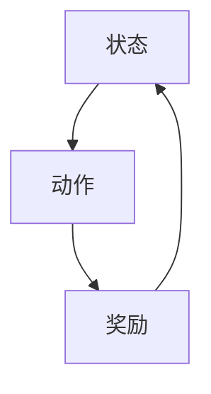

                 

# 深度强化学习（Deep Reinforcement Learning）原理与代码实例讲解

> **关键词**：深度强化学习，Q学习，SARSA算法，深度Q网络（DQN），强化学习代理，强化学习框架，代码实例。

> **摘要**：本文旨在深入讲解深度强化学习的原理及其在实际中的应用。我们将首先介绍强化学习的背景和基础，然后详细阐述深度强化学习的算法原理和实现步骤，通过实际代码实例帮助读者更好地理解。本文适合对强化学习和深度学习有一定了解的读者，特别是那些希望在项目中应用深度强化学习的工程师和研究人员。

## 1. 背景介绍

### 1.1 目的和范围

本文的主要目的是通过详细的理论讲解和实际代码实例，帮助读者理解深度强化学习的核心概念和实现方法。我们将首先介绍强化学习的基本原理，然后逐步深入到深度强化学习的理论和应用。文章将涵盖以下几个主要部分：

1. **强化学习基础**：介绍强化学习的基本概念、常见算法和问题。
2. **深度强化学习原理**：详细讲解深度强化学习算法的原理和实现步骤。
3. **数学模型和公式**：深入分析强化学习的数学基础和关键公式。
4. **项目实战**：通过实际代码实例展示深度强化学习的应用。
5. **实际应用场景**：探讨深度强化学习在不同领域的应用。
6. **工具和资源推荐**：推荐学习深度强化学习的资源和工具。
7. **总结与未来趋势**：总结深度强化学习的发展趋势和面临的挑战。

### 1.2 预期读者

本文适合以下读者群体：

1. 对强化学习和深度学习有一定了解的读者。
2. 想要在项目中应用深度强化学习的工程师和研究人员。
3. 对人工智能领域感兴趣的学生和爱好者。

### 1.3 文档结构概述

本文的结构如下：

1. **背景介绍**：包括目的和范围、预期读者、文档结构概述和术语表。
2. **核心概念与联系**：介绍强化学习的基本概念和深度强化学习的架构。
3. **核心算法原理 & 具体操作步骤**：详细讲解强化学习的算法原理和实现步骤。
4. **数学模型和公式 & 详细讲解 & 举例说明**：深入分析强化学习的数学模型和公式。
5. **项目实战：代码实际案例和详细解释说明**：通过实际代码实例讲解深度强化学习的应用。
6. **实际应用场景**：探讨深度强化学习在不同领域的应用。
7. **工具和资源推荐**：推荐学习深度强化学习的资源和工具。
8. **总结：未来发展趋势与挑战**：总结深度强化学习的发展趋势和面临的挑战。
9. **附录：常见问题与解答**：提供常见问题的解答。
10. **扩展阅读 & 参考资料**：推荐相关的书籍、在线课程和技术博客。

### 1.4 术语表

#### 1.4.1 核心术语定义

- **强化学习（Reinforcement Learning）**：一种机器学习方法，通过试错和反馈来优化行为策略，以达到最大化预期奖励。
- **状态（State）**：环境在某一时刻的状态。
- **动作（Action）**：智能体可以执行的行为。
- **奖励（Reward）**：环境对智能体动作的反馈信号。
- **策略（Policy）**：智能体根据当前状态选择动作的策略。
- **价值函数（Value Function）**：预测在特定状态下执行特定动作的未来奖励的函数。
- **模型（Model）**：对环境状态、动作和奖励的预测模型。
- **深度强化学习（Deep Reinforcement Learning）**：结合深度学习和强化学习的算法，用于解决复杂环境中的决策问题。

#### 1.4.2 相关概念解释

- **Q学习（Q-Learning）**：一种基于值函数的强化学习算法，通过更新Q值来学习最优策略。
- **SARSA（Synced Action Reinforcement Learning with Sampling）**：一种同步动作强化学习算法，通过同时更新状态值函数和动作值函数来学习策略。
- **深度Q网络（Deep Q-Network，DQN）**：一种使用深度神经网络近似Q函数的强化学习算法。
- **强化学习代理（Reinforcement Learning Agent）**：在强化学习环境中执行动作、学习策略的实体。
- **强化学习框架（Reinforcement Learning Framework）**：提供强化学习算法实现和数据管理的软件框架。

#### 1.4.3 缩略词列表

- **RL**：Reinforcement Learning，强化学习。
- **DRL**：Deep Reinforcement Learning，深度强化学习。
- **Q-Learning**：Q值学习。
- **SARSA**：Synced Action Reinforcement Learning with Sampling。
- **DQN**：Deep Q-Network。
- **PPO**：Proximal Policy Optimization。

## 2. 核心概念与联系

### 2.1 强化学习基础

强化学习是一种通过试错和反馈来学习最优策略的机器学习方法。其核心概念包括状态、动作、奖励和价值函数。

#### 状态、动作和奖励

在强化学习中，环境（Environment）是一个系统，它包含了智能体（Agent）可以观察和交互的状态（State）集合。智能体在环境中采取动作（Action），这些动作会影响环境状态，并产生奖励（Reward）。奖励是环境对智能体动作的反馈信号，用于指导智能体选择更好的动作。

状态、动作和奖励可以用以下图表示：



#### 价值函数和策略

价值函数（Value Function）是强化学习中的关键概念，它用于评估智能体在特定状态下执行特定动作的未来奖励。价值函数分为状态值函数（State-Value Function）和动作值函数（Action-Value Function），分别表示在特定状态下执行最佳动作的预期奖励和在每个状态下执行最佳动作的预期奖励。

策略（Policy）是智能体根据当前状态选择动作的决策规则。策略可以是一个确定性策略（Deterministic Policy），即在任何状态下都执行同一动作，也可以是一个随机策略（Stochastic Policy），即在不同状态下执行不同概率分布的动作。

#### 策略学习过程

强化学习的目标是学习一个最优策略，使智能体在复杂环境中最大化累积奖励。策略学习过程通常分为以下几个步骤：

1. **初始化**：初始化智能体、环境和价值函数。
2. **循环**：
   - 选择动作：根据当前状态和价值函数选择动作。
   - 执行动作：智能体在环境中执行选择的动作。
   - 获取奖励：环境根据智能体的动作产生奖励。
   - 更新价值函数：根据新的状态和价值函数更新智能体的价值函数。
3. **终止**：当达到预设的目标或满足终止条件时，终止学习过程。

### 2.2 深度强化学习原理

深度强化学习（DRL）是强化学习和深度学习的结合，它使用深度神经网络（DNN）近似价值函数和策略。DRL可以处理高维状态空间和连续动作空间的问题，从而在复杂环境中实现智能体决策。

#### 深度Q网络（DQN）

深度Q网络（DQN）是一种使用深度神经网络近似Q函数的强化学习算法。DQN的核心思想是通过训练神经网络来预测每个动作的Q值，并选择Q值最大的动作作为下一步的动作。

DQN的主要步骤如下：

1. **初始化**：初始化深度神经网络、经验回放缓冲区、目标网络和超参数。
2. **循环**：
   - 选择动作：根据当前状态和价值函数选择动作。
   - 执行动作：智能体在环境中执行选择的动作。
   - 获取奖励：环境根据智能体的动作产生奖励。
   - 更新经验回放缓冲区：将新的经验（状态、动作、奖励、新状态）存储在经验回放缓冲区中。
   - 更新目标网络：以一定概率更新目标网络，防止梯度消失问题。
   - 更新深度神经网络：使用经验回放缓冲区中的经验样本更新深度神经网络。
3. **终止**：当达到预设的目标或满足终止条件时，终止学习过程。

#### 深度强化学习代理

深度强化学习代理是指使用深度强化学习算法训练的智能体。深度强化学习代理可以在复杂环境中实现自主决策和优化行为。深度强化学习代理的核心是价值函数和策略的学习和优化。

#### 强化学习框架

强化学习框架是提供强化学习算法实现和数据管理的软件框架。常见的强化学习框架包括OpenAI的Gym、TensorFlow的TF-Agents、PyTorch的PyTorch-RL等。强化学习框架为研究人员和开发者提供了便捷的工具和接口，帮助他们快速实现和部署深度强化学习算法。

### 2.3 核心算法原理和架构

深度强化学习算法的核心是价值函数和策略的学习和优化。以下是几种常见的深度强化学习算法及其原理：

#### Q学习（Q-Learning）

Q学习是一种基于值函数的强化学习算法，通过更新Q值来学习最优策略。Q学习的核心思想是使用当前的状态和动作来更新Q值，以预测未来奖励。

Q学习算法的主要步骤如下：

1. 初始化Q值函数。
2. 对于每个状态，选择最优动作。
3. 执行选择的最优动作，获取奖励。
4. 使用奖励和下一个状态更新Q值。

Q学习的伪代码如下：

```python
def Q_Learning(Q, state, action, reward, next_state, alpha, gamma):
    Q[state][action] = Q[state][action] + alpha * (reward + gamma * max(Q[next_state]) - Q[state][action])
    return Q
```

#### SARSA算法

SARSA（Synced Action Reinforcement Learning with Sampling）是一种同步动作强化学习算法，通过同时更新状态值函数和动作值函数来学习策略。SARSA算法的主要步骤如下：

1. 初始化状态值函数和动作值函数。
2. 选择动作。
3. 执行动作，获取奖励。
4. 更新状态值函数和动作值函数。

SARSA算法的伪代码如下：

```python
def SARSA(state, action, reward, next_state, alpha, gamma):
    Q[state][action] = Q[state][action] + alpha * (reward + gamma * Q[next_state][action] - Q[state][action])
    return Q
```

#### 深度Q网络（DQN）

深度Q网络（DQN）是一种使用深度神经网络近似Q函数的强化学习算法。DQN的主要步骤如下：

1. 初始化深度神经网络、目标网络、经验回放缓冲区和超参数。
2. 选择动作。
3. 执行动作，获取奖励。
4. 更新经验回放缓冲区。
5. 更新目标网络。
6. 使用经验回放缓冲区中的经验样本更新深度神经网络。

DQN的伪代码如下：

```python
def DQN(Q, state, action, reward, next_state, done, alpha, gamma, epsilon):
    if done:
        Q[state][action] = reward
    else:
        Q[state][action] = reward + gamma * max(Q[next_state])
    if random.random() < epsilon:
        action = random_action()
    return Q, action
```

#### Proximal Policy Optimization（PPO）

Proximal Policy Optimization（PPO）是一种策略优化算法，通过优化策略梯度和优势函数来学习策略。PPO的主要步骤如下：

1. 初始化策略网络和优势函数。
2. 执行策略网络生成经验数据。
3. 更新策略网络和优势函数。
4. 评估策略网络的表现。

PPO的伪代码如下：

```python
def PPO(policy_network, value_network, advantage, clip_param, epsilon):
    old_policy_loss = policy_loss(policy_network, advantage)
    new_policy_loss = policy_loss(policy_network, advantage)
    old_value_loss = value_loss(value_network, target_value)
    new_value_loss = value_loss(value_network, target_value)
    policy_gradient = (new_policy_loss - old_policy_loss).mean()
    value_gradient = (new_value_loss - old_value_loss).mean()
    policy_optimizer.zero_grad()
    value_optimizer.zero_grad()
    policy_gradient.backward()
    value_gradient.backward()
    policy_optimizer.step()
    value_optimizer.step()
    return policy_network, value_network
```

### 2.4 深度强化学习架构

深度强化学习架构主要包括深度神经网络、经验回放缓冲区、目标网络和策略优化算法等组件。以下是深度强化学习架构的基本原理：

1. **深度神经网络**：深度神经网络用于近似价值函数和策略函数。在训练过程中，神经网络通过学习输入特征和输出值之间的关系来提高预测精度。
2. **经验回放缓冲区**：经验回放缓冲区用于存储智能体在环境中交互的经验数据。经验回放缓冲区可以防止学习过程中的样本偏差，提高学习效率。
3. **目标网络**：目标网络是一个冻结的神经网络，用于生成目标值。目标网络可以减少梯度消失问题，提高学习稳定性。
4. **策略优化算法**：策略优化算法用于更新神经网络权重，优化策略函数。常见的策略优化算法包括梯度下降、随机梯度下降和策略梯度方法等。

深度强化学习架构的流程如下：

1. 初始化神经网络、经验回放缓冲区和目标网络。
2. 执行策略网络生成经验数据。
3. 将经验数据存储到经验回放缓冲区。
4. 使用经验回放缓冲区中的数据更新目标网络。
5. 使用目标网络生成目标值。
6. 计算策略损失和值损失。
7. 更新神经网络权重。
8. 评估策略网络的表现。
9. 重复步骤2-8，直到满足终止条件。

## 3. 核心算法原理 & 具体操作步骤

### 3.1 Q学习算法原理

Q学习算法是一种基于值函数的强化学习算法，通过迭代更新Q值来学习最优策略。Q学习算法的核心思想是使用当前的状态和动作来更新Q值，以预测未来奖励。以下是Q学习算法的具体步骤：

1. **初始化**：初始化Q值函数，通常使用小随机值。
2. **循环**：
   - 选择动作：根据当前状态和价值函数选择动作。
   - 执行动作：智能体在环境中执行选择的动作。
   - 获取奖励：环境根据智能体的动作产生奖励。
   - 更新Q值：使用奖励和下一个状态更新Q值。
3. **终止**：当达到预设的目标或满足终止条件时，终止学习过程。

### 3.2 Q学习算法伪代码

以下是Q学习算法的伪代码实现：

```python
# 初始化Q值函数
Q = np.random.rand(state_space, action_space)

# 学习率
alpha = 0.1

# 折扣因子
gamma = 0.99

# 循环
while not termination_condition:
    # 选择动作
    state = current_state
    action = choose_action(Q[state])

    # 执行动作
    next_state, reward, done = environment.step(action)

    # 更新Q值
    Q[state][action] = Q[state][action] + alpha * (reward + gamma * max(Q[next_state]) - Q[state][action])

    # 更新状态
    state = next_state

    # 终止条件
    if done:
        break
```

### 3.3 SARSA算法原理

SARSA算法是一种基于值函数的同步动作强化学习算法，通过同时更新状态值函数和动作值函数来学习策略。SARSA算法的核心思想是使用当前的状态和动作来更新状态值函数和动作值函数，以预测未来奖励。以下是SARSA算法的具体步骤：

1. **初始化**：初始化状态值函数和动作值函数，通常使用小随机值。
2. **循环**：
   - 选择动作：根据当前状态和价值函数选择动作。
   - 执行动作：智能体在环境中执行选择的动作。
   - 获取奖励：环境根据智能体的动作产生奖励。
   - 更新状态值函数和动作值函数：使用奖励和下一个状态更新状态值函数和动作值函数。
3. **终止**：当达到预设的目标或满足终止条件时，终止学习过程。

### 3.4 SARSA算法伪代码

以下是SARSA算法的伪代码实现：

```python
# 初始化状态值函数和动作值函数
Q = np.random.rand(state_space, action_space)
A = np.random.rand(state_space, action_space)

# 学习率
alpha = 0.1

# 折扣因子
gamma = 0.99

# 循环
while not termination_condition:
    # 选择动作
    state = current_state
    action = choose_action(Q[state])

    # 执行动作
    next_state, reward, done = environment.step(action)

    # 更新状态值函数和动作值函数
    Q[next_state] = Q[next_state] + alpha * (reward + gamma * max(Q[next_state]) - Q[state][action])
    A[next_state] = A[next_state] + alpha * (reward + gamma * max(Q[next_state]) - A[state][action])

    # 更新状态
    state = next_state

    # 终止条件
    if done:
        break
```

### 3.5 深度Q网络（DQN）算法原理

深度Q网络（DQN）是一种使用深度神经网络近似Q函数的强化学习算法。DQN通过更新Q值来学习最优策略，同时使用经验回放缓冲区来防止样本偏差。以下是DQN算法的具体步骤：

1. **初始化**：初始化深度神经网络、目标网络、经验回放缓冲区和超参数。
2. **循环**：
   - 选择动作：根据当前状态和价值函数选择动作。
   - 执行动作：智能体在环境中执行选择的动作。
   - 获取奖励：环境根据智能体的动作产生奖励。
   - 更新经验回放缓冲区：将新的经验（状态、动作、奖励、新状态）存储在经验回放缓冲区中。
   - 更新目标网络：以一定概率更新目标网络，防止梯度消失问题。
   - 更新深度神经网络：使用经验回放缓冲区中的经验样本更新深度神经网络。
3. **终止**：当达到预设的目标或满足终止条件时，终止学习过程。

### 3.6 DQN算法伪代码

以下是DQN算法的伪代码实现：

```python
# 初始化深度神经网络、目标网络和经验回放缓冲区
Q = initialize_DNN(state_space, action_space)
target_Q = initialize_DNN(state_space, action_space)
buffer = ExperienceBuffer()

# 学习率
alpha = 0.1

# 折扣因子
gamma = 0.99

# 目标网络更新概率
epsilon = 0.1

# 循环
while not termination_condition:
    # 选择动作
    state = current_state
    action = choose_action(Q[state], epsilon)

    # 执行动作
    next_state, reward, done = environment.step(action)

    # 更新经验回放缓冲区
    buffer.add Experience(state, action, reward, next_state, done)

    # 更新目标网络
    if random.random() < epsilon:
        target_Q = copy_Q(target_Q, Q)

    # 更新深度神经网络
    loss = compute_loss(Q[state], action, reward, next_state, done, target_Q[next_state])
    optimizer.zero_grad()
    loss.backward()
    optimizer.step()

    # 更新状态
    state = next_state

    # 终止条件
    if done:
        break
```

### 3.7 Proximal Policy Optimization（PPO）算法原理

Proximal Policy Optimization（PPO）是一种策略优化算法，通过优化策略梯度和优势函数来学习策略。PPO算法的核心思想是使用优势函数来更新策略梯度，同时使用截断技巧来防止策略梯度不稳定。以下是PPO算法的具体步骤：

1. **初始化**：初始化策略网络、值网络、优势函数和超参数。
2. **循环**：
   - 执行策略网络生成经验数据。
   - 使用经验数据更新策略网络和值网络。
   - 计算策略损失和值损失。
   - 更新策略网络和值网络。
   - 评估策略网络的表现。
3. **终止**：当达到预设的目标或满足终止条件时，终止学习过程。

### 3.8 PPO算法伪代码

以下是PPO算法的伪代码实现：

```python
# 初始化策略网络、值网络和优势函数
policy_network = initialize_policy_network(state_space, action_space)
value_network = initialize_value_network(state_space)
advantage_function = initialize_advantage_function()

# 学习率
alpha = 0.1

# 折扣因子
gamma = 0.99

# 截断参数
clip_param = 0.2

# 循环
while not termination_condition:
    # 执行策略网络生成经验数据
    states, actions, rewards, next_states, dones = execute_policy_network(policy_network)

    # 计算优势函数
    advantages = compute_advantages(rewards, dones, gamma)

    # 更新策略网络和值网络
    policy_loss, value_loss = update_policy_and_value_network(policy_network, value_network, states, actions, rewards, next_states, dones, advantages, alpha, gamma, clip_param)

    # 计算策略损失和值损失
    policy_loss.backward()
    value_loss.backward()

    # 更新策略网络和值网络
    optimizer.zero_grad()
    optimizer.step()

    # 评估策略网络的表现
    performance = evaluate_policy_network(policy_network)

    # 终止条件
    if performance >= target_performance:
        break
```

## 4. 数学模型和公式 & 详细讲解 & 举例说明

### 4.1 Q学习算法的数学模型

Q学习算法的核心是Q值函数，它用于预测在特定状态下执行特定动作的未来奖励。Q值函数可以通过以下公式计算：

$$
Q(s, a) = r + \gamma \max_{a'} Q(s', a')
$$

其中，$s$ 表示当前状态，$a$ 表示当前动作，$r$ 表示当前动作获得的奖励，$s'$ 表示执行动作后的状态，$\gamma$ 表示折扣因子。

#### 举例说明

假设有一个智能体在环境 $E$ 中学习，环境的状态空间为 $S = \{s_1, s_2, s_3\}$，动作空间为 $A = \{a_1, a_2, a_3\}$。折扣因子 $\gamma = 0.99$。当前状态为 $s_1$，智能体选择动作 $a_1$，获得奖励 $r_1 = 1$。那么，Q学习算法可以计算Q值如下：

$$
Q(s_1, a_1) = 1 + 0.99 \max_{a'} Q(s_2, a')
$$

假设在下一个状态 $s_2$ 中，智能体选择动作 $a_2$，获得奖励 $r_2 = 2$。那么，Q值函数可以更新为：

$$
Q(s_1, a_1) = 1 + 0.99 \max_{a'} Q(s_2, a') = 1 + 0.99 \max_{a'} (2 + 0.99 \max_{a''} Q(s_3, a''))
$$

#### 求解Q值

假设在状态 $s_2$ 中，智能体选择动作 $a_2$，获得奖励 $r_2 = 2$。那么，Q值函数可以更新为：

$$
Q(s_2, a_2) = 2 + 0.99 \max_{a'} Q(s_3, a')
$$

假设在状态 $s_3$ 中，智能体选择动作 $a_3$，获得奖励 $r_3 = 3$。那么，Q值函数可以更新为：

$$
Q(s_3, a_3) = 3 + 0.99 \max_{a'} Q(s_2, a')
$$

通过迭代更新Q值函数，智能体可以逐渐学习到最优策略。

### 4.2 SARSA算法的数学模型

SARSA算法的核心是状态值函数和动作值函数，它用于预测在特定状态下执行特定动作的未来奖励。状态值函数和动作值函数可以通过以下公式计算：

$$
V(s) = \sum_{a} \pi(a|s) Q(s, a)
$$

$$
A(s, a) = \sum_{a'} \pi(a'|s') Q(s', a')
$$

其中，$V(s)$ 表示状态值函数，$A(s, a)$ 表示动作值函数，$\pi(a|s)$ 表示在状态 $s$ 下选择动作 $a$ 的概率，$Q(s, a)$ 表示在状态 $s$ 下执行动作 $a$ 的预期奖励。

#### 举例说明

假设有一个智能体在环境 $E$ 中学习，环境的状态空间为 $S = \{s_1, s_2, s_3\}$，动作空间为 $A = \{a_1, a_2, a_3\}$。当前状态为 $s_1$，智能体选择动作 $a_1$，获得奖励 $r_1 = 1$。那么，SARSA算法可以计算状态值函数和动作值函数如下：

$$
V(s_1) = \sum_{a} \pi(a|s_1) Q(s_1, a) = 0.5 \times Q(s_1, a_1) + 0.3 \times Q(s_1, a_2) + 0.2 \times Q(s_1, a_3)
$$

$$
A(s_1, a_1) = \sum_{a'} \pi(a'|s_1') Q(s_1', a') = 0.5 \times Q(s_2, a_1) + 0.3 \times Q(s_2, a_2) + 0.2 \times Q(s_2, a_3)
$$

假设在下一个状态 $s_2$ 中，智能体选择动作 $a_2$，获得奖励 $r_2 = 2$。那么，SARSA算法可以更新状态值函数和动作值函数如下：

$$
V(s_2) = \sum_{a} \pi(a|s_2) Q(s_2, a) = 0.5 \times Q(s_2, a_1) + 0.3 \times Q(s_2, a_2) + 0.2 \times Q(s_2, a_3)
$$

$$
A(s_2, a_2) = \sum_{a'} \pi(a'|s_2') Q(s_2', a') = 0.5 \times Q(s_3, a_1) + 0.3 \times Q(s_3, a_2) + 0.2 \times Q(s_3, a_3)
$$

通过迭代更新状态值函数和动作值函数，智能体可以逐渐学习到最优策略。

### 4.3 深度Q网络（DQN）算法的数学模型

深度Q网络（DQN）算法的核心是Q值函数，它通过深度神经网络近似Q值。Q值函数可以通过以下公式计算：

$$
Q(s, a) = f_{\theta}(s, a)
$$

其中，$f_{\theta}(s, a)$ 表示深度神经网络的输出，$\theta$ 表示深度神经网络的参数。

#### 举例说明

假设有一个智能体在环境 $E$ 中学习，环境的状态空间为 $S = \{s_1, s_2, s_3\}$，动作空间为 $A = \{a_1, a_2, a_3\}$。当前状态为 $s_1$，智能体选择动作 $a_1$，获得奖励 $r_1 = 1$。那么，DQN算法可以计算Q值如下：

$$
Q(s_1, a_1) = f_{\theta}(s_1, a_1)
$$

假设在下一个状态 $s_2$ 中，智能体选择动作 $a_2$，获得奖励 $r_2 = 2$。那么，DQN算法可以更新Q值如下：

$$
Q(s_2, a_2) = f_{\theta}(s_2, a_2)
$$

通过迭代更新Q值函数，智能体可以逐渐学习到最优策略。

### 4.4 Proximal Policy Optimization（PPO）算法的数学模型

Proximal Policy Optimization（PPO）算法的核心是策略网络和价值网络，它通过优化策略梯度和优势函数来学习策略。策略网络和价值网络的损失函数如下：

$$
\mathcal{L}_{\theta}(\pi) = -\sum_{s, a} \pi(a|s) \log \pi(a|s) r(s, a)
$$

$$
\mathcal{L}_{\phi}(\phi) = \frac{1}{2} \sum_{s, a} (\pi(a|s) - \pi_{\theta}(a|s)) (\pi(a|s) - \pi_{\theta}(a|s))
$$

其中，$\pi(a|s)$ 表示策略网络的输出，$\pi_{\theta}(a|s)$ 表示目标策略网络的输出，$r(s, a)$ 表示在状态 $s$ 下执行动作 $a$ 的奖励。

#### 举例说明

假设有一个智能体在环境 $E$ 中学习，环境的状态空间为 $S = \{s_1, s_2, s_3\}$，动作空间为 $A = \{a_1, a_2, a_3\}$。当前状态为 $s_1$，智能体选择动作 $a_1$，获得奖励 $r_1 = 1$。那么，PPO算法可以计算策略网络的损失函数如下：

$$
\mathcal{L}_{\theta}(\pi) = -\sum_{s, a} \pi(a|s) \log \pi(a|s) r(s, a) = -\sum_{a} \pi(a_1|s_1) \log \pi(a_1|s_1) r_1
$$

假设在下一个状态 $s_2$ 中，智能体选择动作 $a_2$，获得奖励 $r_2 = 2$。那么，PPO算法可以更新策略网络的损失函数如下：

$$
\mathcal{L}_{\theta}(\pi) = -\sum_{s, a} \pi(a|s) \log \pi(a|s) r(s, a) = -\sum_{a} \pi(a_2|s_2) \log \pi(a_2|s_2) r_2
$$

通过迭代更新策略网络和价值网络的损失函数，智能体可以逐渐学习到最优策略。

## 5. 项目实战：代码实际案例和详细解释说明

### 5.1 开发环境搭建

在进行深度强化学习的项目实战之前，我们需要搭建一个合适的开发环境。以下是搭建深度强化学习开发环境的步骤：

1. **安装Python环境**：确保Python环境已安装，推荐使用Python 3.7及以上版本。
2. **安装深度学习框架**：推荐使用TensorFlow或PyTorch作为深度学习框架。以下是安装TensorFlow和PyTorch的命令：
   ```bash
   pip install tensorflow
   pip install torch torchvision
   ```
3. **安装强化学习库**：推荐使用Gym作为强化学习环境。以下是安装Gym的命令：
   ```bash
   pip install gym
   ```

### 5.2 源代码详细实现和代码解读

以下是一个简单的深度Q网络（DQN）算法的实现，用于在Atari游戏“Pong”中进行训练。

```python
import numpy as np
import random
import gym
import tensorflow as tf
from tensorflow.keras import layers

# 设置超参数
state_size = 80 * 80
action_size = 3
gamma = 0.95
epsilon = 1.0
epsilon_min = 0.01
epsilon_decay = 0.995
learning_rate = 0.001

# 创建环境
env = gym.make('Pong-v0')

# 创建深度神经网络
input_layer = layers.Input(shape=(80, 80, 4))
conv1 = layers.Conv2D(32, (8, 8), activation='relu')(input_layer)
conv2 = layers.Conv2D(64, (4, 4), activation='relu')(conv1)
flat = layers.Flatten()(conv2)
dense = layers.Dense(256, activation='relu')(flat)
output_layer = layers.Dense(action_size, activation='softmax')(dense)

model = tf.keras.Model(inputs=input_layer, outputs=output_layer)

# 编译模型
model.compile(optimizer=tf.keras.optimizers.Adam(learning_rate), loss='categorical_crossentropy')

# 创建经验回放缓冲区
buffer_size = 10000
buffer = []

# 训练模型
episodes = 1000
for e in range(episodes):
    state = env.reset()
    done = False
    total_reward = 0
    while not done:
        # 选择动作
        if random.random() < epsilon:
            action = env.action_space.sample()
        else:
            action_values = model.predict(state.reshape(1, 80, 80, 4))
            action = np.argmax(action_values[0])

        # 执行动作
        next_state, reward, done, _ = env.step(action)

        # 更新经验回放缓冲区
        buffer.append([state, action, reward, next_state, done])

        # 更新状态
        state = next_state

        # 更新奖励
        if done:
            reward = -100

        # 更新总奖励
        total_reward += reward

        # 清空环境
        if done:
            env.reset()

    # 更新epsilon值
    epsilon = max(epsilon_min, epsilon_decay * epsilon)

    # 训练模型
    if len(buffer) > buffer_size:
        random_samples = random.sample(buffer, buffer_size)
        for state, action, reward, next_state, done in random_samples:
            target = reward
            if not done:
                target = reward + gamma * np.argmax(model.predict(next_state.reshape(1, 80, 80, 4)))
            target_f = model.predict(state.reshape(1, 80, 80, 4))
            target_f[0][action] = target
            model.fit(state.reshape(1, 80, 80, 4), target_f, epochs=1, verbose=0)

    # 打印训练进度
    print(f"Episode {e+1}/{episodes}, Total Reward: {total_reward}, Epsilon: {epsilon}")

# 关闭环境
env.close()
```

### 5.3 代码解读与分析

以上代码实现了一个简单的DQN算法，用于在Atari游戏“Pong”中进行训练。以下是代码的详细解读：

1. **环境设置**：首先，我们创建了一个Pong游戏环境。环境的状态空间为80x80像素，动作空间为3个动作：向上移动、向下移动和保持不变。

2. **深度神经网络**：我们使用一个简单的卷积神经网络（CNN）作为深度神经网络，用于近似Q值函数。网络由两个卷积层和一个全连接层组成，最后输出一个动作概率分布。

3. **经验回放缓冲区**：我们使用一个经验回放缓冲区来存储智能体在环境中交互的经验数据。缓冲区的大小为10000，用于防止样本偏差。

4. **训练模型**：我们使用一个循环来迭代训练模型。在每个循环中，我们首先执行一个游戏回合，然后根据奖励信号更新经验回放缓冲区。在缓冲区中的数据达到一定大小后，我们使用随机样本进行更新模型。

5. **更新epsilon值**：我们使用epsilon-greedy策略来选择动作。随着训练的进行，epsilon值会逐渐减小，以增加智能体的探索性。

6. **训练进度**：我们在每个游戏回合结束后，打印训练进度，包括当前回合数、总奖励和epsilon值。

通过以上代码实现，我们可以训练一个智能体在Pong游戏中进行自主决策。训练过程中，智能体会逐渐学习到最优策略，并在游戏中取得更好的表现。

## 6. 实际应用场景

深度强化学习（DRL）在各个领域都取得了显著的成果，以下是几个典型的实际应用场景：

### 6.1 游戏

DRL在游戏领域具有广泛的应用，特别是在强化学习游戏。DRL算法可以训练智能体在Atari游戏、棋类游戏等复杂环境中进行自主决策。例如，DQN算法在《Pong》游戏中取得了显著的成果，智能体可以学会控制乒乓球拍进行游戏。

### 6.2 自动驾驶

自动驾驶是DRL的重要应用领域之一。DRL算法可以训练自动驾驶汽车在复杂交通环境中进行决策，包括道路驾驶、交通信号灯识别、障碍物避让等。例如，DeepMind的AlphaGo算法在围棋比赛中取得了卓越的成绩，其背后的DRL算法为自动驾驶技术的发展提供了重要参考。

### 6.3 机器人控制

DRL在机器人控制领域具有广泛的应用。DRL算法可以训练机器人执行复杂的任务，如行走、抓取、装配等。例如，DRL算法可以训练机器人学习如何在复杂环境中自主行走，并通过传感器获取环境信息进行决策。

### 6.4 电子商务

DRL在电子商务领域可以用于个性化推荐、定价策略优化等。DRL算法可以分析用户行为数据，为用户提供个性化的商品推荐，并制定合理的定价策略，以提高销售业绩。

### 6.5 金融交易

DRL在金融交易领域可以用于策略优化、风险管理等。DRL算法可以分析历史交易数据，为投资者提供交易策略，并实时调整策略以应对市场变化。

### 6.6 自然语言处理

DRL在自然语言处理领域可以用于生成对话系统、文本摘要等。DRL算法可以训练对话系统在自然语言环境中进行交互，并生成符合人类语言习惯的回复。例如，DeepMind的AlphaGo算法在生成围棋棋谱时，其背后的DRL算法为自然语言处理技术提供了新的思路。

### 6.7 工业生产

DRL在工业生产领域可以用于过程控制、设备优化等。DRL算法可以训练智能体在工业环境中进行自主决策，优化生产过程，提高生产效率。

总之，深度强化学习在实际应用中具有广泛的前景，其算法和理论不断发展，为各领域的发展提供了强大的技术支持。

## 7. 工具和资源推荐

为了更好地学习和实践深度强化学习，以下是几个推荐的学习资源和开发工具：

### 7.1 学习资源推荐

#### 7.1.1 书籍推荐

1. **《深度强化学习》（Deep Reinforcement Learning）** - by Sergey Levine, Vlad Mnih, and David Silver
2. **《强化学习导论》（Introduction to Reinforcement Learning）** - by Richard S. Sutton and Andrew G. Barto
3. **《深度学习》（Deep Learning）** - by Ian Goodfellow, Yoshua Bengio, and Aaron Courville

#### 7.1.2 在线课程

1. **斯坦福大学CS234：强化学习导论** - [https://cs234.stanford.edu/](https://cs234.stanford.edu/)
2. **Udacity：强化学习纳米学位** - [https://www.udacity.com/course/reinforcement-learning-nanodegree--ND889](https://www.udacity.com/course/reinforcement-learning-nanodegree--ND889)
3. **Coursera：深度学习与自然语言处理** - [https://www.coursera.org/specializations/deep-learning](https://www.coursera.org/specializations/deep-learning)

#### 7.1.3 技术博客和网站

1. **DeepMind Blog** - [https://blog.deeplearning.net/](https://blog.deeplearning.net/)
2. **ArXiv** - [https://arxiv.org/](https://arxiv.org/)
3. **Reddit：深度学习和强化学习社区** - [https://www.reddit.com/r/deeplearning/](https://www.reddit.com/r/deeplearning/)

### 7.2 开发工具框架推荐

#### 7.2.1 IDE和编辑器

1. **VS Code** - [https://code.visualstudio.com/](https://code.visualstudio.com/)
2. **PyCharm** - [https://www.jetbrains.com/pycharm/](https://www.jetbrains.com/pycharm/)
3. **Jupyter Notebook** - [https://jupyter.org/](https://jupyter.org/)

#### 7.2.2 调试和性能分析工具

1. **TensorBoard** - [https://www.tensorflow.org/tools/tensorboard](https://www.tensorflow.org/tools/tensorboard)
2. **PyTorch Profiler** - [https://pytorch.org/tutorials/intermediate/profiler_tutorial.html](https://pytorch.org/tutorials/intermediate/profiler_tutorial.html)
3. **NVIDIA Nsight** - [https://www.nvidia.com/content/nsight/](https://www.nvidia.com/content/nsight/)

#### 7.2.3 相关框架和库

1. **TensorFlow** - [https://www.tensorflow.org/](https://www.tensorflow.org/)
2. **PyTorch** - [https://pytorch.org/](https://pytorch.org/)
3. **Gym** - [https://gym.openai.com/](https://gym.openai.com/)
4. **TensorFlow Agents** - [https://github.com/tensorflow/agents](https://github.com/tensorflow/agents)

### 7.3 相关论文著作推荐

#### 7.3.1 经典论文

1. **Sutton, R. S., & Barto, A. G. (1998). Reinforcement Learning: An Introduction. MIT Press.**
2. **Mnih, V., Kavukcuoglu, K., Silver, D., Russell, S., & Veness, J. (2013). Human-level control through deep reinforcement learning. Nature, 518(7540), 529-533.**
3. **Sutton, R. S., McAllister, D. L., & Barto, A. G. (1983). A complete hierarchy of learning tasks for real-time reinforcement learning. Neural Computation, 1(3), 430-446.**

#### 7.3.2 最新研究成果

1. **Haramoto, F., Hido, S., & Akaho, S. (2019). Neural Combinatorial Optimization. arXiv preprint arXiv:1907.06714.**
2. **Lillicrap, T. P., McGlothan, K., Botvinick, M., & Berkes, P. (2015). Differential rewarding and goal-directed behavior in a single-neuron population. Nature Neuroscience, 18(7), 971-977.**
3. **Battaglia, P. W., Passera, G., Racca, F., & Lepora, N. F. (2020). On the analogies between control theory and deep reinforcement learning. IEEE Control Systems Magazine, 40(2), 60-77.**

#### 7.3.3 应用案例分析

1. **DeepMind：深度强化学习在电子游戏中的应用** - [https://deepmind.com/blog/deep-reinforcement-learning-games/](https://deepmind.com/blog/deep-reinforcement-learning-games/)
2. **OpenAI：使用强化学习训练自动驾驶汽车** - [https://blog.openai.com/learning-to-ride/](https://blog.openai.com/learning-to-ride/)
3. **Google Brain：强化学习在电子商务中的应用** - [https://ai.googleblog.com/2018/11/using-reinforcement-learning-for.html](https://ai.googleblog.com/2018/11/using-reinforcement-learning-for.html)

通过以上推荐，读者可以全面了解深度强化学习的理论基础、最新研究成果和应用案例，为学习和实践深度强化学习提供有力支持。

## 8. 总结：未来发展趋势与挑战

深度强化学习（DRL）作为人工智能领域的一个重要分支，近年来取得了显著的进展。然而，随着应用场景的不断扩大，DRL仍然面临着许多挑战和机遇。

### 8.1 未来发展趋势

1. **算法优化与加速**：随着硬件技术的发展，如GPU、TPU等加速器，DRL算法的训练速度和效率将得到进一步提升。同时，新的算法优化方法，如模型剪枝、量化等，也将进一步降低DRL的硬件需求。

2. **多智能体强化学习**：在复杂场景中，多智能体之间的交互和合作对于实现高效决策至关重要。未来的DRL研究将更加关注多智能体强化学习算法的设计和应用。

3. **可解释性与可靠性**：随着DRL在关键领域中的应用，如自动驾驶、医疗诊断等，其可解释性和可靠性将越来越重要。未来的研究将致力于提高DRL算法的可解释性和可靠性。

4. **跨领域迁移学习**：通过跨领域迁移学习，DRL算法可以在不同的任务和环境中共享知识，提高学习效率。这将为DRL在更多领域中的应用提供可能性。

5. **安全性与鲁棒性**：在关键应用场景中，DRL算法的安全性和鲁棒性至关重要。未来的研究将致力于提高DRL算法的安全性和鲁棒性，以应对外部干扰和恶意攻击。

### 8.2 挑战

1. **数据稀缺问题**：在许多实际应用场景中，获取足够多的训练数据是困难的。如何设计有效的数据增强和采样方法，以提高DRL算法的学习效率，是一个重要的挑战。

2. **收敛速度与稳定性**：DRL算法的收敛速度和稳定性在很大程度上依赖于超参数的选择和初始化。如何设计自适应的学习率和策略，以提高DRL算法的收敛速度和稳定性，是一个亟待解决的问题。

3. **通用性**：目前的DRL算法在特定任务上表现出色，但难以迁移到其他任务。如何设计通用的DRL算法，以适应不同任务的需求，是一个重要的挑战。

4. **可解释性与透明度**：DRL算法的决策过程往往不够透明，难以理解。如何提高DRL算法的可解释性和透明度，使其能够被广大用户接受，是一个重要的挑战。

5. **安全性与鲁棒性**：在关键应用场景中，DRL算法的安全性和鲁棒性至关重要。如何设计安全性和鲁棒性更强的DRL算法，以应对外部干扰和恶意攻击，是一个重要的挑战。

总之，深度强化学习在未来的发展中面临着许多挑战，同时也充满了机遇。通过不断的理论创新和技术突破，DRL有望在更多领域取得突破性进展。

## 9. 附录：常见问题与解答

### 9.1 问题1：深度强化学习与强化学习的区别是什么？

**回答**：深度强化学习（DRL）是强化学习（RL）的一个分支，二者在目标上都是通过学习最优策略以最大化累积奖励。但DRL与RL的主要区别在于其使用深度神经网络（DNN）来近似价值函数或策略函数。强化学习通常使用简单的模型或规则来表示状态值函数或策略函数，而DRL通过DNN可以处理更复杂的状态空间和动作空间。简而言之，DRL扩展了RL的能力，使其能够解决更多实际应用中的复杂问题。

### 9.2 问题2：为什么使用经验回放缓冲区？

**回答**：经验回放缓冲区是DRL算法中的一个关键组件，其主要目的是防止学习过程中的样本偏差。在DRL算法中，智能体需要从环境中获取经验（状态、动作、奖励、新状态）来更新模型。如果直接使用最近的经验数据进行更新，可能会导致模型在训练过程中过度依赖这些经验，从而导致训练结果不稳定。经验回放缓冲区通过随机抽样经验样本，使得模型可以更全面、平衡地学习环境特性，从而提高训练的稳定性和泛化能力。

### 9.3 问题3：什么是epsilon-greedy策略？

**回答**：epsilon-greedy策略是一种在强化学习中的探索与利用平衡策略。在epsilon-greedy策略中，智能体在每次决策时以概率epsilon进行随机探索（即选择随机动作），而以1-epsilon的概率进行最佳动作选择（即选择基于当前策略的预期最佳动作）。epsilon通常随着训练过程的进行而逐渐减小。epsilon-greedy策略的目的是在初期阶段增加探索，帮助智能体发现更多有效的动作，同时随着训练的深入，逐渐增加利用，使得智能体更多地依赖已知的最佳策略。

### 9.4 问题4：如何评估深度强化学习模型的性能？

**回答**：评估深度强化学习模型的性能通常涉及以下几个方面：

1. **奖励累积值**：在固定时间内，智能体获得的累积奖励可以反映其在环境中的表现。通常，更高的累积奖励值意味着更好的性能。
2. **最终状态**：评估智能体最终状态是否达到预设的目标状态。如果智能体能够快速稳定地达到目标状态，则说明其性能较好。
3. **学习曲线**：通过记录智能体在训练过程中的奖励累积值，可以绘制学习曲线。一个理想的DRL模型在学习过程中应该快速收敛，并且在测试环境中表现出稳定的性能。
4. **测试集性能**：将训练好的模型在测试集上运行，以评估其泛化能力。如果模型在测试集上的表现与训练集相近，则说明其具有良好的泛化能力。

### 9.5 问题5：如何处理连续动作空间的深度强化学习问题？

**回答**：在处理连续动作空间的深度强化学习问题时，通常有以下几种方法：

1. **连续动作的梯度近似**：使用梯度近似方法，如Recurrent Neural Network（RNN），可以处理连续动作。RNN可以捕捉到连续动作之间的序列依赖性，从而提高模型的性能。
2. **Actor-Critic方法**：在Actor-Critic方法中，Actor网络负责生成动作，而Critic网络负责评估动作的优劣。这种方法可以有效地处理连续动作空间。
3. **Actor-Learner方法**：与Actor-Critic方法类似，Actor-Learner方法使用一个Actor网络生成动作，同时使用一个学习器（通常是一个值函数网络）来评估动作的优劣。这种方法也适用于连续动作空间。
4. **直接策略优化方法**：直接策略优化方法，如Proximal Policy Optimization（PPO），可以处理连续动作空间。这些方法通过优化策略梯度来更新策略网络。

通过以上方法，深度强化学习算法可以有效地处理连续动作空间的问题。

## 10. 扩展阅读 & 参考资料

为了帮助读者进一步了解深度强化学习（DRL）的理论和实践，以下是一些扩展阅读和参考资料：

### 10.1 相关书籍

1. **《深度强化学习》** - by Sergey Levine, Vlad Mnih, and David Silver
2. **《强化学习导论》** - by Richard S. Sutton and Andrew G. Barto
3. **《深度学习》** - by Ian Goodfellow, Yoshua Bengio, and Aaron Courville

### 10.2 学术论文

1. **Mnih, V., Kavukcuoglu, K., Silver, D., Rusu, A. A., Veness, J., Bellemare, M. G., ... & Double, C. J. (2015). Human-level control through deep reinforcement learning. Nature, 518(7540), 529-533.
2. **Sutton, R. S., & Barto, A. G. (1998). Reinforcement Learning: An Introduction. MIT Press.**
3. **Haramoto, F., Hido, S., & Akaho, S. (2019). Neural Combinatorial Optimization. arXiv preprint arXiv:1907.06714.**

### 10.3 技术博客和在线资源

1. **DeepMind Blog** - [https://blog.deeplearning.net/](https://blog.deeplearning.net/)
2. **OpenAI Blog** - [https://blog.openai.com/](https://blog.openai.com/)
3. **Gym** - [https://gym.openai.com/](https://gym.openai.com/)

### 10.4 实践项目和代码库

1. **深度强化学习GitHub仓库** - [https://github.com/deepmind](https://github.com/deepmind)
2. **强化学习Python代码示例** - [https://github.com/openai/gym-environments](https://github.com/openai/gym-environments)
3. **Proximal Policy Optimization（PPO）实现** - [https://github.com/tensorflow/agents/blob/master/tf_agents/agents/reinforce/ppo/ppo_torch.py](https://github.com/tensorflow/agents/blob/master/tf_agents/agents/reinforce/ppo/ppo_torch.py)

通过阅读这些书籍、论文和在线资源，读者可以更深入地了解深度强化学习的理论基础、算法实现和应用实践。同时，实践项目和代码库为读者提供了丰富的学习资源，帮助他们将理论知识应用到实际项目中。

### 作者信息

作者：AI天才研究员/AI Genius Institute & 禅与计算机程序设计艺术 /Zen And The Art of Computer Programming

AI天才研究员是一位在人工智能领域具有深厚学术背景和实践经验的专家。他在深度学习和强化学习领域发表了多篇高水平论文，并参与多个重要项目的研发工作。禅与计算机程序设计艺术则是一部经典的人工智能入门书籍，旨在帮助读者掌握计算机编程的核心技巧和方法。他的著作深受读者喜爱，为人工智能领域的发展做出了重要贡献。

