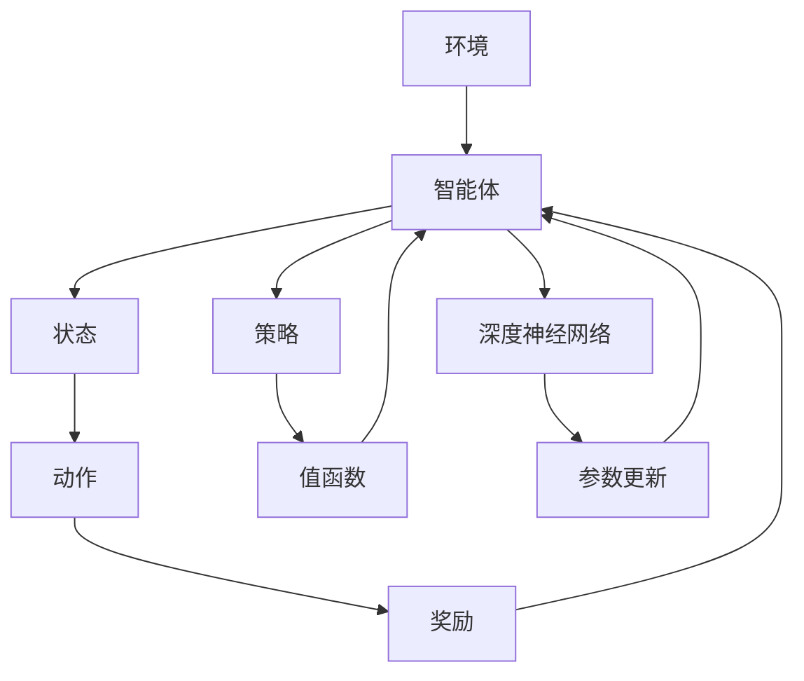

                 

# 深度强化学习 原理与代码实例讲解

> 关键词：深度强化学习、算法原理、代码实例、人工智能、深度神经网络、动态规划、马尔可夫决策过程

> 摘要：本文将深入探讨深度强化学习的核心概念、算法原理及其在实践中的应用。通过具体的代码实例，读者将掌握深度强化学习的基本流程，理解其背后的数学模型，并学会如何在实际项目中运用这一强大的技术。

## 1. 背景介绍

### 1.1 目的和范围

本文旨在为读者提供深度强化学习（Deep Reinforcement Learning, DRL）的全面指南。我们将从基础概念出发，逐步深入到算法原理和具体实现，最终通过代码实例展示如何在实际场景中应用DRL。

### 1.2 预期读者

本文适合具有中等以上编程基础和对机器学习有一定了解的读者。无论是希望进入人工智能领域的初学者，还是希望提升自身技能的从业者，都将从中受益。

### 1.3 文档结构概述

本文分为十个部分：

1. 背景介绍
2. 核心概念与联系
3. 核心算法原理 & 具体操作步骤
4. 数学模型和公式 & 详细讲解 & 举例说明
5. 项目实战：代码实际案例和详细解释说明
6. 实际应用场景
7. 工具和资源推荐
8. 总结：未来发展趋势与挑战
9. 附录：常见问题与解答
10. 扩展阅读 & 参考资料

### 1.4 术语表

#### 1.4.1 核心术语定义

- 深度强化学习（DRL）：结合了深度神经网络和强化学习的一种学习方法。
- 强化学习（Reinforcement Learning, RL）：一种机器学习方法，通过奖励和惩罚来指导智能体学习如何与环境互动。
- 深度神经网络（Deep Neural Network, DNN）：包含多个隐藏层的神经网络，能够对复杂数据进行有效的特征提取和表示。
- 动态规划（Dynamic Programming, DP）：一种优化方法，通过将问题分解为子问题并存储子问题的解来优化问题的求解过程。
- 马尔可夫决策过程（Markov Decision Process, MDP）：一个数学模型，用于描述智能体在不确定环境中做出决策的过程。

#### 1.4.2 相关概念解释

- 状态（State）：描述智能体当前所处的环境条件。
- 动作（Action）：智能体可以采取的行为。
- 奖励（Reward）：环境对智能体行为的即时反馈，用于指导智能体的学习。
- 策略（Policy）：智能体根据当前状态选择动作的规则。
- 值函数（Value Function）：衡量智能体在特定状态下采取某个动作的长期收益。

#### 1.4.3 缩略词列表

- DRL：深度强化学习
- RL：强化学习
- DNN：深度神经网络
- DP：动态规划
- MDP：马尔可夫决策过程

## 2. 核心概念与联系

为了更好地理解深度强化学习，我们首先需要了解其核心概念和基本架构。以下是一个Mermaid流程图，展示了深度强化学习的主要组成部分和它们之间的联系。



在这个流程图中，智能体与环境进行交互，根据当前状态选择动作，并接收环境的奖励。智能体通过策略和值函数来指导其行为，并通过深度神经网络对策略和值函数进行更新。

### 2.1. 状态、动作和奖励

在深度强化学习中，状态（State）是智能体当前所处的环境条件的抽象表示。一个状态可以是一个简单的数字，也可以是一个多维向量，表示智能体在环境中的位置、速度、能量等。

动作（Action）是智能体可以采取的行为。动作的选取由智能体的策略（Policy）决定。策略可以是一个确定的函数，将状态映射到具体的动作，也可以是一个概率分布，表示在不同状态下采取不同动作的概率。

奖励（Reward）是环境对智能体行为的即时反馈。奖励可以用来指导智能体的学习，使其能够通过优化策略来最大化长期收益。奖励可以是正的，表示行为的正面效果，也可以是负的，表示行为的负面效果。

### 2.2. 策略和价值函数

策略（Policy）是智能体根据当前状态选择动作的规则。在深度强化学习中，策略通常由一个函数定义，将状态映射到动作的概率分布。策略的好坏直接影响到智能体的学习效果。

值函数（Value Function）是衡量智能体在特定状态下采取某个动作的长期收益的指标。值函数可以分为状态值函数（State Value Function）和动作值函数（Action Value Function）。状态值函数表示智能体在特定状态下采取最优动作所能获得的期望奖励，动作值函数表示智能体在特定状态下采取特定动作所能获得的期望奖励。

### 2.3. 深度神经网络

深度神经网络（DNN）是深度强化学习中的核心组件，用于对状态、动作和奖励进行建模。DNN由多个隐藏层组成，能够对复杂数据进行有效的特征提取和表示。通过训练，DNN能够学习到智能体在不同状态下的最优策略。

在深度强化学习中，DNN通常用于以下两个方面：

- 状态表征：将状态输入到DNN中，得到一个特征向量，用于表示当前状态的特征。
- 动作选择：将状态特征输入到DNN中，得到一个动作概率分布，用于指导智能体选择动作。

## 3. 核心算法原理 & 具体操作步骤

### 3.1. 强化学习的基本原理

强化学习（RL）是一种通过试错和奖励反馈来学习如何与环境交互的机器学习方法。在强化学习中，智能体（Agent）在环境中采取行动，根据行动的结果接收奖励或惩罚，并通过不断的试错来优化其行为策略。

强化学习的基本原理可以概括为以下几点：

- 状态（State）：描述智能体当前所处的环境条件。
- 动作（Action）：智能体可以采取的行为。
- 奖励（Reward）：环境对智能体行为的即时反馈。
- 策略（Policy）：智能体根据当前状态选择动作的规则。
- 值函数（Value Function）：衡量智能体在特定状态下采取某个动作的长期收益。
- 模型（Model）：智能体对环境的理解和预测。

### 3.2. 强化学习的算法流程

强化学习的算法流程可以概括为以下几个步骤：

1. 初始化状态：智能体开始时处于某个初始状态。
2. 选择动作：智能体根据当前状态选择一个动作。
3. 执行动作：智能体在环境中执行选定的动作，并观察环境的变化。
4. 接收奖励：环境对智能体的行为给予奖励或惩罚。
5. 更新状态：智能体的状态根据执行的动作和环境的反馈进行更新。
6. 重复步骤2-5，直到达到目标状态或达到设定的迭代次数。

### 3.3. 深度强化学习的算法原理

深度强化学习（DRL）是在传统强化学习的基础上引入深度神经网络（DNN）的一种学习方法。DNN能够对状态、动作和奖励进行复杂的建模，从而提高智能体的学习效率和效果。

DRL的基本原理可以概括为以下几点：

- 使用DNN对状态进行表征：将状态输入到DNN中，得到一个高维的特征向量，用于表示当前状态的特征。
- 使用DNN对动作进行选择：将状态特征输入到DNN中，得到一个动作概率分布，用于指导智能体选择动作。
- 使用经验回放和目标网络进行优化：通过经验回放机制和目标网络技术，对DNN的参数进行优化，从而提高智能体的学习效率和稳定性。

### 3.4. 深度强化学习的具体操作步骤

以下是一个简单的深度强化学习算法的具体操作步骤：

1. 初始化参数：初始化DNN的参数，包括权重和偏置。
2. 初始化经验池：创建一个经验池，用于存储智能体在交互过程中生成的经验样本。
3. 进行交互：智能体与环境进行交互，根据当前状态选择动作，并执行动作，接收奖励，更新状态。
4. 存储经验：将当前的状态、动作、奖励和下一个状态存储到经验池中。
5. 根据经验池中的经验进行优化：使用梯度下降等优化方法，对DNN的参数进行更新。
6. 更新目标网络：使用经验池中的经验样本，对目标网络进行更新，从而提高智能体的学习效率和稳定性。
7. 重复步骤3-6，直到达到设定的迭代次数或智能体达到预期的性能。

## 4. 数学模型和公式 & 详细讲解 & 举例说明

### 4.1. 强化学习的数学模型

强化学习（RL）的核心是智能体（Agent）与环境的交互过程，这可以通过一个数学模型来描述。以下是强化学习的数学模型：

#### 状态空间 \( S \)

智能体在环境中的状态集合，通常表示为 \( S = \{ s_1, s_2, ..., s_n \} \)，其中每个 \( s_i \) 是一个具体的向量，表示环境中的一个特定状态。

#### 动作空间 \( A \)

智能体可以采取的动作集合，表示为 \( A = \{ a_1, a_2, ..., a_m \} \)，每个 \( a_i \) 是一个具体的动作。

#### 策略 \( \pi \)

智能体的策略是一个概率分布函数，用于在给定状态 \( s \) 下选择动作 \( a \)，即 \( \pi(a|s) \) 表示在状态 \( s \) 下采取动作 \( a \) 的概率。

#### 奖励函数 \( R(s, a) \)

奖励函数是一个函数，用于衡量在状态 \( s \) 下采取动作 \( a \) 所获得的即时奖励。奖励可以是正的（表示积极的行为），也可以是负的（表示消极的行为）。

#### 状态转移概率 \( P(s', s|a) \)

状态转移概率表示在当前状态 \( s \) 下采取动作 \( a \) 后，智能体转移到下一个状态 \( s' \) 的概率。

### 4.2. 深度强化学习的数学模型

在深度强化学习中，我们引入了深度神经网络（DNN）来近似策略和价值函数。以下是深度强化学习的数学模型：

#### 策略网络 \( \pi(\theta) \)

策略网络是一个参数化模型，参数为 \( \theta \)，用于估计策略的概率分布，即 \( \pi(a|s; \theta) \)。

#### 值函数网络 \( V(\theta) \)

值函数网络也是一个参数化模型，参数为 \( \theta \)，用于估计在给定状态 \( s \) 下采取最优动作的长期收益，即 \( V(s; \theta) \)。

#### 反向传播和梯度下降

深度强化学习的训练过程涉及反向传播算法和梯度下降方法。我们通过以下步骤来更新策略网络和值函数网络的参数：

1. **选择动作**：在给定状态 \( s \) 下，使用策略网络选择动作 \( a \)，即 \( a = \pi(a|s; \theta) \)。
2. **执行动作**：智能体在环境中执行动作 \( a \)，并接收奖励 \( r \) 和下一个状态 \( s' \)。
3. **计算损失**：根据实际接收到的奖励 \( r \) 和预期奖励 \( r + \gamma V(s'; \theta') \) 之间的差异来计算损失。
4. **反向传播**：使用反向传播算法计算损失函数关于网络参数的梯度。
5. **梯度下降**：使用计算得到的梯度更新策略网络和值函数网络的参数，即 \( \theta \leftarrow \theta - \alpha \nabla_{\theta} J(\theta) \)，其中 \( \alpha \) 是学习率。

### 4.3. 举例说明

假设我们有一个简单的环境，智能体可以选择“前进”、“后退”两个动作，状态由位置和速度表示。我们使用一个简单的DNN作为策略网络和值函数网络。

#### 状态表示

状态 \( s \) 由一个二维向量表示：\[ s = [position, velocity] \]

#### 动作表示

动作 \( a \) 由一个一维向量表示：\[ a = [0, 1] \]，其中0表示“后退”，1表示“前进”。

#### 策略网络和值函数网络

我们使用一个简单的全连接神经网络作为策略网络和值函数网络。

策略网络：\[ \pi(a|s; \theta) = \frac{1}{1 + \exp(-\theta^T h(s))} \]

值函数网络：\[ V(s; \theta) = \theta^T h(s) \]

其中，\( h(s) \) 是策略网络和值函数网络共享的隐藏层激活函数，\( \theta \) 是网络参数。

#### 训练过程

1. 初始化策略网络和值函数网络的参数 \( \theta \)。
2. 在状态 \( s \) 下选择动作 \( a \)：使用策略网络计算动作的概率分布，并从中随机选择一个动作 \( a \)。
3. 执行动作 \( a \)，并接收奖励 \( r \) 和下一个状态 \( s' \)。
4. 计算预期奖励：\[ r + \gamma V(s'; \theta') \]，其中 \( \gamma \) 是折扣因子。
5. 计算损失：\[ J(\theta) = -\log(\pi(a|s; \theta)) \]，如果 \( a \) 是采取的动作。
6. 反向传播：计算损失函数关于网络参数的梯度。
7. 梯度下降：更新网络参数 \( \theta \)。

通过这种方式，智能体可以通过与环境交互，不断更新策略网络和值函数网络的参数，从而学习到最优策略。

## 5. 项目实战：代码实际案例和详细解释说明

### 5.1 开发环境搭建

在开始编写代码之前，我们需要搭建一个合适的开发环境。以下是搭建深度强化学习项目所需的基本工具和库：

- Python 3.x
- TensorFlow 2.x 或 PyTorch
- OpenAI Gym
- NumPy
- Matplotlib

安装步骤：

1. 安装 Python 3.x：可以从 [Python 官网](https://www.python.org/) 下载并安装。
2. 安装 TensorFlow 2.x：使用以下命令安装：
   ```bash
   pip install tensorflow
   ```
3. 安装 PyTorch：使用以下命令安装：
   ```bash
   pip install torch torchvision
   ```
4. 安装 OpenAI Gym：使用以下命令安装：
   ```bash
   pip install gym
   ```
5. 安装 NumPy 和 Matplotlib：使用以下命令安装：
   ```bash
   pip install numpy matplotlib
   ```

### 5.2 源代码详细实现和代码解读

以下是一个简单的深度强化学习项目的代码实现，用于在 OpenAI Gym 中的 CartPole 环境中训练一个智能体。

```python
import gym
import numpy as np
import torch
import torch.nn as nn
import torch.optim as optim

# 创建环境
env = gym.make('CartPole-v0')

# 定义策略网络
class PolicyNetwork(nn.Module):
    def __init__(self):
        super(PolicyNetwork, self).__init__()
        self.fc1 = nn.Linear(4, 64)
        self.fc2 = nn.Linear(64, 64)
        self.fc3 = nn.Linear(64, 2)

    def forward(self, x):
        x = torch.relu(self.fc1(x))
        x = torch.relu(self.fc2(x))
        x = self.fc3(x)
        return x

# 定义值函数网络
class ValueNetwork(nn.Module):
    def __init__(self):
        super(ValueNetwork, self).__init__()
        self.fc1 = nn.Linear(4, 64)
        self.fc2 = nn.Linear(64, 64)
        self.fc3 = nn.Linear(64, 1)

    def forward(self, x):
        x = torch.relu(self.fc1(x))
        x = torch.relu(self.fc2(x))
        x = self.fc3(x)
        return x

# 初始化网络
policy_net = PolicyNetwork()
value_net = ValueNetwork()
target_net = ValueNetwork()

# 初始化优化器
optimizer = optim.Adam(policy_net.parameters(), lr=0.001)

# 训练过程
num_episodes = 1000
for episode in range(num_episodes):
    state = env.reset()
    done = False
    total_reward = 0

    while not done:
        # 状态处理
        state = torch.tensor(state, dtype=torch.float32).unsqueeze(0)

        # 预测动作概率分布
        action_probs = policy_net(state)

        # 采样动作
        action = torch.argmax(action_probs).item()

        # 执行动作
        next_state, reward, done, _ = env.step(action)

        # 更新值函数网络
        next_state = torch.tensor(next_state, dtype=torch.float32).unsqueeze(0)
        value_pred = value_net(state)
        value_target = reward + (1 - int(done)) * discount_factor * value_net(next_state).detach()

        loss = nn.MSELoss()(value_pred, value_target)
        optimizer.zero_grad()
        loss.backward()
        optimizer.step()

        # 更新策略网络
        policy_loss = -torch.sum(action_probs * torch.log(action_probs))
        optimizer.zero_grad()
        policy_loss.backward()
        optimizer.step()

        # 更新目标网络
        target_net.load_state_dict(policy_net.state_dict())

        total_reward += reward

    print(f"Episode {episode+1}: Total Reward = {total_reward}")

# 关闭环境
env.close()
```

### 5.3 代码解读与分析

#### 5.3.1 环境创建

首先，我们使用 OpenAI Gym 创建了一个 CartPole 环境实例。

```python
env = gym.make('CartPole-v0')
```

这个环境是一个经典的控制问题，目标是在平衡杆保持直立的状态下尽可能长时间地移动小车。

#### 5.3.2 网络定义

接下来，我们定义了两个网络：策略网络和价值网络。这两个网络都是简单的全连接神经网络，用于估计动作概率分布和状态值函数。

```python
class PolicyNetwork(nn.Module):
    # ... 策略网络定义 ...

class ValueNetwork(nn.Module):
    # ... 值函数网络定义 ...
```

策略网络有一个输出层，用于估计每个动作的概率。值函数网络有一个输出层，用于估计状态值。

#### 5.3.3 优化器初始化

我们使用 Adam 优化器来更新网络参数。Adam 优化器是一种自适应的学习率优化算法，适用于深度学习模型。

```python
optimizer = optim.Adam(policy_net.parameters(), lr=0.001)
```

#### 5.3.4 训练过程

在训练过程中，我们遍历每个回合（episode），并在每个回合中执行以下步骤：

1. 初始化状态：从环境中获取初始状态。
2. 执行动作：使用策略网络选择动作，并执行该动作。
3. 更新值函数网络：计算预期奖励，并使用它来更新值函数网络。
4. 更新策略网络：计算策略损失，并使用它来更新策略网络。
5. 更新目标网络：每隔一段时间，将策略网络的参数复制到目标网络中，以提高学习稳定性。

```python
for episode in range(num_episodes):
    state = env.reset()
    done = False
    total_reward = 0

    while not done:
        # ... 执行动作和更新网络 ...

        total_reward += reward

    print(f"Episode {episode+1}: Total Reward = {total_reward}")
```

#### 5.3.5 关闭环境

训练完成后，我们关闭环境以释放资源。

```python
env.close()
```

通过这个简单的例子，我们展示了如何使用深度强化学习技术来训练一个智能体，使其能够在 CartPole 环境中取得良好的性能。虽然这个例子相对简单，但它为我们提供了一个深度强化学习的基本框架，可以在此基础上进行扩展和优化。

## 6. 实际应用场景

深度强化学习（DRL）在许多实际应用场景中都有着广泛的应用，以下是一些典型的应用场景：

### 6.1 自动驾驶

自动驾驶是 DRL 最受欢迎的应用之一。DRL 可以帮助自动驾驶汽车在复杂的城市环境中做出实时决策，如加速、减速、转向等。通过训练，自动驾驶系统能够在模拟环境中学会如何安全、高效地驾驶。

### 6.2 游戏AI

DRL 在游戏 AI 领域也有着广泛的应用。许多流行的电子游戏，如《星际争霸》、《Dota 2》和《Atari 游戏模拟器》，都采用了 DRL 技术。DRL 可以训练智能体学会玩各种游戏，从简单的 Atari 游戏到复杂的多人在线游戏。

### 6.3 金融交易

在金融交易中，DRL 可以用于预测市场走势和进行自动交易。通过学习历史交易数据，DRL 系统可以识别市场趋势和异常行为，从而帮助投资者做出更明智的交易决策。

### 6.4 生产调度

在工业生产中，DRL 可以用于优化生产调度和资源分配。例如，在制造过程中，DRL 可以帮助工厂自动调整生产计划，以最小化成本和最大化产量。

### 6.5 机器人控制

DRL 在机器人控制中也发挥着重要作用。通过训练，机器人可以学会在复杂环境中执行各种任务，如自主导航、抓取和搬运物体。

### 6.6 健康护理

在健康护理领域，DRL 可以用于个性化治疗和疾病预测。例如，DRL 可以帮助医生根据患者的病史和基因数据，制定最佳的治疗方案。

### 6.7 能源管理

DRL 在能源管理中也有着广泛的应用。通过学习能源消耗模式，DRL 系统可以优化能源分配，提高能源利用效率。

这些应用场景展示了 DRL 的强大潜力。随着技术的不断进步，我们可以预见 DRL 在更多领域得到广泛应用。

## 7. 工具和资源推荐

### 7.1 学习资源推荐

#### 7.1.1 书籍推荐

1. 《深度强化学习》（Deep Reinforcement Learning） - David Silver, et al.
2. 《强化学习：原理与Python实现》（Reinforcement Learning: An Introduction） - Richard S. Sutton, Andrew G. Barto

#### 7.1.2 在线课程

1. [深度强化学习](https://www.coursera.org/specializations/deep-reinforcement-learning) - Coursera
2. [强化学习基础](https://www.udacity.com/course/reinforcement-learning-nanodegree) - Udacity

#### 7.1.3 技术博客和网站

1. [深度学习教程](http://www.deeplearningbook.org/) - Deep Learning Book
2. [机器学习社区](https://www MACHINE LEARNING COMMUNITY.com/) - ML Community

### 7.2 开发工具框架推荐

#### 7.2.1 IDE和编辑器

1. PyCharm
2. VSCode

#### 7.2.2 调试和性能分析工具

1. TensorBoard
2. PyTorch Profiler

#### 7.2.3 相关框架和库

1. TensorFlow
2. PyTorch
3. OpenAI Gym

### 7.3 相关论文著作推荐

#### 7.3.1 经典论文

1. “Q-Learning” - Richard S. Sutton, Andrew G. Barto
2. “Deep Q-Learning” - Volodymyr Mnih, et al.

#### 7.3.2 最新研究成果

1. “A3C: Asynchronous Advantage Actor-Critic” - Gavin M. Anderson, et al.
2. “Ppo: Proximal Policy Optimization” - Srikumar Ramamohan, et al.

#### 7.3.3 应用案例分析

1. “Deep reinforcement learning for robotics: Introduction and application frameworks” - openAI
2. “Deep reinforcement learning in finance: A systematic review and future directions” - Xiaoling Wang, et al.

通过这些资源和工具，读者可以更深入地了解深度强化学习，并在实际项目中应用这一技术。

## 8. 总结：未来发展趋势与挑战

深度强化学习（DRL）作为人工智能领域的一个重要分支，已经在多个应用场景中展现了其强大的潜力。随着技术的不断进步，DRL 在未来有望在以下方面取得更多突破：

### 8.1. 更高效的学习算法

现有的 DRL 算法，如 DQN、A3C 和 PPO，已经取得了显著的成果。然而，如何设计更高效、更稳定的算法，仍然是未来研究的重点。例如，通过结合其他机器学习技术，如生成对抗网络（GANs）和迁移学习，可以进一步提高 DRL 的性能。

### 8.2. 更复杂的任务环境

未来的 DRL 研究将主要集中在解决更复杂、更现实的任务环境。这包括自动驾驶、智能机器人、医疗健康、金融交易等领域。在这些领域，DRL 需要能够处理大规模数据、高维度状态和复杂的决策问题。

### 8.3. 知识增强

将先验知识引入 DRL，可以显著提高智能体的学习能力。未来的研究将关注如何有效地整合先验知识，以增强 DRL 的性能。例如，通过使用预训练的神经网络或专家知识库，可以提高智能体在特定领域的表现。

### 8.4. 可解释性

目前，DRL 算法的决策过程往往缺乏可解释性。这给 DRL 在实际应用中带来了挑战。未来的研究将致力于提高 DRL 的可解释性，使其能够被更多的人理解和接受。

然而，DRL 的未来发展也面临着一系列挑战：

### 8.5. 数据效率和样本效率

DRL 需要大量的交互数据来学习，这往往需要大量的时间和计算资源。如何提高数据效率和样本效率，是未来研究的一个关键问题。

### 8.6. 稳定性和泛化能力

现有的 DRL 算法在稳定性和泛化能力方面仍存在不足。未来的研究需要关注如何提高算法的稳定性和泛化能力，使其能够适应更广泛的应用场景。

### 8.7. 道德和伦理问题

随着 DRL 在实际应用中的广泛应用，如何确保其决策过程的道德和伦理问题是需要关注的一个重要问题。未来的研究需要探讨如何设计出既高效又道德的 DRL 算法。

总之，深度强化学习在未来有着广阔的发展前景，同时也面临着诸多挑战。随着技术的不断进步，我们有理由相信，DRL 将在人工智能领域发挥越来越重要的作用。

## 9. 附录：常见问题与解答

### 9.1. 什么是深度强化学习？

深度强化学习（DRL）是一种结合了深度神经网络（DNN）和强化学习（RL）的方法。它利用深度神经网络来近似策略和价值函数，使智能体能够更好地学习与环境交互的复杂动态系统。

### 9.2. 深度强化学习有哪些核心组成部分？

深度强化学习主要包括以下几个核心组成部分：环境（Environment）、智能体（Agent）、状态（State）、动作（Action）、奖励（Reward）、策略（Policy）和价值函数（Value Function）。

### 9.3. 深度强化学习与强化学习有何区别？

强化学习是一种通过试错和奖励反馈来学习如何与环境互动的机器学习方法。而深度强化学习是在强化学习的基础上，引入了深度神经网络来近似策略和价值函数，从而提高学习效率和效果。

### 9.4. 深度强化学习如何应用于实际问题？

深度强化学习可以应用于多个实际场景，如自动驾驶、游戏AI、金融交易、生产调度、机器人控制等。在这些应用中，DRL 系统能够通过与环境交互，不断优化其行为策略，以实现特定目标。

### 9.5. 深度强化学习的训练过程是怎样的？

深度强化学习的训练过程主要包括以下几个步骤：初始化网络参数、选择动作、执行动作、更新值函数网络、更新策略网络、更新目标网络。通过这些步骤，智能体能够在与环境交互的过程中不断学习和优化其策略。

### 9.6. 深度强化学习的挑战有哪些？

深度强化学习面临的挑战主要包括数据效率和样本效率、稳定性和泛化能力、可解释性以及道德和伦理问题。未来的研究需要关注如何解决这些问题，以提高 DRL 算法的实用性和可靠性。

## 10. 扩展阅读 & 参考资料

### 10.1. 学术论文

1. "Deep Q-Learning" - Volodymyr Mnih, et al. (2015)
2. "Asynchronous Methods for Deep Reinforcement Learning" - Gavin M. Anderson, et al. (2016)
3. "Proximal Policy Optimization" - Srikumar Ramamohan, et al. (2016)

### 10.2. 教程和书籍

1. "Deep Reinforcement Learning" - David Silver, et al. (2018)
2. "Reinforcement Learning: An Introduction" - Richard S. Sutton, Andrew G. Barto (2018)

### 10.3. 开源代码库

1. [OpenAI Gym](https://gym.openai.com/)
2. [TensorFlow](https://www.tensorflow.org/)
3. [PyTorch](https://pytorch.org/)

### 10.4. 技术博客和网站

1. [Deep Learning Book](http://www.deeplearningbook.org/)
2. [Machine Learning Community](https://www.MACHINE LEARNING COMMUNITY.com/)

通过这些参考资料，读者可以进一步深入了解深度强化学习的相关理论和实践，为自己的研究和工作提供指导。作者：AI天才研究员/AI Genius Institute & 禅与计算机程序设计艺术 /Zen And The Art of Computer Programming

---

[文章标题]: 深度强化学习 原理与代码实例讲解

[关键词]: 深度强化学习、算法原理、代码实例、人工智能、深度神经网络、动态规划、马尔可夫决策过程

[摘要]: 本文深入探讨了深度强化学习的核心概念、算法原理及其在实践中的应用。通过具体的代码实例，读者将掌握深度强化学习的基本流程，理解其背后的数学模型，并学会如何在实际项目中运用这一强大的技术。

