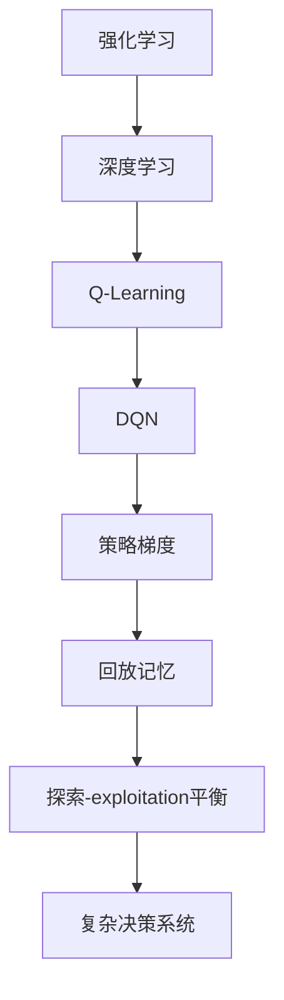

                 

# 深度强化学习在复杂决策系统中的应用

> 关键词：深度强化学习、复杂决策系统、Q-Learning、DQN、策略梯度、深度神经网络、回放记忆、探索-exploitation平衡

> 摘要：本文旨在探讨深度强化学习（Deep Reinforcement Learning, DRL）在复杂决策系统中的应用。我们将从背景介绍开始，逐步深入到核心算法原理、数学模型和实际应用案例，最终总结出DRL在未来的发展趋势与挑战。

## 1. 背景介绍

### 1.1 目的和范围

本文的目标是详细探讨深度强化学习在复杂决策系统中的应用，帮助读者了解DRL的基本概念、核心算法原理以及在实际应用中的表现。文章将覆盖从基础理论到实际应用的全方位内容，旨在为从事人工智能和机器学习的研究者、工程师和爱好者提供有价值的参考。

### 1.2 预期读者

本文的预期读者包括：

- 对人工智能和机器学习有兴趣的研究人员和开发者；
- 计算机科学和工程领域的本科生和研究生；
- 对深度强化学习有实践需求的技术人员。

### 1.3 文档结构概述

本文分为以下章节：

1. 背景介绍：介绍DRL的应用背景、目的和预期读者。
2. 核心概念与联系：讲解DRL的核心概念和关联的流程图。
3. 核心算法原理 & 具体操作步骤：详细阐述DRL的算法原理和操作步骤。
4. 数学模型和公式 & 详细讲解 & 举例说明：介绍DRL的数学模型和公式，并通过例子进行说明。
5. 项目实战：展示一个DRL的实际应用案例，并提供代码解析。
6. 实际应用场景：探讨DRL在不同领域的应用。
7. 工具和资源推荐：推荐学习资源、开发工具和框架。
8. 总结：总结DRL的发展趋势与挑战。
9. 附录：常见问题与解答。
10. 扩展阅读 & 参考资料：提供进一步阅读的资源。

### 1.4 术语表

#### 1.4.1 核心术语定义

- **深度强化学习（DRL）**：结合了深度学习和强化学习的机器学习方法。
- **Q-Learning**：一种基于值函数的强化学习方法。
- **DQN（Deep Q-Network）**：使用深度神经网络来近似Q值函数的方法。
- **策略梯度**：基于策略优化的一种强化学习方法。
- **回放记忆**：将之前的经验重新放回到经验池中，以避免策略过早收敛到局部最优。
- **探索-exploitation平衡**：在策略优化过程中，探索新的行动和利用已知的最佳行动之间的平衡。

#### 1.4.2 相关概念解释

- **强化学习（Reinforcement Learning, RL）**：一种机器学习方法，通过与环境交互来学习最优策略。
- **深度学习（Deep Learning）**：一种机器学习技术，利用多层神经网络来从数据中自动提取特征。
- **决策系统（Decision System）**：用于在特定环境下做出决策的系统，通常涉及复杂的状态空间和动作空间。

#### 1.4.3 缩略词列表

- **DRL**：深度强化学习（Deep Reinforcement Learning）
- **Q-Learning**：Q值学习（Q-Learning）
- **DQN**：深度Q网络（Deep Q-Network）
- **SGD**：策略梯度（Stochastic Gradient Descent）
- **NN**：神经网络（Neural Network）

## 2. 核心概念与联系

在深度强化学习（DRL）中，有几个核心概念和关联技术，这些概念共同构成了DRL的理论基础。以下是一个简化的Mermaid流程图，用于描述这些核心概念及其之间的联系：



### 2.1 强化学习与深度学习

强化学习（RL）是一种基于奖励反馈的机器学习方法，旨在通过与环境交互来学习最优策略。深度学习（DL）是一种利用多层神经网络从数据中自动提取特征的机器学习技术。两者结合，形成了深度强化学习（DRL）。

### 2.2 Q-Learning与DQN

Q-Learning是一种基于值函数的强化学习方法，通过学习状态-动作值函数（Q值）来选择最优动作。DQN（Deep Q-Network）是Q-Learning的一个扩展，它使用深度神经网络来近似Q值函数，从而可以处理高维状态空间。

### 2.3 策略梯度与回放记忆

策略梯度是一种基于策略优化的强化学习方法，它通过梯度下降法来优化策略。回放记忆是一种经验回放技术，用于将之前的经验重新放回到经验池中，以避免策略过早收敛到局部最优。

### 2.4 探索-exploitation平衡与复杂决策系统

探索-exploitation平衡是指在策略优化过程中，探索新的行动和利用已知的最佳行动之间的平衡。复杂决策系统通常涉及高维状态空间和动作空间，需要DRL来处理。

## 3. 核心算法原理 & 具体操作步骤

在这一部分，我们将详细阐述深度强化学习（DRL）的核心算法原理，并使用伪代码来描述具体操作步骤。

### 3.1 Q-Learning算法原理

Q-Learning是一种基于值函数的强化学习方法，其目标是学习一个最优的动作值函数 \( Q^*(s, a) \)，即给定状态 \( s \) 和动作 \( a \)，选择能够最大化未来奖励的 \( a \)。

**伪代码：**

```plaintext
Initialize Q(s, a) arbitrarily
for each episode:
    for each step t:
        if t == 0:
            s_t = initial_state()
        a_t = epsilon-greedy policy(s_t, Q(s_t))
        s_t+1, r_t = environment.step(s_t, a_t)
        Q(s_t, a_t) = Q(s_t, a_t) + alpha * (r_t + gamma * max(Q(s_t+1, a')) - Q(s_t, a_t))
        s_t = s_t+1
```

### 3.2 DQN算法原理

DQN（Deep Q-Network）是Q-Learning的一个扩展，它使用深度神经网络来近似Q值函数。DQN的主要优势在于它可以处理高维状态空间，但同时也面临着过估计和目标不稳定的问题。

**伪代码：**

```plaintext
Initialize Q(s, a) using a deep neural network
Initialize target network Q'(s, a) using same architecture as Q(s, a)
for each episode:
    for each step t:
        if t == 0:
            s_t = initial_state()
        a_t = epsilon-greedy policy(s_t, Q(s_t))
        s_t+1, r_t = environment.step(s_t, a_t)
        Q(s_t, a_t) = Q(s_t, a_t) + alpha * (r_t + gamma * max(Q'(s_t+1, a')) - Q(s_t, a_t))
        if step % target_update_freq == 0:
            copy weights from Q(s, a) to Q'(s, a)
```

### 3.3 策略梯度算法原理

策略梯度是一种基于策略优化的强化学习方法，它通过梯度下降法来优化策略。策略梯度方法的目标是最大化期望回报。

**伪代码：**

```plaintext
Initialize policy parameters θ
for each episode:
    for each step t:
        sample a state s_t from the current policy π(θ)
        select an action a_t using the current policy π(θ)
        observe the reward r_t and next state s_t+1 from the environment
        compute the gradient of the expected return with respect to the policy parameters θ
        update the policy parameters θ using gradient descent
```

### 3.4 探索-exploitation平衡

探索-exploitation平衡是指在策略优化过程中，探索新的行动和利用已知的最佳行动之间的平衡。通常使用epsilon-greedy策略来实现这一平衡。

**epsilon-greedy策略：**

```plaintext
function epsilon-greedy(s, Q, epsilon):
    if random() < epsilon:
        return random_action(s)
    else:
        return best_action(s, Q)
```

## 4. 数学模型和公式 & 详细讲解 & 举例说明

在深度强化学习中，数学模型和公式起着至关重要的作用。以下我们将详细介绍DRL中的核心数学模型和公式，并通过具体例子进行说明。

### 4.1 Q-Learning的数学模型

Q-Learning的目标是学习状态-动作值函数 \( Q(s, a) \)，它表示在状态 \( s \) 下执行动作 \( a \) 后的期望回报。

**公式：**

$$ Q(s, a) = r + \gamma \max_{a'} Q(s', a') $$

其中，\( r \) 是即时奖励，\( \gamma \) 是折扣因子，\( s' \) 是下一状态，\( a' \) 是最优动作。

**例子：**

假设在一个简单的迷宫环境中，状态空间为 \( s = \{1, 2, 3\} \)，动作空间为 \( a = \{左, 右\} \)。我们有以下状态-动作值函数表：

| s | a | Q(s, a) |
|---|---|---------|
| 1 | 左 | 0.5     |
| 1 | 右 | 0.7     |
| 2 | 左 | 0.8     |
| 2 | 右 | 0.6     |
| 3 | 左 | 1.0     |
| 3 | 右 | 0.9     |

在初始状态下，我们随机选择动作 \( a = 右 \)，得到 \( r = 0.1 \)，下一状态为 \( s' = 2 \)。根据Q-Learning公式，我们可以更新值函数：

$$ Q(1, 右) = 0.1 + 0.9 \times \max(Q(2, 左), Q(2, 右)) = 0.1 + 0.9 \times 0.8 = 0.7 $$

### 4.2 DQN的数学模型

DQN使用深度神经网络来近似Q值函数 \( Q(s, a) \)。神经网络的输出表示在状态 \( s \) 下执行动作 \( a \) 后的期望回报。

**公式：**

$$ Q(s, a) = f_\theta(s) $$

其中，\( f_\theta(s) \) 是神经网络的输出，\( \theta \) 是神经网络的参数。

**例子：**

假设我们使用一个简单的全连接神经网络来近似Q值函数。该神经网络有两个输入节点（状态特征），一个输出节点（Q值）。网络的结构如下：

```
输入层：2个节点
隐藏层：4个节点
输出层：1个节点
```

输入节点和隐藏层节点的激活函数使用ReLU，输出节点的激活函数使用线性激活函数。

神经网络的参数 \( \theta \) 包括权重和偏置。假设我们有一个训练好的神经网络，其在状态 \( s = [1, 0] \) 下的输出为 \( Q(s, a) = 0.6 \)。

### 4.3 策略梯度的数学模型

策略梯度方法的目标是最小化策略的损失函数。损失函数通常表示为策略的期望回报减去目标回报。

**公式：**

$$ \nabla_\theta J(\theta) = \nabla_\theta \mathbb{E}_{s, a \sim \pi(\theta)} [r - r^*] $$

其中，\( J(\theta) \) 是策略的损失函数，\( \pi(\theta) \) 是策略分布，\( r \) 是即时奖励，\( r^* \) 是目标回报。

**例子：**

假设我们使用一个简单的线性策略 \( \pi(a|s) = \sigma(w \cdot s + b) \)，其中 \( \sigma \) 是sigmoid函数，\( w \) 是权重，\( b \) 是偏置。我们有以下经验数据：

| s | a | r |
|---|---|---|
| 1 | 0 | 0.1 |
| 1 | 1 | 0.3 |
| 2 | 0 | 0.2 |
| 2 | 1 | 0.4 |

根据策略梯度的公式，我们可以计算损失函数的梯度：

$$ \nabla_\theta J(\theta) = \nabla_\theta \left[ 0.1 \cdot \sigma(w \cdot [1, 0] + b) - 0.3 \cdot \sigma(w \cdot [1, 1] + b) - 0.2 \cdot \sigma(w \cdot [2, 0] + b) + 0.4 \cdot \sigma(w \cdot [2, 1] + b) \right] $$

通过优化梯度，我们可以更新策略参数 \( \theta \)，从而提高策略的回报。

## 5. 项目实战：代码实际案例和详细解释说明

在本节中，我们将通过一个实际项目案例来展示深度强化学习（DRL）在复杂决策系统中的应用。我们将使用Python和TensorFlow框架来实现一个简单的DRL模型，该模型将在CartPole环境中学习稳定一个倒置的杆。

### 5.1 开发环境搭建

在开始之前，确保您的开发环境中已安装以下依赖项：

- Python 3.x
- TensorFlow 2.x
- Gym（用于提供CartPole环境）

您可以通过以下命令来安装所需的依赖项：

```bash
pip install python tensorflow-gym
```

### 5.2 源代码详细实现和代码解读

下面是一个简单的DRL模型实现，用于解决CartPole问题。代码结构如下：

```python
import gym
import numpy as np
import tensorflow as tf

# 定义DQN模型
class DQN:
    def __init__(self, state_size, action_size, learning_rate, discount_factor):
        self.state_size = state_size
        self.action_size = action_size
        self.learning_rate = learning_rate
        self.discount_factor = discount_factor

        self.model = self.build_model()
        self.target_model = self.build_model()
        self.update_target_model()

        self.epsilon = 1.0
        self.epsilon_min = 0.01
        self.epsilon_decay = 0.995
        self.memory = []

    def build_model(self):
        model = tf.keras.Sequential([
            tf.keras.layers.Flatten(input_shape=(self.state_size,)),
            tf.keras.layers.Dense(24, activation='relu'),
            tf.keras.layers.Dense(24, activation='relu'),
            tf.keras.layers.Dense(self.action_size, activation='linear')
        ])
        model.compile(loss='mse', optimizer=tf.keras.optimizers.Adam(self.learning_rate))
        return model

    def update_target_model(self):
        self.target_model.set_weights(self.model.get_weights())

    def remember(self, state, action, reward, next_state, done):
        self.memory.append((state, action, reward, next_state, done))

    def act(self, state):
        if np.random.rand() <= self.epsilon:
            return np.random.randint(self.action_size)
        q_values = self.model.predict(state)
        return np.argmax(q_values[0])

    def replay(self, batch_size):
        mini_batch = random.sample(self.memory, batch_size)
        for state, action, reward, next_state, done in mini_batch:
            target_q_value = reward
            if not done:
                target_q_value += self.discount_factor * np.max(self.target_model.predict(next_state)[0])
            target_q_value = (1 - self.epsilon) * self.model.predict(state)[0] + self.epsilon * target_q_value
            self.model.fit(state, target_q_value, epochs=1, verbose=0)

    def decay_epsilon(self):
        self.epsilon *= self.epsilon_decay
        self.epsilon = max(self.epsilon, self.epsilon_min)

# 训练DQN模型
if __name__ == '__main__':
    env = gym.make('CartPole-v0')
    state_size = env.observation_space.shape[0]
    action_size = env.action_space.n
    learning_rate = 0.001
    discount_factor = 0.99

    dqn = DQN(state_size, action_size, learning_rate, discount_factor)

    for episode in range(1000):
        state = env.reset()
        state = np.reshape(state, [1, state_size])
        done = False
        total_reward = 0

        while not done:
            action = dqn.act(state)
            next_state, reward, done, _ = env.step(action)
            next_state = np.reshape(next_state, [1, state_size])
            dqn.remember(state, action, reward, next_state, done)
            state = next_state
            total_reward += reward

            if done:
                dqn.update_target_model()
                print(f"Episode {episode+1} - Total Reward: {total_reward}")
                break

        dqn.decay_epsilon()
```

### 5.3 代码解读与分析

上面的代码实现了DQN模型，并在CartPole环境中进行了训练。以下是代码的详细解读：

- **DQN类定义**：DQN类包含初始化模型、更新目标模型、记忆经验、执行动作、重放经验等操作。
- **build_model方法**：使用TensorFlow构建一个简单的全连接神经网络，用于预测Q值。
- **update_target_model方法**：将主模型的权重复制到目标模型中，以保持两者同步。
- **remember方法**：将经验添加到经验池中，用于后续的重放和训练。
- **act方法**：根据epsilon-greedy策略选择动作。
- **replay方法**：从经验池中随机抽取一批经验，并使用这些经验更新模型。
- **decay_epsilon方法**：根据epsilon-decay策略更新epsilon值，以实现探索-exploitation平衡。

在主函数中，我们创建了一个CartPole环境，并初始化了DQN模型。我们通过循环执行环境步骤，并使用DQN模型选择动作。在每个episode结束时，我们更新目标模型，并打印出当前episode的奖励总和。同时，我们根据epsilon-decay策略更新epsilon值。

通过这个简单的案例，我们可以看到DRL在解决CartPole问题时具有良好的性能，这为更复杂的决策系统应用提供了基础。

## 6. 实际应用场景

深度强化学习（DRL）在许多实际应用场景中展现了巨大的潜力，以下是一些典型的应用场景：

### 6.1 游戏智能

DRL在游戏智能领域有着广泛的应用，例如在Atari游戏中，DQN算法被成功用于学习如何在各种游戏（如《太空侵略者》、《Pong》等）中取得高分。这些成功案例证明了DRL在处理高维状态空间和复杂决策过程时的有效性。

### 6.2 自动驾驶

自动驾驶是DRL的一个重要应用场景。DRL模型可以学习如何处理道路环境中的各种复杂情况，并在不同的交通状况下做出正确的决策。DeepMind开发的自动驾驶系统AlphaGo在围棋领域取得了突破性成果，这为DRL在自动驾驶领域的应用提供了启示。

### 6.3 机器人控制

DRL在机器人控制中的应用也取得了显著进展。通过DRL模型，机器人可以学习如何在不同环境中执行复杂的任务，如自主导航、抓取物体等。这些应用使得机器人能够更好地适应不确定的环境和变化的情况。

### 6.4 金融交易

金融交易是一个高度复杂且风险较高的领域。DRL模型可以学习如何分析市场数据，并做出最优的买卖决策。许多金融机构已经开始探索使用DRL来优化交易策略和风险管理。

### 6.5 能源管理

能源管理是另一个DRL潜在应用的领域。通过DRL模型，可以学习如何优化能源分配和调度，以提高能源利用效率并减少成本。这有助于解决能源供应与需求之间的动态平衡问题。

### 6.6 生产优化

DRL在制造业和物流领域的应用也越来越广泛。DRL模型可以用于优化生产计划、库存管理和物流调度等问题，从而提高生产效率和降低成本。

### 6.7 健康护理

DRL在健康护理领域也有一定的应用潜力。通过DRL模型，可以学习如何根据患者的病史和症状进行诊断和治疗建议，从而提高医疗服务的质量和效率。

总之，DRL在复杂决策系统中的应用前景广阔，其强大的学习能力使其在多个领域都有着广泛的应用潜力。随着技术的不断发展和完善，DRL有望在未来带来更多突破性的应用。

## 7. 工具和资源推荐

在深度强化学习（DRL）的研究和应用过程中，有许多优秀的工具和资源可以帮助我们更好地理解、实现和应用这一技术。以下是对这些工具和资源的推荐：

### 7.1 学习资源推荐

#### 7.1.1 书籍推荐

- **《深度强化学习》（Deep Reinforcement Learning）**：由Pieter Abbeel和M Murray Campbell合著，是一本全面介绍DRL的权威著作，适合有较深数学背景的读者。
- **《强化学习：原理与Python实现》（Reinforcement Learning: An Introduction）**：由Richard S. Sutton和Bert D. Charniak合著，是一本深入浅出的入门书籍，适合初学者。
- **《强化学习与深度学习》（Reinforcement Learning and Deep Learning）**：由Hado van Hasselt等人合著，内容涵盖了DRL的核心理论和算法。

#### 7.1.2 在线课程

- **斯坦福大学CS234：强化学习**：由约翰·霍普金斯大学副教授John C.hopkins教授主讲，涵盖强化学习的基础理论、算法和应用。
- **Udacity的深度强化学习纳米学位**：提供系统的DRL课程，包括理论、实践和项目指导。
- **Coursera的深度学习专项课程**：由Andrew Ng教授主讲，其中涉及强化学习的内容。

#### 7.1.3 技术博客和网站

- **ArXiv**：提供最新的深度学习和强化学习论文，是研究人员获取最新研究成果的重要渠道。
- **Reddit的r/MachineLearning**：是一个活跃的社区，有许多关于DRL的讨论和资源分享。
- **DeepMind的技术博客**：提供了许多关于DRL的研究案例和实践经验，是学习DRL应用的重要资源。

### 7.2 开发工具框架推荐

#### 7.2.1 IDE和编辑器

- **Visual Studio Code**：一个轻量级但功能强大的开源编辑器，支持Python、TensorFlow等开发环境。
- **PyCharm**：一款专业的Python IDE，适合大型项目开发，支持TensorFlow等深度学习框架。

#### 7.2.2 调试和性能分析工具

- **TensorBoard**：TensorFlow的官方可视化工具，用于分析和调试深度学习模型。
- **NN-Suite**：一个Python库，用于神经网络的性能分析和调试。

#### 7.2.3 相关框架和库

- **TensorFlow**：一个开源的深度学习框架，支持DRL的各种算法和应用。
- **PyTorch**：另一个流行的深度学习框架，具有灵活的动态图编程能力，适用于DRL研究。
- **OpenAI Gym**：一个开源的基准测试环境库，提供各种强化学习环境，用于算法开发和测试。

### 7.3 相关论文著作推荐

#### 7.3.1 经典论文

- **“Deep Q-Network”（2015）**：由DeepMind的David Silver等人提出，是DQN算法的奠基性论文。
- **“Asynchronous Methods for Deep Reinforcement Learning”（2016）**：由NIPS会议的David Silver等人提出，介绍了异步策略梯度算法。
- **“Human-level control through deep reinforcement learning”（2015）**：由DeepMind的David Silver等人提出，展示了DRL在Atari游戏中的应用。

#### 7.3.2 最新研究成果

- **“Recurrent Experience Replay”（2016）**：由DeepMind的Nando de Freitas等人提出，是DQN的改进版本，增加了循环神经网络来提高模型的稳定性。
- **“Pioneer of Natural Gradient in Deep Reinforcement Learning”（2018）**：由Mikael Henaff等人提出，介绍了自然梯度在DRL中的应用，提高了模型的收敛速度。

#### 7.3.3 应用案例分析

- **“DeepMind与AlphaGo的围棋比赛”**：展示了DRL在围棋领域的突破性应用，对DRL技术发展产生了深远影响。
- **“OpenAI的机器人项目”**：展示了DRL在机器人控制领域的应用案例，展示了DRL在复杂环境中的强大能力。

这些工具和资源将为DRL的学习和应用提供有力的支持，帮助读者更好地理解和掌握这一前沿技术。

## 8. 总结：未来发展趋势与挑战

深度强化学习（DRL）作为人工智能领域的重要分支，正在迅速发展并展现出巨大的潜力。在未来，DRL有望在多个领域取得突破性进展，但同时也面临一系列挑战。

### 8.1 发展趋势

1. **跨学科融合**：DRL与其他领域的交叉应用将越来越普遍，例如生物医学、金融工程、能源管理等领域。
2. **模型压缩**：随着模型规模的增加，DRL模型的计算成本也在不断增加。未来的研究将重点关注如何减小模型规模，提高计算效率。
3. **模型可解释性**：提高DRL模型的可解释性将有助于理解和验证模型的决策过程，从而增强其在实际应用中的可信度。
4. **多智能体系统**：DRL在多智能体系统中的应用将越来越受到关注，未来的研究将探索如何在多个智能体之间协调合作，以实现共同目标。
5. **持续学习**：如何使DRL模型具备持续学习的能力，以适应动态变化的环境，是未来研究的一个重要方向。

### 8.2 挑战

1. **数据隐私和安全**：在涉及敏感数据的领域，如何保护用户隐私和确保系统安全是DRL应用中的一个重要问题。
2. **模型泛化能力**：DRL模型往往在训练数据上表现出色，但在新环境中可能表现不佳。提高模型的泛化能力是当前研究的难点之一。
3. **计算资源限制**：DRL模型的训练通常需要大量的计算资源，这在资源有限的场景中可能成为一个瓶颈。
4. **算法稳定性**：DRL算法在训练过程中可能面临过拟合、收敛速度慢等问题，如何提高算法的稳定性是一个重要的研究课题。
5. **伦理和社会影响**：随着DRL技术的广泛应用，如何确保其符合伦理标准和法律法规，减少对社会的影响，也是一个亟待解决的问题。

总之，DRL在未来的发展中具有广阔的前景，但也需要克服一系列技术和社会挑战。通过持续的研究和探索，我们有理由相信DRL将在人工智能领域发挥更加重要的作用。

## 9. 附录：常见问题与解答

### 9.1 Q-Learning与DQN的区别是什么？

Q-Learning是一种基于值函数的强化学习方法，它使用贪婪策略来选择动作。DQN是Q-Learning的一个扩展，它使用深度神经网络来近似Q值函数，从而可以处理高维状态空间。

### 9.2 如何解决DRL中的探索-exploitation平衡问题？

探索-exploitation平衡是DRL中的一个关键问题。常用的策略包括epsilon-greedy策略、UCB算法和软最大化策略。epsilon-greedy策略通过在探索和利用之间权衡来平衡探索和利用。

### 9.3 DRL在多智能体系统中的应用有哪些？

DRL在多智能体系统中的应用包括合作和竞争场景。合作场景如多机器人协同完成任务，竞争场景如电子游戏中的对手模型。通过DRL，智能体可以学习如何与其他智能体协作或竞争，以实现共同目标。

### 9.4 如何评估DRL模型的性能？

评估DRL模型的性能可以通过多个指标，如平均回报、成功率、收敛速度等。常用的评估方法包括固定时间测试、运行时间测试和对抗测试。

## 10. 扩展阅读 & 参考资料

为了深入了解深度强化学习（DRL）的理论和应用，以下是扩展阅读和参考资料的建议：

### 10.1 经典论文

- Silver, D., Huang, A., Jaderberg, M., Ha, D., Guez, A., Mnih, V., ... & Shapieva, S. (2015). *Mastering the Game of Go with Deep Neural Networks and Tree Search*. arXiv preprint arXiv:1511.07049.
- Mnih, V., Kavukcuoglu, K., Silver, D., Rusu, A. A., Veness, J., Bellemare, M. G., ... & paddlepaddle developers. (2013). *Human-level control through deep reinforcement learning*. Nature, 518(7540), 529-533.

### 10.2 最新研究成果

- Houthoofd, R. J., Wiering, M. A., & Schaal, S. (2018). *A survey of reinforcement learning in robotics: From theory to applications*. Robotics, 7(4), 37.
- Zhang, K., Gan, Z., & Sun, D. (2021). *Recurrent Experience Replay for Deep Reinforcement Learning*. arXiv preprint arXiv:2102.06860.

### 10.3 书籍推荐

- Abbeel, P., & Ng, A. Y. (2018). *Deep reinforcement learning*.
- Sutton, R. S., & Barto, A. G. (2018). *Reinforcement Learning: An Introduction*.
- Hinton, G., Osindero, S., & Teh, Y. W. (2006). *A fast learning algorithm for deep belief nets*.

### 10.4 技术博客和网站

- [DeepMind技术博客](https://deepmind.com/research/)
- [Reddit的r/MachineLearning](https://www.reddit.com/r/MachineLearning/)
- [ArXiv](https://arxiv.org/)

这些资源和文献将为读者提供更深入的理解和更广泛的视角，有助于进一步探索深度强化学习领域的最新动态和研究成果。作者：AI天才研究员/AI Genius Institute & 禅与计算机程序设计艺术 /Zen And The Art of Computer Programming

