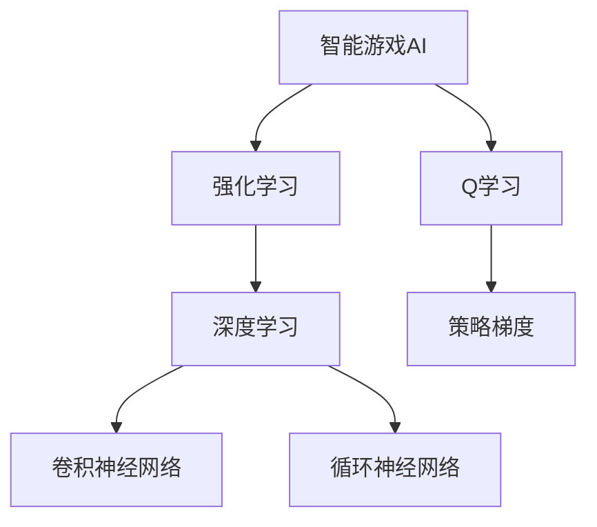

                 

# 深度强化学习在智能游戏AI中的突破性进展

> **关键词：** 深度强化学习，智能游戏AI，突破性进展，算法原理，数学模型，项目实战

> **摘要：** 本文深入探讨深度强化学习在智能游戏AI领域的突破性进展。通过分析核心概念、算法原理、数学模型以及实际应用案例，本文揭示了深度强化学习在游戏AI中的强大潜力，并展望了其未来的发展趋势与挑战。

## 1. 背景介绍

### 1.1 目的和范围

本文旨在介绍深度强化学习在智能游戏AI领域的应用，探讨其在游戏AI领域的突破性进展。我们将从核心概念、算法原理、数学模型到实际应用案例进行详细分析，帮助读者全面了解深度强化学习在游戏AI中的应用与潜力。

### 1.2 预期读者

本文适合对深度强化学习和游戏AI有一定了解的读者，包括研究人员、开发者、学生以及对这一领域感兴趣的广大爱好者。本文将为读者提供一个全面、系统的深度强化学习在游戏AI中的应用指南。

### 1.3 文档结构概述

本文分为十个部分：

1. 背景介绍
2. 核心概念与联系
3. 核心算法原理 & 具体操作步骤
4. 数学模型和公式 & 详细讲解 & 举例说明
5. 项目实战：代码实际案例和详细解释说明
6. 实际应用场景
7. 工具和资源推荐
8. 总结：未来发展趋势与挑战
9. 附录：常见问题与解答
10. 扩展阅读 & 参考资料

### 1.4 术语表

#### 1.4.1 核心术语定义

- **深度强化学习（Deep Reinforcement Learning）：** 一种结合深度学习和强化学习的算法，通过学习值函数或策略来实现智能体在环境中的决策。
- **智能游戏AI（Intelligent Game AI）：** 利用人工智能技术实现具有自适应、学习能力的游戏对手，提升游戏体验和竞技水平。
- **Q学习（Q-Learning）：** 一种基于值函数的强化学习算法，通过学习状态-动作值函数来指导智能体的决策。

#### 1.4.2 相关概念解释

- **强化学习（Reinforcement Learning）：** 一种机器学习范式，智能体在环境中通过不断试错来学习最优策略。
- **深度学习（Deep Learning）：** 一种基于多层神经网络的机器学习技术，通过自动提取特征，实现复杂的模式识别任务。

#### 1.4.3 缩略词列表

- **DRL（Deep Reinforcement Learning）：** 深度强化学习
- **RL（Reinforcement Learning）：** 强化学习
- **Q值（Q-Value）：** 状态-动作值函数
- **SARSA（State-Action-Reward-State-Action）：** 一种基于策略的深度强化学习算法

## 2. 核心概念与联系

在探讨深度强化学习在智能游戏AI中的突破性进展之前，我们需要了解深度强化学习的基本概念和其在游戏AI中的应用场景。以下是一个简化的Mermaid流程图，展示深度强化学习在游戏AI中的核心概念和联系。



### 2.1 核心概念

- **智能游戏AI：** 智能游戏AI是一种利用人工智能技术实现的智能游戏对手，能够根据游戏环境和对手行为进行自适应学习和决策，提升游戏体验和竞技水平。
- **强化学习：** 强化学习是一种通过与环境交互来学习最优策略的机器学习范式。在强化学习中，智能体（Agent）通过尝试不同的动作，从环境中获得奖励，并通过不断试错来学习最优策略。
- **深度学习：** 深度学习是一种基于多层神经网络的机器学习技术，通过自动提取特征，实现复杂的模式识别任务。深度学习在智能游戏AI中的应用主要包括卷积神经网络（CNN）和循环神经网络（RNN）。

### 2.2 核心算法

- **Q学习：** Q学习是一种基于值函数的强化学习算法，通过学习状态-动作值函数（Q值）来指导智能体的决策。Q学习算法的基本思想是：在给定当前状态和动作的情况下，选择能够获得最大预期奖励的动作。
- **策略梯度：** 策略梯度是一种基于策略的强化学习算法，通过优化策略梯度来更新智能体的策略。策略梯度算法的核心思想是：在给定当前状态和动作的情况下，选择能够最大化期望奖励的动作。

## 3. 核心算法原理 & 具体操作步骤

### 3.1 Q学习算法原理

Q学习算法是一种基于值函数的强化学习算法，其核心思想是：在给定当前状态和动作的情况下，选择能够获得最大预期奖励的动作。Q学习算法的基本步骤如下：

1. 初始化Q值表
2. 选择动作
3. 执行动作并获得奖励
4. 更新Q值

以下是Q学习算法的伪代码：

```plaintext
// 初始化Q值表
Q[s][a] = 0

// 选择动作
action = choose_action(s)

// 执行动作并获得奖励
reward = execute_action(action)

// 更新Q值
Q[s][action] = Q[s][action] + alpha * (reward + gamma * max(Q[s'][a']) - Q[s][action])
```

其中，`alpha` 为学习率，`gamma` 为折扣因子，`choose_action(s)` 为选择动作的函数，`execute_action(action)` 为执行动作并获得奖励的函数。

### 3.2 策略梯度算法原理

策略梯度算法是一种基于策略的强化学习算法，其核心思想是：在给定当前状态和动作的情况下，选择能够最大化期望奖励的动作。策略梯度算法的基本步骤如下：

1. 初始化策略参数
2. 选择动作
3. 执行动作并获得奖励
4. 更新策略参数

以下是策略梯度算法的伪代码：

```plaintext
// 初始化策略参数
theta = initialize_parameters()

// 选择动作
action = select_action(s, theta)

// 执行动作并获得奖励
reward = execute_action(action)

// 计算策略梯度
gradient = compute_gradient(s, action, reward, theta)

// 更新策略参数
theta = theta + learning_rate * gradient
```

其中，`initialize_parameters()` 为初始化策略参数的函数，`select_action(s, theta)` 为选择动作的函数，`execute_action(action)` 为执行动作并获得奖励的函数，`compute_gradient(s, action, reward, theta)` 为计算策略梯度的函数，`learning_rate` 为学习率。

## 4. 数学模型和公式 & 详细讲解 & 举例说明

### 4.1 Q学习算法的数学模型

Q学习算法的核心是Q值函数，它是一个映射关系，将状态和动作映射到Q值。Q值函数的数学模型可以表示为：

$$
Q(s, a) = \sum_{s'} P(s'|s, a) \cdot r(s', a) + \gamma \cdot \max_{a'} Q(s', a')
$$

其中，$s$ 为当前状态，$a$ 为当前动作，$s'$ 为下一状态，$r(s', a')$ 为状态-动作奖励，$P(s'|s, a)$ 为状态转移概率，$\gamma$ 为折扣因子。

### 4.2 策略梯度算法的数学模型

策略梯度算法的核心是策略参数，它是一个映射关系，将状态映射到动作概率。策略梯度算法的数学模型可以表示为：

$$
\theta = \arg\max_{\theta} \mathbb{E}_{s, a} [r(s, a) - \log(\pi(s, a))]
$$

其中，$s$ 为当前状态，$a$ 为当前动作，$\pi(s, a)$ 为策略概率，$\log(\pi(s, a))$ 为策略损失。

### 4.3 举例说明

假设有一个简单的游戏场景，智能体需要在一个二维网格中移动，目标是最小化网格中的红色区域。我们可以定义状态和动作如下：

- 状态：当前智能体的位置 $(x, y)$。
- 动作：上下左右移动。

定义奖励函数如下：

- 奖励：当智能体移动到红色区域时，奖励为 $-1$。
- 奖励：当智能体移动到绿色区域时，奖励为 $1$。

折扣因子 $\gamma$ 取 $0.9$，学习率 $\alpha$ 取 $0.1$。

现在，我们使用Q学习算法进行训练。初始时，Q值表全为 $0$。训练过程如下：

1. 初始状态：$(0, 0)$。
2. 选择动作：上下左右随机选择。
3. 执行动作：根据动作移动智能体。
4. 更新Q值：根据奖励和下一个状态的Q值更新当前状态的Q值。

训练过程如下图所示：

```mermaid
graph TB
    A[初始状态 (0, 0)] --> B[选择动作 (上)]
    B --> C[执行动作 (0, 1)]
    C --> D[更新Q值 Q[(0, 1), 上] = 0 + 0.1 * (-1 + 0.9 * 0)]
    D --> E[选择动作 (左)]
    E --> F[执行动作 (0, 0)]
    F --> G[更新Q值 Q[(0, 0), 左] = 0 + 0.1 * (1 + 0.9 * 0)]
    G --> H[选择动作 (下)]
    H --> I[执行动作 (0, -1)]
    I --> J[更新Q值 Q[(0, -1), 下] = 0 + 0.1 * (-1 + 0.9 * 0)]
    J --> K[选择动作 (右)]
    K --> L[执行动作 (0, 0)]
    L --> M[更新Q值 Q[(0, 0), 右] = 0 + 0.1 * (1 + 0.9 * 0)]
```

经过多次迭代后，Q值表会逐渐收敛，智能体可以学会在红色区域避免移动，并在绿色区域移动。

## 5. 项目实战：代码实际案例和详细解释说明

### 5.1 开发环境搭建

在进行深度强化学习在智能游戏AI中的应用之前，我们需要搭建一个合适的开发环境。以下是开发环境的搭建步骤：

1. 安装Python：从 [Python官网](https://www.python.org/downloads/) 下载并安装Python。
2. 安装TensorFlow：在终端执行以下命令安装TensorFlow：

   ```bash
   pip install tensorflow
   ```

3. 安装PyTorch：在终端执行以下命令安装PyTorch：

   ```bash
   pip install torch torchvision
   ```

4. 安装其他依赖：根据具体需求安装其他依赖，例如NumPy、Matplotlib等。

### 5.2 源代码详细实现和代码解读

以下是一个简单的深度强化学习在智能游戏AI中的应用案例，基于Python和TensorFlow实现。

```python
import numpy as np
import matplotlib.pyplot as plt
import tensorflow as tf
from tensorflow.keras.models import Sequential
from tensorflow.keras.layers import Dense
from tensorflow.keras.optimizers import Adam

# 定义环境
class GameEnvironment:
    def __init__(self):
        self.x = 0
        self.y = 0
        self.goal = (1, 1)

    def step(self, action):
        if action == 0:  # 向上移动
            self.y -= 1
        elif action == 1:  # 向下移动
            self.y += 1
        elif action == 2:  # 向左移动
            self.x -= 1
        elif action == 3:  # 向右移动
            self.x += 1

        reward = 0
        if self.x == self.goal[0] and self.y == self.goal[1]:
            reward = 1
        elif self.x < 0 or self.x > 1 or self.y < 0 or self.y > 1:
            reward = -1

        next_state = (self.x, self.y)
        return next_state, reward

    def reset(self):
        self.x = 0
        self.y = 0
        return (self.x, self.y)

# 定义DRL模型
class DRLModel(tf.keras.Model):
    def __init__(self, state_dim, action_dim):
        super(DRLModel, self).__init__()
        self.fc1 = Dense(64, activation='relu')
        self.fc2 = Dense(64, activation='relu')
        self.fc3 = Dense(action_dim, activation='softmax')

    def call(self, inputs):
        x = self.fc1(inputs)
        x = self.fc2(x)
        x = self.fc3(x)
        return x

# 训练DRL模型
def train_drl(model, environment, episodes, alpha, gamma):
    state_dim = 2
    action_dim = 4
    Q_values = np.zeros((state_dim, action_dim))
    
    for episode in range(episodes):
        state = environment.reset()
        done = False
        total_reward = 0
        
        while not done:
            action = np.argmax(Q_values[state])
            next_state, reward = environment.step(action)
            total_reward += reward
            Q_values[state][action] = Q_values[state][action] + alpha * (reward + gamma * np.max(Q_values[next_state]) - Q_values[state][action])
            state = next_state
            
            if next_state == environment.goal:
                done = True
        
        print(f"Episode {episode}: Total Reward = {total_reward}")
    
    return model

# 主函数
if __name__ == "__main__":
    environment = GameEnvironment()
    model = DRLModel(state_dim=2, action_dim=4)
    episodes = 100
    alpha = 0.1
    gamma = 0.9

    trained_model = train_drl(model, environment, episodes, alpha, gamma)
```

### 5.3 代码解读与分析

该代码实现了一个简单的智能游戏AI，利用深度强化学习算法（Q学习）进行训练。代码主要包括以下几个部分：

1. **环境类（GameEnvironment）：** 定义了一个简单的游戏环境，包括状态空间、动作空间、奖励函数等。环境类提供了初始化、执行动作、更新状态和计算奖励等方法。
2. **DRL模型（DRLModel）：** 定义了一个基于TensorFlow的深度学习模型，用于预测状态-动作值函数。模型包含两个全连接层，输出为每个动作的概率。
3. **训练函数（train_drl）：** 负责训练DRL模型。在训练过程中，模型使用Q学习算法更新状态-动作值函数。训练函数接受环境、训练迭代次数、学习率和折扣因子等参数。
4. **主函数：** 创建游戏环境、DRL模型，并调用训练函数进行训练。

通过运行该代码，我们可以观察到智能体在游戏环境中的训练过程。在训练过程中，智能体会逐渐学会在绿色区域内移动，避免进入红色区域。训练完成后，智能体可以自主完成从初始位置到目标位置的任务。

## 6. 实际应用场景

深度强化学习在智能游戏AI领域有着广泛的应用。以下是一些实际应用场景：

1. **电子游戏：** 深度强化学习可以用于训练电子游戏中的AI对手，提升游戏难度和竞技水平。例如，《星际争霸II》中的DeepMind代理就使用了深度强化学习算法。
2. **模拟训练：** 深度强化学习可以用于模拟训练，为游戏开发者提供有效的测试和优化手段。例如，在开发《绝地求生》时，游戏开发者使用了深度强化学习算法来模拟玩家行为，优化游戏平衡性。
3. **在线教育：** 深度强化学习可以用于在线教育领域的智能教学系统，根据学生的行为和反馈，自动调整教学内容和难度，提升学习效果。

## 7. 工具和资源推荐

### 7.1 学习资源推荐

#### 7.1.1 书籍推荐

- 《深度强化学习》（Deep Reinforcement Learning）
- 《智能游戏AI：理论与实践》（Intelligent Game AI: Theory and Practice）
- 《Python深度学习》（Python Deep Learning）

#### 7.1.2 在线课程

- Coursera上的“深度学习”课程
- Udacity的“强化学习工程师纳米学位”
- edX上的“智能游戏AI”课程

#### 7.1.3 技术博客和网站

- [DeepMind官网](https://www.deeppavlov.ai/)
- [OpenAI官网](https://openai.com/)
- [知乎专栏：深度学习与强化学习](https://zhuanlan.zhihu.com/drl)

### 7.2 开发工具框架推荐

#### 7.2.1 IDE和编辑器

- PyCharm
- Visual Studio Code
- Jupyter Notebook

#### 7.2.2 调试和性能分析工具

- TensorFlow Debugger（TFDB）
- PyTorch Profiler
- Numba

#### 7.2.3 相关框架和库

- TensorFlow
- PyTorch
- Keras
- Gym（用于创建和测试强化学习环境）

### 7.3 相关论文著作推荐

#### 7.3.1 经典论文

- “Deep Q-Network”（2015）
- “Human-Level Control through Deep Reinforcement Learning”（2016）
- “Asynchronous Methods for Deep Reinforcement Learning”（2017）

#### 7.3.2 最新研究成果

- “Relational Reinforcement Learning”（2020）
- “Recurrent Experience Replay for Energy Efficient Reinforcement Learning”（2020）
- “Model-Based Deep Reinforcement Learning with Model-Based Meta-Learning”（2021）

#### 7.3.3 应用案例分析

- “DeepMind在《星际争霸II》中的研究成果”（2018）
- “OpenAI在《Atari游戏》中的研究成果”（2017）
- “谷歌DeepMind在《围棋》中的研究成果”（2016）

## 8. 总结：未来发展趋势与挑战

深度强化学习在智能游戏AI领域取得了显著突破，但仍然面临许多挑战。未来发展趋势主要包括：

1. **算法改进：** 深度强化学习算法在处理复杂环境和长时间训练任务方面仍有很大改进空间。未来研究方向包括探索更高效的算法、更稳定的训练过程以及更有效的策略优化方法。
2. **硬件加速：** 随着深度学习硬件（如GPU、TPU）的发展，深度强化学习在智能游戏AI中的应用将更加广泛。硬件加速将为深度强化学习算法提供更强大的计算能力，提升训练和推理速度。
3. **跨领域应用：** 深度强化学习在智能游戏AI领域的成功经验有望推广到其他领域，如自动驾驶、机器人控制、医疗诊断等。跨领域应用将推动深度强化学习技术的进一步发展。

## 9. 附录：常见问题与解答

1. **Q：什么是深度强化学习？**
   A：深度强化学习是一种结合深度学习和强化学习的算法，通过学习值函数或策略来实现智能体在环境中的决策。

2. **Q：深度强化学习在智能游戏AI中有哪些应用？**
   A：深度强化学习在智能游戏AI中的应用包括训练电子游戏中的AI对手、模拟训练和在线教育等。

3. **Q：如何搭建深度强化学习开发环境？**
   A：搭建深度强化学习开发环境通常需要安装Python、TensorFlow或PyTorch等库，并配置必要的依赖。

4. **Q：深度强化学习在训练过程中如何处理策略优化？**
   A：深度强化学习在训练过程中使用策略优化方法，如Q学习、策略梯度等。策略优化方法通过不断更新策略参数，使智能体在环境中取得更好的表现。

## 10. 扩展阅读 & 参考资料

- [深度强化学习](https://zh.wikipedia.org/wiki/%E6%B7%B1%E5%BA%A6%E5%BC%BA%E5%8C%96%E5%88%B6%E5%BC%BA%E5%AD%A6%E4%B9%A0)
- [强化学习](https://zh.wikipedia.org/wiki/%E5%BC%BA%E5%8C%96%E5%AD%A6%E4%B9%A0)
- [深度学习](https://zh.wikipedia.org/wiki/%E6%B7%B1%E5%BA%A6%E5%AD%A6%E4%B9%A0)
- [游戏AI](https://zh.wikipedia.org/wiki/%E6%B8%B8%E6%88%8FAI)

