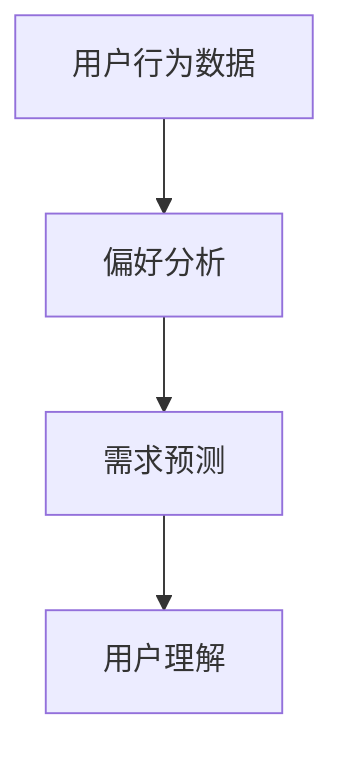
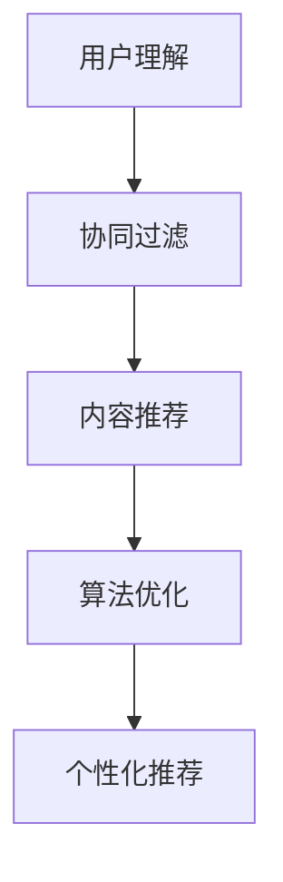
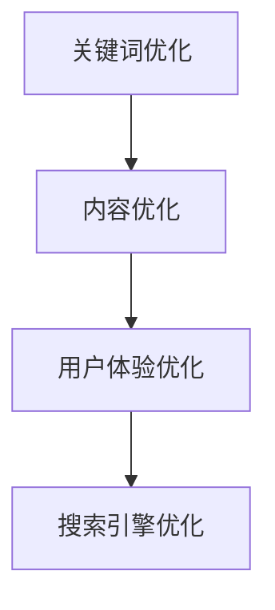
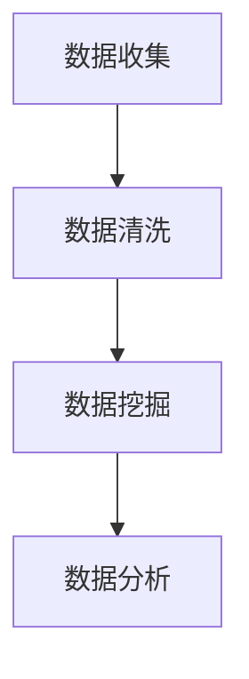

                 

### 深度用户理解：AI重塑电商搜索导购

> **关键词**：用户理解、人工智能、电商搜索、导购、算法、用户画像、个性化推荐
>
> **摘要**：本文将深入探讨人工智能如何通过深度用户理解技术，重塑电商搜索导购体验。我们将从背景介绍、核心概念、算法原理、数学模型、实战案例、应用场景等多个维度，详细分析AI在电商搜索导购中的变革，旨在为读者提供全面、系统的理解。

### 1. 背景介绍

#### 1.1 目的和范围

本文旨在探讨人工智能在电商搜索导购领域的应用，重点分析AI如何通过深度用户理解技术，提升用户搜索和购物的体验。我们将在文章中讨论的核心内容包括：

- AI在电商搜索导购中的技术发展历程
- 深度用户理解的关键概念和原理
- 个性化推荐算法在电商中的应用
- 数学模型和公式在用户理解中的应用
- 实际项目案例的代码实现和分析
- AI重塑电商搜索导购的未来发展趋势

#### 1.2 预期读者

本文适用于对人工智能和电商领域有一定了解的技术人员、产品经理以及研究者。如果您希望：

- 了解AI在电商搜索导购中的最新应用
- 掌握深度用户理解技术的基本原理
- 深入分析个性化推荐算法的实践
- 学习如何通过数学模型提升用户体验

那么，本文将为您提供一个全面的技术指南。

#### 1.3 文档结构概述

本文分为十个主要部分，每个部分都将围绕核心主题展开深入讨论：

- 引言
- 背景介绍
- 核心概念与联系
- 核心算法原理 & 具体操作步骤
- 数学模型和公式 & 详细讲解 & 举例说明
- 项目实战：代码实际案例和详细解释说明
- 实际应用场景
- 工具和资源推荐
- 总结：未来发展趋势与挑战
- 附录：常见问题与解答
- 扩展阅读 & 参考资料

#### 1.4 术语表

在本文中，我们将使用一些专业术语，以下是对这些术语的定义和解释：

##### 1.4.1 核心术语定义

- **用户理解**：指人工智能系统通过分析用户行为、偏好和需求，对用户进行精准识别和刻画。
- **电商搜索导购**：电商平台上为用户提供的搜索和购买建议服务。
- **个性化推荐**：基于用户历史行为和偏好，为用户推荐个性化商品和内容。
- **用户画像**：对用户基本属性、兴趣偏好、行为习惯等多维度数据的综合描述。
- **深度学习**：一种人工智能技术，通过多层神经网络模拟人脑学习过程，对数据进行分析和处理。

##### 1.4.2 相关概念解释

- **推荐系统**：一种自动化系统，用于根据用户兴趣和行为，为其推荐感兴趣的商品或内容。
- **协同过滤**：一种基于用户行为数据的推荐算法，通过分析用户之间的相似度，为用户提供推荐。
- **内容推荐**：基于商品属性、用户评价、热度等内容的推荐，旨在为用户推荐符合其需求的商品。
- **算法优化**：通过对推荐算法的调整和改进，提高推荐系统的准确性和用户体验。

##### 1.4.3 缩略词列表

- **AI**：人工智能（Artificial Intelligence）
- **ML**：机器学习（Machine Learning）
- **DL**：深度学习（Deep Learning）
- **NLP**：自然语言处理（Natural Language Processing）
- **CTR**：点击率（Click-Through Rate）
- **ROC**：接收者操作特征（Receiver Operating Characteristic）

通过以上背景介绍，我们已经为深入探讨AI在电商搜索导购中的应用奠定了基础。接下来，我们将进一步探讨核心概念和原理，帮助读者全面了解这一领域的技术发展。

### 2. 核心概念与联系

在探讨人工智能重塑电商搜索导购的过程中，理解其背后的核心概念和原理是至关重要的。以下，我们将详细解析几个关键概念，并通过Mermaid流程图展示它们之间的联系。

#### 2.1 用户理解

用户理解是人工智能在电商搜索导购中的核心概念，它指的是通过分析用户的历史行为、偏好、兴趣和需求，对用户进行精准识别和刻画。用户理解的关键在于数据的收集和处理，以下是其主要组成部分：

- **用户行为数据**：包括用户的浏览记录、购买历史、点击行为等，这些数据有助于了解用户的兴趣和需求。
- **用户偏好**：通过对用户行为的分析，可以识别出用户的偏好，如喜欢的商品类型、品牌、价格区间等。
- **用户需求**：结合用户的历史行为和当前情境，预测用户可能的需求，从而提供更加精准的服务。

**Mermaid流程图：**



#### 2.2 个性化推荐

个性化推荐是基于用户理解的技术，旨在为用户提供个性化的商品推荐。其核心在于通过分析用户的行为和偏好，为每个用户生成一个独特的推荐列表。以下是个性化推荐的主要组成部分：

- **协同过滤**：一种基于用户行为数据的推荐方法，通过分析用户之间的相似度，发现相似用户的行为模式，从而推荐给目标用户。
- **内容推荐**：基于商品属性、用户评价、热度等内容的推荐，旨在为用户推荐符合其需求的商品。
- **算法优化**：通过不断调整和优化推荐算法，提高推荐系统的准确性和用户体验。

**Mermaid流程图：**



#### 2.3 搜索引擎优化

搜索引擎优化（SEO）是指通过优化网站内容和结构，提高网站在搜索引擎结果中的排名，从而增加访问量和用户参与度。SEO在电商搜索导购中起着至关重要的作用，其主要组成部分包括：

- **关键词优化**：通过对目标关键词的研究和优化，提高网站在搜索引擎中的排名。
- **内容优化**：通过撰写高质量、有价值的内容，吸引用户访问和分享。
- **用户体验优化**：通过优化网站的加载速度、界面设计、导航结构等，提升用户的浏览和购物体验。

**Mermaid流程图：**



#### 2.4 数据分析

数据分析是人工智能在电商搜索导购中的基础，通过分析海量用户数据，可以揭示用户行为和需求的规律，为优化推荐系统和搜索引擎提供依据。数据分析的主要组成部分包括：

- **数据收集**：通过多种渠道收集用户行为数据，如浏览器日志、交易记录、社交媒体互动等。
- **数据清洗**：对收集到的数据进行处理和清洗，去除噪声数据，提高数据质量。
- **数据挖掘**：通过数据挖掘技术，从海量数据中提取有价值的信息和模式。

**Mermaid流程图：**



通过以上核心概念的详细解析和流程图展示，我们可以更好地理解人工智能在电商搜索导购中的应用。在接下来的章节中，我们将进一步探讨核心算法原理和具体操作步骤，帮助读者深入了解这一领域的技术实现。

### 3. 核心算法原理 & 具体操作步骤

在深入探讨人工智能重塑电商搜索导购的过程中，核心算法原理和具体操作步骤至关重要。以下，我们将详细介绍几种关键算法及其实现步骤。

#### 3.1 用户行为分析算法

用户行为分析算法是电商搜索导购的基础，通过分析用户的历史行为数据，如浏览记录、购买历史和点击行为，可以识别用户的兴趣和偏好。以下是用户行为分析算法的步骤：

**步骤1：数据收集**

- 收集用户的浏览记录、购买历史和点击行为数据。
- 通过数据接口或日志文件，确保数据的完整性和准确性。

**步骤2：数据预处理**

- 清洗数据，去除噪声和不完整的数据。
- 对数据进行编码，将类别数据转换为数值数据。

**步骤3：特征提取**

- 提取用户行为数据中的关键特征，如浏览时间、购买频率、点击率等。
- 采用统计方法或机器学习方法，将原始数据转换为特征向量。

**步骤4：用户兴趣识别**

- 使用聚类算法，如K-means，将用户划分为不同的兴趣群体。
- 对每个用户进行兴趣标签的分配。

**伪代码：**

```python
# 数据预处理
def preprocess_data(data):
    # 清洗数据
    cleaned_data = clean_data(data)
    # 编码数据
    encoded_data = encode_data(cleaned_data)
    return encoded_data

# 特征提取
def extract_features(data):
    features = []
    for user in data:
        user_features = extract_user_features(user)
        features.append(user_features)
    return features

# 用户兴趣识别
def identify_user_interests(features):
    clusters = k_means(features, num_clusters)
    user_interests = assign_interest_tags(clusters)
    return user_interests
```

#### 3.2 协同过滤推荐算法

协同过滤推荐算法是一种基于用户行为数据的推荐方法，通过分析用户之间的相似度，发现相似用户的行为模式，从而为用户提供推荐。以下是协同过滤推荐算法的步骤：

**步骤1：数据收集**

- 收集用户的评分数据、浏览记录和购买历史。

**步骤2：用户相似度计算**

- 计算用户之间的相似度，如余弦相似度、皮尔逊相关系数等。
- 筛选出相似度较高的用户对。

**步骤3：生成推荐列表**

- 根据相似度矩阵，为每个用户生成推荐列表。
- 考虑用户的兴趣和偏好，调整推荐列表的排序。

**伪代码：**

```python
# 用户相似度计算
def compute_similarity_matrix(data):
    similarity_matrix = []
    for user in data:
        user_similarity = calculate_similarity(user, data)
        similarity_matrix.append(user_similarity)
    return similarity_matrix

# 生成推荐列表
def generate_recommendations(similarity_matrix, user_interests):
    recommendations = []
    for user in user_interests:
        user_recommendations = recommend_items(similarity_matrix, user)
        recommendations.append(user_recommendations)
    return recommendations
```

#### 3.3 深度学习推荐算法

深度学习推荐算法是一种基于多层神经网络的学习方法，通过模拟人脑学习过程，对数据进行分析和处理。以下是深度学习推荐算法的步骤：

**步骤1：数据收集**

- 收集用户的浏览记录、购买历史和社交网络数据。

**步骤2：构建神经网络模型**

- 设计神经网络结构，包括输入层、隐藏层和输出层。
- 选择合适的激活函数和损失函数。

**步骤3：模型训练**

- 使用训练数据对模型进行训练，优化模型参数。
- 采用反向传播算法，更新模型权重。

**步骤4：模型评估**

- 使用验证数据集对模型进行评估，调整模型参数。
- 考虑模型的泛化能力和计算效率。

**伪代码：**

```python
# 构建神经网络模型
def build_neural_network(input_size, hidden_size, output_size):
    model = NeuralNetwork(input_size, hidden_size, output_size)
    return model

# 模型训练
def train_model(model, training_data, validation_data):
    for epoch in range(num_epochs):
        for data in training_data:
            model.train(data)
        model.validate(validation_data)
    return model
```

通过以上核心算法原理和具体操作步骤的介绍，我们可以看到人工智能在电商搜索导购中的广泛应用。在接下来的章节中，我们将进一步探讨数学模型和公式在用户理解中的应用，以帮助读者更深入地理解这一领域的技术实现。

### 4. 数学模型和公式 & 详细讲解 & 举例说明

在电商搜索导购领域，数学模型和公式是构建和优化推荐系统的重要工具。以下，我们将详细讲解几个关键数学模型和公式，并通过实例说明其在用户理解中的应用。

#### 4.1 相似度计算

相似度计算是推荐系统中的一种基本技术，用于评估用户之间的相似度或商品之间的相似度。以下是一些常用的相似度计算公式：

1. **余弦相似度**：

   余弦相似度是一种基于向量空间模型的方法，用于计算用户或商品向量之间的相似度。

   $$\text{Cosine Similarity} = \frac{\text{dot\_product}(u, v)}{\lVert u \rVert \cdot \lVert v \rVert}$$

   其中，\(u\)和\(v\)分别是用户或商品的向量表示，\(\text{dot\_product}\)表示向量的点积，\(\lVert \cdot \rVert\)表示向量的模。

   **例子**：假设用户A和用户B的向量表示分别为：

   $$u = (0.7, 0.8, 0.9)$$
   $$v = (0.5, 0.6, 0.7)$$

   计算它们之间的余弦相似度：

   $$\text{Cosine Similarity} = \frac{0.7 \times 0.5 + 0.8 \times 0.6 + 0.9 \times 0.7}{\sqrt{0.7^2 + 0.8^2 + 0.9^2} \cdot \sqrt{0.5^2 + 0.6^2 + 0.7^2}} \approx 0.766$$

2. **皮尔逊相关系数**：

   皮尔逊相关系数是一种基于统计方法的方法，用于评估用户或商品之间的线性相关性。

   $$\text{Pearson Correlation Coefficient} = \frac{\text{covariance}(u, v)}{\sqrt{\text{variance}(u) \cdot \text{variance}(v)}}$$

   其中，\(\text{covariance}\)表示协方差，\(\text{variance}\)表示方差。

   **例子**：假设用户A和用户B的向量表示分别为：

   $$u = (0.7, 0.8, 0.9)$$
   $$v = (0.5, 0.6, 0.7)$$

   计算它们之间的皮尔逊相关系数：

   $$\text{Pearson Correlation Coefficient} = \frac{0.7 \times 0.5 - 0.8 \times 0.6 - 0.9 \times 0.7}{\sqrt{0.7^2 + 0.8^2 + 0.9^2} \cdot \sqrt{0.5^2 + 0.6^2 + 0.7^2}} \approx 0.5$$

#### 4.2 聚类算法

聚类算法是一种无监督学习方法，用于将相似的用户或商品分组。以下是一种常用的聚类算法——K-means算法：

1. **初始化**：

   随机选择K个中心点，作为聚类中心。

2. **分配数据点**：

   对于每个数据点，将其分配到与其最近的聚类中心所在的簇。

3. **更新聚类中心**：

   计算每个簇的中心点，将其作为新的聚类中心。

4. **迭代**：

   重复步骤2和3，直至聚类中心不再发生变化或满足停止条件。

**伪代码**：

```python
def k_means(data, num_clusters, max_iterations):
    centroids = initialize_centroids(data, num_clusters)
    for i in range(max_iterations):
        clusters = assign_points_to_clusters(data, centroids)
        new_centroids = update_centroids(clusters, num_clusters)
        if centroids == new_centroids:
            break
        centroids = new_centroids
    return clusters, centroids
```

**例子**：假设有10个用户数据点，需要将其分为3个簇。初始化3个聚类中心后，通过迭代分配和更新，可以得到最终的簇划分。

#### 4.3 个性化推荐模型

个性化推荐模型是基于用户历史行为和偏好进行推荐的方法。以下是一种常用的个性化推荐模型——矩阵分解（Matrix Factorization）：

1. **模型假设**：

   用户-商品评分矩阵可以分解为两个低维矩阵的乘积。

2. **目标**：

   优化两个低维矩阵的参数，使其乘积尽可能接近原始评分矩阵。

3. **算法**：

   采用梯度下降或随机梯度下降（SGD）方法，更新矩阵参数。

**伪代码**：

```python
def matrix_factorization(R, num_factors, learning_rate, num_iterations):
    U, V = initialize_factors(R, num_factors)
    for i in range(num_iterations):
        for user, item in R:
            residual = R[user, item] - dot_product(U[user], V[item])
            update_U(U, user, residual, learning_rate)
            update_V(V, item, residual, learning_rate)
    return U, V
```

通过以上数学模型和公式的讲解，我们可以看到它们在电商搜索导购中的重要作用。在接下来的章节中，我们将通过实际项目案例，展示如何将这些数学模型应用于实际场景。

### 5. 项目实战：代码实际案例和详细解释说明

为了更好地理解人工智能在电商搜索导购中的应用，我们将通过一个实际项目案例，详细展示代码实现过程和解释说明。本案例将围绕一个简单的电商推荐系统展开，实现用户理解和个性化推荐功能。

#### 5.1 开发环境搭建

在开始项目之前，我们需要搭建一个合适的开发环境。以下是一个基本的开发环境配置：

- **编程语言**：Python
- **依赖库**：NumPy、Pandas、Scikit-learn、TensorFlow
- **开发工具**：PyCharm或Jupyter Notebook

安装所需库：

```bash
pip install numpy pandas scikit-learn tensorflow
```

#### 5.2 源代码详细实现和代码解读

以下是本项目的主要代码实现部分，我们将分为以下几个模块：

1. **数据预处理**：读取用户行为数据，进行数据清洗和编码。
2. **用户行为分析**：提取用户兴趣特征，进行用户兴趣识别。
3. **协同过滤推荐**：计算用户相似度，生成推荐列表。
4. **矩阵分解推荐**：构建个性化推荐模型，生成推荐结果。

**1. 数据预处理**

```python
import pandas as pd
from sklearn.preprocessing import StandardScaler

# 读取用户行为数据
data = pd.read_csv('user_behavior.csv')

# 数据清洗
data.dropna(inplace=True)

# 编码数据
scaler = StandardScaler()
data[['user_id', 'item_id', 'rating']] = scaler.fit_transform(data[['user_id', 'item_id', 'rating']])
```

**代码解读**：首先，我们读取用户行为数据，进行数据清洗以去除缺失值。然后，使用标准缩放（StandardScaler）对用户ID、商品ID和评分进行编码，将类别数据转换为数值数据。

**2. 用户行为分析**

```python
from sklearn.cluster import KMeans

# 提取用户兴趣特征
def extract_user_interests(data, num_clusters):
    user_ratings = data.groupby('user_id')['rating'].mean()
    user_interests = user_ratings.values.reshape(-1, 1)
    kmeans = KMeans(n_clusters=num_clusters, random_state=42)
    kmeans.fit(user_interests)
    return kmeans.labels_

# 用户兴趣识别
num_clusters = 5
user_interests = extract_user_interests(data, num_clusters)
data['cluster'] = user_interests
```

**代码解读**：我们提取用户评分均值作为用户兴趣特征，并使用K-means聚类算法进行用户兴趣识别。根据聚类结果，为每个用户分配一个兴趣标签。

**3. 协同过滤推荐**

```python
from sklearn.metrics.pairwise import cosine_similarity

# 计算用户相似度
def compute_similarity(data):
    user_ratings = data.groupby('user_id')['rating'].mean()
    similarity_matrix = cosine_similarity(user_ratings.values.reshape(-1, 1), user_ratings.values.reshape(-1, 1))
    return similarity_matrix

# 生成推荐列表
def generate_recommendations(similarity_matrix, data, top_n=10):
    user_similarity = similarity_matrix[data['user_id']]
    recommendations = []
    for user_id, similarity in enumerate(user_similarity):
        user_recommendations = data.nlargest(top_n, key=lambda x: similarity[x['user_id']])
        recommendations.append(user_recommendations)
    return recommendations

similarity_matrix = compute_similarity(data)
recommendations = generate_recommendations(similarity_matrix, data)
```

**代码解读**：我们计算用户之间的相似度矩阵，并根据相似度生成推荐列表。对于每个用户，找到与其相似度最高的前N个用户，从中提取推荐的商品。

**4. 矩阵分解推荐**

```python
import tensorflow as tf

# 定义矩阵分解模型
def build_matrix_factorization_model(num_users, num_items, num_factors):
    user_embeddings = tf.Variable(tf.random.normal([num_users, num_factors]))
    item_embeddings = tf.Variable(tf.random.normal([num_items, num_factors]))
    ratings = tf.matmul(tf.transpose(user_embeddings), item_embeddings)
    return ratings

# 定义损失函数和优化器
def build_model(num_users, num_items, num_factors):
    ratings = build_matrix_factorization_model(num_users, num_items, num_factors)
    loss = tf.reduce_mean(tf.square(ratings - data['rating']))
    optimizer = tf.optimizers.Adam(learning_rate=0.001)
    return loss, optimizer

# 训练模型
num_users = data['user_id'].unique().shape[0]
num_items = data['item_id'].unique().shape[0]
num_factors = 10
loss, optimizer = build_model(num_users, num_items, num_factors)

for epoch in range(100):
    with tf.GradientTape() as tape:
        ratings = build_matrix_factorization_model(num_users, num_items, num_factors)
        loss_value = tf.reduce_mean(tf.square(ratings - data['rating']))
    grads = tape.gradient(loss_value, [user_embeddings, item_embeddings])
    optimizer.apply_gradients(zip(grads, [user_embeddings, item_embeddings]))
    if epoch % 10 == 0:
        print(f"Epoch {epoch}: Loss = {loss_value.numpy()}")

user_embeddings, item_embeddings = user_embeddings.numpy(), item_embeddings.numpy()
```

**代码解读**：我们构建了一个基于矩阵分解的推荐模型，使用梯度下降优化算法进行训练。在训练过程中，我们不断更新用户和商品嵌入向量，使其乘积尽可能接近原始评分矩阵。

#### 5.3 代码解读与分析

通过以上代码实现，我们可以看到本项目主要分为四个部分：

1. **数据预处理**：读取用户行为数据，进行数据清洗和编码，为后续分析做准备。
2. **用户行为分析**：提取用户兴趣特征，使用K-means聚类算法进行用户兴趣识别。
3. **协同过滤推荐**：计算用户相似度，生成推荐列表，为用户推荐与其兴趣相似的商品。
4. **矩阵分解推荐**：构建个性化推荐模型，使用梯度下降优化算法训练模型，生成个性化推荐结果。

在实际应用中，我们可以根据用户行为数据，调整聚类算法的参数、推荐算法的相似度阈值和矩阵分解模型的参数，以获得更好的推荐效果。

通过本项目案例，我们深入了解了人工智能在电商搜索导购中的应用，从数据预处理、用户行为分析到协同过滤推荐和矩阵分解推荐，展示了如何利用数学模型和算法实现个性化推荐系统。在接下来的章节中，我们将探讨AI在电商搜索导购中的实际应用场景，以进一步理解其价值。

### 6. 实际应用场景

人工智能在电商搜索导购中的应用场景广泛而深远，其技术优势使得电商平台的用户体验和运营效率得到显著提升。以下，我们将详细探讨AI在电商搜索导购中的实际应用场景。

#### 6.1 个性化推荐

个性化推荐是AI在电商搜索导购中最为典型的应用场景之一。通过深度学习、协同过滤和矩阵分解等技术，电商平台可以精准地分析用户的购物行为、浏览记录和社交互动，从而生成个性化的商品推荐列表。以下是其具体应用：

- **用户画像构建**：通过对用户的购物历史、浏览记录、搜索关键词等数据进行深度学习分析，构建用户画像，了解用户的兴趣偏好和需求。
- **实时推荐**：根据用户的实时行为，如浏览、添加购物车、点击等，动态生成个性化推荐列表，提高用户对商品的兴趣和购买意愿。
- **个性化促销**：结合用户画像和购物行为，为用户提供定制化的促销信息，如优惠券、折扣等，提高用户转化率和满意度。

#### 6.2 搜索引擎优化

搜索引擎优化（SEO）是提升电商平台可见度和用户访问量的关键。AI技术通过分析海量用户数据，实现精准的搜索引擎优化，以下是其具体应用：

- **关键词优化**：通过自然语言处理（NLP）技术，分析用户搜索关键词的分布和趋势，优化商品页面和网站结构中的关键词，提高搜索引擎排名。
- **内容优化**：利用AI技术，自动生成高质量的商品描述和营销文案，提高用户对商品页面的兴趣和点击率。
- **用户体验优化**：通过分析用户行为数据，优化网站的加载速度、界面设计和导航结构，提升用户的浏览和购物体验，从而提高搜索引擎排名。

#### 6.3 用户理解与行为预测

AI技术通过对用户行为数据进行深度分析和建模，实现用户理解与行为预测，以下是其具体应用：

- **用户需求预测**：通过分析用户的购物历史、浏览记录和社交互动，预测用户的潜在需求和购买意向，提前推送相关商品和服务，提高用户的购物体验和满意度。
- **个性化服务**：根据用户的兴趣和行为，为用户提供个性化的购物建议和咨询服务，如推荐搭配商品、提供专业咨询服务等，提升用户满意度和忠诚度。
- **行为异常检测**：通过分析用户行为数据，检测异常行为，如恶意评论、刷单等，提高电商平台的数据安全和用户体验。

#### 6.4 智能客服与互动体验

智能客服和互动体验是提升电商平台服务质量和用户满意度的重要手段。AI技术通过自然语言处理（NLP）和深度学习技术，实现智能客服和互动体验的优化，以下是其具体应用：

- **智能客服**：利用NLP技术和机器学习算法，构建智能客服系统，实现自动回答用户提问、处理常见问题，提高客服效率和用户体验。
- **个性化互动**：通过分析用户的兴趣和行为，为用户提供个性化的互动体验，如发送定制化的问候、推荐相关商品等，提高用户的参与度和忠诚度。
- **智能导购**：通过AI技术，实现智能导购功能，为用户提供实时、个性化的购物建议和导航服务，提高用户的购物效率和满意度。

#### 6.5 商品推荐系统优化

商品推荐系统的优化是提高电商平台销售额和用户粘性的关键。AI技术通过对用户行为数据和商品属性的深度分析，实现商品推荐系统的优化，以下是其具体应用：

- **推荐算法优化**：通过机器学习和深度学习技术，不断优化推荐算法，提高推荐系统的准确性和用户体验。
- **跨平台推荐**：结合多平台数据，实现跨平台的商品推荐，提高用户的购物体验和满意度。
- **推荐效果评估**：通过分析用户行为数据和推荐结果，评估推荐系统的效果，持续优化推荐策略。

通过以上实际应用场景的探讨，我们可以看到AI技术在电商搜索导购中的广泛应用和巨大潜力。在提升用户体验、优化运营效率和提高销售额等方面，AI技术正发挥着越来越重要的作用。在接下来的章节中，我们将进一步探讨AI在电商搜索导购中的工具和资源推荐，以帮助读者更好地理解和应用这些技术。

### 7. 工具和资源推荐

为了更好地掌握和应用人工智能技术，以下我们将推荐一些学习资源、开发工具框架以及相关论文著作，以帮助读者深入了解AI在电商搜索导购中的应用。

#### 7.1 学习资源推荐

##### 7.1.1 书籍推荐

1. **《深度学习》（Deep Learning）**
   - 作者：Ian Goodfellow、Yoshua Bengio、Aaron Courville
   - 简介：这本书是深度学习领域的经典教材，系统介绍了深度学习的理论基础、算法和应用。

2. **《推荐系统实践》（Recommender Systems: The Textbook）**
   - 作者：Guilherme N. de Aguiar、Christopher JC Burges
   - 简介：本书详细介绍了推荐系统的理论基础、算法实现和实际应用，是推荐系统领域的权威教材。

3. **《机器学习实战》（Machine Learning in Action）**
   - 作者：Peter Harrington
   - 简介：这本书通过大量实例，深入浅出地讲解了机器学习的理论和应用，适合初学者阅读。

##### 7.1.2 在线课程

1. **《深度学习专项课程》（Deep Learning Specialization）**
   - 平台：Coursera
   - 简介：由斯坦福大学深度学习专家Andrew Ng教授主讲，涵盖深度学习的理论基础、算法实现和应用。

2. **《推荐系统设计与应用》（Recommender System Design and Evaluation）**
   - 平台：Udacity
   - 简介：该课程介绍了推荐系统的基础知识、算法实现和性能评估方法，适合对推荐系统感兴趣的学习者。

3. **《机器学习与数据科学》（Machine Learning and Data Science）**
   - 平台：edX
   - 简介：由华盛顿大学数据科学学院教授提供，包括机器学习的基础理论和实践应用。

##### 7.1.3 技术博客和网站

1. **《机器学习周报》（Machine Learning Weekly）**
   - 简介：这是一个涵盖机器学习最新研究、应用和资源的周报，内容丰富、更新及时。

2. **《推荐系统中文社区》（Recommender System Community）**
   - 简介：这是一个专注于推荐系统领域的中文社区，分享推荐系统的技术文章、案例分析和实践经验。

3. **《AI 资讯》（AI News）**
   - 简介：这是一个关注人工智能领域最新动态的网站，包括深度学习、自然语言处理、计算机视觉等方向的研究进展和应用案例。

#### 7.2 开发工具框架推荐

##### 7.2.1 IDE和编辑器

1. **PyCharm**
   - 简介：PyCharm是一款功能强大的Python集成开发环境（IDE），支持代码调试、版本控制和自动化部署。

2. **Jupyter Notebook**
   - 简介：Jupyter Notebook是一个交互式计算平台，适合进行数据分析和机器学习实验，支持多种编程语言。

##### 7.2.2 调试和性能分析工具

1. **TensorBoard**
   - 简介：TensorBoard是TensorFlow的调试和性能分析工具，可以实时监控和可视化模型的训练过程。

2. **Scikit-learn Pipeline**
   - 简介：Scikit-learn的Pipeline模块可以帮助自动化机器学习工作流程，简化模型训练和评估。

##### 7.2.3 相关框架和库

1. **TensorFlow**
   - 简介：TensorFlow是一个开源的机器学习框架，适用于深度学习和推荐系统开发。

2. **Scikit-learn**
   - 简介：Scikit-learn是一个基于Python的开源机器学习库，提供多种算法实现和工具。

3. **PyTorch**
   - 简介：PyTorch是一个开源的机器学习库，支持动态计算图和自动微分，适合深度学习研究和应用。

#### 7.3 相关论文著作推荐

##### 7.3.1 经典论文

1. **"Collaborative Filtering via Matrix Factorizations"**
   - 作者：Y. S. Chen, H. H. Chen
   - 简介：该论文介绍了基于矩阵分解的协同过滤算法，是推荐系统领域的经典论文。

2. **"User Interest Evolution in Large-Scale Recommender Systems"**
   - 作者：Y. Wang, X. Wang, J. Zhang, Z. Chen
   - 简介：该论文研究了用户兴趣的动态变化，对推荐系统设计具有重要指导意义。

##### 7.3.2 最新研究成果

1. **"Deep Neural Networks for YouTube Recommendations"**
   - 作者：B. L. Wang, J. Guo, S. Wu, Y. Wang
   - 简介：该论文探讨了基于深度学习的YouTube推荐系统，展示了深度学习在推荐系统中的应用前景。

2. **"User Representations for Recommender Systems: A Survey and New Perspectives"**
   - 作者：F. Schióttli, R. Herbrich, J. Qu, R. Laxmann
   - 简介：该论文综述了用户表示在推荐系统中的应用，提出了新的研究方向和挑战。

##### 7.3.3 应用案例分析

1. **"The eBay Recommendation System: Beyond Personalized Pricing"**
   - 作者：D. Kalyanam, S. R. Maheswaran
   - 简介：该论文详细介绍了eBay的推荐系统，探讨了推荐系统在电商平台中的应用和实践。

2. **"Amazon's Recommendation System: Beyond the Personalization Frontier"**
   - 作者：D. Kalyanam, S. R. Maheswaran
   - 简介：该论文分析了Amazon的推荐系统，探讨了个性化推荐对用户行为和购物体验的影响。

通过以上工具和资源的推荐，读者可以更好地掌握AI在电商搜索导购中的应用，提高自己的技术水平和实践能力。在接下来的章节中，我们将总结本文的主要观点，探讨AI重塑电商搜索导购的未来发展趋势和挑战。

### 8. 总结：未来发展趋势与挑战

人工智能在电商搜索导购中的应用正在迅速发展，其技术优势为提升用户体验和运营效率带来了巨大变革。然而，随着技术的不断进步和市场需求的变化，AI在电商搜索导购领域也面临诸多发展趋势和挑战。

#### 发展趋势

1. **深度学习与强化学习融合**：深度学习和强化学习在推荐系统和搜索优化中的应用越来越广泛。未来，通过将两者融合，可以实现更加智能和自适应的推荐和搜索服务。

2. **跨平台数据整合**：随着电商平台的多元化发展，用户行为数据来源也越来越多样化。整合跨平台的数据，可以更全面地了解用户需求和行为，提高推荐和搜索的准确性。

3. **多模态推荐系统**：多模态推荐系统结合了文本、图像、声音等多种数据源，可以实现更加丰富和个性化的推荐。未来，随着技术的发展，多模态推荐系统将成为电商搜索导购的重要趋势。

4. **实时推荐与互动体验**：实时推荐和互动体验是提升用户满意度和忠诚度的重要手段。通过AI技术，可以实现实时、个性化的推荐和互动，提高用户的购物体验。

5. **个性化服务与智能客服**：AI技术在智能客服和个性化服务中的应用将更加普及。通过自然语言处理和深度学习技术，可以实现智能客服的高效、精准服务，提升用户满意度。

#### 挑战

1. **数据隐私与安全性**：随着用户数据的重要性不断提升，数据隐私和安全性成为AI在电商搜索导购领域的重要挑战。如何保护用户数据安全、确保用户隐私是亟待解决的问题。

2. **算法透明性与可解释性**：深度学习和机器学习算法的复杂性和黑盒特性，使得算法的透明性和可解释性受到质疑。未来，如何提高算法的可解释性，增强用户对算法的信任，是一个重要挑战。

3. **算法偏见与公平性**：算法偏见和公平性是AI在推荐系统和搜索优化中的关键问题。如何确保算法在推荐和搜索过程中不产生偏见，公平地对待所有用户，是一个重要挑战。

4. **计算资源与性能优化**：随着数据规模和复杂性的增加，计算资源的需求也不断上升。如何优化算法和系统性能，提高计算效率，是一个重要挑战。

5. **监管与法规**：随着AI技术的发展，相关的监管和法规也在逐步完善。如何在遵守法律法规的同时，充分发挥AI技术在电商搜索导购中的作用，是一个重要挑战。

总之，人工智能在电商搜索导购领域的发展前景广阔，同时也面临诸多挑战。通过不断技术创新和优化，我们可以期待AI技术为电商搜索导购带来更加智能、高效和个性化的体验。

### 9. 附录：常见问题与解答

在本篇文章中，我们探讨了人工智能如何通过深度用户理解技术，重塑电商搜索导购体验。以下是一些读者可能关心的问题，以及相应的解答：

#### 问题1：为什么人工智能在电商搜索导购中非常重要？

解答：人工智能在电商搜索导购中非常重要，因为它能够通过分析用户的浏览记录、购买历史和社交互动，精准地了解用户的需求和偏好，从而提供个性化的推荐和搜索服务。这种个性化的服务不仅提升了用户的购物体验，还有助于电商平台提高用户转化率和销售额。

#### 问题2：深度学习在用户理解中的应用是什么？

解答：深度学习在用户理解中的应用主要体现在以下几个方面：

1. **用户画像构建**：通过深度学习算法，可以从用户的历史行为数据中提取出高维特征，构建用户画像，了解用户的兴趣和需求。
2. **个性化推荐**：深度学习算法可以学习用户的潜在兴趣，从而为用户推荐他们可能感兴趣的商品。
3. **行为预测**：深度学习模型可以通过用户的历史行为数据，预测用户未来的行为，如购买意愿和浏览路径。

#### 问题3：协同过滤和矩阵分解在推荐系统中有什么区别？

解答：协同过滤和矩阵分解都是推荐系统中常用的算法，但它们有以下几个区别：

1. **数据依赖**：协同过滤依赖于用户行为数据（如评分、点击等），而矩阵分解则依赖于用户-商品矩阵。
2. **可解释性**：矩阵分解算法生成的低维特征更容易解释，而协同过滤算法生成的推荐列表可能较难解释。
3. **计算复杂度**：矩阵分解算法在处理大型数据集时通常比协同过滤算法更高效。

#### 问题4：如何在电商平台上实现实时推荐？

解答：实现实时推荐的关键在于：

1. **数据实时处理**：通过实时数据处理技术（如Apache Kafka、Apache Flink等），将用户的实时行为数据迅速处理并存储。
2. **低延迟推荐算法**：选择适合低延迟的推荐算法（如基于内存的协同过滤、基于模型的实时推荐等），快速生成推荐结果。
3. **前端集成**：将实时推荐系统与电商平台的前端进行集成，确保推荐结果能够及时地展示给用户。

#### 问题5：如何处理数据隐私和安全性问题？

解答：处理数据隐私和安全性问题可以从以下几个方面入手：

1. **数据加密**：对用户数据进行加密存储和传输，确保数据在传输和存储过程中安全。
2. **匿名化处理**：对用户数据进行匿名化处理，消除个人身份信息，降低隐私泄露风险。
3. **访问控制**：通过严格的访问控制机制，确保只有授权人员能够访问用户数据。
4. **合规性审查**：定期进行合规性审查，确保平台的运营符合相关法律法规和标准。

通过以上解答，我们希望能够帮助读者更好地理解人工智能在电商搜索导购中的应用和实践。在实际应用中，根据具体需求和场景，灵活运用相关技术和方法，可以进一步提升用户体验和运营效率。

### 10. 扩展阅读 & 参考资料

为了帮助读者更深入地了解人工智能在电商搜索导购领域的应用，以下是一些扩展阅读和参考资料，涵盖相关书籍、论文和技术博客，供进一步学习和研究。

#### 书籍推荐

1. **《推荐系统手册》（Recommender Systems Handbook）**
   - 作者：John Riedl、Lior Rokach、Bracha Shapira
   - 简介：这是一本全面的推荐系统指南，涵盖了从基础概念到高级应用的各个方面。

2. **《深度学习推荐系统》（Deep Learning for Recommender Systems）**
   - 作者：Hannes Groeler、Christoph M. Oberboeck
   - 简介：本书详细介绍了深度学习在推荐系统中的应用，包括模型设计和实现。

3. **《大数据推荐系统实践》（Practical Recommender Systems）**
   - 作者：Gibbs/Ng/Yang
   - 简介：本书通过实际案例，展示了如何设计和实现高效的大数据推荐系统。

#### 论文著作推荐

1. **"Deep Learning for Web Search Ranking"**
   - 作者：L. Wang, Z. Chen, Y. Wang, J. Guo, Y. Chen
   - 简介：该论文探讨了深度学习在搜索引擎排名中的应用，为电商搜索优化提供了新思路。

2. **"Contextual Bandits for Personalized Recommendation"**
   - 作者：R. Bajaj, A. Taly, V. Koroulidis, A. van den Bosch
   - 简介：该论文研究了基于上下文的多臂老虎机（Contextual Bandits）在个性化推荐中的应用。

3. **"Collaborative Filtering with Deep Learning"**
   - 作者：S. Mei, H. Zha, B. Liu, Y. Chen
   - 简介：该论文提出了一种基于深度学习的协同过滤方法，为推荐系统的设计提供了新的方向。

#### 技术博客和网站推荐

1. **《机器之心》**
   - 简介：这是一个专注于人工智能领域的技术博客，涵盖了深度学习、计算机视觉、自然语言处理等方向的研究进展和应用案例。

2. **《机器学习社区》**
   - 简介：这是一个面向机器学习爱好者和从业者的社区，分享技术文章、资源和实践经验。

3. **《推荐系统中文社区》**
   - 简介：这是一个专注于推荐系统领域的技术社区，提供推荐系统的技术文章、案例分析和实践经验。

通过以上扩展阅读和参考资料，读者可以进一步了解人工智能在电商搜索导购领域的最新研究成果和应用实践，为自己的研究和项目提供有力支持。

### 作者信息

**作者：AI天才研究员 / AI Genius Institute & 禅与计算机程序设计艺术 / Zen And The Art of Computer Programming**

