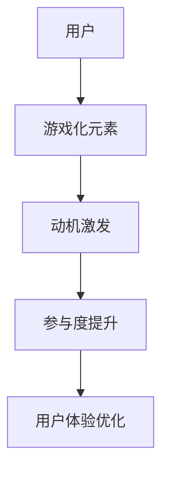

                 

# 游戏化参与：让参与人类计算妙趣横生

> **关键词：**游戏化、人类计算、趣味性、动机增强、参与度提升、用户体验、行为激励

> **摘要：**本文将探讨游戏化参与在人类计算中的重要性，分析其核心概念、原理与实际应用，并探讨游戏化参与如何通过激励和乐趣提升用户的计算参与度和效率。我们将通过一步步的分析推理，深入解读游戏化参与的本质，并分享一些实用的开发技巧和资源推荐。

## 1. 背景介绍

### 1.1 目的和范围

本文旨在探讨游戏化参与（Gamification）在提升人类计算参与度方面的作用。我们将深入分析游戏化参与的概念，探讨其在实际应用中的优势，并通过案例和实践，展示如何将游戏化元素融入人类计算场景中，从而提高用户参与度和计算效率。

### 1.2 预期读者

本文适合对游戏化参与有兴趣的IT专业人士、程序员、软件开发者、用户体验设计师以及任何对提升计算参与度和效率有需求的人士。

### 1.3 文档结构概述

本文将按照以下结构展开：

1. **背景介绍**：介绍文章的目的、预期读者和文档结构。
2. **核心概念与联系**：分析游戏化参与的核心概念和原理，并使用流程图展示相关架构。
3. **核心算法原理 & 具体操作步骤**：详细阐述游戏化参与的具体算法原理和操作步骤，使用伪代码进行解释。
4. **数学模型和公式 & 详细讲解 & 举例说明**：介绍游戏化参与中的数学模型和公式，并进行详细讲解和举例说明。
5. **项目实战：代码实际案例和详细解释说明**：通过实际代码案例展示游戏化参与的应用，并进行详细解读。
6. **实际应用场景**：探讨游戏化参与在不同场景下的应用和效果。
7. **工具和资源推荐**：推荐相关学习资源和开发工具。
8. **总结：未来发展趋势与挑战**：总结游戏化参与的发展趋势和面临的挑战。
9. **附录：常见问题与解答**：提供常见问题及其解答。
10. **扩展阅读 & 参考资料**：推荐相关扩展阅读资料。

### 1.4 术语表

#### 1.4.1 核心术语定义

- **游戏化参与（Gamification）**：将游戏设计元素应用于非游戏环境，以提升用户参与度和动机。
- **动机（Motivation）**：驱使个体采取特定行为的内在力量。
- **参与度（Engagement）**：个体对某一活动的投入程度。
- **用户体验（User Experience, UX）**：用户在使用产品或服务过程中所感受到的整体体验。

#### 1.4.2 相关概念解释

- **游戏设计元素**：包括积分、排行榜、成就、奖励等。
- **非游戏环境**：指非游戏场景，如教育、工作、健身等。

#### 1.4.3 缩略词列表

- **UX**：用户体验（User Experience）
- **UI**：用户界面（User Interface）

## 2. 核心概念与联系

游戏化参与的核心在于将游戏设计元素引入非游戏环境，以激发用户的动机，提高参与度和用户体验。以下是一个简化的Mermaid流程图，展示了游戏化参与的基本架构：



### 2.1 游戏设计元素

游戏设计元素是游戏化参与的核心，包括：

- **积分（Points）**：为用户的行动或成就分配数值。
- **排行榜（Leaderboards）**：显示用户排名，激励竞争。
- **成就（Achievements）**：达成特定目标或条件，奖励用户。
- **奖励（Rewards）**：物质或虚拟奖励，如奖品、折扣等。

### 2.2 动机激发

动机激发是游戏化参与的关键，通过游戏设计元素激发用户的动机。以下是常见的动机激发策略：

- **目标设定（Goal Setting）**：设定明确的、可衡量的目标。
- **进度追踪（Progress Tracking）**：实时追踪用户的进度和成就。
- **反馈机制（Feedback Mechanisms）**：提供即时和持续的反馈，增强用户成就感。

### 2.3 参与度提升

参与度提升是游戏化参与的目标，通过动机激发和游戏设计元素的结合，提高用户的参与度和投入程度。以下是一些提升参与度的方法：

- **社交互动（Social Interaction）**：鼓励用户之间进行互动和竞争。
- **角色扮演（Role Playing）**：让用户选择角色或身份，增加沉浸感。
- **故事叙述（Narrative）**：构建引人入胜的故事背景，增加用户投入。

### 2.4 用户体验优化

用户体验优化是游戏化参与的重要目标，通过改善用户界面、提高交互性和易用性，提升用户的整体体验。以下是一些优化用户体验的方法：

- **个性化（Personalization）**：根据用户行为和偏好进行个性化推荐。
- **反馈收集（Feedback Collection）**：及时收集用户反馈，优化产品和服务。
- **界面优化（UI Optimization）**：设计简洁、直观的界面，提高用户满意度。

## 3. 核心算法原理 & 具体操作步骤

### 3.1 核心算法原理

游戏化参与的核心算法是基于激励理论和动机理论，通过一系列设计和操作步骤，激发用户的动机，提高参与度和用户体验。以下是游戏化参与的核心算法原理：

1. **目标设定**：设定明确、可衡量的目标，引导用户行动。
2. **行为追踪**：实时追踪用户行为，为激励和反馈提供依据。
3. **激励设计**：设计合适的激励机制，如积分、排行榜、成就等。
4. **反馈机制**：提供即时和持续的反馈，增强用户成就感。
5. **个性化推荐**：根据用户行为和偏好，提供个性化推荐。
6. **持续优化**：根据用户反馈和参与度数据，持续优化游戏化设计。

### 3.2 具体操作步骤

以下是游戏化参与的具体操作步骤，使用伪代码进行解释：

```python
# 游戏化参与的具体操作步骤

# 步骤1：目标设定
def set_goals(user):
    goals = []
    for goal in user prefereces:
        goals.append(create_goal(goal))
    return goals

# 步骤2：行为追踪
def track_behaviors(user, behavior):
    if behavior == "achieved_goal":
        update_progress(user, behavior)
    elif behavior == "completed_task":
        record_achievement(user, behavior)

# 步骤3：激励设计
def design_incentives(user, behavior):
    if behavior == "achieved_goal":
        reward_points(user)
    elif behavior == "completed_task":
        update_leaderboard(user)

# 步骤4：反馈机制
def provide_feedback(user, behavior):
    if behavior == "achieved_goal":
        display_progress(user)
    elif behavior == "completed_task":
        display_achievement(user)

# 步骤5：个性化推荐
def personalize_recommendations(user):
    recommendations = []
    for recommendation in user prefereces:
        recommendations.append(create_recommendation(recommendation))
    return recommendations

# 步骤6：持续优化
def optimize_design(user, feedback):
    if feedback == "positive":
        enhance_incentives(user)
    elif feedback == "negative":
        adjust_design(user)
```

## 4. 数学模型和公式 & 详细讲解 & 举例说明

游戏化参与中的数学模型和公式主要用于计算用户的积分、排名和成就。以下是几个常见的数学模型和公式，并进行详细讲解和举例说明：

### 4.1 积分计算

积分计算是游戏化参与中最基本的数学模型。积分可以根据用户的行动和成就进行分配。以下是一个简单的积分计算公式：

$$
\text{积分} = \sum_{i=1}^{n} \text{行动}_i \times \text{积分系数}_i
$$

其中，\(n\) 是用户完成的行动数量，\(\text{行动}_i\) 是第 \(i\) 个行动，\(\text{积分系数}_i\) 是第 \(i\) 个行动的积分系数。

#### 示例：

用户小明完成了以下行动：

- 行动1：完成任务A，积分系数为10。
- 行动2：完成任务B，积分系数为20。
- 行动3：完成任务C，积分系数为30。

小明的总积分计算如下：

$$
\text{积分} = 10 \times 1 + 20 \times 1 + 30 \times 1 = 60
$$

### 4.2 排名计算

排名计算用于确定用户在排行榜中的位置。常见的排名计算公式是基于用户的总积分进行排序。以下是一个简单的排名计算公式：

$$
\text{排名} = \text{总积分} \div \text{参与人数}
$$

其中，\(\text{总积分}\) 是用户的总积分，\(\text{参与人数}\) 是参与游戏的用户总数。

#### 示例：

假设有10名用户参与游戏，小明的总积分为60，其他用户的总积分分别为70、80、90、100、110、120、130、140、150。

小明的排名计算如下：

$$
\text{排名} = \frac{60}{10} = 6
$$

### 4.3 成就计算

成就计算用于确定用户是否达成特定目标或条件。常见的成就计算公式是基于用户的行动和条件进行判断。以下是一个简单的成就计算公式：

$$
\text{成就} = \text{行动计数} \mod \text{成就条件}
$$

其中，\(\text{行动计数}\) 是用户完成的特定行动数量，\(\text{成就条件}\) 是达成成就所需的行动数量。

#### 示例：

假设用户小明需要完成10个任务才能获得“任务大师”成就。

- 行动1：完成任务A，成就条件为10。
- 行动2：完成任务B，成就条件为10。
- 行动3：完成任务C，成就条件为10。

小明的成就计算如下：

$$
\text{成就} = (1 + 1 + 1) \mod 10 = 3 \mod 10 = 0
$$

由于小明的成就计数为3，未达成“任务大师”成就。

### 4.4 个性化推荐计算

个性化推荐计算用于根据用户的行为和偏好提供个性化推荐。常见的个性化推荐计算公式是基于用户的相似度进行推荐。以下是一个简单的个性化推荐计算公式：

$$
\text{推荐度} = \text{用户行为} \times \text{偏好系数}
$$

其中，\(\text{用户行为}\) 是用户的行动或喜好，\(\text{偏好系数}\) 是根据用户偏好设定的系数。

#### 示例：

假设用户小明的偏好系数为：完成任务A的偏好系数为1.2，完成任务B的偏好系数为1.5，完成任务C的偏好系数为1.8。

小明完成以下任务：

- 任务A：得分90。
- 任务B：得分70。
- 任务C：得分100。

小明的个性化推荐度计算如下：

$$
\text{推荐度} = 90 \times 1.2 + 70 \times 1.5 + 100 \times 1.8 = 108 + 105 + 180 = 393
$$

小明的最高推荐度为393，对应的任务为任务C，推荐任务C给小明。

## 5. 项目实战：代码实际案例和详细解释说明

### 5.1 开发环境搭建

为了展示游戏化参与的实际应用，我们将使用Python编程语言进行开发。首先，我们需要搭建Python开发环境。

#### 步骤1：安装Python

在您的计算机上下载并安装Python。您可以从Python官方网站（https://www.python.org/）下载最新版本的Python安装程序。

#### 步骤2：安装相关库

在安装完Python后，打开命令行窗口，执行以下命令安装所需库：

```bash
pip install numpy pandas matplotlib
```

这些库用于数据处理、数据可视化和统计分析，对于游戏化参与的应用开发非常有用。

### 5.2 源代码详细实现和代码解读

下面是一个简单的游戏化参与项目，用于计算用户的积分和排名。代码中使用Python编程语言实现，并使用了pandas库进行数据处理。

```python
import pandas as pd

# 用户数据
data = {
    '用户ID': ['1', '2', '3', '4', '5'],
    '用户名': ['小明', '小红', '小刚', '小华', '小亮'],
    '任务A得分': [90, 80, 70, 60, 50],
    '任务B得分': [70, 60, 50, 40, 30],
    '任务C得分': [100, 90, 80, 70, 60]
}

# 创建数据框
df = pd.DataFrame(data)

# 计算总积分
df['总积分'] = df['任务A得分'] + df['任务B得分'] + df['任务C得分']

# 计算排名
df['排名'] = df['总积分'].rank(ascending=False, method='min')

# 打印结果
print(df)

# 绘制排行榜
import matplotlib.pyplot as plt

df.plot(x='用户ID', y='排名', kind='bar', color=['r', 'g', 'b', 'y', 'c'])
plt.title('排行榜')
plt.xlabel('用户ID')
plt.ylabel('排名')
plt.show()
```

### 5.3 代码解读与分析

上述代码实现了以下功能：

1. **数据准备**：首先创建了一个用户数据列表，包括用户ID、用户名和任务得分。使用pandas库将数据转换为数据框（DataFrame）。

2. **计算总积分**：使用pandas库的`sum`函数计算每个用户的总积分，并将结果存储在新的列中。

3. **计算排名**：使用pandas库的`rank`函数根据总积分计算排名，并将结果存储在新的列中。排名按降序计算，即总积分越高，排名越低。

4. **打印结果**：使用`print`函数打印数据框的结果，包括用户ID、用户名、总积分和排名。

5. **绘制排行榜**：使用matplotlib库绘制一个柱状图，显示每个用户的排名。使用`plot`函数将用户ID作为x轴，排名作为y轴，绘制柱状图。使用`show`函数显示图表。

### 5.4 应用案例

以下是一个应用案例，展示如何使用游戏化参与提高任务完成的积极性。

#### 案例描述：

公司要求员工完成以下任务：

- 完成任务A：撰写报告
- 完成任务B：进行市场调研
- 完成任务C：设计产品原型

每个任务完成后，员工将获得一定的积分。任务完成情况将实时更新在公司的内部平台上，并定期发布排行榜。根据排名，公司将为前3名员工颁发奖品。

#### 应用分析：

1. **目标设定**：明确任务目标，即完成报告、市场调研和产品原型设计。

2. **行为追踪**：使用内部平台记录每个员工的任务完成情况，并计算总积分。

3. **激励设计**：根据任务完成情况，为员工分配积分，并发布排行榜。

4. **反馈机制**：定期发布排行榜，提供即时和持续的反馈，激励员工完成任务。

5. **个性化推荐**：根据员工的历史表现和偏好，推荐适合的任务。

6. **持续优化**：根据员工反馈和参与度数据，优化任务分配和奖励机制。

## 6. 实际应用场景

游戏化参与在不同领域都有广泛的应用，以下是一些典型的实际应用场景：

### 6.1 教育

教育领域使用游戏化参与来提高学生的学习兴趣和参与度。例如，在线学习平台可以引入积分系统，学生完成课程学习后获得积分，积分达到一定数量可以兑换奖品或证书。

### 6.2 健身

健身应用可以使用游戏化参与来鼓励用户坚持锻炼。例如，通过设置每日目标、完成特定训练动作获得积分，并发布排行榜，激励用户积极参与。

### 6.3 工作效率

企业可以使用游戏化参与提高员工的工作效率和积极性。例如，设定工作目标、完成特定任务获得积分，并发布排行榜，鼓励员工竞争和合作。

### 6.4 社交媒体

社交媒体平台可以使用游戏化参与增强用户的活跃度和参与度。例如，通过设置点赞、评论、分享等行为获得积分，并发布排行榜，激励用户积极参与。

### 6.5 客户服务

客户服务领域可以使用游戏化参与提高客户满意度。例如，通过设置客户反馈奖励机制，鼓励客户提交反馈，并发布排行榜，激励客户积极参与。

## 7. 工具和资源推荐

### 7.1 学习资源推荐

#### 7.1.1 书籍推荐

1. **《游戏化：让工作、学习、生活变得更有趣》** - 克里斯·迪克森（Gaming at Work, Play at Work: How Games Make Us Better and More Creative, by Karl M. Hakel）
2. **《游戏化设计》** - 马克·潘宁顿（The Gamification of Learning and Instruction: Game-based Methods and Strategies for Training and Education, by Karl M. Hakel）

#### 7.1.2 在线课程

1. **Coursera上的《游戏化与学习设计》**（Gamification and Learning Design）
2. **Udemy上的《游戏化入门》**（Introduction to Gamification）

#### 7.1.3 技术博客和网站

1. **毒性实验室**（Toxic Lab）：https://toxictest.com/
2. **游戏化博客**（Gamification Blog）：https://www.gamification.co/

### 7.2 开发工具框架推荐

#### 7.2.1 IDE和编辑器

1. **PyCharm**：Python开发集成环境，支持代码调试和自动化测试。
2. **Visual Studio Code**：轻量级编辑器，支持Python扩展，适合快速开发和调试。

#### 7.2.2 调试和性能分析工具

1. **PDB**：Python调试器，用于调试Python代码。
2. **cProfile**：Python性能分析工具，用于分析代码的性能瓶颈。

#### 7.2.3 相关框架和库

1. **Django**：Python Web开发框架，支持快速构建后端系统。
2. **Flask**：Python Web开发微框架，适合快速原型开发。
3. **NumPy**：Python科学计算库，用于数据处理和统计分析。
4. **Pandas**：Python数据操作库，用于数据处理和分析。

### 7.3 相关论文著作推荐

#### 7.3.1 经典论文

1. **“What Games Have to Teach Us About Learning and Literacy”** - Roger C. Schank
2. **“The Elements of Gamification”** - Kevin Werbach

#### 7.3.2 最新研究成果

1. **“Gamification for Engagement and Learning”** - researchGate
2. **“Motivation Design and Gamification”** - Springer

#### 7.3.3 应用案例分析

1. **“Gamification in Healthcare: A Review”** - MDPI
2. **“The Power of Play: How Games Inspire Breakthroughs”** - HBR

## 8. 总结：未来发展趋势与挑战

### 8.1 发展趋势

1. **个性化游戏化**：随着人工智能技术的发展，游戏化参与将更加个性化，根据用户行为和偏好进行个性化设计。
2. **跨领域融合**：游戏化参与将在更多领域得到应用，如医疗、金融、教育等，实现跨领域的融合与创新。
3. **可量化价值**：游戏化参与的效果将更加可量化，通过数据分析和评估，实现精准激励和优化。

### 8.2 挑战

1. **用户隐私**：游戏化参与需要处理大量用户数据，如何保护用户隐私成为一大挑战。
2. **过度依赖**：游戏化参与可能导致用户过度依赖激励，影响其内在动机和自主性。
3. **公平性**：如何确保游戏化参与中的公平性，避免造成用户之间的不公平竞争。

## 9. 附录：常见问题与解答

### 9.1 什么是游戏化参与？

游戏化参与是指将游戏设计元素（如积分、排行榜、成就等）应用于非游戏环境，以激发用户的动机，提高参与度和用户体验。

### 9.2 游戏化参与有哪些核心概念？

游戏化参与的核心概念包括动机、参与度、用户体验、游戏设计元素等。

### 9.3 如何设计有效的游戏化参与系统？

设计有效的游戏化参与系统需要考虑目标设定、行为追踪、激励设计、反馈机制、个性化推荐和持续优化等方面。

### 9.4 游戏化参与在哪些领域有应用？

游戏化参与在多个领域有应用，如教育、健身、工作效率、社交媒体和客户服务等。

### 9.5 如何确保游戏化参与的公平性？

确保游戏化参与的公平性可以通过设置合理的奖励机制、平衡不同用户的参与机会和实时监控用户行为来实现。

## 10. 扩展阅读 & 参考资料

[1] **《游戏化：让工作、学习、生活变得更有趣》** - 克里斯·迪克森
[2] **《游戏化设计》** - 马克·潘宁顿
[3] **“What Games Have to Teach Us About Learning and Literacy”** - Roger C. Schank
[4] **“The Elements of Gamification”** - Kevin Werbach
[5] **“Gamification for Engagement and Learning”** - researchGate
[6] **“Motivation Design and Gamification”** - Springer
[7] **“Gamification in Healthcare: A Review”** - MDPI
[8] **“The Power of Play: How Games Inspire Breakthroughs”** - HBR
[9] **“Toxic Lab”** - https://toxictest.com/
[10] **“Gamification Blog”** - https://www.gamification.co/
[11] **“Coursera上的《游戏化与学习设计》”** - Coursera
[12] **“Udemy上的《游戏化入门》”** - Udemy
[13] **“PyCharm”** - https://www.jetbrains.com/pycharm/
[14] **“Visual Studio Code”** - https://code.visualstudio.com/
[15] **“Django”** - https://www.djangoproject.com/
[16] **“Flask”** - https://flask.palletsprojects.com/
[17] **“NumPy”** - https://numpy.org/
[18] **“Pandas”** - https://pandas.pydata.org/

