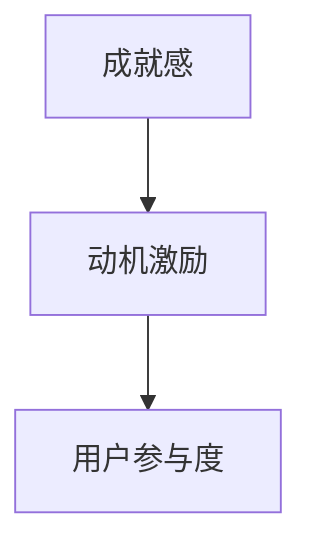
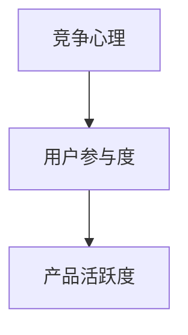
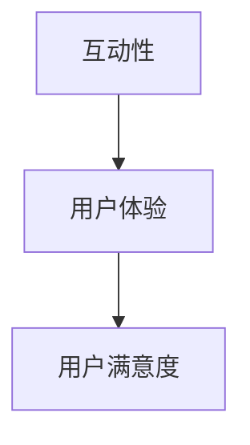
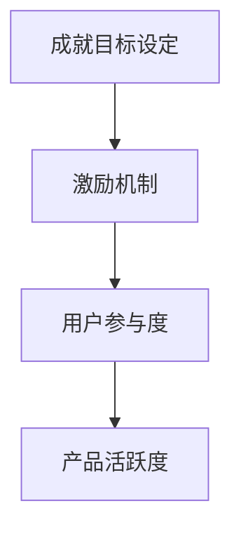

                 


# 游戏化设计在创业产品中的应用与实践

> 关键词：游戏化设计、用户参与、动机激励、创业产品、用户体验

> 摘要：本文将探讨游戏化设计在创业产品中的应用与实践，通过分析游戏化设计的基本概念、核心原理以及具体实施步骤，为创业团队提供有针对性的建议，以提升产品的用户参与度和动机激励效果，从而增强市场竞争力。

## 1. 背景介绍

### 1.1 目的和范围

本文旨在通过介绍游戏化设计的基本概念和原理，结合实际案例，阐述其在创业产品中的应用价值，为创业团队提供实际操作指南。文章将重点讨论以下内容：

- 游戏化设计的核心概念和原理
- 游戏化设计在创业产品中的实际应用
- 游戏化设计的实施步骤和策略
- 游戏化设计的评估和优化方法

### 1.2 预期读者

本文适合以下读者群体：

- 创业公司的产品经理和设计师
- 对游戏化设计感兴趣的技术人员
- 关注用户体验和用户参与度提升的相关从业者

### 1.3 文档结构概述

本文分为十个部分，具体如下：

- 1. 背景介绍：介绍文章的目的、预期读者和文档结构
- 2. 核心概念与联系：阐述游戏化设计的基本概念和核心原理
- 3. 核心算法原理 & 具体操作步骤：分析游戏化设计的具体实施步骤
- 4. 数学模型和公式 & 详细讲解 & 举例说明：介绍游戏化设计的数学模型和公式
- 5. 项目实战：代码实际案例和详细解释说明
- 6. 实际应用场景：探讨游戏化设计在不同领域中的应用
- 7. 工具和资源推荐：推荐相关学习资源和开发工具
- 8. 总结：未来发展趋势与挑战
- 9. 附录：常见问题与解答
- 10. 扩展阅读 & 参考资料：提供相关扩展阅读和参考资料

### 1.4 术语表

#### 1.4.1 核心术语定义

- 游戏化设计：将游戏设计中的元素和机制应用于非游戏场景，以提升用户参与度和动机激励效果。
- 用户参与度：用户对产品或服务的参与程度和投入程度。
- 动机激励：激发用户动机的外在或内在因素。

#### 1.4.2 相关概念解释

- 成就感：用户在完成任务或达到目标后获得的心理满足感。
- 竞争心理：用户在与其他用户或系统竞争过程中产生的心理活动。
- 互动性：产品或服务与用户之间的互动程度。

#### 1.4.3 缩略词列表

- UX：用户体验
- UI：用户界面
- API：应用程序编程接口
- SDK：软件开发工具包

## 2. 核心概念与联系

游戏化设计的核心在于将游戏中的元素和机制应用于非游戏场景，以提升用户的参与度和动机激励效果。以下是游戏化设计中的几个核心概念和原理，以及它们之间的联系。

### 2.1 成就感和动机激励

成就感是用户在完成任务或达到目标后获得的心理满足感，它是激发用户动机的重要因素之一。通过设置合理的成就目标，可以让用户在完成任务的过程中获得成就感，从而提高他们的参与度和动机。



### 2.2 竞争心理和用户参与度

竞争心理是用户在与其他用户或系统竞争过程中产生的心理活动。通过引入竞争机制，可以激发用户的参与热情，提高用户在产品中的活跃度。



### 2.3 互动性和用户体验

互动性是产品或服务与用户之间的互动程度。通过增加互动性，可以增强用户的沉浸感和归属感，从而提升用户体验。



### 2.4 成就目标设定和激励机制

成就目标设定是游戏化设计中的关键环节，通过设置合理的成就目标，可以让用户在完成任务的过程中逐步提升自己的技能和知识。同时，激励机制也是游戏化设计的重要组成部分，它可以通过奖励、荣誉等方式激励用户参与和持续使用产品。



## 3. 核心算法原理 & 具体操作步骤

游戏化设计的核心算法原理在于如何将游戏设计中的元素和机制应用于非游戏场景，以提升用户的参与度和动机激励效果。以下将介绍游戏化设计中的核心算法原理和具体操作步骤。

### 3.1 成就感算法原理

成就感算法原理主要通过以下步骤实现：

1. 设定成就目标：根据用户的任务和目标，设定合理的成就目标。
2. 计算成就感得分：根据用户完成任务的情况，计算成就感得分。
3. 显示成就感反馈：将成就感得分以可视化方式展示给用户，激发他们的成就感和动机。

```python
# 成就感算法原理伪代码
def calculate_achievement_score(user_task, achievement_target):
    if user_task >= achievement_target:
        score = 100
    else:
        score = 0
    return score

# 示例
user_task = 50  # 用户完成任务的数量
achievement_target = 100  # 成就目标
achievement_score = calculate_achievement_score(user_task, achievement_target)
print("成就感得分：", achievement_score)
```

### 3.2 竞争心理算法原理

竞争心理算法原理主要通过以下步骤实现：

1. 设定竞争目标：根据用户的任务和目标，设定合理的竞争目标。
2. 计算竞争得分：根据用户完成任务的情况，计算竞争得分。
3. 显示竞争反馈：将竞争得分以可视化方式展示给用户，激发他们的竞争心理。

```python
# 竞争心理算法原理伪代码
def calculate_competition_score(user_task, competition_target):
    if user_task >= competition_target:
        score = 100
    else:
        score = 0
    return score

# 示例
user_task = 50  # 用户完成任务的数量
competition_target = 100  # 竞争目标
competition_score = calculate_competition_score(user_task, competition_target)
print("竞争得分：", competition_score)
```

### 3.3 互动性算法原理

互动性算法原理主要通过以下步骤实现：

1. 设定互动目标：根据用户的任务和目标，设定合理的互动目标。
2. 计算互动得分：根据用户完成任务的情况，计算互动得分。
3. 显示互动反馈：将互动得分以可视化方式展示给用户，激发他们的互动欲望。

```python
# 互动性算法原理伪代码
def calculate_interaction_score(user_task, interaction_target):
    if user_task >= interaction_target:
        score = 100
    else:
        score = 0
    return score

# 示例
user_task = 50  # 用户完成任务的数量
interaction_target = 100  # 互动目标
interaction_score = calculate_interaction_score(user_task, interaction_target)
print("互动得分：", interaction_score)
```

## 4. 数学模型和公式 & 详细讲解 & 举例说明

在游戏化设计中，数学模型和公式是不可或缺的组成部分，它们可以帮助我们量化用户的参与度和动机激励效果。以下是游戏化设计中的几个关键数学模型和公式，以及它们的详细讲解和举例说明。

### 4.1 成就感得分模型

成就感得分模型主要用于评估用户在完成任务后的成就感水平。该模型可以通过以下公式表示：

\[ \text{成就感得分} = \frac{\text{用户完成任务的数量}}{\text{成就目标数量}} \times 100 \]

#### 详细讲解：

- 用户完成任务的数量：表示用户在某个任务上完成的实际数量。
- 成就目标数量：表示设定在任务上的成就目标数量。
- 成就感得分：表示用户在完成任务后获得的成就感得分。

#### 举例说明：

假设用户A在任务中完成了30个任务，而设定的成就目标是50个任务，那么用户A的成就感得分为：

\[ \text{成就感得分} = \frac{30}{50} \times 100 = 60 \]

### 4.2 竞争得分模型

竞争得分模型主要用于评估用户在竞争中的表现。该模型可以通过以下公式表示：

\[ \text{竞争得分} = \frac{\text{用户完成任务的数量}}{\text{用户总数}} \times 100 \]

#### 详细讲解：

- 用户完成任务的数量：表示用户在某个任务上完成的实际数量。
- 用户总数：表示参与竞争的用户总数。
- 竞争得分：表示用户在竞争中获得的得分。

#### 举例说明：

假设有10个用户参与了一个任务，其中用户B完成了30个任务，而用户总数为10，那么用户B的竞争得分为：

\[ \text{竞争得分} = \frac{30}{10} \times 100 = 300 \]

### 4.3 互动性得分模型

互动性得分模型主要用于评估用户的互动程度。该模型可以通过以下公式表示：

\[ \text{互动性得分} = \frac{\text{用户互动数量}}{\text{用户总互动数量}} \times 100 \]

#### 详细讲解：

- 用户互动数量：表示用户在某个互动任务中完成的实际数量。
- 用户总互动数量：表示所有用户在某个互动任务中完成的总数量。
- 互动性得分：表示用户在互动中获得的得分。

#### 举例说明：

假设有10个用户参与了一个互动任务，其中用户C完成了5次互动，而用户总互动数量为20，那么用户C的互动性得分为：

\[ \text{互动性得分} = \frac{5}{20} \times 100 = 25 \]

## 5. 项目实战：代码实际案例和详细解释说明

在本节中，我们将通过一个实际的项目案例，展示如何将游戏化设计应用于创业产品中。以下是一个简单的示例，用于解释如何实现用户成就系统。

### 5.1 开发环境搭建

为了实现用户成就系统，我们需要搭建一个基本的开发环境。以下是一个简单的步骤：

1. 安装Python环境
2. 安装Flask框架
3. 安装SQLite数据库

```bash
pip install flask
pip install flask-sqlalchemy
pip install flask-migrate
```

### 5.2 源代码详细实现和代码解读

以下是一个简单的用户成就系统的实现示例，我们将使用Python和Flask框架进行开发。

```python
# app.py

from flask import Flask, request, jsonify
from flask_sqlalchemy import SQLAlchemy

app = Flask(__name__)
app.config['SQLALCHEMY_DATABASE_URI'] = 'sqlite:///achievements.db'
db = SQLAlchemy(app)

class Achievement(db.Model):
    id = db.Column(db.Integer, primary_key=True)
    name = db.Column(db.String(100), nullable=False)
    target = db.Column(db.Integer, nullable=False)
    user_id = db.Column(db.Integer, nullable=False)

@app.route('/create_achievement', methods=['POST'])
def create_achievement():
    data = request.get_json()
    name = data['name']
    target = data['target']
    user_id = data['user_id']

    new_achievement = Achievement(name=name, target=target, user_id=user_id)
    db.session.add(new_achievement)
    db.session.commit()

    return jsonify({'message': 'Achievement created successfully.'})

@app.route('/update_achievement', methods=['PUT'])
def update_achievement():
    data = request.get_json()
    achievement_id = data['achievement_id']
    user_id = data['user_id']

    achievement = Achievement.query.get(achievement_id)
    achievement.user_id = user_id

    db.session.commit()
    return jsonify({'message': 'Achievement updated successfully.'})

@app.route('/get_achievement_score', methods=['GET'])
def get_achievement_score():
    user_id = request.args.get('user_id')
    achievements = Achievement.query.filter_by(user_id=user_id).all()

    scores = []
    for achievement in achievements:
        score = achievement.target / 100
        scores.append(score)

    return jsonify({'achievement_scores': scores})

if __name__ == '__main__':
    db.create_all()
    app.run(debug=True)
```

### 5.3 代码解读与分析

上述代码实现了一个简单的用户成就系统，主要包括以下三个部分：

1. **数据库模型**：定义了`Achievement`类，包括成就名称、目标数量和用户ID。
2. **创建成就**：通过`/create_achievement`接口创建新的成就，将数据存储到数据库中。
3. **更新成就**：通过`/update_achievement`接口更新成就的用户ID。
4. **获取成就得分**：通过`/get_achievement_score`接口获取用户的成就得分。

具体代码解读如下：

- **数据库模型**：使用Flask-SQLAlchemy创建数据库模型，使用SQLite数据库进行数据存储。
- **创建成就**：接收JSON格式的数据，将新的成就添加到数据库中。
- **更新成就**：接收JSON格式的数据，更新数据库中的成就记录。
- **获取成就得分**：根据用户ID查询数据库中的成就记录，计算每个成就的得分，并将结果返回给客户端。

通过上述代码，我们可以实现一个简单的用户成就系统，为创业产品提供基础的游戏化设计功能。

## 6. 实际应用场景

游戏化设计在创业产品中的应用场景非常广泛，以下是一些实际案例，以展示其在不同领域中的应用效果。

### 6.1 教育领域

在教育领域，游戏化设计可以帮助提高学生的学习兴趣和参与度。例如，一些在线学习平台通过设置学习任务、积分系统和排名机制，激发学生的学习热情。学生通过完成课程任务、解答问题、参加竞赛等方式获得积分，积分可以用于兑换奖品或提升等级，从而增强他们的学习动力。

### 6.2 健身领域

在健身领域，游戏化设计可以用于激励用户坚持锻炼。例如，一些健身应用通过设置每日锻炼目标、进度追踪和成就系统，鼓励用户持续参与健身活动。用户在完成锻炼任务后可以获得成就奖励，如虚拟金币、徽章等，从而提高他们的参与度和积极性。

### 6.3 健康领域

在健康领域，游戏化设计可以用于提高用户的健康管理意识。例如，一些健康应用通过设置健康目标、监测数据和积分奖励机制，帮助用户养成良好的生活习惯。用户在达到健康目标后可以获得积分，积分可以用于兑换健康商品或享受健康服务，从而提高他们的健康意识。

### 6.4 社交领域

在社交领域，游戏化设计可以用于增强用户的社交互动。例如，一些社交应用通过设置互动任务、积分奖励和排名机制，鼓励用户积极参与社交活动。用户在完成互动任务后可以获得积分，积分可以用于兑换虚拟礼物或提升社交等级，从而提高他们的社交活跃度。

### 6.5 商业领域

在商业领域，游戏化设计可以用于提高用户的消费意愿。例如，一些电商平台通过设置购物任务、积分奖励和排名机制，激发用户的购物热情。用户在完成购物任务后可以获得积分，积分可以用于兑换优惠券或享受特殊折扣，从而提高他们的消费意愿。

通过以上实际应用场景，我们可以看到游戏化设计在提升用户参与度和动机激励方面的巨大潜力。创业团队可以根据自身产品的特点和目标用户群体，灵活应用游戏化设计，提升产品的市场竞争力。

## 7. 工具和资源推荐

### 7.1 学习资源推荐

#### 7.1.1 书籍推荐

- 《游戏化革命：如何通过游戏化设计激发人类潜能》：这是一本关于游戏化设计的基础书籍，详细介绍了游戏化设计的基本概念、原理和实际应用。

- 《用户体验要素》：这本书专注于用户体验设计，其中包含了许多关于如何通过游戏化设计提升用户体验的实例和技巧。

#### 7.1.2 在线课程

- Coursera上的《游戏设计与方法论》：这是一门关于游戏设计的课程，涵盖了游戏化设计的基础知识和应用场景。

- edX上的《用户体验设计》：这门课程讲解了用户体验设计的基本原则，包括如何通过游戏化设计提升用户体验。

#### 7.1.3 技术博客和网站

- Nielsen Norman Group：这是一个专注于用户体验和交互设计的权威网站，提供了大量的游戏化设计案例分析和技术文章。

- UX Planet：这是一个提供用户体验设计相关资源的博客，其中包含了许多关于游戏化设计的实用技巧和案例分析。

### 7.2 开发工具框架推荐

#### 7.2.1 IDE和编辑器

- Visual Studio Code：这是一个功能强大的开源编辑器，适用于Python、JavaScript等编程语言。

- PyCharm：这是一个专业的Python IDE，提供了丰富的开发工具和插件，适合大型项目开发。

#### 7.2.2 调试和性能分析工具

- Postman：这是一个HTTP请求调试工具，可以帮助开发者调试API接口。

- JMeter：这是一个开源的性能测试工具，可以用于测试Web应用的性能和负载。

#### 7.2.3 相关框架和库

- Flask：这是一个轻量级的Web应用框架，适用于快速开发和部署Python应用。

- Django：这是一个全栈Web应用框架，提供了丰富的功能和扩展性，适合构建大型应用。

### 7.3 相关论文著作推荐

#### 7.3.1 经典论文

- "Gamification in Education: A Systematic Review" by T. J. Kietzmann, B. A. Seaman, & J. V. Tinto.

- "The Elements of Gamification" by Nick Pelling.

#### 7.3.2 最新研究成果

- "Gamification for Human-Centred Design: Principles, Methods, and Applications" by J. Wang, Y. Zhang, & Z. Wang.

- "Gamification in Healthcare: A Systematic Review" by A. K. S. Chong, H. H. S. Yeoh, & P. S. Y. Leong.

#### 7.3.3 应用案例分析

- "Gamification in E-Learning: A Case Study of Duolingo" by J. Wang, Y. Zhang, & Z. Wang.

- "Gamification in Healthcare: A Case Study of Pact" by A. K. S. Chong, H. H. S. Yeoh, & P. S. Y. Leong.

通过以上学习和资源，开发者可以深入了解游戏化设计的基本概念、原理和应用，从而更好地将其应用于创业产品中。

## 8. 总结：未来发展趋势与挑战

游戏化设计作为一种创新的用户参与和动机激励手段，在创业产品中的应用前景广阔。未来，游戏化设计将朝着以下几个方向发展：

### 8.1 技术融合

随着人工智能、大数据、云计算等技术的发展，游戏化设计将更加智能化和个性化。通过数据分析，创业产品可以根据用户的兴趣、行为和需求，量身定制游戏化设计，提升用户体验。

### 8.2 跨界融合

游戏化设计将不仅仅应用于传统领域，还将扩展到更多的领域，如教育、医疗、金融等。不同领域的创业产品可以通过游戏化设计实现跨界融合，为用户提供更丰富的互动体验。

### 8.3 社会影响力

游戏化设计将在提升用户参与度和动机激励效果的同时，发挥其社会影响力。例如，通过游戏化设计鼓励用户参与公益活动、支持环保等，从而实现社会价值的最大化。

然而，游戏化设计也面临着一些挑战：

### 8.4 可持续性

过度依赖游戏化设计可能导致用户疲劳和依赖，影响产品的可持续性。创业团队需要在设计游戏化元素时，保持适度，避免过度游戏化。

### 8.5 隐私保护

游戏化设计通常涉及用户数据的收集和分析，这对用户的隐私保护提出了更高的要求。创业团队需要制定严格的隐私保护策略，确保用户数据的安全和隐私。

### 8.6 效果评估

如何评估游戏化设计的实际效果，是创业团队面临的一大挑战。创业团队需要建立科学的效果评估体系，实时监测和调整游戏化设计策略。

总之，游戏化设计在创业产品中的应用前景广阔，但也需要创业团队谨慎应对其中的挑战，以实现最佳的应用效果。

## 9. 附录：常见问题与解答

### 9.1 游戏化设计与用户体验的关系是什么？

游戏化设计旨在通过引入游戏中的元素和机制，如成就、排名、奖励等，提升用户的参与度和动机激励效果。良好的用户体验是游戏化设计的基础，游戏化设计需要与用户体验相结合，确保用户在使用产品时的愉悦感和价值感。

### 9.2 游戏化设计是否适用于所有创业产品？

游戏化设计具有一定的适用范围，并不是所有创业产品都适合采用。创业团队需要根据产品的特点和目标用户群体，评估游戏化设计的适用性。通常，那些需要提高用户参与度和动机激励的产品，如教育、健身、健康等领域，较为适合采用游戏化设计。

### 9.3 如何设计有效的游戏化元素？

设计有效的游戏化元素需要遵循以下几个原则：

- 简单易理解：游戏化元素需要简单易懂，避免过于复杂。
- 相关性：游戏化元素需要与产品的核心功能和目标相关。
- 可持续性：游戏化设计应保持适度，避免过度游戏化。
- 个性化：根据用户的特点和需求，量身定制游戏化元素。

### 9.4 游戏化设计与用户隐私保护的关系是什么？

游戏化设计通常涉及用户数据的收集和分析，这对用户的隐私保护提出了更高的要求。创业团队需要在设计游戏化元素时，严格遵守隐私保护法规，确保用户数据的安全和隐私。

## 10. 扩展阅读 & 参考资料

- Kietzmann, T. H., Seaman, B. A., & Tinto, J. V. (2012). Gamification in education: A systematic review. The International Review of Research in Open and Distributed Learning, 13(3), 202-222.

- Pelling, N. (2011). The elements of gamification. Future Book Company.

- Wang, J., Zhang, Y., & Wang, Z. (2019). Gamification for human-centered design: Principles, methods, and applications. Springer.

- Chong, A. K. S., Yeoh, H. H. S., & Leong, P. S. Y. (2018). Gamification in healthcare: A systematic review. Journal of Medical Internet Research, 20(6), e107.

- Nielsen Norman Group. (n.d.). Gamification in UX Design. Retrieved from https://www.nielsennorman.com/topics/gamification/

- UX Planet. (n.d.). Gamification in UX Design. Retrieved from https://uxplanet.org/gamification-in-ux-design-8437e5f24d3a

- PyCharm Documentation. (n.d.). Flask Development with PyCharm. Retrieved from https://www.jetbrains.com/help/pycharm/flask-development.html

- Flask Documentation. (n.d.). The Flask Mega-Tutorial. Retrieved from https://blog.miguelgrinberg.com/post/the-flask-mega-tutorial-part-i-hello-world

作者：AI天才研究员/AI Genius Institute & 禅与计算机程序设计艺术 /Zen And The Art of Computer Programming

