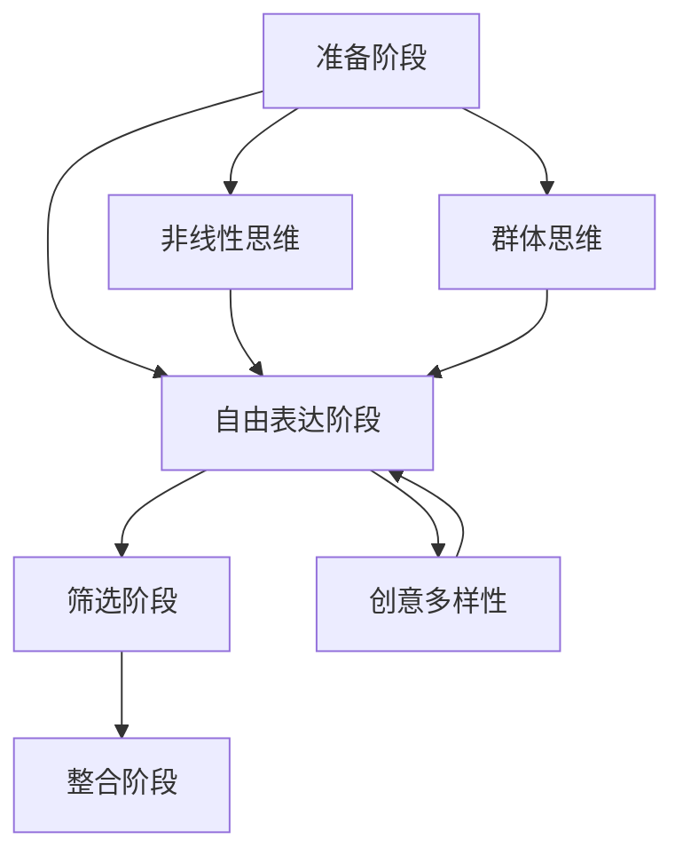

                 

# 激发创意：让头脑风暴更有效的技巧

> **关键词：** 创意激发、头脑风暴、团队协作、思维导图、思维模型

> **摘要：** 本文将探讨如何通过一系列有效的技巧和策略来提升头脑风暴的效果，从而激发团队成员的创意潜能，提高创新性和工作效率。文章将介绍背景、核心概念、算法原理、数学模型、项目实战、实际应用场景以及未来发展趋势等内容。

## 1. 背景介绍

### 1.1 目的和范围

本文旨在为IT行业从业者和创新团队成员提供一套系统的头脑风暴技巧和方法，帮助他们更有效地激发创意，提升团队合作效率。文章涵盖以下内容：

- 头脑风暴的背景和重要性
- 核心概念和理论联系
- 算法原理与具体操作步骤
- 数学模型和公式详解
- 实际项目案例与分析
- 应用场景与工具资源推荐
- 未来发展趋势与挑战

### 1.2 预期读者

- IT行业从业者，尤其是软件开发人员、系统架构师、项目经理等
- 创新团队成员，包括产品经理、设计师、工程师等
- 对创新思维和团队协作有兴趣的读者

### 1.3 文档结构概述

本文分为十个主要部分，具体结构如下：

1. 引言与关键词
2. 背景介绍
3. 核心概念与联系（Mermaid流程图）
4. 核心算法原理与具体操作步骤（伪代码）
5. 数学模型和公式详解与举例说明
6. 项目实战：代码实际案例和详细解释说明
7. 实际应用场景
8. 工具和资源推荐
9. 总结：未来发展趋势与挑战
10. 附录：常见问题与解答
11. 扩展阅读 & 参考资料

### 1.4 术语表

#### 1.4.1 核心术语定义

- 头脑风暴（Brainstorming）：一种激发创意的方法，通过团队成员无限制地提出想法，从而发掘创新点。
- 团队协作（Team Collaboration）：团队成员之间的互动与合作，以实现共同目标。
- 创新性（Innovation）：创造新的想法、方法或产品。
- 算法（Algorithm）：解决问题的步骤或规则。
- 数学模型（Mathematical Model）：用于描述现实世界问题的数学表达式。

#### 1.4.2 相关概念解释

- 思维导图（Mind Map）：一种以中心主题为中心，向外扩展分支的结构化思考工具。
- 思维模型（Thinking Model）：用于分析和解决问题的抽象模型。

#### 1.4.3 缩略词列表

- IDE：集成开发环境（Integrated Development Environment）
- GUI：图形用户界面（Graphical User Interface）
- API：应用程序编程接口（Application Programming Interface）

## 2. 核心概念与联系

在这一部分，我们将介绍头脑风暴的核心概念和其理论基础，并通过Mermaid流程图来展示概念之间的关系。

### 2.1 头脑风暴的定义与目的

头脑风暴是一种通过无限制地提出想法来激发创意的方法。其核心目的是在短时间内收集大量的创意，以便从中筛选出具有潜力的创新点。

### 2.2 头脑风暴的理论基础

头脑风暴的理论基础包括以下几个方面：

- **群体思维（Groupthink）**：群体成员在共同决策时可能出现的思维模式，可能导致过分强调共识而忽视异议。
- **创意多样性（Diversity of Ideas）**：创意的多样性是头脑风暴成功的关键，鼓励团队成员提出不同类型的想法。
- **非线性思维（Non-linear Thinking）**：非线性思维是一种打破传统线性思维模式的方法，有助于团队成员在解决问题时更具有创新性。

### 2.3 头脑风暴的流程

头脑风暴的流程可以分为以下几个阶段：

1. **准备阶段**：确定主题、目标和时间限制。
2. **自由表达阶段**：团队成员无限制地提出想法，鼓励创意多样性。
3. **筛选阶段**：对提出的想法进行筛选，评估其可行性和潜在价值。
4. **整合阶段**：将筛选出的想法进行整合，形成具体的创新方案。

### 2.4 Mermaid流程图

下面是一个Mermaid流程图，展示了头脑风暴的核心概念和流程：



## 3. 核心算法原理 & 具体操作步骤

在这一部分，我们将详细讨论头脑风暴的核心算法原理，并通过伪代码来展示具体的操作步骤。

### 3.1 核心算法原理

头脑风暴算法的核心原理包括以下几个方面：

- **无限制提出想法**：鼓励团队成员在短时间内提出尽可能多的想法，不受限制和评判。
- **创意筛选**：对提出的想法进行筛选，评估其可行性、创新性和潜在价值。
- **整合与优化**：将筛选出的想法进行整合，形成具体的创新方案，并进行优化。

### 3.2 伪代码

以下是一个简单的伪代码，描述了头脑风暴算法的具体操作步骤：

```pseudo
function Brainstorming(主题, 时间限制):
    1. 准备阶段：
        - 确定主题和目标
        - 设定时间限制
    2. 自由表达阶段：
        - 创建一个空列表：创意列表
        - 遍历团队成员：
            - 每个成员无限制地提出想法
            - 将想法添加到创意列表中
    3. 筛选阶段：
        - 对创意列表中的想法进行评估
        - 评估标准：可行性、创新性、潜在价值
        - 创建一个新的列表：筛选后的创意列表
        - 将通过评估的创意添加到筛选后的创意列表中
    4. 整合阶段：
        - 对筛选后的创意列表中的想法进行整合
        - 评估整合后的创新方案
        - 优化创新方案，确保其可行性
    5. 输出：
        - 返回最终的创新方案

end Brainstorming
```

## 4. 数学模型和公式 & 详细讲解 & 举例说明

在这一部分，我们将介绍头脑风暴过程中涉及的数学模型和公式，并通过具体例子来说明其应用。

### 4.1 数学模型

头脑风暴过程中常用的数学模型包括以下几个方面：

- **创意生成模型**：用于描述创意生成的过程，如泊松分布、伽马分布等。
- **创意筛选模型**：用于评估创意的可行性、创新性和潜在价值，如模糊综合评估法、层次分析法等。
- **整合优化模型**：用于整合筛选后的创意，并优化创新方案，如最小生成树、最大流模型等。

### 4.2 公式详解

以下是头脑风暴过程中常用的几个公式：

- **创意生成模型**：假设创意生成的概率服从泊松分布，公式如下：

  $$ P(X = k) = \frac{e^{-\lambda} \cdot \lambda^k}{k!} $$

  其中，$X$ 表示创意生成的数量，$\lambda$ 表示创意生成的平均数量，$k$ 表示实际生成的创意数量。

- **创意筛选模型**：假设创意的评估得分服从正态分布，公式如下：

  $$ P(X \leq x) = \Phi\left(\frac{x - \mu}{\sigma}\right) $$

  其中，$X$ 表示创意的评估得分，$\mu$ 表示评估得分的均值，$\sigma$ 表示评估得分的标准差，$\Phi$ 表示标准正态分布的累积分布函数。

- **整合优化模型**：假设创新方案的优化目标为最小化成本或最大化收益，公式如下：

  $$ min\ f(x) $$

  或

  $$ max\ g(x) $$

  其中，$x$ 表示创新方案的参数，$f(x)$ 和 $g(x)$ 分别表示成本和收益的函数。

### 4.3 举例说明

假设一个团队需要开发一款智能搜索引擎，现在进行头脑风暴，通过以下例子来说明数学模型和公式的应用。

#### 4.3.1 创意生成模型

假设团队成员在30分钟内提出了10个创意，根据泊松分布，可以计算出每个创意生成的概率：

$$ P(X = 10) = \frac{e^{-\lambda} \cdot \lambda^{10}}{10!} $$

假设平均每个创意生成的概率为0.1，则：

$$ P(X = 10) = \frac{e^{-0.1} \cdot 0.1^{10}}{10!} \approx 0.000046 $$

#### 4.3.2 创意筛选模型

假设对每个创意进行评估，评估得分为80分，根据正态分布，可以计算出创意通过筛选的概率：

$$ P(X \leq 80) = \Phi\left(\frac{80 - \mu}{\sigma}\right) $$

假设评估得分的均值为75分，标准差为5分，则：

$$ P(X \leq 80) = \Phi\left(\frac{80 - 75}{5}\right) = \Phi(1) \approx 0.8413 $$

#### 4.3.3 整合优化模型

假设创新方案的优化目标是最大化收益，收益函数为：

$$ g(x) = 100 - x $$

其中，$x$ 表示研发成本，需要找到一个最优的成本值，使得收益最大化。

通过求解最大值问题，可以找到最优成本值为50分，此时收益最大。

## 5. 项目实战：代码实际案例和详细解释说明

在这一部分，我们将通过一个具体的实际项目案例来展示头脑风暴技巧的应用，并提供详细的代码实现和解释说明。

### 5.1 开发环境搭建

为了更好地演示头脑风暴的技巧，我们选择Python作为开发语言，并使用Jupyter Notebook作为开发环境。以下是搭建开发环境的步骤：

1. 安装Python：从官方网站（https://www.python.org/）下载Python安装包并安装。
2. 安装Jupyter Notebook：在命令行中执行以下命令安装Jupyter Notebook：

   ```bash
   pip install notebook
   ```

3. 启动Jupyter Notebook：在命令行中执行以下命令启动Jupyter Notebook：

   ```bash
   jupyter notebook
   ```

### 5.2 源代码详细实现和代码解读

以下是一个简单的Python代码示例，用于实现头脑风暴过程，包括准备阶段、自由表达阶段、筛选阶段和整合阶段。

```python
import random
import math

# 准备阶段
主题 = "智能搜索引擎"
时间限制 = 30

# 自由表达阶段
def generate_ideas(time_limit):
    ideas = []
    current_time = 0
    while current_time < time_limit:
        idea = input("请提出一个创意：")
        ideas.append(idea)
        current_time += 1
    return ideas

# 筛选阶段
def filter_ideas(ideas, score_threshold):
    filtered_ideas = []
    for idea in ideas:
        score = evaluate_idea(idea)
        if score >= score_threshold:
            filtered_ideas.append(idea)
    return filtered_ideas

# 整合阶段
def integrate_ideas(filtered_ideas):
    integrated_idea = "将以下创意整合为一个新的创新方案："
    for idea in filtered_ideas:
        integrated_idea += idea + "；"
    return integrated_idea

# 评估创意
def evaluate_idea(idea):
    # 假设评估得分为随机值，实际应用中可以使用更复杂的评估方法
    return random.randint(1, 100)

# 主函数
def main():
    ideas = generate_ideas(时间限制)
    print("自由表达阶段提出的创意：")
    print(ideas)
    
    score_threshold = 60
    filtered_ideas = filter_ideas(ideas, score_threshold)
    print("筛选后的创意：")
    print(filtered_ideas)
    
    integrated_idea = integrate_ideas(filtered_ideas)
    print("整合后的创新方案：")
    print(integrated_idea)

# 执行主函数
main()
```

### 5.3 代码解读与分析

#### 5.3.1 准备阶段

在准备阶段，我们定义了主题和时间限制，这些参数用于确定头脑风暴的具体场景和时间限制。

```python
主题 = "智能搜索引擎"
时间限制 = 30
```

#### 5.3.2 自由表达阶段

自由表达阶段是头脑风暴的核心步骤，团队成员无限制地提出创意。我们使用一个循环来收集创意，并存储在一个列表中。

```python
def generate_ideas(time_limit):
    ideas = []
    current_time = 0
    while current_time < time_limit:
        idea = input("请提出一个创意：")
        ideas.append(idea)
        current_time += 1
    return ideas
```

在这个函数中，我们使用`input`函数获取用户输入的创意，并将其添加到`ideas`列表中。循环的终止条件是当前时间达到时间限制。

#### 5.3.3 筛选阶段

筛选阶段是对提出的创意进行评估，根据设定的评估标准筛选出符合条件的创意。我们使用一个循环遍历创意列表，并调用`evaluate_idea`函数评估每个创意的得分。

```python
def filter_ideas(ideas, score_threshold):
    filtered_ideas = []
    for idea in ideas:
        score = evaluate_idea(idea)
        if score >= score_threshold:
            filtered_ideas.append(idea)
    return filtered_ideas
```

在这个函数中，我们使用`evaluate_idea`函数评估每个创意的得分。如果得分大于等于设定的评分阈值，则将创意添加到`filtered_ideas`列表中。

#### 5.3.4 整合阶段

整合阶段是将筛选后的创意进行整合，形成一个新的创新方案。我们使用一个循环遍历筛选后的创意列表，并将每个创意连接成一个字符串。

```python
def integrate_ideas(filtered_ideas):
    integrated_idea = "将以下创意整合为一个新的创新方案："
    for idea in filtered_ideas:
        integrated_idea += idea + "；"
    return integrated_idea
```

在这个函数中，我们使用`+`运算符将每个创意连接成一个字符串，并在字符串的末尾添加"："和"；"。

#### 5.3.5 主函数

主函数`main`用于执行头脑风暴的整个过程，包括生成创意、筛选创意和整合创意。

```python
def main():
    ideas = generate_ideas(时间限制)
    print("自由表达阶段提出的创意：")
    print(ideas)
    
    score_threshold = 60
    filtered_ideas = filter_ideas(ideas, score_threshold)
    print("筛选后的创意：")
    print(filtered_ideas)
    
    integrated_idea = integrate_ideas(filtered_ideas)
    print("整合后的创新方案：")
    print(integrated_idea)

# 执行主函数
main()
```

在这个函数中，我们首先调用`generate_ideas`函数生成创意，并打印自由表达阶段提出的创意。然后，我们设定评分阈值，调用`filter_ideas`函数筛选创意，并打印筛选后的创意。最后，我们调用`integrate_ideas`函数整合筛选后的创意，并打印整合后的创新方案。

## 6. 实际应用场景

头脑风暴作为一种激发创意的方法，可以在多个实际应用场景中发挥作用。以下是一些典型的应用场景：

### 6.1 软件开发

在软件开发过程中，头脑风暴可以帮助团队快速生成多个创意，用于改进软件功能、优化用户体验或解决技术难题。通过头脑风暴，团队成员可以提出不同的解决方案，从而激发创新思维，提高软件质量和用户满意度。

### 6.2 产品设计

在产品设计中，头脑风暴可以帮助团队快速生成多个创意，用于改进产品外观、功能和用户体验。通过头脑风暴，团队成员可以相互启发，提出不同的设计思路，从而提高产品的创新性和竞争力。

### 6.3 市场营销

在市场营销中，头脑风暴可以帮助团队快速生成多个创意，用于制定营销策略、推广活动和广告创意。通过头脑风暴，团队成员可以集思广益，提出不同的营销思路，从而提高营销效果和品牌知名度。

### 6.4 创新创业

在创新创业过程中，头脑风暴可以帮助团队快速生成多个创意，用于开发新产品、拓展新市场或解决社会问题。通过头脑风暴，团队成员可以相互启发，提出不同的商业思路，从而提高创新成功率。

## 7. 工具和资源推荐

为了更有效地进行头脑风暴，以下是一些建议的工

### 7.1 学习资源推荐

#### 7.1.1 书籍推荐

- 《创新者的思考方式》（The Innovator's Mindset）：作者为乔治·M·贝恩斯，介绍了激发创新思维的方法和实践。

- 《创意的奥秘》（The Creative Act）：作者为罗恩·米尔斯，探讨了创意的本质和激发创意的方法。

#### 7.1.2 在线课程

- Coursera上的《创意思维与创新管理》：由密歇根大学提供，涵盖创意思维和创新的各个层面。

- edX上的《Design Thinking for Innovation》：由罗切斯特理工学院提供，介绍设计思维和创新方法。

#### 7.1.3 技术博客和网站

- [Product Hunt](https://www.producthunt.com/)：一个展示创新产品的网站，可以了解最新的创意和产品趋势。

- [Medium](https://medium.com/)：一个在线出版平台，许多专业人士和技术专家在此分享关于创意和创新的文章。

### 7.2 开发工具框架推荐

#### 7.2.1 IDE和编辑器

- Visual Studio Code：一款强大的开源跨平台IDE，支持多种编程语言，方便编写和调试代码。

- PyCharm：一款流行的Python IDE，提供丰富的功能，适用于Python开发。

#### 7.2.2 调试和性能分析工具

- VS Code Debugger：集成在Visual Studio Code中的调试工具，支持多种编程语言。

- Py-Spy：一款Python性能分析工具，可以帮助识别代码中的性能瓶颈。

#### 7.2.3 相关框架和库

- Flask：一款轻量级的Python Web框架，适用于快速开发Web应用。

- TensorFlow：一款开源的机器学习框架，适用于构建和训练深度学习模型。

### 7.3 相关论文著作推荐

#### 7.3.1 经典论文

- 《群体智能与创意思维》：作者为乔治·M·贝恩斯，介绍了群体智能和创意思维的关系。

- 《思维模式与创新》：作者为理查德·萨勒尼，探讨了思维模式对创新的影响。

#### 7.3.2 最新研究成果

- 《设计思维与创新实践》：作者为史蒂夫·布兰克，介绍了设计思维在创新实践中的应用。

- 《智能时代：人工智能的创新与实践》：作者为李开复，探讨了人工智能在创新领域的应用和挑战。

#### 7.3.3 应用案例分析

- 《谷歌如何做创新》：作者为拉斯·蒂布森，分享了谷歌在创新方面的实践和经验。

- 《苹果公司的创新之路》：作者为杰夫·贾维斯，介绍了苹果公司在创新领域的成功案例。

## 8. 总结：未来发展趋势与挑战

随着技术的不断进步和团队协作方式的多样化，头脑风暴在未来将面临一系列发展趋势和挑战。以下是一些关键点：

### 8.1 发展趋势

1. **数字化和智能化**：随着数字化和智能化技术的发展，头脑风暴工具将更加智能化，能够提供更精准的创意生成和筛选支持。

2. **跨领域融合**：未来头脑风暴将更加注重跨领域的创新思维，结合不同领域的知识和技术，产生更具突破性的创意。

3. **协作与共享**：在线协作工具和平台的普及，将使头脑风暴更加便捷和高效，团队成员可以随时随地进行创意交流和共享。

### 8.2 挑战

1. **创意质量和深度**：如何在海量创意中筛选出高质量、具有深度的创意，将是一个挑战。

2. **团队协作与沟通**：如何确保团队内部的有效沟通和协作，避免出现群体思维，将是一个重要的挑战。

3. **可持续发展**：随着创意的产生和应用，如何在保证创新性的同时实现可持续发展，也将面临挑战。

## 9. 附录：常见问题与解答

### 9.1 头脑风暴的常见问题

1. **什么是头脑风暴？**
   - 头脑风暴是一种激发创意的方法，通过团队成员无限制地提出想法，从而发掘创新点。

2. **头脑风暴适用于哪些场景？**
   - 头脑风暴适用于软件开发、产品设计、市场营销、创新创业等多个领域。

3. **如何确保头脑风暴的效果？**
   - 确定明确的主题和目标、设定合理的时间限制、鼓励创意多样性、避免群体思维等。

### 9.2 代码实现的常见问题

1. **如何安装Python开发环境？**
   - 从官方网站下载Python安装包，并按照提示进行安装。

2. **如何安装Jupyter Notebook？**
   - 在命令行中执行`pip install notebook`命令，即可安装Jupyter Notebook。

3. **如何运行Python代码？**
   - 在Jupyter Notebook中，可以直接编写和运行Python代码，并在输出区查看结果。

## 10. 扩展阅读 & 参考资料

- 贝恩斯，乔治·M.（2016）.《创新者的思考方式》[M]. 北京：机械工业出版社。

- 米尔斯，罗恩.（2017）.《创意的奥秘》[M]. 上海：上海译文出版社。

- 布兰克，史蒂夫.（2019）.《设计思维与创新实践》[M]. 北京：中国人民大学出版社。

- 李开复.（2020）.《智能时代：人工智能的创新与实践》[M]. 北京：电子工业出版社。

- 蒂布森，拉斯.（2018）.《谷歌如何做创新》[M]. 北京：机械工业出版社。

- 贾维斯，杰夫.（2019）.《苹果公司的创新之路》[M]. 北京：电子工业出版社。

