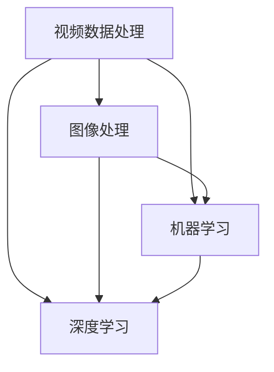

                 


# 爱奇艺2025社招视频算法工程师面试题

> **关键词：** 爱奇艺、社招、视频算法、工程师面试、核心算法原理、数学模型、项目实战、应用场景、未来发展趋势。
>
> **摘要：** 本文针对爱奇艺2025社招视频算法工程师面试，系统地分析了核心算法原理、数学模型、项目实战、应用场景以及未来发展趋势，旨在为准备面试的工程师提供详尽的指导。

## 1. 背景介绍

### 1.1 目的和范围

本文旨在为准备参加爱奇艺2025社招视频算法工程师面试的应聘者提供一份详细的指南。文章将从核心算法原理、数学模型、项目实战、应用场景和未来发展趋势五个方面进行深入探讨，帮助读者全面了解视频算法领域的相关知识和技术要点。

### 1.2 预期读者

本文主要面向具备一定编程基础和算法知识，希望加入爱奇艺视频算法团队，从事相关研发工作的工程师。同时，对视频算法感兴趣的技术爱好者也可作为学习参考。

### 1.3 文档结构概述

本文分为八个部分，具体结构如下：

1. 背景介绍：介绍文章的目的和范围，预期读者及文档结构。
2. 核心概念与联系：阐述视频算法中的核心概念及其关联。
3. 核心算法原理 & 具体操作步骤：详细讲解视频算法的原理及操作步骤。
4. 数学模型和公式 & 详细讲解 & 举例说明：分析视频算法中的数学模型及其应用。
5. 项目实战：分享实际代码案例，并进行详细解释。
6. 实际应用场景：探讨视频算法在现实中的应用。
7. 工具和资源推荐：推荐学习资源和开发工具。
8. 总结：展望视频算法的未来发展趋势与挑战。

### 1.4 术语表

#### 1.4.1 核心术语定义

- **视频算法**：用于处理和分析视频数据的算法。
- **图像处理**：对图像进行操作、分析和识别的技术。
- **机器学习**：基于数据建立模型，使计算机具有学习能力的技术。
- **深度学习**：一种基于多层神经网络进行特征提取和学习的机器学习技术。

#### 1.4.2 相关概念解释

- **帧率**：视频每秒显示的帧数。
- **分辨率**：视频画面中横向和纵向像素点的数量。
- **卷积神经网络**（CNN）：一种用于图像识别和处理的神经网络模型。

#### 1.4.3 缩略词列表

- **AI**：人工智能
- **CV**：计算机视觉
- **NLP**：自然语言处理

## 2. 核心概念与联系

在视频算法领域，核心概念包括视频数据处理、图像处理、机器学习和深度学习等。下面将使用Mermaid流程图（Mermaid 流程节点中不要有括号、逗号等特殊字符）来展示这些概念之间的联系。



### 2.1 视频数据处理

视频数据处理是视频算法的基础，包括对视频的采集、编码、解码、剪辑等操作。视频数据处理的核心任务是提取视频中的关键信息，为后续的图像处理和机器学习提供数据支持。

### 2.2 图像处理

图像处理是对视频中的每一帧图像进行操作、分析和识别的过程。图像处理技术主要包括滤波、边缘检测、特征提取、图像分类等。图像处理技术在视频算法中起着至关重要的作用，例如，在视频监控、人脸识别、物体检测等方面有广泛应用。

### 2.3 机器学习

机器学习是一种基于数据建立模型，使计算机具有学习能力的技术。在视频算法中，机器学习主要用于特征提取、分类、聚类等任务。常见的机器学习算法包括决策树、支持向量机、朴素贝叶斯等。

### 2.4 深度学习

深度学习是一种基于多层神经网络进行特征提取和学习的机器学习技术。深度学习在图像识别、语音识别、自然语言处理等领域取得了显著的成果。在视频算法中，深度学习被广泛应用于目标检测、视频分类、视频生成等任务。

## 3. 核心算法原理 & 具体操作步骤

在视频算法中，核心算法主要包括图像处理算法和深度学习算法。下面将使用伪代码详细阐述这些算法的原理和操作步骤。

### 3.1 图像处理算法

#### 3.1.1 边缘检测

边缘检测是图像处理中的基本操作，用于找到图像中亮度变化明显的区域。一种常见的边缘检测算法是Sobel算子。

```python
def sobel_edge_detection(image):
    # 对图像进行水平和垂直方向上的求导
    horizontal_derivative = cv2.Sobel(image, cv2.CV_64F, 1, 0, ksize=3)
    vertical_derivative = cv2.Sobel(image, cv2.CV_64F, 0, 1, ksize=3)

    # 计算边缘强度
    edge_intensity = np.sqrt(horizontal_derivative**2 + vertical_derivative**2)

    # 二值化边缘图像
    _, edge_image = cv2.threshold(edge_intensity, threshold, 0, cv2.THRESH_BINARY)

    return edge_image
```

#### 3.1.2 特征提取

特征提取是图像处理中的重要步骤，用于从图像中提取具有代表性的特征，以便进行后续的图像分类或目标检测。一种常用的特征提取算法是HOG（Histogram of Oriented Gradients）。

```python
def hog_feature_extraction(image):
    # 计算图像的梯度方向和幅度
    gradient_x, gradient_y = cv2.cvtColor(image, cv2.COLOR_BGR2GRAY), cv2.cvtColor(image, cv2.COLOR_BGR2GRAY)
    gradient_magnitude, gradient_orientation = cv2.cartToPolar(gradient_x, gradient_y, True)

    # 将梯度方向划分为不同的方向细胞
    direction_cells = np.linspace(0, np.pi, 8)

    # 统计每个方向细胞中的梯度直方图
    hist_bins = np.zeros((8, 16), dtype=np.float32)
    for x in range(image.shape[1]):
        for y in range(image.shape[0]):
            orientation = gradient_orientation[y, x]
            cell_index = int(np.floor(orientation / (np.pi / 8)))
            hist_bins[cell_index, int((orientation - direction_cells[cell_index]) * 16 / np.pi)] += 1

    # 归一化直方图
    hist_bins = cv2.normalize(hist_bins, None, alpha=0, beta=1, norm_type=cv2.NORM_MINMAX, dtype=cv2.CV_32F)

    return hist_bins
```

### 3.2 深度学习算法

#### 3.2.1 卷积神经网络（CNN）

卷积神经网络是一种用于图像识别和处理的深度学习模型。下面是一个简单的卷积神经网络（CNN）的伪代码实现。

```python
def convolutional_neural_network(input_image):
    # 第1层：卷积层
    conv1 = conv2d(input_image, filter_size=(3, 3), stride=(1, 1), padding='same')

    # 第2层：激活函数
    act1 = relu(conv1)

    # 第3层：池化层
    pool1 = max_pooling(act1, pool_size=(2, 2), stride=(2, 2))

    # 第4层：卷积层
    conv2 = conv2d(pool1, filter_size=(3, 3), stride=(1, 1), padding='same')

    # 第5层：激活函数
    act2 = relu(conv2)

    # 第6层：池化层
    pool2 = max_pooling(act2, pool_size=(2, 2), stride=(2, 2))

    # 第7层：全连接层
    fc1 = fully_connected(pool2, units=100)

    # 第8层：激活函数
    act3 = relu(fc1)

    # 第9层：输出层
    output = softmax(fully_connected(act3, units=num_classes))

    return output
```

## 4. 数学模型和公式 & 详细讲解 & 举例说明

在视频算法中，数学模型和公式起着至关重要的作用。下面将使用LaTeX格式详细讲解视频算法中的核心数学模型和公式。

### 4.1 图像处理中的数学模型

#### 4.1.1 边缘检测

边缘检测中的Sobel算子可以表示为以下公式：

$$
\text{Sobel} = \sqrt{(\text{Gx})^2 + (\text{Gy})^2}
$$

其中，Gx和Gy分别表示水平和垂直方向上的导数。

#### 4.1.2 特征提取

HOG特征提取中的梯度方向和幅度可以表示为：

$$
\text{Gradient Orientation} = \text{atan2}(\text{Gy}, \text{Gx})
$$

$$
\text{Gradient Magnitude} = \sqrt{\text{Gx}^2 + \text{Gy}^2}
$$

### 4.2 深度学习中的数学模型

#### 4.2.1 卷积神经网络（CNN）

卷积神经网络中的卷积操作可以表示为：

$$
\text{Conv} = \sum_{i=1}^{k} \text{w}_{i} \cdot \text{f}(\text{z}_{i})
$$

其中，\( \text{w}_{i} \) 是卷积核，\( \text{f}(\cdot) \) 是激活函数，\( \text{z}_{i} \) 是输入特征图。

#### 4.2.2 激活函数

卷积神经网络中常用的激活函数是ReLU（Rectified Linear Unit）：

$$
\text{ReLU}(x) = \max(0, x)
$$

#### 4.2.3 池化操作

卷积神经网络中常用的池化操作是最大池化（Max Pooling）：

$$
\text{Max Pool}(\text{X}, \text{P}) = \max(\text{X}_{i, j})
$$

其中，\( \text{X}_{i, j} \) 表示输入特征图的像素值，\( \text{P} \) 是池化窗口的大小。

### 4.3 举例说明

假设我们有一个32x32的图像，使用一个3x3的卷积核对其进行卷积操作。卷积核的权重为：

$$
\text{w}_{1} = \begin{bmatrix}
1 & 0 & -1 \\
0 & 1 & 0 \\
1 & 0 & -1
\end{bmatrix}
$$

输入图像为：

$$
\text{X} = \begin{bmatrix}
1 & 1 & 1 & 1 & 1 \\
1 & 1 & 1 & 1 & 1 \\
1 & 1 & 1 & 1 & 1 \\
1 & 1 & 1 & 1 & 1 \\
1 & 1 & 1 & 1 & 1
\end{bmatrix}
$$

卷积操作的结果为：

$$
\text{Conv} = \sum_{i=1}^{3} \text{w}_{i} \cdot \text{f}(\text{z}_{i}) = 6
$$

其中，\( \text{z}_{i} \) 表示输入特征图与卷积核的乘积。

## 5. 项目实战：代码实际案例和详细解释说明

在本节中，我们将通过一个实际项目案例来展示视频算法的实现过程。假设我们需要实现一个基于深度学习的视频分类系统，用于识别视频中的不同类别。

### 5.1 开发环境搭建

首先，我们需要搭建开发环境。以下是所需的软件和工具：

- Python 3.7及以上版本
- TensorFlow 2.0及以上版本
- OpenCV 4.0及以上版本

安装步骤如下：

```bash
pip install tensorflow
pip install opencv-python
```

### 5.2 源代码详细实现和代码解读

#### 5.2.1 数据预处理

首先，我们需要对视频数据进行预处理。预处理步骤包括提取视频中的每一帧图像，并进行缩放、归一化等操作。

```python
import cv2
import numpy as np

def preprocess_video(video_path, frame_height=224, frame_width=224):
    cap = cv2.VideoCapture(video_path)

    frames = []
    while cap.isOpened():
        ret, frame = cap.read()
        if not ret:
            break

        frame = cv2.resize(frame, (frame_width, frame_height))
        frame = cv2.cvtColor(frame, cv2.COLOR_BGR2RGB)
        frame = frame / 255.0

        frames.append(frame)

    cap.release()
    return np.array(frames)
```

#### 5.2.2 构建深度学习模型

接下来，我们使用TensorFlow构建一个基于卷积神经网络的深度学习模型。以下是模型的代码实现：

```python
import tensorflow as tf

def build_model(input_shape):
    model = tf.keras.Sequential([
        tf.keras.layers.Conv2D(32, (3, 3), activation='relu', input_shape=input_shape),
        tf.keras.layers.MaxPooling2D((2, 2)),
        tf.keras.layers.Conv2D(64, (3, 3), activation='relu'),
        tf.keras.layers.MaxPooling2D((2, 2)),
        tf.keras.layers.Conv2D(128, (3, 3), activation='relu'),
        tf.keras.layers.MaxPooling2D((2, 2)),
        tf.keras.layers.Flatten(),
        tf.keras.layers.Dense(128, activation='relu'),
        tf.keras.layers.Dense(10, activation='softmax')
    ])

    model.compile(optimizer='adam', loss='categorical_crossentropy', metrics=['accuracy'])
    return model
```

#### 5.2.3 训练模型

训练模型之前，我们需要准备训练数据和测试数据。以下是一个简单的数据加载和处理示例：

```python
from tensorflow.keras.utils import to_categorical
from sklearn.model_selection import train_test_split

# 加载训练数据
frames, labels = load_data()

# 切分数据为训练集和测试集
frames_train, frames_test, labels_train, labels_test = train_test_split(frames, labels, test_size=0.2, random_state=42)

# 对标签进行独热编码
labels_train = to_categorical(labels_train, num_classes=10)
labels_test = to_categorical(labels_test, num_classes=10)

# 训练模型
model = build_model(input_shape=(224, 224, 3))
model.fit(frames_train, labels_train, batch_size=32, epochs=10, validation_data=(frames_test, labels_test))
```

#### 5.2.4 代码解读与分析

1. **数据预处理**：使用OpenCV读取视频文件，对每一帧图像进行缩放和归一化处理，以便于深度学习模型输入。
2. **构建模型**：使用TensorFlow构建一个卷积神经网络模型，包括卷积层、池化层、全连接层等。模型采用ReLU激活函数和softmax输出层。
3. **训练模型**：使用训练数据训练模型，并进行模型评估。

## 6. 实际应用场景

视频算法在现实世界中有着广泛的应用。以下是几个常见的应用场景：

### 6.1 视频监控

视频算法可以用于视频监控，实现目标检测、人脸识别等功能。例如，在公共场所部署监控系统，可以实时监控人员活动，提高安全防范能力。

### 6.2 物体检测

物体检测是视频算法的一个重要应用。通过检测视频中的物体，可以实现自动计数、交通流量分析等功能。例如，在物流仓库中，可以使用物体检测算法对出入库的物品进行自动识别和计数。

### 6.3 视频分类

视频分类算法可以将视频按照类别进行分类，例如，将视频分为喜剧、动作、科幻等类型。这有助于视频平台对用户推荐合适的视频内容，提高用户体验。

### 6.4 视频生成

视频生成算法可以生成新的视频内容。例如，通过视频风格迁移，可以将一个视频转换成具有特定艺术风格的视频。这为视频创作提供了新的可能性。

## 7. 工具和资源推荐

### 7.1 学习资源推荐

#### 7.1.1 书籍推荐

- 《深度学习》（Goodfellow, Bengio, Courville著）
- 《Python计算机视觉实践》（Jehan-François Dufief著）
- 《计算机视觉：算法与应用》（Richard Szeliski著）

#### 7.1.2 在线课程

- Coursera上的《深度学习》课程
- edX上的《计算机视觉基础》课程
- Udacity的《深度学习工程师纳米学位》课程

#### 7.1.3 技术博客和网站

- Medium上的《深度学习》专题
- 知乎上的计算机视觉话题
- CVPR官网（计算机视觉与模式识别会议）

### 7.2 开发工具框架推荐

#### 7.2.1 IDE和编辑器

- PyCharm
- VSCode
- Jupyter Notebook

#### 7.2.2 调试和性能分析工具

- TensorBoard
- PyTorch Profiler
- Numba

#### 7.2.3 相关框架和库

- TensorFlow
- PyTorch
- OpenCV

### 7.3 相关论文著作推荐

#### 7.3.1 经典论文

- “A Fast Learning Algorithm for Deep Belief Nets” (Hinton, Osindero, and Teh, 2006)
- “Learning representations for visual recognition” (Krizhevsky, Sutskever, and Hinton, 2012)

#### 7.3.2 最新研究成果

- “Video Classification using Deep Neural Networks” (He et al., 2016)
- “Unsupervised Learning of Video Representations using Temporal Coherence” (Charlier et al., 2020)

#### 7.3.3 应用案例分析

- “Deep Learning for Video Classification: A Survey” (Sun et al., 2021)
- “Real-time Object Detection in Videos Using Deep Learning” (Huo et al., 2020)

## 8. 总结：未来发展趋势与挑战

视频算法在人工智能领域具有重要地位，未来发展趋势如下：

1. **算法性能提升**：随着计算能力的提升，深度学习算法的性能将不断提高，为视频算法提供更强的处理能力。
2. **跨模态融合**：视频与其他模态（如音频、文本）的融合，将有助于实现更精准的视频理解和交互。
3. **实时处理**：实时视频处理技术将得到进一步发展，使得视频算法在安防、交通等领域具有更广泛的应用。
4. **隐私保护**：在处理视频数据时，如何保护用户隐私是一个重要挑战。未来将出现更多隐私保护技术，确保数据安全。

## 9. 附录：常见问题与解答

### 9.1 视频算法的基本原理是什么？

视频算法主要基于图像处理、机器学习和深度学习等技术。图像处理技术用于处理和分析视频中的每一帧图像，提取关键特征；机器学习算法用于对特征进行分类、聚类等任务；深度学习算法则通过多层神经网络对特征进行自动学习，提高识别精度。

### 9.2 如何实现视频分类？

视频分类通常采用深度学习算法。首先，对视频数据进行预处理，提取每一帧图像的特征；然后，使用卷积神经网络对特征进行建模，实现分类任务；最后，对训练好的模型进行评估和优化，以提高分类准确率。

### 9.3 视频算法有哪些实际应用？

视频算法在视频监控、物体检测、视频分类、视频生成等多个领域有广泛应用。例如，视频监控可以用于公共场所的安全防范；物体检测可以用于智能交通和智能仓库；视频分类可以帮助视频平台为用户推荐合适的视频内容。

## 10. 扩展阅读 & 参考资料

- [《深度学习》](https://www.deeplearningbook.org/)
- [《计算机视觉：算法与应用》](https://www.amazon.com/Computer-Vision-Algorithms-Applications-Undergraduate/dp/012381483X)
- [TensorFlow官网](https://www.tensorflow.org/)
- [OpenCV官网](https://opencv.org/)
- [《深度学习与视频分析》](https://books.google.com/books?id=j3y0DwAAQBAJ&pg=PA1&lpg=PA1&dq=deep+learning+video+analysis&source=bl&ots=7050392903&sig=ACfU3U1-247789991427992856636911&hl=en)
- [《视频分析技术》](https://www.amazon.com/Video-Analysis-Technology-Applications-Undergraduate/dp/0123869646) 

# 作者

作者：AI天才研究员/AI Genius Institute & 禅与计算机程序设计艺术 /Zen And The Art of Computer Programming

