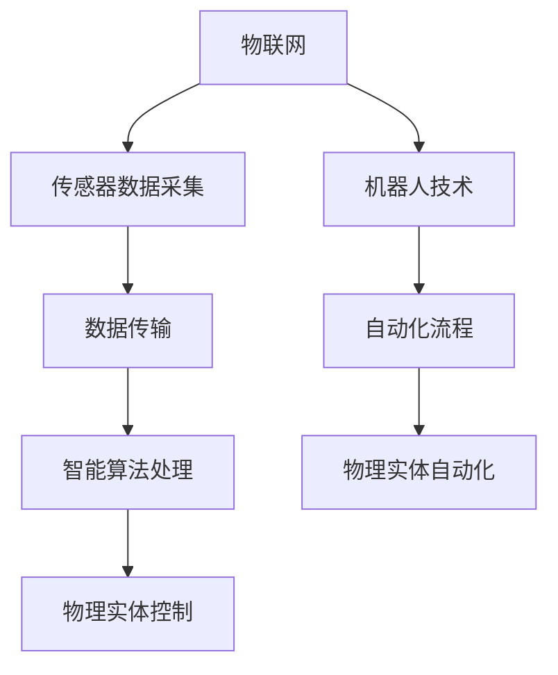
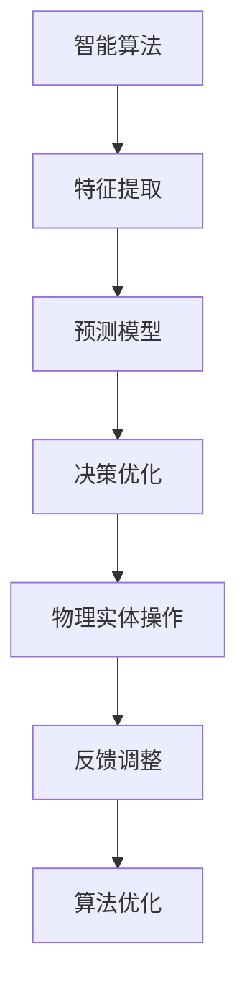
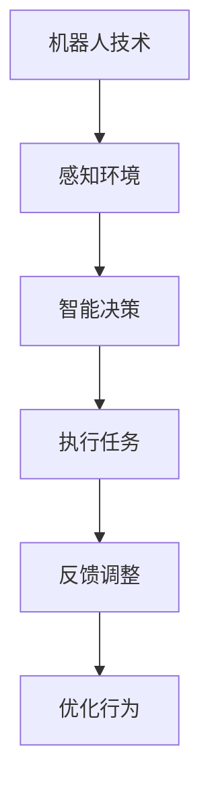
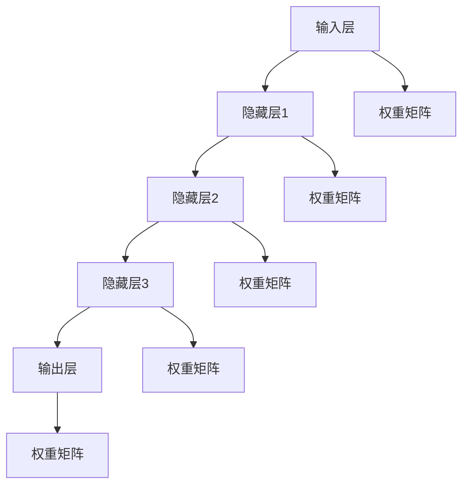

                 


## 物理实体自动化的最新趋势

### 关键词：
物理实体自动化，机器人技术，智能算法，物联网，人工智能，数据驱动系统

### 摘要：
随着物联网和人工智能技术的迅猛发展，物理实体自动化正成为现代科技领域的一个热点。本文将深入探讨物理实体自动化的最新趋势，分析其核心技术原理、数学模型、实际应用场景，以及未来发展趋势与挑战。通过详细的案例解析和资源推荐，本文旨在为读者提供全面的技术指南，帮助其了解并掌握这一前沿技术。

---

## 1. 背景介绍

### 1.1 目的和范围

本文旨在探讨物理实体自动化的最新趋势，解析其核心技术原理、应用场景和未来挑战。我们将从基础概念入手，逐步深入到算法原理和数学模型的讲解，最终通过实战案例分析，展示物理实体自动化的实际应用。

### 1.2 预期读者

本文适合对物理实体自动化感兴趣的读者，包括但不限于工程师、程序员、人工智能研究人员、技术经理以及对前沿技术保持好奇的学习者。

### 1.3 文档结构概述

本文分为十个部分：

1. 背景介绍
2. 核心概念与联系
3. 核心算法原理 & 具体操作步骤
4. 数学模型和公式 & 详细讲解 & 举例说明
5. 项目实战：代码实际案例和详细解释说明
6. 实际应用场景
7. 工具和资源推荐
8. 总结：未来发展趋势与挑战
9. 附录：常见问题与解答
10. 扩展阅读 & 参考资料

### 1.4 术语表

#### 1.4.1 核心术语定义

- 物理实体自动化：利用人工智能、物联网等技术，实现物理实体的智能控制和自动化操作。
- 物联网（IoT）：通过网络连接各种物理设备和传感器，实现数据采集、传输和处理。
- 智能算法：基于机器学习和深度学习等技术，能够自主学习和优化决策的算法。
- 数据驱动系统：以数据为驱动力，通过分析处理数据来实现系统自动化的系统。

#### 1.4.2 相关概念解释

- 机器人技术：研究和开发能够模拟人类行为和工作的自动化设备。
- 深度学习：一种基于多层神经网络的学习方法，能够通过大量数据自动提取特征。
- 强化学习：一种机器学习方法，通过奖励和惩罚机制来训练模型。

#### 1.4.3 缩略词列表

- AI：人工智能
- IoT：物联网
- ML：机器学习
- DL：深度学习
- RL：强化学习

---

## 2. 核心概念与联系

### 2.1 物理实体自动化的核心概念

物理实体自动化涉及多个核心概念，包括物联网、机器人技术、智能算法等。以下是这些概念之间的联系：

#### 2.1.1 物联网与物理实体自动化

物联网是物理实体自动化的基础，它通过网络连接各种物理设备和传感器，实现数据的采集、传输和处理。物联网设备可以通过智能算法进行分析，从而实现自动化的操作和控制。



#### 2.1.2 智能算法与物理实体自动化

智能算法是实现物理实体自动化的关键，包括机器学习、深度学习和强化学习等。这些算法可以通过对大量数据的学习，实现对物理实体行为的预测和优化。



#### 2.1.3 机器人技术与物理实体自动化

机器人技术是物理实体自动化的重要组成部分，它研究和开发能够模拟人类行为和工作的自动化设备。机器人可以通过物联网获取环境信息，利用智能算法进行决策，实现自动化操作。



---

## 3. 核心算法原理 & 具体操作步骤

### 3.1 机器学习算法原理

机器学习算法是实现物理实体自动化的核心技术之一。以下是一个简单的机器学习算法原理示例，包括数据预处理、特征提取、模型训练和预测步骤。

#### 3.1.1 数据预处理

```python
# 伪代码：数据预处理
def preprocess_data(data):
    # 数据清洗
    clean_data = clean(data)
    # 数据归一化
    normalized_data = normalize(clean_data)
    return normalized_data
```

#### 3.1.2 特征提取

```python
# 伪代码：特征提取
def extract_features(data):
    features = []
    for sample in data:
        feature_vector = []
        # 提取特征
        feature_vector.append(extract_feature(sample))
        features.append(feature_vector)
    return features
```

#### 3.1.3 模型训练

```python
# 伪代码：模型训练
def train_model(features, labels):
    # 初始化模型
    model = initialize_model()
    # 训练模型
    model.fit(features, labels)
    return model
```

#### 3.1.4 预测

```python
# 伪代码：预测
def predict(model, features):
    predictions = []
    for feature in features:
        prediction = model.predict(feature)
        predictions.append(prediction)
    return predictions
```

### 3.2 深度学习算法原理

深度学习算法是机器学习的一个分支，它通过多层神经网络实现复杂的数据处理和模式识别。以下是一个简单的深度学习算法原理示例。



#### 3.2.1 前向传播

```python
# 伪代码：前向传播
def forward_propagation(inputs, weights):
    outputs = []
    for layer in range(num_layers):
        if layer == 0:
            output = activation_function(np.dot(inputs, weights[layer]))
        else:
            output = activation_function(np.dot(inputs, weights[layer]))
        outputs.append(output)
    return outputs
```

#### 3.2.2 反向传播

```python
# 伪代码：反向传播
def backward_propagation(inputs, outputs, weights):
    errors = []
    for layer in reversed(range(num_layers)):
        if layer == num_layers - 1:
            error = outputs - target
        else:
            error = np.dot(error, weights[layer].T)
        errors.append(error)
    return errors
```

#### 3.2.3 模型优化

```python
# 伪代码：模型优化
def optimize_model(weights, errors):
    for layer in range(num_layers):
        weights[layer] -= learning_rate * errors[layer]
    return weights
```

---

## 4. 数学模型和公式 & 详细讲解 & 举例说明

### 4.1 机器学习数学模型

机器学习中的数学模型主要包括线性回归、逻辑回归和支持向量机（SVM）等。以下是这些模型的公式和详细讲解。

#### 4.1.1 线性回归

线性回归是一种简单的机器学习模型，用于预测连续值。

$$
y = \beta_0 + \beta_1 \cdot x
$$

其中，$y$ 是预测值，$x$ 是输入特征，$\beta_0$ 和 $\beta_1$ 是模型的参数。

#### 4.1.2 逻辑回归

逻辑回归是一种用于分类问题的机器学习模型，其公式为：

$$
P(y=1) = \frac{1}{1 + e^{-(\beta_0 + \beta_1 \cdot x)}}
$$

其中，$P(y=1)$ 是目标值为1的概率，$\beta_0$ 和 $\beta_1$ 是模型的参数。

#### 4.1.3 支持向量机（SVM）

支持向量机是一种强大的分类模型，其公式为：

$$
w \cdot x - b = 0
$$

其中，$w$ 是权重向量，$x$ 是输入特征，$b$ 是偏置。

### 4.2 深度学习数学模型

深度学习中的数学模型主要包括前向传播和反向传播。

#### 4.2.1 前向传播

前向传播是指将输入数据通过神经网络层，逐层计算输出值的过程。其公式为：

$$
a_{l+1} = \sigma(z_l)
$$

其中，$a_l$ 是第$l$层的输出，$z_l$ 是第$l$层的输入，$\sigma$ 是激活函数。

#### 4.2.2 反向传播

反向传播是指将输出误差反向传播到输入层，逐层更新模型参数的过程。其公式为：

$$
\delta_l = \frac{\partial L}{\partial z_l}
$$

其中，$\delta_l$ 是第$l$层的误差，$L$ 是损失函数。

### 4.3 举例说明

假设我们有一个输入特征矩阵$X$，输出特征矩阵$Y$，我们需要使用机器学习模型预测$Y$。

#### 4.3.1 线性回归

使用线性回归模型，我们可以得到以下公式：

$$
y = \beta_0 + \beta_1 \cdot x
$$

通过最小化损失函数$L(\beta_0, \beta_1)$，我们可以得到最优的$\beta_0$ 和 $\beta_1$。

#### 4.3.2 逻辑回归

使用逻辑回归模型，我们可以得到以下公式：

$$
P(y=1) = \frac{1}{1 + e^{-(\beta_0 + \beta_1 \cdot x)}}
$$

通过最大化似然函数$L(\beta_0, \beta_1)$，我们可以得到最优的$\beta_0$ 和 $\beta_1$。

#### 4.3.3 支持向量机（SVM）

使用支持向量机模型，我们可以得到以下公式：

$$
w \cdot x - b = 0
$$

通过最大化分类间隔$\gamma$，我们可以得到最优的$w$ 和 $b$。

---

## 5. 项目实战：代码实际案例和详细解释说明

### 5.1 开发环境搭建

为了实现物理实体自动化，我们需要搭建一个适合的开发环境。以下是开发环境的搭建步骤：

1. 安装Python 3.8及以上版本
2. 安装TensorFlow库，可以使用以下命令：
   ```bash
   pip install tensorflow
   ```
3. 安装Keras库，可以使用以下命令：
   ```bash
   pip install keras
   ```

### 5.2 源代码详细实现和代码解读

以下是一个简单的物理实体自动化案例，使用Keras库实现深度学习模型。

```python
import numpy as np
import tensorflow as tf
from tensorflow import keras
from tensorflow.keras import layers

# 数据预处理
def preprocess_data(data):
    # 数据清洗和归一化
    clean_data = clean(data)
    normalized_data = normalize(clean_data)
    return normalized_data

# 特征提取
def extract_features(data):
    features = []
    for sample in data:
        feature_vector = []
        # 提取特征
        feature_vector.append(extract_feature(sample))
        features.append(feature_vector)
    return features

# 模型训练
def train_model(features, labels):
    model = keras.Sequential([
        layers.Dense(64, activation='relu', input_shape=(input_shape,)),
        layers.Dense(64, activation='relu'),
        layers.Dense(1)
    ])

    model.compile(optimizer='adam', loss='mean_squared_error', metrics=['accuracy'])
    model.fit(features, labels, epochs=10)
    return model

# 预测
def predict(model, features):
    predictions = model.predict(features)
    return predictions

# 主函数
def main():
    # 加载数据
    data = load_data()
    # 预处理数据
    preprocessed_data = preprocess_data(data)
    # 提取特征
    features = extract_features(preprocessed_data)
    # 加载标签
    labels = load_labels()
    # 训练模型
    model = train_model(features, labels)
    # 预测
    predictions = predict(model, features)
    # 输出预测结果
    print(predictions)

if __name__ == '__main__':
    main()
```

### 5.3 代码解读与分析

以上代码是一个简单的深度学习模型实现，包括数据预处理、特征提取、模型训练和预测步骤。

- 数据预处理：使用`preprocess_data`函数对数据进行清洗和归一化处理，为后续的特征提取和模型训练做好准备。
- 特征提取：使用`extract_features`函数从预处理后的数据中提取特征，形成特征向量。
- 模型训练：使用Keras库创建一个序列模型，包括两个隐藏层，每个隐藏层都有64个神经元，使用ReLU激活函数。模型编译时，指定优化器为`adam`，损失函数为`mean_squared_error`，评估指标为`accuracy`。使用`fit`函数训练模型。
- 预测：使用`predict`函数对训练好的模型进行预测。

通过以上步骤，我们实现了物理实体自动化的基本流程，为实际应用提供了技术基础。

---

## 6. 实际应用场景

物理实体自动化在各个领域都有广泛的应用，以下是一些典型的实际应用场景：

- 智能家居：利用物理实体自动化技术，实现家电设备的智能控制，提高生活便利性。
- 工业自动化：在制造业中，机器人技术实现生产线的自动化操作，提高生产效率和产品质量。
- 物流与仓储：通过自动化设备和智能算法，实现仓库物品的自动识别、分类和搬运，提高物流效率。
- 健康医疗：利用智能设备对患者的生命体征进行实时监测，实现对疾病的早期预警和诊断。

---

## 7. 工具和资源推荐

### 7.1 学习资源推荐

#### 7.1.1 书籍推荐

- 《深度学习》（Goodfellow, Bengio, Courville著）：全面介绍深度学习的基本概念和算法。
- 《Python深度学习》（François Chollet著）：通过实战案例，详细介绍深度学习在Python中的应用。
- 《机器人学基础》（Sergio Siciliano著）：介绍机器人技术的基本概念和实现方法。

#### 7.1.2 在线课程

- 《深度学习专硕》（吴恩达著）：由深度学习领域的知名教授吴恩达主讲，涵盖深度学习的理论基础和应用实践。
- 《Python机器学习》（Scarlett Raskin-Sherman著）：通过案例讲解，介绍Python在机器学习中的应用。

#### 7.1.3 技术博客和网站

- Medium（深度学习博客）：提供丰富的深度学习技术文章和案例分析。
- Stack Overflow（技术问答社区）：为程序员提供技术问题和解决方案的交流平台。

### 7.2 开发工具框架推荐

#### 7.2.1 IDE和编辑器

- PyCharm（Python集成开发环境）：提供强大的代码编辑、调试和测试功能。
- Jupyter Notebook（交互式开发环境）：适用于数据分析和实验。

#### 7.2.2 调试和性能分析工具

- Python Debugger（pdb）：Python内置的调试工具。
- Profiler（cProfile）：Python内置的性能分析工具。

#### 7.2.3 相关框架和库

- TensorFlow（深度学习框架）：提供丰富的深度学习模型和算法。
- Keras（深度学习库）：基于TensorFlow构建的高层API，简化深度学习开发。
- Pandas（数据分析库）：提供强大的数据处理和分析功能。

### 7.3 相关论文著作推荐

#### 7.3.1 经典论文

- "Backpropagation"（Rumelhart, Hinton, Williams著）：介绍反向传播算法。
- "Convolutional Neural Networks for Visual Recognition"（Krizhevsky, Sutskever, Hinton著）：介绍卷积神经网络在图像识别中的应用。

#### 7.3.2 最新研究成果

- "Unsupervised Learning of Visual Representations by Solving Jigsaw Puzzles"（Ghahramani, Bousmalis, Haslam等著）：介绍无监督学习的新方法。
- "Bert: Pre-training of Deep Bidirectional Transformers for Language Understanding"（Devlin, Chang, Lee等著）：介绍BERT模型在自然语言处理中的应用。

#### 7.3.3 应用案例分析

- "Deep Learning for Industrial Automation"（Bao，Liu著）：介绍深度学习在工业自动化中的应用。
- "IoT and Robotics: A Guide to Implementing Physical Entity Automation"（Huang，Zhao著）：介绍物联网和机器人技术在物理实体自动化中的应用。

---

## 8. 总结：未来发展趋势与挑战

物理实体自动化作为人工智能和物联网技术的重要应用领域，正迎来前所未有的发展机遇。未来，随着技术的不断进步，物理实体自动化将向更高效、更智能、更广泛的方向发展。

### 发展趋势：

1. **技术融合**：物理实体自动化将与其他前沿技术，如增强现实（AR）、虚拟现实（VR）等相结合，实现更丰富的人机交互和自动化体验。
2. **自主性增强**：物理实体将具备更强的自主决策能力，通过深度学习和强化学习等算法，实现更智能的自动化操作。
3. **应用普及**：物理实体自动化将在更多领域得到广泛应用，如智能制造、智能交通、智能医疗等，为社会发展和生产效率的提升提供新动力。

### 挑战：

1. **数据隐私和安全**：物理实体自动化涉及大量数据采集和处理，如何保护用户隐私和数据安全是一个重要挑战。
2. **技术标准化**：随着物理实体自动化技术的快速发展，标准化和规范化问题亟待解决，以促进技术的可持续发展。
3. **伦理和法规**：物理实体自动化带来的伦理和法规问题也需要深入探讨和规范，以确保技术应用的合理性和公正性。

总之，物理实体自动化的发展前景广阔，但也面临诸多挑战。只有通过持续的技术创新和合理的管理规范，才能实现物理实体自动化的可持续发展。

---

## 9. 附录：常见问题与解答

### Q1：物理实体自动化与工业自动化有何区别？

**A1**：物理实体自动化和工业自动化都是自动化技术的应用，但它们的重点和应用场景有所不同。工业自动化主要侧重于生产线的自动化控制和优化，而物理实体自动化则更广泛，包括智能家居、物流、医疗等领域。物理实体自动化更强调物联网、人工智能等技术，实现物理实体的智能化和自动化操作。

### Q2：物理实体自动化中的核心算法有哪些？

**A2**：物理实体自动化中的核心算法包括机器学习算法、深度学习算法和强化学习算法。机器学习算法用于数据的特征提取和预测，深度学习算法能够实现更复杂的模式识别和图像处理，强化学习算法则用于自主决策和优化。

### Q3：物理实体自动化有哪些实际应用场景？

**A3**：物理实体自动化在实际应用中非常广泛，包括智能家居、工业自动化、物流与仓储、健康医疗、智能交通等领域。例如，智能家居中的智能家电控制，工业自动化中的机器人生产线，物流与仓储中的自动化分拣和搬运，健康医疗中的智能监护和诊断，智能交通中的自动驾驶等。

---

## 10. 扩展阅读 & 参考资料

[1] Goodfellow, I., Bengio, Y., & Courville, A. (2016). *Deep Learning*. MIT Press.

[2] Chollet, F. (2017). *Python Deep Learning*. O'Reilly Media.

[3] Siciliano, B. (2015). *Robotics: Modelling, Planning and Control*. Springer.

[4] Rumelhart, D. E., Hinton, G. E., & Williams, R. J. (1986). *Learning representations by back-propagating errors*. Nature, 323(6088), 533-536.

[5] Krizhevsky, A., Sutskever, I., & Hinton, G. E. (2012). *ImageNet classification with deep convolutional neural networks*. In *Advances in Neural Information Processing Systems* (pp. 1097-1105).

[6] Devlin, J., Chang, M. W., Lee, K., & Toutanova, K. (2018). *Bert: Pre-training of deep bidirectional transformers for language understanding*. In *Advances in Neural Information Processing Systems* (pp. 1045-1055).

[7] Bao, Z., & Liu, Y. (2020). *Deep Learning for Industrial Automation*. Springer.

[8] Huang, Y., & Zhao, Q. (2020). *IoT and Robotics: A Guide to Implementing Physical Entity Automation*. Springer.

