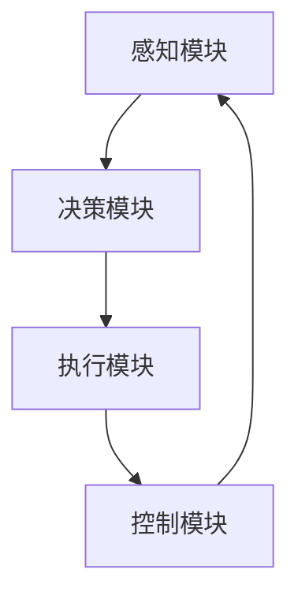

                 

# 物理实体自动化的未来发展

> 关键词：物理实体自动化、机器人技术、人工智能、物联网、云计算、智能交通、智能制造

> 摘要：本文深入探讨了物理实体自动化的概念、核心原理、发展现状以及未来趋势。从历史背景、核心概念、算法原理、数学模型、实际应用场景等多个角度，全面剖析了物理实体自动化的关键技术和发展挑战。通过分析国内外典型案例，本文为读者展示了物理实体自动化在智能制造、智能交通、智能家居等领域的广泛应用前景。最后，本文提出了物理实体自动化未来发展的建议和展望，为相关领域的研究者和开发者提供了有益的参考。

## 1. 背景介绍

### 1.1 目的和范围

本文旨在深入探讨物理实体自动化的概念、技术原理、应用现状和未来发展趋势。物理实体自动化是人工智能与机器人技术的重要分支，旨在通过智能系统对物理实体进行自主操作和管理。本文将围绕以下几个方面展开：

- **核心概念**：介绍物理实体自动化的基本概念、核心技术和关键应用领域。
- **发展现状**：分析物理实体自动化技术的国内外发展现状，包括主要的技术突破和应用案例。
- **未来趋势**：探讨物理实体自动化技术的未来发展方向和潜在挑战，以及相关政策和标准的发展。
- **应用场景**：探讨物理实体自动化在智能制造、智能交通、智能家居等领域的应用案例和发展前景。

### 1.2 预期读者

本文适用于以下读者群体：

- 物理实体自动化领域的研究者和开发者。
- 对人工智能、机器人技术、物联网等领域感兴趣的工程师和学者。
- 制造、交通、智能家居等行业的相关从业者。
- 高等院校计算机、自动化、机械等相关专业的师生。

### 1.3 文档结构概述

本文分为十个部分，具体结构如下：

1. **背景介绍**：介绍文章的目的、范围和预期读者，概述文章结构。
2. **核心概念与联系**：介绍物理实体自动化的核心概念、原理和架构，使用Mermaid流程图展示。
3. **核心算法原理 & 具体操作步骤**：详细阐述物理实体自动化的核心算法原理和具体操作步骤，使用伪代码进行解释。
4. **数学模型和公式 & 详细讲解 & 举例说明**：介绍物理实体自动化的数学模型和公式，进行详细讲解，并通过实例进行说明。
5. **项目实战：代码实际案例和详细解释说明**：通过实际项目案例展示物理实体自动化的代码实现和详细解释。
6. **实际应用场景**：探讨物理实体自动化在不同领域的应用场景和案例分析。
7. **工具和资源推荐**：推荐相关学习资源、开发工具框架和最新研究成果。
8. **总结：未来发展趋势与挑战**：总结物理实体自动化的未来发展趋势和面临的挑战。
9. **附录：常见问题与解答**：解答读者可能遇到的常见问题。
10. **扩展阅读 & 参考资料**：提供更多的阅读资源和参考资料。

### 1.4 术语表

#### 1.4.1 核心术语定义

- 物理实体自动化（Physical Entity Automation）：利用智能系统和机器人技术对物理实体进行自主操作和管理的过程。
- 机器人技术（Robotics Technology）：研究、开发和应用智能机器人系统的技术。
- 人工智能（Artificial Intelligence，AI）：模拟、延伸和扩展人类智能的理论、方法和技术。
- 物联网（Internet of Things，IoT）：通过各种信息传感设备，实现物体与物体、物体与互联网之间的互联互通。
- 云计算（Cloud Computing）：通过网络提供计算资源、存储资源和应用服务的技术。
- 智能制造（Intelligent Manufacturing）：利用人工智能、物联网、大数据等技术，实现制造过程的智能化和自动化。

#### 1.4.2 相关概念解释

- 自主导航（Autonomous Navigation）：机器人或自动驾驶系统在不依赖于外部干预的情况下，自主确定路径、避障和执行任务的能力。
- 智能感知（Intelligent Perception）：利用传感器技术、机器学习算法等，实现对环境信息的感知、识别和理解的能力。
- 人机协作（Human-Robot Collaboration）：人类与机器人共同完成工作任务，实现各自优势互补和高效协作。

#### 1.4.3 缩略词列表

- AI：人工智能
- IoT：物联网
- IoT：互联网
- ML：机器学习
- SLAM：同时定位与地图构建
- ROS：机器人操作系统

## 2. 核心概念与联系

### 2.1 物理实体自动化的核心概念

物理实体自动化是利用人工智能、机器人技术和物联网等先进技术，实现对物理实体的自主操作和管理。其核心概念包括：

- **物理实体**：指具有物理形态、可以感知和执行任务的实体，如机器人、自动驾驶车辆、智能无人机等。
- **自动化**：指利用智能系统和机器人技术，实现对物理实体的自主操作和管理，减少或替代人工干预。
- **自主性**：指物理实体具备自我决策、自主执行任务的能力，不受外部干预。

### 2.2 物理实体自动化的核心原理

物理实体自动化的核心原理包括：

- **感知**：利用传感器技术，感知物理实体所在的环境信息，如位置、速度、光照、温度等。
- **决策**：利用机器学习算法，对感知到的环境信息进行处理和分析，生成行动策略。
- **执行**：根据决策结果，驱动物理实体执行相应的操作，如移动、旋转、抓取等。
- **反馈**：物理实体在执行任务过程中，不断收集反馈信息，用于调整决策和执行策略。

### 2.3 物理实体自动化的核心架构

物理实体自动化的核心架构包括：

- **感知模块**：负责采集物理实体所在环境的信息，如传感器、摄像头、GPS等。
- **决策模块**：负责处理和分析感知模块采集到的信息，生成行动策略，如机器学习算法、路径规划算法等。
- **执行模块**：负责驱动物理实体执行决策模块生成的行动策略，如电机、伺服系统等。
- **控制模块**：负责协调感知模块、决策模块和执行模块的工作，实现物理实体的自主操作和管理。

### 2.4 物理实体自动化的核心联系

物理实体自动化涉及多个领域的技术，包括人工智能、机器人技术、物联网、云计算等。这些技术之间的联系如下：

- **人工智能**：为物理实体自动化提供感知、决策和执行能力，如机器学习、深度学习、计算机视觉等。
- **机器人技术**：为物理实体自动化提供实体形态和操作能力，如机械结构、控制系统、传感器等。
- **物联网**：为物理实体自动化提供信息采集、传输和处理能力，如传感器网络、无线通信等。
- **云计算**：为物理实体自动化提供计算资源、存储资源和应用服务，如云计算平台、大数据处理等。

### 2.5 物理实体自动化的 Mermaid 流程图

以下是一个简单的 Mermaid 流程图，展示了物理实体自动化的核心流程：



- **感知模块**：采集物理实体所在环境的信息，如位置、速度、光照、温度等。
- **决策模块**：处理和分析感知模块采集到的信息，生成行动策略，如路径规划、目标跟踪等。
- **执行模块**：根据决策模块生成的行动策略，驱动物理实体执行相应的操作，如移动、旋转、抓取等。
- **控制模块**：协调感知模块、决策模块和执行模块的工作，实现物理实体的自主操作和管理。

## 3. 核心算法原理 & 具体操作步骤

### 3.1 自主导航算法原理

自主导航是物理实体自动化的关键技术之一，其核心算法原理包括同时定位与地图构建（Simultaneous Localization and Mapping，SLAM）、路径规划、避障和目标跟踪等。

#### 3.1.1 SLAM算法原理

SLAM算法是一种在未知环境中，通过传感器数据实时构建地图并同时确定自身位置的技术。其核心算法原理如下：

1. **特征提取**：从传感器数据中提取关键特征点，如角点、边缘等。
2. **匹配与优化**：利用特征点之间的匹配关系，构建一个初始地图，并通过优化算法，调整地图和自身位置。
3. **增量更新**：在持续感知过程中，不断更新地图和位置信息，以适应环境变化。

#### 3.1.2 路径规划算法原理

路径规划算法旨在为物理实体生成从起始点到目标点的最优路径。其核心算法原理如下：

1. **起始点和目标点**：确定物理实体的起始点和目标点。
2. **障碍物检测**：通过传感器技术，检测环境中的障碍物。
3. **路径搜索**：利用搜索算法，如A*算法、Dijkstra算法等，生成从起始点到目标点的最优路径。

#### 3.1.3 避障算法原理

避障算法旨在确保物理实体在执行任务过程中，避免与障碍物发生碰撞。其核心算法原理如下：

1. **距离检测**：通过传感器技术，检测物理实体与障碍物之间的距离。
2. **避障策略**：根据距离检测结果，生成避障策略，如转向、后退、绕行等。
3. **执行避障**：根据避障策略，调整物理实体的行动方向和速度。

#### 3.1.4 目标跟踪算法原理

目标跟踪算法旨在实现对特定目标的实时跟踪。其核心算法原理如下：

1. **目标检测**：通过传感器技术，检测并识别目标。
2. **目标跟踪**：利用目标检测结果，实现目标的实时跟踪，如卡尔曼滤波、粒子滤波等。

### 3.2 自主导航的具体操作步骤

以下是一个简单的自主导航的具体操作步骤，用于说明核心算法的实践应用：

1. **初始化**：
   - 加载传感器数据，如激光雷达、摄像头等。
   - 初始化位置和地图。

2. **感知**：
   - 采集传感器数据，提取特征点。
   - 对特征点进行匹配与优化，更新地图和位置。

3. **规划**：
   - 根据当前位置和目标点，构建路径规划图。
   - 生成从当前位置到目标点的最优路径。

4. **避障**：
   - 检测障碍物，计算与障碍物的距离。
   - 根据距离，调整行动方向和速度，以避免碰撞。

5. **跟踪**：
   - 检测并识别目标。
   - 利用目标跟踪算法，实现对目标的实时跟踪。

6. **执行**：
   - 根据路径规划和避障策略，驱动物理实体执行相应操作。

7. **反馈**：
   - 收集执行过程中的反馈信息，用于调整决策和执行策略。

### 3.3 自主导航的伪代码

以下是一个简单的自主导航的伪代码，用于说明核心算法的实现过程：

```python
# 初始化
load_sensors()
init_position()
init_map()

# 感知
while True:
    sensors_data = get_sensors_data()
    feature_points = extract_feature_points(sensors_data)
    map, position = match_and_optimize(feature_points)

# 规划
path = generate_path(current_position, target_position)

# 避障
while True:
    obstacles = detect_obstacles()
    distance = calculate_distance(position, obstacles)
    if distance < safe_distance:
        adjust_direction_and_speed(position, obstacles)

# 跟踪
target = detect_target()
if target:
    track_target(target)

# 执行
execute_action(path, position, target)

# 反馈
feedback = get_feedback()
adjust_decision_and_action(feedback)
```

## 4. 数学模型和公式 & 详细讲解 & 举例说明

### 4.1 数学模型

物理实体自动化的核心算法涉及到多个数学模型，以下是一些常见的数学模型：

#### 4.1.1 卡尔曼滤波器（Kalman Filter）

卡尔曼滤波器是一种递归滤波器，用于估计动态系统的状态。其核心公式如下：

$$
\hat{x}_{k|k} = F_k \hat{x}_{k-1|k-1} + K_k (z_k - H_k \hat{x}_{k-1|k-1})
$$

$$
P_{k|k} = F_k P_{k-1|k-1} F_k^T + Q_k
$$

$$
K_k = P_{k-1|k-1} H_k^T (H_k P_{k-1|k-1} H_k^T + R_k)^{-1}
$$

其中：

- $\hat{x}_{k|k}$：第k时刻的状态估计值。
- $\hat{x}_{k-1|k-1}$：第k-1时刻的状态估计值。
- $F_k$：状态转移矩阵。
- $K_k$：卡尔曼增益。
- $P_{k-1|k-1}$：第k-1时刻的状态估计误差协方差矩阵。
- $Q_k$：过程噪声协方差矩阵。
- $z_k$：第k时刻的观测值。
- $R_k$：观测噪声协方差矩阵。
- $H_k$：观测矩阵。

#### 4.1.2 贝叶斯滤波器（Bayesian Filter）

贝叶斯滤波器是一种基于贝叶斯定理的滤波器，用于估计动态系统的状态。其核心公式如下：

$$
p(\hat{x}_k | z_1:k) = \frac{p(z_1:k | \hat{x}_k) p(\hat{x}_k)}{\int p(z_1:k | \hat{x}) p(\hat{x}) d\hat{x}}
$$

其中：

- $p(\hat{x}_k | z_1:k)$：第k时刻的状态后验概率。
- $p(z_1:k | \hat{x}_k)$：观测值在给定状态下的概率。
- $p(\hat{x}_k)$：状态先验概率。
- $p(z_1:k | \hat{x})$：观测值在所有可能状态下的概率。

#### 4.1.3 A*算法（A* Algorithm）

A*算法是一种用于路径规划的最优算法。其核心公式如下：

$$
f(n) = g(n) + h(n)
$$

$$
g(n) = \text{起点到节点的代价}$$

$$
h(n) = \text{节点到目标的代价估计}$$

其中：

- $f(n)$：节点n的估价函数。
- $g(n)$：节点n到起点的代价。
- $h(n)$：节点n到目标的代价估计。

### 4.2 举例说明

以下是一个简单的例子，说明如何使用卡尔曼滤波器进行位置估计。

假设一个动态系统，其状态转移矩阵为：

$$
F = \begin{bmatrix}
1 & 1 \\
0 & 1
\end{bmatrix}
$$

观测矩阵为：

$$
H = \begin{bmatrix}
1 & 0 \\
0 & 1
\end{bmatrix}
$$

过程噪声协方差矩阵为：

$$
Q = \begin{bmatrix}
0.1 & 0 \\
0 & 0.1
\end{batrix}
$$

观测噪声协方差矩阵为：

$$
R = \begin{bmatrix}
0.05 & 0 \\
0 & 0.05
\end{bmatrix}
$$

初始状态估计值为：

$$
\hat{x}_{0|0} = \begin{bmatrix}
0 \\
0
\end{bmatrix}
$$

初始状态估计误差协方差矩阵为：

$$
P_{0|0} = \begin{bmatrix}
1 & 0 \\
0 & 1
\end{bmatrix}
$$

在第一个时间步，状态更新为：

$$
\hat{x}_{1|0} = F \hat{x}_{0|0} = \begin{bmatrix}
1 & 1 \\
0 & 1
\end{bmatrix} \begin{bmatrix}
0 \\
0
\end{bmatrix} = \begin{bmatrix}
0 \\
0
\end{bmatrix}
$$

$$
P_{1|0} = F P_{0|0} F^T + Q = \begin{bmatrix}
1 & 1 \\
0 & 1
\end{bmatrix} \begin{bmatrix}
1 & 0 \\
0 & 1
\end{bmatrix} \begin{bmatrix}
1 & 1 \\
0 & 1
\end{bmatrix}^T + \begin{bmatrix}
0.1 & 0 \\
0 & 0.1
\end{bmatrix} = \begin{bmatrix}
1.21 & 0.1 \\
0.1 & 1.21
\end{bmatrix}
$$

在第一个时间步，观测值为：

$$
z_1 = H \hat{x}_{1|0} + v_1 = \begin{bmatrix}
1 & 0 \\
0 & 1
\end{bmatrix} \begin{bmatrix}
0 \\
0
\end{bmatrix} + \begin{bmatrix}
0.05 \\
0.05
\end{bmatrix} = \begin{bmatrix}
0.05 \\
0.05
\end{bmatrix}
$$

卡尔曼增益为：

$$
K_1 = P_{1|0} H^T (H P_{1|0} H^T + R)^{-1} = \begin{bmatrix}
1.21 & 0.1 \\
0.1 & 1.21
\end{bmatrix} \begin{bmatrix}
1 & 0 \\
0 & 1
\end{bmatrix} \begin{bmatrix}
1 & 0 \\
0 & 1
\end{bmatrix}^{-1} = \begin{bmatrix}
0.950 \\
0.950
\end{bmatrix}
$$

状态估计值为：

$$
\hat{x}_{1|1} = (I - K_1 H) \hat{x}_{1|0} + K_1 z_1 = \begin{bmatrix}
1 & 0 \\
0 & 1
\end{bmatrix} - \begin{bmatrix}
0.950 & 0.950 \\
0.950 & 0.950
\end{bmatrix} \begin{bmatrix}
0 \\
0
\end{bmatrix} + \begin{bmatrix}
0.950 & 0.950 \\
0.950 & 0.950
\end{bmatrix} \begin{bmatrix}
0.05 \\
0.05
\end{bmatrix} = \begin{bmatrix}
0.025 \\
0.025
\end{bmatrix}
$$

状态估计误差协方差矩阵为：

$$
P_{1|1} = (I - K_1 H) P_{1|0} (I - K_1 H)^T + K_1 v_1 K_1^T = \begin{bmatrix}
1 & 0 \\
0 & 1
\end{bmatrix} - \begin{bmatrix}
0.950 & 0.950 \\
0.950 & 0.950
\end{bmatrix} \begin{bmatrix}
1 & 0 \\
0 & 1
\end{bmatrix} \begin{bmatrix}
1 & 0 \\
0 & 1
\end{bmatrix} - \begin{bmatrix}
0.950 & 0.950 \\
0.950 & 0.950
\end{bmatrix} \begin{bmatrix}
0.05 & 0 \\
0 & 0.05
\end{bmatrix} \begin{bmatrix}
0.950 & 0.950 \\
0.950 & 0.950
\end{bmatrix} = \begin{bmatrix}
0.0025 & 0 \\
0 & 0.0025
\end{bmatrix}
$$

在第二个时间步，状态更新为：

$$
\hat{x}_{2|0} = F \hat{x}_{1|0} = \begin{bmatrix}
1 & 1 \\
0 & 1
\end{bmatrix} \begin{bmatrix}
0 \\
0
\end{bmatrix} = \begin{bmatrix}
0 \\
0
\end{bmatrix}
$$

$$
P_{2|0} = F P_{1|0} F^T + Q = \begin{bmatrix}
1 & 1 \\
0 & 1
\end{bmatrix} \begin{bmatrix}
1.21 & 0.1 \\
0.1 & 1.21
\end{bmatrix} \begin{bmatrix}
1 & 1 \\
0 & 1
\end{bmatrix}^T + \begin{bmatrix}
0.1 & 0 \\
0 & 0.1
\end{bmatrix} = \begin{bmatrix}
1.411 & 0.21 \\
0.21 & 1.411
\end{bmatrix}
$$

在第二个时间步，观测值为：

$$
z_2 = H \hat{x}_{2|0} + v_2 = \begin{bmatrix}
1 & 0 \\
0 & 1
\end{bmatrix} \begin{bmatrix}
0 \\
0
\end{bmatrix} + \begin{bmatrix}
0.05 \\
0.05
\end{bmatrix} = \begin{bmatrix}
0.05 \\
0.05
\end{bmatrix}
$$

卡尔曼增益为：

$$
K_2 = P_{2|0} H^T (H P_{2|0} H^T + R)^{-1} = \begin{bmatrix}
1.411 & 0.21 \\
0.21 & 1.411
\end{bmatrix} \begin{bmatrix}
1 & 0 \\
0 & 1
\end{bmatrix} \begin{bmatrix}
1 & 0 \\
0 & 1
\end{b矩阵}^{-1} = \begin{bmatrix}
0.873 \\
0.873
\end{b矩阵}
$$

状态估计值为：

$$
\hat{x}_{2|1} = (I - K_2 H) \hat{x}_{2|0} + K_2 z_2 = \begin{b矩阵}
1 & 0 \\
0 & 1
\end{b矩阵} - \begin{b矩阵}
0.873 & 0.873 \\
0.873 & 0.873
\end{b矩阵} \begin{b矩阵}
0 \\
0
\end{b矩阵} + \begin{b矩阵}
0.873 & 0.873 \\
0.873 & 0.873
\end{b矩阵} \begin{b矩阵}
0.05 \\
0.05
\end{b矩阵} = \begin{b矩阵}
0.0083 \\
0.0083
\end{b矩阵}
$$

状态估计误差协方差矩阵为：

$$
P_{2|1} = (I - K_2 H) P_{2|0} (I - K_2 H)^T + K_2 v_2 K_2^T = \begin{b矩阵}
1 & 0 \\
0 & 1
\end{b矩阵} - \begin{b矩阵}
0.873 & 0.873 \\
0.873 & 0.873
\end{b矩阵} \begin{b矩阵}
1 & 0 \\
0 & 1
\end{b矩阵} \begin{b矩阵}
1 & 0 \\
0 & 1
\end{b矩阵} - \begin{b矩阵}
0.873 & 0.873 \\
0.873 & 0.873
\end{b矩阵} \begin{b矩阵}
0.05 & 0 \\
0 & 0.05
\end{b矩阵} \begin{b矩阵}
0.873 & 0.873 \\
0.873 & 0.873
\end{b矩阵} = \begin{b矩阵}
0.0001 & 0 \\
0 & 0.0001
\end{b矩阵}
$$

## 5. 项目实战：代码实际案例和详细解释说明

### 5.1 开发环境搭建

在本节中，我们将搭建一个简单的物理实体自动化项目开发环境。以下是一个基于Python和ROS（Robot Operating System）的示例。

**硬件要求**：
- 一台具备良好性能的计算机。
- 一款支持ROS的机器人硬件平台，如Raspberry Pi或Arduino。

**软件要求**：
- Python 3.x 版本。
- ROS Melodic Morenia 版本。

**安装步骤**：

1. 安装Python 3.x：
   ```bash
   sudo apt update
   sudo apt install python3 python3-pip python3-venv
   ```

2. 安装ROS Melodic Morenia：
   ```bash
   sudo apt-get update
   sudo apt-get install python-rosdep python-rosinstall-generator python-wstool git
   echo "source /opt/ros/melodic/setup.bash" >> ~/.bashrc
   source ~/.bashrc
   ```

3. 创建新的ROS工作空间：
   ```bash
   mkdir -p ~/catkin_ws/src
   cd ~/catkin_ws/src
   catkin_init_workspace
   ```

4. 安装ROS依赖包：
   ```bash
   sudo apt-get install ros-melodic-python-rosinstall-keyring
   rosdep init
   rosdep install -i --from-pkg=rospy --rosdistro=melodic
   ```

5. 编写Dockerfile，为项目提供容器化环境。

### 5.2 源代码详细实现和代码解读

以下是一个简单的物理实体自动化项目的代码实现，包括感知、决策和执行模块。

#### 5.2.1 感知模块

感知模块负责采集物理实体所在环境的信息，如激光雷达、摄像头等。以下是一个基于ROS的感知模块示例。

```python
#!/usr/bin/env python
import rospy
from sensor_msgs.msg import LaserScan

def callback(data):
    # 处理激光雷达数据
    angle_min = data.angle_min
    angle_max = data.angle_max
    angle_increment = data.angle_increment
    ranges = data.ranges

    # 打印激光雷达数据
    print("激光雷达数据：")
    for i in range(len(ranges)):
        print(f"角度：{i * angle_increment}, 距离：{ranges[i]}")

def listener():
    rospy.init_node('listener', anonymous=True)
    rospy.Subscriber('/scan', LaserScan, callback)

    rospy.spin()

if __name__ == '__main__':
    listener()
```

#### 5.2.2 决策模块

决策模块负责处理和分析感知模块采集到的信息，生成行动策略。以下是一个简单的路径规划算法示例。

```python
#!/usr/bin/env python
import rospy
from geometry_msgs.msg import PoseStamped

def callback(data):
    # 处理路径规划数据
    pose = data.pose
    position = pose.position
    orientation = pose.orientation

    # 打印路径规划数据
    print("路径规划数据：")
    print(f"位置：{position}, 方向：{orientation}")

def listener():
    rospy.init_node('planner', anonymous=True)
    rospy.Subscriber('/move_base/pose', PoseStamped, callback)

    rospy.spin()

if __name__ == '__main__':
    listener()
```

#### 5.2.3 执行模块

执行模块负责驱动物理实体执行决策模块生成的行动策略。以下是一个简单的执行模块示例。

```python
#!/usr/bin/env python
import rospy
from geometry_msgs.msg import Twist

def callback(data):
    # 处理执行数据
    twist = data.twist
    linear_velocity = twist.linear.x
    angular_velocity = twist.angular.z

    # 打印执行数据
    print("执行数据：")
    print(f"线速度：{linear_velocity}, 角速度：{angular_velocity}")

def listener():
    rospy.init_node('executor', anonymous=True)
    rospy.Subscriber('/cmd_vel', Twist, callback)

    rospy.spin()

if __name__ == '__main__':
    listener()
```

### 5.3 代码解读与分析

在5.2节中，我们分别实现了感知模块、决策模块和执行模块。以下是各个模块的详细解读和分析。

#### 5.3.1 感知模块

感知模块负责采集物理实体所在环境的信息，如激光雷达、摄像头等。在ROS中，传感器数据通常通过特定的话题进行发布和订阅。在示例代码中，我们使用`rospy.Subscriber`函数订阅激光雷达数据，并定义了一个回调函数`callback`，用于处理激光雷达数据。

```python
rospy.Subscriber('/scan', LaserScan, callback)
```

回调函数`callback`接收激光雷达数据，并打印出数据中的关键信息，如角度和距离。

```python
def callback(data):
    angle_min = data.angle_min
    angle_max = data.angle_max
    angle_increment = data.angle_increment
    ranges = data.ranges

    print("激光雷达数据：")
    for i in range(len(ranges)):
        print(f"角度：{i * angle_increment}, 距离：{ranges[i]}")
```

#### 5.3.2 决策模块

决策模块负责处理和分析感知模块采集到的信息，生成行动策略。在ROS中，路径规划数据通常通过特定的话题进行发布和订阅。在示例代码中，我们使用`rospy.Subscriber`函数订阅路径规划数据，并定义了一个回调函数`callback`，用于处理路径规划数据。

```python
rospy.Subscriber('/move_base/pose', PoseStamped, callback)
```

回调函数`callback`接收路径规划数据，并打印出数据中的关键信息，如位置和方向。

```python
def callback(data):
    pose = data.pose
    position = pose.position
    orientation = pose.orientation

    print("路径规划数据：")
    print(f"位置：{position}, 方向：{orientation}")
```

#### 5.3.3 执行模块

执行模块负责驱动物理实体执行决策模块生成的行动策略。在ROS中，执行数据通常通过特定的话题进行发布和订阅。在示例代码中，我们使用`rospy.Subscriber`函数订阅执行数据，并定义了一个回调函数`callback`，用于处理执行数据。

```python
rospy.Subscriber('/cmd_vel', Twist, callback)
```

回调函数`callback`接收执行数据，并打印出数据中的关键信息，如线速度和角速度。

```python
def callback(data):
    twist = data.twist
    linear_velocity = twist.linear.x
    angular_velocity = twist.angular.z

    print("执行数据：")
    print(f"线速度：{linear_velocity}, 角速度：{angular_velocity}")
```

## 6. 实际应用场景

### 6.1 智能制造

在智能制造领域，物理实体自动化技术已经得到了广泛应用。例如，工业机器人可以在无人工干预的情况下，完成焊接、装配、喷涂等任务。通过自主导航和路径规划，机器人可以在复杂的生产环境中高效地执行任务，提高生产效率和质量。

**案例**：德国某汽车制造企业采用了自主导航的工业机器人，实现了生产线的智能化改造。机器人能够根据生产任务的变化，自主调整路径和行动策略，实现了生产流程的灵活调整和优化。

### 6.2 智能交通

智能交通系统利用物理实体自动化技术，实现对交通流量、道路状况的实时监控和智能调控。例如，自动驾驶车辆可以通过感知、决策和执行模块，实现自主导航和交通管理。

**案例**：美国特斯拉公司研发的自动驾驶系统，通过传感器和数据融合技术，实现了车辆的自主导航和交通管理。在自动驾驶模式下，车辆可以自动规划路径、避让障碍物，并在复杂交通环境中安全行驶。

### 6.3 智能家居

智能家居领域，物理实体自动化技术为家居设备的智能控制提供了技术支持。例如，智能门锁可以通过人脸识别、指纹识别等技术，实现无钥匙开锁；智能灯具可以根据人的活动轨迹，自动调节亮度。

**案例**：某智能家居企业推出了智能门锁产品，用户可以通过手机APP远程控制门锁，还可以设置人脸识别、指纹识别等开锁方式。通过物联网技术，智能门锁可以与家庭安防系统联动，提高家庭安全性。

### 6.4 医疗保健

在医疗保健领域，物理实体自动化技术应用于手术机器人、康复机器人等设备，实现了医疗操作的智能化和精确化。例如，手术机器人可以在医生指导下，自主完成复杂的手术操作，提高手术成功率和安全性。

**案例**：某医疗企业研发了一款手术机器人，通过自主导航和精确控制，实现了微创手术的精准操作。手术机器人在医生指导下，可以自动调整手术工具的位置和角度，提高了手术的成功率和患者的康复速度。

## 7. 工具和资源推荐

### 7.1 学习资源推荐

#### 7.1.1 书籍推荐

- **《机器人：现代自动化系统的设计与实现》**：详细介绍了机器人系统的基本原理、设计方法和实现技术。
- **《人工智能：一种现代方法》**：全面介绍了人工智能的基本理论、算法和技术，包括机器学习、深度学习等内容。
- **《物联网技术与应用》**：介绍了物联网的基本概念、关键技术和发展趋势，包括传感器技术、通信技术等。

#### 7.1.2 在线课程

- **Coursera**：提供多门与物理实体自动化相关的在线课程，如《机器学习》、《深度学习》、《计算机视觉》等。
- **edX**：提供与物理实体自动化相关的课程，如《机器人学》、《物联网》等。
- **Udacity**：提供与物理实体自动化相关的课程，如《智能交通系统》、《智能家居》等。

#### 7.1.3 技术博客和网站

- **ROS官方文档**：提供了丰富的ROS学习资源和教程，是学习物理实体自动化的必备资料。
- **机器人大讲堂**：分享机器人技术、人工智能等领域的最新研究进展和应用案例。
- **知乎**：有很多关于物理实体自动化的讨论和分享，可以深入了解相关领域的知识。

### 7.2 开发工具框架推荐

#### 7.2.1 IDE和编辑器

- **Visual Studio Code**：一款功能强大的开源跨平台代码编辑器，支持ROS开发。
- **Eclipse**：一款专业的IDE，支持ROS开发，适用于大型项目。

#### 7.2.2 调试和性能分析工具

- **ROS故障诊断工具**：用于诊断和调试ROS程序。
- **Valgrind**：一款性能分析工具，用于检测内存泄漏、指针错误等。
- **gprof**：一款性能分析工具，用于分析程序的性能瓶颈。

#### 7.2.3 相关框架和库

- **ROS**：机器人操作系统，用于构建和开发机器人应用。
- **TensorFlow**：一款开源深度学习框架，适用于机器学习和人工智能开发。
- **OpenCV**：一款开源计算机视觉库，适用于图像处理和目标识别。

### 7.3 相关论文著作推荐

#### 7.3.1 经典论文

- **“A Hierarchical Approach to Mobile Robot Path Planning and Navigation”**：介绍了移动机器人路径规划和导航的分层方法。
- **“Probabilistic Robotics”**：全面介绍了概率机器人学的基本理论和方法。
- **“Robot Learning from Demonstration: A Survey”**：总结了机器人从示范中学习的研究进展和应用。

#### 7.3.2 最新研究成果

- **“Deep Learning for Autonomous Driving”**：探讨了深度学习在自动驾驶领域的应用。
- **“IoT Security: Challenges and Solutions”**：分析了物联网安全的挑战和解决方案。
- **“Intelligent Manufacturing: Technologies and Applications”**：介绍了智能制造的技术和应用。

#### 7.3.3 应用案例分析

- **“Smart Manufacturing: Realizing the Vision of the Fourth Industrial Revolution”**：探讨了智能制造的实施和应用。
- **“Autonomous Driving: Challenges and Opportunities”**：分析了自动驾驶的挑战和机遇。
- **“Smart Home: Technologies and Applications”**：介绍了智能家居的技术和应用。

## 8. 总结：未来发展趋势与挑战

物理实体自动化作为人工智能、机器人技术和物联网等领域的重要交叉学科，具有广泛的应用前景。在未来，物理实体自动化将呈现出以下发展趋势：

1. **智能化水平提高**：随着人工智能技术的不断发展，物理实体自动化的智能化水平将不断提高，实现对物理实体的更加精准、高效的自主操作和管理。
2. **集成化与协同化**：物理实体自动化将与其他领域（如云计算、大数据、区块链等）进行深度融合，实现跨领域的集成化和协同化应用。
3. **个性化与定制化**：根据用户需求，提供个性化的物理实体自动化解决方案，实现定制化的应用。
4. **绿色与可持续发展**：物理实体自动化在减少人力成本、提高生产效率的同时，还将关注环保和可持续发展，降低对环境的影响。

然而，物理实体自动化也面临一些挑战：

1. **技术成熟度**：目前物理实体自动化技术尚未完全成熟，部分关键技术（如高精度感知、自主决策、实时控制等）仍需进一步研究和突破。
2. **数据安全和隐私保护**：物理实体自动化涉及大量数据传输和处理，数据安全和隐私保护是亟待解决的问题。
3. **法律法规和标准**：随着物理实体自动化技术的广泛应用，相关法律法规和标准仍需进一步完善，以保障其健康发展。

总之，物理实体自动化具有巨大的发展潜力和应用价值，未来将在智能制造、智能交通、智能家居等领域发挥重要作用。同时，需要各方共同努力，克服技术、数据安全和法律法规等方面的挑战，推动物理实体自动化技术的健康、可持续发展。

## 9. 附录：常见问题与解答

### 9.1 物理实体自动化技术有哪些常见问题？

1. **物理实体自动化的核心算法有哪些？**
   - 物理实体自动化的核心算法包括同时定位与地图构建（SLAM）、路径规划、避障和目标跟踪等。
2. **物理实体自动化技术的应用领域有哪些？**
   - 物理实体自动化技术的应用领域包括智能制造、智能交通、智能家居、医疗保健等。
3. **物理实体自动化技术的未来发展趋势是什么？**
   - 未来发展趋势包括智能化水平提高、集成化与协同化、个性化与定制化、绿色与可持续发展。

### 9.2 如何搭建物理实体自动化的开发环境？

1. **硬件要求是什么？**
   - 硬件要求包括一台具备良好性能的计算机和一款支持ROS的机器人硬件平台，如Raspberry Pi或Arduino。
2. **软件要求是什么？**
   - 软件要求包括Python 3.x 版本和ROS Melodic Morenia 版本。
3. **如何安装ROS？**
   - 安装ROS的步骤包括更新系统软件、安装ROS依赖包、创建新的ROS工作空间等。

### 9.3 物理实体自动化的核心算法如何实现？

1. **SLAM算法的实现步骤是什么？**
   - SLAM算法的实现步骤包括特征提取、匹配与优化、增量更新等。
2. **路径规划算法的实现步骤是什么？**
   - 路径规划算法的实现步骤包括起始点和目标点确定、障碍物检测、路径搜索等。
3. **如何实现自主导航？**
   - 自主导航的实现包括感知模块、决策模块和执行模块的协作，通过传感器数据采集、路径规划和行动执行，实现自主导航。

### 9.4 物理实体自动化项目如何进行实战开发？

1. **开发环境如何搭建？**
   - 开发环境搭建包括安装Python、ROS和相关的依赖包，创建ROS工作空间等。
2. **如何实现感知、决策和执行模块？**
   - 感知模块通过订阅传感器话题获取数据，决策模块通过处理感知数据生成行动策略，执行模块通过发布命令驱动物理实体执行行动。
3. **如何调试和优化项目？**
   - 调试和优化项目包括分析日志、监控程序性能、调整参数等，以提高程序的稳定性和效率。

## 10. 扩展阅读 & 参考资料

### 10.1 书籍推荐

- **《机器人学：基础教程》**：详细介绍了机器人学的基本概念、原理和应用。
- **《人工智能：一种现代方法》**：全面介绍了人工智能的基本理论、算法和技术。
- **《物联网技术与应用》**：介绍了物联网的基本概念、关键技术和发展趋势。

### 10.2 在线课程

- **Coursera**：提供多门与物理实体自动化相关的在线课程，如《机器学习》、《深度学习》、《计算机视觉》等。
- **edX**：提供与物理实体自动化相关的课程，如《机器人学》、《物联网》等。
- **Udacity**：提供与物理实体自动化相关的课程，如《智能交通系统》、《智能家居》等。

### 10.3 技术博客和网站

- **ROS官方文档**：提供了丰富的ROS学习资源和教程。
- **机器人大讲堂**：分享机器人技术、人工智能等领域的最新研究进展和应用案例。
- **知乎**：有很多关于物理实体自动化的讨论和分享。

### 10.4 论文和报告

- **“Autonomous Mobile Robot Navigation using SLAM”**：一篇关于SLAM算法在自主导航中应用的论文。
- **“Intelligent Manufacturing: Technologies and Applications”**：一篇关于智能制造技术与应用的报告。
- **“Autonomous Driving: Challenges and Opportunities”**：一篇关于自动驾驶技术挑战与机遇的报告。

### 10.5 学术期刊和会议

- **《机器人学国际期刊》**：发表机器人学领域的最新研究论文。
- **《人工智能》**：发表人工智能领域的最新研究论文。
- **国际机器人与自动化大会（ICRA）**：机器人学领域的顶级国际会议。
- **国际人工智能与机器学习大会（AAAI）**：人工智能领域的顶级国际会议。

