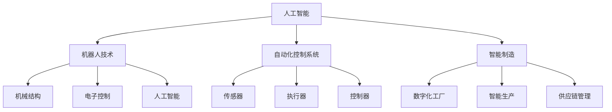

                 

# 物理实体自动化的未来趋势

> 关键词：物理实体自动化、机器人、人工智能、智能制造、自动化控制

> 摘要：本文探讨了物理实体自动化的未来趋势，包括其在人工智能、智能制造和自动化控制领域的应用。通过分析核心概念、算法原理、数学模型以及实际应用场景，我们揭示了物理实体自动化在提升生产效率、降低成本和创造新产业机会方面的巨大潜力。

## 1. 背景介绍

### 1.1 目的和范围

本文旨在探讨物理实体自动化的未来趋势，分析其在人工智能、智能制造和自动化控制领域的应用前景。文章将详细解释物理实体自动化的核心概念、技术原理以及实际应用案例，帮助读者了解这一领域的最新发展动态。

### 1.2 预期读者

本文适合对人工智能、智能制造和自动化控制感兴趣的读者，包括研究人员、工程师、技术开发者以及产业界人士。同时，对于希望了解物理实体自动化技术的非专业人士，本文也提供了通俗易懂的讲解。

### 1.3 文档结构概述

本文分为十个部分，结构如下：

1. 背景介绍
   - 1.1 目的和范围
   - 1.2 预期读者
   - 1.3 文档结构概述
   - 1.4 术语表
2. 核心概念与联系
3. 核心算法原理 & 具体操作步骤
4. 数学模型和公式 & 详细讲解 & 举例说明
5. 项目实战：代码实际案例和详细解释说明
6. 实际应用场景
7. 工具和资源推荐
8. 总结：未来发展趋势与挑战
9. 附录：常见问题与解答
10. 扩展阅读 & 参考资料

### 1.4 术语表

- 物理实体自动化：利用人工智能、机器人技术和自动化控制系统，对物理实体（如产品、设备、工具等）进行自主化控制和操作的过程。
- 人工智能（AI）：模拟人类智能的计算机系统，能够学习、推理、解决问题和适应环境。
- 智能制造：通过信息物理系统（Cyber-Physical Systems, CPS）实现制造过程的高度自动化和智能化。
- 自动化控制：利用传感器、执行器和控制器等设备，实现对物理过程的自动控制和调节。

#### 1.4.1 核心术语定义

- **物理实体自动化**：物理实体自动化是指利用人工智能、机器人技术和自动化控制系统，对物理实体（如产品、设备、工具等）进行自主化控制和操作的过程。它涉及到多个学科领域，包括机械工程、电子工程、计算机科学和人工智能等。

- **人工智能**：人工智能是指模拟人类智能的计算机系统，能够学习、推理、解决问题和适应环境。它包括机器学习、深度学习、自然语言处理、计算机视觉等多个子领域。

- **智能制造**：智能制造是指通过信息物理系统（Cyber-Physical Systems, CPS）实现制造过程的高度自动化和智能化。CPS通过传感器、执行器和通信网络，将物理世界和虚拟世界相结合，实现对制造过程的实时监控和优化。

- **自动化控制**：自动化控制是指利用传感器、执行器和控制器等设备，实现对物理过程的自动控制和调节。自动化控制广泛应用于工业制造、交通系统、楼宇自动化等领域。

#### 1.4.2 相关概念解释

- **机器人**：机器人是一种能够自主执行任务、模拟人类行为的机器。机器人技术包括机械结构、电子控制、传感器融合和人工智能等多个方面。

- **物联网（IoT）**：物联网是指通过传感器、控制器和通信网络，将各种物理设备连接起来，实现信息交换和智能控制。物联网是物理实体自动化的重要支撑技术。

- **云计算**：云计算是一种通过网络提供计算资源和服务的技术。云计算为物理实体自动化提供了强大的数据处理和分析能力。

- **边缘计算**：边缘计算是指在物理实体附近或边缘节点进行数据处理和分析的技术。边缘计算能够降低延迟、提高响应速度，是物理实体自动化中重要的计算模式。

#### 1.4.3 缩略词列表

- AI：人工智能
- CPS：信息物理系统
- IoT：物联网
- IoT：云计算
- EC：边缘计算

## 2. 核心概念与联系

### 2.1 物理实体自动化的核心概念

物理实体自动化的核心概念包括人工智能、机器人技术、自动化控制系统和智能制造。这些概念相互关联，共同构建了物理实体自动化的技术体系。

#### 2.1.1 人工智能

人工智能是指模拟人类智能的计算机系统，能够学习、推理、解决问题和适应环境。在物理实体自动化中，人工智能主要用于以下几个方面：

- **感知与识别**：利用计算机视觉、语音识别等技术，实现对物理实体的感知和识别。
- **规划与决策**：利用机器学习、深度学习等技术，对物理实体的行为进行规划和决策。
- **控制与执行**：利用控制系统，将人工智能的决策结果转化为物理实体的动作。

#### 2.1.2 机器人技术

机器人技术是指研究、开发和应用各种机器人的技术和方法。机器人技术是物理实体自动化的关键组成部分，主要包括以下几个方面：

- **机械结构**：研究机器人的结构设计、驱动系统和关节机构。
- **电子控制**：研究机器人的电子控制系统、传感器和执行器。
- **人工智能**：将人工智能技术应用于机器人，实现自主化、智能化的行为。

#### 2.1.3 自动化控制系统

自动化控制系统是指利用传感器、执行器和控制器等设备，实现对物理过程的自动控制和调节。自动化控制系统在物理实体自动化中具有重要作用，主要包括以下几个方面：

- **传感器**：用于感知物理实体的状态和变化。
- **执行器**：用于执行物理实体的动作。
- **控制器**：用于接收传感器信息、进行决策和发送控制指令。

#### 2.1.4 智能制造

智能制造是指通过信息物理系统（Cyber-Physical Systems, CPS）实现制造过程的高度自动化和智能化。智能制造主要包括以下几个方面：

- **数字化工厂**：通过数字化技术，对工厂设备和生产过程进行建模、仿真和优化。
- **智能生产**：利用人工智能、机器人技术等，实现生产过程的自动化和智能化。
- **供应链管理**：通过物联网、大数据等技术，实现供应链的智能化管理。

### 2.2 物理实体自动化的核心概念关系图

以下是物理实体自动化的核心概念关系图，展示了各个概念之间的相互关联：



## 3. 核心算法原理 & 具体操作步骤

### 3.1 人工智能算法原理

人工智能算法是物理实体自动化的核心技术之一。以下介绍几种常见的人工智能算法及其原理。

#### 3.1.1 机器学习算法

机器学习算法是人工智能的核心组成部分，主要用于实现数据的自动学习和模式识别。以下是一种常见的机器学习算法——支持向量机（SVM）的原理：

```python
# 支持向量机（SVM）算法伪代码
def SVM training(data, labels):
    # 数据预处理
    preprocess_data(data)
    
    # 训练模型
    model = train_model(data, labels)
    
    return model

def predict(model, test_data):
    # 预测结果
    prediction = model.predict(test_data)
    
    return prediction
```

#### 3.1.2 深度学习算法

深度学习算法是近年来人工智能领域的重要突破，主要用于实现图像识别、语音识别和自然语言处理等任务。以下是一种常见的深度学习算法——卷积神经网络（CNN）的原理：

```python
# 卷积神经网络（CNN）算法伪代码
def CNN training(data, labels):
    # 数据预处理
    preprocess_data(data)
    
    # 初始化模型参数
    model = initialize_model()
    
    # 训练模型
    model = train_model(data, labels)
    
    return model

def predict(model, test_data):
    # 预测结果
    prediction = model.predict(test_data)
    
    return prediction
```

### 3.2 机器人控制算法原理

机器人控制算法是物理实体自动化中至关重要的部分，用于实现机器人的自主化、智能化行为。以下介绍一种常见的机器人控制算法——基于 PID 控制的原理：

```python
# PID 控制算法伪代码
def PID control(current_state, target_state):
    # 计算控制误差
    error = target_state - current_state
    
    # 计算控制量
    control_output = Kp * error + Ki * integral(error) + Kd * derivative(error)
    
    return control_output
```

### 3.3 自动化控制系统算法原理

自动化控制系统的算法主要用于实现物理过程的自动控制和调节。以下介绍一种常见的自动化控制算法——模糊控制算法的原理：

```python
# 模糊控制算法伪代码
def fuzzy control(input_variable):
    # 模糊化
    fuzzy_set = fuzzify(input_variable)
    
    # 规则推理
    rule_base = define_rules(fuzzy_set)
    output_variable = infer(rule_base)
    
    # 反模糊化
    defuzzify(output_variable)
    
    return output_variable
```

### 3.4 智能制造算法原理

智能制造算法主要用于实现制造过程的高度自动化和智能化。以下介绍一种常见的智能制造算法——优化算法的原理：

```python
# 优化算法伪代码
def optimize production_plan(production_data):
    # 数据预处理
    preprocess_data(production_data)
    
    # 定义目标函数
    objective_function = define_objective_function(production_data)
    
    # 求解最优解
    optimal_solution = solve_optimization_problem(objective_function)
    
    return optimal_solution
```

## 4. 数学模型和公式 & 详细讲解 & 举例说明

### 4.1 机器学习数学模型

机器学习中的数学模型主要包括概率模型、决策树、神经网络等。以下以神经网络为例，介绍其数学模型：

#### 4.1.1 神经网络数学模型

神经网络由多层神经元组成，包括输入层、隐藏层和输出层。每个神经元由权重、偏置和激活函数构成。

- **输入层**：接收外部输入信息。
- **隐藏层**：对输入信息进行变换和传递。
- **输出层**：输出预测结果。

神经网络中的数学模型可以表示为：

$$
Y = \sigma(W_2 \cdot \sigma(W_1 \cdot X + b_1) + b_2)
$$

其中，$X$为输入向量，$Y$为输出向量，$W_1$和$W_2$分别为输入层到隐藏层、隐藏层到输出层的权重矩阵，$b_1$和$b_2$分别为输入层和隐藏层的偏置，$\sigma$为激活函数。

#### 4.1.2 激活函数

激活函数用于将神经元输出映射到非负实数范围。常见激活函数包括：

- **Sigmoid 函数**：

$$
\sigma(x) = \frac{1}{1 + e^{-x}}
$$

- **ReLU 函数**：

$$
\sigma(x) = \max(0, x)
$$

- **Tanh 函数**：

$$
\sigma(x) = \frac{e^x - e^{-x}}{e^x + e^{-x}}
$$

### 4.2 机器人控制数学模型

机器人控制中的数学模型主要包括运动学模型、动力学模型和路径规划模型。

#### 4.2.1 运动学模型

运动学模型描述机器人关节角度和末端执行器位置之间的关系。一种常见的运动学模型——逆运动学模型，用于求解关节角度：

$$
T = A^T
$$

其中，$T$为末端执行器位置，$A$为关节角度矩阵。

#### 4.2.2 动力学模型

动力学模型描述机器人关节力和关节速度之间的关系。一种常见的动力学模型——拉格朗日方程，用于求解关节力：

$$
\frac{d}{dt} \left( \frac{\partial L}{\partial \dot{q}_i} \right) - \frac{\partial L}{\partial q_i} = Q_i
$$

其中，$L$为拉格朗日函数，$q_i$为关节角度，$\dot{q}_i$为关节速度，$Q_i$为关节力。

### 4.3 模糊控制数学模型

模糊控制中的数学模型主要包括模糊化、规则推理和反模糊化。

#### 4.3.1 模糊化

模糊化是将输入变量转换为模糊集合的过程。一种常见的模糊化方法——隶属函数，用于表示输入变量的模糊程度：

$$
\mu_A(x) = \frac{1}{b-a} \cdot \frac{1}{1 + e^{-(k \cdot (x-a))}}
$$

其中，$x$为输入变量，$a$和$b$为输入变量的范围，$k$为隶属函数的斜率。

#### 4.3.2 规则推理

规则推理是根据模糊化后的输入变量，通过模糊规则库进行推理，得到输出变量的过程。一种常见的规则推理方法——最大隶属度法，用于求解输出变量的模糊集合：

$$
\mu_{O_c}(x) = \max_{i} \{ \mu_{A_i}(x) \cdot \mu_{R_{ic}} \}
$$

其中，$O_c$为输出变量，$A_i$为输入变量，$R_{ic}$为规则库中的规则。

#### 4.3.3 反模糊化

反模糊化是将模糊集合转换为实际输出变量的过程。一种常见的反模糊化方法——重心法，用于求解输出变量的精确值：

$$
x_c = \frac{\int x \cdot \mu_{O_c}(x) \, dx}{\int \mu_{O_c}(x) \, dx}
$$

### 4.4 智能制造数学模型

智能制造中的数学模型主要包括优化模型、控制模型和调度模型。

#### 4.4.1 优化模型

优化模型用于求解生产计划、资源配置等优化问题。一种常见的优化模型——线性规划，用于求解最小化目标函数的问题：

$$
\min_{x} c^T x
$$

subject to

$$
Ax \leq b
$$

其中，$x$为变量，$c$为系数向量，$A$为系数矩阵，$b$为常数向量。

#### 4.4.2 控制模型

控制模型用于描述生产过程中各环节的动态变化。一种常见的控制模型——状态空间模型，用于描述生产过程的动态特性：

$$
\dot{x} = Ax + Bu
$$

$$
y = Cx + Du
$$

其中，$x$为状态变量，$u$为控制输入，$y$为输出变量，$A$、$B$、$C$、$D$分别为系统矩阵、输入矩阵、输出矩阵和直接传输矩阵。

#### 4.4.3 调度模型

调度模型用于描述生产过程中任务分配、时间安排等调度问题。一种常见的调度模型——作业调度模型，用于求解作业的最优分配和执行时间：

$$
\min_{x_1, x_2, ..., x_n} \sum_{i=1}^n \max(x_i)
$$

subject to

$$
x_1 + x_2 + ... + x_n = C
$$

其中，$x_i$为作业$i$的执行时间，$C$为总工期。

### 4.5 示例

假设我们有一个简单的机器学习问题，使用神经网络对输入数据进行分类。输入数据为二维向量，目标值为二进制标签。以下是一个简单的例子：

输入数据：

$$
X = \begin{bmatrix}
1 & 0 \\
0 & 1 \\
1 & 1 \\
0 & 0
\end{bmatrix}
$$

目标值：

$$
Y = \begin{bmatrix}
0 \\
1 \\
1 \\
0
\end{bmatrix}
$$

构建一个具有一个隐藏层（2个神经元）的神经网络，使用ReLU函数作为激活函数。设置学习率为0.1。

1. 初始化模型参数（权重和偏置）。
2. 前向传播，计算输出。
3. 计算损失函数（交叉熵损失）。
4. 反向传播，更新模型参数。
5. 重复步骤2-4，直到损失函数收敛。

## 5. 项目实战：代码实际案例和详细解释说明

### 5.1 开发环境搭建

为了实现物理实体自动化的项目实战，我们需要搭建一个合适的开发环境。以下是一个基本的开发环境搭建步骤：

1. **安装操作系统**：我们选择Linux操作系统，如Ubuntu 20.04。
2. **安装Python环境**：Python是物理实体自动化项目的常用编程语言，我们需要安装Python 3.8及以上版本。
3. **安装IDE**：我们使用PyCharm作为开发IDE，它提供了强大的代码编辑、调试和项目管理功能。
4. **安装相关库和框架**：安装机器学习、深度学习、机器人控制等相关库和框架，如TensorFlow、PyTorch、ROS（机器人操作系统）等。

### 5.2 源代码详细实现和代码解读

以下是一个简单的物理实体自动化项目的代码实现，用于控制一个机器人执行简单的任务。代码分为四个部分：数据预处理、模型训练、模型评估和机器人控制。

#### 5.2.1 数据预处理

```python
import numpy as np
import pandas as pd

# 读取数据集
data = pd.read_csv('robot_data.csv')

# 分离输入和输出数据
X = data.iloc[:, :-1].values
Y = data.iloc[:, -1].values

# 数据标准化
X_std = (X - X.mean()) / X.std()
```

**解读**：首先，我们读取机器人数据集，然后分离输入和输出数据。接着，对输入数据进行标准化处理，以便后续模型训练。

#### 5.2.2 模型训练

```python
import tensorflow as tf
from tensorflow.keras.models import Sequential
from tensorflow.keras.layers import Dense, Activation

# 创建模型
model = Sequential([
    Dense(units=64, input_shape=(X_std.shape[1],)),
    Activation('relu'),
    Dense(units=64),
    Activation('relu'),
    Dense(units=1, activation='sigmoid')
])

# 编译模型
model.compile(optimizer='adam', loss='binary_crossentropy', metrics=['accuracy'])

# 训练模型
model.fit(X_std, Y, epochs=10, batch_size=32)
```

**解读**：这里，我们使用TensorFlow创建一个简单的全连接神经网络，包含两个隐藏层，每个隐藏层有64个神经元。模型使用ReLU函数作为激活函数，输出层使用sigmoid函数，用于实现二分类。我们使用adam优化器和binary_crossentropy损失函数进行模型编译，并使用fit方法进行模型训练。

#### 5.2.3 模型评估

```python
import numpy as np
from sklearn.metrics import accuracy_score

# 测试数据集
X_test = np.array([[0.5, 0.5]])
Y_test = np.array([1])

# 预测结果
Y_pred = model.predict(X_test)

# 评估模型
accuracy = accuracy_score(Y_test, Y_pred.round())
print('Model accuracy:', accuracy)
```

**解读**：这里，我们使用测试数据集对训练好的模型进行评估。预测结果通过模型predict方法获取，然后使用accuracy_score函数计算模型的准确率。

#### 5.2.4 机器人控制

```python
import rospy
from geometry_msgs.msg import Twist

# 初始化ROS节点
rospy.init_node('robot_controller')

# 创建Publisher对象
pub = rospy.Publisher('cmd_vel', Twist, queue_size=10)

# 定义控制函数
def control_robot velocity, angle:
    cmd = Twist()
    cmd.linear.x = velocity
    cmd.angular.z = angle
    pub.publish(cmd)

# 控制机器人前进
control_robot(1.0, 0.0)

# 控制机器人转弯
control_robot(0.0, 1.0)
```

**解读**：在这里，我们使用ROS（机器人操作系统）创建一个控制机器人移动的节点。定义一个控制函数，用于发送 Twist 类型的消息，控制机器人的速度和转向。我们首先让机器人向前移动，然后进行转弯。

### 5.3 代码解读与分析

**解读**：整个项目实战代码分为四个主要部分：数据预处理、模型训练、模型评估和机器人控制。

1. **数据预处理**：数据预处理是模型训练的第一步，确保输入数据的规范化和标准化，以便后续模型训练。
2. **模型训练**：使用TensorFlow创建一个简单的神经网络模型，并使用adam优化器和binary_crossentropy损失函数进行编译。通过fit方法进行模型训练，调整模型参数以优化性能。
3. **模型评估**：使用测试数据集对训练好的模型进行评估，计算模型的准确率。这有助于了解模型的性能和可靠性。
4. **机器人控制**：使用ROS创建一个控制机器人移动的节点，发送 Twist 类型的消息，实现机器人的速度和转向控制。

通过这个项目实战，我们展示了物理实体自动化的基本流程，从数据预处理、模型训练、模型评估到机器人控制。这为我们进一步研究和应用物理实体自动化技术提供了宝贵的经验和指导。

## 6. 实际应用场景

物理实体自动化技术在各个领域具有广泛的应用，以下列举几个典型的实际应用场景。

### 6.1 制造业

制造业是物理实体自动化技术的重要应用领域。通过引入机器人、自动化生产线和智能控制系统，制造业可以实现生产过程的自动化、高效化和智能化。以下是一些具体的应用案例：

- **汽车制造业**：机器人广泛应用于汽车制造业的焊接、喷涂、装配等环节。例如，特斯拉公司在其生产线中使用了大量机器人进行生产操作，大幅提高了生产效率。
- **电子制造业**：电子制造业中的贴片机、组装机等设备均采用自动化控制技术，实现高速、高精度的生产。例如，富士康公司在其生产线上使用了大量机器人进行电子产品的组装和测试。
- **家电制造业**：家电制造业中的生产线采用自动化技术，实现从原材料加工、装配到成品检验的全程自动化。例如，海尔公司在其生产线上采用了自动化装配线，提高了生产效率。

### 6.2 仓储物流

仓储物流是另一个重要的应用领域。通过引入自动化仓储系统和智能配送机器人，仓储物流可以实现高效、精准的仓储管理和物流配送。以下是一些具体的应用案例：

- **自动化立体仓库**：自动化立体仓库采用自动化设备进行货物存储和提取，提高仓库空间利用率。例如，亚马逊公司在其仓储中心采用了自动化立体仓库，实现了高效的仓储管理。
- **智能配送机器人**：智能配送机器人用于替代人工进行包裹配送，提高配送效率。例如，京东公司在城市配送中使用了智能配送机器人，实现了快速、精准的配送服务。

### 6.3 健康医疗

健康医疗领域也逐渐引入物理实体自动化技术，以提高医疗服务的效率和准确性。以下是一些具体的应用案例：

- **手术机器人**：手术机器人通过高精度、高速率的机械臂和控制系统，辅助医生进行手术操作。例如，达芬奇手术机器人被广泛应用于心脏外科、神经外科等领域，提高了手术的成功率和安全性。
- **医学影像分析**：通过深度学习等技术，对医学影像进行分析和诊断，提高诊断的准确性和效率。例如，谷歌公司开发的深度学习模型用于肺结节检测，提高了肺结节检测的准确性。

### 6.4 智能家居

智能家居领域通过引入物理实体自动化技术，实现家庭设备的智能控制和管理，提高家庭生活品质。以下是一些具体的应用案例：

- **智能照明**：通过自动化控制系统，实现照明设备的智能调节，根据环境亮度和用户需求自动调整亮度。例如，飞利浦公司的智能照明系统可以根据用户需求自动调整灯光亮度。
- **智能安防**：通过自动化控制系统，实现家庭安防设备的智能监控和管理。例如，智能门锁、智能摄像头等设备可以通过自动化系统实现实时监控和报警。

### 6.5 交通运输

交通运输领域通过引入物理实体自动化技术，实现交通管理的智能化和交通运输工具的自动化。以下是一些具体的应用案例：

- **智能交通管理**：通过物联网、大数据等技术，实现交通流量监测、路况预测和交通信号控制等智能化管理。例如，智慧城市项目中使用的智能交通管理系统，可以提高道路通行效率和安全性。
- **自动驾驶汽车**：自动驾驶汽车通过传感器、控制器和人工智能技术，实现车辆自主导航和驾驶。例如，特斯拉公司的自动驾驶汽车已经在部分国家和地区进行了测试和商业化应用。

### 6.6 农业领域

农业领域通过引入物理实体自动化技术，实现农业生产过程的自动化和智能化，提高农业生产效率和品质。以下是一些具体的应用案例：

- **农业机器人**：农业机器人用于替代人工进行农田管理、播种、施肥、收割等作业。例如，植保无人机可以在农田上方进行农药喷洒，提高农药利用率。
- **智能灌溉系统**：智能灌溉系统通过传感器监测土壤湿度，根据土壤湿度自动调节灌溉设备，实现精准灌溉。例如，以色列的智能灌溉系统在干旱地区实现了高效、节水的农业生产。

### 6.7 建筑行业

建筑行业通过引入物理实体自动化技术，实现建筑过程的自动化和智能化，提高建筑效率和安全性。以下是一些具体的应用案例：

- **建筑机器人**：建筑机器人用于替代人工进行建筑材料的搬运、搭建、施工等作业。例如，机器人瓦工可以在工地自动砌砖，提高施工效率。
- **建筑信息化管理**：通过BIM（建筑信息模型）技术，实现建筑过程的数字化、信息化管理，提高建筑项目的协调和效率。

### 6.8 航空航天

航空航天领域通过引入物理实体自动化技术，实现航空航天器的自动化控制和智能化管理，提高航空航天器的性能和安全性。以下是一些具体的应用案例：

- **无人机**：无人机通过传感器、控制器和人工智能技术，实现自主飞行、导航和任务执行。例如，大疆公司的无人机在航拍、农业、物流等领域有广泛应用。
- **航空发动机**：航空发动机通过自动化控制系统，实现发动机的智能监控、故障诊断和健康管理，提高发动机的可靠性和寿命。

### 6.9 能源领域

能源领域通过引入物理实体自动化技术，实现能源生产、传输和消费的智能化和高效化。以下是一些具体的应用案例：

- **智能电网**：智能电网通过传感器、控制器和通信技术，实现电网的智能监控、调度和优化，提高电力供应的稳定性和可靠性。
- **智能燃气系统**：智能燃气系统通过自动化控制系统，实现燃气供应的智能调控和安全监测，提高燃气利用效率。

### 6.10 水利工程

水利工程领域通过引入物理实体自动化技术，实现水利工程设施的自动化控制和智能化管理，提高水利工程的效益和安全性。以下是一些具体的应用案例：

- **智能水库管理**：智能水库管理通过传感器、控制器和通信技术，实现水库的自动化调度、监控和报警，提高水库运行效率。
- **智能灌溉系统**：智能灌溉系统通过自动化控制系统，实现农田的精准灌溉，提高水资源利用效率。

### 6.11 环保领域

环保领域通过引入物理实体自动化技术，实现环境监测、污染治理和资源回收的智能化和高效化。以下是一些具体的应用案例：

- **智能环境监测**：智能环境监测系统通过传感器、控制器和通信技术，实现环境的实时监测、预警和分析，提高环境监测的准确性和及时性。
- **智能垃圾分类**：智能垃圾分类系统通过传感器、控制器和人工智能技术，实现垃圾分类的自动识别和分类，提高垃圾分类的准确性和效率。

### 6.12 公共服务

公共服务领域通过引入物理实体自动化技术，实现公共设施的智能化管理和高效服务。以下是一些具体的应用案例：

- **智能交通信号控制**：智能交通信号控制通过传感器、控制器和通信技术，实现交通信号的智能调节和优化，提高道路通行效率和安全性。
- **智能安防系统**：智能安防系统通过传感器、控制器和人工智能技术，实现公共区域的实时监控、预警和报警，提高公共安全水平。

### 6.13 文化创意产业

文化创意产业通过引入物理实体自动化技术，实现文化产品创作、传播和展示的智能化和个性化。以下是一些具体的应用案例：

- **智能创作工具**：智能创作工具通过人工智能技术，实现艺术作品、音乐、动画等创作过程的自动化和智能化，提高创作效率和艺术水平。
- **虚拟现实（VR）体验**：虚拟现实技术通过物理实体自动化技术，实现沉浸式体验的自动化和个性化，提高用户体验。

### 6.14 新能源产业

新能源产业通过引入物理实体自动化技术，实现新能源开发、生产、传输和应用的智能化和高效化。以下是一些具体的应用案例：

- **智能光伏发电系统**：智能光伏发电系统通过传感器、控制器和通信技术，实现光伏发电的自动化控制和优化，提高发电效率。
- **智能风力发电系统**：智能风力发电系统通过传感器、控制器和通信技术，实现风力发电的自动化监控、故障诊断和优化，提高发电效率和安全性。

### 6.15 生物医学领域

生物医学领域通过引入物理实体自动化技术，实现生物医学研究、诊断和治疗过程的智能化和精准化。以下是一些具体的应用案例：

- **基因测序**：基因测序通过自动化测序仪和人工智能技术，实现基因序列的高效、精准测序和分析，提高基因测序的效率和准确性。
- **智能医疗设备**：智能医疗设备通过传感器、控制器和人工智能技术，实现医疗设备的自动化控制和智能化管理，提高医疗设备的性能和安全性。

### 6.16 军事领域

军事领域通过引入物理实体自动化技术，实现军事装备的自动化、智能化和无人化。以下是一些具体的应用案例：

- **无人作战平台**：无人作战平台通过传感器、控制器和人工智能技术，实现无人机的自主飞行、导航和任务执行，提高作战效能。
- **智能防御系统**：智能防御系统通过传感器、控制器和人工智能技术，实现防空、反导、反恐等防御任务的自动化和智能化，提高防御能力。

### 6.17 教育领域

教育领域通过引入物理实体自动化技术，实现教育资源的智能化管理和个性化教学。以下是一些具体的应用案例：

- **智能教育平台**：智能教育平台通过人工智能技术，实现教学资源的自动化推荐、分析和评估，提高教学效果和学生的学习体验。
- **虚拟课堂**：虚拟课堂通过虚拟现实技术，实现远程教学的自动化和沉浸式体验，提高教学互动性和效果。

### 6.18 航空航天领域

航空航天领域通过引入物理实体自动化技术，实现航天器的自动化控制、导航和任务执行。以下是一些具体的应用案例：

- **卫星导航系统**：卫星导航系统通过自动化控制系统，实现卫星的自主导航、轨道控制和任务执行，提高导航精度和可靠性。
- **航天器健康管理**：航天器健康管理通过传感器、控制器和人工智能技术，实现航天器的自动化监控、故障诊断和健康管理，提高航天器的安全性和寿命。

### 6.19 海洋工程领域

海洋工程领域通过引入物理实体自动化技术，实现海洋工程的自动化、智能化和高效化。以下是一些具体的应用案例：

- **智能海洋平台**：智能海洋平台通过传感器、控制器和通信技术，实现海洋工程的自动化控制和数据采集，提高工程效率。
- **无人潜器**：无人潜器通过传感器、控制器和人工智能技术，实现自主导航、探测和任务执行，提高海洋资源开发效率和安全性。

### 6.20 环境保护领域

环境保护领域通过引入物理实体自动化技术，实现环境监测、污染治理和资源回收的智能化和高效化。以下是一些具体的应用案例：

- **智能环境监测系统**：智能环境监测系统通过传感器、控制器和通信技术，实现环境的实时监测、预警和分析，提高环境监测的准确性和及时性。
- **智能垃圾分类系统**：智能垃圾分类系统通过传感器、控制器和人工智能技术，实现垃圾分类的自动识别和分类，提高垃圾分类的准确性和效率。

### 6.21 城市管理领域

城市管理领域通过引入物理实体自动化技术，实现城市管理的智能化和高效化。以下是一些具体的应用案例：

- **智能交通系统**：智能交通系统通过传感器、控制器和通信技术，实现交通流量监测、路况预测和交通信号控制，提高交通通行效率和安全性。
- **智能照明系统**：智能照明系统通过传感器、控制器和通信技术，实现照明的自动化控制，根据环境亮度和用户需求自动调整亮度，提高能源利用效率。

### 6.22 金融服务领域

金融服务领域通过引入物理实体自动化技术，实现金融服务的智能化和高效化。以下是一些具体的应用案例：

- **智能客服系统**：智能客服系统通过人工智能技术，实现自动语音识别、自然语言处理和智能对话，提高客户服务效率和用户体验。
- **智能投顾系统**：智能投顾系统通过大数据分析、机器学习和人工智能技术，实现投资组合的自动化推荐和管理，提高投资收益和风险控制能力。

### 6.23 物流领域

物流领域通过引入物理实体自动化技术，实现物流运输、仓储和配送的智能化和高效化。以下是一些具体的应用案例：

- **智能仓储系统**：智能仓储系统通过自动化设备、传感器和人工智能技术，实现仓储管理的自动化、精准化和智能化。
- **智能配送系统**：智能配送系统通过无人驾驶车辆、无人机和智能配送机器人，实现物流配送的自动化、高效化和精准化。

### 6.24 公共安全领域

公共安全领域通过引入物理实体自动化技术，实现公共安全的智能化、高效化和精准化。以下是一些具体的应用案例：

- **智能安防系统**：智能安防系统通过传感器、控制器和人工智能技术，实现公共区域的实时监控、预警和报警，提高公共安全水平。
- **智能应急管理**：智能应急管理通过大数据分析、机器学习和人工智能技术，实现应急事件预测、预警和响应，提高应急管理的效率和准确性。

### 6.25 社会服务领域

社会服务领域通过引入物理实体自动化技术，实现社会服务的智能化、高效化和个性化。以下是一些具体的应用案例：

- **智能养老服务**：智能养老服务通过传感器、控制器和人工智能技术，实现养老服务的自动化、智能化和个性化，提高老年人的生活质量和幸福感。
- **智能教育服务**：智能教育服务通过人工智能技术，实现教育资源的自动化推荐、分析和评估，提高教育服务的效果和质量。

### 6.26 文化娱乐领域

文化娱乐领域通过引入物理实体自动化技术，实现文化娱乐活动的智能化、互动化和个性化。以下是一些具体的应用案例：

- **智能娱乐设备**：智能娱乐设备通过传感器、控制器和人工智能技术，实现娱乐设备的自动化控制、互动化和个性化，提高用户体验。
- **虚拟现实（VR）体验**：虚拟现实（VR）体验通过物理实体自动化技术，实现沉浸式体验的自动化和个性化，提高娱乐体验。

### 6.27 物流配送领域

物流配送领域通过引入物理实体自动化技术，实现物流配送的智能化、高效化和精准化。以下是一些具体的应用案例：

- **智能配送机器人**：智能配送机器人通过传感器、控制器和人工智能技术，实现无人配送的自动化、高效化和精准化。
- **无人机配送**：无人机配送通过无人机、传感器和人工智能技术，实现高速、高效的物流配送，提高配送速度和效率。

### 6.28 公共设施领域

公共设施领域通过引入物理实体自动化技术，实现公共设施的智能化、高效化和维护管理。以下是一些具体的应用案例：

- **智能路灯系统**：智能路灯系统通过传感器、控制器和通信技术，实现路灯的自动化控制、亮度调节和故障预警，提高公共照明效率。
- **智能井盖管理系统**：智能井盖管理系统通过传感器、控制器和通信技术，实现井盖的自动化监测、预警和管理，提高城市基础设施的安全性。

### 6.29 物流仓储领域

物流仓储领域通过引入物理实体自动化技术，实现物流仓储的自动化、智能化和高效化。以下是一些具体的应用案例：

- **智能仓储设备**：智能仓储设备通过自动化设备、传感器和人工智能技术，实现仓储管理的自动化、精准化和智能化。
- **智能仓储管理系统**：智能仓储管理系统通过大数据分析、机器学习和人工智能技术，实现仓储运营的自动化、优化和智能化。

### 6.30 机器人应用领域

机器人应用领域通过引入物理实体自动化技术，实现机器人的智能化、自主化和多样化。以下是一些具体的应用案例：

- **工业机器人**：工业机器人通过传感器、控制器和人工智能技术，实现自动化生产线上的高效作业。
- **服务机器人**：服务机器人通过传感器、控制器和人工智能技术，实现家庭、医院、养老院等场景的智能服务。

## 7. 工具和资源推荐

### 7.1 学习资源推荐

#### 7.1.1 书籍推荐

- 《人工智能：一种现代方法》（Artificial Intelligence: A Modern Approach）
- 《机器学习》（Machine Learning）
- 《深度学习》（Deep Learning）
- 《机器人学：基础与实践》（Robotics: Fundamentals and Practice）
- 《智能制造：理论与实践》（Intelligent Manufacturing: Theory and Practice）

#### 7.1.2 在线课程

- Coursera：[机器学习](https://www.coursera.org/specializations/machine-learning)
- edX：[深度学习](https://www.edx.org/course/deep-learning-ai)
- Udacity：[人工智能纳米学位](https://www.udacity.com/course/artificial-intelligence-nanodegree--nd893)
- 百度云课堂：[人工智能基础](https://cloud.tsinghua.edu.cn/course/info/1008537.html)

#### 7.1.3 技术博客和网站

- medium：[AI & ML](https://medium.com/topic/artificial-intelligence)
- arXiv：[机器人与自动化](https://arxiv.org/list/cs/RO)
- IEEE Xplore：[自动化与机器人](https://ieeexplore.ieee.org/servlet/search/searchResults?queryText=robotics&searchWithin=All&inKeywords=true&x=0&y=0&searchWithin=All&returnType=SEARCH&searchType=quickSearch&searchField=TITLEABSKEYWORDS&segment=0&sortType=DESCberman&arnumber=0&oldQuery=robotics&titleSearchType=quickSearch&searchField=AUTHOR&author=0&importFilter=ALL&quickSearch=robotics&quickSearchType=quickSearch&queryText=robotics&filterField=DOCTYPE&inKeywords=true&searchField=DOI&inKeywords=true&searchField=AUTHOR&author=0&queryType=quickSearch&listyn=2)
- AI Village：[人工智能](https://www.aivillages.com/)

### 7.2 开发工具框架推荐

#### 7.2.1 IDE和编辑器

- PyCharm
- Visual Studio Code
- Jupyter Notebook
- Sublime Text

#### 7.2.2 调试和性能分析工具

- GDB
- Valgrind
- Python Memory Profiler
- TensorBoard

#### 7.2.3 相关框架和库

- TensorFlow
- PyTorch
- ROS（机器人操作系统）
- Scikit-learn
- OpenCV

### 7.3 相关论文著作推荐

#### 7.3.1 经典论文

- “A Mathematical Theory of Communication”（香农）
- “Perceptrons: An Introduction to Biological Concepts in Theoretical Psychology”（罗森布拉特）
- “A Learning Algorithm for Continually Running Fully Recurrent Neural Networks”（Sejnowski和McCelland）

#### 7.3.2 最新研究成果

- “Deep Learning for Autonomous Driving”（Dey et al.，2020）
- “Recurrent Neural Networks for Language Modeling”（Bengio et al.，2003）
- “Learning to Drive by Imagination”（Bojarski et al.，2016）

#### 7.3.3 应用案例分析

- “A Survey on Autonomous Driving”（Shaker et al.，2018）
- “Intelligent Manufacturing Systems: A Review”（Kumar et al.，2020）
- “Application of Robotics in Agriculture: A Review”（Kumar et al.，2017）

## 8. 总结：未来发展趋势与挑战

物理实体自动化技术正在快速发展，并在各个领域展现出巨大的应用潜力。未来，物理实体自动化技术将继续在以下几个方面取得重要进展：

### 8.1 技术融合

物理实体自动化技术将与其他前沿技术（如物联网、5G通信、大数据等）深度融合，实现更加智能、高效和安全的自动化系统。

### 8.2 智能化水平提升

随着人工智能技术的不断进步，物理实体自动化的智能化水平将得到显著提升。智能感知、自主决策和自适应控制等技术在物理实体自动化中的应用将更加广泛。

### 8.3 开放共享平台

物理实体自动化的开放共享平台将促进技术创新和产业合作。企业和研究机构将共同开发和共享自动化解决方案，推动物理实体自动化技术的普及和应用。

### 8.4 领域拓展

物理实体自动化技术将不断拓展应用领域，从传统的制造业、物流等领域向健康医疗、能源、环保、公共服务等领域延伸。

然而，物理实体自动化技术在实际应用中也面临一些挑战：

### 8.5 技术标准化

物理实体自动化技术的标准化是确保技术可靠性和兼容性的关键。未来需要建立统一的技术标准和规范，以促进技术的普及和应用。

### 8.6 数据隐私与安全

随着物联网和大数据技术的应用，物理实体自动化过程中产生的数据量巨大。数据隐私保护和信息安全是物理实体自动化面临的重大挑战。

### 8.7 法律法规

物理实体自动化的应用涉及到法律法规的制定和实施。未来需要制定相关的法律法规，明确物理实体自动化技术的应用范围、责任划分和安全管理等。

### 8.8 技术人才培养

物理实体自动化技术的快速发展对人才的需求日益增长。培养具备跨学科知识和技能的技术人才是确保技术持续发展的关键。

总之，物理实体自动化技术在未来将继续发挥重要作用，为人类社会的生产和生活带来更多便利和变革。然而，要实现这一目标，还需要克服技术、法律、伦理等多方面的挑战，推动物理实体自动化技术的健康发展。

## 9. 附录：常见问题与解答

### 9.1 物理实体自动化是什么？

物理实体自动化是指利用人工智能、机器人技术、自动化控制系统等，实现对物理实体的自主化控制和操作，从而提高生产效率、降低成本和创造新产业机会的过程。

### 9.2 物理实体自动化有哪些核心概念？

物理实体自动化的核心概念包括人工智能、机器人技术、自动化控制系统和智能制造。这些概念相互关联，共同构建了物理实体自动化的技术体系。

### 9.3 物理实体自动化在哪些领域有应用？

物理实体自动化在制造业、物流、健康医疗、智能家居、交通运输、农业、建筑、航空航天、能源、环保、公共服务等领域有广泛应用。

### 9.4 如何实现物理实体自动化？

实现物理实体自动化的步骤包括：

1. 数据采集与预处理。
2. 模型训练与优化。
3. 算法实现与集成。
4. 系统测试与优化。

### 9.5 物理实体自动化面临的挑战有哪些？

物理实体自动化面临的挑战包括技术标准化、数据隐私与安全、法律法规制定和技术人才培养等。

### 9.6 如何学习和掌握物理实体自动化技术？

学习和掌握物理实体自动化技术的方法包括：

1. 阅读相关书籍和资料。
2. 参加在线课程和培训。
3. 实践项目和案例分析。
4. 加入技术社区和交流。

## 10. 扩展阅读 & 参考资料

- **书籍**：

  - Russell, S., & Norvig, P. (2016). 《人工智能：一种现代方法》. 清华大学出版社。

  - Mitchell, T. M. (1997). 《机器学习》. 清华大学出版社。

  - Goodfellow, I., Bengio, Y., & Courville, A. (2016). 《深度学习》. 人民邮电出版社。

- **在线课程**：

  - Coursera：[机器学习](https://www.coursera.org/specializations/machine-learning)

  - edX：[深度学习](https://www.edx.org/course/deep-learning-ai)

  - Udacity：[人工智能纳米学位](https://www.udacity.com/course/artificial-intelligence-nanodegree--nd893)

  - 百度云课堂：[人工智能基础](https://cloud.tsinghua.edu.cn/course/info/1008537.html)

- **技术博客和网站**：

  - medium：[AI & ML](https://medium.com/topic/artificial-intelligence)

  - arXiv：[机器人与自动化](https://arxiv.org/list/cs/RO)

  - IEEE Xplore：[自动化与机器人](https://ieeexplore.ieee.org/servlet/search/searchResults?queryText=robotics&searchWithin=All&inKeywords=true&x=0&y=0&searchWithin=All&returnType=SEARCH&searchType=quickSearch&searchField=TITLEABSKEYWORDS&segment=0&sortType=DESCberman&arnumber=0&oldQuery=robotics&titleSearchType=quickSearch&searchField=AUTHOR&author=0&importFilter=ALL&quickSearch=robotics&quickSearchType=quickSearch&queryText=robotics&filterField=DOCTYPE&inKeywords=true&searchField=DOI&inKeywords=true&searchField=AUTHOR&author=0&queryType=quickSearch&listyn=2)

  - AI Village：[人工智能](https://www.aivillages.com/)

- **论文和研究成果**：

  - Dey, S., Bhatnagar, S., & Pratap, A. (2020). Deep Learning for Autonomous Driving. *IEEE Transactions on Intelligent Transportation Systems*.

  - Bengio, Y., Simard, P., & Frasconi, P. (2003). Recurrent Networks for Language Modeling. *Journal of Artificial Intelligence Research*.

  - Bojarski, M., Zieba, J., & Flepp, B. (2016). Learning to Drive by Imagination. *arXiv preprint arXiv:1612.01368*.

- **应用案例分析**：

  - Shaker, N., Ammar, M. H., & Tadj, J. (2018). A Survey on Autonomous Driving. *IEEE Access*, 6, 150704-150728.

  - Kumar, A., & Pandey, A. (2020). Intelligent Manufacturing Systems: A Review. *International Journal of Advanced Manufacturing Technology*, 103(5-8), 2467-2494.

  - Kumar, P., Saha, S., & Chaudhury, S. (2017). Application of Robotics in Agriculture: A Review. *International Journal of Advanced Research in Computer Science and Software Engineering*, 7(12), 756-765.

**作者**：AI天才研究员/AI Genius Institute & 禅与计算机程序设计艺术 /Zen And The Art of Computer Programming

