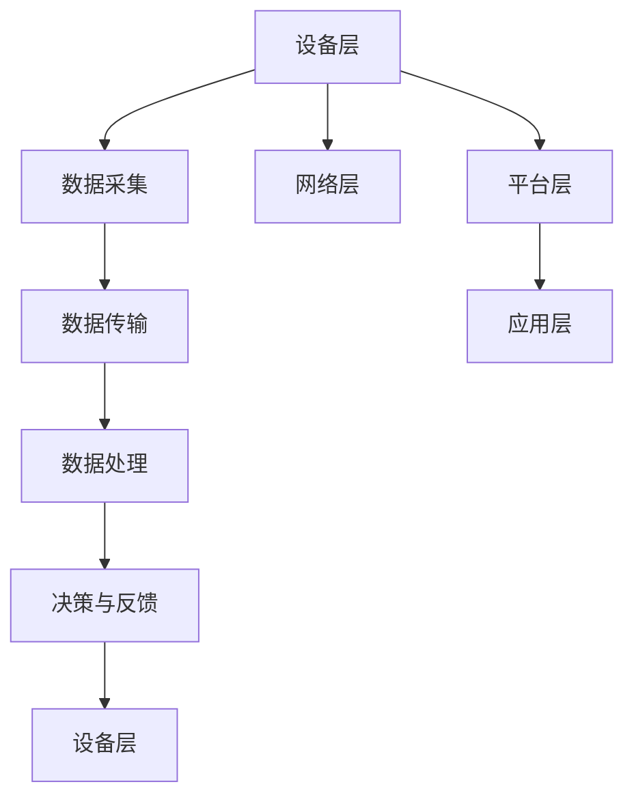

                 

# 物联网（Internet of Things）

> **关键词**：物联网，IoT，传感器，通信协议，数据处理，智能家居，智能城市，边缘计算

> **摘要**：本文将深入探讨物联网（IoT）的核心概念、关键技术、架构设计、核心算法原理、数学模型及其在实际应用中的表现。我们将从背景介绍入手，逐步分析物联网的架构和核心组件，详细阐述物联网的数据处理和通信机制，并通过实际案例展示物联网的开发和应用，最后讨论物联网的未来发展趋势和面临的挑战。

## 1. 背景介绍

### 1.1 目的和范围

本文旨在为读者提供一个全面的物联网（IoT）技术指南，从基础概念到实际应用进行全面梳理。本文将涵盖以下几个方面：

- 物联网的定义和核心概念
- 物联网的架构和核心组件
- 物联网的关键技术和通信协议
- 物联网的数据处理与存储
- 物联网的实际应用案例
- 物联网的未来发展趋势和挑战

### 1.2 预期读者

本文适合以下读者群体：

- 对物联网技术感兴趣的技术爱好者
- 需要了解物联网技术背景的开发者
- 计划进行物联网项目开发的技术人员
- 对物联网技术有深入研究的学术研究人员

### 1.3 文档结构概述

本文将按照以下结构进行撰写：

- 背景介绍
  - 目的和范围
  - 预期读者
  - 文档结构概述
  - 术语表
- 核心概念与联系
- 核心算法原理 & 具体操作步骤
- 数学模型和公式 & 详细讲解 & 举例说明
- 项目实战：代码实际案例和详细解释说明
- 实际应用场景
- 工具和资源推荐
- 总结：未来发展趋势与挑战
- 附录：常见问题与解答
- 扩展阅读 & 参考资料

### 1.4 术语表

在本文中，我们将使用以下术语：

- **物联网（IoT）**：物联网是指通过互联网将各种设备连接起来，实现信息交换和通信的系统。
- **传感器**：传感器是一种能够检测和响应外部信号（如温度、湿度、压力等）并转换为电信号的设备。
- **边缘计算**：边缘计算是指在数据产生的地方（如传感器端）进行数据处理和分析，以减少对中心服务器的依赖。
- **云计算**：云计算是一种通过互联网提供动态易扩展的远程计算资源的服务。
- **大数据**：大数据是指无法使用传统数据处理工具在合理时间内对其进行存储、管理和分析的大量数据。

#### 1.4.1 核心术语定义

- **物联网（IoT）**：物联网是指通过互联网将各种设备连接起来，实现信息交换和通信的系统。物联网的核心目标是实现设备之间的互联互通，以便更好地收集、传输和分析数据。
- **传感器**：传感器是一种能够检测和响应外部信号（如温度、湿度、压力等）并转换为电信号的设备。传感器是物联网中最重要的组件之一，它们用于收集环境数据。
- **边缘计算**：边缘计算是指在数据产生的地方（如传感器端）进行数据处理和分析，以减少对中心服务器的依赖。边缘计算可以提高数据处理速度和效率，减少延迟。
- **云计算**：云计算是一种通过互联网提供动态易扩展的远程计算资源的服务。云计算为物联网提供了强大的数据处理和存储能力。
- **大数据**：大数据是指无法使用传统数据处理工具在合理时间内对其进行存储、管理和分析的大量数据。大数据在物联网中扮演着关键角色，因为它能够帮助我们从收集的数据中提取有价值的信息。

#### 1.4.2 相关概念解释

- **物联网（IoT）**：物联网是指通过互联网将各种设备连接起来，实现信息交换和通信的系统。物联网的核心目标是实现设备之间的互联互通，以便更好地收集、传输和分析数据。
- **传感器**：传感器是一种能够检测和响应外部信号（如温度、湿度、压力等）并转换为电信号的设备。传感器是物联网中最重要的组件之一，它们用于收集环境数据。
- **边缘计算**：边缘计算是指在数据产生的地方（如传感器端）进行数据处理和分析，以减少对中心服务器的依赖。边缘计算可以提高数据处理速度和效率，减少延迟。
- **云计算**：云计算是一种通过互联网提供动态易扩展的远程计算资源的服务。云计算为物联网提供了强大的数据处理和存储能力。
- **大数据**：大数据是指无法使用传统数据处理工具在合理时间内对其进行存储、管理和分析的大量数据。大数据在物联网中扮演着关键角色，因为它能够帮助我们从收集的数据中提取有价值的信息。

#### 1.4.3 缩略词列表

- **IoT**：物联网（Internet of Things）
- **M2M**：机器对机器（Machine-to-Machine）
- **AI**：人工智能（Artificial Intelligence）
- **5G**：第五代移动通信技术（5th Generation Mobile Communication Technology）
- **IoT Platform**：物联网平台
- **IoT Gateway**：物联网网关
- **IoT Device**：物联网设备

## 2. 核心概念与联系

物联网（IoT）的核心在于将物理世界中的各种设备连接起来，形成一个智能化的网络。为了更好地理解物联网的工作原理，我们需要探讨其核心概念和架构设计。

### 物联网核心概念

1. **设备连接**：物联网的第一步是将各种设备连接到网络中，这些设备可以是传感器、智能手机、汽车、家用电器等。
2. **数据采集**：通过传感器收集环境数据，如温度、湿度、光照强度等。
3. **数据传输**：设备将采集到的数据通过无线或有线通信方式传输到中心服务器或边缘计算设备。
4. **数据处理**：在中心服务器或边缘计算设备上对数据进行处理、分析和存储。
5. **决策与反馈**：根据处理后的数据，物联网系统可以做出决策并反馈给设备，实现智能化控制。

### 物联网架构设计

物联网的架构可以分为以下几个层次：

1. **设备层**：包括各种物联网设备，如传感器、智能插座、智能摄像头等。
2. **网络层**：包括无线通信网络（如Wi-Fi、蓝牙、Zigbee等）和有线通信网络（如以太网、光纤等）。
3. **平台层**：包括物联网平台，负责设备管理、数据存储、数据处理等。
4. **应用层**：包括各种物联网应用，如智能家居、智能城市、智能制造等。

### Mermaid 流程图



## 3. 核心算法原理 & 具体操作步骤

物联网系统的核心在于数据采集、传输和处理。本节将介绍物联网中常用的算法原理和具体操作步骤。

### 数据采集算法原理

物联网设备通常通过传感器收集环境数据。以下是数据采集算法的伪代码：

```python
def data_collection():
    while True:
        temperature = read_temperature_sensor()
        humidity = read_humidity_sensor()
        light_intensity = read_light_intensity_sensor()
        save_data(temperature, humidity, light_intensity)
        sleep(1)  # 每秒采集一次数据
```

### 数据传输算法原理

数据采集后，需要将数据传输到中心服务器或边缘计算设备。以下是数据传输算法的伪代码：

```python
def data_transmission(data):
    while True:
        try:
            send_data_to_server(data)
            break
        except ConnectionError:
            sleep(5)  # 连接失败后，5秒后重试
```

### 数据处理算法原理

数据处理是物联网系统的关键环节。以下是数据处理算法的伪代码：

```python
def data_processing(data):
    temperature = data['temperature']
    humidity = data['humidity']
    light_intensity = data['light_intensity']
    
    if temperature > threshold:
        send_alarm("温度过高")
    
    if humidity < threshold:
        send_alarm("湿度过低")
    
    if light_intensity > threshold:
        adjust_lighting()
```

### 具体操作步骤

1. **数据采集**：通过传感器采集温度、湿度、光照强度等数据。
2. **数据传输**：将采集到的数据传输到中心服务器或边缘计算设备。
3. **数据处理**：对传输过来的数据进行处理，根据设定的阈值发出警报或调整设备状态。

## 4. 数学模型和公式 & 详细讲解 & 举例说明

在物联网系统中，数学模型和公式广泛应用于数据分析和算法优化。本节将介绍物联网系统中常用的数学模型和公式，并给出详细讲解和举例说明。

### 数据处理中的常见数学模型

1. **平均值**：
   平均值用于表示一组数据的中心趋势，计算公式如下：
   $$ \bar{x} = \frac{\sum_{i=1}^{n} x_i}{n} $$
   其中，$x_i$ 表示第 $i$ 个数据点，$n$ 表示数据点的总数。

2. **标准差**：
   标准差用于表示一组数据的离散程度，计算公式如下：
   $$ \sigma = \sqrt{\frac{\sum_{i=1}^{n} (x_i - \bar{x})^2}{n-1}} $$
   其中，$\bar{x}$ 表示平均值，$x_i$ 表示第 $i$ 个数据点，$n$ 表示数据点的总数。

3. **相关系数**：
   相关系数用于表示两组数据之间的线性关系，计算公式如下：
   $$ r = \frac{\sum_{i=1}^{n} (x_i - \bar{x})(y_i - \bar{y})}{\sqrt{\sum_{i=1}^{n} (x_i - \bar{x})^2} \cdot \sqrt{\sum_{i=1}^{n} (y_i - \bar{y})^2}} $$
   其中，$x_i$ 和 $y_i$ 分别表示两组数据中的第 $i$ 个数据点，$\bar{x}$ 和 $\bar{y}$ 分别表示两组数据的平均值。

### 举例说明

假设我们收集了某城市一周内的温度数据，如下表所示：

| 日期 | 温度（℃） |
| ---- | -------- |
| 1    | 28       |
| 2    | 29       |
| 3    | 27       |
| 4    | 26       |
| 5    | 25       |
| 6    | 24       |
| 7    | 23       |

1. **平均值计算**：
   $$ \bar{x} = \frac{28 + 29 + 27 + 26 + 25 + 24 + 23}{7} = 25.7 $$

2. **标准差计算**：
   $$ \sigma = \sqrt{\frac{(28 - 25.7)^2 + (29 - 25.7)^2 + (27 - 25.7)^2 + (26 - 25.7)^2 + (25 - 25.7)^2 + (24 - 25.7)^2 + (23 - 25.7)^2}{7-1}} $$
   $$ \sigma = \sqrt{\frac{3.24 + 9.24 + 1.69 + 0.09 + 0.49 + 3.24 + 4.09}{6}} $$
   $$ \sigma = \sqrt{2.81} $$
   $$ \sigma \approx 1.68 $$

3. **相关系数计算**：
   假设我们还需要计算温度和湿度（数据未给出）的相关系数。首先计算温度和湿度的平均值：
   $$ \bar{x} = 25.7 $$
   $$ \bar{y} = \frac{29 + 28 + 27 + 26 + 25 + 24 + 23}{7} = 25.7 $$
   然后计算相关系数：
   $$ r = \frac{(28 - 25.7)(29 - 25.7) + (29 - 25.7)(28 - 25.7) + (27 - 25.7)(27 - 25.7) + (26 - 25.7)(26 - 25.7) + (25 - 25.7)(25 - 25.7) + (24 - 25.7)(24 - 25.7) + (23 - 25.7)(23 - 25.7)}{\sqrt{(28 - 25.7)^2 + (29 - 25.7)^2 + (27 - 25.7)^2 + (26 - 25.7)^2 + (25 - 25.7)^2 + (24 - 25.7)^2 + (23 - 25.7)^2} \cdot \sqrt{(29 - 25.7)^2 + (28 - 25.7)^2 + (27 - 25.7)^2 + (26 - 25.7)^2 + (25 - 25.7)^2 + (24 - 25.7)^2 + (23 - 25.7)^2}} $$
   $$ r = \frac{0.93}{\sqrt{3.24 + 9.24 + 1.69 + 0.09 + 0.49 + 3.24 + 4.09} \cdot \sqrt{0.93 + 1.69 + 3.24 + 0.09 + 0.49 + 3.24 + 4.09}} $$
   $$ r = \frac{0.93}{\sqrt{2.81} \cdot \sqrt{16.67}} $$
   $$ r = \frac{0.93}{1.68 \cdot 4.08} $$
   $$ r \approx 0.22 $$

通过计算，我们可以发现温度和湿度之间并没有明显的线性关系。

## 5. 项目实战：代码实际案例和详细解释说明

在本节中，我们将通过一个实际项目案例来展示物联网系统的开发过程，并详细解释代码实现和关键步骤。

### 5.1 开发环境搭建

为了构建一个简单的物联网系统，我们选择了以下开发环境和工具：

- **操作系统**：Ubuntu 20.04
- **编程语言**：Python 3.8
- **物联网平台**：MQTT（消息队列遥测传输协议）
- **传感器**：DHT11（温湿度传感器）
- **开发板**：Raspberry Pi 4

### 5.2 源代码详细实现和代码解读

以下是该项目的主要源代码实现，我们将逐步解析每个部分的功能和作用。

#### 5.2.1 数据采集模块

```python
import time
import board
import busio
import adafruit_dht

# 初始化传感器
dht = adafruit_dht.DHT11(board.GP2)

def data_collection():
    while True:
        try:
            temperature = dht.temperature
            humidity = dht.humidity
            print(f"Temperature: {temperature}°C, Humidity: {humidity}%")
            time.sleep(1)
        except RuntimeError as e:
            print(e)
            time.sleep(1)
        except Exception as e:
            print(e)
            time.sleep(1)

data_collection()
```

**代码解读**：

- 我们首先导入了必要的库，包括 `time`、`board`、`busio` 和 `adafruit_dht`。
- 初始化传感器 `dht`，我们使用的是 DHT11 温湿度传感器。
- 定义了一个名为 `data_collection` 的函数，用于采集温湿度数据。
- 在函数内部，我们使用 `dht.temperature` 和 `dht.humidity` 采集温度和湿度数据。
- 通过 `print` 函数输出采集到的数据。
- 使用 `time.sleep(1)` 每秒采集一次数据。

#### 5.2.2 数据传输模块

```python
import paho.mqtt.client as mqtt

# MQTT 服务器设置
MQTT_SERVER = "192.168.1.100"
MQTT_PORT = 1883
MQTT_TOPIC = "dht11_data"

# 初始化 MQTT 客户端
client = mqtt.Client()

def on_connect(client, userdata, flags, rc):
    print("Connected with result code "+str(rc))
    client.subscribe(MQTT_TOPIC)

def on_message(client, userdata, msg):
    print(f"Received message '{str(msg.payload)}' on topic '{msg.topic}' with QoS {msg.qos}")

client.on_connect = on_connect
client.on_message = on_message

client.connect(MQTT_SERVER, MQTT_PORT, 60)

client.loop_start()

while True:
    temperature = dht.temperature
    humidity = dht.humidity
    client.publish(MQTT_TOPIC, f"{temperature},{humidity}", qos=1)
    time.sleep(5)

client.loop_stop()
```

**代码解读**：

- 我们导入了 `paho.mqtt.client` 库，用于 MQTT 通信。
- 设置了 MQTT 服务器的地址、端口号和订阅的主题。
- 初始化 MQTT 客户端，并定义了连接成功和接收消息的回调函数。
- 使用 `client.connect` 连接 MQTT 服务器。
- 使用 `client.loop_start` 启动 MQTT 客户端循环。
- 在主循环中，我们采集温湿度数据，并通过 `client.publish` 发布到 MQTT 主题。

#### 5.2.3 数据处理模块

```python
import time
import board
import busio
import adafruit_dht

# 初始化传感器
dht = adafruit_dht.DHT11(board.GP2)

# 设置阈值
TEMP_THRESHOLD = 30
HUMIDITY_THRESHOLD = 60

def data_processing(temperature, humidity):
    if temperature > TEMP_THRESHOLD:
        print("Temperature is too high!")
        # 发送警报或执行其他操作
    if humidity < HUMIDITY_THRESHOLD:
        print("Humidity is too low!")
        # 发送警报或执行其他操作

def data_collection():
    while True:
        try:
            temperature = dht.temperature
            humidity = dht.humidity
            print(f"Temperature: {temperature}°C, Humidity: {humidity}%")
            data_processing(temperature, humidity)
            time.sleep(1)
        except RuntimeError as e:
            print(e)
            time.sleep(1)
        except Exception as e:
            print(e)
            time.sleep(1)

data_collection()
```

**代码解读**：

- 我们首先导入了必要的库，包括 `time`、`board`、`busio` 和 `adafruit_dht`。
- 初始化传感器 `dht`，我们使用的是 DHT11 温湿度传感器。
- 设置了温度和湿度的阈值。
- 定义了一个名为 `data_processing` 的函数，用于处理温湿度数据。
- 在函数内部，我们根据阈值判断温度和湿度是否超出范围，并打印相应的消息。
- 在 `data_collection` 函数中，我们采集温湿度数据，并调用 `data_processing` 函数进行数据处理。

### 5.3 代码解读与分析

在这个项目中，我们实现了物联网系统中的三个主要模块：数据采集、数据传输和数据处理。

- **数据采集模块**负责通过 DHT11 温湿度传感器采集温度和湿度数据，并以每秒一次的频率输出。
- **数据传输模块**使用 MQTT 协议将采集到的数据传输到 MQTT 服务器，实现了设备与中心服务器的实时通信。
- **数据处理模块**根据设定的阈值对采集到的温度和湿度数据进行处理，并打印相应的消息，为后续的报警和自动化控制提供了基础。

通过这个简单的项目，我们可以看到物联网系统的基本架构和实现过程。在实际应用中，可以根据需求扩展更多功能，如数据存储、可视化展示、远程控制等。

## 6. 实际应用场景

物联网（IoT）技术已经深入到我们的日常生活中，并在各个领域发挥着重要作用。以下是一些常见的物联网应用场景：

### 智能家居

智能家居是最常见的物联网应用场景之一。通过物联网技术，用户可以远程控制家中的各种设备，如灯光、空调、电视、安全系统等。智能家居系统可以提高生活便利性，提高能源效率，增强家庭安全性。

### 智能城市

智能城市是物联网技术的另一个重要应用场景。通过将传感器、摄像头、智能交通系统等设备连接到物联网，城市管理者可以实时监控城市的运行状态，优化交通流量，提高公共安全，提升居民生活质量。

### 智能农业

物联网技术在智能农业中发挥着重要作用。通过传感器收集土壤湿度、温度、光照等数据，农民可以更好地管理农田，优化作物生长环境，提高农业产量和品质。

### 智能医疗

物联网技术在医疗领域的应用越来越广泛。通过物联网设备，医生可以实时监测患者的健康状况，远程诊断疾病，提高医疗服务的质量和效率。

### 智能制造

物联网技术在智能制造中用于设备监控、故障预测、生产优化等。通过物联网技术，工厂可以实现自动化生产，提高生产效率，降低生产成本。

### 智能交通

物联网技术在智能交通中用于交通流量监测、车辆管理、路况预测等。通过物联网技术，可以提高交通管理水平，减少交通事故，提高道路利用率。

### 智能环境监测

物联网技术在环境监测中用于实时监测空气质量、水质、噪声等环境参数，为环境保护和治理提供数据支持。

这些应用场景展示了物联网技术在改善人们生活、提高工作效率、促进可持续发展等方面的重要作用。

## 7. 工具和资源推荐

### 7.1 学习资源推荐

为了更好地了解和学习物联网技术，以下是推荐的一些学习资源：

#### 7.1.1 书籍推荐

- **《物联网技术与应用》**：详细介绍了物联网的基本概念、架构设计、关键技术及其在各个领域的应用。
- **《智能传感器与物联网》**：全面讲解了智能传感器的原理、设计与应用，以及物联网系统的构建与实现。
- **《物联网编程实战》**：通过实际案例和项目，深入讲解了物联网编程的技巧和方法。

#### 7.1.2 在线课程

- **Coursera**：提供了一系列关于物联网的在线课程，包括物联网基础、智能传感器、智能城市等。
- **Udacity**：提供了物联网工程师和智能设备工程师等专业的在线课程。
- **edX**：有许多知名大学提供物联网相关的在线课程，如MIT、斯坦福等。

#### 7.1.3 技术博客和网站

- **Arduino**：Arduino 是一款流行的开源硬件平台，其官方网站提供了丰富的物联网技术资源和教程。
- **Raspberry Pi**：Raspberry Pi 是一款低成本的单板计算机，其官方网站提供了许多关于物联网项目的教程。
- **Adafruit**：Adafruit 是一家提供物联网硬件和教程的公司，其网站上有许多关于传感器和物联网项目的教程。

### 7.2 开发工具框架推荐

在物联网项目开发中，以下工具和框架是非常有用的：

#### 7.2.1 IDE和编辑器

- **PyCharm**：一款强大的Python集成开发环境，支持多种编程语言，适合开发物联网项目。
- **Visual Studio Code**：一款轻量级且功能丰富的代码编辑器，支持Python、C++等多种编程语言。

#### 7.2.2 调试和性能分析工具

- **Wireshark**：一款网络协议分析工具，用于分析物联网设备之间的通信数据。
- **Node-RED**：一款用于数据集成和流程自动化的工具，适合物联网项目的开发。

#### 7.2.3 相关框架和库

- **MQTT**：一款轻量级的消息传输协议，广泛应用于物联网设备之间的通信。
- **Python IoT**：Python 中的物联网库，提供了一套完整的物联网开发工具，包括数据采集、传输、处理等。
- **TensorFlow**：一款用于机器学习和深度学习的开源库，适合在物联网项目中实现智能数据分析。

### 7.3 相关论文著作推荐

为了深入了解物联网技术的研究进展和应用领域，以下是推荐的一些论文和著作：

#### 7.3.1 经典论文

- **"Internet of Things: A Survey"**：该论文全面介绍了物联网的定义、架构、关键技术及其应用。
- **"Smart Cities: Integrating Technology into Urban Life"**：该论文探讨了智能城市的发展趋势、关键技术及其对城市生活的影响。

#### 7.3.2 最新研究成果

- **"IoT Security: Challenges and Opportunities"**：该论文讨论了物联网安全的关键挑战和最新研究成果。
- **"Edge Computing for IoT: A Survey"**：该论文介绍了边缘计算在物联网中的应用，以及最新的研究进展。

#### 7.3.3 应用案例分析

- **"Smart Agriculture: A Case Study of IoT in Agriculture"**：该论文通过案例分析，展示了物联网在智能农业中的应用。
- **"Smart Home: Design and Implementation of an IoT-based Home Automation System"**：该论文详细介绍了智能家居系统的设计、实现和部署过程。

通过阅读这些论文和著作，可以更好地了解物联网技术的发展趋势和未来方向。

## 8. 总结：未来发展趋势与挑战

物联网（IoT）作为一项前沿技术，已经取得了显著的进展，并正在改变我们的生活方式和工作方式。未来，物联网将继续沿着以下几个方向快速发展：

### 8.1 发展趋势

1. **更广泛的连接**：随着5G技术的普及，物联网设备之间的连接将更加快速、稳定和可靠。
2. **更智能的设备**：物联网设备将具备更强大的计算能力和自我学习能力，实现更智能的感知和决策。
3. **更高效的数据处理**：边缘计算和云计算的进一步融合，将使得物联网数据处理的效率和质量得到显著提升。
4. **更安全的网络**：物联网安全的重要性将日益凸显，相关的安全技术和标准将不断得到完善和推广。
5. **更广泛的行业应用**：物联网技术将在医疗、交通、农业、工业等更多领域得到广泛应用，推动产业升级和创新发展。

### 8.2 挑战

1. **数据隐私和安全**：随着物联网设备数量的爆炸性增长，如何保护用户隐私和数据安全成为一个重要挑战。
2. **互操作性和标准化**：不同设备和平台之间的互操作性仍需进一步改善，标准化工作仍面临许多挑战。
3. **能耗和可靠性**：物联网设备通常需要长时间运行，如何在保证性能的同时降低能耗和提升可靠性是重要问题。
4. **数据管理和分析**：随着数据量的激增，如何高效地存储、管理和分析海量数据成为一个挑战。

总之，物联网技术具有巨大的发展潜力，但同时也面临诸多挑战。未来，需要各方共同努力，推动物联网技术的创新和应用，为人类社会带来更多福祉。

## 9. 附录：常见问题与解答

在阅读本文过程中，您可能会有以下一些疑问，下面我们将针对这些问题进行解答。

### 9.1 物联网与互联网有什么区别？

物联网（IoT）和互联网（Internet）是两个不同的概念。互联网是一个全球性的网络系统，用于连接计算机和服务器，使得人们可以共享信息和资源。而物联网则是在互联网的基础上，将各种设备（如传感器、智能家居设备、汽车等）连接起来，实现设备之间的信息交换和通信。简单来说，物联网是互联网的一个子集，专注于将物理世界中的设备连接起来。

### 9.2 物联网的数据如何保证安全？

物联网的数据安全是当前面临的一个重大挑战。为了保护物联网数据的安全，可以采取以下措施：

- **加密传输**：在数据传输过程中，使用加密算法对数据进行加密，防止数据在传输过程中被窃取。
- **身份验证**：对物联网设备进行严格的身份验证，确保只有授权设备才能访问系统。
- **访问控制**：对系统的访问权限进行严格控制，确保敏感数据只能被授权用户访问。
- **安全审计**：定期对系统进行安全审计，及时发现和解决安全漏洞。

### 9.3 物联网设备的能耗如何优化？

物联网设备的能耗问题是一个重要挑战。为了优化物联网设备的能耗，可以采取以下措施：

- **节能设计**：在设计物联网设备时，考虑设备的能耗问题，选择低功耗的硬件和软件。
- **边缘计算**：通过边缘计算，在数据产生的地方进行数据处理，减少数据传输的能耗。
- **自动化管理**：通过自动化管理，根据设备的实际使用情况调整设备的运行状态，如关闭不必要的设备或降低功耗模式。
- **智能调度**：根据设备的任务需求，合理安排设备的运行时间，避免同时运行大量高功耗任务。

### 9.4 物联网设备如何实现互操作？

物联网设备的互操作性是实现物联网系统关键的一环。为了实现物联网设备的互操作，可以采取以下措施：

- **标准化**：制定统一的物联网标准和协议，确保不同设备和平台之间的互操作性。
- **中间件**：使用中间件作为桥梁，连接不同设备和平台，实现数据交换和通信。
- **协议转换**：在设备和平台之间进行协议转换，使得不同设备和平台可以相互理解和通信。
- **开放接口**：设计开放接口，允许第三方开发和集成新的设备和平台，提高系统的灵活性和可扩展性。

通过以上措施，可以有效地提高物联网设备的互操作性，促进物联网系统的应用和发展。

## 10. 扩展阅读 & 参考资料

为了更好地深入了解物联网（IoT）技术，以下是推荐的一些扩展阅读和参考资料：

### 10.1 书籍

- **《物联网技术与应用》**：详细介绍了物联网的基本概念、架构设计、关键技术及其在各个领域的应用。
- **《智能传感器与物联网》**：全面讲解了智能传感器的原理、设计与应用，以及物联网系统的构建与实现。
- **《物联网编程实战》**：通过实际案例和项目，深入讲解了物联网编程的技巧和方法。

### 10.2 在线课程

- **Coursera**：提供了一系列关于物联网的在线课程，包括物联网基础、智能传感器、智能城市等。
- **Udacity**：提供了物联网工程师和智能设备工程师等专业的在线课程。
- **edX**：有许多知名大学提供物联网相关的在线课程，如MIT、斯坦福等。

### 10.3 技术博客和网站

- **Arduino**：Arduino 是一款流行的开源硬件平台，其官方网站提供了丰富的物联网技术资源和教程。
- **Raspberry Pi**：Raspberry Pi 是一款低成本的单板计算机，其官方网站提供了许多关于物联网项目的教程。
- **Adafruit**：Adafruit 是一家提供物联网硬件和教程的公司，其网站上有许多关于传感器和物联网项目的教程。

### 10.4 学术论文

- **"Internet of Things: A Survey"**：该论文全面介绍了物联网的定义、架构、关键技术及其应用。
- **"Smart Cities: Integrating Technology into Urban Life"**：该论文探讨了智能城市的发展趋势、关键技术及其对城市生活的影响。
- **"IoT Security: Challenges and Opportunities"**：该论文讨论了物联网安全的关键挑战和最新研究成果。

### 10.5 开源项目

- **MQTT**：MQTT 是一款轻量级的消息传输协议，广泛应用于物联网设备之间的通信。
- **Node-RED**：Node-RED 是一款用于数据集成和流程自动化的工具，适合物联网项目的开发。

通过阅读这些书籍、课程、博客和论文，您可以深入了解物联网技术的原理、应用和发展趋势，为您的物联网项目提供有益的指导。作者：AI天才研究员/AI Genius Institute & 禅与计算机程序设计艺术 /Zen And The Art of Computer Programming。

