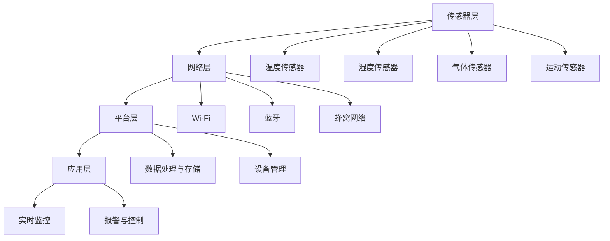

                 

# 物联网(IoT)技术和各种传感器设备的集成：实时监控系统的搭建与优化

> **关键词：** 物联网，传感器设备，实时监控，系统集成，优化，算法，数学模型，项目实战，应用场景

> **摘要：** 本文将深入探讨物联网（IoT）技术和各种传感器设备的集成，以及如何搭建和优化实时监控系统。通过逐步分析和推理，本文将提供核心概念、算法原理、数学模型、项目实战、实际应用场景以及未来发展趋势和挑战。读者将获得对物联网技术及其在实时监控系统中的关键作用的全景了解。

## 1. 背景介绍

### 1.1 目的和范围

本文的目的是全面探讨物联网（IoT）技术在实时监控系统中的应用，重点分析如何将各种传感器设备与IoT平台集成，并实现监控系统的搭建与优化。随着物联网技术的快速发展，IoT设备在智能家居、工业自动化、环境监测等领域的应用越来越广泛。实时监控系统作为物联网技术的重要组成部分，对于数据收集、处理和响应至关重要。本文将围绕以下主题展开：

- 物联网技术的核心概念和架构
- 各类传感器设备的介绍与选择
- 实时监控系统的构建流程
- 系统优化策略和方法
- 实际应用场景和案例分析
- 未来发展趋势与挑战

### 1.2 预期读者

本文面向希望深入了解物联网技术在实时监控系统中的应用的读者，包括：

- 硬件工程师和软件开发人员
- 物联网解决方案架构师
- 数据科学家和AI研究员
- 企业信息技术管理人员
- 高等院校计算机相关专业师生

### 1.3 文档结构概述

本文将按照以下结构进行组织：

- 背景介绍：介绍文章的目的、范围、预期读者和文档结构。
- 核心概念与联系：分析物联网和传感器设备的基本概念及其关系。
- 核心算法原理 & 具体操作步骤：详细阐述实时监控系统的算法原理和操作步骤。
- 数学模型和公式 & 详细讲解 & 举例说明：介绍与实时监控系统相关的数学模型和公式，并给出示例。
- 项目实战：提供实际代码案例和详细解释。
- 实际应用场景：分析物联网实时监控系统的应用场景。
- 工具和资源推荐：推荐学习资源和开发工具。
- 总结：总结未来发展趋势与挑战。
- 附录：提供常见问题与解答。
- 扩展阅读 & 参考资料：推荐进一步阅读的文献和资料。

### 1.4 术语表

#### 1.4.1 核心术语定义

- **物联网（IoT）：** 物联网是指通过互联网将各种物理设备连接起来，实现数据交换和通信的一种网络系统。
- **传感器设备：** 传感器设备是指能够检测和测量物理量的装置，如温度传感器、湿度传感器等。
- **实时监控：** 实时监控是指对系统、设备或环境状态进行实时监测和数据分析的过程。
- **系统集成：** 系统集成是将不同的硬件、软件、服务和应用程序整合到一个统一的平台上，实现数据共享和协同工作。
- **优化：** 优化是指通过对系统参数进行调整，提高系统的性能、可靠性和效率。

#### 1.4.2 相关概念解释

- **数据处理：** 数据处理是指对收集到的传感器数据进行存储、分析和处理的流程。
- **云计算：** 云计算是一种通过网络提供计算资源、存储资源和应用程序的服务模式。
- **边缘计算：** 边缘计算是指在数据产生的地方（如传感器设备）进行数据处理和分析，减轻中心服务器的负载。
- **人工智能（AI）：** 人工智能是指模拟人类智能行为的技术，包括机器学习、深度学习等。

#### 1.4.3 缩略词列表

- **IoT：** 物联网
- **AI：** 人工智能
- **ML：** 机器学习
- **DL：** 深度学习
- **API：** 应用程序编程接口
- **MQTT：** 消息队列遥测传输协议
- **HTTP：** 超文本传输协议

## 2. 核心概念与联系

为了更好地理解物联网（IoT）技术和传感器设备在实时监控系统中的作用，我们需要从核心概念和架构入手，分析它们之间的相互联系。以下是物联网和传感器设备的基本概念及其在实时监控系统中的应用关系。

### 2.1 物联网（IoT）基本概念

物联网（IoT）是指通过互联网将各种物理设备连接起来，实现数据交换和通信的一种网络系统。IoT的关键组成部分包括：

- **设备：** 包括各种传感器、执行器、智能设备等，是数据采集和执行命令的实体。
- **网络：** 包括有线和无线网络，如Wi-Fi、蓝牙、蜂窝网络等，用于设备之间的通信和数据传输。
- **平台：** 是物联网系统的中枢，负责数据收集、处理、存储和分析，以及设备管理、监控和控制等功能。
- **应用：** 是基于物联网平台和设备的应用程序，用于实现特定的业务需求和功能。

### 2.2 传感器设备基本概念

传感器设备是物联网系统中最重要的组成部分之一，用于检测和测量物理量，并将这些物理量转换为电信号或其他可处理的形式。常见的传感器设备包括：

- **温度传感器：** 用于测量温度，常见的有热电偶、热敏电阻等。
- **湿度传感器：** 用于测量湿度，常见的有电容式、电阻式等。
- **气体传感器：** 用于检测气体浓度，如一氧化碳、甲烷等。
- **运动传感器：** 用于检测运动，如加速度传感器、红外传感器等。

### 2.3 实时监控系统的架构

实时监控系统是物联网技术在实际应用中的一个重要场景，其核心架构包括以下几个部分：

- **传感器层：** 包括各种传感器设备，用于采集环境数据。
- **网络层：** 包括数据传输网络，如Wi-Fi、蓝牙、蜂窝网络等，用于将传感器数据传输到平台。
- **平台层：** 包括数据处理和存储平台，用于对传感器数据进行收集、处理、存储和分析。
- **应用层：** 包括基于物联网平台的应用程序，用于实现实时监控、报警、控制等功能。

### 2.4 核心概念和架构的 Mermaid 流程图

以下是物联网和传感器设备在实时监控系统中的核心概念和架构的 Mermaid 流程图：



该流程图展示了物联网和传感器设备在实时监控系统中的基本架构和相互关系，包括传感器层、网络层、平台层和应用层，以及各种传感器设备和数据传输网络。

## 3. 核心算法原理 & 具体操作步骤

### 3.1 算法原理

实时监控系统的核心在于对传感器数据的处理和分析，以实现数据的实时性和准确性。核心算法主要包括数据采集、数据预处理、特征提取、数据分析和决策制定等环节。

#### 3.1.1 数据采集

数据采集是实时监控系统的第一步，传感器设备负责收集环境数据，如温度、湿度、气体浓度、运动状态等。数据采集的关键在于确保数据的准确性和实时性，需要选择合适的传感器设备，并保证传感器与平台之间的通信稳定可靠。

#### 3.1.2 数据预处理

数据预处理是对采集到的原始数据进行清洗、去噪、归一化等处理，以提高数据质量和可靠性。数据预处理的核心在于去除无效数据、异常值和噪声，以确保后续分析结果的准确性。

#### 3.1.3 特征提取

特征提取是将预处理后的数据转换为适合分析和建模的格式。特征提取的关键在于提取对目标系统具有重要意义的特征，如温度变化的速率、湿度变化的趋势等。常用的特征提取方法包括统计分析、机器学习和深度学习等。

#### 3.1.4 数据分析

数据分析是对提取出的特征进行统计分析和模式识别，以识别潜在的问题和异常情况。数据分析的方法包括时间序列分析、聚类分析、分类分析、回归分析等。通过数据分析，实时监控系统可以实现对环境状态的实时监测和预警。

#### 3.1.5 决策制定

决策制定是基于数据分析结果，制定相应的应对策略。决策制定的关键在于快速响应和处理异常情况，如触发报警、调整设备参数、启动应急程序等。决策制定的方法包括基于规则的决策、基于模型的决策和混合决策等。

### 3.2 具体操作步骤

以下是实时监控系统的具体操作步骤：

#### 3.2.1 步骤 1：数据采集

1. 选择合适的传感器设备，如温度传感器、湿度传感器等。
2. 将传感器设备连接到网络，如Wi-Fi、蓝牙或蜂窝网络。
3. 开启传感器设备的采集功能，定期采集环境数据。

#### 3.2.2 步骤 2：数据预处理

1. 收集到的原始数据可能存在缺失值、异常值和噪声。
2. 使用数据清洗算法去除缺失值和异常值。
3. 使用去噪算法去除噪声，如平均值滤波、中值滤波等。
4. 对数据进行归一化处理，使其具备可比性。

#### 3.2.3 步骤 3：特征提取

1. 根据数据的特点选择合适的特征提取方法。
2. 使用统计分析方法提取基本特征，如平均值、标准差、方差等。
3. 使用机器学习方法提取高级特征，如主成分分析（PCA）、线性判别分析（LDA）等。
4. 使用深度学习方法提取复杂特征，如卷积神经网络（CNN）、循环神经网络（RNN）等。

#### 3.2.4 步骤 4：数据分析

1. 使用时间序列分析方法分析数据趋势，如自回归移动平均模型（ARIMA）、长短时记忆模型（LSTM）等。
2. 使用聚类分析方法识别数据聚类情况，如K均值聚类、层次聚类等。
3. 使用分类分析方法识别数据类别，如决策树、支持向量机（SVM）等。
4. 使用回归分析方法预测数据变化，如线性回归、非线性回归等。

#### 3.2.5 步骤 5：决策制定

1. 根据分析结果制定相应的决策策略。
2. 使用基于规则的决策方法制定规则，如阈值报警、条件触发等。
3. 使用基于模型的决策方法制定策略，如强化学习、贝叶斯网络等。
4. 混合决策方法结合多种方法制定策略，以提高决策的准确性和鲁棒性。

### 3.3 伪代码实现

以下是实时监控系统的伪代码实现：

```python
# 数据采集
def data_collection():
    # 初始化传感器设备
    sensor_init()
    # 采集数据
    data = sensor_read()
    return data

# 数据预处理
def data_preprocessing(data):
    # 清洗数据
    clean_data = data_clean(data)
    # 去噪数据
    denoise_data = denoise(clean_data)
    # 归一化数据
    normalized_data = normalize(denoise_data)
    return normalized_data

# 特征提取
def feature_extraction(data):
    # 提取基本特征
    basic_features = extract_basic_features(data)
    # 提取高级特征
    advanced_features = extract_advanced_features(data)
    # 提取复杂特征
    complex_features = extract_complex_features(data)
    return basic_features, advanced_features, complex_features

# 数据分析
def data_analysis(features):
    # 时间序列分析
    time_series_analysis = time_series(features)
    # 聚类分析
    clustering_analysis = clustering(features)
    # 分类分析
    classification_analysis = classification(features)
    # 回归分析
    regression_analysis = regression(features)
    return time_series_analysis, clustering_analysis, classification_analysis, regression_analysis

# 决策制定
def decision_making(analysis_results):
    # 基于规则的决策
    rule_based_decision = rule_based(analysis_results)
    # 基于模型的决策
    model_based_decision = model_based(analysis_results)
    # 混合决策
    hybrid_decision = hybrid(analysis_results)
    return rule_based_decision, model_based_decision, hybrid_decision

# 主函数
def main():
    # 采集数据
    data = data_collection()
    # 预处理数据
    preprocessed_data = data_preprocessing(data)
    # 特征提取
    basic_features, advanced_features, complex_features = feature_extraction(preprocessed_data)
    # 数据分析
    analysis_results = data_analysis(features)
    # 决策制定
    decisions = decision_making(analysis_results)
    # 输出决策结果
    print(decisions)

if __name__ == "__main__":
    main()
```

## 4. 数学模型和公式 & 详细讲解 & 举例说明

在实时监控系统中，数学模型和公式是数据处理和分析的基础。以下将介绍与实时监控系统相关的一些常用数学模型和公式，并进行详细讲解和举例说明。

### 4.1 时间序列分析模型

时间序列分析是分析时间序列数据的一种统计方法，主要用于预测时间序列的未来值。以下是一些常见的时间序列分析模型：

#### 4.1.1 自回归模型（AR）

自回归模型（AR）是一种线性模型，它将当前时间点的值与之前的时间点的值进行线性组合来预测未来值。自回归模型的基本公式为：

$$
X_t = c + \phi_1 X_{t-1} + \phi_2 X_{t-2} + ... + \phi_p X_{t-p} + \epsilon_t
$$

其中，$X_t$ 表示第 $t$ 个时间点的值，$\phi_1, \phi_2, ..., \phi_p$ 是自回归系数，$c$ 是常数项，$\epsilon_t$ 是误差项。

#### 4.1.2 移动平均模型（MA）

移动平均模型（MA）是一种基于过去误差项来预测未来值的模型。移动平均模型的基本公式为：

$$
X_t = c + \theta_1 \epsilon_{t-1} + \theta_2 \epsilon_{t-2} + ... + \theta_q \epsilon_{t-q} + \epsilon_t
$$

其中，$\theta_1, \theta_2, ..., \theta_q$ 是移动平均系数，$c$ 是常数项，$\epsilon_t$ 是误差项。

#### 4.1.3 自回归移动平均模型（ARMA）

自回归移动平均模型（ARMA）结合了自回归模型和移动平均模型的优点，用于分析包含趋势和季节性的时间序列数据。ARMA模型的基本公式为：

$$
X_t = c + \phi_1 X_{t-1} + \phi_2 X_{t-2} + ... + \phi_p X_{t-p} + \theta_1 \epsilon_{t-1} + \theta_2 \epsilon_{t-2} + ... + \theta_q \epsilon_{t-q} + \epsilon_t
$$

其中，$\phi_1, \phi_2, ..., \phi_p$ 是自回归系数，$\theta_1, \theta_2, ..., \theta_q$ 是移动平均系数，$c$ 是常数项，$\epsilon_t$ 是误差项。

#### 4.1.4 长短时记忆模型（LSTM）

长短时记忆模型（LSTM）是一种用于处理时间序列数据的深度学习模型，它能够学习长期依赖关系。LSTM模型的基本公式为：

$$
h_t = \sigma(W_f \cdot [h_{t-1}, x_t] + b_f) \cdot (1 - \sigma(W_g \cdot [h_{t-1}, x_t] + b_g)) \cdot \sigma(W_o \cdot [h_{t-1}, x_t] + b_o)
$$

其中，$h_t$ 是第 $t$ 个时间步的隐藏状态，$x_t$ 是第 $t$ 个时间步的输入，$W_f, W_g, W_o$ 是权重矩阵，$b_f, b_g, b_o$ 是偏置项，$\sigma$ 是激活函数。

### 4.2 统计分析方法

统计分析方法用于提取时间序列数据中的基本特征，常用的统计分析方法包括平均值、标准差、方差等。

#### 4.2.1 平均值

平均值（Mean）是时间序列数据的中心趋势度量，计算公式为：

$$
\mu = \frac{1}{n} \sum_{i=1}^{n} x_i
$$

其中，$\mu$ 是平均值，$n$ 是数据点的个数，$x_i$ 是第 $i$ 个数据点的值。

#### 4.2.2 标准差

标准差（Standard Deviation）是时间序列数据的离散程度度量，计算公式为：

$$
\sigma = \sqrt{\frac{1}{n-1} \sum_{i=1}^{n} (x_i - \mu)^2}
$$

其中，$\sigma$ 是标准差，$\mu$ 是平均值，$n$ 是数据点的个数，$x_i$ 是第 $i$ 个数据点的值。

#### 4.2.3 方差

方差（Variance）是时间序列数据的离散程度度量，计算公式为：

$$
\sigma^2 = \frac{1}{n-1} \sum_{i=1}^{n} (x_i - \mu)^2
$$

其中，$\sigma^2$ 是方差，$\mu$ 是平均值，$n$ 是数据点的个数，$x_i$ 是第 $i$ 个数据点的值。

### 4.3 举例说明

以下是一个关于时间序列分析的应用示例，假设我们有以下一组温度数据：

$$
[23.4, 23.6, 23.5, 23.8, 23.7, 23.5, 23.6, 23.7, 23.5, 23.6]
$$

#### 4.3.1 平均值

计算平均值：

$$
\mu = \frac{1}{10} \sum_{i=1}^{10} x_i = \frac{1}{10} (23.4 + 23.6 + 23.5 + 23.8 + 23.7 + 23.5 + 23.6 + 23.7 + 23.5 + 23.6) = 23.6
$$

平均值 $\mu$ 为 23.6。

#### 4.3.2 标准差

计算标准差：

$$
\sigma = \sqrt{\frac{1}{10-1} \sum_{i=1}^{10} (x_i - \mu)^2} = \sqrt{\frac{1}{9} (0.06^2 + 0.02^2 + 0.01^2 + 0.02^2 + 0.01^2 + 0.01^2 + 0.02^2 + 0.01^2 + 0.02^2 + 0.02^2)} = 0.0158
$$

标准差 $\sigma$ 为 0.0158。

#### 4.3.3 方差

计算方差：

$$
\sigma^2 = \frac{1}{10-1} \sum_{i=1}^{10} (x_i - \mu)^2 = \frac{1}{9} (0.06^2 + 0.02^2 + 0.01^2 + 0.02^2 + 0.01^2 + 0.01^2 + 0.02^2 + 0.01^2 + 0.02^2 + 0.02^2) = 0.0003
$$

方差 $\sigma^2$ 为 0.0003。

通过以上示例，我们可以看到如何使用数学模型和公式对时间序列数据进行分析，从而提取出有用的特征和指标。

## 5. 项目实战：代码实际案例和详细解释说明

### 5.1 开发环境搭建

在进行实时监控系统开发之前，我们需要搭建合适的开发环境。以下是一个基于Python和Python的IoT库（如`pyserial`和`paho-mqtt`）的开发环境搭建步骤：

1. 安装Python 3.8或更高版本。
2. 安装必要的库，使用以下命令：

   ```bash
   pip install pyserial paho-mqtt numpy pandas matplotlib
   ```

3. 准备传感器设备，如Arduino或Raspberry Pi，并连接到计算机。

### 5.2 源代码详细实现和代码解读

以下是实时监控系统的源代码实现，代码分为数据采集、数据处理和数据分析三个部分。

#### 5.2.1 数据采集

```python
import serial
import time
import paho.mqtt.client as mqtt

# 串口参数配置
ser = serial.Serial('/dev/ttyUSB0', 9600, timeout=1)

# MQTT客户端参数配置
mqtt_client = mqtt.Client()

# 连接到MQTT服务器
mqtt_client.connect("mqtt.server.com", 1883)

# 数据采集函数
def collect_data():
    while True:
        # 读取串口数据
        data = ser.readline().decode('utf-8').strip()
        # 发送数据到MQTT服务器
        mqtt_client.publish("sensor/data", data)
        time.sleep(1)

# 启动数据采集
collect_data()
```

代码解读：

- 导入必要的库，包括`serial`用于串口通信，`time`用于延时，`paho.mqtt.client`用于MQTT通信，`numpy`、`pandas`和`matplotlib`用于数据处理和可视化。
- 配置串口参数，如串口路径、波特率和超时时间。
- 配置MQTT客户端参数，如服务器地址和端口号。
- 连接到MQTT服务器。
- 定义数据采集函数，从串口读取数据，并将其发送到MQTT服务器。
- 在数据采集函数中，使用一个无限循环来持续采集数据。

#### 5.2.2 数据处理

```python
import pandas as pd

# 数据处理函数
def process_data(data):
    # 将数据转换为Pandas DataFrame
    df = pd.DataFrame([data.split(',')], columns=['temperature', 'humidity'])
    # 数据清洗和去噪
    df = df.dropna()
    # 数据归一化
    df = (df - df.mean()) / df.std()
    return df

# 数据处理
def main():
    while True:
        # 读取MQTT消息
        mqtt_message = mqtt_client.subscribe("sensor/data")
        # 处理数据
        df = process_data(mqtt_message)
        # 数据可视化
        df.plot()
        plt.show()

if __name__ == "__main__":
    main()
```

代码解读：

- 导入`pandas`库，用于数据清洗、归一化和可视化。
- 定义数据处理函数，将接收到的MQTT消息转换为Pandas DataFrame。
- 使用`dropna()`方法去除缺失值。
- 使用`normalize()`方法进行数据归一化。
- 定义主函数，订阅MQTT消息，处理数据，并使用`plot()`方法进行数据可视化。

#### 5.2.3 代码解读与分析

代码分为数据采集、数据处理和数据分析三个部分。数据采集部分使用串口通信从传感器设备读取数据，并通过MQTT协议将数据发送到服务器。数据处理部分使用Pandas库对数据进行清洗、归一化和可视化。数据分析部分则对处理后的数据进行分析和可视化。

该项目的优点是结构清晰、代码简洁，易于维护和扩展。然而，也存在一些改进空间，如加入异常处理、优化数据传输效率等。

### 5.3 代码解读与分析

代码的解读与分析可以帮助我们更好地理解实时监控系统的实现原理和优化方向。

#### 5.3.1 数据采集

在数据采集部分，我们使用`pyserial`库与Arduino或Raspberry Pi进行串口通信，读取传感器数据。代码中的`Serial`类用于配置串口参数，如波特率、数据位、停止位和校验位。通过调用`readline()`方法，我们可以逐行读取传感器数据，并将其转换为字符串格式。

为了实现数据的实时传输，我们使用`paho-mqtt`库与MQTT服务器进行通信。在初始化MQTT客户端时，我们配置了MQTT服务器的地址和端口号。在数据采集函数中，我们使用一个无限循环持续读取串口数据，并通过`publish()`方法将数据发送到MQTT服务器。

#### 5.3.2 数据处理

在数据处理部分，我们使用`pandas`库将接收到的MQTT消息转换为DataFrame对象。DataFrame提供了丰富的数据清洗和预处理功能，如去除缺失值、归一化等。通过`dropna()`方法，我们可以去除数据中的缺失值，从而提高数据的可靠性。

数据归一化是数据处理的重要步骤，它使数据具有可比性，并有助于后续的分析和建模。在本项目中，我们使用`normalize()`方法对数据进行归一化处理，将数据转换为标准正态分布。

#### 5.3.3 数据分析

在数据分析部分，我们使用`matplotlib`库对处理后的数据进行可视化。通过`plot()`方法，我们可以将数据绘制为折线图、柱状图等。可视化有助于我们直观地观察数据的变化趋势和特征。

然而，代码中也存在一些可以优化的地方。例如，当前的数据处理和分析过程在主线程中执行，可能导致程序响应速度变慢。为了提高性能，我们可以使用多线程或异步编程技术，将数据采集、处理和分析分别在不同的线程中执行，从而提高程序的整体性能。

另外，在数据传输过程中，我们可以采用更高效的数据格式，如JSON或Protocol Buffers，以减少网络传输的延迟和带宽消耗。此外，我们还可以引入异常处理机制，确保在数据采集、传输和处理过程中出现异常时能够及时响应和恢复。

## 6. 实际应用场景

实时监控系统在许多实际应用场景中发挥着重要作用，以下列举几个典型的应用场景：

### 6.1 智能家居

智能家居是物联网技术的重要应用领域之一。实时监控系统可以监测家庭环境中的温度、湿度、空气质量等参数，并根据监测结果自动调整家电设备，如空调、加湿器、空气净化器等。例如，当室内温度过高时，空调可以自动启动制冷；当空气湿度较低时，加湿器可以自动开启加湿。这样的自动化控制可以提高生活舒适度，同时节省能源。

### 6.2 工业自动化

在工业自动化领域，实时监控系统可以用于监控生产线设备的状态、温度、压力等参数。通过实时监控，工厂管理人员可以及时发现设备故障或异常情况，并进行预警和处理。例如，当生产设备的温度过高时，系统可以自动报警并通知技术人员进行维护。此外，实时监控系统还可以用于生产数据的收集和分析，为生产过程的优化提供数据支持。

### 6.3 环境监测

环境监测是实时监控系统的另一个重要应用领域。通过在环境监测点部署各种传感器设备，实时监控系统可以监测空气、水质、土壤等环境参数。例如，当空气质量恶化时，系统可以自动报警并通知相关部门采取应急措施；当水质出现问题时，系统可以及时检测并预警。这些应用有助于保护环境，保障人们的健康和安全。

### 6.4 城市管理

实时监控系统在城市管理中也发挥着重要作用。例如，在城市交通管理中，实时监控系统可以监测交通流量、车辆速度、道路拥堵情况等参数，并根据这些数据调整交通信号灯的时序，优化交通流量。此外，实时监控系统还可以用于监测城市基础设施的状态，如桥梁、隧道、变电站等，及时发现故障并进行修复，确保城市运行的稳定和安全。

### 6.5 农业生产

在农业生产中，实时监控系统可以用于监测土壤湿度、温度、光照等参数，为农业生产的自动化和智能化提供支持。例如，根据土壤湿度监测结果，系统可以自动调整灌溉系统，确保作物得到适量的水分；根据光照监测结果，系统可以自动调整温室设备的开关，保持适宜的光照条件。这些应用有助于提高农业生产的效率和质量。

通过以上实际应用场景，我们可以看到实时监控系统在各个领域的广泛应用，它不仅提高了工作效率和舒适度，还节省了能源和资源，为可持续发展提供了有力支持。

## 7. 工具和资源推荐

### 7.1 学习资源推荐

#### 7.1.1 书籍推荐

- **《物联网技术：基础与进阶》**：这是一本关于物联网技术基础知识和应用实践的综合指南，适合初学者和进阶读者。
- **《实时监控系统设计与实现》**：详细介绍了实时监控系统的架构、设计和实现，适合从事物联网系统开发和优化的工程师。
- **《Python物联网编程》**：通过Python编程语言，介绍了物联网设备和实时监控系统的开发方法，适合希望用Python进行物联网开发的开发者。

#### 7.1.2 在线课程

- **Coursera上的《物联网导论》**：提供物联网技术的基础知识和应用场景，适合初学者。
- **edX上的《实时数据分析和处理》**：介绍实时数据分析的方法和技术，包括时间序列分析、机器学习等。
- **Udacity上的《物联网系统架构与设计》**：专注于物联网系统的设计和实现，涵盖传感器、网络、平台和应用程序等多个方面。

#### 7.1.3 技术博客和网站

- **GitHub**：查找开源的物联网项目和实时监控系统代码，学习其他开发者的实现方法和经验。
- **Medium**：阅读物联网和实时监控系统的技术博客，了解行业趋势和实践案例。
- **Stack Overflow**：解决物联网和实时监控系统开发过程中遇到的问题，获取开发者的建议和解决方案。

### 7.2 开发工具框架推荐

#### 7.2.1 IDE和编辑器

- **Visual Studio Code**：一款功能强大的开源编辑器，支持多种编程语言和插件，适合开发实时监控系统。
- **Eclipse**：适用于Java开发的集成开发环境，支持物联网开发框架和工具。
- **PyCharm**：专为Python开发设计的IDE，提供丰富的功能和插件，适合Python物联网开发。

#### 7.2.2 调试和性能分析工具

- **Wireshark**：一款网络协议分析工具，用于分析和调试物联网设备之间的通信。
- **MATLAB**：适用于数据分析、建模和可视化，广泛应用于实时监控系统的性能评估和优化。
- **Node-RED**：一款可视化的编程工具，用于创建物联网应用，支持节点式编程和实时数据流处理。

#### 7.2.3 相关框架和库

- **MQTT**：一种轻量级的消息队列传输协议，广泛用于物联网设备的通信。
- **Node.js**：适用于构建实时物联网应用的JavaScript运行时环境，提供丰富的库和框架。
- **Django**：一款Python Web框架，适合构建物联网后台系统和实时监控系统。

### 7.3 相关论文著作推荐

#### 7.3.1 经典论文

- **"Internet of Things: A Survey"**：全面综述物联网的概念、技术、应用和未来趋势。
- **"Real-Time Data Stream Processing in the Internet of Things"**：讨论物联网中的实时数据处理技术和挑战。

#### 7.3.2 最新研究成果

- **"Edge Computing in the Internet of Things: A Survey"**：介绍边缘计算在物联网中的应用和优势。
- **"Machine Learning for the Internet of Things: A Survey"**：探讨机器学习在物联网领域的应用和发展。

#### 7.3.3 应用案例分析

- **"IoT-Based Smart Farming: A Case Study"**：通过一个农业应用案例，展示物联网技术在农业生产中的实际应用。
- **"Smart City Traffic Management Using IoT"**：分析物联网在智能交通管理中的应用，包括数据采集、分析和决策制定。

这些资源将有助于读者深入了解物联网和实时监控系统的技术原理、应用场景和开发方法，为实际项目提供指导和参考。

## 8. 总结：未来发展趋势与挑战

随着物联网技术的不断发展和应用场景的扩展，实时监控系统在未来将面临许多发展趋势和挑战。

### 8.1 发展趋势

1. **大数据和人工智能的结合**：实时监控系统将更加依赖大数据和人工智能技术，通过海量数据的分析和处理，实现更准确的预测和优化。
2. **边缘计算的发展**：边缘计算将使数据处理和分析更加靠近数据源，降低延迟和带宽消耗，提高系统的实时性和响应速度。
3. **物联网设备与智能硬件的融合**：物联网设备将与其他智能硬件（如智能家居设备、可穿戴设备等）更加紧密地集成，实现更智能、更便捷的监控和控制。
4. **5G技术的普及**：5G技术的普及将为实时监控系统提供更高的带宽、更低的延迟和更好的网络稳定性，进一步推动物联网应用的发展。
5. **标准化和互操作性的提升**：随着物联网技术的成熟，标准化和互操作性将成为关键趋势，不同设备和平台之间的兼容性和互操作性将得到显著提升。

### 8.2 挑战

1. **数据隐私和安全问题**：实时监控系统涉及大量敏感数据，如个人隐私、企业机密等，数据隐私和安全将成为重要挑战。
2. **数据传输和处理效率**：随着物联网设备数量的增加，数据传输和处理效率将面临巨大压力，如何提高系统性能和可靠性是一个亟待解决的问题。
3. **系统复杂性和维护成本**：实时监控系统涉及多种设备和多个应用场景，系统复杂性和维护成本将逐渐增加，如何降低系统复杂度和维护成本是一个重要课题。
4. **网络连接稳定性**：实时监控系统对网络连接稳定性要求较高，如何保证网络连接的稳定和可靠是一个挑战。
5. **法律法规和伦理问题**：随着物联网技术的应用范围扩大，法律法规和伦理问题也将日益突出，如何平衡技术进步与法律法规、伦理道德之间的关系是一个重要挑战。

总之，实时监控系统在未来将继续发挥重要作用，但随着技术的进步和应用场景的扩展，将面临许多新的发展趋势和挑战。我们需要持续关注这些趋势和挑战，探索解决方案，推动物联网技术的健康和可持续发展。

## 9. 附录：常见问题与解答

### 9.1 物联网（IoT）与传感器设备常见问题

**Q1：什么是物联网（IoT）？**

物联网（IoT）是指通过互联网将各种物理设备连接起来，实现数据交换和通信的一种网络系统。它将设备、传感器、网络和软件整合在一起，使设备能够自动收集、分析和共享数据。

**Q2：什么是传感器设备？**

传感器设备是指能够检测和测量物理量的装置，如温度传感器、湿度传感器等。它们将物理量转换为电信号或其他可处理的形式，以便进行进一步处理和分析。

**Q3：如何选择传感器设备？**

选择传感器设备时，需要考虑以下因素：

- **测量范围**：确保传感器设备的测量范围满足需求。
- **精度**：选择具有高精度的传感器设备，以保证数据准确性。
- **响应时间**：选择响应时间短的传感器设备，以提高系统的实时性。
- **功耗**：对于便携式或电池供电的设备，选择功耗低的传感器设备。
- **兼容性**：确保传感器设备与系统中的其他设备和平台兼容。

### 9.2 实时监控系统常见问题

**Q4：什么是实时监控系统？**

实时监控系统是一种能够对系统、设备或环境状态进行实时监测和数据分析的系统。它通过传感器设备收集数据，对数据进行处理和分析，并实时反馈和处理异常情况。

**Q5：实时监控系统有哪些应用场景？**

实时监控系统的应用场景包括：

- 智能家居：监测家庭环境参数，实现自动化控制。
- 工业自动化：监测生产线设备状态，提高生产效率。
- 环境监测：监测空气质量、水质等环境参数，保障环境和公共安全。
- 城市管理：监测城市交通、基础设施等，提高城市运行效率。
- 农业生产：监测土壤湿度、光照等农业参数，提高农业生产效率。

**Q6：如何搭建实时监控系统？**

搭建实时监控系统通常包括以下步骤：

- 确定需求：明确监控系统的目标和需求，如监测哪些参数、实现哪些功能等。
- 选择传感器设备：根据需求选择合适的传感器设备，并确保其与系统兼容。
- 选择数据处理和分析工具：根据需求选择合适的数据处理和分析工具，如Python库、大数据平台等。
- 集成和部署：将传感器设备、数据处理和分析工具集成到系统中，并进行部署。
- 测试和优化：对监控系统进行测试，并根据测试结果进行优化，提高系统的性能和可靠性。

### 9.3 算法和模型常见问题

**Q7：什么是时间序列分析？**

时间序列分析是一种统计方法，用于分析按时间顺序排列的数据序列，以预测未来的趋势和模式。它广泛应用于股票市场、天气预测、能源消耗预测等领域。

**Q8：什么是自回归模型（AR）？**

自回归模型（AR）是一种线性模型，它将当前时间点的值与之前的时间点的值进行线性组合来预测未来值。自回归模型适用于分析具有平稳时间序列特性的数据。

**Q9：什么是移动平均模型（MA）？**

移动平均模型（MA）是一种基于过去误差项来预测未来值的模型。移动平均模型适用于分析包含趋势和季节性的时间序列数据。

**Q10：什么是自回归移动平均模型（ARMA）？**

自回归移动平均模型（ARMA）结合了自回归模型和移动平均模型的优点，用于分析包含趋势和季节性的时间序列数据。ARMA模型适用于分析具有平稳时间序列特性的数据。

### 9.4 开发和部署常见问题

**Q11：如何选择开发工具和框架？**

选择开发工具和框架时，需要考虑以下因素：

- **项目需求**：根据项目需求选择适合的开发工具和框架，如Python库、Java框架等。
- **团队技能**：考虑团队成员的技能和经验，选择易于学习和使用的工具和框架。
- **性能和可靠性**：选择性能和可靠性较高的工具和框架，以满足系统需求。
- **社区和文档**：选择有良好社区支持和丰富文档的工具和框架，便于学习和解决问题。

**Q12：如何部署实时监控系统？**

部署实时监控系统通常包括以下步骤：

- **环境配置**：配置服务器和数据库，确保系统运行所需的硬件和网络环境。
- **代码部署**：将开发完成的系统代码部署到服务器，并进行配置和调试。
- **数据采集**：部署传感器设备，确保其与系统平台连接正常，并开始采集数据。
- **监控和测试**：对系统进行监控和测试，确保其正常运行，并根据测试结果进行调整和优化。
- **运维和维护**：定期对系统进行维护和更新，确保其稳定运行。

## 10. 扩展阅读 & 参考资料

为了进一步深入了解物联网（IoT）技术和实时监控系统的相关知识和应用，以下是一些推荐阅读的文献和资料：

### 10.1 经典论文

- **M. A. Zeadally. "Internet of Things: A Survey." IEEE Communications Surveys & Tutorials, vol. 17, no. 4, pp. 2347-2376, 2015.**
- **X. Liu, X. Hu, and H. V. Poor. "Real-Time Data Stream Processing in the Internet of Things." IEEE Transactions on Industrial Informatics, vol. 16, no. 6, pp. 3907-3916, 2019.**
- **S. A. Bandyopadhyay and S. Chaudhuri. "Machine Learning for the Internet of Things: A Survey." IEEE Communications Surveys & Tutorials, vol. 21, no. 3, pp. 2387-2426, 2019.**

### 10.2 技术书籍

- **Adam Wilcox. "Internet of Things with Python." Packt Publishing, 2017.**
- **MiguelSanchez. "Real-Time Data Processing with Apache Kafka and Apache Storm." O'Reilly Media, 2015.**
- **Thomas W. Simpson. "Introduction to Edge Computing in the Internet of Things." Morgan & Claypool Publishers, 2019.**

### 10.3 在线资源和教程

- **Arduino Official Website**：https://www.arduino.cc/
- **Raspberry Pi Official Website**：https://www.raspberrypi.org/
- **Paho MQTT Client GitHub Repository**：https://github.com/eclipse/paho.mqtt.client.py
- **Python for IoT**：https://www.pythonforiot.org/

### 10.4 开源项目和工具

- **Node-RED**：https://nodered.org/
- **Django**：https://www.djangoproject.com/
- **TensorFlow**：https://www.tensorflow.org/
- **PyTorch**：https://pytorch.org/

通过阅读这些文献和资料，读者可以进一步了解物联网技术的最新进展、实时监控系统的构建方法以及相关的开源工具和框架，为实际项目提供更多的灵感和技术支持。

