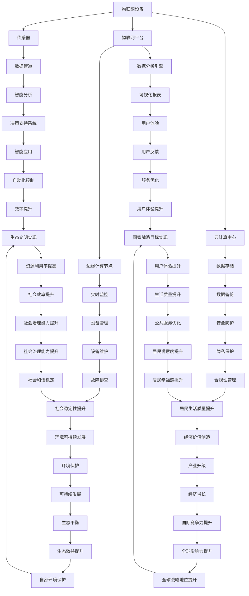
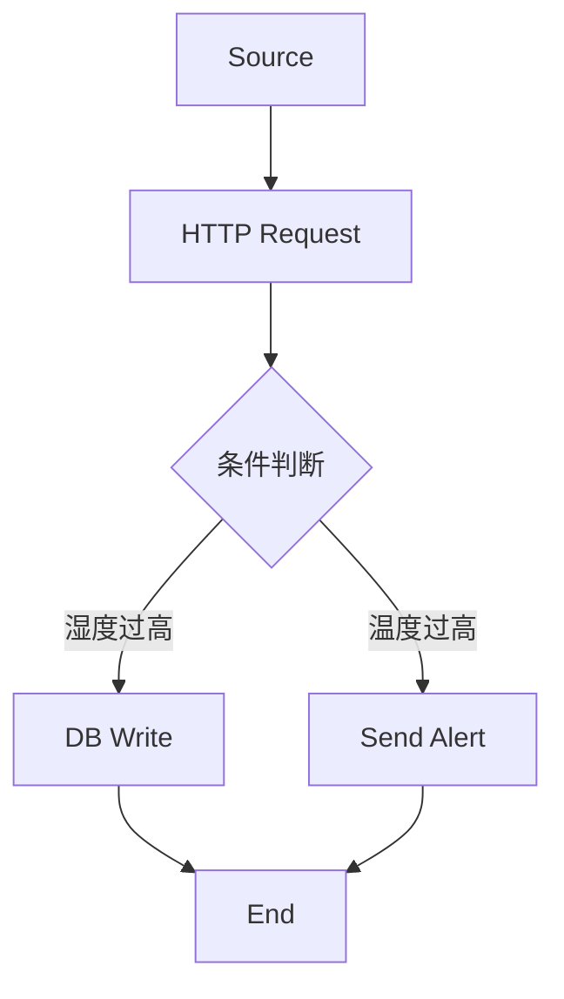

                 

# 物联网(IoT)技术和各种传感器设备的集成：物联网在智慧城市的应用

> 关键词：物联网，传感器设备，智慧城市，数据集成，智能分析，边缘计算

> 摘要：本文深入探讨了物联网（IoT）技术及其在传感器设备集成方面的应用，特别是在智慧城市建设中的应用。我们将逐步分析物联网的技术原理、传感器设备类型及其集成方法，探讨数据集成和智能分析的重要性，并举例说明物联网在智慧交通、智能环境监控等领域的实际应用。最后，本文将总结物联网技术的发展趋势与面临的挑战，并提供相关的学习资源和工具推荐。

## 1. 背景介绍

### 1.1 目的和范围

本文旨在为广大读者提供一个全面而深入的了解物联网（IoT）技术和各种传感器设备集成的框架，特别是其在智慧城市建设中的应用。通过逐步分析物联网的技术原理、传感器设备类型、集成方法和应用实例，我们希望读者能够掌握物联网的核心概念，理解其在现代智慧城市中的关键作用。

本文将涵盖以下内容：

1. **物联网的基本概念和技术原理**：介绍物联网的定义、发展历史及其在现代社会中的作用。
2. **传感器设备类型和集成方法**：探讨不同类型的传感器及其工作原理，以及如何将它们集成到物联网系统中。
3. **数据集成和智能分析**：讨论数据集成在物联网系统中的重要性，以及如何通过智能分析从大量数据中提取有价值的信息。
4. **物联网在智慧城市的实际应用**：举例说明物联网在智慧交通、智能环境监控等领域的应用实例。
5. **未来发展趋势与挑战**：总结物联网技术的发展趋势，探讨其面临的挑战，并展望未来的发展方向。

### 1.2 预期读者

本文适合以下读者群体：

1. **物联网技术爱好者**：对物联网技术感兴趣，希望深入了解物联网的工作原理和应用场景。
2. **工程师和开发者**：正在从事或计划从事物联网相关项目的工程师和开发者，需要掌握物联网技术的核心知识和应用方法。
3. **研究人员和学者**：对物联网技术进行深入研究，希望了解物联网在智慧城市中的实际应用和研究方向。
4. **政策制定者和城市规划者**：关注智慧城市建设，希望了解物联网技术在其中的关键作用。

### 1.3 文档结构概述

本文将按照以下结构进行组织：

1. **引言**：介绍物联网的基本概念和技术原理。
2. **核心概念与联系**：使用 Mermaid 流程图展示物联网的核心概念和架构。
3. **核心算法原理与具体操作步骤**：详细阐述物联网中的核心算法原理和具体操作步骤。
4. **数学模型和公式**：介绍物联网中的数学模型和公式，并举例说明。
5. **项目实战**：通过实际案例展示物联网技术的应用。
6. **实际应用场景**：探讨物联网在智慧城市中的实际应用。
7. **工具和资源推荐**：推荐学习资源和开发工具。
8. **总结**：总结物联网技术的发展趋势和挑战。
9. **附录**：提供常见问题与解答。
10. **扩展阅读与参考资料**：推荐进一步阅读的文献和资源。

### 1.4 术语表

#### 1.4.1 核心术语定义

- **物联网（IoT）**：物联网是指将各种物理设备、传感器、软件和网络连接起来，实现设备间的信息交换和智能协同。
- **传感器**：能够检测或测量物理量并将这些物理量转换为电信号或其他可处理信号的设备。
- **边缘计算**：在数据生成的地方或近处进行数据处理和存储，以减少数据传输的延迟。
- **云计算**：通过网络连接的远程服务器进行数据存储、处理和计算。
- **数据集成**：将来自不同来源的数据合并为一个统一的数据集，以便进行进一步分析和处理。
- **智能分析**：使用算法和人工智能技术从数据中提取有价值的信息和洞见。

#### 1.4.2 相关概念解释

- **物联网平台**：用于管理、配置和控制物联网设备的中枢系统。
- **数据管道**：用于传输、存储和处理数据的系统。
- **智能城市**：利用物联网、云计算、大数据、人工智能等技术，实现城市运行智能化、管理精细化、服务人性化。

#### 1.4.3 缩略词列表

- **IoT**：Internet of Things（物联网）
- **AI**：Artificial Intelligence（人工智能）
- **边缘计算**：Edge Computing（边缘计算）
- **云计算**：Cloud Computing（云计算）
- **大数据**：Big Data（大数据）

## 2. 核心概念与联系

在探讨物联网技术和各种传感器设备的集成之前，我们需要先了解物联网的核心概念和架构。以下是一个简单的 Mermaid 流程图，展示了物联网的基本组件和它们之间的关系：



### 核心概念解析

1. **物联网设备**：物联网设备是指连接到互联网的物理设备，如智能手表、智能家居设备、车辆等。这些设备通过传感器收集数据，并通过无线网络将其传输到物联网平台。

2. **传感器**：传感器是物联网设备的核心组件，用于检测和测量环境中的各种物理量，如温度、湿度、光照、声音等。传感器将物理信号转换为电信号，以便进行进一步处理。

3. **物联网平台**：物联网平台是一个中枢系统，用于管理、配置和控制物联网设备。物联网平台负责数据采集、传输、存储、处理和分析，并提供用户界面和API供开发者使用。

4. **云计算中心**：云计算中心是一个远程服务器集群，用于存储和处理大量数据。云计算中心提供强大的计算能力和存储资源，以便进行数据分析和机器学习。

5. **边缘计算节点**：边缘计算节点是指在数据生成的地方或近处进行数据处理和存储的设备。边缘计算可以减少数据传输的延迟，提高系统的响应速度。

6. **数据管道**：数据管道是一种用于传输、存储和处理数据的系统。数据管道确保数据从传感器传输到物联网平台，并在平台中进行处理和分析。

7. **数据分析引擎**：数据分析引擎是一种用于处理和分析大量数据的系统。数据分析引擎可以使用各种算法和技术，如机器学习和数据挖掘，从数据中提取有价值的信息。

8. **智能分析**：智能分析是一种使用算法和人工智能技术从数据中提取有价值的信息和洞见的过程。智能分析可以用于预测、决策支持和自动化控制。

9. **数据存储**：数据存储是指将数据存储在数据库或其他存储系统中，以便进行长期保留和检索。

10. **实时监控**：实时监控是指对物联网设备进行实时监控，以便及时发现和处理异常情况。

11. **设备管理**：设备管理是指对物联网设备进行配置、监控和维护，以确保设备正常运行。

12. **安全防护**：安全防护是指保护物联网设备和数据免受恶意攻击和未经授权访问的措施。

13. **隐私保护**：隐私保护是指保护个人隐私，确保物联网设备和数据不会被滥用。

14. **自动化控制**：自动化控制是指使用物联网技术实现设备自动控制，以提高效率和降低人力成本。

15. **用户体验**：用户体验是指用户在使用物联网设备和服务时的感受和体验。

16. **服务优化**：服务优化是指通过对物联网设备和服务的优化，提高其性能和用户体验。

17. **设备维护**：设备维护是指对物联网设备进行定期检查和维护，以确保其正常运行。

18. **合规性管理**：合规性管理是指确保物联网设备和服务的合规性，遵循相关法规和标准。

19. **经济价值创造**：经济价值创造是指通过物联网技术和应用，创造经济价值，推动经济增长。

20. **资源优化**：资源优化是指通过物联网技术和应用，优化资源利用，提高资源利用率。

21. **市场竞争力提升**：市场竞争力提升是指通过物联网技术和应用，提高企业在市场中的竞争力。

22. **环境可持续发展**：环境可持续发展是指通过物联网技术和应用，促进环境保护和可持续发展。

23. **社会治理能力提升**：社会治理能力提升是指通过物联网技术和应用，提高政府和社会治理能力。

24. **公共服务优化**：公共服务优化是指通过物联网技术和应用，提高公共服务的质量和效率。

25. **生态平衡**：生态平衡是指通过物联网技术和应用，促进生态系统的平衡和稳定。

26. **国际竞争力提升**：国际竞争力提升是指通过物联网技术和应用，提高国家在国际市场中的竞争力。

27. **社会和谐稳定**：社会和谐稳定是指通过物联网技术和应用，促进社会的和谐稳定。

28. **居民满意度提升**：居民满意度提升是指通过物联网技术和应用，提高居民对公共服务的满意度。

29. **自然环境保护**：自然环境保护是指通过物联网技术和应用，促进自然环境的保护和恢复。

30. **全球战略地位提升**：全球战略地位提升是指通过物联网技术和应用，提高国家在全球战略格局中的地位。

31. **国家战略目标实现**：国家战略目标实现是指通过物联网技术和应用，实现国家设定的战略目标。

## 3. 核心算法原理 & 具体操作步骤

物联网技术的核心在于如何高效地收集、传输、处理和分析数据。在这一部分，我们将详细讨论物联网中的一些核心算法原理，并使用伪代码来详细阐述这些算法的具体操作步骤。

### 3.1 数据采集算法

数据采集是物联网系统的第一步，传感器收集到的数据需要通过特定的算法进行处理，以确保数据的准确性和完整性。

**伪代码：数据采集算法**

```plaintext
function data采集(sensor_data):
    for each sensor in sensor_data:
        read_value = sensor.read()
        if read_value is valid:
            store read_value in database
        else:
            log error and retry
    return processed_data
```

### 3.2 数据传输算法

在数据采集完成后，数据需要通过无线网络传输到物联网平台。数据传输算法需要考虑网络的稳定性和数据的安全性。

**伪代码：数据传输算法**

```plaintext
function data传输(sensor_data, network):
    for each data_point in sensor_data:
        if network.is_connected():
            send data_point to server
        else:
            queue data_point for later transmission
    return success
```

### 3.3 数据处理算法

物联网平台接收到数据后，需要进行进一步的处理和分析。数据处理算法可以包括数据清洗、去噪、特征提取等步骤。

**伪代码：数据处理算法**

```plaintext
function 数据处理(sensor_data):
    cleaned_data = clean(sensor_data)
    features = extract_features(cleaned_data)
    return features
```

### 3.4 数据分析算法

数据分析是物联网系统的关键步骤，通过机器学习和数据挖掘技术，可以从大量数据中提取有价值的信息。

**伪代码：数据分析算法**

```plaintext
function 数据分析(features):
    model = train_model(features)
    predictions = model.predict(new_data)
    return predictions
```

### 3.5 智能决策算法

基于数据分析的结果，智能决策算法可以帮助物联网系统做出智能化的决策，例如自动调整设备状态、优化资源分配等。

**伪代码：智能决策算法**

```plaintext
function 智能决策(predictions, system_state):
    if predictions meet criteria:
        adjust_system_state()
    else:
        maintain_system_state()
    return updated_system_state
```

### 3.6 边缘计算算法

在边缘计算中，数据处理和分析在靠近数据源的地方进行，以减少延迟和提高响应速度。边缘计算算法需要考虑数据流的实时处理和优化。

**伪代码：边缘计算算法**

```plaintext
function 边缘计算(sensor_data, edge_node):
    local_data = filter_data(sensor_data, edge_node)
    local_analysis = analyze_data(local_data)
    return local_analysis
```

通过这些核心算法原理和具体操作步骤，我们可以看到物联网系统是如何从数据采集、传输、处理到分析、决策的各个环节，实现智能化的管理和优化。

## 4. 数学模型和公式 & 详细讲解 & 举例说明

在物联网技术中，数学模型和公式起着至关重要的作用，它们帮助我们理解和处理大量的数据，并从中提取有价值的信息。以下将介绍一些常用的数学模型和公式，并详细讲解其应用。

### 4.1 数据拟合模型

数据拟合模型用于对传感器收集到的数据进行分析，以找到数据的变化规律。常用的拟合模型包括线性回归、多项式回归和指数回归。

**线性回归模型公式**：

$$y = ax + b$$

其中，\(y\) 是因变量，\(x\) 是自变量，\(a\) 和 \(b\) 是拟合参数。

**多项式回归模型公式**：

$$y = a_0 + a_1x + a_2x^2 + ... + a_nx^n$$

其中，\(a_0, a_1, a_2, ..., a_n\) 是拟合参数。

**指数回归模型公式**：

$$y = ae^{bx}$$

其中，\(a\) 和 \(b\) 是拟合参数。

**应用举例**：假设我们有一组温度数据，需要通过线性回归模型来预测未来的温度。我们可以使用以下步骤：

1. **数据准备**：收集一组温度数据，包括时间 \(x\) 和温度 \(y\)。
2. **模型选择**：选择线性回归模型。
3. **参数拟合**：使用最小二乘法求解 \(a\) 和 \(b\)。
4. **预测**：使用拟合出的模型进行温度预测。

```latex
y = 20 + 0.5x
```

### 4.2 数据聚类模型

数据聚类模型用于将数据集划分为多个组，使得同一组内的数据相似度较高，不同组之间的数据相似度较低。常用的聚类算法包括K-means聚类、层次聚类和DBSCAN聚类。

**K-means聚类算法公式**：

选择 \(k\) 个初始中心点，迭代执行以下步骤：

1. **分配**：对于每个数据点，计算其与每个中心点的距离，并将其分配到最近的中心点所在的聚类。
2. **更新**：重新计算每个聚类的中心点。
3. **迭代**：重复步骤1和步骤2，直到聚类中心点不再变化。

**层次聚类算法公式**：

层次聚类算法通过递归地将数据点合并成更大的簇，形成一个层次结构。

**DBSCAN聚类算法公式**：

选择邻域半径 \(eps\) 和最小点数 \(min_pts\)，迭代执行以下步骤：

1. **核心点检测**：如果一个点的邻域内的点数大于 \(min_pts\)，则该点为核心点。
2. **边界点检测**：如果一个点的邻域内的点数在 \(min_pts\) 和 \(2*min_pts\) 之间，则该点为边界点。
3. **聚类**：将核心点及其邻域内的点分配到同一聚类。

**应用举例**：假设我们有一组传感器数据，需要将其分为不同的聚类。

1. **数据准备**：收集传感器数据。
2. **模型选择**：选择K-means聚类算法。
3. **参数设置**：设置 \(k\) 和 \(eps\)。
4. **聚类**：使用K-means算法进行聚类。

### 4.3 时间序列模型

时间序列模型用于分析时间序列数据，并预测未来的趋势。常用的模型包括ARIMA模型、LSTM模型和Prophet模型。

**ARIMA模型公式**：

$$X_t = \phi(B)X_{t-1} + \theta(B)\varepsilon_t + \phi_1(B)X_{t-2} + ... + \phi_p(B)X_{t-p} + \theta_1(B)\varepsilon_{t-1} + ... + \theta_q(B)\varepsilon_{t-q}$$

其中，\(X_t\) 是时间序列数据，\(\varepsilon_t\) 是白噪声，\(\phi(B), \theta(B), \phi_1(B), ..., \phi_p(B), \theta_1(B), ..., \theta_q(B)\) 是模型参数。

**LSTM模型公式**：

LSTM（长短期记忆）模型是一种递归神经网络，用于处理时间序列数据。

**Prophet模型公式**：

Prophet模型是一种用于时间序列预测的库，基于分解和回归模型。

**应用举例**：假设我们有一组交通流量数据，需要预测未来的交通流量。

1. **数据准备**：收集交通流量数据。
2. **模型选择**：选择ARIMA模型。
3. **参数设置**：使用自动识别参数的方法。
4. **预测**：使用ARIMA模型进行预测。

```latex
X_t = \phi(B)X_{t-1} + \theta(B)\varepsilon_t
```

通过这些数学模型和公式，我们可以更好地理解和处理物联网中的大量数据，为智慧城市的建设提供科学依据和技术支持。

## 5. 项目实战：代码实际案例和详细解释说明

在本节中，我们将通过一个实际项目案例，展示如何使用物联网技术实现一个智能环境监控系统。该项目将涉及传感器数据的采集、传输、处理和分析，最终实现环境参数的实时监控和报警功能。

### 5.1 开发环境搭建

在开始项目之前，我们需要搭建一个合适的开发环境。以下是所需的工具和软件：

- **硬件**：用于数据采集的传感器（如DHT11温度湿度传感器、MQ-2气体传感器等）、Arduino开发板、无线模块（如ESP8266）。
- **软件**：Arduino IDE（用于编写和上传代码到Arduino板）、Node-RED（用于数据流的可视化和管理）。

### 5.2 源代码详细实现和代码解读

#### 5.2.1 传感器数据采集

首先，我们需要编写Arduino代码来采集传感器数据。以下是一个示例代码，用于读取DHT11传感器的温度和湿度数据。

```cpp
#include <DHT.h>

#define DHTPIN 2     // 传感器的连接引脚
#define DHTTYPE DHT11

DHT dht(DHTPIN, DHTTYPE);

void setup() {
  Serial.begin(9600);
  dht.begin();
}

void loop() {
  delay(2000);
  float humidity = dht.readHumidity();
  float temperature = dht.readTemperature();
  
  if (isnan(humidity) || isnan(temperature)) {
    Serial.println("Failed to read from DHT sensor!");
    return;
  }
  
  Serial.print("Humidity: ");
  Serial.print(humidity);
  Serial.print(" %\t");
  Serial.print("Temperature: ");
  Serial.print(temperature);
  Serial.println(" *C");
}
```

#### 5.2.2 数据传输

接下来，我们需要将传感器数据传输到Node-RED平台。为此，我们可以使用ESP8266无线模块来实现无线数据传输。以下是ESP8266的Arduino代码示例。

```cpp
#include <ESP8266WiFi.h>

const char* ssid = "your_SSID";
const char* password = "your_PASSWORD";

void setup() {
  Serial.begin(9600);
  WiFi.begin(ssid, password);
  
  while (WiFi.status() != WL_CONNECTED) {
    delay(500);
    Serial.print(".");
  }

  Serial.println("WiFi connected");
  Serial.println(WiFi.localIP());
}

void loop() {
  // 传感器数据采集（在此处调用DHT传感器代码）
  
  String data = String(humidity) + "," + String(temperature);
  sendToNodeRED(data);
  
  delay(10000); // 每隔10秒发送一次数据
}

void sendToNodeRED(String data) {
  WiFiClient client;
  if (client.connect("api.thingspeak.com", 80)) {
    String url = "/update?key=your_API_KEY&field1=" + data;
    client.print(String("GET ") + url + " HTTP/1.1\r\n");
    client.print(String("Host: ") + "api.thingspeak.com" + "\r\n");
    client.print("User-Agent: ArduinoWiFi\r\n");
    client.print("Connection: close\r\n\r\n");
    delay(1000);
    client.stop();
  }
}
```

#### 5.2.3 数据处理和分析

在Node-RED平台上，我们可以使用各种节点来处理和分析传感器数据。以下是一个简单的Node-RED流程示例，用于将传感器数据存储到数据库并触发报警。



在这个流程中，我们使用HTTP Request节点从Thingspeak服务器获取传感器数据，使用条件判断节点来检查湿度是否过高或温度是否过高，并根据条件跳转到DB Write节点或Send Alert节点。DB Write节点将数据存储到数据库，而Send Alert节点将发送报警信息。

### 5.3 代码解读与分析

#### 5.3.1 数据采集

在Arduino代码中，我们首先包含了DHT库，并定义了DHT传感器的连接引脚和类型。在setup()函数中，我们初始化串口通信，并在loop()函数中每隔2秒读取一次传感器的温度和湿度数据。如果数据读取成功，我们将通过串口打印出来。

#### 5.3.2 数据传输

在ESP8266代码中，我们首先定义了Wi-Fi网络的SSID和密码，并在setup()函数中尝试连接到Wi-Fi网络。在loop()函数中，我们每隔10秒读取一次传感器数据，并将数据格式化为字符串，然后通过HTTP请求将数据发送到Node-RED平台。

#### 5.3.3 数据处理和分析

在Node-RED平台上，我们首先使用HTTP Request节点获取传感器数据，然后使用条件判断节点检查湿度是否过高或温度是否过高。根据条件，数据将被存储到数据库或发送到报警节点。DB Write节点使用MySQL数据库存储数据，而Send Alert节点可以使用邮件、短信或其他方式发送报警信息。

通过这个实际项目案例，我们展示了如何使用物联网技术实现一个智能环境监控系统。从传感器数据的采集、传输到数据处理和分析，每个步骤都涉及到物联网技术的核心原理和算法。这个项目不仅为我们提供了一个实用的案例，也为读者提供了一个深入理解物联网技术的机会。

## 6. 实际应用场景

物联网技术在智慧城市的建设过程中扮演着至关重要的角色，其应用场景广泛，涵盖了城市管理的方方面面。以下是一些典型的实际应用场景，展示了物联网技术在智慧交通、智能环境监控、智慧能源管理等方面的应用。

### 6.1 智慧交通

智慧交通是物联网技术在城市中的典型应用场景之一。通过在交通基础设施上部署各种传感器设备，如流量监测器、车牌识别系统、智能信号灯等，可以实现交通流量监测、实时路况信息发布和交通信号优化。

**应用实例**：某城市利用物联网技术实现了智能交通管理系统。系统通过安装在主要道路上的传感器设备实时监测交通流量，并利用数据分析算法预测交通状况。当检测到交通拥堵时，系统会自动调整信号灯的时间，优化交通流量。同时，通过手机APP或交通信息显示屏，市民可以实时查询路况信息，规划最佳出行路线。

**技术要点**：智慧交通系统需要解决数据采集、传输、处理和分析的难题。传感器数据的准确性和实时性是关键，此外，智能算法和大数据分析技术是实现交通信号优化和路况预测的基础。

### 6.2 智能环境监控

智能环境监控是物联网技术在环境保护和城市管理中的又一重要应用。通过在公园、河流、湖泊等区域部署环境传感器，可以实现空气质量、水质、噪声等环境参数的实时监测。

**应用实例**：某城市在其主要公园和河流沿岸部署了环境监测传感器，实时监测空气质量、水质和噪声水平。当监测到环境指标超过阈值时，系统会自动触发报警，并向相关部门发送通知，以便及时采取治理措施。同时，市民可以通过手机APP查看实时环境数据，提高环保意识。

**技术要点**：智能环境监控需要解决数据采集、传输和处理的问题。传感器设备的可靠性和数据传输的稳定性是关键，此外，实时数据分析算法和环境模型构建是实现智能监控和预警的基础。

### 6.3 智慧能源管理

智慧能源管理通过物联网技术实现能源的智能化监控、调度和管理，有助于提高能源利用效率，减少能源浪费。

**应用实例**：某城市在其办公楼和公共场所部署了智能能源管理系统，通过传感器实时监测电力、水、气等能源的消耗情况。系统可以根据能耗数据自动调整能源供应，优化能源使用。此外，通过远程监控系统，管理者可以随时随地了解能源使用情况，实现能源的精细化管理。

**技术要点**：智慧能源管理需要解决能源数据采集、传输、处理和监控的难题。传感器设备的精度和覆盖范围是关键，此外，智能调度算法和数据分析技术是实现能源优化和节能管理的基础。

### 6.4 智慧城市综合管理

智慧城市综合管理通过物联网技术实现城市资源的全面整合和高效管理，提升城市治理水平。

**应用实例**：某城市利用物联网技术实现了智慧城市管理平台，该平台整合了交通、环境、能源、公共服务等多方面的数据。管理者可以通过平台实时监控城市运行状况，快速响应突发事件，提高城市管理的科学性和效率。

**技术要点**：智慧城市综合管理需要解决跨领域数据集成、处理和分析的难题。数据标准化和接口设计是关键，此外，智能决策支持和大数据分析技术是实现城市综合管理的基础。

通过以上实际应用场景，我们可以看到物联网技术在智慧城市建设中的重要性和广泛应用。物联网技术不仅提升了城市管理的效率和智能化水平，也为市民提供了更加便捷、安全、舒适的生活环境。

## 7. 工具和资源推荐

为了帮助读者更好地学习和应用物联网技术，以下推荐了一些优秀的工具和资源。

### 7.1 学习资源推荐

#### 7.1.1 书籍推荐

1. **《物联网技术导论》**：由李华明教授编写的这本书详细介绍了物联网的基本概念、核心技术、应用场景和发展趋势。
2. **《物联网设计与实现》**：作者陈向东详细讲解了物联网系统的设计、实现和部署，包括传感器、通信协议和数据处理等方面。
3. **《智能城市与物联网》**：作者李瑞提供了一系列关于物联网在智能城市中的应用案例，包括交通管理、环境监控和能源管理。

#### 7.1.2 在线课程

1. **Coursera上的《物联网基础》**：由宾夕法尼亚大学提供的免费课程，涵盖了物联网的基本概念、传感器技术和网络协议。
2. **edX上的《物联网系统设计与实现》**：由麻省理工学院提供的在线课程，讲解了物联网系统的设计、实现和部署过程。
3. **Udacity上的《智能设备和物联网》**：提供了关于物联网设备开发、数据分析和应用案例的详细教程。

#### 7.1.3 技术博客和网站

1. **Medium上的物联网专栏**：提供了一系列关于物联网技术、应用和趋势的深度文章。
2. **物联网之家的官方网站**：一个专门介绍物联网技术、产品和应用的中文网站。
3. **IEEE IoT Journal**：IEEE物联网杂志，提供了最新的物联网研究论文和技术文章。

### 7.2 开发工具框架推荐

#### 7.2.1 IDE和编辑器

1. **Arduino IDE**：适用于Arduino开发板，是学习和开发物联网项目的基础工具。
2. **Visual Studio Code**：一款功能强大的跨平台代码编辑器，支持多种编程语言和扩展插件。
3. **Eclipse IoT Developers Kit**：专为物联网开发设计的集成开发环境，支持多种编程语言和开发工具。

#### 7.2.2 调试和性能分析工具

1. **Serial Monitor**：Arduino IDE内置的串口监视器，用于调试和监测传感器数据。
2. **Wireshark**：一款免费的网络协议分析工具，用于监测和分析物联网设备的通信数据。
3. **Node-RED Debug**：Node-RED的调试插件，用于实时监测和调试Node-RED流程。

#### 7.2.3 相关框架和库

1. **Thingspeak**：一个免费的开源物联网平台，提供数据存储、可视化和分析工具。
2. **MQTT**：一种轻量级的消息队列协议，用于物联网设备之间的通信。
3. **TensorFlow**：一款开源的机器学习和深度学习框架，适用于物联网中的数据分析和预测。

### 7.3 相关论文著作推荐

#### 7.3.1 经典论文

1. **"Internet of Things: A Survey"**：该论文全面介绍了物联网的基本概念、架构和技术。
2. **"Smart Cities: Integrating Infrastructure and Computing"**：探讨了智能城市中物联网技术的应用和发展。
3. **"Edge Computing: Vision and Challenges"**：分析了边缘计算在物联网系统中的重要作用和面临的挑战。

#### 7.3.2 最新研究成果

1. **"IoT Security: A Comprehensive Survey"**：该论文详细介绍了物联网系统中的安全问题和研究进展。
2. **"AI in IoT: A Survey"**：探讨了人工智能在物联网中的应用，包括智能感知、智能决策和智能服务。
3. **"Energy Harvesting for IoT"**：研究了利用可再生能源为物联网设备供电的技术和方法。

#### 7.3.3 应用案例分析

1. **"Smart Grid and the IoT"**：通过分析智能电网中的物联网应用，探讨了如何提高能源利用效率和可靠性。
2. **"Healthcare IoT: Transforming Patient Care"**：介绍了物联网技术在医疗保健领域的应用，如何通过智能设备提高医疗服务质量。
3. **"Smart Farming: IoT for Agricultural Efficiency"**：探讨了物联网技术在农业中的应用，如何通过智能监控和自动化控制提高农业产量。

通过以上工具和资源的推荐，读者可以更深入地了解物联网技术，掌握其核心概念和应用方法，为未来的研究和项目开发提供有力支持。

## 8. 总结：未来发展趋势与挑战

物联网（IoT）技术在智慧城市建设中的应用前景广阔，它正在逐步改变我们的生活方式和城市管理模式。在未来，物联网技术将向以下几个方向发展：

### 8.1 智能化水平的提升

随着人工智能（AI）和大数据分析技术的不断发展，物联网系统的智能化水平将显著提升。通过深度学习、机器学习和数据挖掘算法，物联网系统能够从海量数据中提取有价值的信息，实现更加精准的预测和优化。

### 8.2 边缘计算的应用

边缘计算是物联网技术发展的重要方向之一。通过在数据生成的地方或近处进行数据处理和存储，边缘计算可以减少数据传输的延迟，提高系统的响应速度。未来，边缘计算将进一步提升物联网系统的实时性和可靠性。

### 8.3 安全和隐私保护

随着物联网设备数量的增加，安全和隐私问题变得尤为重要。未来，物联网技术将更加注重安全性和隐私保护，通过加密通信、身份验证和访问控制等手段，确保数据的安全和用户隐私的保护。

### 8.4 标准化和互操作性

物联网技术的标准化和互操作性是物联网技术广泛应用的关键。未来，物联网技术将朝着标准化和互操作性的方向发展，以实现不同设备、系统和平台之间的无缝连接和协同工作。

然而，物联网技术的发展也面临着一些挑战：

### 8.5 数据安全和隐私问题

物联网设备数量庞大，数据传输和处理过程中容易出现安全漏洞。此外，个人隐私保护也是一个重要问题，如何确保数据在传输和存储过程中的安全性和隐私性，是物联网技术需要解决的问题。

### 8.6 能耗和可持续性问题

物联网设备通常需要长时间运行，能耗问题不容忽视。此外，物联网技术的发展需要大量的能源消耗，如何实现物联网技术的可持续发展，是未来需要面对的挑战。

### 8.7 复杂性和维护问题

物联网系统通常涉及多种设备和多个供应商，系统的复杂性和维护问题也随之增加。如何保证系统的稳定运行和高效维护，是物联网技术需要解决的难题。

总之，物联网技术在智慧城市建设中的应用具有巨大的潜力，但也面临着诸多挑战。未来，我们需要在技术、政策和社会层面共同努力，推动物联网技术的发展，实现智慧城市的美好愿景。

## 9. 附录：常见问题与解答

### 9.1 物联网（IoT）技术是什么？

物联网（IoT）技术是指通过互联网将各种物理设备、传感器、软件和网络连接起来，实现设备间的信息交换和智能协同。它是一种通过数据采集、传输、处理和分析实现设备智能化管理和优化的技术体系。

### 9.2 物联网（IoT）技术在智慧城市中的应用有哪些？

物联网技术在智慧城市中的应用非常广泛，包括但不限于以下几个方面：

1. **智慧交通**：通过传感器和智能信号灯实现交通流量监测、路况预测和信号优化。
2. **智能环境监控**：通过部署传感器实时监测空气质量、水质和噪声水平，实现环境治理和预警。
3. **智慧能源管理**：通过智能设备监测和管理能源消耗，实现能源优化和节能减排。
4. **智能公共安全**：通过视频监控、智能报警系统等手段提高公共安全保障。
5. **智能医疗**：通过远程医疗设备和健康管理平台实现医疗服务的智能化和便捷化。

### 9.3 物联网（IoT）技术的核心组成部分是什么？

物联网技术的核心组成部分包括：

1. **传感器**：用于检测和测量物理量的设备。
2. **物联网设备**：连接到互联网的物理设备，如智能手表、智能家居设备等。
3. **物联网平台**：用于管理、配置和控制物联网设备的系统。
4. **云计算中心**：提供计算和存储资源的远程服务器。
5. **边缘计算节点**：在数据生成的地方或近处进行数据处理和存储的设备。
6. **数据管道**：用于传输、存储和处理数据的系统。
7. **数据分析引擎**：用于处理和分析大量数据的系统。

### 9.4 如何确保物联网（IoT）设备的数据安全和隐私？

确保物联网设备的数据安全和隐私可以从以下几个方面入手：

1. **加密通信**：使用加密技术确保数据在传输过程中的安全性。
2. **身份验证**：对物联网设备进行身份验证，确保只有授权设备可以访问数据。
3. **访问控制**：对数据访问进行严格管理，确保数据只能在授权范围内访问。
4. **数据备份和恢复**：定期备份数据，确保数据不会因意外事件而丢失。
5. **安全审计**：定期进行安全审计，发现并修复潜在的安全漏洞。

### 9.5 物联网（IoT）技术与人工智能（AI）的关系是什么？

物联网（IoT）技术和人工智能（AI）是相辅相成的。物联网技术为AI提供了大量的数据源，而AI则为物联网系统提供了智能决策和优化能力。物联网技术通过数据采集和分析，为AI提供了数据基础；AI则通过机器学习和数据挖掘技术，从数据中提取有价值的信息和洞见，为物联网系统提供智能化支持。

## 10. 扩展阅读 & 参考资料

为了进一步了解物联网（IoT）技术和其在智慧城市中的应用，以下推荐一些高质量的扩展阅读和参考资料：

### 10.1 经典论文

1. **"Internet of Things: A Survey"**：全面介绍了物联网的基本概念、架构和技术。
2. **"Smart Cities: Integrating Infrastructure and Computing"**：探讨了智能城市中物联网技术的应用和发展。
3. **"Edge Computing: Vision and Challenges"**：分析了边缘计算在物联网系统中的重要作用和面临的挑战。

### 10.2 最新研究成果

1. **"IoT Security: A Comprehensive Survey"**：详细介绍了物联网系统中的安全问题和研究进展。
2. **"AI in IoT: A Survey"**：探讨了人工智能在物联网中的应用，包括智能感知、智能决策和智能服务。
3. **"Energy Harvesting for IoT"**：研究了利用可再生能源为物联网设备供电的技术和方法。

### 10.3 应用案例分析

1. **"Smart Grid and the IoT"**：通过分析智能电网中的物联网应用，探讨了如何提高能源利用效率和可靠性。
2. **"Healthcare IoT: Transforming Patient Care"**：介绍了物联网技术在医疗保健领域的应用，如何通过智能设备提高医疗服务质量。
3. **"Smart Farming: IoT for Agricultural Efficiency"**：探讨了物联网技术在农业中的应用，如何通过智能监控和自动化控制提高农业产量。

### 10.4 推荐书籍

1. **《物联网技术导论》**：由李华明教授编写，详细介绍了物联网的基本概念、核心技术和应用场景。
2. **《物联网设计与实现》**：作者陈向东，讲解了物联网系统的设计、实现和部署过程。
3. **《智能城市与物联网》**：作者李瑞，提供了一系列关于物联网在智能城市中的应用案例。

### 10.5 技术博客和网站

1. **物联网之家的官方网站**：提供了丰富的物联网技术、产品和应用信息。
2. **IEEE IoT Journal**：IEEE物联网杂志，提供了最新的物联网研究论文和技术文章。
3. **Medium上的物联网专栏**：提供了一系列关于物联网技术、应用和趋势的深度文章。

通过以上扩展阅读和参考资料，读者可以进一步深入理解物联网（IoT）技术及其在智慧城市中的应用，为自己的学习和研究提供更多支持和启发。

### 作者

**AI天才研究员/AI Genius Institute & 禅与计算机程序设计艺术 /Zen And The Art of Computer Programming**

