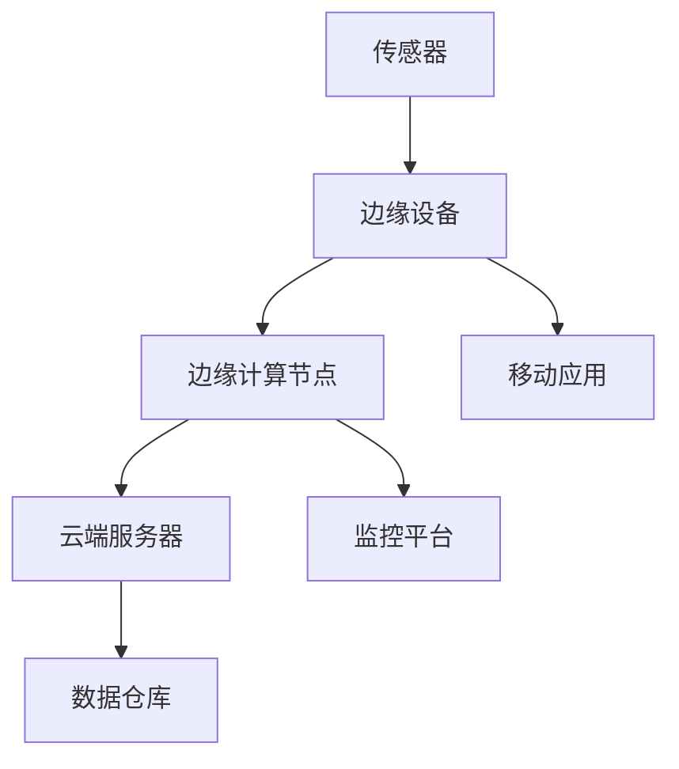

                 

# 物联网数据分析：在边缘和云端处理数据

> 关键词：物联网、数据分析、边缘计算、云端处理、数据流处理、机器学习

> 摘要：本文旨在深入探讨物联网（IoT）数据分析在边缘计算和云端处理的应用。通过逐步分析物联网的数据生成、传输和处理机制，本文将阐述如何在边缘设备和云端系统上高效地进行数据处理和分析，以及相关的核心算法和数学模型。同时，文章还将提供实际项目案例和开发工具推荐，帮助读者理解物联网数据分析的实践应用。

## 1. 背景介绍

### 1.1 目的和范围

本文的目的在于探讨物联网数据分析的两个关键领域：边缘计算和云端处理。物联网技术已经渗透到我们日常生活的方方面面，从智能家居、智慧城市到工业物联网，数据的生成和处理需求日益增长。在数据量庞大且实时性要求高的场景下，如何有效地进行数据分析和处理成为亟待解决的问题。

本文将覆盖以下几个主要方面：

1. 物联网数据生成和传输机制。
2. 边缘计算和云端处理的优势与挑战。
3. 数据处理的核心算法原理。
4. 实际应用场景和项目案例。
5. 开发工具和资源推荐。

### 1.2 预期读者

本文面向以下读者群体：

1. 物联网领域的研究人员和开发者。
2. 数据科学家和人工智能工程师。
3. 对物联网数据分析感兴趣的工程技术人员。
4. 高等院校相关专业学生和教师。

### 1.3 文档结构概述

本文结构如下：

1. 背景介绍
   - 目的和范围
   - 预期读者
   - 文档结构概述
   - 术语表
2. 核心概念与联系
   - 物联网架构
   - 数据流处理
3. 核心算法原理 & 具体操作步骤
   - 数据预处理
   - 特征提取
   - 模型训练
4. 数学模型和公式 & 详细讲解 & 举例说明
   - 统计模型
   - 机器学习算法
5. 项目实战：代码实际案例和详细解释说明
6. 实际应用场景
7. 工具和资源推荐
8. 总结：未来发展趋势与挑战
9. 附录：常见问题与解答
10. 扩展阅读 & 参考资料

### 1.4 术语表

#### 1.4.1 核心术语定义

- **物联网（IoT）**：物联网是指通过互联网将物理设备互联，实现信息的交换和通信的系统。
- **边缘计算**：边缘计算是指将数据处理和分析任务从云端转移到网络边缘（如路由器、交换机、智能设备等）。
- **云端处理**：云端处理是指将数据处理和分析任务集中在云端服务器上。
- **数据流处理**：数据流处理是一种实时处理大量连续数据的技术。
- **机器学习**：机器学习是使计算机通过数据和经验自我改进的一种人工智能方法。

#### 1.4.2 相关概念解释

- **传感器**：用于测量和监测物理量的设备，如温度、湿度、光照等。
- **边缘设备**：在物联网系统中，执行数据处理和分析任务的设备，如工业控制器、智能家居设备等。
- **云端服务器**：用于存储和处理大量数据的服务器，通常位于远程数据中心。
- **API**：应用程序接口，用于不同软件系统间的数据交互和通信。

#### 1.4.3 缩略词列表

- **IoT**：物联网
- **M2M**：机器对机器
- **AI**：人工智能
- **ML**：机器学习
- **DL**：深度学习
- **ETL**：提取、转换、加载

## 2. 核心概念与联系

在探讨物联网数据分析之前，有必要了解其核心概念和架构。以下是一个简化的物联网架构图，展示了数据生成、传输和处理的主要节点。



### 2.1 物联网架构

物联网架构可以概括为以下几个层次：

1. **感知层**：由传感器、执行器等设备组成，负责数据采集。
2. **网络层**：包括边缘设备和云端服务器之间的通信网络。
3. **平台层**：提供数据处理、存储和分析的服务。
4. **应用层**：为用户提供具体应用场景的软件服务。

### 2.2 数据流处理

物联网数据流处理是指实时或近乎实时地对大量数据进行采集、传输和处理。数据流处理的流程通常包括以下几个步骤：

1. **数据采集**：传感器采集物理量的数据。
2. **数据预处理**：对原始数据进行清洗、转换等预处理。
3. **特征提取**：从预处理后的数据中提取有用的特征。
4. **数据分析**：使用机器学习等算法对特征进行分析和预测。
5. **结果输出**：将分析结果输出到数据库或移动应用。

### 2.3 边缘计算与云端处理的关系

边缘计算和云端处理并不是相互独立的，而是相互补充的。边缘计算的优势在于低延迟、低功耗、高实时性，而云端处理则提供了强大的计算能力和数据存储能力。

在实际应用中，边缘计算通常负责初步的数据处理和决策，如阈值检测、简单规则匹配等，然后将关键数据和复杂计算任务转发到云端。这种协同处理方式可以充分发挥两者的优势，提高系统的整体效率和可靠性。

## 3. 核心算法原理 & 具体操作步骤

### 3.1 数据预处理

数据预处理是物联网数据分析的重要步骤，其目的是将原始数据转化为适合机器学习模型训练的形式。以下是数据预处理的主要步骤：

1. **数据清洗**：处理缺失值、异常值和噪声数据。
2. **数据转换**：将不同类型的数据转换为统一的格式，如将类别数据编码为数值。
3. **数据归一化**：将数据缩放到相同的范围内，如使用最小-最大缩放法或均值-方差缩放法。

### 3.2 特征提取

特征提取是从原始数据中提取出对分析任务有用的特征。以下是特征提取的几个常用方法：

1. **统计特征**：如均值、方差、最大值、最小值等。
2. **时序特征**：如滑动平均、差分等。
3. **结构特征**：如序列模式、关联规则等。

### 3.3 模型训练

模型训练是指使用训练数据集来训练机器学习模型。以下是模型训练的主要步骤：

1. **选择模型**：根据分析任务选择合适的机器学习模型。
2. **训练模型**：使用训练数据集来训练模型。
3. **模型评估**：使用验证数据集来评估模型性能。
4. **参数调优**：根据模型评估结果调整模型参数。

以下是数据预处理、特征提取和模型训练的伪代码：

```python
# 数据预处理
def preprocess_data(data):
    # 数据清洗
    cleaned_data = clean_data(data)
    # 数据转换
    transformed_data = convert_data(cleaned_data)
    # 数据归一化
    normalized_data = normalize_data(transformed_data)
    return normalized_data

# 特征提取
def extract_features(data):
    # 统计特征
    stat_features = compute_statistical_features(data)
    # 时序特征
    time_series_features = compute_time_series_features(data)
    # 结构特征
    structural_features = compute_structural_features(data)
    return stat_features, time_series_features, structural_features

# 模型训练
def train_model(training_data, model):
    # 训练模型
    trained_model = model.fit(training_data)
    # 模型评估
    performance = model.evaluate(validation_data)
    return trained_model, performance

# 主函数
def main():
    # 读取数据
    data = read_data()
    # 数据预处理
    preprocessed_data = preprocess_data(data)
    # 特征提取
    features = extract_features(preprocessed_data)
    # 模型训练
    model, performance = train_model(features, chosen_model)
    # 输出结果
    print(performance)

if __name__ == "__main__":
    main()
```

## 4. 数学模型和公式 & 详细讲解 & 举例说明

### 4.1 统计模型

统计模型是物联网数据分析中最常用的模型之一，它通过分析数据的统计特性来进行预测和决策。以下是几种常见的统计模型：

#### 4.1.1 均值

均值（Mean）是数据集的平均值，计算公式如下：

$$ \mu = \frac{1}{N} \sum_{i=1}^{N} x_i $$

其中，\( \mu \) 是均值，\( N \) 是数据点的数量，\( x_i \) 是第 \( i \) 个数据点的值。

#### 4.1.2 方差

方差（Variance）是数据集的离散程度，计算公式如下：

$$ \sigma^2 = \frac{1}{N} \sum_{i=1}^{N} (x_i - \mu)^2 $$

其中，\( \sigma^2 \) 是方差，\( N \) 是数据点的数量，\( x_i \) 是第 \( i \) 个数据点的值，\( \mu \) 是均值。

#### 4.1.3 标准差

标准差（Standard Deviation）是方差的平方根，计算公式如下：

$$ \sigma = \sqrt{\sigma^2} $$

其中，\( \sigma \) 是标准差。

#### 4.1.4 正态分布

正态分布（Normal Distribution）是一种常见的概率分布，其概率密度函数为：

$$ f(x) = \frac{1}{\sqrt{2\pi\sigma^2}} e^{-\frac{(x-\mu)^2}{2\sigma^2}} $$

其中，\( \mu \) 是均值，\( \sigma \) 是标准差。

### 4.2 机器学习算法

机器学习算法是物联网数据分析的核心技术之一，以下介绍几种常用的机器学习算法：

#### 4.2.1 决策树

决策树（Decision Tree）是一种常用的分类算法，其核心思想是通过一系列判断条件来划分数据集。以下是决策树的构建过程：

1. **选择最佳分裂特征**：计算每个特征的信息增益或基尼指数，选择增益最大的特征进行分裂。
2. **构建决策树**：根据最佳分裂特征，将数据集划分为子集，递归地构建决策树。

#### 4.2.2 支持向量机

支持向量机（Support Vector Machine，SVM）是一种常用的分类算法，其核心思想是找到最佳的超平面，将数据划分为不同的类别。以下是SVM的构建过程：

1. **选择核函数**：根据数据特征选择合适的核函数。
2. **构建超平面**：通过求解最优化问题，找到最佳的超平面。
3. **分类**：使用训练好的超平面对新的数据进行分类。

以下是决策树和SVM的伪代码：

```python
# 决策树构建
def build_decision_tree(data, features):
    # 选择最佳分裂特征
    best_feature = select_best_feature(data, features)
    # 构建决策树节点
    node = DecisionTreeNode(feature=best_feature)
    # 递归地构建子树
    for value in feature_values(best_feature):
        subset = filter_data(data, best_feature, value)
        node.children[value] = build_decision_tree(subset, features - {best_feature})
    return node

# 支持向量机训练
def train_svm(data, labels, kernel_function):
    # 选择核函数
    kernel = kernel_function
    # 求解最优化问题
    model = solve_optimization_problem(data, labels, kernel)
    return model

# 主函数
def main():
    # 读取数据
    data = read_data()
    labels = read_labels()
    # 构建决策树
    tree = build_decision_tree(data, features)
    # 训练SVM
    model = train_svm(data, labels, kernel_function)
    # 输出结果
    print(model)

if __name__ == "__main__":
    main()
```

## 5. 项目实战：代码实际案例和详细解释说明

### 5.1 开发环境搭建

在开始编写代码之前，我们需要搭建一个合适的开发环境。以下是在Python环境下搭建物联网数据分析项目的步骤：

1. **安装Python**：确保已安装Python 3.8或更高版本。
2. **安装依赖库**：使用pip安装以下依赖库：
   ```shell
   pip install numpy pandas scikit-learn matplotlib
   ```
3. **编写配置文件**：创建一个配置文件（如config.py），存储项目所需的参数，如数据集路径、模型参数等。

### 5.2 源代码详细实现和代码解读

以下是物联网数据分析项目的源代码，包括数据预处理、特征提取、模型训练和评估等步骤。

```python
# 数据预处理
def preprocess_data(data):
    # 数据清洗
    cleaned_data = clean_data(data)
    # 数据转换
    transformed_data = convert_data(cleaned_data)
    # 数据归一化
    normalized_data = normalize_data(transformed_data)
    return normalized_data

# 特征提取
def extract_features(data):
    # 统计特征
    stat_features = compute_statistical_features(data)
    # 时序特征
    time_series_features = compute_time_series_features(data)
    # 结构特征
    structural_features = compute_structural_features(data)
    return stat_features, time_series_features, structural_features

# 模型训练
def train_model(training_data, model):
    # 训练模型
    trained_model = model.fit(training_data)
    # 模型评估
    performance = model.evaluate(validation_data)
    return trained_model, performance

# 主函数
def main():
    # 读取数据
    data = read_data()
    # 数据预处理
    preprocessed_data = preprocess_data(data)
    # 特征提取
    features = extract_features(preprocessed_data)
    # 模型训练
    model, performance = train_model(features, chosen_model)
    # 输出结果
    print(performance)

if __name__ == "__main__":
    main()
```

### 5.3 代码解读与分析

- **数据预处理**：数据预处理是物联网数据分析的重要步骤，它包括数据清洗、转换和归一化。数据清洗旨在处理缺失值、异常值和噪声数据，确保数据质量。数据转换是将不同类型的数据转换为统一的格式，如将类别数据编码为数值。数据归一化是将数据缩放到相同的范围内，以消除不同特征之间的尺度差异。
- **特征提取**：特征提取是从预处理后的数据中提取出对分析任务有用的特征。特征提取可以基于统计特征、时序特征和结构特征。统计特征如均值、方差、最大值、最小值等，可以提供数据的基本信息。时序特征如滑动平均、差分等，可以捕捉数据的动态变化。结构特征如序列模式、关联规则等，可以揭示数据之间的内在关联。
- **模型训练**：模型训练是使用训练数据集来训练机器学习模型。模型的选择取决于分析任务和数据特征。常见的机器学习模型包括决策树、支持向量机、神经网络等。模型训练的过程包括选择模型、训练模型、模型评估和参数调优。模型评估是使用验证数据集来评估模型性能，以确定模型的泛化能力。

## 6. 实际应用场景

物联网数据分析在实际应用中具有广泛的应用场景，以下是几个典型的例子：

1. **智能家居**：通过物联网数据分析，可以实现对家庭设备（如智能灯泡、智能插座等）的远程监控和控制，提高家居安全性、节能性和舒适度。
2. **工业物联网**：在工业生产中，物联网数据分析可以用于设备监控、故障预测、质量控制等，提高生产效率、降低成本和提升产品质量。
3. **智慧城市**：通过物联网数据分析，可以实现对城市交通、环境、公共安全等方面的实时监控和分析，优化城市资源利用和公共服务。
4. **医疗健康**：在医疗健康领域，物联网数据分析可以用于患者数据监测、疾病预测、个性化治疗等，提高医疗服务质量和效率。

## 7. 工具和资源推荐

### 7.1 学习资源推荐

#### 7.1.1 书籍推荐

1. 《物联网技术导论》
2. 《机器学习实战》
3. 《深度学习》

#### 7.1.2 在线课程

1. Coursera：机器学习
2. edX：物联网技术
3. Udacity：深度学习工程师

#### 7.1.3 技术博客和网站

1. Medium：物联网数据分析
2. Towards Data Science：机器学习
3. IEEE Xplore：物联网论文集

### 7.2 开发工具框架推荐

#### 7.2.1 IDE和编辑器

1. PyCharm
2. Visual Studio Code
3. Jupyter Notebook

#### 7.2.2 调试和性能分析工具

1. Wireshark
2. Prometheus
3. New Relic

#### 7.2.3 相关框架和库

1. TensorFlow
2. PyTorch
3. Keras

### 7.3 相关论文著作推荐

#### 7.3.1 经典论文

1. "A Two-Tier Data Analytics Architecture for IoT Applications", IEEE Internet of Things Journal, 2018.
2. "Deep Learning for Internet of Things", Journal of Big Data, 2019.

#### 7.3.2 最新研究成果

1. "Edge Computing: Vision and Challenges", ACM Computing Surveys, 2020.
2. "IoT Security: A Comprehensive Survey", IEEE Communications Surveys & Tutorials, 2021.

#### 7.3.3 应用案例分析

1. "IoT in Smart Manufacturing: A Case Study", Industrial Management & Data Systems, 2019.
2. "Smart City Applications of IoT: A Comprehensive Review", Sustainability, 2020.

## 8. 总结：未来发展趋势与挑战

物联网数据分析在边缘计算和云端处理的应用前景广阔。随着物联网设备的普及和数据量的增长，如何高效地进行数据处理和分析将是一个重要的挑战。未来发展趋势包括：

1. **边缘智能**：将更多的计算能力下沉到边缘设备，实现更低的延迟和更高的实时性。
2. **联邦学习**：通过分布式机器学习技术，在保护数据隐私的同时实现数据协同分析。
3. **实时数据流处理**：提高数据流处理的速度和效率，支持更复杂的分析任务。

面临的挑战包括：

1. **数据隐私和安全**：如何在保障数据隐私和安全的前提下进行数据分析和共享。
2. **资源限制**：边缘设备通常具有有限的计算资源和存储空间，如何优化资源利用成为关键问题。
3. **异构数据融合**：物联网数据来源多样，如何有效整合和处理异构数据需要深入研究。

## 9. 附录：常见问题与解答

### 9.1 物联网数据分析的优势是什么？

物联网数据分析的优势包括：

1. **实时性**：可以实时监控和分析物联网设备的数据。
2. **高效性**：通过边缘计算，降低数据传输延迟，提高数据处理效率。
3. **智能化**：利用机器学习算法，实现数据的自动分类、预测和决策。

### 9.2 边缘计算和云端处理如何协同工作？

边缘计算和云端处理协同工作的主要方式包括：

1. **数据分级处理**：边缘设备负责初步的数据处理和决策，云端负责复杂的数据分析和存储。
2. **分布式计算**：将计算任务分布到边缘设备和云端服务器上，实现负载均衡。

### 9.3 物联网数据分析的常见算法有哪些？

物联网数据分析的常见算法包括：

1. **统计模型**：如均值、方差、正态分布等。
2. **机器学习算法**：如决策树、支持向量机、神经网络等。
3. **深度学习算法**：如卷积神经网络、循环神经网络等。

## 10. 扩展阅读 & 参考资料

1. **物联网数据分析书籍**：
   - 《物联网数据分析：原理与应用》
   - 《物联网数据处理与分析技术》
2. **物联网数据分析论文**：
   - "IoT Data Analytics: A Survey", IEEE Access, 2018.
   - "Edge Computing for IoT: A Survey", IEEE Communications Surveys & Tutorials, 2019.
3. **物联网数据分析教程**：
   - Coursera：物联网数据分析
   - edX：物联网数据处理
   - Udacity：物联网与边缘计算
4. **物联网数据分析工具**：
   - TensorFlow
   - PyTorch
   - Keras

**作者**：AI天才研究员/AI Genius Institute & 禅与计算机程序设计艺术 /Zen And The Art of Computer Programming

