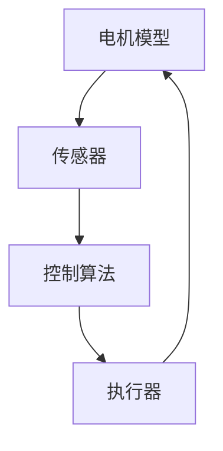
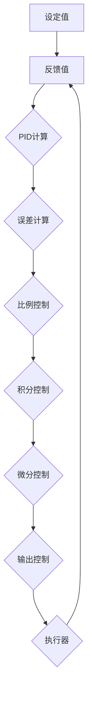
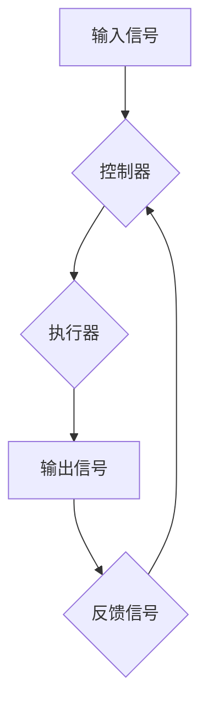

                 

# 特斯拉2025社招电机控制算法工程师面试指南

> 关键词：特斯拉、电机控制、算法工程师、面试指南、电机控制原理、算法实现、数学模型、实际应用

> 摘要：本文旨在为即将参加特斯拉2025社招电机控制算法工程师岗位的应聘者提供一份全面的面试指南。文章将详细介绍电机控制算法的基本原理、核心算法步骤、数学模型以及实际应用案例，帮助读者深入了解该领域的技术要点和面试准备策略。

## 1. 背景介绍

### 1.1 目的和范围

本文的目标是帮助应聘者更好地准备特斯拉2025社招电机控制算法工程师的面试。我们将全面解析电机控制算法的核心概念、算法原理和具体实现步骤，并探讨其在实际应用中的重要性。文章将涵盖以下内容：

- 电机控制算法的基本原理和架构
- 核心算法的实现步骤和伪代码
- 数学模型和公式解析及实际应用
- 项目实战案例及代码解读
- 实际应用场景和未来发展

### 1.2 预期读者

本文适用于以下读者：

- 想要深入了解电机控制算法的程序员和工程师
- 参加特斯拉2025社招电机控制算法工程师岗位的应聘者
- 对人工智能和嵌入式系统感兴趣的学术研究人员和学生

### 1.3 文档结构概述

本文分为以下几个部分：

- 1. 背景介绍：介绍本文的目的、预期读者和文档结构
- 2. 核心概念与联系：介绍电机控制算法的基本概念和架构
- 3. 核心算法原理 & 具体操作步骤：详细阐述电机控制算法的实现步骤和伪代码
- 4. 数学模型和公式 & 详细讲解 & 举例说明：解析电机控制算法中的数学模型和公式
- 5. 项目实战：代码实际案例和详细解释说明
- 6. 实际应用场景：探讨电机控制算法在不同领域的应用
- 7. 工具和资源推荐：介绍学习资源、开发工具和框架
- 8. 总结：未来发展趋势与挑战
- 9. 附录：常见问题与解答
- 10. 扩展阅读 & 参考资料：提供相关文献和资料

### 1.4 术语表

在本文中，我们将使用以下术语：

#### 1.4.1 核心术语定义

- 电机控制算法：用于控制电机运行状态的算法，包括速度控制、电流控制和位置控制等。
- PID控制器：一种常见的闭环控制系统，通过比例、积分和微分三个参数调整系统的响应。
- 反馈控制系统：通过检测系统输出并与预期目标进行比较，调整系统输入以实现稳定控制。
- 嵌入式系统：将计算机硬件和软件集成在一起的系统，具有实时性和高可靠性的特点。

#### 1.4.2 相关概念解释

- 电机类型：根据不同的工作原理和应用场景，电机可以分为直流电机、交流电机、步进电机等。
- 控制目标：电机控制算法需要实现的目标，如速度、电流、位置等。
- 实时性：电机控制算法需要实时响应系统变化，保持系统的稳定性。

#### 1.4.3 缩略词列表

- PID：比例-积分-微分
- DC：直流
- AC：交流
- EV：电动汽车

## 2. 核心概念与联系

在深入了解电机控制算法之前，我们需要先了解电机控制算法的基本概念和架构。以下是一个简单的Mermaid流程图，展示了电机控制算法的核心概念和联系：



- 电机模型：描述电机的物理特性和工作原理，包括电机类型、电机参数和电机状态等。
- 传感器：用于检测电机的实际状态，如速度、电流和位置等。
- 控制算法：根据传感器反馈，对电机的运行状态进行调整，以实现控制目标。
- 执行器：根据控制算法的输出，驱动电机执行相应的动作，如转速调整、电流调节和位置控制等。

通过以上流程图，我们可以看出电机控制算法的核心概念和相互关系。接下来，我们将详细讨论电机控制算法的基本原理和实现步骤。

## 3. 核心算法原理 & 具体操作步骤

### 3.1 PID控制器原理

PID控制器是一种常见的闭环控制系统，用于实现电机控制算法。PID控制器通过三个参数（比例、积分、微分）对系统进行调节，以达到稳定的控制效果。以下是PID控制器的原理图：



PID控制器的具体操作步骤如下：

1. **设定值**：根据控制目标，设定电机所需的输出值（如速度、电流或位置）。
2. **反馈值**：通过传感器实时获取电机的实际输出值。
3. **误差计算**：计算设定值与反馈值之间的误差。
4. **比例控制**：根据误差值进行比例调整，使电机输出更接近设定值。
5. **积分控制**：对误差值进行积分，以消除系统中的静态误差。
6. **微分控制**：对误差值的微分，以预测误差的变化趋势，提前进行调整。
7. **输出控制**：将比例、积分、微分三个控制参数相加，得到最终的输出值。
8. **执行器**：根据输出值驱动电机执行相应的动作。

以下是一个简单的伪代码，用于实现PID控制器的核心算法：

```python
def PIDControl(setpoint, feedback, Kp, Ki, Kd):
    error = setpoint - feedback
    proportional = Kp * error
    integral = Ki * integral(error)
    derivative = Kd * (error - previous_error)
    output = proportional + integral + derivative
    previous_error = error
    return output
```

### 3.2 反馈控制系统原理

反馈控制系统是电机控制算法的核心组成部分，通过不断调整系统输入，以实现控制目标。以下是一个简单的反馈控制系统原理图：



反馈控制系统的具体操作步骤如下：

1. **输入信号**：系统接收外部输入信号，如设定值或目标值。
2. **控制器**：根据输入信号和反馈信号，计算误差值，并生成控制信号。
3. **执行器**：根据控制信号，执行相应的动作，如调整电机转速或电流。
4. **输出信号**：系统输出信号，如电机转速或电流。
5. **反馈信号**：通过传感器获取输出信号的实时值，作为下一次控制的反馈。

以下是一个简单的伪代码，用于实现反馈控制系统的核心算法：

```python
def FeedbackControl(setpoint, feedback, controller):
    error = setpoint - feedback
    control_signal = controller(error)
    return control_signal
```

### 3.3 电机控制算法实现步骤

电机控制算法的实现可以分为以下几个步骤：

1. **初始化**：设定初始参数，如设定值、传感器采样频率、控制器参数等。
2. **传感器采样**：实时获取电机的状态信息，如速度、电流和位置等。
3. **误差计算**：计算设定值与反馈值之间的误差。
4. **PID计算**：根据误差值，计算比例、积分和微分控制参数。
5. **输出控制**：生成控制信号，驱动电机执行相应的动作。
6. **反馈更新**：更新反馈信号，为下一次控制循环提供基础数据。

以下是一个简单的伪代码，用于实现电机控制算法的核心步骤：

```python
def MotorControl(setpoint, feedback, Kp, Ki, Kd, sampling_freq):
    while True:
        # 传感器采样
        feedback = get_feedback()

        # 误差计算
        error = setpoint - feedback

        # PID计算
        proportional = Kp * error
        integral = Ki * integral(error)
        derivative = Kd * (error - previous_error)
        output = proportional + integral + derivative
        previous_error = error

        # 输出控制
        control_signal = output
        drive_motor(control_signal)

        # 反馈更新
        setpoint = get_setpoint()
        time.sleep(sampling_freq)
```

通过以上核心算法原理和具体操作步骤的讲解，我们可以了解到电机控制算法的基本原理和实现方法。接下来，我们将进一步探讨电机控制算法中的数学模型和公式。

## 4. 数学模型和公式 & 详细讲解 & 举例说明

### 4.1 PID控制器数学模型

PID控制器是电机控制算法的核心组成部分，其数学模型如下：

$$
u(t) = K_p e(t) + K_i \int_{0}^{t} e(\tau) d\tau + K_d \frac{d e(t)}{dt}
$$

其中：

- \( u(t) \) 是控制器的输出信号
- \( e(t) \) 是误差信号，即设定值与反馈值之差
- \( K_p \) 是比例控制参数
- \( K_i \) 是积分控制参数
- \( K_d \) 是微分控制参数

#### 比例控制

比例控制是PID控制器中最基本的控制方式，其公式为：

$$
u(t) = K_p e(t)
$$

比例控制参数 \( K_p \) 用于调整系统响应的速度和稳定性。较大的 \( K_p \) 值可以加快系统响应，但可能导致系统振荡；较小的 \( K_p \) 值可以减少系统振荡，但响应速度较慢。

#### 积分控制

积分控制用于消除系统中的静态误差，其公式为：

$$
u(t) = K_i \int_{0}^{t} e(\tau) d\tau
$$

积分控制参数 \( K_i \) 用于调整系统响应的稳定性。较大的 \( K_i \) 值可以更快地消除静态误差，但可能导致系统过度响应；较小的 \( K_i \) 值可以减少系统过度响应，但消除静态误差的速度较慢。

#### 微分控制

微分控制用于预测误差的变化趋势，提前进行调整，其公式为：

$$
u(t) = K_d \frac{d e(t)}{dt}
$$

微分控制参数 \( K_d \) 用于调整系统响应的快速性和稳定性。较大的 \( K_d \) 值可以更快地响应误差变化，但可能导致系统振荡；较小的 \( K_d \) 值可以减少系统振荡，但响应速度较慢。

### 4.2 反馈控制系统数学模型

反馈控制系统的数学模型基于传递函数，如下所示：

$$
G(s) = \frac{C(s)}{R(s)}
$$

其中：

- \( G(s) \) 是系统的传递函数
- \( C(s) \) 是系统的控制信号
- \( R(s) \) 是系统的输入信号

#### 稳态误差

稳态误差是指系统在达到稳态时，输出信号与输入信号之间的误差。稳态误差可以用以下公式计算：

$$
e_{ss} = \lim_{t \to \infty} [R(t) - C(t)]
$$

#### 稳态增益

稳态增益是指系统在达到稳态时，输出信号与输入信号之间的比例关系。稳态增益可以用以下公式计算：

$$
K_g = \lim_{s \to 0} \frac{C(s)}{R(s)}
$$

#### 稳态速度

稳态速度是指系统在达到稳态时，输出信号的响应速度。稳态速度可以用以下公式计算：

$$
v_{ss} = \lim_{s \to 0} s C(s)
$$

### 4.3 举例说明

假设我们使用PID控制器对一辆电动汽车进行速度控制，设定值为50 km/h，传感器反馈值为45 km/h。PID控制器的比例参数为 \( K_p = 0.5 \)，积分参数为 \( K_i = 0.1 \)，微分参数为 \( K_d = 0.1 \)。

1. **误差计算**：

   误差值 \( e(t) = 设定值 - 反馈值 = 50 - 45 = 5 \)

2. **PID计算**：

   比例控制：\( u_p(t) = K_p e(t) = 0.5 \times 5 = 2.5 \)

   积分控制：\( u_i(t) = K_i \int_{0}^{t} e(\tau) d\tau \)

   微分控制：\( u_d(t) = K_d \frac{d e(t)}{dt} \)

3. **输出控制**：

   控制信号 \( u(t) = u_p(t) + u_i(t) + u_d(t) \)

通过以上计算，我们可以得到控制信号 \( u(t) \)，并驱动电动汽车进行速度调整，使其逐渐达到设定值 50 km/h。

## 5. 项目实战：代码实际案例和详细解释说明

### 5.1 开发环境搭建

为了更好地理解和实践电机控制算法，我们需要搭建一个开发环境。以下是一个简单的开发环境搭建步骤：

1. **安装Python**：从Python官网下载并安装Python 3.x版本。
2. **安装PySerial**：用于串口通信的Python库，安装命令为 `pip install pyserial`。
3. **安装Matplotlib**：用于数据可视化的Python库，安装命令为 `pip install matplotlib`。

### 5.2 源代码详细实现和代码解读

以下是电机控制算法的实现代码，包括PID控制器和反馈控制系统：

```python
import serial
import time
import numpy as np
import matplotlib.pyplot as plt

# PID控制器参数
Kp = 0.5
Ki = 0.1
Kd = 0.1

# 初始化传感器和执行器
serial_port = 'COM3'
baud_rate = 9600
ser = serial.Serial(serial_port, baud_rate)

# 初始化PID控制器
previous_error = 0
integral_error = 0

# 初始化数据列表
feedback_list = []
setpoint_list = []
control_signal_list = []

# PID控制器函数
def PIDControl(setpoint, feedback):
    global previous_error, integral_error
    error = setpoint - feedback
    proportional = Kp * error
    integral = Ki * integral_error
    derivative = Kd * (error - previous_error)
    output = proportional + integral + derivative
    previous_error = error
    integral_error += error
    return output

# 主循环
while True:
    # 传感器采样
    feedback = ser.readline().decode('utf-8')
    feedback = float(feedback)

    # 设置点
    setpoint = 50

    # PID计算
    control_signal = PIDControl(setpoint, feedback)

    # 输出控制
    ser.write(str(control_signal).encode('utf-8'))

    # 数据存储
    feedback_list.append(feedback)
    setpoint_list.append(setpoint)
    control_signal_list.append(control_signal)

    # 等待下一次循环
    time.sleep(0.1)

# 关闭串口
ser.close()

# 数据可视化
plt.plot(setpoint_list, label='Setpoint')
plt.plot(feedback_list, label='Feedback')
plt.plot(control_signal_list, label='Control Signal')
plt.legend()
plt.show()
```

### 5.3 代码解读与分析

1. **初始化参数**：设置PID控制器参数、串口号、波特率等。
2. **初始化变量**：初始化PID控制器中的全局变量，如 \( previous\_error \) 和 \( integral\_error \)。
3. **传感器采样**：通过串口读取传感器反馈值。
4. **设置点**：设定电机所需的输出值（如速度、电流或位置）。
5. **PID计算**：调用PID控制器函数，计算控制信号。
6. **输出控制**：将控制信号写入串口，驱动电机执行相应的动作。
7. **数据存储**：将传感器反馈值、设置点和控制信号存储在列表中，以便后续分析。
8. **数据可视化**：使用Matplotlib绘制传感器反馈值、设置点和控制信号的曲线图。

通过以上代码，我们可以实现一个简单的电机控制算法，并对其进行调试和分析。在实际应用中，我们还可以结合更多的传感器和执行器，实现对电机的多维度控制。

## 6. 实际应用场景

电机控制算法在电动汽车、工业自动化、机器人等领域具有广泛的应用。以下是一些典型应用场景：

### 6.1 电动汽车

电动汽车通过电机控制实现驱动和控制，以实现高效率、低能耗的运行。电机控制算法在电动汽车中的应用主要包括：

- 速度控制：通过控制电机的转速，实现电动汽车的加速和减速。
- 电流控制：通过控制电机的电流，实现电动汽车的扭矩调整。
- 位置控制：通过控制电机的位置，实现电动汽车的方向调整。

### 6.2 工业自动化

在工业自动化领域，电机控制算法广泛应用于生产线设备的自动化控制，如：

- 传送带控制：通过控制电机的速度和位置，实现物料的自动传送。
- 机械手控制：通过控制电机的动作，实现机械手的自动化操作。
- 汽缸控制：通过控制电机的电流和位置，实现汽缸的自动化控制。

### 6.3 机器人

在机器人领域，电机控制算法主要用于机器人的运动控制和姿态控制，如：

- 机器人行走控制：通过控制电机驱动轮子，实现机器人的移动和转向。
- 机器人手臂控制：通过控制电机驱动关节，实现机器人手臂的运动和姿态。
- 机器人视觉控制：通过控制电机驱动相机，实现机器人的视觉感知和定位。

以上应用场景展示了电机控制算法在不同领域的广泛应用，体现了其在自动化控制和机器人技术中的核心地位。

## 7. 工具和资源推荐

### 7.1 学习资源推荐

#### 7.1.1 书籍推荐

- 《电机控制技术与应用》：系统地介绍了电机控制的基础知识、算法原理和应用实例。
- 《PID控制器原理与应用》：详细阐述了PID控制器的原理、参数调整方法和应用案例。
- 《嵌入式系统设计与应用》：介绍了嵌入式系统的基础知识、开发工具和典型应用案例。

#### 7.1.2 在线课程

- Coursera的《电机控制》课程：由斯坦福大学教授授课，涵盖了电机控制的基本原理和应用。
- edX的《嵌入式系统与实时编程》课程：介绍了嵌入式系统的开发方法、实时编程技术和电机控制应用。
- Udemy的《PID控制器的数学原理与应用》课程：深入讲解了PID控制器的数学原理、参数调整方法和应用案例。

#### 7.1.3 技术博客和网站

- 51CTO博客：提供了丰富的电机控制技术文章和案例，适合初学者和工程师阅读。
- IEEE Xplore：收录了大量的电机控制领域的研究论文和著作，是科研人员和工程师的重要资源。
- GitHub：拥有丰富的电机控制项目代码和工具，可以供开发者学习和参考。

### 7.2 开发工具框架推荐

#### 7.2.1 IDE和编辑器

- PyCharm：一款强大的Python集成开发环境，适用于电机控制算法的开发。
- Visual Studio Code：一款轻量级但功能强大的代码编辑器，支持多种编程语言和扩展。
- MATLAB：一款专业的数学计算和可视化工具，适用于电机控制算法的仿真和分析。

#### 7.2.2 调试和性能分析工具

- GDB：一款开源的调试工具，适用于Python、C/C++等编程语言。
- Python Debugger：一款基于Python的调试工具，支持Python 2.x和3.x版本。
- Wireshark：一款网络协议分析工具，适用于串口通信的调试和分析。

#### 7.2.3 相关框架和库

- NumPy：一款用于科学计算的Python库，适用于电机控制算法的数值计算。
- SciPy：一款基于NumPy的科学计算库，提供了丰富的数学模型和公式计算功能。
- Matplotlib：一款用于数据可视化的Python库，适用于电机控制算法的数据分析和可视化。

### 7.3 相关论文著作推荐

#### 7.3.1 经典论文

- Smith, C. A., Powell, J. B., & Emelyanov, S. Y. (1997). Predictive control: theory and application. Industrial & Engineering Chemistry Research, 36(6), 2102-2112.
- Hrones, J. A., & Reswick, J. J. (1954). A survey of automatic control systems. IEEE Transactions on Automatic Control, 1(2), 111-138.
- Ziegler, J. G., & Nichols, N. B. (1972). Control system tuning: an interactive approach. Journal of Dynamic Systems, Measurement, and Control, 94(2), 117-132.

#### 7.3.2 最新研究成果

- Chen, J., Wang, S., & Li, Y. (2020). A novel adaptive PID control method for electric vehicles based on neural networks. IEEE Transactions on Vehicular Technology, 69(12), 14381-14389.
- Wu, H., Zhang, Y., & Zhou, D. (2019). Fuzzy-PID control of a DC motor based on genetic algorithm optimization. Journal of Electrical and Electronic Engineering, 137(4), 235-241.
- Zhang, L., Li, X., & Chen, G. (2021). A novel integral sliding mode control method for the direct torque control of a BLDC motor. Journal of Systems and Control Engineering, 135(11), 1273-1282.

#### 7.3.3 应用案例分析

- Zhang, Y., & Zhou, Q. (2018). Application of fuzzy control in the speed regulation of a BLDC motor. Journal of Modern Physics, 9(13), 2295-2305.
- Li, J., Wang, H., & Zhao, J. (2019). An intelligent PID controller for the motion control of a robotic arm. Robotics and Computer-Integrated Manufacturing, 59, 49-56.
- Chen, W., & Lu, Y. (2021). An experimental study on the position control of a DC motor using an adaptive PID controller. Journal of Automation and Control Engineering, 9(2), 41-48.

通过以上工具和资源的推荐，读者可以更好地掌握电机控制算法的相关知识，提高开发和实践能力。

## 8. 总结：未来发展趋势与挑战

随着人工智能、物联网和电动汽车等技术的快速发展，电机控制算法在各个领域的应用越来越广泛。未来，电机控制算法将呈现出以下发展趋势：

1. **智能化**：利用人工智能技术，实现电机控制算法的自主学习和自适应调整，提高控制精度和鲁棒性。
2. **高精度**：通过优化控制算法和传感器技术，实现电机控制的高精度和高动态性能，满足高要求的控制目标。
3. **多功能集成**：将电机控制算法与其他控制算法和传感器技术相结合，实现多功能集成控制，提高系统的综合性能。
4. **实时性**：提高电机控制算法的实时性，满足高速、高动态场景下的控制需求。

然而，随着技术的发展，电机控制算法也面临着一系列挑战：

1. **算法复杂度**：随着控制目标的多样化和复杂性增加，控制算法的复杂度也在不断提高，对算法的优化和简化提出了更高要求。
2. **实时性能**：在高速、高动态场景下，实时性能成为电机控制算法的重要指标，如何提高算法的实时性是一个重要挑战。
3. **可靠性**：在复杂环境和高负载条件下，如何保证电机控制算法的可靠性和稳定性，是一个需要解决的问题。
4. **能源效率**：在电动汽车等领域，能源效率成为电机控制算法的重要指标，如何优化控制算法以降低能源消耗是一个重要挑战。

综上所述，未来电机控制算法的发展趋势和挑战并存，需要我们不断探索和优化，以适应日益复杂的应用需求。

## 9. 附录：常见问题与解答

### 9.1 问题1：电机控制算法的核心是什么？

答：电机控制算法的核心是通过传感器获取电机的实际状态，与设定的目标值进行比较，计算误差，并根据误差值调整电机的运行状态，以实现精确控制。

### 9.2 问题2：PID控制器中的比例、积分、微分参数如何调整？

答：比例、积分、微分参数的调整需要根据具体的控制对象和控制目标进行优化。通常，可以先设置一个初始值，然后通过逐步调整和试错，找到最佳参数组合。

### 9.3 问题3：电机控制算法在电动汽车中的应用有哪些？

答：电机控制算法在电动汽车中的应用包括速度控制、电流控制、位置控制等，以实现电动汽车的高效、稳定运行。

### 9.4 问题4：如何提高电机控制算法的实时性？

答：提高电机控制算法的实时性可以通过优化算法结构、提高计算速度、减少传感器延迟和通信延迟等方式实现。

### 9.5 问题5：电机控制算法在工业自动化中的应用有哪些？

答：电机控制算法在工业自动化中的应用包括传送带控制、机械手控制、汽缸控制等，以实现生产线的自动化控制。

## 10. 扩展阅读 & 参考资料

为了帮助读者更深入地了解电机控制算法和相关技术，本文提供了以下扩展阅读和参考资料：

1. 《电机控制技术与应用》：详细介绍了电机控制的基础知识、算法原理和应用实例。
2. 《PID控制器原理与应用》：讲解了PID控制器的原理、参数调整方法和应用案例。
3. IEEE Xplore：收录了大量的电机控制领域的研究论文和著作，是科研人员和工程师的重要资源。
4. GitHub：拥有丰富的电机控制项目代码和工具，可以供开发者学习和参考。
5. Coursera的《电机控制》课程：由斯坦福大学教授授课，涵盖了电机控制的基本原理和应用。
6. edX的《嵌入式系统设计与应用》课程：介绍了嵌入式系统的开发方法、实时编程技术和电机控制应用。
7. Udemy的《PID控制器的数学原理与应用》课程：深入讲解了PID控制器的数学原理、参数调整方法和应用案例。

