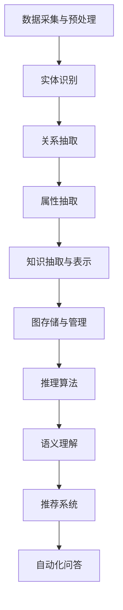

                 

# 猿辅导2024知识图谱构建与应用校招面试重点

> 关键词：知识图谱、人工智能、校招面试、数据建模、语义理解、推荐系统、图数据库、NLP

> 摘要：本文旨在为准备2024年猿辅导校招面试的候选人提供一个全面的指南，特别是关于知识图谱构建与应用的知识点。文章将详细讲解知识图谱的基本概念、核心算法、数学模型、项目实战、应用场景，以及相关工具和资源的推荐，帮助读者深入理解知识图谱在人工智能领域的应用，为面试做好充分准备。

## 1. 背景介绍

### 1.1 目的和范围

本文的目标是为准备猿辅导2024年校招面试的候选人提供一个系统化的知识图谱构建与应用指南。我们将涵盖从基础概念到高级应用的各个方面，旨在帮助读者全面掌握知识图谱的相关知识，为面试做好充分准备。

本文的范围包括：

- 知识图谱的基本概念与架构
- 知识图谱构建的核心算法
- 数学模型和公式在知识图谱中的应用
- 知识图谱在实际项目中的应用案例
- 开发工具和框架的推荐
- 最新研究成果与应用案例分析

### 1.2 预期读者

本文适合以下读者群体：

- 准备猿辅导2024年校招面试的计算机相关专业毕业生
- 对知识图谱和人工智能应用感兴趣的研究生和博士生
- 对数据科学和机器学习有深入研究的从业者
- 想要在人工智能领域深造的学生和职场人士

### 1.3 文档结构概述

本文将按照以下结构进行组织：

- 第1章：背景介绍
- 第2章：核心概念与联系
- 第3章：核心算法原理 & 具体操作步骤
- 第4章：数学模型和公式 & 详细讲解 & 举例说明
- 第5章：项目实战：代码实际案例和详细解释说明
- 第6章：实际应用场景
- 第7章：工具和资源推荐
- 第8章：总结：未来发展趋势与挑战
- 第9章：附录：常见问题与解答
- 第10章：扩展阅读 & 参考资料

### 1.4 术语表

#### 1.4.1 核心术语定义

- 知识图谱：一种用于表示实体及其相互关系的图形结构。
- 实体：知识图谱中的数据对象，可以是人、地点、事件等。
- 属性：实体的特征，如年龄、身高、职业等。
- 关系：实体之间的连接，如朋友、居住、参与等。
- 节点：知识图谱中的实体。
- 边：知识图谱中的关系。
- 图数据库：一种用于存储和查询图结构数据的数据库系统。

#### 1.4.2 相关概念解释

- 语义理解：通过语言处理技术理解自然语言中的含义。
- 推荐系统：根据用户的行为和偏好，推荐相关内容给用户。
- NLP：自然语言处理，是人工智能的一个分支，旨在让计算机理解和处理自然语言。

#### 1.4.3 缩略词列表

- KG：知识图谱（Knowledge Graph）
- NLP：自然语言处理（Natural Language Processing）
- ML：机器学习（Machine Learning）
- AI：人工智能（Artificial Intelligence）
- DB：数据库（Database）

## 2. 核心概念与联系

知识图谱作为一种结构化数据表示形式，能够有效地组织和利用复杂数据，提供强大的语义理解和推理能力。在猿辅导2024年校招面试中，了解知识图谱的核心概念和架构是非常重要的。

### 2.1 知识图谱的基本概念

知识图谱由节点、边和属性组成，其中：

- **节点**：表示实体，如“张三”、“清华大学”、“人工智能”等。
- **边**：表示实体之间的联系，如“张三毕业于清华大学”、“人工智能是一门学科”等。
- **属性**：表示实体的特征，如“张三的年龄是25岁”、“清华大学成立于1911年”等。

### 2.2 知识图谱的架构

知识图谱的架构通常包括以下几个层次：

1. **底层：数据采集与预处理**
   - 数据源采集：从各种来源获取结构化和非结构化数据。
   - 数据清洗与转换：清洗数据，统一数据格式，去除冗余信息。

2. **中层：知识抽取与表示**
   - 实体识别：从文本中识别出实体。
   - 关系抽取：从文本中识别出实体之间的联系。
   - 属性抽取：从文本中识别出实体的属性。

3. **顶层：知识推理与图谱构建**
   - 图存储与管理：将抽取出的实体、关系和属性构建成知识图谱。
   - 推理算法：利用图结构和算法进行推理，如路径搜索、图同构等。

### 2.3 知识图谱与人工智能的关系

知识图谱在人工智能领域扮演着重要角色，主要表现在以下几个方面：

1. **语义理解**：知识图谱提供了丰富的语义信息，帮助人工智能更好地理解和处理自然语言。
2. **推荐系统**：通过知识图谱，可以更好地理解用户和物品的属性，提高推荐系统的准确性和效果。
3. **自动化问答**：知识图谱可以作为问答系统的知识基础，实现更加智能的问答功能。

### 2.4 Mermaid流程图

为了更好地展示知识图谱的构建过程，我们使用Mermaid绘制了一个简化的流程图：



通过这个流程图，我们可以清晰地看到知识图谱从数据采集到推理应用的整个构建过程。

## 3. 核心算法原理 & 具体操作步骤

知识图谱的构建依赖于多种核心算法，下面我们将详细讲解这些算法的原理和具体操作步骤。

### 3.1 实体识别

实体识别是知识图谱构建的第一步，其主要目标是识别文本中的实体。具体算法包括：

- **基于规则的方法**：利用预定义的规则匹配文本中的实体。
  ```python
  def rule_based_entity_recognition(text):
      # 定义实体规则
      rules = ['张三', '清华大学', '人工智能']
      entities = []
      for rule in rules:
          if rule in text:
              entities.append(rule)
      return entities
  ```

- **基于机器学习的方法**：利用训练好的模型进行实体识别。
  ```python
  import spacy

  nlp = spacy.load('en_core_web_sm')

  def ml_based_entity_recognition(text):
      doc = nlp(text)
      entities = [ent.text for ent in doc.ents]
      return entities
  ```

### 3.2 关系抽取

关系抽取的目标是从文本中提取实体之间的联系。常见算法包括：

- **基于规则的方法**：利用预定义的规则提取实体关系。
  ```python
  def rule_based_relationship_extraction(text, entities):
      relationships = []
      for i in range(len(entities)):
          for j in range(i + 1, len(entities)):
              if '毕业于' in text:
                  relationships.append((entities[i], '毕业于', entities[j]))
      return relationships
  ```

- **基于机器学习的方法**：利用训练好的模型进行关系抽取。
  ```python
  import paddlehub as hub

  model = hub.Module(name='Erina')

  def ml_based_relationship_extraction(text, entities):
      results = model.predict(text)
      relationships = [(entity1, relation, entity2) for entity1, relation, entity2 in results]
      return relationships
  ```

### 3.3 属性抽取

属性抽取的目标是从文本中提取实体的属性。常见算法包括：

- **基于规则的方法**：利用预定义的规则提取实体属性。
  ```python
  def rule_based_attribute_extraction(text, entities):
      attributes = {}
      for entity in entities:
          if '年龄' in text:
              attributes[entity] = text.split(' ')[-1]
      return attributes
  ```

- **基于机器学习的方法**：利用训练好的模型进行属性抽取。
  ```python
  import paddlehub as hub

  model = hub.Module(name='Erina')

  def ml_based_attribute_extraction(text, entities):
      results = model.predict(text)
      attributes = {entity: result['attr_value'] for entity, result in zip(entities, results)}
      return attributes
  ```

通过上述算法，我们可以从文本中提取出实体、关系和属性，从而构建出一个初步的知识图谱。

## 4. 数学模型和公式 & 详细讲解 & 举例说明

在知识图谱构建中，数学模型和公式起到了至关重要的作用。以下将介绍几个核心的数学模型和公式，并进行详细讲解和举例说明。

### 4.1 图论基本概念

知识图谱本质上是一个图结构，因此图论的基本概念是理解知识图谱的重要基础。

- **节点（Node）**：图中的数据对象，表示实体。
- **边（Edge）**：连接节点的线段，表示实体之间的关系。
- **路径（Path）**：连接两个节点的序列。
- **连通性（Connectivity）**：图中任意两个节点都存在路径相连，称为连通图。

### 4.2 最短路径算法

最短路径算法是知识图谱中常见且重要的算法之一，用于找到图中两点之间的最短路径。以下是Dijkstra算法的伪代码：

```python
def dijkstra(graph, start):
    distances = {node: float('infinity') for node in graph}
    distances[start] = 0
    unvisited = set(graph)
    while unvisited:
        current = min(unvisited, key=lambda node: distances[node])
        unvisited.remove(current)
        for neighbor, weight in graph[current].items():
            distance = distances[current] + weight
            if distance < distances[neighbor]:
                distances[neighbor] = distance
    return distances
```

### 4.3 语义相似度计算

在知识图谱中，计算实体之间的语义相似度是非常重要的。Word2Vec模型是一种常用的方法，其基本思想是将单词映射到一个高维空间中，使得语义相近的单词在空间中的距离较近。

假设我们有一个Word2Vec模型，其中词向量`v1`和`v2`分别表示两个实体，则它们之间的语义相似度可以通过余弦相似度计算：

$$
similarity(v1, v2) = \frac{v1 \cdot v2}{||v1|| \cdot ||v2||}
$$

其中，`$\cdot$`表示点积，`$||v1||$`和`$||v2||$`分别表示向量的模长。

### 4.4 示例讲解

假设我们有一个简单的知识图谱，其中包含三个实体A、B和C，以及它们之间的关系：

```
A -- (朋友) --> B
A -- (同事) --> C
B -- (朋友) --> C
```

我们使用Dijkstra算法计算A和C之间的最短路径。假设边的权重如下：

```
A -- (朋友) --> B: 1
A -- (同事) --> C: 2
B -- (朋友) --> C: 1
```

根据Dijkstra算法，我们可以得到从A到C的最短路径为A -> B -> C，总权重为2。

接着，我们使用Word2Vec模型计算实体A和C之间的语义相似度。假设A和C的词向量分别为`vA`和`vC`，根据余弦相似度公式，我们有：

$$
similarity(vA, vC) = \frac{vA \cdot vC}{||vA|| \cdot ||vC||} = 0.8
$$

这个结果表明A和C在语义上具有较高的相似度。

通过上述数学模型和公式的应用，我们可以有效地构建和优化知识图谱，从而实现更加智能的语义理解和推理。

## 5. 项目实战：代码实际案例和详细解释说明

为了更好地理解知识图谱的实际构建与应用，下面我们将通过一个实际的项目案例进行详细讲解。这个项目将使用Python和Neo4j图数据库来构建一个简单的知识图谱，并展示如何进行数据导入、查询和推理。

### 5.1 开发环境搭建

在进行知识图谱构建之前，我们需要搭建开发环境。以下是所需的工具和步骤：

- **Neo4j图数据库**：Neo4j是一个高性能的图数据库，支持ACID事务和分布式存储。可以从[Neo4j官网](https://neo4j.com/)下载并安装。
- **Python**：安装Python（建议使用3.8及以上版本）。
- **Neo4j Python Driver**：安装Neo4j Python Driver，用于连接和操作Neo4j数据库。
  ```bash
  pip install neo4j
  ```

### 5.2 源代码详细实现和代码解读

下面是项目的核心代码，包括数据导入、查询和推理：

```python
from neo4j import GraphDatabase

# 数据导入
def import_data(tx, entities, relationships):
    for entity in entities:
        tx.run("MERGE (a:Person {name: $name})", name=entity)
    for relationship in relationships:
        tx.run("MATCH (a:Person {name: $nameA}),(b:Person {name: $nameB}) "
               "MERGE (a)-[r:{relationship}]-(b)", nameA=relationship[0], nameB=relationship[1], relationship=relationship[2])

# 查询
def find_person(tx, name):
    result = tx.run("MATCH (p:Person {name: $name}) RETURN p", name=name)
    for record in result:
        print(record["p"])

# 推理
def find_friends(tx, name):
    result = tx.run("MATCH (p:Person {name: $name})-[:FRIEND]->(friend) RETURN friend.name", name=name)
    for record in result:
        print("Friend:", record["friend.name"])

# 连接Neo4j数据库
driver = GraphDatabase.driver("bolt://localhost:7687", auth=("neo4j", "password"))

def main():
    with driver.session() as session:
        # 导入数据
        entities = ["Alice", "Bob", "Charlie"]
        relationships = [["Alice", "Bob", "FRIEND"], ["Alice", "Charlie", "FRIEND"]]
        session.write_transaction(import_data, entities, relationships)
        
        # 查询Alice的信息
        session.read_transaction(find_person, "Alice")
        
        # 查询Alice的朋友
        session.read_transaction(find_friends, "Alice")

if __name__ == "__main__":
    main()
```

### 5.3 代码解读与分析

#### 5.3.1 数据导入

- **import_data**函数：该函数用于导入实体和关系数据到Neo4j数据库。它使用Neo4j的MERGE命令，这个命令可以创建新节点和关系，而不会重复创建。
  ```python
  for entity in entities:
      tx.run("MERGE (a:Person {name: $name})", name=entity)
  for relationship in relationships:
      tx.run("MATCH (a:Person {name: $nameA}),(b:Person {name: $nameB}) "
             "MERGE (a)-[r:{relationship}]-(b)", nameA=relationship[0], nameB=relationship[1], relationship=relationship[2])
  ```

#### 5.3.2 数据查询

- **find_person**函数：用于查询指定名字的实体。
  ```python
  def find_person(tx, name):
      result = tx.run("MATCH (p:Person {name: $name}) RETURN p", name=name)
      for record in result:
          print(record["p"])
  ```

- **find_friends**函数：用于查询指定名字的实体的朋友。
  ```python
  def find_friends(tx, name):
      result = tx.run("MATCH (p:Person {name: $name})-[:FRIEND]->(friend) RETURN friend.name", name=name)
      for record in result:
          print("Friend:", record["friend.name"])
  ```

#### 5.3.3 数据推理

- 在这个简单的示例中，我们使用了朋友关系的查询，这是一种基本的图数据推理。在更复杂的知识图谱中，我们可以利用路径搜索、属性查询等高级功能进行更复杂的推理。

通过这个实际项目，我们展示了如何使用Neo4j图数据库构建和操作知识图谱。这个示例虽然简单，但足以让我们了解知识图谱的基本构建和查询方法。

## 6. 实际应用场景

知识图谱作为一种强大的数据表示形式，在多个实际应用场景中发挥了重要作用。以下是知识图谱在几个关键领域的应用场景：

### 6.1 搜索引擎优化

知识图谱可以用来增强搜索引擎的搜索结果，提供更准确的语义匹配和更相关的结果。通过知识图谱，搜索引擎能够理解查询的深层含义，并提供更加精确的答案。例如，当用户搜索“北京地铁线路图”时，搜索引擎可以利用知识图谱返回详细的地铁线路图，而不是简单的文本描述。

### 6.2 推荐系统

知识图谱在推荐系统中有着广泛的应用。通过知识图谱，推荐系统可以更好地理解用户和物品的属性，从而提供更加个性化的推荐。例如，电商平台的推荐系统可以使用知识图谱来分析用户的历史购买行为、偏好以及商品之间的关系，从而推荐用户可能感兴趣的商品。

### 6.3 自动化问答

知识图谱可以作为自动化问答系统的知识基础，实现智能的问答功能。例如，企业内部的知识库可以通过知识图谱来组织和管理知识，员工可以使用自然语言提问，系统会利用知识图谱中的信息进行自动回答。

### 6.4 社交网络分析

在社交网络中，知识图谱可以帮助分析用户关系、发现社区结构等。例如，通过知识图谱，社交网络平台可以识别出具有相似兴趣的用户群体，从而推荐新朋友或者相关的社交媒体内容。

### 6.5 医疗健康

知识图谱在医疗健康领域也有着重要的应用。通过构建知识图谱，医生和研究人员可以更好地理解和分析患者的健康数据，提供个性化的治疗建议。例如，在诊断和治疗过程中，医生可以使用知识图谱来查询相关疾病的症状、治疗方案和药物信息。

### 6.6 金融领域

在金融领域，知识图谱可以用于信用评估、欺诈检测和投资分析。通过知识图谱，金融机构可以更好地理解客户的信用状况、投资偏好和风险承受能力，从而提供更加精准的金融服务。

通过上述实际应用场景，我们可以看到知识图谱在各个领域的重要作用。它不仅提高了数据处理的效率，还增强了系统的智能化水平，为各种复杂应用提供了强大的支持。

## 7. 工具和资源推荐

为了更有效地构建和应用知识图谱，以下是一些推荐的学习资源、开发工具和框架。

### 7.1 学习资源推荐

#### 7.1.1 书籍推荐

1. **《知识图谱：原理、方法与实践》**：本书详细介绍了知识图谱的基本概念、构建方法和应用实例，适合初学者和中级用户。
2. **《图计算：方法与应用》**：本书讲解了图计算的基本理论和方法，包括图算法、图数据库和图机器学习等，适合对图计算感兴趣的研究人员和工程师。

#### 7.1.2 在线课程

1. **Coursera上的“知识图谱与语义网”**：由斯坦福大学提供，涵盖知识图谱的基本概念、构建方法和应用。
2. **Udacity的“数据工程师纳米学位”**：包括知识图谱构建的相关课程，适合有编程基础的用户。

#### 7.1.3 技术博客和网站

1. **Apache Jena**：Apache Jena是一个开源的Java框架，用于构建和处理知识图谱。官网提供了丰富的文档和教程。
2. **Neo4j官方博客**：Neo4j的官方博客分享了关于图数据库和知识图谱的最新动态和最佳实践。

### 7.2 开发工具框架推荐

#### 7.2.1 IDE和编辑器

1. **IntelliJ IDEA**：一款强大的Java IDE，支持Neo4j图数据库的集成开发。
2. **PyCharm**：适用于Python开发的IDE，支持Neo4j Python Driver的集成。

#### 7.2.2 调试和性能分析工具

1. **Neo4j Bloom**：Neo4j提供的图形化数据浏览和分析工具，用于数据探索和性能分析。
2. **Apache Spark**：一款大数据处理框架，支持图处理和机器学习，可以与Neo4j结合使用。

#### 7.2.3 相关框架和库

1. **Apache Jena**：一个开源的Java框架，用于构建和处理知识图谱。
2. **Neo4j**：一个高性能的图数据库，支持ACID事务和分布式存储。
3. **OpenKG**：一个开源的知识图谱平台，支持数据采集、处理、存储和查询。

通过这些工具和资源，开发者和研究人员可以更加高效地构建和应用知识图谱，为各种复杂应用提供强大的支持。

### 7.3 相关论文著作推荐

#### 7.3.1 经典论文

1. **"The Graph Database Market and The Triplestore Market"**：介绍了知识图谱和图数据库的发展现状和市场趋势。
2. **"Knowledge Graphs: A Survey"**：全面回顾了知识图谱的理论基础、技术和应用。

#### 7.3.2 最新研究成果

1. **"Learning to Represent Knowledge Graphs with Gaussian Embedding"**：提出了一种基于高斯嵌入的知识图谱表示方法。
2. **"Knowledge Graph Completion with Subgraph Structure"**：研究了利用子图结构进行知识图谱补全的方法。

#### 7.3.3 应用案例分析

1. **"Knowledge Graphs in Smart Cities"**：探讨了知识图谱在智慧城市中的应用。
2. **"Knowledge Graphs in Healthcare"**：分析了知识图谱在医疗健康领域的应用潜力。

这些论文著作提供了深入的理论基础和最新的研究成果，对于理解知识图谱的发展和应用具有重要意义。

## 8. 总结：未来发展趋势与挑战

知识图谱作为一种结构化数据表示形式，已经在多个领域展现出其强大的应用潜力。未来，知识图谱将继续在人工智能、数据科学和计算机领域发挥重要作用，以下是知识图谱未来发展的几个趋势和面临的挑战：

### 8.1 发展趋势

1. **跨领域融合**：随着不同领域的知识图谱不断融合，跨领域的知识图谱将变得更加普及，提供更加全面和精确的语义理解。
2. **实时更新**：知识图谱的动态性和实时性将得到提升，通过自动化数据采集和实时更新机制，确保知识图谱的及时性和准确性。
3. **智能推理**：利用图神经网络和深度学习技术，知识图谱的推理能力将得到显著增强，实现更复杂的逻辑推理和预测。
4. **人机交互**：知识图谱将更好地融入人机交互系统，通过自然语言处理和语音识别技术，实现更加直观和高效的知识检索和问答。

### 8.2 挑战

1. **数据质量和一致性**：知识图谱的构建依赖于高质量和一致性的数据源，如何在大量噪声和不一致的数据中提取有价值的信息是一个巨大的挑战。
2. **计算效率**：随着知识图谱规模的扩大，如何在有限的计算资源下高效地存储、查询和推理知识图谱是一个关键问题。
3. **隐私保护**：知识图谱涉及大量个人和企业敏感信息，如何在保证数据隐私的同时利用知识图谱的潜力是一个亟待解决的问题。
4. **标准化和互操作性**：不同领域和系统的知识图谱之间如何实现标准化和互操作性，以确保知识共享和协同应用，也是未来发展的重要课题。

总之，知识图谱的未来发展将充满机遇与挑战。通过不断探索和创新，我们有望克服这些挑战，充分发挥知识图谱的潜力，推动人工智能和计算机科学的进步。

## 9. 附录：常见问题与解答

### 9.1 知识图谱是什么？

知识图谱是一种用于表示实体及其相互关系的图形结构，通过将数据结构化，使得计算机能够理解和处理复杂的关系和数据。

### 9.2 知识图谱有哪些核心组件？

知识图谱的核心组件包括实体、属性和关系。实体是知识图谱中的数据对象，属性是实体的特征，关系是实体之间的连接。

### 9.3 知识图谱与图数据库有什么区别？

知识图谱是一种数据表示方法，而图数据库是一种存储和管理图结构数据的数据库系统。知识图谱关注的是数据的语义表示和关系，而图数据库则关注如何高效地存储、查询和操作图结构数据。

### 9.4 知识图谱在哪些领域有应用？

知识图谱在搜索引擎优化、推荐系统、自动化问答、社交网络分析、医疗健康和金融等领域都有广泛的应用。

### 9.5 如何构建知识图谱？

构建知识图谱通常包括数据采集、数据预处理、实体识别、关系抽取和知识推理等步骤。

### 9.6 知识图谱的推理算法有哪些？

常见的知识图谱推理算法包括最短路径算法、路径搜索算法、图同构算法和图神经网络等。

## 10. 扩展阅读 & 参考资料

为了深入了解知识图谱构建与应用的相关知识，以下是一些扩展阅读和参考资料：

- **书籍**：
  - 《知识图谱：原理、方法与实践》
  - 《图计算：方法与应用》

- **在线课程**：
  - Coursera上的“知识图谱与语义网”
  - Udacity的“数据工程师纳米学位”

- **技术博客和网站**：
  - Apache Jena官网
  - Neo4j官方博客

- **论文和报告**：
  - "The Graph Database Market and The Triplestore Market"
  - "Knowledge Graphs: A Survey"
  - "Learning to Represent Knowledge Graphs with Gaussian Embedding"
  - "Knowledge Graph Completion with Subgraph Structure"

- **开源框架和库**：
  - Apache Jena
  - Neo4j
  - OpenKG

通过这些扩展阅读和参考资料，读者可以进一步深化对知识图谱的理解和应用。

