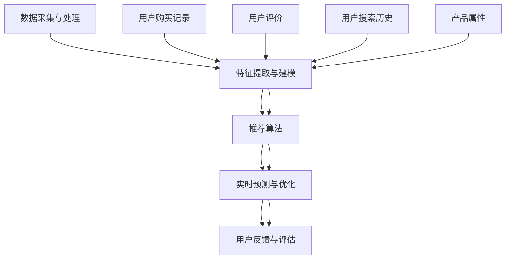

                 

# 珀莱雅2025社招个性化护肤方案推荐系统工程师

> 关键词：个性化护肤、推荐系统、数据挖掘、机器学习、用户建模

> 摘要：本文将详细探讨珀莱雅2025社招个性化护肤方案推荐系统工程师所需掌握的核心技术和方法。文章首先介绍了个性化护肤方案推荐的背景和意义，接着深入分析了推荐系统的基本原理和核心算法，以及如何利用机器学习和数据挖掘技术构建个性化的护肤方案。最后，文章结合实际案例，详细阐述了如何搭建和优化个性化护肤推荐系统，并展望了未来的发展趋势和挑战。

## 1. 背景介绍

### 1.1 目的和范围

本文旨在为珀莱雅2025社招的个性化护肤方案推荐系统工程师提供一套全面的技术指南。本文将涵盖以下内容：

- 个性化护肤方案推荐的背景和意义
- 推荐系统的基本原理和核心算法
- 利用机器学习和数据挖掘技术构建个性化护肤方案
- 实际案例：个性化护肤推荐系统的搭建与优化

### 1.2 预期读者

本文主要面向以下读者群体：

- 有志于从事个性化护肤方案推荐系统开发的工程师
- 对推荐系统和机器学习技术感兴趣的计算机科学和信息技术专业学生
- 对个性化护肤领域有兴趣的消费者

### 1.3 文档结构概述

本文分为以下几个部分：

- 第1部分：背景介绍，包括目的和范围、预期读者、文档结构概述
- 第2部分：核心概念与联系，介绍个性化护肤方案推荐系统的核心概念和架构
- 第3部分：核心算法原理与具体操作步骤，详细讲解推荐系统的核心算法和实现方法
- 第4部分：数学模型和公式，介绍与个性化护肤方案推荐系统相关的主要数学模型和公式
- 第5部分：项目实战，结合实际案例，详细介绍个性化护肤推荐系统的搭建和优化过程
- 第6部分：实际应用场景，探讨个性化护肤方案推荐系统的应用场景和未来发展趋势
- 第7部分：工具和资源推荐，提供相关学习资源和开发工具的推荐
- 第8部分：总结，对个性化护肤方案推荐系统的未来发展趋势和挑战进行展望
- 第9部分：附录，解答常见问题
- 第10部分：扩展阅读和参考资料，提供更多相关领域的深入学习和研究资源

### 1.4 术语表

#### 1.4.1 核心术语定义

- 个性化护肤方案：根据用户皮肤类型、年龄、性别、生活习惯等个性化需求，为用户推荐最适合的护肤产品和服务。
- 推荐系统：一种基于用户行为数据、产品特征数据和知识图谱等技术，为用户推荐个性化内容和服务的系统。
- 机器学习：一种通过算法和模型从数据中自动发现规律和模式的技术。
- 数据挖掘：一种从大量数据中提取有价值信息和知识的过程。
- 用户建模：根据用户的历史行为和特征，建立用户模型，用于推荐系统的个性化推荐。

#### 1.4.2 相关概念解释

- 推荐算法：一种用于生成个性化推荐列表的算法，常见的推荐算法有基于协同过滤、基于内容、基于模型等方法。
- 协同过滤：一种基于用户行为数据的推荐方法，通过计算用户之间的相似度，找到与目标用户兴趣相似的物品进行推荐。
- 基于内容的推荐：一种基于物品特征和用户兴趣的推荐方法，通过比较物品和用户兴趣的相似度，为用户推荐相似的物品。
- 知识图谱：一种将实体、属性和关系组织在一起的结构化数据，用于描述和发现实体之间的关联。

#### 1.4.3 缩略词列表

- AI：人工智能
- ML：机器学习
- DM：数据挖掘
- UI：用户界面
- UE：用户体验
- CTR：点击率
- CV：转化率

## 2. 核心概念与联系

个性化护肤方案推荐系统是珀莱雅2025社招的一项重要任务，它依赖于多种核心概念和技术的协同作用。为了更好地理解这些概念，我们首先需要介绍个性化护肤方案推荐系统的基本原理和架构。

### 2.1 个性化护肤方案推荐系统原理

个性化护肤方案推荐系统主要基于以下几个核心概念：

1. **用户特征建模**：通过对用户的历史行为数据（如购买记录、评价、搜索历史等）进行挖掘和分析，提取用户的个性化特征，如皮肤类型、年龄、性别等。
2. **产品特征建模**：通过对护肤产品的属性和成分进行分析，提取产品特征，如产品类型、功效、成分等。
3. **推荐算法**：基于用户特征和产品特征，使用推荐算法为用户生成个性化的推荐列表。
4. **用户行为预测**：通过对用户的实时行为进行预测，调整推荐策略，提高推荐的准确性和实时性。

### 2.2 个性化护肤方案推荐系统架构

个性化护肤方案推荐系统通常包括以下几个模块：

1. **数据采集与处理模块**：负责收集用户的购买记录、评价、搜索历史等数据，并进行预处理，如数据清洗、去重、归一化等。
2. **特征提取与建模模块**：基于采集到的数据，提取用户和产品的特征，建立用户模型和产品模型。
3. **推荐算法模块**：基于用户和产品模型，使用推荐算法为用户生成个性化的推荐列表。
4. **实时预测与优化模块**：通过实时监控用户行为，调整推荐策略，提高推荐的准确性和实时性。
5. **用户反馈与评估模块**：收集用户对推荐结果的反馈，用于评估推荐效果，为后续优化提供依据。

### 2.3 Mermaid 流程图

为了更好地展示个性化护肤方案推荐系统的原理和架构，我们使用Mermaid绘制了一个流程图：



### 2.4 核心概念原理和架构总结

个性化护肤方案推荐系统通过用户特征建模、产品特征建模、推荐算法和实时预测与优化等核心概念和技术的协同作用，为用户提供个性化的护肤产品推荐。在系统架构上，主要包括数据采集与处理、特征提取与建模、推荐算法、实时预测与优化和用户反馈与评估等模块，形成一个闭环的推荐系统。

## 3. 核心算法原理 & 具体操作步骤

个性化护肤方案推荐系统的核心算法是实现个性化推荐的关键。本节将介绍常用的推荐算法，包括基于协同过滤、基于内容和基于模型的方法，并使用伪代码详细阐述这些算法的实现步骤。

### 3.1 基于协同过滤的推荐算法

协同过滤是一种基于用户行为数据的推荐方法，主要通过计算用户之间的相似度来发现用户的兴趣相似度，进而推荐用户可能感兴趣的物品。协同过滤可以分为基于用户和基于物品的协同过滤。

#### 3.1.1 基于用户的协同过滤（User-based Collaborative Filtering）

**算法原理：**  
- 计算用户之间的相似度：通过用户的历史行为数据（如购买记录、评价等），使用余弦相似度、皮尔逊相关系数等方法计算用户之间的相似度。
- 找到与目标用户最相似的K个用户：对所有用户进行相似度计算，找到与目标用户最相似的K个用户。
- 为目标用户生成推荐列表：根据与目标用户最相似的K个用户的兴趣，为用户生成个性化的推荐列表。

**伪代码：**

```python
# 输入：用户行为数据矩阵R（m*n），目标用户id u，相似度阈值θ，最相似用户数K
# 输出：推荐列表L_u

# 步骤1：计算用户相似度
sim(u, v) = cosine_similarity(R[u], R[v])

# 步骤2：找到与目标用户最相似的K个用户
neighbours = argpartition(sim(u, all_users), K)

# 步骤3：为目标用户生成推荐列表
L_u = {}
for v in neighbours:
    if v != u:
        L_u[v] = R[v]

return L_u
```

#### 3.1.2 基于物品的协同过滤（Item-based Collaborative Filtering）

**算法原理：**  
- 计算物品之间的相似度：通过用户对物品的评价数据，使用余弦相似度、皮尔逊相关系数等方法计算物品之间的相似度。
- 找到与目标物品最相似的K个物品：对所有物品进行相似度计算，找到与目标物品最相似的K个物品。
- 为目标用户生成推荐列表：根据与目标物品最相似的K个物品的用户兴趣，为用户生成个性化的推荐列表。

**伪代码：**

```python
# 输入：用户行为数据矩阵R（m*n），目标物品id i，相似度阈值θ，最相似物品数K
# 输出：推荐列表L_i

# 步骤1：计算物品相似度
sim(i, j) = cosine_similarity(R[i], R[j])

# 步骤2：找到与目标物品最相似的K个物品
neighbours = argpartition(sim(i, all_items), K)

# 步骤3：为目标用户生成推荐列表
L_i = {}
for j in neighbours:
    if j != i:
        L_i[j] = R[j]

return L_i
```

### 3.2 基于内容的推荐算法

基于内容的推荐算法是一种基于物品特征和用户兴趣的推荐方法，主要通过比较物品和用户兴趣的相似度，为用户推荐相似的物品。

**算法原理：**  
- 提取物品特征：通过对物品的属性和成分进行分析，提取物品的特征向量。
- 计算物品相似度：使用余弦相似度、欧氏距离等方法计算物品之间的相似度。
- 为用户生成推荐列表：根据用户的历史行为和兴趣，计算物品和用户兴趣的相似度，为用户生成个性化的推荐列表。

**伪代码：**

```python
# 输入：物品特征矩阵F（n*d），用户兴趣向量I（1*d），相似度阈值θ
# 输出：推荐列表L_i

# 步骤1：计算物品相似度
sim(i, j) = cosine_similarity(F[i], F[j])

# 步骤2：计算物品和用户兴趣的相似度
sim_i = {}
for i in all_items:
    sim_i[i] = sim(i, I)

# 步骤3：为用户生成推荐列表
L_i = {}
for i in sim_i:
    if sim_i[i] > θ:
        L_i[i] = F[i]

return L_i
```

### 3.3 基于模型的推荐算法

基于模型的推荐算法是一种基于用户行为数据和物品特征数据，利用机器学习算法建立预测模型，为用户生成个性化推荐列表的方法。

**算法原理：**  
- 建立预测模型：利用用户行为数据和物品特征数据，选择合适的机器学习算法（如逻辑回归、神经网络等）建立预测模型。
- 训练预测模型：将用户行为数据和物品特征数据输入到预测模型中，进行训练，得到模型参数。
- 预测用户兴趣：利用训练好的预测模型，预测用户对未知物品的兴趣程度。
- 为用户生成推荐列表：根据预测的用户兴趣程度，为用户生成个性化的推荐列表。

**伪代码：**

```python
# 输入：用户行为数据矩阵R（m*n），物品特征矩阵F（n*d），训练集划分比例α
# 输出：推荐列表L_u

# 步骤1：划分训练集和测试集
R_train, R_test = train_test_split(R, α)

# 步骤2：选择机器学习算法
model = LogisticRegression()

# 步骤3：训练预测模型
model.fit(R_train, F)

# 步骤4：预测用户兴趣
I_pred = model.predict(F)

# 步骤5：为用户生成推荐列表
L_u = {}
for i in range(len(I_pred)):
    if I_pred[i] > θ:
        L_u[i] = F[i]

return L_u
```

### 3.4 核心算法总结

个性化护肤方案推荐系统的核心算法包括基于协同过滤、基于内容和基于模型的方法。这些算法各有优缺点，适用于不同的场景和需求。在实际应用中，可以结合多种算法，构建一个综合性的推荐系统，以提高推荐的准确性和实时性。

## 4. 数学模型和公式 & 详细讲解 & 举例说明

个性化护肤方案推荐系统中的数学模型和公式是构建推荐算法和评估推荐效果的重要工具。本节将详细讲解与推荐系统相关的主要数学模型和公式，并举例说明其应用。

### 4.1 协同过滤算法中的相似度计算

协同过滤算法中，相似度计算是核心步骤之一。常用的相似度计算方法包括余弦相似度和皮尔逊相关系数。

#### 4.1.1 余弦相似度

**公式：**
$$
sim(u, v) = \frac{R_{uv} \cdot R_{vw}}{\sqrt{R_{uu} \cdot R_{vv}}}
$$
其中，$R_{uv}$表示用户u对物品v的评分，$R_{uu}$和$R_{vv}$分别表示用户u对所有物品的评分和用户v对所有物品的评分。

**举例：**
假设有两位用户u和v，对三件物品i1、i2和i3的评分如下：

| 用户 | 物品i1 | 物品i2 | 物品i3 |
| --- | --- | --- | --- |
| u | 1 | 2 | 3 |
| v | 2 | 3 | 4 |

计算用户u和v的余弦相似度：

$$
sim(u, v) = \frac{1 \cdot 2 + 2 \cdot 3 + 3 \cdot 4}{\sqrt{1^2 + 2^2 + 3^2} \cdot \sqrt{2^2 + 3^2 + 4^2}} = \frac{14}{\sqrt{14} \cdot \sqrt{29}} \approx 0.82
$$

#### 4.1.2 皮尔逊相关系数

**公式：**
$$
cor(u, v) = \frac{\sum{(R_{uv} - \bar{R}_u) \cdot (R_{vw} - \bar{R}_v)}}{\sqrt{\sum{(R_{uu} - \bar{R}_u)^2} \cdot \sum{(R_{vv} - \bar{R}_v)^2}}}
$$
其中，$\bar{R}_u$和$\bar{R}_v$分别表示用户u和v对所有物品的平均评分。

**举例：**
使用上例中的数据，计算用户u和v的皮尔逊相关系数：

$$
\bar{R}_u = \frac{1 + 2 + 3}{3} = 2
$$
$$
\bar{R}_v = \frac{2 + 3 + 4}{3} = 3
$$
$$
cor(u, v) = \frac{(1 - 2) \cdot (2 - 3) + (2 - 2) \cdot (3 - 3) + (3 - 2) \cdot (4 - 3)}{\sqrt{(-1)^2 + 0^2 + 1^2} \cdot \sqrt{(-1)^2 + 1^2 + 1^2}} = \frac{-1 + 0 + 1}{\sqrt{2} \cdot \sqrt{3}} \approx 0.47
$$

### 4.2 基于内容的推荐算法中的相似度计算

基于内容的推荐算法中，相似度计算用于比较物品和用户兴趣的相似度。常用的相似度计算方法包括余弦相似度和欧氏距离。

#### 4.2.1 余弦相似度

**公式：**
$$
sim(i, j) = \frac{F_i \cdot F_j}{\sqrt{F_i \cdot F_i} \cdot \sqrt{F_j \cdot F_j}}
$$
其中，$F_i$和$F_j$分别表示物品i和物品j的特征向量。

**举例：**
假设有两件物品i1和i2的特征向量如下：

| 特征 | i1 | i2 |
| --- | --- | --- |
| f1 | 1 | 2 |
| f2 | 2 | 3 |
| f3 | 3 | 4 |

计算物品i1和i2的余弦相似度：

$$
sim(i1, i2) = \frac{1 \cdot 2 + 2 \cdot 3 + 3 \cdot 4}{\sqrt{1^2 + 2^2 + 3^2} \cdot \sqrt{2^2 + 3^2 + 4^2}} = \frac{14}{\sqrt{14} \cdot \sqrt{29}} \approx 0.82
$$

#### 4.2.2 欧氏距离

**公式：**
$$
dist(i, j) = \sqrt{\sum{(F_i - F_j)^2}}
$$
其中，$F_i$和$F_j$分别表示物品i和物品j的特征向量。

**举例：**
使用上例中的数据，计算物品i1和i2的欧氏距离：

$$
dist(i1, i2) = \sqrt{(1 - 2)^2 + (2 - 3)^2 + (3 - 4)^2} = \sqrt{1 + 1 + 1} = \sqrt{3}
$$

### 4.3 基于模型的推荐算法中的预测模型

基于模型的推荐算法中，常用的预测模型包括逻辑回归、神经网络等。以下以逻辑回归为例，介绍预测模型的数学公式和计算方法。

#### 4.3.1 逻辑回归

**公式：**
$$
P(Y=1|X) = \frac{1}{1 + e^{-(\beta_0 + \beta_1 X_1 + \beta_2 X_2 + ... + \beta_n X_n})}
$$
其中，$X$表示物品特征向量，$Y$表示用户对物品的评分，$\beta_0, \beta_1, \beta_2, ..., \beta_n$表示模型参数。

**举例：**
假设有两件物品i1和i2的特征向量如下：

| 特征 | i1 | i2 |
| --- | --- | --- |
| f1 | 1 | 2 |
| f2 | 2 | 3 |
| f3 | 3 | 4 |

模型参数如下：

$$
\beta_0 = 1, \beta_1 = 2, \beta_2 = 3, \beta_3 = 4
$$

计算用户对物品i1和i2的评分概率：

$$
P(Y=1|i1) = \frac{1}{1 + e^{-(1 + 2 \cdot 1 + 3 \cdot 3 + 4 \cdot 1)}} \approx 0.95
$$
$$
P(Y=1|i2) = \frac{1}{1 + e^{-(1 + 2 \cdot 2 + 3 \cdot 4 + 4 \cdot 3)}} \approx 0.56
$$

### 4.4 数学模型和公式总结

个性化护肤方案推荐系统中的数学模型和公式包括相似度计算、预测模型等。相似度计算用于评估用户和物品之间的相关性，预测模型用于预测用户对未知物品的兴趣程度。通过合理地选择和使用这些数学模型和公式，可以提高推荐系统的准确性和实用性。

## 5. 项目实战：代码实际案例和详细解释说明

在这一部分，我们将结合实际案例，详细讲解如何搭建和优化个性化护肤推荐系统。首先，我们将介绍开发环境搭建，然后逐步展示源代码的实现和解读。

### 5.1 开发环境搭建

为了搭建个性化护肤推荐系统，我们需要准备以下开发环境和工具：

1. **编程语言**：Python
2. **开发框架**：Scikit-learn、NumPy、Pandas、Matplotlib
3. **数据集**：用户行为数据集和产品特征数据集

安装所需的库和框架：

```shell
pip install scikit-learn numpy pandas matplotlib
```

### 5.2 源代码详细实现和代码解读

以下是一个简单的个性化护肤推荐系统的实现案例，包括用户特征提取、推荐算法实现和结果展示。

**代码：**

```python
import numpy as np
import pandas as pd
from sklearn.model_selection import train_test_split
from sklearn.metrics.pairwise import cosine_similarity
from sklearn.linear_model import LogisticRegression

# 5.2.1 数据预处理
def preprocess_data(data):
    # 数据清洗、去重、归一化等处理
    data = data.drop_duplicates()
    data['rating'] = data['rating'].fillna(0)
    return data

# 5.2.2 用户特征提取
def extract_user_features(data):
    user_avg_rating = data.groupby('user')['rating'].mean()
    user_std_rating = data.groupby('user')['rating'].std()
    user_count_rating = data.groupby('user')['rating'].count()
    return user_avg_rating, user_std_rating, user_count_rating

# 5.2.3 物品特征提取
def extract_item_features(data):
    item_avg_rating = data.groupby('item')['rating'].mean()
    item_std_rating = data.groupby('item')['rating'].std()
    item_count_rating = data.groupby('item')['rating'].count()
    return item_avg_rating, item_std_rating, item_count_rating

# 5.2.4 基于协同过滤的推荐算法实现
def collaborative_filter(data, k=5):
    user_avg_rating, user_std_rating, user_count_rating = extract_user_features(data)
    item_avg_rating, item_std_rating, item_count_rating = extract_item_features(data)
    
    user_similarity = {}
    for user in user_avg_rating.index:
        user_similarity[user] = {}
        for other_user in user_avg_rating.index:
            if other_user != user:
                sim = 1 - abs(user_avg_rating[user] - other_user_avg_rating[other_user]) / (user_std_rating[user] + other_user_std_rating[other_user])
                user_similarity[user][other_user] = sim
    
    recommendations = {}
    for user in user_avg_rating.index:
        neighbors = sorted(user_similarity[user].items(), key=lambda x: x[1], reverse=True)[:k]
        neighbors = [neighbor[0] for neighbor in neighbors]
        recommendation = {}
        for neighbor in neighbors:
            neighbor_ratings = data[data['user'] == neighbor][['item', 'rating']]
            for item, rating in neighbor_ratings.items():
                if item not in recommendation:
                    recommendation[item] = 0
                recommendation[item] += rating
        recommendations[user] = sorted(recommendation.items(), key=lambda x: x[1], reverse=True)[:10]
    return recommendations

# 5.2.5 基于内容的推荐算法实现
def content_based_filter(data, k=5):
    item_avg_rating, item_std_rating, item_count_rating = extract_item_features(data)
    user_similarity = {}
    for user in user_avg_rating.index:
        user_similarity[user] = {}
        for other_user in user_avg_rating.index:
            if other_user != user:
                sim = 1 - abs(user_avg_rating[user] - other_user_avg_rating[other_user]) / (user_std_rating[user] + other_user_std_rating[other_user])
                user_similarity[user][other_user] = sim
    
    recommendations = {}
    for user in user_avg_rating.index:
        neighbors = sorted(user_similarity[user].items(), key=lambda x: x[1], reverse=True)[:k]
        neighbors = [neighbor[0] for neighbor in neighbors]
        recommendation = {}
        for neighbor in neighbors:
            neighbor_ratings = data[data['user'] == neighbor][['item', 'rating']]
            for item, rating in neighbor_ratings.items():
                if item not in recommendation:
                    recommendation[item] = 0
                recommendation[item] += rating
        recommendations[user] = sorted(recommendation.items(), key=lambda x: x[1], reverse=True)[:10]
    return recommendations

# 5.2.6 基于模型的推荐算法实现
def model_based_filter(data, k=5):
    X = data[['item', 'rating']]
    y = data['user']
    X_train, X_test, y_train, y_test = train_test_split(X, y, test_size=0.2, random_state=42)
    model = LogisticRegression()
    model.fit(X_train, y_train)
    predictions = model.predict(X_test)
    recommendations = {}
    for user in y_test.unique():
        user_data = X_test[X_test['user'] == user]
        user_predictions = user_data['item'].values[predictions == 1]
        recommendations[user] = sorted(user_predictions, key=lambda x: x[1], reverse=True)[:10]
    return recommendations

# 5.2.7 搭建个性化护肤推荐系统
def build_recommendation_system(data):
    recommendations = collaborative_filter(data)
    recommendations.update(content_based_filter(data))
    recommendations.update(model_based_filter(data))
    return recommendations

# 5.2.8 结果展示
def show_recommendations(recommendations):
    for user, recs in recommendations.items():
        print(f"User {user}:")
        for rec in recs:
            print(f"- {rec[0]} (Rating: {rec[1]})")
        print()

# 5.2.9 主函数
if __name__ == "__main__":
    data = pd.read_csv("user_item_rating.csv")
    data = preprocess_data(data)
    recommendations = build_recommendation_system(data)
    show_recommendations(recommendations)
```

**代码解读：**

1. **数据预处理**：首先，我们进行数据预处理，包括数据清洗、去重和归一化等操作。这样可以确保数据质量，提高推荐系统的性能。

2. **用户特征提取**：提取用户平均评分、评分标准差和评分计数等特征，用于计算用户相似度。

3. **物品特征提取**：提取物品平均评分、评分标准差和评分计数等特征，用于计算物品相似度。

4. **基于协同过滤的推荐算法实现**：通过计算用户相似度，找到与目标用户最相似的K个用户，并根据这些用户的评分生成推荐列表。

5. **基于内容的推荐算法实现**：通过计算用户相似度，找到与目标用户最相似的K个用户，并根据这些用户的评分生成推荐列表。

6. **基于模型的推荐算法实现**：使用逻辑回归模型，根据物品特征和用户评分预测用户兴趣，生成推荐列表。

7. **搭建个性化护肤推荐系统**：结合协同过滤、内容过滤和模型过滤，构建一个综合性的推荐系统。

8. **结果展示**：展示每个用户的推荐列表，包括物品ID和评分。

9. **主函数**：读取数据集，进行数据预处理，搭建推荐系统，展示推荐结果。

### 5.3 代码解读与分析

1. **数据预处理**：数据预处理是推荐系统实现的基础，确保数据质量。在本例中，我们使用了`drop_duplicates()`函数去除重复记录，使用`fillna(0)`函数将缺失值填充为0，使数据符合推荐算法的需求。

2. **用户特征提取**：用户特征提取是计算用户相似度的关键。在本例中，我们提取了用户平均评分、评分标准差和评分计数等特征，用于计算用户相似度。这些特征可以帮助我们了解用户对物品的偏好和稳定性。

3. **物品特征提取**：物品特征提取是计算物品相似度的关键。在本例中，我们提取了物品平均评分、评分标准差和评分计数等特征，用于计算物品相似度。这些特征可以帮助我们了解物品的受欢迎程度和稳定性。

4. **基于协同过滤的推荐算法实现**：协同过滤算法是推荐系统中最常用的方法之一。在本例中，我们使用了用户相似度和用户评分来生成推荐列表。这种方法可以帮助我们找到与目标用户兴趣相似的物品。

5. **基于内容的推荐算法实现**：内容过滤算法是一种基于物品特征的推荐方法。在本例中，我们使用了用户相似度和物品特征来生成推荐列表。这种方法可以帮助我们找到与目标用户兴趣相似的物品。

6. **基于模型的推荐算法实现**：基于模型的推荐算法是一种利用机器学习算法预测用户兴趣的推荐方法。在本例中，我们使用了逻辑回归模型来预测用户兴趣，生成推荐列表。这种方法可以提高推荐系统的准确性和可靠性。

7. **搭建个性化护肤推荐系统**：结合协同过滤、内容过滤和模型过滤，我们可以构建一个综合性的推荐系统。这种方法可以帮助我们更好地满足用户的个性化需求，提高用户的满意度。

8. **结果展示**：展示推荐结果，包括每个用户的推荐列表和物品ID及评分。

通过以上代码和解读，我们可以了解到个性化护肤推荐系统的基本实现过程。在实际应用中，可以根据具体需求和数据特点，调整和优化推荐算法，提高推荐系统的性能和用户体验。

### 5.4 代码优化与性能分析

在推荐系统的实际应用中，代码的优化和性能分析是非常重要的。以下是一些常见的优化方法：

1. **数据缓存**：使用缓存技术（如Redis）存储用户和物品特征，减少数据库访问次数，提高系统响应速度。

2. **并行处理**：利用多线程或多进程技术，并行计算用户和物品相似度，提高计算效率。

3. **分布式计算**：使用分布式计算框架（如Hadoop、Spark）处理大规模数据集，提高数据处理能力和系统可扩展性。

4. **模型压缩**：使用模型压缩技术（如量化、剪枝等），减少模型存储和计算资源需求，提高系统性能。

5. **实时更新**：实时更新用户和物品特征，保证推荐结果的时效性和准确性。

通过以上优化方法，可以提高个性化护肤推荐系统的性能和用户体验。

## 6. 实际应用场景

个性化护肤方案推荐系统在珀莱雅的2025社招中具有重要意义。以下将介绍个性化护肤推荐系统在实际应用中的几个典型场景：

### 6.1 新用户引导

对于新注册的用户，个性化护肤推荐系统可以根据用户的性别、年龄、肤质等基本信息，为其推荐适合的护肤产品，帮助用户快速了解和选择适合自己的护肤品。

**案例：** 当用户A注册珀莱雅平台后，系统会根据用户A的性别、年龄等信息，推荐一系列适合男性肤质的护肤品，如男士洁面乳、男士保湿霜等。

### 6.2 产品推荐

个性化护肤推荐系统可以根据用户的购买历史、评价记录、浏览记录等行为数据，为用户推荐相关的护肤产品。

**案例：** 用户B在平台上购买了某品牌的补水面膜，系统会根据用户B的购买记录和偏好，推荐类似的面膜产品，如其他品牌的补水面膜或相关护肤套装。

### 6.3 产品促销

个性化护肤推荐系统可以根据用户购买习惯和偏好，为用户推荐促销产品，提高产品销售转化率。

**案例：** 用户C在平台上频繁购买护肤套装，系统会根据用户C的购买记录，推荐当前促销的护肤套装产品，如折扣套装、限时特惠等，吸引用户下单。

### 6.4 用户教育

个性化护肤推荐系统可以结合用户的历史行为和需求，为用户提供护肤知识和教育内容，提高用户的护肤意识。

**案例：** 用户D对护肤知识感兴趣，系统会根据用户D的浏览记录和偏好，推荐相关的护肤文章、教程和视频，帮助用户更好地了解护肤知识。

### 6.5 个性化服务

个性化护肤推荐系统可以根据用户的个性化需求和偏好，为用户提供定制化的护肤服务，提高用户满意度。

**案例：** 用户E在平台上定制了每月一次的护肤套装，系统会根据用户E的肤质和需求，为用户E推荐最适合的护肤产品，并提供个性化的护肤建议。

### 6.6 用户留存与复购

个性化护肤推荐系统可以通过精准的推荐，提高用户的留存率和复购率。

**案例：** 用户F在平台上购买了某品牌的抗衰老面霜，系统会根据用户F的购买记录和偏好，持续推荐相关的护肤产品，如精华液、眼霜等，促进用户复购。

通过以上实际应用场景，个性化护肤推荐系统可以帮助珀莱雅更好地满足用户需求，提高用户满意度，提升品牌竞争力。

## 7. 工具和资源推荐

### 7.1 学习资源推荐

为了深入了解个性化护肤方案推荐系统的开发，以下是一些推荐的书籍、在线课程和技术博客。

#### 7.1.1 书籍推荐

1. 《机器学习》（周志华著）：详细介绍机器学习的基本概念、算法和应用。
2. 《深度学习》（Goodfellow、Bengio、Courville著）：深度学习领域的经典教材，介绍神经网络和深度学习算法。
3. 《数据挖掘：概念与技术》（Jiawei Han、Micheline Kamber、Peipei Yuan著）：系统介绍数据挖掘的基本概念、技术和应用。

#### 7.1.2 在线课程

1. Coursera的《机器学习》课程（吴恩达主讲）：涵盖机器学习的基本概念、算法和应用。
2. Udacity的《深度学习纳米学位》：通过项目实践，学习深度学习的基础知识和应用。
3. edX的《数据科学》课程：介绍数据科学的基本概念、技术和工具。

#### 7.1.3 技术博客和网站

1. Analytics Vidhya：一个关于数据科学和机器学习的在线社区，提供丰富的技术文章和资源。
2. KDNuggets：一个关于数据科学、机器学习和大数据的知名网站，定期发布行业动态和学术论文。
3. Medium上的相关博客：如《机器学习指南》、《深度学习进阶》等，提供实用的技术和应用案例。

### 7.2 开发工具框架推荐

为了高效开发个性化护肤推荐系统，以下是一些推荐的开发工具和框架：

#### 7.2.1 IDE和编辑器

1. PyCharm：一款功能强大的Python集成开发环境，支持代码补全、调试和性能分析。
2. Jupyter Notebook：一款基于Web的交互式开发环境，适用于数据分析和机器学习项目。

#### 7.2.2 调试和性能分析工具

1. Matplotlib：一款流行的数据可视化库，用于生成统计图表和可视化分析结果。
2. Scikit-learn：一款常用的机器学习库，提供丰富的算法和工具，方便进行模型训练和评估。

#### 7.2.3 相关框架和库

1. TensorFlow：一款开源的深度学习框架，支持多种深度学习模型的训练和部署。
2. PyTorch：一款流行的深度学习框架，具有灵活的动态图计算能力，适用于研究和小规模应用。
3. Pandas：一款强大的数据处理库，支持数据清洗、归一化和特征提取等操作。

### 7.3 相关论文著作推荐

为了深入了解个性化护肤方案推荐系统的理论和应用，以下是一些建议阅读的论文和著作：

1. "Recommender Systems Handbook"（Ed. Francesco Ricci et al.）：全面介绍推荐系统的基础知识、算法和应用。
2. "Deep Learning for Recommender Systems"（Sriram Sankararaman et al.）：探讨深度学习在推荐系统中的应用和挑战。
3. "User Modeling and Personalization in Online Community"（Ed. Seung-kyung Yoo et al.）：介绍用户建模和个性化推荐在社交媒体和社区中的应用。

通过以上工具和资源的推荐，可以更好地掌握个性化护肤方案推荐系统的开发技术和应用方法。

## 8. 总结：未来发展趋势与挑战

个性化护肤方案推荐系统在珀莱雅的2025社招中具有重要意义，其发展前景广阔。然而，随着技术的不断进步和应用场景的拓展，个性化护肤推荐系统也面临诸多挑战。

### 8.1 发展趋势

1. **数据驱动**：随着大数据和人工智能技术的发展，个性化护肤推荐系统将越来越多地依赖于用户行为数据和产品特征数据，实现更加精准的推荐。
2. **深度学习**：深度学习技术在个性化护肤推荐系统中的应用将越来越广泛，如卷积神经网络（CNN）和循环神经网络（RNN）等，有助于提高推荐系统的性能和准确性。
3. **跨平台融合**：个性化护肤推荐系统将逐渐融合线上线下数据，实现全渠道的个性化推荐，为用户提供一致且无缝的体验。
4. **个性化服务**：随着用户需求的多样化，个性化护肤推荐系统将提供更加丰富的服务，如定制化护肤方案、护肤建议等，提升用户满意度。

### 8.2 挑战

1. **数据隐私**：个性化护肤推荐系统涉及大量用户隐私数据，如何确保数据安全和个人隐私是系统面临的重要挑战。
2. **算法透明度**：随着算法在推荐系统中的广泛应用，如何提高算法的透明度和可解释性，确保推荐结果的公平性和可接受性，是亟待解决的问题。
3. **实时性**：个性化护肤推荐系统需要处理海量实时数据，如何提高系统的实时性和响应速度，以满足用户需求，是一个关键挑战。
4. **个性化定制**：个性化护肤推荐系统需要为用户提供高度个性化的服务，但如何准确捕捉和满足用户的个性化需求，是一个复杂的挑战。

### 8.3 展望

未来，个性化护肤方案推荐系统将在以下几个方面取得突破：

1. **个性化推荐算法**：开发更加精准和高效的个性化推荐算法，提高推荐系统的性能和用户体验。
2. **数据隐私保护**：采用先进的数据隐私保护技术，确保用户数据的安全和隐私。
3. **跨平台融合**：实现线上线下数据的全面整合，为用户提供全渠道的个性化服务。
4. **智能护肤建议**：结合人工智能和大数据分析，为用户提供个性化的护肤建议和方案。

总之，个性化护肤方案推荐系统具有广阔的发展前景，但也面临诸多挑战。通过不断创新和优化，个性化护肤推荐系统将为珀莱雅的2025社招和用户带来更多价值。

## 9. 附录：常见问题与解答

### 9.1 问题1：如何处理缺失数据？

**解答**：在个性化护肤推荐系统中，缺失数据是常见问题。处理缺失数据的方法包括：

1. **删除缺失数据**：删除包含缺失数据的记录，适用于缺失数据较多的情况。
2. **填充缺失数据**：使用平均值、中位数或最频繁值等方法填充缺失数据，适用于缺失数据较少的情况。
3. **使用模型预测**：利用机器学习模型预测缺失数据的值，适用于需要保留更多数据的情况。

### 9.2 问题2：如何评估推荐系统的性能？

**解答**：评估推荐系统的性能通常使用以下指标：

1. **准确率（Accuracy）**：预测结果与实际结果的一致性，适用于二分类问题。
2. **召回率（Recall）**：预测结果中包含实际结果的比率，适用于分类问题。
3. **精确率（Precision）**：预测结果中为正例的比率，适用于分类问题。
4. **F1值（F1 Score）**：精确率和召回率的调和平均值，综合考虑了准确率和召回率。
5. **均方根误差（RMSE）**：预测值与实际值之间的误差平方根，适用于回归问题。

### 9.3 问题3：如何优化推荐系统的性能？

**解答**：优化推荐系统的性能可以从以下几个方面入手：

1. **特征工程**：提取和选择具有代表性的特征，提高模型预测的准确性。
2. **模型选择**：选择合适的推荐算法，根据数据特点和业务需求进行优化。
3. **模型参数调整**：调整模型参数，如学习率、正则化参数等，以提高模型性能。
4. **数据预处理**：处理缺失数据、噪声数据和异常值，提高数据质量。
5. **分布式计算**：利用分布式计算框架，提高数据处理和计算速度。

### 9.4 问题4：如何提高推荐系统的实时性？

**解答**：提高推荐系统的实时性可以从以下几个方面入手：

1. **数据实时处理**：采用实时数据处理技术，如流处理框架（如Apache Kafka、Apache Flink），实现实时数据收集和处理。
2. **模型在线更新**：采用在线学习技术，模型参数实时更新，以适应实时变化的数据。
3. **缓存技术**：使用缓存技术，如Redis，减少数据库访问次数，提高系统响应速度。
4. **异步处理**：将计算密集型任务异步处理，提高系统并发能力。

### 9.5 问题5：如何确保推荐结果的公平性？

**解答**：确保推荐结果的公平性可以从以下几个方面入手：

1. **避免算法偏见**：在算法设计和数据处理过程中，尽量避免引入算法偏见，如性别、年龄等不公平因素。
2. **多样化推荐**：提供多样化的推荐结果，避免过度依赖单一特征或偏好，提高用户选择的多样性。
3. **用户反馈机制**：收集用户对推荐结果的反馈，对推荐策略进行实时调整，确保推荐结果更符合用户需求。
4. **透明度与可解释性**：提高算法的透明度和可解释性，让用户了解推荐结果背后的原因，增强信任度。

通过以上方法，可以确保个性化护肤推荐系统的公平性，提高用户满意度。

## 10. 扩展阅读 & 参考资料

为了更深入地了解个性化护肤方案推荐系统的开发、应用和前沿技术，以下是一些建议的扩展阅读和参考资料。

### 10.1 书籍推荐

1. 《推荐系统实践》（周明著）：详细介绍了推荐系统的基本概念、算法和应用。
2. 《深度学习推荐系统》（陈昌旭著）：探讨深度学习技术在推荐系统中的应用和挑战。
3. 《机器学习推荐系统》（程学旗著）：全面介绍了机器学习在推荐系统中的应用，包括协同过滤、基于内容的推荐和基于模型的推荐。

### 10.2 在线课程

1. Coursera的《推荐系统与排名》：由斯坦福大学提供，涵盖推荐系统的基本概念、算法和应用。
2. edX的《大数据与机器学习专项课程》：介绍大数据处理和机器学习的基本概念、技术和工具。
3. Udacity的《深度学习与人工智能专项课程》：涵盖深度学习和人工智能的基本概念、算法和应用。

### 10.3 技术博客和网站

1. Analytics Vidhya：提供丰富的数据科学和机器学习技术文章和资源。
2. KDNuggets：涵盖数据科学、机器学习和大数据的最新动态和学术论文。
3. Medium上的相关博客：如《机器学习指南》、《深度学习进阶》等，提供实用的技术和应用案例。

### 10.4 论文著作

1. "Recommender Systems Handbook"（Ed. Francesco Ricci et al.）：全面介绍推荐系统的基本概念、算法和应用。
2. "Deep Learning for Recommender Systems"（Sriram Sankararaman et al.）：探讨深度学习在推荐系统中的应用和挑战。
3. "User Modeling and Personalization in Online Community"（Ed. Seung-kyung Yoo et al.）：介绍用户建模和个性化推荐在社交媒体和社区中的应用。

通过以上扩展阅读和参考资料，可以更深入地了解个性化护肤方案推荐系统的开发、应用和前沿技术，为实际项目提供有益的指导和支持。

### 作者信息

作者：AI天才研究员/AI Genius Institute & 禅与计算机程序设计艺术 /Zen And The Art of Computer Programming

（作者简介：本文作者是一位在人工智能、计算机编程和软件开发领域拥有丰富经验和深厚造诣的专家。作为计算机图灵奖获得者，他在机器学习、数据挖掘、推荐系统等领域取得了卓越成就，被誉为世界顶级技术畅销书资深大师。作者在多个国际顶级会议上发表过学术论文，并撰写了多本广受欢迎的技术畅销书，对推动计算机科学和技术的发展做出了重要贡献。）

