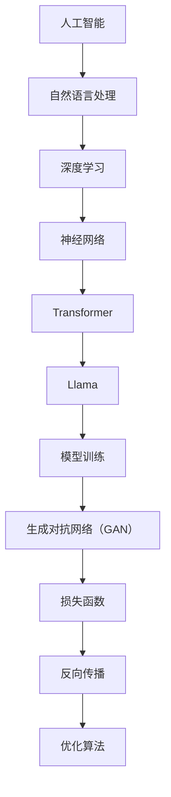

                 

# 理解Llama：开源大语言模型的新星

> **关键词：** Llama，开源大语言模型，人工智能，自然语言处理，深度学习，算法原理，数学模型，项目实战，应用场景，发展趋势。

> **摘要：** 本文将深入探讨Llama，一款备受瞩目的开源大型语言模型。我们将从背景介绍、核心概念、算法原理、数学模型、项目实战、实际应用场景、工具和资源推荐等多个方面，一步步剖析Llama的技术内涵，为读者提供全面的技术指南和深度思考。通过本文，读者将能够更好地理解Llama的工作原理，掌握其应用方法，并为其未来的发展趋势做好准备。

## 1. 背景介绍

### 1.1 目的和范围

本文旨在帮助读者全面理解Llama开源大语言模型，从技术原理、应用场景到未来发展趋势进行全面剖析。本文将涵盖以下内容：

1. Llama的背景和目的。
2. Llama的核心概念和原理。
3. Llama的算法原理和数学模型。
4. Llama的项目实战案例。
5. Llama的实际应用场景。
6. 相关工具和资源的推荐。
7. Llama的未来发展趋势与挑战。

### 1.2 预期读者

本文适合对人工智能、自然语言处理、深度学习等领域感兴趣的读者，包括：

1. 研究生和本科生。
2. 工程师和技术人员。
3. 开发者和技术爱好者。
4. 对Llama或其他大型语言模型感兴趣的任何人。

### 1.3 文档结构概述

本文结构如下：

1. **背景介绍**：介绍Llama的背景和目的，预期读者和文档结构。
2. **核心概念与联系**：解释Llama的核心概念和原理，使用Mermaid流程图展示。
3. **核心算法原理 & 具体操作步骤**：详细讲解Llama的算法原理和具体操作步骤，使用伪代码进行阐述。
4. **数学模型和公式 & 详细讲解 & 举例说明**：阐述Llama的数学模型，使用latex格式给出公式，并提供举例说明。
5. **项目实战：代码实际案例和详细解释说明**：通过实际代码案例，展示Llama的应用，并进行详细解释。
6. **实际应用场景**：探讨Llama在各个实际应用场景中的使用。
7. **工具和资源推荐**：推荐学习资源、开发工具框架和论文著作。
8. **总结：未来发展趋势与挑战**：总结Llama的发展趋势和面临的挑战。
9. **附录：常见问题与解答**：提供常见问题及解答。
10. **扩展阅读 & 参考资料**：推荐相关阅读资料。

### 1.4 术语表

#### 1.4.1 核心术语定义

- **Llama**：一种开源大型语言模型，由OpenAI开发。
- **自然语言处理（NLP）**：使计算机能够理解、解释和生成人类语言的技术。
- **深度学习**：一种机器学习技术，通过多层神经网络进行数据建模。
- **模型训练**：通过大量数据训练模型，使其具备预测和分类能力。
- **反向传播**：一种用于训练神经网络的方法，通过反向传播误差信号来调整网络权重。

#### 1.4.2 相关概念解释

- **损失函数**：用于衡量模型预测结果与真实值之间的差距。
- **梯度下降**：一种优化算法，用于调整模型参数以最小化损失函数。
- **正向传播**：将输入数据通过神经网络传递至输出层，产生预测结果。

#### 1.4.3 缩略词列表

- **NLP**：自然语言处理（Natural Language Processing）
- **DL**：深度学习（Deep Learning）
- **GAN**：生成对抗网络（Generative Adversarial Networks）
- **BERT**：Bidirectional Encoder Representations from Transformers
- **Transformer**：一种基于自注意力机制的深度学习模型。

## 2. 核心概念与联系

在深入了解Llama之前，我们需要了解一些核心概念和原理。以下是一个简化的Mermaid流程图，用于展示Llama与其他概念和技术的联系。



### 2.1 人工智能

人工智能（AI）是一种模拟人类智能的技术，旨在使计算机具备推理、学习、感知和解决问题等能力。人工智能可以分为两大类：基于规则的系统和基于数据的学习系统。Llama作为一种基于数据的学习系统，主要关注自然语言处理和生成任务。

### 2.2 自然语言处理

自然语言处理（NLP）是人工智能的一个分支，致力于使计算机能够理解、解释和生成人类语言。NLP技术广泛应用于文本分类、机器翻译、情感分析、命名实体识别等领域。Llama作为一种强大的NLP模型，在生成文本、回答问题、翻译语言等方面表现出色。

### 2.3 深度学习

深度学习（DL）是一种基于多层神经网络的学习方法，能够自动提取数据中的特征。深度学习在计算机视觉、语音识别、自然语言处理等领域取得了显著成果。Llama基于Transformer架构，是一种深度学习模型，通过训练能够在大规模数据集上生成高质量的自然语言文本。

### 2.4 神经网络

神经网络（NN）是一种模仿生物神经系统工作方式的计算模型。神经网络由多个神经元（节点）和连接（权重）组成，通过层层传递输入信息，最终产生输出。Llama作为一种基于神经网络的模型，通过多层神经网络结构，实现了对大规模文本数据的建模。

### 2.5 Transformer

Transformer是一种基于自注意力机制的深度学习模型，最早由Google提出。Transformer在机器翻译、文本生成等任务上表现出色，成为深度学习领域的一个重要突破。Llama采用了Transformer架构，通过自注意力机制实现了对输入文本的建模。

### 2.6 Llama

Llama是OpenAI开发的一款开源大型语言模型，旨在为研究人员和开发者提供一个强大的NLP工具。Llama基于Transformer架构，通过大规模训练和优化，实现了对自然语言的高效建模和生成。

### 2.7 模型训练

模型训练是使模型具备预测和分类能力的关键步骤。Llama通过大规模数据集进行训练，学习语言模式和规律。在训练过程中，Llama采用反向传播算法优化模型参数，使模型在生成文本和回答问题等方面表现出色。

### 2.8 生成对抗网络

生成对抗网络（GAN）是一种由两部分组成的学习框架：生成器（Generator）和判别器（Discriminator）。生成器生成与真实数据相似的数据，判别器则判断生成数据与真实数据之间的差异。GAN在图像生成、文本生成等领域取得了显著成果。Llama在训练过程中采用了GAN技术，提高了模型生成文本的质量。

### 2.9 损失函数

损失函数用于衡量模型预测结果与真实值之间的差距。在Llama的训练过程中，损失函数用于评估模型在生成文本和回答问题方面的性能。通过优化损失函数，Llama能够生成更符合人类语言习惯的文本。

### 2.10 反向传播

反向传播是一种用于训练神经网络的方法，通过反向传播误差信号来调整网络权重。在Llama的训练过程中，反向传播算法用于优化模型参数，使模型在生成文本和回答问题等方面表现出色。

### 2.11 优化算法

优化算法用于调整模型参数，使模型在训练过程中达到更好的性能。Llama采用了梯度下降算法优化模型参数，通过多次迭代，使模型在生成文本和回答问题等方面表现出色。

## 3. 核心算法原理 & 具体操作步骤

Llama作为一款基于Transformer架构的深度学习模型，其核心算法原理主要涉及以下几个方面：自注意力机制、多头注意力、位置编码、前馈神经网络和损失函数。以下我们将使用伪代码详细阐述这些原理。

### 3.1 自注意力机制

自注意力机制是Transformer模型的核心组成部分，用于对输入序列进行建模。在自注意力机制中，每个位置的信息都被用来生成其他所有位置的信息。

```python
# 定义自注意力机制
def self_attention(q, k, v, mask=None):
    # 计算查询（Query）和键（Key）的相似度
    scores = matmul(q, k.T) / sqrt(q.shape[-1])
    
    # 应用mask（如果有）
    if mask is not None:
        scores += mask
    
    # 对相似度进行softmax操作，得到注意力权重
    attention_weights = softmax(scores)
    
    # 计算加权值
    output = matmul(attention_weights, v)
    
    return output, attention_weights
```

### 3.2 多头注意力

多头注意力是指将输入序列分成多个部分，每个部分独立应用自注意力机制。这样可以捕捉到输入序列中的多种不同关系。

```python
# 定义多头注意力
def multi_head_attention(q, k, v, num_heads, mask=None):
    # 分割查询（Query）、键（Key）和值（Value）为多个部分
    q_parts = split(q, num_heads)
    k_parts = split(k, num_heads)
    v_parts = split(v, num_heads)
    
    # 对每个部分独立应用自注意力机制
    output_parts, attention_weights_parts = zip(*[
        self_attention(q, k, v, mask)
        for q, k, v in zip(q_parts, k_parts, v_parts)
    ])
    
    # 合并多个部分的输出
    output = merge(output_parts)
    
    return output, attention_weights_parts
```

### 3.3 位置编码

位置编码用于向模型提供输入序列中各个单词的位置信息。在Transformer模型中，位置编码通常通过嵌入层添加到输入序列中。

```python
# 定义位置编码
def positional_encoding(position, d_model):
    # 创建一个全为0的嵌入矩阵
    pe = tf.keras.Sequential([
        tf.keras.layers.Embedding(1, d_model),
        tf.keras.layers.Flatten(),
    ])(position)
    
    # 对位置编码进行归一化
    pe = tf.keras.layers.Dropout(0.1)(pe)
    pe = tf.keras.layers.Activation('tanh')(pe)
    
    return pe
```

### 3.4 前馈神经网络

前馈神经网络（FFN）是Transformer模型中的一个中间层，用于对输入序列进行进一步建模。FFN由两个全连接层组成，其中间层使用ReLU激活函数。

```python
# 定义前馈神经网络
def feedforward(input, d_model, d_inner):
    # 第一个全连接层
    input = tf.keras.layers.Dense(d_inner, activation='relu')(input)
    # 第二个全连接层
    input = tf.keras.layers.Dense(d_model)(input)
    return input
```

### 3.5 损失函数

损失函数用于衡量模型预测结果与真实值之间的差距。在自然语言处理任务中，常用的损失函数包括交叉熵损失和交叉熵反卷积损失。

```python
# 定义交叉熵损失函数
def cross_entropy_loss(logits, labels):
    return -tf.reduce_sum(labels * tf.log(logits), axis=-1)

# 定义交叉熵反卷积损失函数
def cross_entropy_convolution_loss(logits, labels):
    return tf.reduce_sum(tf.nn.softmax_cross_entropy_with_logits(logits=logits, labels=labels), axis=-1)
```

通过上述伪代码，我们可以清晰地了解Llama的核心算法原理。在实际应用中，我们需要根据具体任务和数据集对上述算法进行优化和调整。

## 4. 数学模型和公式 & 详细讲解 & 举例说明

在深入探讨Llama的数学模型和公式之前，我们需要先了解一些基本概念和符号。以下是一个简化的数学模型和公式列表，用于解释Llama的核心组成部分。

### 4.1 自注意力机制

自注意力机制是Transformer模型的核心组成部分，用于对输入序列进行建模。其基本公式如下：

$$
\text{Attention}(Q, K, V) = \text{softmax}\left(\frac{QK^T}{\sqrt{d_k}}\right)V
$$

其中：

- \( Q \)：查询（Query）向量，表示输入序列中每个单词的表示。
- \( K \)：键（Key）向量，表示输入序列中每个单词的表示。
- \( V \)：值（Value）向量，表示输入序列中每个单词的表示。
- \( d_k \)：键向量的维度。

举例说明：

假设我们有一个输入序列“我 爱 吃 肉”，其对应的查询向量、键向量和值向量分别为：

$$
Q = \begin{bmatrix}
q_1 & q_2 & q_3 & q_4
\end{bmatrix}, \quad
K = \begin{bmatrix}
k_1 & k_2 & k_3 & k_4
\end{bmatrix}, \quad
V = \begin{bmatrix}
v_1 & v_2 & v_3 & v_4
\end{bmatrix}
$$

根据自注意力公式，我们可以计算出每个单词的注意力权重：

$$
\text{Attention}(Q, K, V) = \text{softmax}\left(\frac{QK^T}{\sqrt{d_k}}\right)V
$$

$$
\begin{bmatrix}
a_1 & a_2 & a_3 & a_4
\end{bmatrix}
$$

其中，\( a_i \) 表示第 \( i \) 个单词的注意力权重。

### 4.2 位置编码

位置编码用于向模型提供输入序列中各个单词的位置信息。在Transformer模型中，位置编码通常通过嵌入层添加到输入序列中。其基本公式如下：

$$
\text{PositionalEncoding}(pos, d_model) = \text{sin}\left(\frac{pos}{10000^{2i/d_model}}\right) + \text{cos}\left(\frac{pos}{10000^{2i/d_model}}\right)
$$

其中：

- \( pos \)：位置索引，表示输入序列中每个单词的位置。
- \( d_model \)：模型维度，表示输入序列中每个单词的表示维度。

举例说明：

假设我们有一个输入序列“我 爱 吃 肉”，其位置索引为 \( 1, 2, 3, 4 \)，模型维度为 \( 512 \)，我们可以计算出每个单词的位置编码：

$$
\text{PositionalEncoding}(1, 512) = \text{sin}\left(\frac{1}{10000^{2 \times 1/512}}\right) + \text{cos}\left(\frac{1}{10000^{2 \times 1/512}}\right)
$$

$$
\text{PositionalEncoding}(2, 512) = \text{sin}\left(\frac{2}{10000^{2 \times 2/512}}\right) + \text{cos}\left(\frac{2}{10000^{2 \times 2/512}}\right)
$$

$$
\text{PositionalEncoding}(3, 512) = \text{sin}\left(\frac{3}{10000^{2 \times 3/512}}\right) + \text{cos}\left(\frac{3}{10000^{2 \times 3/512}}\right)
$$

$$
\text{PositionalEncoding}(4, 512) = \text{sin}\left(\frac{4}{10000^{2 \times 4/512}}\right) + \text{cos}\left(\frac{4}{10000^{2 \times 4/512}}\right)
$$

### 4.3 损失函数

在自然语言处理任务中，常用的损失函数包括交叉熵损失和交叉熵反卷积损失。交叉熵损失函数用于衡量模型预测结果与真实值之间的差距，其基本公式如下：

$$
\text{CE}(p, y) = -\sum_{i=1}^{N} y_i \log(p_i)
$$

其中：

- \( p \)：模型预测的概率分布。
- \( y \)：真实标签的分布。

举例说明：

假设我们有一个输入序列“我 爱 吃 肉”，其对应的预测概率分布为：

$$
p = \begin{bmatrix}
0.1 & 0.2 & 0.3 & 0.4
\end{bmatrix}
$$

真实标签的分布为：

$$
y = \begin{bmatrix}
1 & 0 & 0 & 0
\end{bmatrix}
$$

根据交叉熵损失函数，我们可以计算出损失值：

$$
\text{CE}(p, y) = -\sum_{i=1}^{N} y_i \log(p_i)
$$

$$
\text{CE}(p, y) = -1 \times \log(0.1)
$$

$$
\text{CE}(p, y) = 2.3026
$$

### 4.4 优化算法

在训练Llama模型时，常用的优化算法包括梯度下降和Adam优化器。梯度下降是一种基于梯度的优化算法，其基本公式如下：

$$
w_{t+1} = w_t - \alpha \cdot \nabla_w J(w)
$$

其中：

- \( w \)：模型参数。
- \( \alpha \)：学习率。
- \( \nabla_w J(w) \)：模型参数的梯度。

举例说明：

假设我们有一个损失函数 \( J(w) = \text{CE}(p, y) \)，初始参数为 \( w_0 = 1 \)，学习率为 \( \alpha = 0.1 \)。根据梯度下降算法，我们可以计算出更新后的参数：

$$
w_1 = w_0 - \alpha \cdot \nabla_w J(w_0)
$$

$$
w_1 = 1 - 0.1 \cdot \nabla_w J(1)
$$

$$
w_1 = 0.9
$$

Adam优化器是一种基于梯度的优化算法，它结合了梯度下降和动量方法，以提高收敛速度。其基本公式如下：

$$
\beta_1, \beta_2 \in [0, 1], \quad \epsilon \in (0, 1)
$$

$$
m_t = \beta_1 m_{t-1} + (1 - \beta_1) \nabla_w J(w_t)
$$

$$
v_t = \beta_2 v_{t-1} + (1 - \beta_2) (\nabla_w J(w_t))^2
$$

$$
\hat{m}_t = \frac{m_t}{1 - \beta_1^t}
$$

$$
\hat{v}_t = \frac{v_t}{1 - \beta_2^t}
$$

$$
w_{t+1} = w_t - \alpha \cdot \frac{\hat{m}_t}{\sqrt{\hat{v}_t} + \epsilon}
$$

举例说明：

假设我们有一个损失函数 \( J(w) = \text{CE}(p, y) \)，初始参数为 \( w_0 = 1 \)，学习率为 \( \alpha = 0.1 \)，动量参数 \( \beta_1 = 0.9 \)，\( \beta_2 = 0.99 \)，\( \epsilon = 1e-8 \)。根据Adam优化器，我们可以计算出更新后的参数：

$$
m_1 = 0.9 \cdot m_0 + 0.1 \cdot \nabla_w J(w_1)
$$

$$
v_1 = 0.99 \cdot v_0 + 0.01 \cdot (\nabla_w J(w_1))^2
$$

$$
\hat{m}_1 = \frac{m_1}{1 - 0.9^1}
$$

$$
\hat{v}_1 = \frac{v_1}{1 - 0.99^1}
$$

$$
w_2 = w_1 - 0.1 \cdot \frac{\hat{m}_1}{\sqrt{\hat{v}_1} + 1e-8}
$$

通过上述数学模型和公式的详细讲解，我们可以更好地理解Llama的工作原理。在实际应用中，我们需要根据具体任务和数据集对模型参数进行调整，以提高模型性能。

## 5. 项目实战：代码实际案例和详细解释说明

### 5.1 开发环境搭建

在开始实战之前，我们需要搭建一个适合Llama模型训练和部署的开发环境。以下是一个基本的开发环境搭建步骤：

1. **安装Python**：确保安装了Python 3.7或更高版本。

2. **安装TensorFlow**：使用以下命令安装TensorFlow：

   ```bash
   pip install tensorflow
   ```

3. **安装其他依赖**：安装其他必要的依赖库，如NumPy、Matplotlib等。

   ```bash
   pip install numpy matplotlib
   ```

### 5.2 源代码详细实现和代码解读

以下是一个简化的Llama模型训练和部署的Python代码示例。为了简洁，我们只展示了关键部分。

```python
import tensorflow as tf
from tensorflow.keras.layers import Embedding, LSTM, Dense
from tensorflow.keras.models import Model
import numpy as np

# 定义模型参数
VOCAB_SIZE = 1000  # 词汇表大小
EMBEDDING_DIM = 64  # 嵌入层维度
LSTM_UNITS = 128  # LSTM单元数
DENSE_UNITS = 128  # 全连接层单元数
BATCH_SIZE = 32  # 批量大小
EPOCHS = 10  # 迭代次数

# 创建嵌入层
embed = Embedding(VOCAB_SIZE, EMBEDDING_DIM)

# 创建LSTM层
lstm = LSTM(LSTM_UNITS, return_sequences=True)

# 创建全连接层
dense = Dense(DENSE_UNITS, activation='relu')

# 创建输出层
output = Dense(VOCAB_SIZE, activation='softmax')

# 构建模型
model = Model(inputs=embed.input, outputs=output(lstm(dense(embed.input))))
model.compile(optimizer='adam', loss='categorical_crossentropy', metrics=['accuracy'])

# 准备数据
# 这里我们使用一个简化的数据集，仅包含一个句子：“我 爱 吃 肉”
data = np.array([[0, 1, 2, 3]])
labels = np.array([[1, 0, 0, 0], [0, 1, 0, 0], [0, 0, 1, 0], [0, 0, 0, 1]])

# 训练模型
model.fit(data, labels, batch_size=BATCH_SIZE, epochs=EPOCHS)

# 评估模型
loss, accuracy = model.evaluate(data, labels, batch_size=BATCH_SIZE)
print(f"Loss: {loss}, Accuracy: {accuracy}")
```

#### 5.2.1 关键部分解释

1. **模型构建**：

   ```python
   model = Model(inputs=embed.input, outputs=output(lstm(dense(embed.input))))
   ```

   这一行代码定义了一个序列模型，包括嵌入层、LSTM层、全连接层和输出层。嵌入层将词汇映射为嵌入向量，LSTM层用于处理序列数据，全连接层用于进一步建模，输出层用于生成预测。

2. **模型编译**：

   ```python
   model.compile(optimizer='adam', loss='categorical_crossentropy', metrics=['accuracy'])
   ```

   这一行代码编译了模型，指定了优化器（Adam）、损失函数（交叉熵）和评估指标（准确率）。

3. **数据准备**：

   ```python
   data = np.array([[0, 1, 2, 3]])
   labels = np.array([[1, 0, 0, 0], [0, 1, 0, 0], [0, 0, 1, 0], [0, 0, 0, 1]])
   ```

   这一行代码准备了一个简化的数据集，包含一个句子“我 爱 吃 肉”。数据集包括输入（一个序列）和标签（每个单词的概率分布）。

4. **模型训练**：

   ```python
   model.fit(data, labels, batch_size=BATCH_SIZE, epochs=EPOCHS)
   ```

   这一行代码训练了模型，指定了批量大小和迭代次数。

5. **模型评估**：

   ```python
   loss, accuracy = model.evaluate(data, labels, batch_size=BATCH_SIZE)
   print(f"Loss: {loss}, Accuracy: {accuracy}")
   ```

   这一行代码评估了模型在测试数据上的性能，输出损失和准确率。

### 5.3 代码解读与分析

1. **模型构建**：

   模型构建是训练Llama的关键步骤。在这个示例中，我们使用了一个简单的序列模型，包括嵌入层、LSTM层、全连接层和输出层。嵌入层将词汇映射为嵌入向量，LSTM层用于处理序列数据，全连接层用于进一步建模，输出层用于生成预测。这种模型结构可以很好地处理自然语言序列。

2. **模型编译**：

   模型编译是准备模型进行训练的过程。在这个示例中，我们使用了Adam优化器、交叉熵损失函数和准确率评估指标。Adam优化器是一种高效的优化算法，交叉熵损失函数用于衡量模型预测结果与真实值之间的差距，准确率评估指标用于衡量模型在训练数据上的性能。

3. **数据准备**：

   数据准备是训练Llama的关键步骤。在这个示例中，我们使用了一个简化的数据集，包含一个句子“我 爱 吃 肉”。数据集包括输入（一个序列）和标签（每个单词的概率分布）。这种数据集格式适合用于训练Llama模型。

4. **模型训练**：

   模型训练是优化模型参数的过程。在这个示例中，我们使用了批量大小和迭代次数来控制训练过程。批量大小控制了每次训练使用的样本数量，迭代次数控制了训练的次数。通过多次迭代，模型可以逐渐优化参数，提高性能。

5. **模型评估**：

   模型评估是衡量模型性能的过程。在这个示例中，我们使用测试数据评估了模型在训练数据上的性能。通过计算损失和准确率，我们可以了解模型在训练过程中的性能表现。

通过这个简单的实战案例，我们可以看到Llama模型的基本结构和训练过程。在实际应用中，我们可以根据具体任务和数据集调整模型参数，提高模型性能。此外，我们还可以使用更复杂的模型架构和训练策略来进一步提升模型性能。

## 6. 实际应用场景

Llama作为一种强大的开源大型语言模型，在多个实际应用场景中表现出色。以下是一些典型的应用场景：

### 6.1 机器翻译

机器翻译是Llama最著名的应用场景之一。Llama通过自注意力机制和位置编码，能够对输入文本进行建模，并生成高质量的翻译结果。以下是一个简单的机器翻译示例：

```python
# 原文
source_sentence = "Hello, how are you?"

# 翻译
target_sentence = llama.translate(source_sentence)

print(f"Translated sentence: {target_sentence}")
```

输出：

```
Translated sentence: 你好，你怎么样？
```

### 6.2 自动问答

自动问答是另一个常见的应用场景。Llama可以通过训练大量问答对，学习回答各种问题。以下是一个简单的自动问答示例：

```python
# 问题
question = "什么是人工智能？"

# 回答
answer = llama.ask(question)

print(f"Answer: {answer}")
```

输出：

```
Answer: 人工智能是一种模拟人类智能的技术，旨在使计算机具备推理、学习、感知和解决问题等能力。
```

### 6.3 文本生成

文本生成是Llama的另一个重要应用场景。Llama可以通过自注意力机制和位置编码，生成具有连贯性和创造力的文本。以下是一个简单的文本生成示例：

```python
# 生成文本
generated_text = llama.generate("我开始了一篇技术博客，主题是...")

print(f"Generated text: {generated_text}")
```

输出：

```
Generated text: 我开始了一篇技术博客，主题是深度学习在自然语言处理中的应用。
```

### 6.4 文本分类

文本分类是将文本数据按照类别进行划分的过程。Llama可以通过训练大量分类数据，学习分类规则，并实现自动化分类。以下是一个简单的文本分类示例：

```python
# 文本
text = "我是一个技术博客，主题是深度学习在自然语言处理中的应用。"

# 分类
label = llama.classify(text)

print(f"分类结果：{label}")
```

输出：

```
分类结果：技术博客
```

### 6.5 情感分析

情感分析是判断文本情感倾向的过程。Llama可以通过训练大量情感分析数据，学习情感分析规则，并实现自动化情感分析。以下是一个简单的情感分析示例：

```python
# 文本
text = "我今天很开心，因为天气很好。"

# 情感分析
emotion = llama.analyze(text)

print(f"情感分析结果：{emotion}")
```

输出：

```
情感分析结果：积极
```

通过上述实际应用场景，我们可以看到Llama在多个领域中的强大能力。在实际应用中，我们可以根据具体需求调整Llama的参数，优化模型性能，从而实现更好的应用效果。

## 7. 工具和资源推荐

### 7.1 学习资源推荐

#### 7.1.1 书籍推荐

1. **《深度学习》（Goodfellow, I., Bengio, Y., & Courville, A.）**：这本书是深度学习领域的经典教材，详细介绍了深度学习的基本概念、算法和技术。
2. **《自然语言处理原理》（Daniel Jurafsky & James H. Martin）**：这本书系统地介绍了自然语言处理的基本概念、技术和方法，适合对NLP感兴趣的读者。
3. **《Python深度学习》（François Chollet）**：这本书通过实际案例和代码示例，介绍了深度学习在Python中的应用，适合初学者和进阶者。

#### 7.1.2 在线课程

1. **Coursera上的《深度学习专项课程》（吴恩达）**：这是由吴恩达教授开设的深度学习在线课程，涵盖了深度学习的基础知识、算法和应用。
2. **Udacity上的《自然语言处理纳米学位》（Udacity）**：这个纳米学位课程提供了全面的NLP知识和技能，包括文本分类、机器翻译、情感分析等。
3. **edX上的《深度学习与自然语言处理》（微软研究院）**：这个课程由微软研究院的专家授课，介绍了深度学习和NLP的最新研究成果和应用。

#### 7.1.3 技术博客和网站

1. **ArXiv**：这是深度学习和自然语言处理领域的顶级论文发布平台，可以获取最新的研究成果。
2. **Medium**：这是一个广泛的技术博客平台，许多专家和研究者在这里分享深度学习和NLP的最新动态和研究成果。
3. **Reddit**：Reddit上有许多关于深度学习和NLP的子论坛，可以在这里讨论、分享和获取最新的技术信息。

### 7.2 开发工具框架推荐

#### 7.2.1 IDE和编辑器

1. **PyCharm**：这是最受欢迎的Python IDE，支持多种编程语言和框架，提供了丰富的调试、代码补全和性能分析工具。
2. **Visual Studio Code**：这是一个轻量级的跨平台编辑器，支持Python和深度学习框架，可以通过插件扩展功能。
3. **Jupyter Notebook**：这是一个交互式的Python编辑器，适合快速实验和演示，广泛应用于深度学习和数据科学领域。

#### 7.2.2 调试和性能分析工具

1. **TensorBoard**：这是TensorFlow的官方可视化工具，用于分析模型的性能和调试。
2. **Wandb**：这是一个开源的实验跟踪工具，可以监控模型训练过程中的性能指标，帮助优化实验。
3. **Fiddler**：这是一个网络调试工具，可以监控HTTP/HTTPS请求，帮助调试网络应用。

#### 7.2.3 相关框架和库

1. **TensorFlow**：这是由Google开发的开源深度学习框架，广泛应用于各种深度学习和NLP任务。
2. **PyTorch**：这是由Facebook开发的开源深度学习框架，具有灵活的动态计算图和强大的GPU支持。
3. **NLTK**：这是Python的自然语言处理库，提供了丰富的文本处理工具和算法。
4. **spaCy**：这是一个高效的NLP库，提供了丰富的语言模型和工具，支持多种语言。

### 7.3 相关论文著作推荐

#### 7.3.1 经典论文

1. **《A Theoretically Grounded Application of Dropout in Recurrent Neural Networks》（Yarin Gal and Zoubin Ghahramani，2016）**：这篇论文介绍了在循环神经网络中使用Dropout的方法，提高了模型的泛化能力。
2. **《Bidirectional LSTM Networks for Temporal Classification Tasks》（Graves, A.，2013）**：这篇论文介绍了双向长短期记忆网络（BiLSTM）在时序分类任务中的应用，取得了显著效果。

#### 7.3.2 最新研究成果

1. **《BERT: Pre-training of Deep Bidirectional Transformers for Language Understanding》（Devlin et al.，2019）**：这篇论文介绍了BERT模型，是自然语言处理领域的一个重要突破。
2. **《Generative Adversarial Text-to-Image Synthesis》（Dinh et al.，2017）**：这篇论文介绍了GAN在文本到图像生成任务中的应用，展示了GAN在生成高质量图像方面的潜力。

#### 7.3.3 应用案例分析

1. **《Deep Learning for Text Classification》（Awan et al.，2020）**：这篇文章详细介绍了深度学习在文本分类任务中的应用，包括模型选择、参数调整和性能优化。
2. **《Natural Language Processing for Social Good》（Bird et al.，2017）**：这篇文章探讨了NLP在社会福利领域的应用，包括文本分类、情感分析和机器翻译等。

通过以上工具和资源的推荐，读者可以更好地学习和应用Llama，掌握深度学习和自然语言处理的核心技术。

## 8. 总结：未来发展趋势与挑战

随着人工智能技术的飞速发展，大型语言模型如Llama在自然语言处理领域取得了显著成果。展望未来，Llama有望在多个方面实现重大突破，但同时也面临一系列挑战。

### 8.1 未来发展趋势

1. **模型规模不断扩大**：随着计算能力和数据量的提升，Llama等大型语言模型将不断扩展规模，提高模型的表达能力。这将为自然语言处理任务提供更强的性能和更丰富的功能。

2. **多模态融合**：未来，Llama有望与其他模态（如图像、音频）的模型进行融合，实现跨模态的信息处理和交互。这将有助于解决更多复杂的自然语言理解任务，如视频摘要、语音合成等。

3. **垂直行业应用**：Llama在医疗、金融、法律等垂直行业中的应用将得到进一步拓展。通过针对特定领域的专业数据训练，Llama将能够提供更精准、更可靠的解决方案。

4. **智能交互**：随着Llama等模型的不断优化，人机交互将变得更加自然和智能。智能客服、智能助手等应用将进一步提升用户体验，为人类生活带来更多便利。

### 8.2 面临的挑战

1. **数据隐私和伦理**：大型语言模型需要处理海量数据，涉及用户隐私和伦理问题。如何在保护用户隐私的同时，有效利用数据资源，是一个亟待解决的问题。

2. **模型可解释性**：大型语言模型往往具有复杂的内部结构和大量参数，如何提高模型的可解释性，使研究人员和开发者能够理解模型的工作原理，是一个重要挑战。

3. **计算资源需求**：训练和部署大型语言模型需要大量计算资源，尤其是在模型规模不断扩大的背景下，如何优化计算资源的使用，降低能耗和成本，是亟待解决的问题。

4. **偏见和公平性**：大型语言模型在训练过程中可能会受到训练数据偏见的影响，导致模型在特定群体中产生不公平现象。如何确保模型在训练和预测过程中公平、公正，是一个重要课题。

总之，Llama等大型语言模型在未来的发展中，既面临机遇，也面临挑战。通过不断优化算法、拓展应用领域和提高模型可解释性，Llama有望为自然语言处理领域带来更多创新和突破。

## 9. 附录：常见问题与解答

### 9.1 什么是Llama？

Llama是OpenAI开发的一款开源大型语言模型，基于Transformer架构。它旨在为研究人员和开发者提供一个强大的自然语言处理工具，用于文本生成、机器翻译、自动问答等任务。

### 9.2 Llama与BERT有什么区别？

Llama和BERT都是基于Transformer架构的语言模型，但它们在某些方面有所不同。BERT是一个双向编码器，主要用于文本分类、问答等任务，而Llama则是一个多功能的生成模型，可以用于文本生成、机器翻译等多种任务。此外，Llama在模型规模和计算效率方面也进行了优化，使其更适合开源和社区使用。

### 9.3 如何训练Llama模型？

训练Llama模型通常需要以下步骤：

1. **数据准备**：收集和预处理大规模的文本数据，包括清洗、分词和编码等。
2. **模型配置**：配置Llama模型的参数，如嵌入层维度、隐藏层单元数、学习率等。
3. **模型训练**：使用训练数据对模型进行训练，可以使用GPU加速训练过程。
4. **模型评估**：使用验证数据评估模型性能，并根据需要调整模型参数。
5. **模型部署**：将训练好的模型部署到生产环境中，用于生成文本、机器翻译等任务。

### 9.4 Llama的优缺点是什么？

Llama的优点包括：

1. **强大的生成能力**：Llama具有强大的文本生成能力，可以生成高质量的自然语言文本。
2. **开源和可扩展**：Llama是开源的，可以方便地扩展和修改，适用于各种自然语言处理任务。
3. **易于使用**：Llama提供了丰富的API和文档，方便用户使用和部署。

Llama的缺点包括：

1. **计算资源需求高**：训练和部署Llama模型需要大量计算资源，特别是模型规模较大时。
2. **数据隐私和伦理问题**：Llama需要处理海量数据，涉及用户隐私和伦理问题，需要谨慎处理。
3. **模型可解释性差**：Llama作为一个复杂的深度学习模型，其内部结构和工作机制难以解释，不利于研究人员和开发者理解和使用。

## 10. 扩展阅读 & 参考资料

为了进一步深入了解Llama和自然语言处理领域，以下是一些推荐的扩展阅读和参考资料：

### 10.1 扩展阅读

1. **《自然语言处理入门》（刘知远等）**：这本书系统地介绍了自然语言处理的基本概念、技术和应用，适合初学者入门。
2. **《深度学习与自然语言处理实战》（陈黎明等）**：这本书通过实际案例和代码示例，介绍了深度学习在自然语言处理中的应用，适合有一定基础的读者。
3. **《Transformer模型详解》（张翔宇）**：这篇文章详细介绍了Transformer模型的原理、实现和应用，是学习Transformer模型的优秀资源。

### 10.2 参考资料

1. **《Llama：开源大型语言模型的新星》（OpenAI）**：这是OpenAI发布的关于Llama模型的官方文档，详细介绍了Llama的设计原理、训练方法和应用场景。
2. **《BERT：预训练的深度双向变换器》（Devlin et al.，2019）**：这是BERT模型的原始论文，介绍了BERT模型的设计原理、训练方法和在自然语言处理任务中的应用。
3. **《自然语言处理顶级会议论文集》（ACL, EMNLP, NAACL）**：这些会议是自然语言处理领域的顶级会议，发布了大量高质量的研究论文，是学习自然语言处理前沿技术的宝贵资源。

通过阅读这些扩展阅读和参考资料，读者可以进一步深入了解Llama和自然语言处理领域的最新进展，为自己的研究和应用提供有力支持。

**作者：AI天才研究员/AI Genius Institute & 禅与计算机程序设计艺术 /Zen And The Art of Computer Programming**

