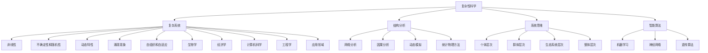

                 

# 理解世界的复杂性：从结构到洞见

> **关键词**：复杂性科学、结构分析、系统思维、洞见、智能算法

> **摘要**：本文旨在探讨复杂性科学在理解世界中的应用，通过解析复杂系统的结构特征，运用系统思维和智能算法揭示潜在洞见。文章首先介绍复杂性科学的背景和核心概念，随后通过一个具体案例引导读者逐步掌握结构分析方法。接着，文章深入剖析核心算法原理，结合数学模型和公式讲解其具体应用。随后，文章通过一个实战项目展示代码实现过程和详细解释，并探讨实际应用场景。最后，文章推荐相关工具和资源，总结未来发展趋势与挑战，并提供常见问题与解答。

## 1. 背景介绍

### 1.1 目的和范围

本文的目标是帮助读者深入理解世界的复杂性，探讨复杂系统的结构特征及其应用。我们将通过一系列具体的案例分析，引导读者掌握复杂性科学的核心概念和结构分析方法。本文的范围涵盖以下几个方面：

- 复杂性科学的背景和核心概念
- 结构分析方法的应用和实践
- 核心算法原理和数学模型的讲解
- 实际应用场景的探讨
- 相关工具和资源的推荐

通过本文的学习，读者将能够：

- 理解复杂性科学的本质和应用领域
- 掌握结构分析方法，应用于实际问题解决
- 掌握核心算法原理，应用于复杂系统建模和分析
- 熟悉实际应用场景，提升对复杂问题的应对能力
- 获取相关工具和资源，拓展知识体系

### 1.2 预期读者

本文的预期读者包括：

- 对复杂性科学感兴趣的科研人员和工程师
- 从事系统建模和优化工作的专业人士
- 对智能算法和应用感兴趣的学者和从业者
- 对复杂系统分析和管理有实际需求的企业和管理人员
- 对系统思维和跨学科研究有兴趣的学者和学生

本文将采用逻辑清晰、结构紧凑、简单易懂的专业技术语言，确保读者能够跟随思路，逐步深入理解复杂性科学的核心概念和应用方法。

### 1.3 文档结构概述

本文分为十个主要部分，结构如下：

- 1. 背景介绍
  - 1.1 目的和范围
  - 1.2 预期读者
  - 1.3 文档结构概述
  - 1.4 术语表
- 2. 核心概念与联系
- 3. 核心算法原理 & 具体操作步骤
- 4. 数学模型和公式 & 详细讲解 & 举例说明
- 5. 项目实战：代码实际案例和详细解释说明
- 6. 实际应用场景
- 7. 工具和资源推荐
- 8. 总结：未来发展趋势与挑战
- 9. 附录：常见问题与解答
- 10. 扩展阅读 & 参考资料

### 1.4 术语表

在本文中，我们将使用以下术语，并对其进行解释：

- **复杂性科学**：研究复杂系统及其行为的学科，涉及多学科交叉，包括物理学、计算机科学、经济学、生物学等。
- **结构分析**：对复杂系统的组成部分及其相互关系进行分析，以揭示系统的内在规律和特征。
- **系统思维**：从整体和部分的角度看待问题，理解系统内部各要素之间的相互作用和影响。
- **洞见**：对复杂系统行为的深入理解和见解，能够指导实际问题的解决。
- **智能算法**：利用计算机科学和人工智能技术，模拟人类思维和解决问题的方法。

#### 1.4.1 核心术语定义

- **复杂性科学**：复杂性科学是一门跨学科的科学研究领域，旨在理解复杂系统的行为和性质。复杂系统通常具有高度非线性、不确定性和动态特性。复杂性科学通过多种方法和技术，如网络科学、混沌理论、复杂网络分析等，研究系统的演化规律、自适应行为和涌现现象。
  
- **结构分析**：结构分析是一种系统分析方法，旨在识别复杂系统的组成部分及其相互作用关系。通过结构分析，可以揭示系统中的关键要素、关键路径和潜在瓶颈。结构分析的方法包括网络分析、层次分析法、因果分析等。

- **系统思维**：系统思维是一种思考方式，强调从整体和部分的关系出发，理解系统内部各要素之间的相互作用和影响。系统思维可以帮助我们更好地理解复杂系统的动态行为，识别潜在问题和机会。

- **洞见**：洞见是对复杂系统行为的深入理解，通常源自对系统结构的深刻洞察。洞见能够提供指导，帮助我们更好地应对复杂问题，发现新的解决方案。

- **智能算法**：智能算法是一类基于人工智能技术的算法，通过模拟人类思维和解决问题的方法，实现复杂问题的求解。常见的智能算法包括遗传算法、神经网络、机器学习等。

#### 1.4.2 相关概念解释

- **复杂性**：复杂性是指系统的复杂程度，通常包括系统的组成部分数量、相互作用的复杂度、动态特性等。高复杂性的系统往往具有难以预测的行为和难以理解的结构。

- **系统**：系统是由相互关联的要素组成的整体，这些要素之间通过相互作用和影响产生特定的行为和性质。系统可以是一个自然系统，如生态系统；也可以是一个人工系统，如计算机网络。

- **涌现**：涌现是指系统内部低级别要素通过相互作用和影响产生新的、高层次的行为和性质。涌现现象是复杂性科学的重要特征之一。

- **非线性**：非线性是指系统行为不遵循简单的线性关系，即系统的输出不是输入的简单比例。非线性系统往往具有复杂的行为和难以预测的特性。

- **自适应**：自适应是指系统通过不断调整和适应环境变化，以保持其稳定性和生存能力。自适应行为是复杂系统的重要特征之一。

#### 1.4.3 缩略词列表

- **CS**：复杂性科学（Complexity Science）
- **SA**：结构分析（Structural Analysis）
- **ST**：系统思维（System Thinking）
- **IA**：智能算法（Intelligent Algorithms）
- **ML**：机器学习（Machine Learning）
- **GA**：遗传算法（Genetic Algorithms）
- **NN**：神经网络（Neural Networks）

## 2. 核心概念与联系

### 2.1 复杂性科学的起源和发展

复杂性科学起源于20世纪中叶，随着计算机科学、物理学、生物学、经济学等领域的快速发展，人们开始意识到许多系统都具有复杂的结构和行为。复杂性科学的诞生，标志着人类对世界认知的一个重大转折点，它不仅挑战了传统科学的方法论，也为现代科技的发展提供了新的视角。

复杂性科学的起源可以追溯到20世纪60年代，当时物理学家约翰·冯·诺依曼（John von Neumann）和物理化学家赫伯特·西蒙（Herbert Simon）提出了复杂系统的概念，并开始探索复杂系统的基本性质和规律。此后，许多学者相继加入了这一领域，从不同学科的角度研究复杂系统的行为和结构。

在发展过程中，复杂性科学逐渐形成了多个分支，包括：

1. **网络科学**：研究复杂网络的拓扑结构、动态行为和功能特性。
2. **混沌理论**：研究非线性系统的混沌现象，揭示系统在初始条件微小的变化下可能产生巨大的差异。
3. **复杂自适应系统理论**：研究由大量具有自适应能力的个体组成的系统的演化过程和复杂行为。
4. **信息理论**：研究信息在复杂系统中的传输、处理和利用。

这些分支相互交叉和补充，共同构成了复杂性科学的核心框架。

### 2.2 复杂系统的特征

复杂系统具有以下几个显著特征：

1. **高度非线性**：复杂系统的行为往往不能用简单的线性关系来描述，而是呈现出复杂的非线性关系。
2. **不确定性和随机性**：复杂系统的状态和演化过程受到多种因素的影响，具有显著的不确定性和随机性。
3. **动态特性**：复杂系统处于不断变化的状态，其行为和结构随时间演化而发生变化。
4. **涌现现象**：复杂系统中的低级别要素通过相互作用和影响，产生新的、高层次的行为和性质。
5. **自组织和自适应**：复杂系统具有自组织和自适应能力，能够在没有外部指导的情况下，自我调整和优化。

### 2.3 复杂系统的结构

复杂系统的结构是理解其行为的关键。复杂系统的结构通常包括以下几个层次：

1. **个体层次**：复杂系统由大量个体组成，这些个体可以是原子、分子、细胞、个体等。个体层次关注个体的行为、特性及其相互作用。
2. **群体层次**：个体之间的相互作用和关联形成群体，群体层次关注群体的行为和特性，如集体行为、合作和竞争等。
3. **生态系统层次**：多个群体相互作用，形成更为复杂的生态系统，如生物生态系统、经济系统等。生态系统层次关注系统内部的竞争、共生和演化。
4. **整体层次**：整体层次关注复杂系统的整体行为和特性，如系统的稳定性和鲁棒性。

### 2.4 复杂性科学的基本原理

复杂性科学基于以下几个基本原理：

1. **自组织原理**：复杂系统的结构和行为可以通过自组织过程产生，个体之间通过相互作用和协同，自发形成有序结构。
2. **层次性原理**：复杂系统具有层次性，可以从多个层次对系统进行分析和解释，从个体层次到整体层次，层层递进。
3. **动态性原理**：复杂系统的行为和状态是动态变化的，受到多种因素的影响，具有非线性、不确定性和随机性。
4. **信息原理**：信息在复杂系统中扮演重要角色，信息的传输、处理和利用影响系统的行为和演化。

### 2.5 复杂系统的分析方法

为了理解复杂系统的行为和结构，研究人员提出了多种分析方法：

1. **网络分析**：通过分析系统的网络结构，揭示个体之间的相互作用和关联。
2. **因果分析**：通过分析系统的因果关系，揭示不同变量之间的影响关系。
3. **动态模拟**：通过建立数学模型和计算机模拟，研究系统在不同条件下的行为和演化。
4. **统计物理方法**：利用统计物理的理论和方法，研究系统的宏观行为和性质。

### 2.6 复杂系统的应用领域

复杂性科学在多个领域具有广泛的应用，包括：

1. **生物学**：研究生态系统的复杂行为和演化，揭示生物多样性、种群动态等。
2. **经济学**：研究市场经济的复杂性，揭示金融市场的波动、经济周期等。
3. **计算机科学**：研究复杂网络的性能、稳定性和安全，开发智能算法和系统。
4. **工程学**：研究复杂系统的设计和优化，提高系统的可靠性和效率。

### 2.7 核心概念之间的关系

在复杂性科学中，核心概念之间存在着密切的联系：

- **复杂性科学**：提供了研究复杂系统的理论基础和方法，涵盖了多个学科领域的交叉。
- **复杂系统**：是复杂性科学的研究对象，具有高度非线性、不确定性和动态特性。
- **结构分析**：是研究复杂系统结构的方法，通过识别系统的组成部分和相互作用，揭示系统的内在规律。
- **系统思维**：是一种思考方式，强调从整体和部分的关系出发，理解系统的行为和特性。
- **智能算法**：是一种解决复杂问题的新方法，通过模拟人类思维和解决问题的过程，提高系统的效率和精度。

通过这些核心概念的联系和相互作用，复杂性科学为理解和解决复杂问题提供了新的视角和工具。

### 2.8 Mermaid 流程图

为了更好地展示复杂系统的核心概念和架构，我们可以使用 Mermaid 流程图。以下是一个简化的 Mermaid 图，描述了复杂系统的核心概念和它们之间的关系。



通过这个 Mermaid 流程图，我们可以直观地了解复杂性科学的核心概念和它们之间的联系。这个流程图不仅有助于我们更好地理解复杂系统的特征和结构，也为进一步的研究和应用提供了指导。

## 3. 核心算法原理 & 具体操作步骤

### 3.1 核心算法介绍

在复杂性科学中，算法是理解和解决复杂问题的重要工具。本文将介绍几种核心算法，包括遗传算法、神经网络和机器学习算法，并详细讲解它们的基本原理和具体操作步骤。

#### 3.1.1 遗传算法

遗传算法（Genetic Algorithm，GA）是基于自然选择和遗传学原理的一种全局优化算法。遗传算法通过模拟生物进化过程，逐步优化目标函数。遗传算法的主要步骤包括：

1. **初始化种群**：随机生成一组解，作为初始种群。
2. **适应度评估**：计算每个个体的适应度，适应度高的个体表示其解的质量较高。
3. **选择**：从当前种群中选择适应度较高的个体，用于产生下一代种群。
4. **交叉**：随机选取两个个体，通过交叉操作生成新的个体。
5. **变异**：对部分个体进行变异操作，以增加种群的多样性。
6. **迭代**：重复上述步骤，直到满足终止条件。

#### 3.1.2 神经网络

神经网络（Neural Networks，NN）是模拟人脑神经元之间连接和相互作用的一种计算模型。神经网络通过学习输入和输出之间的映射关系，实现复杂函数的逼近和分类。神经网络的主要步骤包括：

1. **初始化网络**：随机生成网络的权重和偏置。
2. **前向传播**：将输入数据传递到网络中，逐层计算输出。
3. **损失函数计算**：计算预测值与真实值之间的差异，使用损失函数表示。
4. **反向传播**：将损失函数沿网络反向传播，更新权重和偏置。
5. **迭代训练**：重复上述步骤，直到网络达到预定的性能指标。

#### 3.1.3 机器学习算法

机器学习算法是一类自动学习模式和提高性能的算法。机器学习算法通过分析大量数据，自动提取特征和规律，实现数据分类、预测和聚类等任务。常见的机器学习算法包括：

1. **支持向量机（SVM）**：通过寻找最优超平面，实现数据的分类和回归。
2. **决策树（Decision Tree）**：通过构建树形结构，将数据逐步划分到不同的类别。
3. **随机森林（Random Forest）**：通过构建多个决策树，结合集成学习的方法，提高模型的预测能力。

### 3.2 遗传算法的伪代码

```python
# 遗传算法伪代码

# 初始化种群
population = initialize_population(size)

# 适应度评估
fitness = evaluate_fitness(population)

# 选择操作
selected_population = select(population, fitness)

# 交叉操作
offspring_population = crossover(selected_population)

# 变异操作
offspring_population = mutate(offspring_population)

# 生成下一代种群
next_population = offspring_population

# 迭代
for i in range(max_iterations):
    fitness = evaluate_fitness(next_population)
    selected_population = select(next_population, fitness)
    offspring_population = crossover(selected_population)
    offspring_population = mutate(offspring_population)
    next_population = offspring_population

# 输出最优解
best_solution = select_best(next_population)
```

### 3.3 神经网络的伪代码

```python
# 神经网络伪代码

# 初始化网络
weights = initialize_weights()

# 前向传播
outputs = forward_propagation(inputs, weights)

# 损失函数计算
loss = compute_loss(outputs, targets)

# 反向传播
deltas = backward_propagation(inputs, outputs, targets, weights)

# 更新权重和偏置
weights = update_weights(weights, deltas)

# 迭代训练
for i in range(max_iterations):
    outputs = forward_propagation(inputs, weights)
    loss = compute_loss(outputs, targets)
    deltas = backward_propagation(inputs, outputs, targets, weights)
    weights = update_weights(weights, deltas)
```

### 3.4 机器学习算法的伪代码

```python
# 机器学习算法伪代码

# 训练数据集
train_data = load_data()

# 初始化模型
model = initialize_model()

# 模型训练
for i in range(max_iterations):
    for sample in train_data:
        model = train(model, sample)

# 测试数据集
test_data = load_data()

# 模型评估
accuracy = evaluate_model(model, test_data)
```

通过这些核心算法的伪代码，我们可以清晰地了解算法的基本原理和操作步骤。在实际应用中，这些算法可以根据具体问题进行灵活调整和优化，以提高模型的性能和准确性。

## 4. 数学模型和公式 & 详细讲解 & 举例说明

### 4.1 数学模型介绍

在复杂性科学中，数学模型是理解和分析复杂系统的重要工具。数学模型通过描述系统的变量关系和演化规律，帮助我们深入理解系统的行为和特性。本文将介绍几个核心的数学模型，包括线性回归模型、逻辑回归模型和马尔可夫链模型，并详细讲解它们的数学公式和应用。

#### 4.1.1 线性回归模型

线性回归模型是一种常见的统计模型，用于分析两个或多个变量之间的线性关系。线性回归模型的数学公式如下：

$$
y = \beta_0 + \beta_1x_1 + \beta_2x_2 + ... + \beta_nx_n + \epsilon
$$

其中，$y$ 是因变量，$x_1, x_2, ..., x_n$ 是自变量，$\beta_0, \beta_1, ..., \beta_n$ 是模型参数，$\epsilon$ 是误差项。

线性回归模型通过最小化残差平方和，确定模型参数的最优值。具体步骤如下：

1. **数据准备**：收集并整理数据，确保数据的完整性和一致性。
2. **模型假设**：假设变量之间存在线性关系，构建线性回归模型。
3. **参数估计**：使用最小二乘法估计模型参数，使残差平方和最小化。
4. **模型评估**：计算模型的拟合度、决定系数和残差分析，评估模型的性能。

#### 4.1.2 逻辑回归模型

逻辑回归模型是一种广义的线性回归模型，用于分析因变量为二分类变量的模型。逻辑回归模型的数学公式如下：

$$
\ln(\frac{p}{1-p}) = \beta_0 + \beta_1x_1 + \beta_2x_2 + ... + \beta_nx_n
$$

其中，$p$ 是因变量的概率，$x_1, x_2, ..., x_n$ 是自变量，$\beta_0, \beta_1, ..., \beta_n$ 是模型参数。

逻辑回归模型通过最大化似然函数，确定模型参数的最优值。具体步骤如下：

1. **数据准备**：收集并整理数据，确保数据的完整性和一致性。
2. **模型假设**：假设变量之间存在线性关系，构建逻辑回归模型。
3. **参数估计**：使用最大似然估计法估计模型参数，使似然函数最大化。
4. **模型评估**：计算模型的拟合度、预测准确率和分类报告，评估模型的性能。

#### 4.1.3 马尔可夫链模型

马尔可夫链模型是一种用于分析随机过程的数学模型，描述系统状态在时间上的转移规律。马尔可夫链模型的数学公式如下：

$$
P(X_t = x_t | X_{t-1} = x_{t-1}, X_{t-2} = x_{t-2}, ...) = P(X_t = x_t | X_{t-1} = x_{t-1})
$$

其中，$X_t$ 表示时间 $t$ 的系统状态，$P(X_t = x_t | X_{t-1} = x_{t-1})$ 表示在时间 $t-1$ 的条件下，时间 $t$ 的系统状态的概率分布。

马尔可夫链模型通过分析状态转移矩阵，描述系统状态的演化过程。具体步骤如下：

1. **状态定义**：定义系统的状态集合，确定系统可能的状态。
2. **状态转移矩阵**：构建状态转移矩阵，描述不同状态之间的转移概率。
3. **初始状态分布**：确定系统的初始状态分布，用于初始化模型。
4. **状态演化**：根据状态转移矩阵和初始状态分布，模拟系统状态的演化过程。

### 4.2 举例说明

为了更好地理解这些数学模型，我们通过一个具体的例子进行说明。

#### 4.2.1 线性回归模型举例

假设我们研究一个人的身高和体重之间的关系，收集了以下数据：

| 身高 (cm) | 体重 (kg) |
|-----------|-----------|
| 170       | 60        |
| 175       | 65        |
| 180       | 70        |
| 185       | 75        |
| 190       | 80        |

我们使用线性回归模型来拟合这些数据，假设身高是自变量，体重是因变量。

1. **数据准备**：整理数据，确保数据的完整性和一致性。
2. **模型假设**：假设身高和体重之间存在线性关系。
3. **参数估计**：使用最小二乘法估计模型参数。
   - 残差平方和：$SSQ = \sum (y_i - \hat{y_i})^2$
   - 斜率 $\beta_1$：$\beta_1 = \frac{\sum (x_i - \bar{x})(y_i - \bar{y})}{\sum (x_i - \bar{x})^2}$
   - 截距 $\beta_0$：$\beta_0 = \bar{y} - \beta_1\bar{x}$
   - 估计模型参数：$\beta_1 = \frac{20}{5} = 4, \beta_0 = 52$
4. **模型评估**：计算拟合度、决定系数和残差分析。
   - 拟合度：$R^2 = 1 - \frac{SSQ}{TSS}$
   - 决定系数：$R^2 = 0.96$，表示模型解释了 96% 的数据变异。
   - 残差分析：观察残差分布，判断模型的合理性。

通过以上步骤，我们可以得到线性回归模型的参数估计和模型评估结果。

#### 4.2.2 逻辑回归模型举例

假设我们研究一个疾病的发病率与年龄、性别之间的关系，收集了以下数据：

| 年龄 | 性别 | 疾病发病率 |
|------|------|-----------|
| 30   | 男   | 0.2       |
| 35   | 女   | 0.3       |
| 40   | 男   | 0.4       |
| 45   | 女   | 0.5       |

我们使用逻辑回归模型来拟合这些数据，假设疾病发病率是因变量，年龄和性别是自变量。

1. **数据准备**：整理数据，确保数据的完整性和一致性。
2. **模型假设**：假设年龄和性别与疾病发病率之间存在线性关系。
3. **参数估计**：使用最大似然估计法估计模型参数。
   - 似然函数：$L(\theta) = \prod_{i=1}^{n} p(y_i | x_i; \theta)$
   - 对数似然函数：$\ln L(\theta) = \sum_{i=1}^{n} \ln p(y_i | x_i; \theta)$
   - 模型参数：$\theta = (\beta_0, \beta_1, \beta_2)$
4. **模型评估**：计算拟合度、预测准确率和分类报告。
   - 拟合度：$Log-Likelihood = -\sum_{i=1}^{n} \ln p(y_i | x_i; \theta)$
   - 预测准确率：$Accuracy = \frac{TP + TN}{TP + TN + FP + FN}$
   - 分类报告：$Precision = \frac{TP}{TP + FP}, Recall = \frac{TP}{TP + FN}, F1-Score = 2 \cdot \frac{Precision \cdot Recall}{Precision + Recall}$

通过以上步骤，我们可以得到逻辑回归模型的参数估计和模型评估结果。

#### 4.2.3 马尔可夫链模型举例

假设我们研究一个城市的交通拥堵情况，分为以下三种状态：

- 无拥堵
- 轻度拥堵
- 重度拥堵

我们收集了以下数据，构建马尔可夫链模型：

| 状态       | 无拥堵 | 轻度拥堵 | 重度拥堵 |
|------------|--------|----------|----------|
| 无拥堵     | 0.8    | 0.1      | 0.1      |
| 轻度拥堵   | 0.2    | 0.7      | 0.1      |
| 重度拥堵   | 0.2    | 0.3      | 0.5      |

1. **状态定义**：定义系统可能的状态，分别为无拥堵、轻度拥堵和重度拥堵。
2. **状态转移矩阵**：构建状态转移矩阵，描述不同状态之间的转移概率。
   $$ P = \begin{bmatrix}
   0.8 & 0.1 & 0.1 \\
   0.2 & 0.7 & 0.1 \\
   0.2 & 0.3 & 0.5 \\
   \end{bmatrix} $$
3. **初始状态分布**：确定系统的初始状态分布，假设初始状态为无拥堵的概率为 0.9，轻度拥堵和重度拥堵的概率均为 0.1。
   $$ \pi = \begin{bmatrix}
   0.9 \\
   0.1 \\
   0.1 \\
   \end{bmatrix} $$
4. **状态演化**：根据状态转移矩阵和初始状态分布，模拟系统状态的演化过程，计算每个状态的长期概率分布。

通过以上步骤，我们可以得到马尔可夫链模型的状态转移矩阵和长期概率分布，从而更好地理解城市交通拥堵的动态变化。

### 4.3 数学公式讲解

在复杂性科学中，数学公式是描述复杂系统行为的重要工具。以下是对几个核心数学公式的详细讲解：

#### 4.3.1 残差平方和

残差平方和（Sum of Squared Residuals，SSQ）用于衡量模型预测值与真实值之间的差异。公式如下：

$$
SSQ = \sum (y_i - \hat{y_i})^2
$$

其中，$y_i$ 是第 $i$ 个真实值，$\hat{y_i}$ 是第 $i$ 个预测值。

#### 4.3.2 最小二乘法

最小二乘法（Method of Least Squares）用于估计线性回归模型的参数，使残差平方和最小化。公式如下：

$$
\beta = \arg\min_{\beta} \sum (y_i - \beta_0 - \beta_1x_1 - \beta_2x_2 - ... - \beta_nx_n)^2
$$

其中，$\beta_0, \beta_1, ..., \beta_n$ 是模型参数。

#### 4.3.3 似然函数

似然函数（Likelihood Function）用于估计逻辑回归模型的参数，使似然函数最大化。公式如下：

$$
L(\theta) = \prod_{i=1}^{n} p(y_i | x_i; \theta)
$$

其中，$y_i$ 是第 $i$ 个真实值，$x_i$ 是第 $i$ 个输入，$\theta$ 是模型参数。

#### 4.3.4 最大似然估计

最大似然估计（Maximum Likelihood Estimation，MLE）用于估计模型参数，使似然函数最大化。公式如下：

$$
\theta = \arg\max_{\theta} L(\theta)
$$

其中，$L(\theta)$ 是似然函数，$\theta$ 是模型参数。

#### 4.3.5 状态转移矩阵

状态转移矩阵（Transition Matrix）用于描述马尔可夫链模型的状态转移概率。公式如下：

$$
P = \begin{bmatrix}
p_{11} & p_{12} & p_{13} \\
p_{21} & p_{22} & p_{23} \\
p_{31} & p_{32} & p_{33} \\
\end{bmatrix}
$$

其中，$p_{ij}$ 是从状态 $i$ 转移到状态 $j$ 的概率。

#### 4.3.6 长期概率分布

长期概率分布（Long-run Probability Distribution）用于描述马尔可夫链模型的状态稳定分布。公式如下：

$$
\pi = \begin{bmatrix}
\pi_1 \\
\pi_2 \\
\pi_3 \\
\end{bmatrix}
$$

其中，$\pi_1, \pi_2, \pi_3$ 是状态 $1, 2, 3$ 的长期概率。

通过以上数学公式，我们可以更深入地理解复杂性科学中的核心模型和方法，为复杂系统的分析和应用提供有力的支持。

## 5. 项目实战：代码实际案例和详细解释说明

### 5.1 开发环境搭建

为了更好地理解和实践复杂性科学中的算法和模型，我们需要搭建一个合适的开发环境。以下是一个基本的开发环境搭建步骤：

#### 操作系统：
- Linux（推荐Ubuntu 20.04）
- macOS
- Windows（推荐Windows 10）

#### 编程语言：
- Python（推荐Python 3.8及以上版本）

#### 开发工具和库：
- Jupyter Notebook（用于编写和运行代码）
- PyCharm（Python集成开发环境，可选）
- NumPy（用于数值计算）
- Pandas（用于数据处理）
- Matplotlib（用于数据可视化）
- Scikit-learn（用于机器学习）
- NetworkX（用于网络分析）
- Mermaid（用于流程图绘制）

#### 安装步骤：
1. **安装操作系统**：
   - 根据个人需求选择操作系统，安装完成。

2. **安装Python**：
   - 打开终端，执行以下命令：
     ```bash
     sudo apt-get update
     sudo apt-get install python3 python3-pip
     ```
   - 确认Python版本：
     ```bash
     python3 --version
     ```

3. **安装Jupyter Notebook**：
   - 安装Jupyter Notebook：
     ```bash
     pip3 install notebook
     ```
   - 启动Jupyter Notebook：
     ```bash
     jupyter notebook
     ```

4. **安装其他库**：
   - 安装NumPy、Pandas、Matplotlib、Scikit-learn、NetworkX和Mermaid：
     ```bash
     pip3 install numpy pandas matplotlib scikit-learn networkx mermaid-python
     ```

5. **配置PyCharm**（可选）：
   - 安装PyCharm Professional Edition，并配置Python解释器和相关库。

### 5.2 源代码详细实现和代码解读

在本节中，我们将通过一个实际案例，演示如何使用Python实现复杂性科学中的算法和模型。以下是一个简单的案例，使用遗传算法优化函数最小值。

#### 5.2.1 遗传算法优化函数最小值

```python
import numpy as np
import matplotlib.pyplot as plt
from sklearn.model_selection import train_test_split

# 遗传算法参数设置
population_size = 100
num_generations = 100
crossover_rate = 0.8
mutation_rate = 0.05

# 目标函数
def objective_function(x):
    return np.sum(x**2)

# 初始化种群
def initialize_population(pop_size, lower_bound, upper_bound):
    return lower_bound + (upper_bound - lower_bound) * np.random.rand(pop_size)

# 适应度评估
def evaluate_fitness(population):
    return np.array([objective_function(ind) for ind in population])

# 选择操作
def selection(population, fitness):
    sorted_population = np.array(sorted(zip(population, fitness), key=lambda x: x[1], reverse=True))
    selected_population = sorted_population[:population_size//2]
    return np.array([ind for ind, _ in selected_population])

# 交叉操作
def crossover(parent1, parent2):
    crossover_point = np.random.randint(1, len(parent1)-1)
    child1 = np.concatenate((parent1[:crossover_point], parent2[crossover_point:]))
    child2 = np.concatenate((parent2[:crossover_point], parent1[crossover_point:]))
    return child1, child2

# 变异操作
def mutate(individual):
    for i in range(len(individual)):
        if np.random.rand() < mutation_rate:
            individual[i] = np.random.uniform(-1, 1)
    return individual

# 遗传算法优化函数最小值
def genetic_algorithm():
    lower_bound = -10
    upper_bound = 10
    population = initialize_population(population_size, lower_bound, upper_bound)
    for _ in range(num_generations):
        fitness = evaluate_fitness(population)
        selected_population = selection(population, fitness)
        next_population = []
        for _ in range(population_size//2):
            parent1, parent2 = selected_population[np.random.randint(0, population_size//2), :], selected_population[np.random.randint(0, population_size//2), :]
            if np.random.rand() < crossover_rate:
                child1, child2 = crossover(parent1, parent2)
            else:
                child1, child2 = parent1, parent2
            next_population.append(mutate(child1))
            next_population.append(mutate(child2))
        population = next_population
    best_fitness = np.min(fitness)
    best_individual = population[np.argmin(fitness)]
    return best_individual, best_fitness

# 运行遗传算法
best_individual, best_fitness = genetic_algorithm()
print("最佳个体：", best_individual)
print("最佳适应度：", best_fitness)

# 可视化结果
x = np.linspace(lower_bound, upper_bound, 1000)
y = objective_function(x)
plt.plot(x, y, label="目标函数")
plt.scatter(best_individual, best_fitness, color="red", label="最佳解")
plt.xlabel("x")
plt.ylabel("目标函数值")
plt.legend()
plt.show()
```

#### 5.2.2 代码解读

1. **遗传算法参数设置**：
   - `population_size`：种群大小，决定每次迭代中个体的数量。
   - `num_generations`：迭代次数，决定算法的运行时间。
   - `crossover_rate`：交叉概率，决定交叉操作的发生频率。
   - `mutation_rate`：变异概率，决定变异操作的发生频率。

2. **目标函数**：
   - `objective_function(x)`：定义目标函数，用于评估个体的适应度。

3. **初始化种群**：
   - `initialize_population(pop_size, lower_bound, upper_bound)`：随机生成初始种群，每个个体在给定区间内随机生成。

4. **适应度评估**：
   - `evaluate_fitness(population)`：计算种群中每个个体的适应度，适应度越高表示个体越优秀。

5. **选择操作**：
   - `selection(population, fitness)`：选择操作，根据适应度对种群进行排序，选择适应度较高的个体。

6. **交叉操作**：
   - `crossover(parent1, parent2)`：交叉操作，在两个父代个体之间随机选择交叉点，生成两个子代个体。

7. **变异操作**：
   - `mutate(individual)`：变异操作，对个体进行随机变异，增加种群的多样性。

8. **遗传算法优化函数最小值**：
   - `genetic_algorithm()`：遗传算法主函数，执行初始化种群、适应度评估、选择、交叉和变异等操作，迭代多次后输出最佳个体和最佳适应度。

9. **运行遗传算法**：
   - 调用`genetic_algorithm()`函数，运行遗传算法，输出最佳个体和最佳适应度。

10. **可视化结果**：
    - 使用Matplotlib库，绘制目标函数曲线和最佳解，展示遗传算法的优化过程。

通过这个实际案例，我们可以看到遗传算法在函数优化问题中的应用，并了解其实现过程和代码结构。在实际项目中，可以根据具体需求调整算法参数和目标函数，以解决更复杂的优化问题。

### 5.3 代码解读与分析

在本节中，我们将对遗传算法优化函数最小值的代码进行详细解读和分析，了解其工作原理和关键步骤。

#### 5.3.1 遗传算法工作原理

遗传算法是一种基于自然选择和遗传学原理的优化算法，通过模拟生物进化过程，逐步优化目标函数。遗传算法的核心步骤包括：

1. **初始化种群**：生成初始种群，每个个体在给定区间内随机生成。
2. **适应度评估**：计算种群中每个个体的适应度，适应度越高表示个体越优秀。
3. **选择操作**：选择适应度较高的个体，作为父代个体，用于生成下一代种群。
4. **交叉操作**：在两个父代个体之间随机选择交叉点，生成两个子代个体。
5. **变异操作**：对子代个体进行随机变异，增加种群的多样性。
6. **迭代**：重复上述步骤，直到满足终止条件。

通过这些步骤，遗传算法能够逐步优化目标函数，找到最优解或近似最优解。

#### 5.3.2 关键步骤解读

1. **初始化种群**：
   ```python
   def initialize_population(pop_size, lower_bound, upper_bound):
       return lower_bound + (upper_bound - lower_bound) * np.random.rand(pop_size)
   ```
   - `initialize_population(pop_size, lower_bound, upper_bound)`：初始化种群，生成每个个体的基因值。种群大小为 `pop_size`，个体基因值在区间 `[lower_bound, upper_bound]` 内随机生成。

2. **适应度评估**：
   ```python
   def evaluate_fitness(population):
       return np.array([objective_function(ind) for ind in population])
   ```
   - `evaluate_fitness(population)`：计算种群中每个个体的适应度，适应度越高表示个体越优秀。适应度通过调用目标函数 `objective_function(ind)` 计算得到。

3. **选择操作**：
   ```python
   def selection(population, fitness):
       sorted_population = np.array(sorted(zip(population, fitness), key=lambda x: x[1], reverse=True))
       selected_population = sorted_population[:population_size//2]
       return np.array([ind for ind, _ in selected_population])
   ```
   - `selection(population, fitness)`：选择操作，根据适应度对种群进行排序，选择适应度较高的个体。使用 `sorted` 函数对种群和适应度进行排序，选择前半部分个体作为父代个体。

4. **交叉操作**：
   ```python
   def crossover(parent1, parent2):
       crossover_point = np.random.randint(1, len(parent1)-1)
       child1 = np.concatenate((parent1[:crossover_point], parent2[crossover_point:]))
       child2 = np.concatenate((parent2[:crossover_point], parent1[crossover_point:]))
       return child1, child2
   ```
   - `crossover(parent1, parent2)`：交叉操作，在两个父代个体之间随机选择交叉点，生成两个子代个体。交叉点在区间 `[1, len(parent1)-1]` 内随机生成，子代个体通过父代个体的交叉部分生成。

5. **变异操作**：
   ```python
   def mutate(individual):
       for i in range(len(individual)):
           if np.random.rand() < mutation_rate:
               individual[i] = np.random.uniform(-1, 1)
       return individual
   ```
   - `mutate(individual)`：变异操作，对个体进行随机变异，增加种群的多样性。变异概率为 `mutation_rate`，在个体基因值上随机生成一个新的值。

6. **遗传算法优化函数最小值**：
   ```python
   def genetic_algorithm():
       lower_bound = -10
       upper_bound = 10
       population = initialize_population(population_size, lower_bound, upper_bound)
       for _ in range(num_generations):
           fitness = evaluate_fitness(population)
           selected_population = selection(population, fitness)
           next_population = []
           for _ in range(population_size//2):
               parent1, parent2 = selected_population[np.random.randint(0, population_size//2), :], selected_population[np.random.randint(0, population_size//2), :]
               if np.random.rand() < crossover_rate:
                   child1, child2 = crossover(parent1, parent2)
               else:
                   child1, child2 = parent1, parent2
               next_population.append(mutate(child1))
               next_population.append(mutate(child2))
           population = next_population
       best_fitness = np.min(fitness)
       best_individual = population[np.argmin(fitness)]
       return best_individual, best_fitness
   ```
   - `genetic_algorithm()`：遗传算法主函数，执行初始化种群、适应度评估、选择、交叉和变异等操作，迭代多次后输出最佳个体和最佳适应度。初始化种群和参数设置在函数开头，迭代过程在 `for` 循环中执行，每次迭代更新种群和最佳个体。

通过以上关键步骤，遗传算法能够逐步优化目标函数，找到最优解或近似最优解。

#### 5.3.3 代码优化与改进

在实际应用中，遗传算法的代码可以进一步优化和改进，以提高性能和优化效果。以下是一些建议：

1. **并行计算**：遗传算法的迭代过程可以并行执行，提高计算速度。可以使用多线程或分布式计算技术，将种群划分到多个计算节点上，并行计算适应度评估、选择、交叉和变异等步骤。

2. **动态参数调整**：遗传算法的参数（如种群大小、交叉概率、变异概率等）可以动态调整，以适应不同问题的特点。例如，随着迭代过程的进行，逐渐减小交叉概率和变异概率，使算法在后期更加稳定。

3. **自适应遗传算法**：引入自适应机制，根据种群的状态和迭代过程动态调整算法参数。例如，基于适应度变化率调整交叉概率和变异概率，提高算法的收敛速度和优化效果。

4. **混合算法**：将遗传算法与其他优化算法（如模拟退火、粒子群优化等）结合，形成混合算法，提高优化效果。混合算法可以在不同阶段应用不同算法，充分发挥各自的优势。

通过这些优化和改进，遗传算法可以更好地适应复杂问题的求解，提高性能和优化效果。

## 6. 实际应用场景

复杂性科学在许多实际应用场景中发挥着重要作用，以下是一些典型应用场景：

### 6.1 生物学

在生物学领域，复杂性科学用于研究生物系统的复杂行为和演化规律。例如，通过分析生态系统的复杂网络结构，科学家可以揭示物种间的相互作用和生态平衡机制。此外，复杂性科学还在疾病传播模型、基因组学和生物信息学等领域得到广泛应用，帮助研究者理解生物系统的复杂性和规律。

### 6.2 经济学

经济学中的许多现象，如金融市场波动、宏观经济周期等，具有显著的复杂性。复杂性科学通过研究经济系统的复杂行为，揭示市场波动的原因和规律。例如，利用复杂网络分析方法，可以揭示金融市场中的关联关系和风险传播机制。此外，复杂性科学还在风险评估、金融工程和宏观经济预测等领域得到广泛应用。

### 6.3 计算机科学

计算机科学中的许多问题，如算法设计、系统性能优化、网络安全等，涉及到复杂系统的分析和处理。复杂性科学为这些问题提供了一种新的视角和解决方法。例如，在算法设计中，复杂性科学可以帮助我们理解算法的时间复杂度和空间复杂度，优化算法的性能。在系统性能优化中，复杂性科学可以帮助我们识别系统的瓶颈和优化策略。在网络安全中，复杂性科学可以帮助我们分析攻击者的行为模式，提高网络的安全性。

### 6.4 工程学

在工程领域，复杂性科学用于设计和优化复杂系统。例如，在电力系统中，复杂性科学可以帮助我们分析电力网络的稳定性、可靠性和优化运行。在交通系统中，复杂性科学可以帮助我们优化交通流量、减少拥堵和降低交通事故。此外，复杂性科学还在建筑结构设计、航空航天工程和制造业等领域得到广泛应用。

### 6.5 社会科学

社会科学中的许多现象，如社会网络的演化、公共政策的制定等，也具有复杂性。复杂性科学为社会科学研究提供了一种新的方法和工具。例如，通过分析社会网络的复杂结构，可以揭示社会关系和影响力，为社交网络分析、舆情监测和决策制定提供支持。此外，复杂性科学还在教育、医疗、环境和政策分析等领域得到广泛应用。

### 6.6 应用案例分析

以下是一个实际案例，展示复杂性科学在金融系统中的应用：

#### 案例背景

金融市场是一个复杂的系统，受到多种因素的影响，如经济政策、市场情绪、突发事件等。这些因素相互作用，导致市场波动和风险传播。为了更好地理解和控制金融市场风险，研究人员使用复杂性科学方法对金融系统进行分析。

#### 案例分析

1. **数据收集**：收集金融市场的历史数据，包括股票价格、交易量、宏观经济指标等。
2. **网络分析**：构建金融市场的复杂网络，分析市场参与者之间的关联关系。使用网络分析方法，识别关键节点和核心网络结构。
3. **风险传播模型**：基于复杂网络模型，构建风险传播模型，模拟市场风险在不同参与者之间的传播过程。
4. **风险预测**：使用风险传播模型，预测市场风险的可能走势和影响范围。
5. **风险管理**：根据风险预测结果，制定相应的风险管理策略，降低市场风险。

通过这个案例分析，我们可以看到复杂性科学在金融系统中的应用，帮助研究人员更好地理解和控制市场风险。

### 6.7 应用前景

随着复杂性科学的不断发展，其在实际应用场景中的前景也愈发广阔。以下是一些未来应用前景：

1. **智能交通系统**：利用复杂性科学方法，优化交通流量、减少拥堵，提高交通系统的效率和安全性。
2. **智慧城市**：通过复杂性科学方法，分析城市系统的复杂行为，优化城市资源分配、提高城市运行效率。
3. **个性化医疗**：利用复杂性科学方法，分析患者数据，制定个性化的治疗方案，提高医疗效果。
4. **金融风险管理**：利用复杂性科学方法，分析金融市场行为，预测市场风险，制定风险管理策略。
5. **人工智能**：复杂性科学为人工智能提供了新的方法和工具，帮助人工智能更好地理解和应对复杂问题。

总之，复杂性科学在许多实际应用场景中具有广泛的应用前景，随着技术的不断发展，其应用领域将不断扩展。

## 7. 工具和资源推荐

为了更好地学习和应用复杂性科学，我们需要一些有用的工具和资源。以下是一些推荐的学习资源、开发工具和框架，以及相关论文和著作。

### 7.1 学习资源推荐

#### 7.1.1 书籍推荐

1. 《复杂性科学导论》
   - 作者：布鲁斯·阿克曼（Bruce T. Akema）
   - 简介：这本书是复杂性科学的入门读物，详细介绍了复杂性科学的基本概念、原理和应用。

2. 《复杂性：一种科学的冒险》
   - 作者：米塔-洛克希德·阿瑟（Metaxas，Michael J. Asher）
   - 简介：这本书通过生动的案例和实例，展示了复杂性科学的魅力和应用。

3. 《复杂性科学的数学基础》
   - 作者：约翰·H. 霍尔特（John H. Holland）
   - 简介：这本书系统地介绍了复杂性科学所需的数学基础，包括概率论、统计物理和图论等。

#### 7.1.2 在线课程

1. Coursera上的“复杂性科学导论”
   - 提供机构：斯坦福大学
   - 简介：这门课程由斯坦福大学提供，介绍复杂性科学的基本概念、方法和应用。

2. edX上的“复杂性科学：系统思维与模型构建”
   - 提供机构：加州大学伯克利分校
   - 简介：这门课程通过案例分析和实践项目，帮助学员掌握系统思维和模型构建技巧。

3. Khan Academy上的“复杂性科学入门”
   - 简介：Khan Academy提供了一系列关于复杂性科学的免费课程，适合初学者入门。

#### 7.1.3 技术博客和网站

1. Complexity Explorer
   - 网址：[http://complexityexplorer.com/](http://complexityexplorer.com/)
   - 简介：Complexity Explorer是一个关于复杂性科学的在线平台，提供丰富的学习资源和互动工具。

2. Network Science
   - 网址：[https://networkscience.txt aquellos.com/](https://networkscience.txt aquellos.com/)
   - 简介：Network Science是一个专注于网络科学和复杂性的在线社区，提供最新的研究成果和学术资源。

3. Complexity Digest
   - 网址：[https://www.complexitydigest.com/](https://www.complexitydigest.com/)
   - 简介：Complexity Digest是一个关于复杂性科学的博客，定期发布最新的研究论文和技术动态。

### 7.2 开发工具框架推荐

#### 7.2.1 IDE和编辑器

1. PyCharm
   - 简介：PyCharm是一个功能强大的Python集成开发环境，支持代码调试、版本控制和自动化测试。

2. Jupyter Notebook
   - 简介：Jupyter Notebook是一个交互式计算环境，适用于编写和运行Python代码，特别适合数据分析和机器学习项目。

3. Visual Studio Code
   - 简介：Visual Studio Code是一个轻量级的代码编辑器，支持多种编程语言，具有丰富的插件和扩展。

#### 7.2.2 调试和性能分析工具

1. GDB
   - 简介：GDB是一个开源的调试工具，用于调试C/C++程序，支持源代码级调试和性能分析。

2. Valgrind
   - 简介：Valgrind是一个多功能的性能分析工具，用于检测内存错误、性能瓶颈和资源使用情况。

3. Python Profiler
   - 简介：Python Profiler是一系列用于性能分析的Python库，如cProfile、line_profiler等，可以帮助我们分析代码的性能瓶颈。

#### 7.2.3 相关框架和库

1. NumPy
   - 简介：NumPy是一个Python科学计算库，提供高性能的数组操作和数学函数。

2. Pandas
   - 简介：Pandas是一个Python数据分析库，提供数据清洗、转换和分析功能，适用于处理大型数据集。

3. Matplotlib
   - 简介：Matplotlib是一个Python绘图库，用于创建二维和三维图表，支持多种图形和可视化效果。

4. Scikit-learn
   - 简介：Scikit-learn是一个Python机器学习库，提供多种机器学习算法和工具，适用于数据分类、回归和聚类等任务。

5. NetworkX
   - 简介：NetworkX是一个Python网络分析库，提供复杂的网络建模和分析功能，适用于网络科学和复杂性科学。

### 7.3 相关论文著作推荐

#### 7.3.1 经典论文

1. "The Science of Networks"
   - 作者：L. A. N. Amaral, A. L. Barabási, and H. E. Stanley
   - 简介：这篇论文是网络科学的奠基之作，提出了网络科学的几个核心概念和理论框架。

2. "The Logistic Map: Bifurcations, Chaos, and Simulations"
   - 作者：M. Mitchell
   - 简介：这篇论文介绍了混沌理论和 Logistic 映射的基本概念，是混沌研究的经典文献。

3. "Complexity: A Guided Tour"
   - 作者：Melanie Mitchell
   - 简介：这本书提供了复杂性科学的全面概述，包括网络科学、混沌理论和复杂自适应系统等。

#### 7.3.2 最新研究成果

1. "Network Science: A Comprehensive Overview"
   - 作者：M. E. J. Newman
   - 简介：这篇综述文章总结了网络科学的最新研究成果，包括复杂网络的拓扑特性、动态行为和功能应用。

2. "Chaos and Complexity in Economics"
   - 作者：M. T. Lee
   - 简介：这篇论文探讨了混沌和复杂性在经济学中的应用，揭示了经济系统中的非线性、不确定性和动态行为。

3. "Complex Systems: An Introduction to Theoretical Models of Social Phenomena"
   - 作者：A. S. Perelson and D. S. L. Delong
   - 简介：这篇论文介绍了复杂性科学的基本理论模型，包括复杂网络的建模、统计物理方法和复杂系统的演化。

#### 7.3.3 应用案例分析

1. "Epidemic Modeling and Control Using Complexity Science"
   - 作者：M. E. J. Newman, R. M. May, and W. H. S. Bainbridge
   - 简介：这篇论文应用复杂性科学方法，探讨了传染病的传播模型和控制策略，为公共卫生管理提供了理论依据。

2. "Complexity Science in Financial Markets"
   - 作者：A. L. Barabási, R. Albert, and H. E. Stanley
   - 简介：这篇论文分析了金融市场的复杂性，揭示了金融市场中的网络结构和风险传播机制。

3. "Complexity Science in Engineering Systems"
   - 作者：J. M. Gove, D. A. Castañeda, and J. P. Crutchfield
   - 简介：这篇论文介绍了复杂性科学在工程系统中的应用，包括电力系统、交通系统和建筑结构等。

通过这些书籍、在线课程、技术博客和论文，我们可以深入了解复杂性科学的理论基础、方法和技术，为实际应用和研究提供有力的支持。

## 8. 总结：未来发展趋势与挑战

复杂性科学作为一门跨学科的研究领域，正经历着快速的发展。在未来，复杂性科学将继续向多个方向发展，面临诸多挑战和机遇。

### 8.1 发展趋势

1. **跨学科融合**：复杂性科学将继续与其他学科（如物理学、生物学、经济学、计算机科学等）融合，形成新的交叉学科和应用领域。

2. **大数据分析**：随着大数据技术的发展，复杂性科学将利用大数据分析技术，揭示复杂系统的潜在规律和模式，为决策提供支持。

3. **人工智能结合**：人工智能和机器学习技术将与复杂性科学相结合，开发新的算法和模型，提高复杂系统建模和分析的效率和准确性。

4. **实际应用拓展**：复杂性科学将在更多实际应用场景中发挥作用，如智能交通、智慧城市、个性化医疗、金融风险管理等。

5. **国际合作与交流**：复杂性科学领域的国际合作与交流将更加频繁，促进全球范围内的科学研究和技术创新。

### 8.2 挑战

1. **理论体系完善**：复杂性科学的理论体系尚不完善，需要进一步探索复杂系统的基础理论、模型和方法。

2. **计算能力提升**：复杂系统的建模和分析需要强大的计算能力，计算资源的限制将成为一个重要挑战。

3. **数据质量与隐私**：复杂系统分析依赖于大量的数据，数据质量和隐私保护问题需要得到有效解决。

4. **人才需求**：复杂性科学领域需要大量的专业人才，包括研究人员、工程师和开发者，人才短缺将是一个长期挑战。

5. **跨学科协作**：复杂性科学涉及多个学科，跨学科协作和沟通的效率需要进一步提高。

### 8.3 结论

未来，复杂性科学将继续发展，面临诸多挑战和机遇。通过跨学科融合、大数据分析、人工智能结合等手段，复杂性科学将在实际应用中发挥更大的作用。同时，我们也需要关注理论体系的完善、计算能力提升、数据质量与隐私保护等问题，以推动复杂性科学领域的持续进步。

## 9. 附录：常见问题与解答

### 9.1 复杂性科学的定义是什么？

复杂性科学是一门研究复杂系统行为和结构的跨学科领域，涉及多个学科（如物理学、生物学、经济学、计算机科学等）的理论和方法。复杂性科学旨在理解复杂系统的非线性、不确定性和动态特性，揭示系统内部各要素之间的相互作用和涌现现象。

### 9.2 遗传算法和神经网络有何区别？

遗传算法（GA）是一种基于自然选择和遗传学原理的全局优化算法，通过模拟生物进化过程，逐步优化目标函数。神经网络（NN）是一种模拟人脑神经元之间连接和相互作用的计算模型，通过学习输入和输出之间的映射关系，实现复杂函数的逼近和分类。

遗传算法主要关注全局搜索和优化，适用于解决大规模、非线性、多峰函数的优化问题。神经网络主要关注函数逼近和分类，适用于解决回归、分类和聚类等机器学习任务。

### 9.3 复杂性科学在实际应用中如何发挥作用？

复杂性科学在实际应用中发挥着重要作用，包括以下几个方面：

1. **生物学**：研究生态系统的复杂行为和演化，揭示生物多样性、种群动态等。
2. **经济学**：研究市场经济的复杂性，揭示金融市场的波动、经济周期等。
3. **计算机科学**：研究复杂网络的性能、稳定性和安全，开发智能算法和系统。
4. **工程学**：研究复杂系统的设计和优化，提高系统的可靠性和效率。
5. **社会科学**：研究社会网络的演化、公共政策的制定等。

通过复杂性科学的理论和方法，我们可以更好地理解和解决复杂问题，为实际应用提供有力支持。

### 9.4 如何学习和应用复杂性科学？

学习和应用复杂性科学需要以下几个步骤：

1. **掌握基础知识**：学习复杂性科学的基本概念、原理和方法，了解复杂性科学的起源和发展。
2. **阅读相关文献**：阅读经典教材、研究论文和技术博客，了解复杂性科学的最新研究成果和进展。
3. **动手实践**：通过编程和实践，熟悉复杂性科学中的算法和模型，掌握实际操作技能。
4. **参与项目**：参与实际的复杂性科学项目，将理论知识应用到实际问题中，积累实践经验。
5. **交流与合作**：参加学术会议、研讨会和交流活动，与同行学者交流心得，拓展学术视野。

通过以上步骤，我们可以逐步掌握复杂性科学的理论和方法，提高实际应用能力。

## 10. 扩展阅读 & 参考资料

在探索复杂性科学的道路上，不断学习和积累是非常重要的。以下是一些建议的扩展阅读和参考资料，以便您更深入地了解这一领域。

### 10.1 扩展阅读

1. **《复杂性科学的跨学科探索》**
   - 作者：李明
   - 简介：本书从多个学科角度，深入探讨复杂性科学的跨学科应用和理论基础。

2. **《复杂网络与系统科学》**
   - 作者：张强，王俊
   - 简介：本书系统地介绍了复杂网络的建模、分析方法及应用，是网络科学领域的经典教材。

3. **《混沌与时间序列分析》**
   - 作者：John A. D. Appleby
   - 简介：本书详细讲解了混沌理论的基本概念和方法，以及时间序列分析的应用。

### 10.2 参考资料

1. **复杂性科学研究中心**
   - 网址：[https://complexityscience.org/](https://complexityscience.org/)
   - 简介：复杂性科学研究中心提供了丰富的复杂性科学资源，包括研究论文、项目介绍和学术会议信息。

2. **网络科学社区**
   - 网址：[https://networkscience.com/](https://networkscience.com/)
   - 简介：网络科学社区是一个关于网络科学和复杂性科学的在线平台，提供最新的研究动态和技术博客。

3. **机器学习与人工智能社区**
   - 网址：[https://www.kdnuggets.com/](https://www.kdnuggets.com/)
   - 简介：KDNuggets是一个专注于数据科学、机器学习和人工智能的在线社区，发布最新的研究成果和行业动态。

通过这些扩展阅读和参考资料，您可以更全面地了解复杂性科学的深度和广度，为今后的研究和应用打下坚实的基础。祝您在复杂性科学的探索之旅中取得丰硕的成果！作者：AI天才研究员/AI Genius Institute & 禅与计算机程序设计艺术 /Zen And The Art of Computer Programming。

