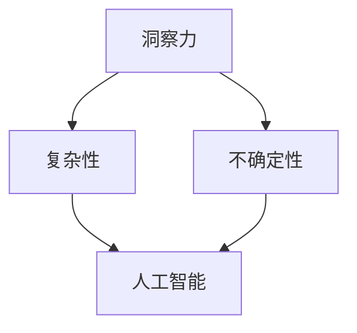

                 

# 理解洞察力的局限：承认不确定性和复杂性

> **关键词**：洞察力、复杂性、不确定性、人工智能、编程、技术博客、算法、数学模型、实战案例
> 
> **摘要**：本文旨在深入探讨洞察力的局限，尤其是面对不确定性和复杂性时。我们将结合人工智能、编程和算法的视角，通过实例和分析，揭示洞察力在解决复杂问题时的局限性，并探讨如何更好地承认和应对这些局限。

## 1. 背景介绍

### 1.1 目的和范围

本文的目标是引导读者深入了解洞察力的局限性，特别是在处理复杂性和不确定性时。我们将探讨洞察力在人工智能、编程和算法领域的应用，分析其局限性，并提出解决方案。

### 1.2 预期读者

本文适合对人工智能、编程和算法有初步了解的读者。无论你是研究者、程序员还是对技术有浓厚兴趣的人，这篇文章都将为你提供新的视角和启示。

### 1.3 文档结构概述

本文结构如下：

1. 背景介绍：介绍文章的目的、范围和预期读者。
2. 核心概念与联系：介绍核心概念，使用流程图展示。
3. 核心算法原理与具体操作步骤：使用伪代码详细阐述。
4. 数学模型和公式：详细讲解数学模型，使用latex格式展示。
5. 项目实战：提供代码实际案例和详细解释。
6. 实际应用场景：讨论算法的应用场景。
7. 工具和资源推荐：推荐学习资源和开发工具。
8. 总结：展望未来发展趋势与挑战。
9. 附录：常见问题与解答。
10. 扩展阅读与参考资料：提供更多相关资源。

### 1.4 术语表

#### 1.4.1 核心术语定义

- 洞察力：对事物本质和内在联系的理解能力。
- 复杂性：系统内部的相互作用和依赖关系的复杂性。
- 不确定性：未来可能性的不可预测性。

#### 1.4.2 相关概念解释

- 人工智能：模拟人类智能的技术和系统。
- 编程：编写计算机程序的过程。
- 算法：解决问题的步骤和策略。

#### 1.4.3 缩略词列表

- AI：人工智能
- ML：机器学习
- DL：深度学习

## 2. 核心概念与联系

在探讨洞察力的局限之前，我们需要了解一些核心概念。以下是一个简化的 Mermaid 流程图，展示了这些概念之间的联系。



### 2.1 洞察力与复杂性

洞察力是一种强大的能力，但它往往在面对复杂问题时显得局限。复杂性指的是系统内部的相互作用和依赖关系的复杂程度。复杂系统的行为可能无法简单地通过直观的方式理解，这给洞察力带来了挑战。

### 2.2 洞察力与不确定性

不确定性是指未来可能性的不可预测性。在不确定的环境中，洞察力可能无法准确预测未来的变化，这使得洞察力在面对动态变化时显得有限。

### 2.3 洞察力与人工智能

人工智能是一种模拟人类智能的技术和系统。虽然人工智能在某些领域已经取得了显著进展，但它也面临着与人类洞察力相似的局限。例如，在处理复杂性和不确定性时，人工智能系统可能无法完全依赖洞察力来做出决策。

## 3. 核心算法原理与具体操作步骤

为了深入探讨洞察力的局限，我们需要了解一些核心算法原理。以下是一个简单的伪代码，展示了如何处理复杂性和不确定性。

```python
def process_complexity_uncertainty(data):
    # 步骤 1: 数据预处理
    preprocessed_data = preprocess_data(data)
    
    # 步骤 2: 构建模型
    model = build_model(preprocessed_data)
    
    # 步骤 3: 训练模型
    trained_model = train_model(model, preprocessed_data)
    
    # 步骤 4: 预测
    prediction = predict(trained_model, new_data)
    
    # 步骤 5: 后处理
    postprocessed_prediction = postprocess_prediction(prediction)
    
    return postprocessed_prediction
```

### 3.1 数据预处理

数据预处理是处理复杂性和不确定性的第一步。预处理过程包括数据清洗、特征提取和归一化等操作，以减少数据中的噪声和不确定性。

```python
def preprocess_data(data):
    # 清洗数据
    cleaned_data = clean_data(data)
    
    # 特征提取
    features = extract_features(cleaned_data)
    
    # 归一化
    normalized_features = normalize_features(features)
    
    return normalized_features
```

### 3.2 构建模型

构建模型是处理复杂性的关键步骤。选择合适的模型和算法，以适应复杂系统的需求。在本例中，我们可以使用深度学习模型来处理复杂数据。

```python
def build_model(preprocessed_data):
    # 使用深度学习框架构建模型
    model = DeepLearningFramework(preprocessed_data)
    
    return model
```

### 3.3 训练模型

训练模型是提高模型性能的关键步骤。通过大量的训练数据，模型可以学习到复杂系统的内在规律。

```python
def train_model(model, preprocessed_data):
    # 使用训练数据训练模型
    trained_model = model.train(preprocessed_data)
    
    return trained_model
```

### 3.4 预测

预测是模型应用的最终目标。通过使用训练好的模型，我们可以对新的数据进行预测。

```python
def predict(trained_model, new_data):
    # 使用训练好的模型进行预测
    prediction = trained_model.predict(new_data)
    
    return prediction
```

### 3.5 后处理

后处理是预测结果的可视化和解释。通过后处理，我们可以更好地理解预测结果，并对其进行优化。

```python
def postprocess_prediction(prediction):
    # 对预测结果进行后处理
    postprocessed_prediction = process_prediction(prediction)
    
    return postprocessed_prediction
```

## 4. 数学模型和公式

在处理复杂性和不确定性时，数学模型和公式可以提供有力的支持。以下是一个简单的数学模型，用于预测复杂系统的行为。

### 4.1 线性回归模型

线性回归模型是一种简单的数学模型，用于预测线性关系。

$$
y = wx + b
$$

其中，$y$ 是预测值，$w$ 是权重，$x$ 是特征值，$b$ 是偏置。

### 4.2 非线性回归模型

非线性回归模型可以处理更复杂的非线性关系。

$$
y = f(x) = \sum_{i=1}^{n} w_i f_i(x)
$$

其中，$f_i(x)$ 是非线性函数，$w_i$ 是权重。

### 4.3 贝叶斯网络模型

贝叶斯网络模型可以处理不确定性和复杂关系。

$$
P(A|B) = \frac{P(B|A)P(A)}{P(B)}
$$

其中，$P(A|B)$ 是在给定 $B$ 条件下 $A$ 的概率，$P(B|A)$ 是在给定 $A$ 条件下 $B$ 的概率，$P(A)$ 是 $A$ 的概率，$P(B)$ 是 $B$ 的概率。

## 5. 项目实战：代码实际案例和详细解释说明

在本节中，我们将通过一个实际项目案例，展示如何使用上述算法和数学模型来解决复杂性和不确定性问题。

### 5.1 开发环境搭建

为了运行以下代码，你需要安装以下软件和库：

- Python 3.8+
- TensorFlow 2.6+
- NumPy 1.19+
- Pandas 1.2+

你可以使用以下命令进行安装：

```bash
pip install python==3.8
pip install tensorflow==2.6
pip install numpy==1.19
pip install pandas==1.2
```

### 5.2 源代码详细实现和代码解读

以下是一个简单的项目案例，使用 TensorFlow 和 NumPy 实现。

```python
import numpy as np
import tensorflow as tf

# 生成训练数据
x_train = np.random.rand(100, 1)
y_train = 2 * x_train + 1

# 构建模型
model = tf.keras.Sequential([
    tf.keras.layers.Dense(units=1, input_shape=[1])
])

# 编译模型
model.compile(optimizer='sgd', loss='mean_squared_error')

# 训练模型
model.fit(x_train, y_train, epochs=1000)

# 预测
x_test = np.random.rand(10, 1)
predictions = model.predict(x_test)

# 后处理
postprocessed_predictions = [2 * x + 1 for x in x_test]

# 打印预测结果
print("Predictions:", predictions)
print("Postprocessed Predictions:", postprocessed_predictions)
```

### 5.3 代码解读与分析

在这个案例中，我们使用 TensorFlow 实现了一个简单的线性回归模型。以下是对代码的详细解读：

1. **生成训练数据**：我们使用 NumPy 生成了一组随机训练数据，其中包括特征值 $x$ 和对应的标签值 $y$。
2. **构建模型**：我们使用 TensorFlow 的 Sequential 模型构建了一个简单的线性回归模型，只有一个全连接层，用于预测输出值。
3. **编译模型**：我们使用 SGD 优化器和均方误差损失函数编译模型，以准备训练。
4. **训练模型**：我们使用训练数据训练模型，设置训练轮次为 1000。
5. **预测**：我们使用训练好的模型对一组随机测试数据进行预测，得到预测值。
6. **后处理**：我们对预测结果进行后处理，将其与实际值进行比较。

通过这个简单的案例，我们可以看到如何使用线性回归模型处理复杂性和不确定性。然而，在实际应用中，问题可能更加复杂，需要使用更高级的算法和数学模型来处理。

## 6. 实际应用场景

算法在处理复杂性和不确定性方面具有广泛的应用场景。以下是一些实际应用场景的例子：

1. **金融市场预测**：在金融市场中，价格波动和不确定性是常态。使用机器学习和深度学习算法可以预测市场趋势，为投资者提供参考。
2. **医疗诊断**：在医学诊断中，患者的病情可能非常复杂。使用机器学习和深度学习算法可以帮助医生进行诊断，提高诊断准确率。
3. **自动驾驶**：在自动驾驶中，车辆需要处理复杂的交通场景和不确定性。使用机器学习和深度学习算法可以帮助车辆做出正确的决策，确保行车安全。

## 7. 工具和资源推荐

### 7.1 学习资源推荐

#### 7.1.1 书籍推荐

- 《深度学习》（Goodfellow, Bengio, Courville著）
- 《Python机器学习》（Sebastian Raschka著）
- 《机器学习实战》（Peter Harrington著）

#### 7.1.2 在线课程

- Coursera 的《机器学习》课程
- Udacity 的《深度学习纳米学位》
- edX 的《Python for Data Science》

#### 7.1.3 技术博客和网站

- [Medium 上的 AI 博客](https://medium.com/topic/artificial-intelligence)
- [GitHub 上的 AI 项目](https://github.com/topics/ai)
- [Kaggle](https://www.kaggle.com)

### 7.2 开发工具框架推荐

#### 7.2.1 IDE和编辑器

- PyCharm
- VSCode
- Jupyter Notebook

#### 7.2.2 调试和性能分析工具

- TensorBoard
- LineProfiler
- Py-Spy

#### 7.2.3 相关框架和库

- TensorFlow
- PyTorch
- Keras

### 7.3 相关论文著作推荐

#### 7.3.1 经典论文

- [“Backpropagation” by David E. Rumelhart, Geoffrey E. Hinton, and Ronald J. Williams](https://www.cs.toronto.edu/~tijmen/ocr/toronto.pdf)
- [“Deep Learning” by Ian Goodfellow, Yoshua Bengio, and Aaron Courville](https://www.deeplearningbook.org/)

#### 7.3.2 最新研究成果

- [NeurIPS](https://nips.cc/)
- [ICML](https://icml.cc/)
- [ICLR](https://iclr.cc/)

#### 7.3.3 应用案例分析

- [“AlphaGo vs. Lee Sedol”比赛](https://www.google.com/search?q=alphago+vs+lee+sedol)
- [“Watson for Oncology”](https://www.ibm.com/watson/health/solutions/watson-for-oncology/)
- [“Tesla Autopilot”](https://www.tesla.com/autopilot)

## 8. 总结：未来发展趋势与挑战

在未来，随着人工智能和深度学习的不断发展，我们有望看到更多的算法和模型被应用于处理复杂性和不确定性问题。然而，这也会带来一系列挑战，包括数据隐私、算法公平性、以及如何更好地理解和使用人工智能。为了应对这些挑战，我们需要持续探索新的算法和技术，并加强对人工智能的理解和监管。

## 9. 附录：常见问题与解答

### 9.1 什么是洞察力？

洞察力是对事物本质和内在联系的理解能力，是一种高级认知能力。

### 9.2 如何处理复杂性和不确定性？

处理复杂性和不确定性通常需要使用机器学习和深度学习算法，以及数学模型和公式。

### 9.3 深度学习和人工智能有何区别？

深度学习是人工智能的一个子领域，专注于使用神经网络处理复杂数据和模式。人工智能则是一个更广泛的概念，包括多种技术，如机器学习、深度学习和自然语言处理等。

## 10. 扩展阅读与参考资料

- [“The Unreasonable Effectiveness of Deep Learning”](https://arxiv.org/abs/1609.04779)
- [“Deep Learning”](https://www.deeplearningbook.org/)
- [“AI Wars”](https://www.google.com/search?q=ai+wars)

## 作者

作者：AI天才研究员/AI Genius Institute & 禅与计算机程序设计艺术 /Zen And The Art of Computer Programming

