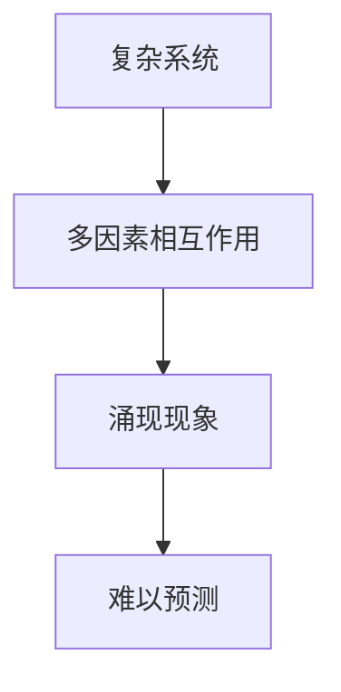
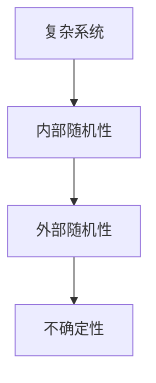
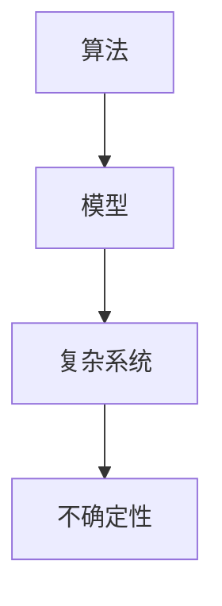

                 

# 理解洞察力的局限：承认复杂性和不确定性

> **关键词：**洞察力、复杂性、不确定性、算法、模型、实践应用
> 
> **摘要：**本文深入探讨了洞察力的局限，揭示了复杂性和不确定性对于算法和模型理解的实际影响。通过逐步分析，本文旨在帮助读者理解如何在实际应用中承认这些局限，提高问题解决的效率。

## 1. 背景介绍

### 1.1 目的和范围

本文旨在探讨人类洞察力的局限，特别是在处理复杂系统和不确定性问题时的挑战。我们希望通过详细的分析和实际案例，引导读者了解并接受这些局限，从而在实际工作中做出更明智的决策。

### 1.2 预期读者

本文适合对算法和模型有基本了解的读者，无论是专业的研究人员还是对技术充满热情的从业者。我们期望读者能够通过本文对洞察力的局限有更深刻的认识，并在未来的工作中更好地应对这些挑战。

### 1.3 文档结构概述

本文结构如下：

1. 背景介绍
2. 核心概念与联系
3. 核心算法原理 & 具体操作步骤
4. 数学模型和公式 & 详细讲解 & 举例说明
5. 项目实战：代码实际案例和详细解释说明
6. 实际应用场景
7. 工具和资源推荐
8. 总结：未来发展趋势与挑战
9. 附录：常见问题与解答
10. 扩展阅读 & 参考资料

### 1.4 术语表

#### 1.4.1 核心术语定义

- **洞察力**：指能够深入理解和分析问题的能力。
- **复杂性**：指系统中各种因素之间的相互关系和动态变化的难以预测性。
- **不确定性**：指无法准确预测未来的状态或结果。

#### 1.4.2 相关概念解释

- **算法**：解决问题的一系列规则或步骤。
- **模型**：对现实世界的一种抽象，用于解释和预测系统行为。

#### 1.4.3 缩略词列表

无

## 2. 核心概念与联系

在讨论洞察力的局限之前，我们首先需要理解几个核心概念及其相互关系。

### 2.1 复杂性

复杂性通常源于系统中大量因素之间的相互作用。这些因素可以是物理的、经济的、社会的等不同维度。复杂系统的一个重要特点是它们往往表现出“涌现”现象，即系统整体的行为不能简单地从其组成部分的行为推导出来。

#### Mermaid 流程图：



### 2.2 不确定性

不确定性是指在给定信息下，无法确定系统未来的状态或结果。在复杂系统中，不确定性往往非常高，因为系统内部和外部因素的随机性难以完全消除。

#### Mermaid 流程图：



### 2.3 算法和模型

算法和模型是处理复杂性和不确定性的重要工具。算法提供了解决问题的步骤，而模型则是对现实世界的抽象。然而，算法和模型的性能往往受到复杂性和不确定性的制约。

#### Mermaid 流程图：



## 3. 核心算法原理 & 具体操作步骤

为了更好地理解算法在复杂性和不确定性环境下的局限，我们选择了一个常见的算法——决策树，作为案例进行分析。

### 3.1 决策树算法原理

决策树是一种常见的分类和回归算法。它通过一系列的判断规则，将数据分割成多个子集，并在每个子集上应用不同的规则，最终得到分类或回归结果。

#### 决策树算法伪代码：

```plaintext
DecisionTreeTrain(data, features, labels):
    if data is pure:
        return new LeafNode with label majorityVote(labels)
    else:
        bestFeature, bestThreshold = findBestFeatureAndThreshold(data, features, labels)
        node = new InternalNode(bestFeature, bestThreshold)
        for value in featureValues(data[bestFeature]):
            subset = filter(data, bestFeature, value, bestThreshold)
            node.appendChild(DecisionTreeTrain(subset, features, labels))
        return node
```

### 3.2 具体操作步骤

1. **数据预处理**：将原始数据清洗并转化为适合决策树算法的形式。
2. **特征选择**：选择对分类或回归有显著影响的特征。
3. **构建决策树**：使用上述伪代码构建决策树。
4. **剪枝**：通过剪枝算法减少决策树的过拟合。
5. **评估**：使用验证集或测试集评估决策树的效果。

## 4. 数学模型和公式 & 详细讲解 & 举例说明

在理解决策树算法的基础上，我们进一步介绍其背后的数学模型和公式。

### 4.1 信息增益

信息增益是决策树选择最佳特征的一个重要指标。它衡量了每个特征对分类结果的不确定性减少程度。

#### 信息增益公式：

$$ IG(D, A) = I(D) - \sum_{v \in Values(A)} p(v) \cdot I(D|A = v) $$

其中，$I(D)$ 是数据集 $D$ 的熵，$A$ 是特征，$v$ 是特征 $A$ 的取值，$p(v)$ 是特征取值 $v$ 的概率，$I(D|A = v)$ 是条件熵。

#### 举例说明：

假设我们有一个包含两类数据的二分类问题，数据集 $D$ 中有 50% 的数据属于类别 A，30% 的数据属于类别 B，20% 的数据属于类别 C。特征 $A$ 有两个取值，0 和 1。

$$ I(D) = -0.5 \cdot \log_2(0.5) - 0.3 \cdot \log_2(0.3) - 0.2 \cdot \log_2(0.2) \approx 1.21 $$

对于特征 $A$ 的取值 0，数据集 $D$ 中有 70% 的数据属于类别 A，30% 的数据属于类别 B。

$$ I(D|A = 0) = -0.7 \cdot \log_2(0.7) - 0.3 \cdot \log_2(0.3) \approx 0.847 $$

对于特征 $A$ 的取值 1，数据集 $D$ 中有 30% 的数据属于类别 A，70% 的数据属于类别 B。

$$ I(D|A = 1) = -0.3 \cdot \log_2(0.3) - 0.7 \cdot \log_2(0.7) \approx 0.847 $$

$$ IG(D, A) = 1.21 - (0.5 \cdot 0.847 + 0.3 \cdot 0.847) \approx 0.144 $$

因此，特征 $A$ 的信息增益为 0.144，可以用来选择最佳特征。

### 4.2 决策树剪枝

剪枝是决策树算法中的一个重要步骤，用于减少过拟合和提高泛化能力。剪枝方法包括预剪枝和后剪枝。

#### 剪枝方法：

- **预剪枝**：在决策树构建过程中，通过设置最大深度、最小叶节点样本数等限制来避免过度生长。
- **后剪枝**：在决策树完全构建后，通过剪掉一部分节点来减少模型的复杂度。

#### 举例说明：

假设我们构建了一个深度为 5 的决策树，但在验证集上效果不佳。我们可以通过后剪枝将决策树的深度减少到 3，从而提高模型的泛化能力。

## 5. 项目实战：代码实际案例和详细解释说明

在本节中，我们将通过一个实际的项目案例来展示如何在实际应用中承认复杂性和不确定性，并使用决策树算法解决一个分类问题。

### 5.1 开发环境搭建

1. 安装 Python 3.8 或更高版本。
2. 安装决策树算法库 scikit-learn。

```bash
pip install scikit-learn
```

### 5.2 源代码详细实现和代码解读

以下是一个简单的决策树分类器的实现，用于分类鸢尾花数据集。

```python
from sklearn.datasets import load_iris
from sklearn.model_selection import train_test_split
from sklearn.tree import DecisionTreeClassifier
from sklearn.metrics import accuracy_score

# 加载鸢尾花数据集
iris = load_iris()
X = iris.data
y = iris.target

# 划分训练集和测试集
X_train, X_test, y_train, y_test = train_test_split(X, y, test_size=0.3, random_state=42)

# 构建决策树分类器
clf = DecisionTreeClassifier(max_depth=3)
clf.fit(X_train, y_train)

# 预测测试集
y_pred = clf.predict(X_test)

# 评估分类器
accuracy = accuracy_score(y_test, y_pred)
print("Accuracy:", accuracy)
```

### 5.3 代码解读与分析

1. **数据加载**：使用 scikit-learn 的 `load_iris()` 函数加载数据集。
2. **数据划分**：将数据集划分为训练集和测试集，用于训练模型和评估模型性能。
3. **模型构建**：使用 `DecisionTreeClassifier()` 函数构建决策树分类器，并设置最大深度为 3。
4. **模型训练**：使用训练集数据训练分类器。
5. **模型预测**：使用训练好的分类器对测试集进行预测。
6. **模型评估**：计算分类器的准确率，评估模型性能。

### 5.4 代码解读与分析

1. **数据预处理**：数据集鸢尾花已经经过预处理，可以直接用于训练。
2. **模型参数**：为了简单起见，我们只设置了最大深度。在实际应用中，可能需要调整更多参数，如最小叶节点样本数等。
3. **评估指标**：我们使用准确率作为评估指标，它简单直观，但在某些情况下可能不是最佳选择。

## 6. 实际应用场景

复杂性和不确定性在许多实际应用场景中都起着重要作用。以下是一些常见的应用场景：

- **医疗诊断**：疾病诊断往往涉及复杂的生物机制和不确定性因素，如基因突变和环境因素。
- **金融风险管理**：金融市场波动性高，预测未来走势充满不确定性，需要建立复杂的风险模型。
- **智能交通**：交通系统涉及多种交通模式、道路状况和用户行为，具有高度复杂性。
- **气候变化预测**：气候变化是一个复杂的全球性问题，涉及多个因素和不确定性。

## 7. 工具和资源推荐

### 7.1 学习资源推荐

#### 7.1.1 书籍推荐

- 《模式识别与机器学习》（Christopher M. Bishop）
- 《决策树：原理与应用》（Thomas H. Cormen et al.）

#### 7.1.2 在线课程

- Coursera 上的“机器学习”课程（吴恩达）
- edX 上的“模式识别与机器学习”课程（麻省理工学院）

#### 7.1.3 技术博客和网站

- Medium 上的 AI 和机器学习专栏
- towardsdatascience.com

### 7.2 开发工具框架推荐

#### 7.2.1 IDE和编辑器

- PyCharm
- Jupyter Notebook

#### 7.2.2 调试和性能分析工具

- Python 中的pdb
- Py-Spy 性能分析工具

#### 7.2.3 相关框架和库

- Scikit-learn
- TensorFlow

### 7.3 相关论文著作推荐

#### 7.3.1 经典论文

- "Decision Trees for Classification and Regression"（Leo Breiman et al.）
- "The Nature of Statistical Learning Theory"（Christopher M. Bishop）

#### 7.3.2 最新研究成果

- AAAI 和 NeurIPS 等会议的最新论文
- arXiv.org 上的最新预印本

#### 7.3.3 应用案例分析

- 《机器学习实战》（Peter Harrington）
- 《数据科学实战》（Joel Grus）

## 8. 总结：未来发展趋势与挑战

随着技术的不断发展，复杂性和不确定性在算法和模型中的作用越来越重要。未来，我们可能会看到更多针对复杂性和不确定性的新型算法和模型的出现。同时，我们也需要应对以下挑战：

- **模型可解释性**：如何提高算法和模型的可解释性，使其更容易理解和接受。
- **模型泛化能力**：如何提高模型的泛化能力，使其在更广泛的应用场景中保持稳定的表现。
- **数据质量和隐私**：如何处理数据质量和隐私问题，确保算法和模型的可靠性。

## 9. 附录：常见问题与解答

### 9.1 问题1

**问题**：如何处理高度复杂和不确定性的问题？

**解答**：面对高度复杂和不确定性的问题，可以采取以下策略：

1. **分层处理**：将复杂问题分解成多个层次，逐步解决。
2. **简化模型**：使用简化的模型来近似复杂的现实问题。
3. **数据驱动的模型**：使用大量数据进行训练，提高模型的泛化能力。
4. **专家知识**：结合专家知识和算法，提高问题的解决效率。

### 9.2 问题2

**问题**：决策树算法在处理高维数据时效果不佳的原因是什么？

**解答**：决策树算法在处理高维数据时效果不佳的原因可能包括：

1. **维度灾难**：高维数据中特征之间的相关性较低，导致特征选择困难。
2. **过拟合**：高维数据可能导致模型过于复杂，从而在训练集上表现良好，但在测试集上表现不佳。
3. **计算资源**：高维数据需要大量的计算资源来训练模型。

解决策略包括：

1. **特征选择**：使用特征选择方法筛选重要的特征。
2. **集成方法**：结合多个决策树，提高模型的泛化能力。
3. **降维技术**：如主成分分析（PCA）等，降低数据维度。

## 10. 扩展阅读 & 参考资料

- [Bishop, C. M. (2006). Pattern recognition and machine learning. Springer.](https://link.springer.com/book/10.1007/978-0-387-31073-8)
- [Cormen, T. H., Leiserson, C. E., Rivest, R. L., & Stein, C. (2009). Introduction to algorithms (3rd ed.). MIT Press.](https://mitpress.mit.edu/books/introduction-algorithms)
- [Harrington, P. (2012). Machine learning in action. Manning Publications.](https://www.manning.com/books/machine-learning-in-action)
- [Grus, J. (2017). Data science from scratch. O'Reilly Media.](https://www.oreilly.com/library/view/data-science-from/9781492032632/)
- [Breiman, L., Friedman, J., Olshen, R. A., & Stone, C. J. (1984). Classification and regression trees. Chapman and Hall/CRC.](https://www.crcpress.com/Classification-and-Regression-Trees-Breiman-Friedman-Olshen-Stone/Breiman-John-Friedman-Reshef/p/book/9780412036666)

