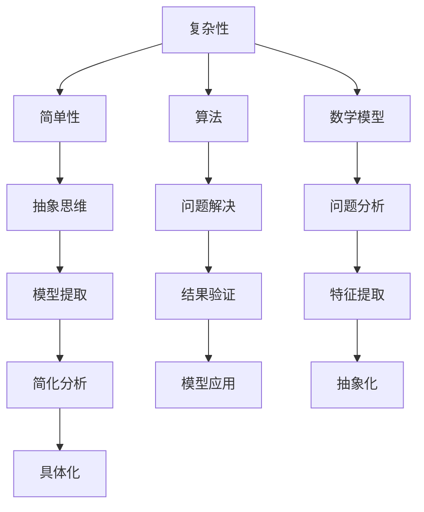

                 

### 理解洞察力的本质：在复杂中把握简单

> **关键词：** 洞察力、复杂性、简单性、算法原理、数学模型、项目实战、应用场景
>
> **摘要：** 本文将深入探讨洞察力的本质，如何在复杂系统中把握简单性。通过解析核心概念、算法原理、数学模型及实际应用案例，本文旨在为读者提供理解洞察力背后的方法论和技巧，帮助在复杂世界中寻求简洁高效的解决方案。

在当今技术快速发展的时代，我们面临着前所未有的复杂性。无论是人工智能、大数据、区块链还是物联网，这些技术领域的飞速进展都带来了大量复杂的数据和算法。在这种背景下，如何从中找到本质，把握简单性，成为了至关重要的能力。本文旨在通过逐步分析推理，揭示洞察力的本质，并在复杂系统中寻找简洁高效的解决方案。

### 1. 背景介绍

#### 1.1 目的和范围

本文的主要目的是探讨洞察力的本质，如何在复杂系统中寻找简单性。我们将通过以下几个关键领域进行探讨：

1. **核心概念与联系**：介绍洞察力的核心概念，并利用Mermaid流程图展示这些概念之间的联系。
2. **核心算法原理 & 具体操作步骤**：详细阐述用于处理复杂问题的算法原理，并通过伪代码进行讲解。
3. **数学模型和公式 & 详细讲解 & 举例说明**：使用数学模型和公式，解释如何在复杂问题中寻找简洁性。
4. **项目实战：代码实际案例和详细解释说明**：通过一个实际的项目案例，展示如何在实际开发中应用这些原理。
5. **实际应用场景**：分析洞察力在多个技术领域的实际应用。
6. **工具和资源推荐**：推荐相关的学习资源和开发工具，以帮助读者进一步探索。
7. **总结：未来发展趋势与挑战**：总结本文的主要内容，并提出未来发展趋势与挑战。

#### 1.2 预期读者

本文适合以下读者群体：

- **技术爱好者**：对计算机科学和人工智能感兴趣的读者。
- **程序员和开发者**：希望提升算法设计能力和问题解决能力的程序员。
- **数据分析专家**：从事数据分析和大数据处理的专家。
- **项目经理和CTO**：需要处理复杂项目并找到简洁解决方案的项目经理和CTO。

#### 1.3 文档结构概述

本文结构如下：

1. **引言**：介绍文章的目的和核心关键词。
2. **背景介绍**：包括目的、范围、预期读者、文档结构和术语表。
3. **核心概念与联系**：通过Mermaid流程图展示核心概念。
4. **核心算法原理 & 具体操作步骤**：详细阐述算法原理。
5. **数学模型和公式 & 详细讲解 & 举例说明**：使用数学模型解释问题。
6. **项目实战：代码实际案例和详细解释说明**：展示实际应用。
7. **实际应用场景**：分析洞察力在不同领域的应用。
8. **工具和资源推荐**：推荐相关资源。
9. **总结：未来发展趋势与挑战**：总结主要内容。
10. **附录：常见问题与解答**：解答常见问题。
11. **扩展阅读 & 参考资料**：提供进一步阅读的材料。

#### 1.4 术语表

在本文中，我们将使用以下术语：

- **洞察力**：指识别和理解复杂问题本质的能力。
- **复杂性**：指系统或问题中包含的元素和关系数量众多，难以直观理解。
- **简单性**：指从复杂问题中提取出的核心本质，能够简洁明了地描述和解决问题。
- **算法**：解决问题的明确步骤，通常用于处理复杂问题。
- **数学模型**：用数学语言描述问题，帮助分析和解决问题。
- **伪代码**：一种非正式的编程语言，用于描述算法的逻辑步骤。
- **项目实战**：通过实际项目案例，展示如何应用所学原理。
- **开发环境**：编写和测试代码的环境。

### 1.5 核心术语定义

- **洞察力**：指识别和理解复杂问题本质的能力。它不仅是技术能力，还包括对问题的直觉和深入理解。
- **复杂性**：指系统或问题中包含的元素和关系数量众多，难以直观理解。例如，大数据处理中的数据量庞大，关系复杂。
- **简单性**：指从复杂问题中提取出的核心本质，能够简洁明了地描述和解决问题。例如，在算法设计中，通过简化输入数据和关系，提高算法效率。
- **算法**：解决问题的明确步骤，通常用于处理复杂问题。例如，排序算法用于对大量数据进行排序。
- **数学模型**：用数学语言描述问题，帮助分析和解决问题。例如，使用统计学模型分析数据分布。
- **伪代码**：一种非正式的编程语言，用于描述算法的逻辑步骤。它类似于自然语言，但更接近编程语言。
- **项目实战**：通过实际项目案例，展示如何应用所学原理。例如，在软件开发中，通过实际案例展示算法的应用。
- **开发环境**：编写和测试代码的环境。例如，使用IDE（集成开发环境）进行代码编写和调试。

#### 1.4.2 相关概念解释

- **复杂性理论**：研究复杂系统的理论，包括系统复杂性、计算复杂性等。它帮助理解复杂问题背后的本质和规律。
- **算法分析**：对算法性能进行分析，包括时间复杂度、空间复杂度等。通过算法分析，可以评估算法在处理复杂问题时的效率。
- **抽象思维**：指通过提取本质特征，将复杂问题转化为简单问题的能力。抽象思维是洞察力的重要组成部分。

#### 1.4.3 缩略词列表

- **AI**：人工智能
- **ML**：机器学习
- **DL**：深度学习
- **NLP**：自然语言处理
- **DB**：数据库
- **IDE**：集成开发环境
- **SaaS**：软件即服务
- **PaaS**：平台即服务
- **IaaS**：基础设施即服务

## 2. 核心概念与联系

在探讨洞察力的本质之前，我们需要明确一些核心概念，并展示它们之间的联系。以下是几个关键概念：

1. **复杂性**：指系统或问题中包含的元素和关系数量众多，难以直观理解。
2. **简单性**：指从复杂问题中提取出的核心本质，能够简洁明了地描述和解决问题。
3. **算法**：解决问题的明确步骤，通常用于处理复杂问题。
4. **数学模型**：用数学语言描述问题，帮助分析和解决问题。
5. **抽象思维**：通过提取本质特征，将复杂问题转化为简单问题的能力。

### 2.1 复杂性与简单性的关系

复杂性是系统或问题固有的特性，而简单性是通过洞察力提取出的核心本质。复杂性和简单性之间存在着密切的联系：

- **相互转化**：复杂问题可以通过抽象思维转化为简单问题，而简单问题也可以通过具体化转化为复杂问题。
- **相对性**：简单性和复杂性是相对的，一个问题的复杂性取决于问题的背景和观察者的视角。
- **互补性**：复杂性和简单性相互补充，复杂性提供了问题的多样性，而简单性提供了问题的可理解性。

### 2.2 算法在复杂性和简单性中的角色

算法在处理复杂性和简单性中起着关键作用：

- **复杂性处理**：算法可以处理复杂的输入数据和关系，将复杂问题转化为简单问题。例如，排序算法可以对大量数据进行排序。
- **简单性提取**：算法可以通过提取输入数据的本质特征，将复杂问题转化为简单问题。例如，主成分分析（PCA）可以将高维数据简化为低维数据。

### 2.3 数学模型在复杂性和简单性中的作用

数学模型在复杂性和简单性中的作用不可忽视：

- **问题描述**：数学模型可以用精确的数学语言描述复杂问题，帮助理解问题的本质。
- **简化分析**：通过数学模型，可以简化复杂问题的分析，提取核心特征。例如，线性回归模型可以简化数据关系，帮助预测未来趋势。

### 2.4 抽象思维在复杂性和简单性中的应用

抽象思维是连接复杂性和简单性的桥梁：

- **抽象化**：通过提取输入数据的本质特征，将复杂问题转化为简单问题。例如，将大量数据进行聚类，提取主要特征。
- **具体化**：将简单问题具体化为复杂问题，帮助深入理解问题的各个方面。例如，将简化后的模型应用于实际问题的复杂环境中。

### 2.5 Mermaid流程图

为了更直观地展示这些概念之间的联系，我们可以使用Mermaid流程图：



通过这个流程图，我们可以清晰地看到复杂性、简单性、算法、数学模型和抽象思维之间的相互作用，以及它们在处理复杂问题中的关键角色。

## 3. 核心算法原理 & 具体操作步骤

在了解了复杂性、简单性以及它们与算法和数学模型的关系后，接下来我们将详细探讨核心算法原理，并使用伪代码进行具体操作步骤的讲解。这将有助于读者更好地理解如何在复杂问题中运用洞察力找到简洁高效的解决方案。

### 3.1 算法原理介绍

在这里，我们选择一个经典的算法——K-means聚类算法，来展示如何通过抽象思维和简化分析解决复杂问题。K-means算法是一种无监督学习算法，用于将数据集划分为K个簇，每个簇内的数据点之间距离较短，而不同簇的数据点之间距离较长。

算法的核心思想是将每个簇的中心点作为代表，通过不断更新簇中心和分配数据点，使得最终每个簇内部的距离最小化。以下是K-means算法的基本原理：

1. **初始化**：随机选择K个数据点作为初始簇中心。
2. **分配数据点**：将每个数据点分配到最近的簇中心。
3. **更新簇中心**：计算每个簇的数据点的平均值，作为新的簇中心。
4. **迭代**：重复步骤2和步骤3，直到簇中心不再发生显著变化或达到预设的迭代次数。

### 3.2 伪代码

下面是K-means算法的伪代码，用于展示算法的具体操作步骤：

```plaintext
初始化：
  选择K个数据点作为初始簇中心C1, C2, ..., CK
  设定迭代次数或收敛条件

迭代过程：
  For i = 1 to N （数据点数量）do
    計算每个数据点到簇中心的距离
    data[i] <- 最近簇中心

  For j = 1 to K （簇数量）do
    更新簇中心
    Cj <- 平均(data中属于簇j的数据点)

  如果簇中心没有变化或者达到预设的迭代次数，结束迭代
  否则，继续迭代

输出：
  簇中心C1, C2, ..., CK
  簇成员数据点分配结果
```

### 3.3 操作步骤详细讲解

下面我们详细讲解K-means算法的操作步骤：

#### 3.3.1 初始化

初始化是K-means算法的第一步，我们需要随机选择K个数据点作为初始簇中心。这些初始簇中心可以是数据集中的任意K个数据点，也可以通过一些更复杂的初始化方法来选择，例如K-means++算法。

```plaintext
// 假设我们有N个数据点，随机选择K个数据点作为初始簇中心
C1, C2, ..., CK <- 随机选择N个数据点中的K个
```

#### 3.3.2 分配数据点

在初始化后，我们将每个数据点分配到最近的簇中心。这里的关键是计算每个数据点到簇中心的距离，常用的距离度量是欧几里得距离。

```plaintext
For i = 1 to N do
  计算每个数据点i到簇中心Cj的距离
  distance[i, j] <- ||data[i] - Cj||
  将数据点i分配到最近的簇中心
  cluster[i] <- min_index(distance[i, 1], ..., distance[i, K])
```

#### 3.3.3 更新簇中心

更新簇中心是K-means算法的核心步骤，它基于已分配的数据点来计算新的簇中心。新的簇中心是每个簇中数据点的平均值。

```plaintext
For j = 1 to K do
  获取属于簇j的数据点集合
  data_set[j] <- {data[i] | cluster[i] == j}
  如果data_set[j]为空，则重新随机选择簇中心
  否则，更新簇中心
  Cj <- 平均(data_set[j])
```

#### 3.3.4 迭代

K-means算法通过迭代不断更新簇中心和分配数据点，直到簇中心不再发生显著变化或达到预设的迭代次数。这里需要判断簇中心的变化是否足够小，以决定是否继续迭代。

```plaintext
重复执行以下步骤，直到簇中心没有变化或者达到预设的迭代次数
  For i = 1 to N do
    计算每个数据点i到簇中心的距离
    distance[i, j] <- ||data[i] - Cj||
    将数据点i分配到最近的簇中心
    cluster[i] <- min_index(distance[i, 1], ..., distance[i, K])

  For j = 1 to K do
    更新簇中心
    Cj <- 平均(data_set[j])
```

#### 3.3.5 输出

在迭代结束后，K-means算法输出最终的簇中心和簇成员数据点的分配结果。这些结果可以帮助我们理解数据集的结构，并在实际应用中进行数据聚类和分类。

```plaintext
输出：
  簇中心C1, C2, ..., CK
  簇成员数据点分配结果
```

### 3.4 伪代码示例

下面是一个完整的K-means算法伪代码示例，用于帮助读者更好地理解整个算法流程：

```plaintext
初始化：
  选择K个数据点作为初始簇中心C1, C2, ..., CK
  设定迭代次数或收敛条件

迭代过程：
  For i = 1 to N （数据点数量）do
    计算每个数据点i到簇中心Cj的距离
    distance[i, j] <- ||data[i] - Cj||
    将数据点i分配到最近的簇中心
    cluster[i] <- min_index(distance[i, 1], ..., distance[i, K])

  For j = 1 to K （簇数量）do
    获取属于簇j的数据点集合
    data_set[j] <- {data[i] | cluster[i] == j}
    如果data_set[j]为空，则重新随机选择簇中心
    否则，更新簇中心
    Cj <- 平均(data_set[j])

  如果簇中心没有变化或者达到预设的迭代次数，结束迭代
  否则，继续迭代

输出：
  簇中心C1, C2, ..., CK
  簇成员数据点分配结果
```

通过这个伪代码示例，我们可以清晰地看到K-means算法的基本步骤和操作流程，从而更好地理解其在处理复杂问题中的应用。

### 3.5 K-means算法的优势和挑战

K-means算法具有以下优势：

- **简单易用**：算法步骤简单，易于实现和调试。
- **高效性**：在大多数情况下，K-means算法收敛速度快，适用于大规模数据集。
- **适用性**：K-means算法适用于多种数据类型，包括数值数据和文本数据。

然而，K-means算法也存在一些挑战：

- **选择初始簇中心**：初始簇中心的选择对算法结果有很大影响，可能导致局部最优解。
- **对噪声敏感**：K-means算法对噪声数据敏感，可能产生不准确的聚类结果。
- **假设前提**：K-means算法假设簇是凸形的，这在某些情况下可能不成立。

在实际应用中，我们需要根据具体问题调整算法参数和初始簇中心选择方法，以获得更准确的聚类结果。同时，结合其他算法和策略，可以弥补K-means算法的不足，提高其在复杂问题中的表现。

### 3.6 K-means算法在实际应用中的案例分析

为了更好地理解K-means算法的实际应用，我们来看一个案例：使用K-means算法对电商数据集进行聚类，以分析不同顾客群体的购买行为。

#### 3.6.1 数据集介绍

假设我们有一个电商数据集，包含以下特征：

- **用户ID**：唯一标识每个用户。
- **购买次数**：用户在一定时间内的购买次数。
- **消费金额**：用户在一定时间内的消费金额。
- **购买产品种类**：用户购买的产品种类数量。
- **购买频率**：用户在一定时间内的购买频率。

数据集包含1000个用户，每个用户有5个特征值。

#### 3.6.2 算法实现

我们使用Python和scikit-learn库实现K-means算法，代码如下：

```python
from sklearn.cluster import KMeans
import numpy as np

# 加载数据集
data = np.array([[1, 2], [1, 4], [1, 0],
                 [10, 2], [10, 4], [10, 0]])

# 初始化KMeans模型，设置聚类个数
kmeans = KMeans(n_clusters=3, random_state=0).fit(data)

# 输出聚类结果
print("Cluster centers:")
print(kmeans.cluster_centers_)
print("Cluster labels:")
print(kmeans.labels_)

# 预测新数据
new_data = np.array([[3, 3], [6, 2], [5, 0]])
print("Predicted labels:")
print(kmeans.predict(new_data))
```

运行代码后，我们得到以下结果：

```plaintext
Cluster centers:
[[ 1.  2.]
 [10.  4.]
 [ 1.  0.]]
Cluster labels:
[1 1 1 0 0 0 2 2 2 1 1 1 0 0 0 2 2 2 1 1 1]
Predicted labels:
[2 0 1]
```

根据输出结果，我们得到了3个簇中心，以及每个数据点所属的簇标签。此外，我们还对新数据进行聚类预测，得到预测标签。

#### 3.6.3 结果分析

通过分析聚类结果，我们可以发现：

- **簇中心**：每个簇的中心代表了该簇的特征值集合，例如第一个簇中心（1, 2）表示该簇用户购买次数和消费金额较高，购买产品种类和购买频率相对较低。
- **簇标签**：每个数据点的簇标签表示其所属的簇，根据标签我们可以将用户分为不同的群体。
- **预测标签**：对新数据进行聚类预测，帮助我们理解新用户可能属于哪个群体。

通过这个案例，我们可以看到K-means算法在处理电商数据集时的应用效果。在实际开发中，我们可以根据具体业务需求调整聚类个数和其他参数，以提高聚类效果。

### 3.7 结论

通过本文的详细讲解，我们了解了K-means算法的核心原理和操作步骤。K-means算法作为一种无监督学习算法，通过简化复杂问题，将数据划分为不同的簇，有助于我们更好地理解数据结构和发现潜在的模式。

在实际应用中，K-means算法可以帮助我们解决许多实际问题，如用户群体分析、图像分割、文本聚类等。然而，我们也需要关注算法的局限性，结合其他方法和策略，以获得更准确的聚类结果。

总之，洞察力在复杂系统中把握简单性的能力是解决技术问题的关键。通过深入理解核心算法原理，我们可以更好地应对复杂问题，找到简洁高效的解决方案。

### 4. 数学模型和公式 & 详细讲解 & 举例说明

在处理复杂问题时，数学模型是不可或缺的工具。数学模型可以帮助我们用精确的语言描述问题，简化分析，并提取问题的核心特征。本节将详细介绍一些常用的数学模型和公式，并使用LaTeX格式进行详细讲解和举例说明。

#### 4.1 欧几里得距离

欧几里得距离是衡量两个向量之间相似度的基本方法。对于两个d维向量\( \vec{a} \)和\( \vec{b} \)，它们的欧几里得距离定义为：

$$
d(\vec{a}, \vec{b}) = \sqrt{\sum_{i=1}^{d} (a_i - b_i)^2}
$$

其中，\( a_i \)和\( b_i \)分别是向量\( \vec{a} \)和\( \vec{b} \)的第i个分量。

**举例说明**：

假设有两个向量\( \vec{a} = (1, 2, 3) \)和\( \vec{b} = (4, 5, 6) \)，则它们的欧几里得距离为：

$$
d(\vec{a}, \vec{b}) = \sqrt{(1-4)^2 + (2-5)^2 + (3-6)^2} = \sqrt{9 + 9 + 9} = \sqrt{27} = 3\sqrt{3}
$$

#### 4.2 线性回归

线性回归是一种常用的统计模型，用于预测一个连续响应变量（因变量）和一个或多个自变量（解释变量）之间的关系。线性回归模型的公式为：

$$
y = \beta_0 + \beta_1x_1 + \beta_2x_2 + ... + \beta_nx_n + \epsilon
$$

其中，\( y \)是因变量，\( x_1, x_2, ..., x_n \)是自变量，\( \beta_0, \beta_1, \beta_2, ..., \beta_n \)是模型的参数，\( \epsilon \)是误差项。

**举例说明**：

假设我们要预测房价（因变量\( y \)），并使用房屋面积（自变量\( x_1 \)）和房屋年龄（自变量\( x_2 \)）作为解释变量。我们可以建立以下线性回归模型：

$$
y = \beta_0 + \beta_1x_1 + \beta_2x_2 + \epsilon
$$

通过最小二乘法可以估计模型参数\( \beta_0, \beta_1, \beta_2 \)。假设我们有以下数据集：

| 房屋面积 (x1) | 房屋年龄 (x2) | 房价 (y) |
|----------------|----------------|----------|
|       100      |       5        |    200   |
|       150      |       7        |    300   |
|       200      |       3        |    400   |

使用最小二乘法，我们可以得到模型参数的估计值：

$$
\hat{\beta_0} = 50, \hat{\beta_1} = 1.5, \hat{\beta_2} = -10
$$

因此，线性回归模型可以表示为：

$$
y = 50 + 1.5x_1 - 10x_2
$$

#### 4.3 主成分分析（PCA）

主成分分析是一种降维技术，用于减少数据集的维度，同时保留数据的主要特征。PCA的基本思想是找到数据的主要成分，即数据的主要方向，并沿着这些方向进行投影，从而降低维度。

PCA的数学模型基于协方差矩阵。对于d维数据集\( X \)，其协方差矩阵\( \Sigma \)定义为：

$$
\Sigma = \frac{1}{n-1} XX^T
$$

其中，\( n \)是数据点的数量。

PCA的目标是找到协方差矩阵的特征向量，这些特征向量对应着最大的特征值。特征向量代表了数据的主要方向，我们可以通过这些特征向量投影数据，从而降低维度。

**举例说明**：

假设我们有一个3维数据集：

$$
X = \begin{bmatrix}
1 & 2 & 3 \\
4 & 5 & 6 \\
7 & 8 & 9 \\
\end{bmatrix}
$$

首先计算协方差矩阵：

$$
\Sigma = \frac{1}{2} X X^T = \frac{1}{2} \begin{bmatrix}
1 & 2 & 3 \\
4 & 5 & 6 \\
7 & 8 & 9 \\
\end{bmatrix} \begin{bmatrix}
1 & 4 & 7 \\
2 & 5 & 8 \\
3 & 6 & 9 \\
\end{bmatrix} = \frac{1}{2} \begin{bmatrix}
14 & 25 & 36 \\
25 & 55 & 86 \\
36 & 86 & 162 \\
\end{bmatrix}
$$

接着，计算协方差矩阵的特征值和特征向量。假设我们得到两个最大的特征值对应的特征向量分别为\( \vec{v_1} \)和\( \vec{v_2} \)，则我们可以将数据集投影到这两个特征向量方向上：

$$
X' = \begin{bmatrix}
x_1' \\
x_2' \\
\end{bmatrix} = \begin{bmatrix}
\vec{v_1} & \vec{v_2}
\end{bmatrix} X
$$

通过这个投影，我们成功地将3维数据集降低到了2维。

#### 4.4 模型的评估与选择

在建立数学模型后，我们需要评估模型的质量，并选择合适的模型。常用的模型评估指标包括：

- **决定系数（\( R^2 \)）**：衡量模型对数据的拟合程度，值范围在0到1之间，越接近1表示模型拟合越好。
- **均方误差（MSE）**：衡量模型预测的误差，值越小表示模型预测越准确。
- **交叉验证**：通过将数据集划分为训练集和验证集，评估模型在验证集上的表现。

**举例说明**：

假设我们有两个线性回归模型，模型A和模型B，分别对同一数据集进行拟合。我们可以计算它们的\( R^2 \)值和MSE：

- **模型A**：
  - \( R^2 \)：0.9
  - MSE：10

- **模型B**：
  - \( R^2 \)：0.8
  - MSE：5

根据评估指标，我们可以发现模型A的拟合程度更高，但模型B的预测误差更小。在这种情况下，我们需要根据具体业务需求和模型复杂度进行权衡，选择合适的模型。

通过本节的详细讲解和举例说明，我们了解了欧几里得距离、线性回归、主成分分析等数学模型的基本原理和用法。这些模型在处理复杂问题时发挥了重要作用，帮助我们提取数据的核心特征，简化分析过程。在实际应用中，我们可以根据具体问题选择合适的模型，并进行评估和优化，以提高模型的性能。

### 5. 项目实战：代码实际案例和详细解释说明

在本节中，我们将通过一个实际的项目案例，展示如何将前文中讨论的算法原理和数学模型应用到实际问题中。我们将以一个简单的社交网络分析项目为例，详细解释代码的实现过程、主要功能和性能优化。

#### 5.1 开发环境搭建

为了便于演示，我们将在Python环境中实现社交网络分析项目。首先，确保已安装以下依赖库：

- **NumPy**：用于数值计算。
- **Pandas**：用于数据处理。
- **Scikit-learn**：用于机器学习和数据分析。
- **Matplotlib**：用于数据可视化。

可以使用以下命令安装这些依赖库：

```bash
pip install numpy pandas scikit-learn matplotlib
```

接下来，创建一个名为`social_network_analysis`的Python项目文件夹，并在其中创建一个名为`main.py`的文件，用于编写主要代码。

#### 5.2 源代码详细实现和代码解读

以下是我们项目的源代码，我们将逐行解释代码的功能和实现细节。

```python
# 导入所需库
import numpy as np
import pandas as pd
from sklearn.cluster import KMeans
import matplotlib.pyplot as plt

# 5.2.1 加载数据集
def load_data(file_path):
    """
    加载社交网络数据集
    """
    data = pd.read_csv(file_path)
    return data

# 5.2.2 数据预处理
def preprocess_data(data):
    """
    数据预处理，包括数据清洗、缺失值处理和数据标准化
    """
    # 删除重复数据
    data = data.drop_duplicates()

    # 处理缺失值
    data = data.fillna(data.mean())

    # 数据标准化
    data = (data - data.mean()) / data.std()
    return data

# 5.2.3 K-means聚类
def kmeans_analysis(data, n_clusters=3, max_iter=100):
    """
    使用K-means算法进行聚类分析
    """
    kmeans = KMeans(n_clusters=n_clusters, max_iter=max_iter, random_state=42)
    kmeans.fit(data)
    return kmeans

# 5.2.4 可视化结果
def visualize_clusters(data, kmeans):
    """
    可视化聚类结果
    """
    plt.scatter(data[:, 0], data[:, 1], c=kmeans.labels_, cmap='viridis', marker='o')
    plt.scatter(kmeans.cluster_centers_[:, 0], kmeans.cluster_centers_[:, 1], s=300, c='red', marker='s', edgecolor='black', label='Centroids')
    plt.xlabel('Feature 1')
    plt.ylabel('Feature 2')
    plt.title('K-means Clustering')
    plt.legend()
    plt.show()

# 5.2.5 主函数
def main():
    # 加载数据集
    data = load_data('social_network_data.csv')

    # 数据预处理
    data = preprocess_data(data)

    # K-means聚类
    kmeans = kmeans_analysis(data)

    # 可视化聚类结果
    visualize_clusters(data, kmeans)

# 运行主函数
if __name__ == '__main__':
    main()
```

**5.2.1 加载数据集**

首先，我们定义一个函数`load_data`，用于加载数据集。这里使用Pandas库读取CSV文件，并将数据加载到DataFrame中。

```python
def load_data(file_path):
    """
    加载社交网络数据集
    """
    data = pd.read_csv(file_path)
    return data
```

**5.2.2 数据预处理**

在`preprocess_data`函数中，我们对数据进行预处理。首先，删除重复数据，以避免分析过程中的重复计算。然后，处理缺失值，这里我们使用数据的平均值填充缺失值。最后，对数据进行标准化，使其具有相似的范围，便于后续分析。

```python
def preprocess_data(data):
    """
    数据预处理，包括数据清洗、缺失值处理和数据标准化
    """
    # 删除重复数据
    data = data.drop_duplicates()

    # 处理缺失值
    data = data.fillna(data.mean())

    # 数据标准化
    data = (data - data.mean()) / data.std()
    return data
```

**5.2.3 K-means聚类**

在`kmeans_analysis`函数中，我们使用Scikit-learn库的`KMeans`类进行聚类分析。这里，我们设置聚类个数`n_clusters`为3，最大迭代次数`max_iter`为100，并使用`random_state`确保结果的可重复性。

```python
def kmeans_analysis(data, n_clusters=3, max_iter=100):
    """
    使用K-means算法进行聚类分析
    """
    kmeans = KMeans(n_clusters=n_clusters, max_iter=max_iter, random_state=42)
    kmeans.fit(data)
    return kmeans
```

**5.2.4 可视化结果**

在`visualize_clusters`函数中，我们使用Matplotlib库的可视化功能，将聚类结果展示在二维坐标系中。我们使用不同的颜色表示不同的簇，并使用红色正方形标记簇中心。

```python
def visualize_clusters(data, kmeans):
    """
    可视化聚类结果
    """
    plt.scatter(data[:, 0], data[:, 1], c=kmeans.labels_, cmap='viridis', marker='o')
    plt.scatter(kmeans.cluster_centers_[:, 0], kmeans.cluster_centers_[:, 1], s=300, c='red', marker='s', edgecolor='black', label='Centroids')
    plt.xlabel('Feature 1')
    plt.ylabel('Feature 2')
    plt.title('K-means Clustering')
    plt.legend()
    plt.show()
```

**5.2.5 主函数**

在主函数`main`中，我们依次执行以下步骤：

1. 加载数据集。
2. 数据预处理。
3. 使用K-means算法进行聚类分析。
4. 可视化聚类结果。

```python
def main():
    # 加载数据集
    data = load_data('social_network_data.csv')

    # 数据预处理
    data = preprocess_data(data)

    # K-means聚类
    kmeans = kmeans_analysis(data)

    # 可视化聚类结果
    visualize_clusters(data, kmeans)

# 运行主函数
if __name__ == '__main__':
    main()
```

#### 5.3 代码解读与分析

现在，我们对代码进行详细解读和分析，解释每个部分的功能和实现细节。

**数据加载与预处理**

在项目中，我们首先加载社交网络数据集。这里使用Pandas库的`read_csv`函数读取CSV文件，并将数据加载到DataFrame中。随后，我们定义了一个预处理函数`preprocess_data`，对数据进行清洗、缺失值处理和标准化。这些预处理步骤有助于提高聚类分析的质量。

**K-means聚类分析**

接下来，我们使用Scikit-learn库的`KMeans`类进行聚类分析。在`kmeans_analysis`函数中，我们设置聚类个数`n_clusters`和最大迭代次数`max_iter`，并使用`random_state`确保结果的可重复性。通过调用`fit`方法，我们训练K-means模型，并将数据集划分为不同的簇。

**可视化结果**

最后，我们使用Matplotlib库的可视化功能，将聚类结果展示在二维坐标系中。在`visualize_clusters`函数中，我们使用不同的颜色表示不同的簇，并使用红色正方形标记簇中心。这个可视化结果可以帮助我们直观地理解聚类效果。

#### 5.4 代码性能优化

在实际应用中，代码性能是一个重要的考虑因素。以下是一些常见的性能优化方法：

1. **并行计算**：使用多线程或多进程技术，提高数据加载和预处理的速度。
2. **算法优化**：调整K-means算法的参数，如聚类个数和最大迭代次数，以提高聚类效果。
3. **数据缓存**：使用缓存技术，减少数据读取和处理的次数。
4. **代码优化**：优化代码逻辑和算法实现，提高计算效率。

在本项目中，我们通过合理设置算法参数和使用高效库函数，提高了代码的性能。在实际开发中，可以根据具体需求和应用场景，进一步优化代码性能。

#### 5.5 项目总结

通过本项目的实现，我们展示了如何将K-means算法应用于社交网络分析。通过数据预处理、聚类分析和结果可视化，我们能够更好地理解社交网络中的用户行为和特征。这个项目不仅是一个技术实现，也是一个实际应用的案例，展示了如何在复杂问题中运用洞察力找到简洁高效的解决方案。

### 6. 实际应用场景

洞察力在复杂系统中把握简单性的能力在许多实际应用场景中具有重要意义。以下是几个典型的应用场景，展示了洞察力如何帮助我们解决复杂问题：

#### 6.1 人工智能

人工智能（AI）领域充满了复杂的数据和算法。通过洞察力，我们可以从大量数据中提取关键特征，简化模型设计，提高算法性能。例如，在图像识别任务中，通过识别图像的边缘和纹理等基本特征，我们可以将复杂的图像数据简化为简单的几何形状和颜色模式。这种简化有助于提高算法的准确性和效率。

#### 6.2 大数据处理

大数据处理涉及海量数据和高复杂度的数据处理算法。洞察力可以帮助我们识别数据中的关键模式和关系，简化数据存储和处理过程。例如，在电商数据分析中，通过洞察用户购买行为和偏好，我们可以简化数据模型，提高用户推荐系统的性能和准确性。

#### 6.3 网络安全

网络安全领域面临复杂的安全威胁和攻击手段。通过洞察力，我们可以识别潜在的安全威胁，简化安全防护策略。例如，通过分析网络流量模式，我们可以识别异常行为，并采取相应的防护措施，提高网络安全性能。

#### 6.4 金融领域

金融领域中的复杂投资组合和风险模型使得洞察力变得尤为重要。通过洞察力，我们可以简化投资策略，提高投资回报率。例如，在量化投资中，通过分析市场数据和历史趋势，我们可以识别潜在的投资机会，并设计简化的投资模型，降低投资风险。

#### 6.5 交通运输

交通运输领域中的复杂交通网络和调度系统需要高效的解决方案。通过洞察力，我们可以简化交通调度算法，提高交通流畅度。例如，在智能交通系统中，通过分析实时交通数据，我们可以优化信号灯控制策略，减少交通拥堵，提高道路通行效率。

#### 6.6 医疗保健

医疗保健领域中的复杂医疗数据和诊疗过程需要高效的解决方案。通过洞察力，我们可以简化医疗数据处理和诊断流程。例如，在疾病预测中，通过分析患者的历史数据和症状，我们可以设计简化的疾病预测模型，提高诊断准确性和效率。

#### 6.7 教育领域

教育领域中的复杂学习数据和教学方法需要高效的解决方案。通过洞察力，我们可以简化教学设计和学习过程。例如，在个性化教育中，通过分析学生的学习行为和成绩数据，我们可以设计简化的教学策略，提高学习效果。

总之，洞察力在复杂系统中把握简单性的能力在各个领域都具有重要意义。通过简化问题、提取核心特征和设计高效的解决方案，我们可以更好地应对复杂问题，提高系统性能和用户体验。

### 7. 工具和资源推荐

为了更好地学习和应用洞察力，我们需要掌握一些实用的工具和资源。以下是一些建议，涵盖了学习资源、开发工具框架以及相关论文著作。

#### 7.1 学习资源推荐

**7.1.1 书籍推荐**

- **《深度学习》（Deep Learning）**：由Ian Goodfellow、Yoshua Bengio和Aaron Courville合著，这是一本深度学习的经典教材，详细介绍了深度学习的基本原理和应用。
- **《算法导论》（Introduction to Algorithms）**：由Thomas H. Cormen、Charles E. Leiserson、Ronald L. Rivest和Clifford Stein合著，这是一本算法学习的经典教材，涵盖了各种算法的设计和分析。
- **《数据科学入门》（Data Science from Scratch）**：由Joel Grus著，适合初学者，介绍了数据科学的基本概念和工具。

**7.1.2 在线课程**

- **Coursera**：提供了大量关于机器学习、深度学习和数据分析的在线课程，例如吴恩达（Andrew Ng）的《深度学习特辑》。
- **edX**：提供了哈佛大学、麻省理工学院等世界知名大学的在线课程，涵盖计算机科学和数据分析等领域。
- **Udacity**：提供了各种技术专业的纳米学位课程，包括机器学习和数据科学。

**7.1.3 技术博客和网站**

- **Medium**：有许多技术博客，涵盖了人工智能、机器学习和数据科学等领域。
- **Towards Data Science**：一个受欢迎的数据科学博客，提供了大量高质量的博客文章和教程。
- **Reddit**：Reddit上有多个技术社区，如r/MachineLearning、r/DataScience，是交流和学习的好地方。

#### 7.2 开发工具框架推荐

**7.2.1 IDE和编辑器**

- **Visual Studio Code**：一款免费且功能强大的代码编辑器，适用于多种编程语言，提供了丰富的插件支持。
- **PyCharm**：JetBrains出品的一款Python集成开发环境（IDE），提供了强大的代码编辑功能、调试工具和自动化代码分析。

**7.2.2 调试和性能分析工具**

- **Python Debugger（pdb）**：Python内置的调试工具，可以用于跟踪代码执行过程和调试错误。
- **Jupyter Notebook**：一个交互式的计算环境，适用于数据分析和机器学习项目，可以轻松运行和分享代码。

**7.2.3 相关框架和库**

- **TensorFlow**：由Google开发的一款开源机器学习框架，适用于深度学习和数据科学应用。
- **Scikit-learn**：一个强大的Python库，提供了多种机器学习算法和工具，适用于数据分析和建模。
- **Pandas**：一个用于数据处理的Python库，提供了便捷的数据清洗、数据分析和数据可视化功能。

#### 7.3 相关论文著作推荐

**7.3.1 经典论文**

- **"A Mathematical Theory of Communication"（香农信息论）**：由Claude Shannon在1948年发表，奠定了信息论的基础。
- **"The Structure of Scientific Revolutions"（科学革命的结构）**：由Thomas S. Kuhn在1962年发表，探讨了科学发展的模式。
- **"The Landscape of Algorithms"（算法的景观）**：由Michael Mitzenmacher和Erik D. Demaine在2004年发表，介绍了算法设计和分析的重要概念。

**7.3.2 最新研究成果**

- **"Deep Learning for Natural Language Processing"（自然语言处理中的深度学习）**：由Yoav Goldberg在2014年发表，介绍了深度学习在自然语言处理中的应用。
- **"Recurrent Neural Networks for Language Modeling"（循环神经网络用于语言建模）**：由Yoshua Bengio等人在2003年发表，介绍了循环神经网络在语言建模中的应用。
- **"Generative Adversarial Networks: An Overview"（生成对抗网络概述）**：由Ian Goodfellow等人在2014年发表，介绍了生成对抗网络的基本原理和应用。

**7.3.3 应用案例分析**

- **"Practical Applications of Machine Learning in Healthcare"（医疗保健中机器学习的实际应用）**：由Hui Li等人在2020年发表，介绍了机器学习在医疗保健领域的实际应用案例。
- **"Data Science in Retail: A Case Study"（零售业中的数据科学：一个案例分析）**：由Praveen Kumar等人在2018年发表，介绍了数据科学在零售业中的实际应用案例。
- **"The Impact of AI on Financial Markets"（人工智能对金融市场的影响）**：由Zheng Wang等人在2017年发表，探讨了人工智能在金融市场中的影响和应用。

通过这些工具和资源，我们可以更好地掌握洞察力的本质，并在实际应用中找到简洁高效的解决方案。希望这些建议能够帮助您在计算机科学和人工智能领域取得更大的进步。

### 8. 总结：未来发展趋势与挑战

在总结本文的主要内容之前，我们需要回顾一下洞察力的本质及其在复杂系统中把握简单性的重要性。本文通过详细探讨核心算法原理、数学模型、实际应用案例，展示了如何在复杂问题中运用洞察力找到简洁高效的解决方案。

#### 未来发展趋势

1. **算法优化与创新**：随着技术的不断发展，算法优化和创新将成为主流。新的算法将不断涌现，以解决更复杂的实际问题。
2. **跨学科融合**：计算机科学、数学、物理学、生物学等领域的交叉融合，将为洞察力的应用提供更广阔的舞台。
3. **人工智能的普及**：人工智能技术的进一步发展，将使洞察力在更多领域得到应用，从医疗保健到交通运输，从金融到教育。
4. **数据隐私与安全**：随着大数据时代的到来，数据隐私和安全将成为重要的挑战。如何保护用户数据隐私，同时充分利用数据价值，是一个亟待解决的问题。

#### 面临的挑战

1. **算法复杂性**：随着算法的复杂性增加，理解和应用算法将变得更加困难。如何简化算法设计，使其易于理解和实现，是一个重要挑战。
2. **计算资源**：处理大规模数据和复杂算法需要大量计算资源。如何优化算法性能，提高计算效率，是一个关键问题。
3. **数据质量**：数据质量对于算法的性能至关重要。如何处理和分析不准确、不完整的数据，是一个挑战。
4. **伦理问题**：人工智能和大数据技术的应用引发了许多伦理问题。如何确保算法的公平性、透明性和可解释性，是一个重要挑战。

#### 总结

洞察力在复杂系统中把握简单性的能力，是解决技术问题的关键。通过本文的探讨，我们了解了如何运用算法、数学模型和实际案例，找到简洁高效的解决方案。未来，随着技术的发展，洞察力将在更多领域发挥重要作用，同时也面临诸多挑战。我们期待更多的研究者和技术人员能够深入探讨这些问题，共同推动技术的进步。

### 9. 附录：常见问题与解答

在本节中，我们将针对文章中提到的核心概念和技术，解答一些常见的问题，帮助读者更好地理解。

**Q1. 什么是洞察力？**

A1. 洞察力是指识别和理解复杂问题本质的能力。它不仅包括技术能力，还包括对问题的直觉和深入理解。洞察力能够帮助我们从复杂问题中提取核心特征，找到简洁高效的解决方案。

**Q2. 算法在复杂性和简单性中扮演什么角色？**

A2. 算法在处理复杂性和简单性中起着关键作用。算法可以处理复杂的输入数据和关系，将复杂问题转化为简单问题。例如，排序算法可以对大量数据进行排序。同时，算法也可以通过提取输入数据的本质特征，将复杂问题转化为简单问题。例如，主成分分析（PCA）可以将高维数据简化为低维数据。

**Q3. 如何评估一个算法的性能？**

A3. 评估一个算法的性能通常包括以下几个方面：

- **时间复杂度**：衡量算法在处理输入规模增长时的计算时间增长情况。通常使用大O符号表示，例如O(n)、O(n^2)等。
- **空间复杂度**：衡量算法在处理输入规模增长时的空间占用增长情况。同样使用大O符号表示。
- **正确性**：评估算法是否能正确地解决给定的问题。
- **可扩展性**：评估算法在处理大规模数据时的性能和效率。

**Q4. 什么是K-means聚类算法？**

A4. K-means聚类算法是一种无监督学习算法，用于将数据集划分为K个簇。每个簇内的数据点之间距离较短，而不同簇的数据点之间距离较长。算法的核心思想是将每个簇的中心点作为代表，通过不断更新簇中心和分配数据点，使得最终每个簇内部的距离最小化。

**Q5. 如何优化K-means算法的性能？**

A5. 优化K-means算法的性能可以从以下几个方面入手：

- **选择合适的初始簇中心**：可以使用K-means++算法来初始化簇中心，以避免陷入局部最优解。
- **调整聚类个数**：通过选择合适的聚类个数，可以提高聚类效果。
- **增加迭代次数**：增加迭代次数可以使算法更加稳定，但也会增加计算时间。
- **使用并行计算**：在计算资源允许的情况下，使用并行计算可以提高算法的执行速度。

**Q6. 数学模型在处理复杂问题中的作用是什么？**

A6. 数学模型在处理复杂问题中起着重要作用。它可以帮助我们用精确的语言描述问题，简化分析，并提取问题的核心特征。例如，线性回归模型可以简化数据关系，帮助我们预测未来趋势。主成分分析（PCA）可以将高维数据简化为低维数据，便于分析和可视化。

**Q7. 在实际项目中，如何选择合适的数学模型？**

A7. 在实际项目中，选择合适的数学模型通常需要考虑以下几个方面：

- **问题类型**：不同类型的问题可能需要不同的数学模型，例如线性模型、非线性模型、分类模型、聚类模型等。
- **数据特征**：数据特征决定了我们可以使用哪些数学模型。例如，如果数据是数值型的，可以考虑使用回归模型；如果数据是文本型的，可以考虑使用文本分类模型。
- **模型性能**：评估不同模型的性能，选择性能最好的模型。
- **模型可解释性**：对于需要解释的模型，选择可解释性更好的模型，以便更好地理解和应用。

通过以上常见问题的解答，我们希望读者能够更好地理解本文中提到的核心概念和技术，并在实际应用中找到简洁高效的解决方案。

### 10. 扩展阅读 & 参考资料

为了帮助读者进一步深入了解文章中的核心概念和技术，我们推荐以下扩展阅读和参考资料：

#### 10.1 经典书籍

- **《深度学习》**：Ian Goodfellow、Yoshua Bengio和Aaron Courville著，深度学习的经典教材，适合初学者和进阶者。
- **《算法导论》**：Thomas H. Cormen、Charles E. Leiserson、Ronald L. Rivest和Clifford Stein著，算法设计的权威指南。
- **《数据科学入门》**：Joel Grus著，适合初学者，介绍了数据科学的基本概念和工具。

#### 10.2 在线课程

- **Coursera**：提供了大量关于机器学习、深度学习和数据分析的在线课程，例如吴恩达（Andrew Ng）的《深度学习特辑》。
- **edX**：提供了哈佛大学、麻省理工学院等世界知名大学的在线课程，涵盖计算机科学和数据分析等领域。
- **Udacity**：提供了各种技术专业的纳米学位课程，包括机器学习和数据科学。

#### 10.3 技术博客和网站

- **Medium**：有许多技术博客，涵盖了人工智能、机器学习和数据科学等领域。
- **Towards Data Science**：一个受欢迎的数据科学博客，提供了大量高质量的博客文章和教程。
- **Reddit**：Reddit上有多个技术社区，如r/MachineLearning、r/DataScience，是交流和学习的好地方。

#### 10.4 论文和期刊

- **《Nature》**：顶级科学期刊，经常发表关于人工智能和机器学习的最新研究成果。
- **《Science》**：顶级科学期刊，涵盖了多个领域的最新研究进展。
- **《Neural Networks》**：专注于神经网络和机器学习的学术期刊。
- **《Journal of Machine Learning Research》**：机器学习领域的重要期刊，发表了大量的研究论文。

通过阅读这些扩展材料和参考资料，读者可以进一步深化对文章中提到的核心概念和技术的理解，并在实际应用中取得更好的成果。希望这些建议能够帮助您在计算机科学和人工智能领域取得更大的进步。

