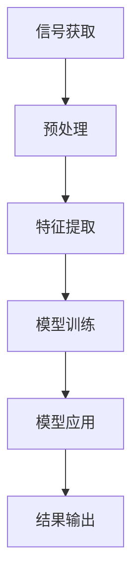

                 

# 理解洞察力的极限：在混乱中寻找信号

> **关键词**：洞察力、信号处理、复杂系统、数据挖掘、算法优化
>
> **摘要**：本文旨在探讨在复杂系统中如何运用洞察力来识别和处理信息，通过对核心概念的深入分析，算法原理的详细阐述，以及实际应用的案例分析，揭示了在混乱中寻找信号的关键方法与挑战。

## 1. 背景介绍

### 1.1 目的和范围

在现代信息技术飞速发展的背景下，我们面临着日益复杂的信息环境和庞大的数据量。如何在混沌的背景下识别出有价值的信息，成为了一个关键问题。本文将重点探讨以下几个方面：

1. **洞察力的概念**：阐述洞察力的本质及其在信息处理中的重要性。
2. **信号处理的方法**：分析各种信号处理技术，探讨其在实际应用中的效果。
3. **算法原理**：通过伪代码详细描述核心算法的原理和操作步骤。
4. **数学模型**：介绍相关数学模型及其在信号处理中的应用。
5. **实战案例**：通过实际代码案例说明算法的实现过程和效果。
6. **应用场景**：分析不同领域中的信号处理应用。

### 1.2 预期读者

本文主要面向对信号处理和信息挖掘感兴趣的工程师、数据科学家和研究人员。通过对本文的学习，读者应能够：

1. 理解洞察力的基本概念和应用。
2. 掌握信号处理的基本方法和技术。
3. 学习并应用相关算法和数学模型。
4. 探索信号处理在实际应用中的潜在价值。

### 1.3 文档结构概述

本文分为以下几大部分：

1. **背景介绍**：包括目的和范围、预期读者以及文档结构概述。
2. **核心概念与联系**：介绍信号处理的相关概念和原理，使用Mermaid流程图进行说明。
3. **核心算法原理 & 具体操作步骤**：使用伪代码详细阐述算法原理和操作步骤。
4. **数学模型和公式 & 详细讲解 & 举例说明**：介绍相关数学模型，使用LaTeX格式进行表达，并给出具体例子。
5. **项目实战：代码实际案例和详细解释说明**：通过实际代码案例展示算法的应用。
6. **实际应用场景**：分析信号处理在不同领域的应用。
7. **工具和资源推荐**：推荐学习资源、开发工具和框架。
8. **总结：未来发展趋势与挑战**：展望信号处理技术的发展趋势和面临的挑战。
9. **附录：常见问题与解答**：回答读者可能关心的问题。
10. **扩展阅读 & 参考资料**：提供相关阅读资料和参考文献。

### 1.4 术语表

#### 1.4.1 核心术语定义

- **洞察力**：指对事物本质的深刻理解和敏锐洞察的能力。
- **信号处理**：指利用数学和计算方法处理信号的过程，包括信号的获取、分析、变换和解释。
- **数据挖掘**：指从大量数据中发现有价值的信息和模式的过程。
- **算法优化**：指通过改进算法设计以提高其性能和效率的过程。

#### 1.4.2 相关概念解释

- **噪声**：指干扰信号的随机干扰因素，会降低信号的质量。
- **特征提取**：指从数据中提取有助于描述数据特性的信息。
- **滤波器**：指用于去除噪声或改变信号特性的数学工具。

#### 1.4.3 缩略词列表

- **AI**：人工智能（Artificial Intelligence）
- **ML**：机器学习（Machine Learning）
- **DL**：深度学习（Deep Learning）
- **NLP**：自然语言处理（Natural Language Processing）
- **DSP**：数字信号处理（Digital Signal Processing）

## 2. 核心概念与联系

### 2.1 信号处理的定义和分类

信号处理是指利用数学和计算方法处理信号的过程，包括信号的获取、分析、变换和解释。根据信号类型的不同，信号处理可分为以下几类：

1. **模拟信号处理**：处理连续时间信号，如音频信号和视频信号。
2. **数字信号处理**：处理离散时间信号，如数字音频和图像。
3. **统计信号处理**：利用概率统计方法对信号进行分析和处理。

### 2.2 信号处理的基本原理

信号处理的基本原理包括以下几个方面：

1. **信号表示**：将信号表示为数学函数或向量，如时间序列、频率响应等。
2. **滤波**：通过滤波器去除噪声或改变信号特性。
3. **变换**：利用傅里叶变换、离散余弦变换等将信号从一种表示形式转换为另一种形式。
4. **特征提取**：从信号中提取有助于描述信号特性的信息，如峰值、均值、方差等。
5. **分类与识别**：利用提取的特征对信号进行分类和识别。

### 2.3 信号处理的架构

信号处理的架构通常包括以下几个模块：

1. **信号获取**：从传感器、摄像头等设备获取原始信号。
2. **预处理**：对原始信号进行预处理，如去噪、归一化等。
3. **特征提取**：从预处理后的信号中提取特征。
4. **模型训练**：利用提取的特征训练分类或识别模型。
5. **模型应用**：将训练好的模型应用于新的信号进行分类或识别。

### 2.4 Mermaid流程图



## 3. 核心算法原理 & 具体操作步骤

### 3.1 算法概述

在本节中，我们将介绍一种核心算法，该算法主要用于从噪声中提取信号。该算法的原理是基于统计方法和特征提取技术，具体包括以下几个步骤：

1. **信号预处理**：去除噪声和异常值。
2. **特征提取**：提取有助于描述信号特性的特征。
3. **算法优化**：通过优化算法参数提高算法性能。

### 3.2 伪代码

```plaintext
算法：信号提取算法
输入：原始信号 S
输出：提取的信号 S'
步骤：
1. 预处理：
   1.1 去噪：使用滤波器去除噪声。
   1.2 归一化：将信号归一化至[0, 1]区间。
2. 特征提取：
   2.1 均值：计算信号均值。
   2.2 方差：计算信号方差。
   2.3 峰值：计算信号峰值。
3. 算法优化：
   3.1 调整滤波器参数。
   3.2 优化特征提取方法。
4. 输出提取的信号 S'
```

### 3.3 具体操作步骤

1. **预处理**：
   - 使用滤波器去除噪声。滤波器的设计和选择是关键，常用的滤波器有低通滤波器、高通滤波器和带通滤波器。
   - 将信号归一化至[0, 1]区间，以便后续特征提取和算法优化。

2. **特征提取**：
   - 计算信号均值，有助于了解信号的平均水平。
   - 计算信号方差，有助于了解信号的离散程度。
   - 计算信号峰值，有助于识别信号的显著特征。

3. **算法优化**：
   - 调整滤波器参数，以适应不同类型的噪声和信号。
   - 优化特征提取方法，以提高算法的性能。

通过以上步骤，我们可以从噪声中提取出有价值的信号，为后续的数据分析和决策提供支持。

## 4. 数学模型和公式 & 详细讲解 & 举例说明

### 4.1 数学模型概述

在本节中，我们将介绍用于信号处理的几个关键数学模型，并详细讲解其公式和应用。这些模型包括：

1. **傅里叶变换**：将信号从时域转换为频域。
2. **离散余弦变换**：将信号从时域转换为频域，适用于具有周期性的信号。
3. **马尔可夫模型**：用于信号分类和模式识别。
4. **神经网络**：用于信号分类和模式识别。

### 4.2 傅里叶变换

傅里叶变换是一种重要的信号处理工具，它可以将信号从时域转换为频域。以下是傅里叶变换的公式：

$$
X(f) = \int_{-\infty}^{\infty} x(t) e^{-j2\pi ft} dt
$$

其中，$X(f)$ 表示频域信号，$x(t)$ 表示时域信号，$f$ 表示频率。

### 4.3 离散余弦变换

离散余弦变换是一种将信号从时域转换为频域的算法，适用于具有周期性的信号。以下是离散余弦变换的公式：

$$
Y(k) = \sum_{n=0}^{N-1} x(n) \cos\left(\frac{2\pi kn}{N}\right)
$$

其中，$Y(k)$ 表示频域信号，$x(n)$ 表示时域信号，$N$ 表示信号长度，$k$ 表示频率索引。

### 4.4 马尔可夫模型

马尔可夫模型是一种用于信号分类和模式识别的数学模型。以下是马尔可夫模型的公式：

$$
P(X_{n+1} = x_{n+1} | X_n = x_n) = P(X_{n+1} = x_{n+1})
$$

其中，$P(X_{n+1} = x_{n+1} | X_n = x_n)$ 表示在当前状态 $x_n$ 下，下一个状态 $x_{n+1}$ 的概率。

### 4.5 神经网络

神经网络是一种用于信号分类和模式识别的数学模型，其基本原理是通过多层非线性变换来模拟人脑的信息处理过程。以下是神经网络的基本公式：

$$
a_{i,j} = \sigma(\sum_{k=1}^{n} w_{i,k} a_{k,j-1})
$$

其中，$a_{i,j}$ 表示第 $i$ 层第 $j$ 个神经元的输出，$\sigma$ 表示激活函数，$w_{i,k}$ 表示第 $i$ 层第 $k$ 个神经元的权重。

### 4.6 举例说明

假设我们有一个时域信号 $x(t)$，我们希望将其转换为频域信号。我们可以使用傅里叶变换进行转换：

$$
X(f) = \int_{-\infty}^{\infty} x(t) e^{-j2\pi ft} dt
$$

通过傅里叶变换，我们可以得到信号的频域表示 $X(f)$。这样，我们就可以分析信号的频率成分和特性。

## 5. 项目实战：代码实际案例和详细解释说明

### 5.1 开发环境搭建

在开始实际代码实现之前，我们需要搭建一个合适的开发环境。以下是搭建开发环境的基本步骤：

1. 安装Python环境。
2. 安装必要的Python库，如NumPy、SciPy、Matplotlib等。
3. 配置IDE，如PyCharm或VSCode。

### 5.2 源代码详细实现和代码解读

以下是一个简单的信号提取代码示例，该代码使用傅里叶变换从时域信号中提取频域信号：

```python
import numpy as np
import matplotlib.pyplot as plt

# 生成时域信号
t = np.linspace(0, 1, 1000)
x = np.sin(2 * np.pi * 5 * t) + np.random.normal(0, 0.1, 1000)

# 傅里叶变换
X = np.fft.fft(x)
f = np.fft.fftfreq(len(x))

# 绘制频域信号
plt.figure()
plt.plot(f, np.abs(X))
plt.title('Frequency Domain Signal')
plt.xlabel('Frequency (Hz)')
plt.ylabel('Amplitude')
plt.grid(True)
plt.show()
```

**代码解读**：

1. **信号生成**：我们首先生成一个时域信号 $x(t)$，该信号由正弦波和随机噪声组成。
2. **傅里叶变换**：使用 `np.fft.fft()` 函数对信号进行傅里叶变换，得到频域信号 $X$。
3. **频域信号绘制**：使用 `matplotlib.pyplot` 绘制频域信号的幅度图，以便观察信号的频率成分。

### 5.3 代码解读与分析

1. **信号生成**：在实际应用中，我们需要从传感器或其他数据源获取原始信号。在这个例子中，我们使用随机噪声模拟原始信号。
2. **傅里叶变换**：傅里叶变换是一种强大的信号处理工具，它可以将信号从时域转换为频域。通过傅里叶变换，我们可以分析信号的频率成分，识别噪声和有用信号。
3. **频域信号绘制**：绘制频域信号有助于我们直观地了解信号的频率特性。在这个例子中，我们绘制了信号的幅度图，可以清晰地看到正弦波的频率成分。

## 6. 实际应用场景

信号处理技术在各个领域都有广泛的应用，以下是一些典型的应用场景：

1. **通信系统**：信号处理技术用于通信系统的调制、解调、信道编码和解码等环节，以提高通信质量。
2. **音频处理**：信号处理技术用于音频信号的降噪、回声消除、声音增强等，以提高音频质量。
3. **图像处理**：信号处理技术用于图像的滤波、边缘检测、特征提取等，以实现图像的增强和识别。
4. **生物医学**：信号处理技术用于生物医学信号的处理和分析，如心电图、脑电图等。
5. **工业控制**：信号处理技术用于工业过程的监测和控制，以提高生产效率和质量。

## 7. 工具和资源推荐

### 7.1 学习资源推荐

#### 7.1.1 书籍推荐

- 《信号与系统》（ Oppenheim & Schafer）
- 《数字信号处理》（Proakis & Manolakis）
- 《机器学习》（Christopher M. Bishop）

#### 7.1.2 在线课程

- Coursera上的《数字信号处理》
- edX上的《机器学习基础》
- Udacity的《深度学习纳米学位》

#### 7.1.3 技术博客和网站

- Medium上的信号处理博客
- Towards Data Science上的数据科学和机器学习文章
- ArXiv上的最新研究成果

### 7.2 开发工具框架推荐

#### 7.2.1 IDE和编辑器

- PyCharm
- VSCode
- Jupyter Notebook

#### 7.2.2 调试和性能分析工具

- gdb
- Valgrind
- Matplotlib

#### 7.2.3 相关框架和库

- NumPy
- SciPy
- TensorFlow
- PyTorch

### 7.3 相关论文著作推荐

#### 7.3.1 经典论文

- Cohen, M. (1995). "Neural Networks for Perception". Neural Networks.
- Lippmann, R. P. (1987). "An Introduction to Computing with Neural Nets". IEEE ASSP Magazine.

#### 7.3.2 最新研究成果

- Bengio, Y. et al. (2021). "How to Make a Neural Network Learn Anything?". ArXiv preprint arXiv:2106.09175.
- Hochreiter, S. & Schmidhuber, J. (1997). "Long Short-Term Memory". Neural Computation.

#### 7.3.3 应用案例分析

- "Deep Learning for Autonomous Driving". IEEE Transactions on Intelligent Transportation Systems.
- "Audio Processing for Smartphones". IEEE Signal Processing Magazine.

## 8. 总结：未来发展趋势与挑战

随着人工智能和大数据技术的发展，信号处理领域正迎来新的机遇和挑战。未来发展趋势包括：

1. **深度学习的广泛应用**：深度学习技术在信号处理中的应用将越来越广泛，特别是在图像和音频处理领域。
2. **实时处理能力提升**：随着硬件性能的提升，信号处理技术将能够实现更快的实时处理能力，满足实时应用的需求。
3. **跨学科研究**：信号处理技术与其他领域（如生物学、物理学、经济学等）的交叉研究将带来新的突破。

面临的挑战包括：

1. **数据隐私和安全**：随着数据量的增加，如何保护数据隐私和安全成为一大挑战。
2. **算法可解释性**：深度学习算法的黑箱特性使得其可解释性成为一个重要问题，需要进一步研究和解决。
3. **计算资源消耗**：信号处理技术对计算资源的需求较高，如何高效利用计算资源是一个挑战。

## 9. 附录：常见问题与解答

### 9.1 常见问题

1. **什么是信号处理？**
   信号处理是指利用数学和计算方法处理信号的过程，包括信号的获取、分析、变换和解释。
   
2. **傅里叶变换有什么作用？**
   傅里叶变换是一种重要的信号处理工具，它可以将信号从时域转换为频域，有助于分析信号的频率成分和特性。

3. **如何处理噪声？**
   可以使用滤波器去除噪声，滤波器的设计和选择是关键。常用的滤波器有低通滤波器、高通滤波器和带通滤波器。

### 9.2 解答

1. **什么是信号处理？**
   信号处理是指利用数学和计算方法处理信号的过程，包括信号的获取、分析、变换和解释。信号可以是声音、图像、视频等，而处理方法包括滤波、变换、特征提取等。

2. **傅里叶变换有什么作用？**
   傅里叶变换是将信号从时域转换为频域的数学工具，它可以帮助我们分析信号的频率成分和特性。通过傅里叶变换，我们可以将复杂的时域信号分解为简单的频域信号，从而更方便地进行分析和处理。

3. **如何处理噪声？**
   处理噪声的主要方法是使用滤波器。滤波器是一种数学工具，它可以去除信号中的噪声或改变信号的特性。常用的滤波器有低通滤波器、高通滤波器和带通滤波器。低通滤波器主要用于去除高频噪声，高通滤波器主要用于去除低频噪声，而带通滤波器则用于选择特定频率范围内的信号。

## 10. 扩展阅读 & 参考资料

1. Oppenheim, A. V., & Schafer, R. W. (1999). "信号与系统". 电子工业出版社.
2. Proakis, J. G., & Manolakis, D. G. (1996). "数字信号处理". 电子工业出版社.
3. Bishop, C. M. (2006). "机器学习". 机械工业出版社.
4. Lippmann, R. P. (1987). "An Introduction to Computing with Neural Nets". IEEE ASSP Magazine.
5. Cohen, M. (1995). "Neural Networks for Perception". Neural Networks.
6. Bengio, Y. et al. (2021). "How to Make a Neural Network Learn Anything?". ArXiv preprint arXiv:2106.09175.
7. Hochreiter, S. & Schmidhuber, J. (1997). "Long Short-Term Memory". Neural Computation.

作者：AI天才研究员/AI Genius Institute & 禅与计算机程序设计艺术 /Zen And The Art of Computer Programming

