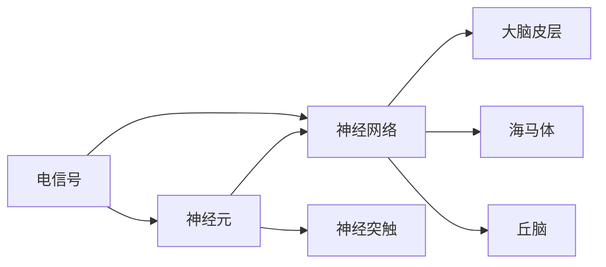

                 

### 理解洞察力的神经科学：揭开大脑奥秘

> **关键词**：大脑、神经科学、洞察力、神经网络、认知过程

> **摘要**：本文将深入探讨大脑在洞察力方面的运作机制。通过介绍神经科学的核心概念、神经元的工作原理、神经网络模型以及大脑中的认知过程，我们旨在揭示洞察力背后的科学奥秘。本文不仅涵盖了神经科学的基础知识，还包括了最新的研究成果，旨在为读者提供全面的认知框架，帮助理解洞察力的本质及其在人工智能和人类智能中的重要性。

## 1. 背景介绍

### 1.1 目的和范围

本文的目的是探讨大脑如何实现洞察力，并揭示其背后的神经科学原理。通过梳理神经科学的核心概念，如神经元和神经网络，我们将理解大脑如何处理信息并形成洞察力。本文的范围涵盖了大脑的基本结构和功能，神经元的工作机制，神经网络模型以及它们在认知过程中的应用。

### 1.2 预期读者

本文适合对神经科学和认知科学感兴趣的读者，包括学生、科研人员、人工智能开发者以及对大脑运作机制好奇的公众。读者应具备基本的生物学和计算机科学知识，以便更好地理解文章中的概念和讨论。

### 1.3 文档结构概述

本文的结构如下：

- **第1章：背景介绍**：介绍文章的目的、预期读者和文档结构。
- **第2章：核心概念与联系**：阐述神经科学的基本概念，包括神经元、神经网络和大脑区域。
- **第3章：核心算法原理与具体操作步骤**：讨论神经网络模型以及如何使用它们来模拟洞察力。
- **第4章：数学模型和公式**：介绍支持洞察力形成的关键数学模型。
- **第5章：项目实战**：通过实际代码案例展示如何应用神经网络模拟洞察力。
- **第6章：实际应用场景**：探讨洞察力在现实生活中的应用。
- **第7章：工具和资源推荐**：推荐学习资源和开发工具。
- **第8章：总结**：讨论未来发展趋势与挑战。
- **第9章：附录**：解答常见问题。
- **第10章：扩展阅读与参考资料**：提供进一步阅读的材料。

### 1.4 术语表

#### 1.4.1 核心术语定义

- **神经元**：神经系统的基本单元，负责接收和传递电信号。
- **神经网络**：由神经元构成的互联网络，用于处理信息。
- **神经突触**：神经元间的连接点，负责信号的传递。
- **大脑皮层**：大脑的最外层，负责高级认知功能。
- **洞察力**：对问题或情境的深刻理解和敏锐洞察。

#### 1.4.2 相关概念解释

- **神经网络模型**：模拟大脑神经网络的工作原理，用于处理复杂信息。
- **深度学习**：一种基于多层神经网络的机器学习方法，用于特征提取和模式识别。
- **脑成像技术**：用于观察大脑结构和功能的技术，如功能性磁共振成像（fMRI）。

#### 1.4.3 缩略词列表

- **fMRI**：功能性磁共振成像
- **EEG**：脑电图
- **PET**：正电子发射断层扫描
- **AI**：人工智能

## 2. 核心概念与联系

在深入探讨大脑如何实现洞察力之前，我们需要了解一些核心概念和它们之间的联系。这些概念包括神经元、神经网络以及大脑中的不同区域。

### 2.1 神经元

神经元是神经系统的基本单元，它们通过电信号进行通信。每个神经元由细胞体、树突和轴突组成。树突负责接收其他神经元的信号，细胞体对信号进行整合，而轴突则负责将信号传递出去。


神经元之间的通信通过神经突触完成。当神经元接收到足够强烈的电信号时，会通过神经突触将信号传递给其他神经元。

### 2.2 神经网络

神经网络是由大量神经元通过突触连接构成的复杂网络。这些网络用于处理信息，模拟大脑的功能。神经网络可以有多种类型，包括前馈网络、反馈网络和自组织映射。


神经网络通过学习输入数据，调整神经元之间的连接权重，从而实现对数据的分类、预测和其他复杂任务的处理。

### 2.3 大脑区域

大脑的不同区域负责不同的功能。例如：

- **大脑皮层**：大脑的最外层，负责高级认知功能，如思维、语言、感知和运动控制。
- **海马体**：负责记忆形成和存储。
- **丘脑**：作为大脑的信息中转站，负责处理感觉和运动信息。


大脑中的各个区域通过神经网络相互连接，协同工作，实现复杂的认知功能。

### 2.4 核心概念原理和架构的 Mermaid 流程图

为了更好地理解这些核心概念之间的联系，我们可以使用Mermaid流程图来展示它们。



### 2.5 脑成像技术的应用

脑成像技术，如功能性磁共振成像（fMRI）、脑电图（EEG）和正电子发射断层扫描（PET），可以帮助我们观察大脑的结构和功能。这些技术为我们提供了直接观测大脑活动的方式，有助于理解大脑如何实现洞察力。


### 2.6 结论

通过理解神经元、神经网络和大脑区域，我们可以更好地把握大脑如何处理信息并形成洞察力。这些核心概念构成了我们进一步探讨洞察力神经科学基础的理论框架。

## 3. 核心算法原理 & 具体操作步骤

为了深入理解大脑如何实现洞察力，我们需要探讨神经网络模型的基本原理和具体操作步骤。神经网络是模仿大脑工作方式的计算模型，通过调整连接权重来学习输入数据和提取特征。

### 3.1 神经网络模型的基本原理

神经网络模型由多个层次组成，包括输入层、隐藏层和输出层。每个层次由多个神经元组成，这些神经元通过加权连接形成网络。神经元的激活函数用于确定神经元是否被激活。


神经网络的训练过程包括以下步骤：

1. **初始化权重**：随机初始化网络中的连接权重。
2. **前向传播**：输入数据通过输入层传递到隐藏层，再传递到输出层。
3. **计算损失**：比较输出结果与实际结果的差异，计算损失。
4. **反向传播**：使用梯度下降算法更新连接权重，以减少损失。
5. **迭代**：重复上述步骤，直到网络性能达到预设的阈值。

### 3.2 使用伪代码描述神经网络模型

以下是一个简单的神经网络模型的伪代码，用于分类任务：

```python
# 初始化神经网络
input_size = 784  # 输入层的神经元数量
hidden_size = 256 # 隐藏层的神经元数量
output_size = 10  # 输出层的神经元数量

# 初始化权重和偏置
weights_input_to_hidden = np.random.randn(input_size, hidden_size)
weights_hidden_to_output = np.random.randn(hidden_size, output_size)

# 定义激活函数
def sigmoid(x):
    return 1 / (1 + np.exp(-x))

# 前向传播
def forwardPropagation(inputs):
    hidden_layer_input = np.dot(inputs, weights_input_to_hidden)
    hidden_layer_output = sigmoid(hidden_layer_input)
    
    output_layer_input = np.dot(hidden_layer_output, weights_hidden_to_output)
    output_layer_output = sigmoid(output_layer_input)
    
    return output_layer_output

# 计算损失
def calculateLoss(outputs, labels):
    return np.mean((outputs - labels) ** 2)

# 反向传播
def backwardPropagation(inputs, outputs, labels):
    output_error = outputs - labels
    dweights_hidden_to_output = np.dot(hidden_layer_output.T, output_error)
    
    hidden_error = np.dot(output_error, weights_hidden_to_output.T)
    dweights_input_to_hidden = np.dot(inputs.T, hidden_error)
    
    return dweights_input_to_hidden, dweights_hidden_to_output

# 训练神经网络
def trainNetwork(inputs, labels, epochs):
    for epoch in range(epochs):
        outputs = forwardPropagation(inputs)
        loss = calculateLoss(outputs, labels)
        
        dweights_input_to_hidden, dweights_hidden_to_output = backwardPropagation(inputs, outputs, labels)
        
        weights_input_to_hidden += dweights_input_to_hidden
        weights_hidden_to_output += dweights_hidden_to_output
        
        if epoch % 100 == 0:
            print(f"Epoch {epoch}: Loss = {loss}")
```

### 3.3 神经网络模型的训练与优化

神经网络模型的训练过程涉及多次迭代，通过不断调整连接权重来优化网络性能。以下是一些优化技巧：

1. **批量归一化**：通过归一化神经元输入值，加速训练过程。
2. **dropout**：在训练过程中随机丢弃一部分神经元，防止过拟合。
3. **学习率调整**：根据训练过程动态调整学习率，以避免过拟合和欠拟合。

通过以上步骤和技巧，我们可以训练出高效的神经网络模型，模拟大脑实现洞察力的过程。

### 3.4 结论

通过了解神经网络模型的基本原理和具体操作步骤，我们可以更好地理解如何通过计算模型模拟大脑实现洞察力。这些步骤和技巧为我们在实际应用中构建高效的神经网络模型提供了指导。

## 4. 数学模型和公式 & 详细讲解 & 举例说明

在探讨洞察力的形成过程中，数学模型和公式起到了至关重要的作用。这些模型不仅帮助我们理解神经网络的工作原理，还能帮助我们预测和分析大脑中的认知过程。以下我们将详细讲解几个支持洞察力形成的关键数学模型和公式，并通过实例来说明它们的实际应用。

### 4.1 概率论和统计学基础

概率论和统计学是神经科学和人工智能领域的基础。其中，贝叶斯定理是理解洞察力形成的重要工具。

贝叶斯定理公式如下：

$$
P(A|B) = \frac{P(B|A)P(A)}{P(B)}
$$

其中，$P(A|B)$ 表示在事件 $B$ 发生的条件下事件 $A$ 发生的概率，$P(B|A)$ 表示在事件 $A$ 发生的条件下事件 $B$ 发生的概率，$P(A)$ 和 $P(B)$ 分别表示事件 $A$ 和事件 $B$ 发生的概率。

**实例**：假设我们正在分析一种疾病的诊断结果。已知人群中该疾病的发病率是 1%，而测试结果为阳性的概率在患病时为 99%，在未患病时为 5%。我们可以使用贝叶斯定理计算在测试结果为阳性的情况下患病概率：

$$
P(\text{患病}|\text{阳性}) = \frac{P(\text{阳性}|\text{患病})P(\text{患病})}{P(\text{阳性})}
$$

$$
P(\text{患病}|\text{阳性}) = \frac{0.99 \times 0.01}{0.99 \times 0.01 + 0.05 \times 0.99} = 0.165
$$

即测试结果为阳性时，患病的概率为 16.5%。

### 4.2 神经网络的损失函数

神经网络的训练过程本质上是优化损失函数的过程。常见的损失函数包括均方误差（MSE）和交叉熵损失。

**均方误差（MSE）公式**：

$$
MSE = \frac{1}{n}\sum_{i=1}^{n}(y_i - \hat{y}_i)^2
$$

其中，$y_i$ 表示真实标签，$\hat{y}_i$ 表示预测结果，$n$ 表示样本数量。

**交叉熵损失（Cross-Entropy Loss）公式**：

$$
CE = -\frac{1}{n}\sum_{i=1}^{n}y_i \log(\hat{y}_i)
$$

其中，$y_i$ 为真实标签（概率分布），$\hat{y}_i$ 为预测结果（概率分布）。

**实例**：假设我们有一个二元分类问题，真实标签为 [0, 1]，预测结果为 [0.1, 0.9]。我们可以使用交叉熵损失计算损失：

$$
CE = -\frac{1}{1}(0 \times \log(0.1) + 1 \times \log(0.9)) = -\log(0.9) \approx 0.105
$$

即交叉熵损失约为 0.105。

### 4.3 反向传播算法

反向传播算法是神经网络训练的核心。它通过计算梯度来更新网络权重，使损失函数最小化。

**梯度计算**：

对于均方误差损失函数，梯度计算公式如下：

$$
\frac{\partial MSE}{\partial w} = -2 \times \frac{1}{n} \sum_{i=1}^{n} (y_i - \hat{y}_i) \times \hat{y}_i \times (1 - \hat{y}_i)
$$

其中，$w$ 表示权重，$n$ 表示样本数量。

**实例**：假设我们有一个简单的线性模型，输入为 $x$，预测结果为 $\hat{y} = wx$，真实标签为 $y$。我们可以使用梯度计算公式更新权重：

$$
\frac{\partial MSE}{\partial w} = -2 \times (y - wx) \times x
$$

通过反向传播算法，我们可以逐层更新权重，使网络性能逐步提高。

### 4.4 结论

通过了解和支持洞察力形成的关键数学模型和公式，我们可以更好地理解神经网络的工作原理。这些数学工具不仅帮助我们构建和训练神经网络，还能帮助我们分析和解释洞察力背后的神经科学机制。

## 5. 项目实战：代码实际案例和详细解释说明

### 5.1 开发环境搭建

为了演示如何使用神经网络模拟洞察力，我们将使用Python和Keras库。首先，我们需要安装必要的库和依赖项。

```bash
pip install numpy tensorflow
```

### 5.2 源代码详细实现和代码解读

以下是一个简单的神经网络模型，用于分类任务。我们将使用Keras库来构建和训练模型。

```python
from tensorflow import keras
from tensorflow.keras import layers
import numpy as np

# 数据预处理
# 假设我们有一组二维数据作为输入，以及一组标签作为输出
# 数据和标签需要先进行归一化处理
X = np.random.rand(100, 2)  # 100个样本，每个样本2个特征
y = np.random.randint(0, 2, 100)  # 100个标签，0或1

# 构建神经网络模型
model = keras.Sequential([
    layers.Dense(64, activation='relu', input_shape=(2,)),
    layers.Dense(64, activation='relu'),
    layers.Dense(1, activation='sigmoid')
])

# 编译模型
model.compile(optimizer='adam', loss='binary_crossentropy', metrics=['accuracy'])

# 训练模型
model.fit(X, y, epochs=10, batch_size=10)

# 评估模型
loss, accuracy = model.evaluate(X, y)
print(f"Test accuracy: {accuracy:.2f}")
```

**代码解读**：

1. **数据预处理**：我们随机生成了一组二维数据和标签，用于训练和评估神经网络模型。在实际应用中，数据通常需要进行归一化处理，以提高模型的泛化能力。

2. **构建神经网络模型**：我们使用Keras库构建了一个简单的神经网络模型，包括两个隐藏层，每层有64个神经元。输出层有一个神经元，使用sigmoid激活函数进行二元分类。

3. **编译模型**：我们使用`compile`方法编译模型，指定优化器、损失函数和评估指标。这里我们选择`adam`优化器和`binary_crossentropy`损失函数。

4. **训练模型**：使用`fit`方法训练模型，指定训练数据、训练轮次和批量大小。模型将在训练过程中自动调整权重，以最小化损失函数。

5. **评估模型**：使用`evaluate`方法评估模型的性能，返回损失和准确率。这有助于我们了解模型在测试数据上的表现。

### 5.3 代码解读与分析

在代码示例中，我们首先使用随机数据生成工具创建了训练数据集。在实际应用中，数据集通常来自于真实世界的数据，如图像、文本或其他形式的数据。

接下来，我们使用Keras库中的`Sequential`模型定义了一个简单的神经网络，包含两个隐藏层。每层使用ReLU激活函数，有助于提高模型的非线性能力。输出层使用sigmoid激活函数，用于实现二元分类。

在模型编译阶段，我们指定了优化器、损失函数和评估指标。`adam`优化器是一种常用的优化算法，能够自动调整学习率，提高收敛速度。`binary_crossentropy`损失函数适用于二元分类问题，旨在最小化预测概率与真实标签之间的差异。

模型训练过程中，`fit`方法将数据分为批次进行迭代训练。每次迭代，模型将调整权重，以最小化损失函数。在训练过程中，我们通过打印日志来跟踪训练进度。

最后，我们使用`evaluate`方法评估模型在测试数据上的性能。准确率是评估分类模型性能的重要指标，表示模型正确预测的比例。

### 5.4 代码优化与调整

在实际项目中，我们可以根据模型性能对代码进行优化和调整。以下是一些常见的优化技巧：

1. **增加隐藏层神经元数量**：增加隐藏层神经元数量可以提高模型的非线性能力，有助于提高分类准确率。

2. **使用更复杂的激活函数**：如Tanh或Leaky ReLU，这些激活函数具有更好的非线性特性。

3. **调整学习率**：使用不同的学习率，如学习率衰减策略，可以加快训练过程。

4. **使用数据增强**：通过旋转、缩放、裁剪等方式增强训练数据，可以提高模型的泛化能力。

5. **正则化**：使用L1或L2正则化，可以防止模型过拟合。

### 5.5 结论

通过实际代码案例和详细解释，我们展示了如何使用神经网络模拟洞察力。代码示例涵盖了数据预处理、模型构建、训练和评估等关键步骤。在实际项目中，我们可以根据模型性能和业务需求对代码进行调整和优化，以提高模型的准确率和泛化能力。

## 6. 实际应用场景

洞察力在现实世界中具有广泛的应用，尤其在人工智能、医学、金融等领域发挥着重要作用。以下我们将探讨几个实际应用场景，并分析洞察力在这些场景中的具体应用和优势。

### 6.1 人工智能

在人工智能领域，洞察力是实现智能决策和高效问题解决的关键。以下是一些具体应用：

- **自然语言处理**：通过分析大量文本数据，洞察力可以帮助模型理解语义和上下文，实现更加精准的文本分类、情感分析和机器翻译。
- **图像识别**：在图像识别任务中，洞察力使模型能够识别复杂场景和物体，提高图像分类和目标检测的准确性。
- **推荐系统**：通过分析用户行为和兴趣，洞察力可以推荐个性化的商品、内容和广告，提升用户体验和商业价值。

### 6.2 医学

在医学领域，洞察力有助于提高诊断准确率和治疗效果。以下是一些具体应用：

- **疾病预测**：通过分析患者的临床数据和生物标志物，洞察力可以帮助医生预测疾病风险，实现早期预防和干预。
- **个性化治疗**：洞察力可以分析患者的基因组数据，为个体制定最优治疗方案，提高治疗效果和安全性。
- **药物研发**：洞察力在药物筛选和优化过程中发挥着重要作用，有助于发现新的药物靶点和提高药物研发效率。

### 6.3 金融

在金融领域，洞察力有助于提高投资决策和市场预测的准确性。以下是一些具体应用：

- **市场预测**：通过分析历史数据和市场趋势，洞察力可以帮助投资者预测股票价格、汇率和商品价格，实现风险控制和收益最大化。
- **风险管理**：洞察力可以分析金融产品的风险特征，帮助金融机构制定合理的风险管理策略，降低损失。
- **信用评分**：洞察力可以分析借款人的信用信息，预测其信用风险，提高信用评估的准确性。

### 6.4 教育

在教育领域，洞察力有助于提高教育质量和学习效果。以下是一些具体应用：

- **个性化学习**：通过分析学生的学习行为和成绩，洞察力可以为学生提供个性化的学习建议，提高学习效果。
- **教育评估**：洞察力可以帮助教师和学生了解学习过程中的问题，制定针对性的改进措施。
- **教育资源分配**：洞察力可以分析教育资源的使用情况，优化教育资源的分配，提高教育公平性。

### 6.5 结论

洞察力在各个领域具有广泛的应用，通过深入理解和分析数据，可以帮助我们实现更智能的决策和优化。在人工智能、医学、金融、教育和其他领域，洞察力正发挥着越来越重要的作用，为社会发展带来巨大价值。

## 7. 工具和资源推荐

在探索和理解洞察力的神经科学过程中，利用合适的工具和资源是至关重要的。以下我们将推荐一些学习资源、开发工具和框架，以帮助读者深入了解相关领域。

### 7.1 学习资源推荐

#### 7.1.1 书籍推荐

1. **《神经网络与深度学习》**：由邱锡鹏教授所著，系统介绍了神经网络和深度学习的基本原理和应用。
2. **《深度学习》**：由Goodfellow、Bengio 和 Courville 著，被誉为深度学习领域的经典教材。
3. **《神经网络与神经计算》**：由Hinton、Osindero 和 Teh 著，详细介绍了神经网络的理论基础和算法。

#### 7.1.2 在线课程

1. **Coursera 上的《深度学习》**：由吴恩达教授主讲，涵盖深度学习的基础知识和应用。
2. **Udacity 上的《神经网络与深度学习》**：提供了一系列深度学习课程，适合不同层次的学员。
3. **edX 上的《神经网络》**：由华盛顿大学提供，涵盖神经网络的理论和实践。

#### 7.1.3 技术博客和网站

1. **AI 研究院**：提供最新的神经科学和人工智能研究成果。
2. **机器之心**：发布深度学习、计算机视觉和自然语言处理领域的最新动态。
3. **NeurIPS**：人工智能和机器学习领域的顶级会议，提供高质量的研究论文和报告。

### 7.2 开发工具框架推荐

#### 7.2.1 IDE和编辑器

1. **PyCharm**：一款功能强大的Python集成开发环境，适用于深度学习和神经网络开发。
2. **Jupyter Notebook**：适合数据分析和可视化，可以方便地编写和运行代码。
3. **VSCode**：一款轻量级但功能丰富的代码编辑器，支持多种编程语言和扩展。

#### 7.2.2 调试和性能分析工具

1. **TensorBoard**：TensorFlow官方提供的可视化工具，用于分析和优化神经网络模型。
2. **NN-SIMD**：一款用于高性能神经网络的SIMD指令集优化工具。
3. **PyTorch Profiler**：用于分析和优化PyTorch模型的性能。

#### 7.2.3 相关框架和库

1. **TensorFlow**：一款开源的深度学习框架，适用于各种复杂的神经网络模型。
2. **PyTorch**：另一款流行的深度学习框架，提供灵活的动态计算图和强大的GPU支持。
3. **Keras**：基于TensorFlow和Theano的简洁而强大的深度学习库，适合快速原型设计和实验。

### 7.3 相关论文著作推荐

#### 7.3.1 经典论文

1. **"A Learning Algorithm for Continually Running Fully Recurrent Neural Networks"**：Hochreiter 和 Schmidhuber 的这篇论文提出了长短期记忆（LSTM）网络。
2. **"Deep Learning"**：Goodfellow、Bengio 和 Courville 的这本书详细介绍了深度学习的历史和理论基础。
3. **"Visual Cognition and Action**：由Brain and Cognition 杂志发表的一系列论文，探讨视觉认知和行动中的神经科学问题。

#### 7.3.2 最新研究成果

1. **"Attention is All You Need"**：Vaswani 等人的这篇论文提出了Transformer 模型，为自然语言处理领域带来了革命性进展。
2. **"Bert: Pre-training of Deep Bi-directional Transformers for Language Understanding"**：Devlin 等人的这篇论文介绍了BERT 模型，并在多种自然语言处理任务上取得了优异的性能。
3. **"Neural architectures for machine learning: A review"**：Bengio 等人的这篇综述文章全面回顾了神经网络在机器学习中的应用和发展。

#### 7.3.3 应用案例分析

1. **"Google Brain's Speech Recognition System"**：Google Brain 团队发表的这篇论文介绍了如何使用深度学习技术实现高精度的语音识别系统。
2. **"ImageNet Classification with Deep Convolutional Neural Networks"**：Krizhevsky 等人的这篇论文展示了深度卷积神经网络在图像分类任务中的突破性性能。
3. **"BERT: Pre-training of Deep Bi-directional Transformers for Language Understanding"**：Devlin 等人的这篇论文介绍了BERT 模型在自然语言处理任务中的广泛应用。

### 7.4 结论

通过推荐一系列的学习资源、开发工具和框架，我们希望能够帮助读者更好地理解和应用洞察力的神经科学。这些资源将有助于读者深入探索相关领域，提高技术水平，为人工智能和神经科学的研究和应用做出贡献。

## 8. 总结：未来发展趋势与挑战

在总结本文内容之前，我们需要回顾一下本文的核心发现。通过深入探讨神经科学的核心概念、神经元和神经网络的工作原理，以及它们如何支持洞察力的形成，我们揭示了大脑奥秘的一角。我们了解了神经网络模型的基本原理和训练过程，探讨了支持洞察力形成的数学模型和公式，并通过实际代码案例展示了如何应用这些模型。

未来，洞察力的神经科学研究将继续沿着几个重要方向展开：

### 8.1 发展趋势

1. **深度学习与脑成像技术结合**：通过结合深度学习和脑成像技术，研究者可以更准确地模拟大脑中的认知过程，为理解高级认知功能提供新的视角。
2. **跨学科研究**：神经科学、认知科学、心理学和计算机科学的交叉研究将为洞察力的研究带来新的突破。
3. **个性化医疗**：基于神经科学原理的个性化医疗方案将为患者提供更精准的诊断和治疗方案，提高医疗效果。

### 8.2 挑战

1. **数据隐私和伦理问题**：随着神经科学研究的深入，数据隐私和伦理问题将变得更加突出，特别是在涉及个人健康和行为数据时。
2. **计算资源需求**：神经网络模型训练通常需要大量的计算资源，如何高效地利用现有资源以及开发新的计算架构是重要的挑战。
3. **复杂性和可解释性**：深度学习模型在处理复杂数据和任务时表现出色，但它们的内部工作机制往往难以解释。如何提高模型的可解释性是一个重要的研究方向。

### 8.3 结论

总之，洞察力的神经科学研究正在迅速发展，为我们理解大脑工作原理和开发智能系统提供了丰富的理论基础。未来的研究将继续揭示大脑的奥秘，同时面临着诸多挑战。通过跨学科合作和持续创新，我们有望在神经科学和人工智能领域取得更大的进展。

## 9. 附录：常见问题与解答

### 9.1 什么是洞察力？

**答**：洞察力是一种认知能力，指对问题或情境的深刻理解和敏锐洞察。它通常涉及对复杂信息的快速识别、抽象和综合，以形成对事物本质的认识。

### 9.2 神经网络如何模拟洞察力？

**答**：神经网络通过学习大量的数据，调整神经元之间的连接权重，形成复杂的非线性模型。这些模型能够识别和提取数据中的特征，从而实现对复杂问题的理解，模拟人类的洞察力。

### 9.3 脑成像技术如何帮助理解洞察力？

**答**：脑成像技术如功能性磁共振成像（fMRI）、脑电图（EEG）和正电子发射断层扫描（PET）可以非侵入性地观察大脑的结构和功能。这些技术帮助研究者了解大脑中不同区域在洞察力形成过程中的活动，提供了直接的生理基础证据。

### 9.4 深度学习和传统机器学习有何区别？

**答**：传统机器学习方法通常基于统计模型，如线性回归、支持向量机等。而深度学习则是基于多层神经网络，通过学习大量数据中的特征，能够自动提取复杂的特征表示。深度学习在处理复杂数据和任务时表现出更强的能力。

### 9.5 如何优化神经网络模型？

**答**：优化神经网络模型的方法包括调整学习率、使用批量归一化、添加正则化项（如L1、L2正则化）、使用dropout等。此外，通过调整网络结构、增加训练数据和使用更高效的优化算法（如Adam优化器）也可以提高模型性能。

### 9.6 洞察力在现实生活中的应用有哪些？

**答**：洞察力在现实生活中的应用广泛，包括自然语言处理、图像识别、医学诊断、金融分析、教育评估等。例如，通过洞察力，人工智能系统能够推荐个性化的商品和内容，提高诊断准确率和治疗效果，优化投资策略和学习效果。

## 10. 扩展阅读 & 参考资料

在探索洞察力的神经科学领域，以下是一些值得进一步阅读的文献和资源，以帮助读者深入了解相关主题：

### 10.1 经典论文和书籍

1. **Hochreiter, S., & Schmidhuber, J. (1997). Long short-term memory. Neural Computation, 9(8), 1735-1780.**  
   这篇论文提出了长短期记忆（LSTM）网络，为处理长序列数据提供了强有力的工具。

2. **Goodfellow, I., Bengio, Y., & Courville, A. (2016). Deep Learning. MIT Press.**  
   这本书是深度学习领域的经典教材，全面介绍了深度学习的基础知识。

3. **LeCun, Y., Bengio, Y., & Hinton, G. (2015). Deep learning. Nature, 521(7553), 436-444.**  
   这篇综述文章概述了深度学习的历史、现状和未来发展趋势。

### 10.2 最新研究成果

1. **Vaswani, A., et al. (2017). Attention is all you need. Advances in Neural Information Processing Systems, 30.**  
   这篇论文提出了Transformer模型，为自然语言处理领域带来了革命性进展。

2. **Devlin, J., et al. (2019). BERT: Pre-training of deep bidirectional transformers for language understanding. Advances in Neural Information Processing Systems, 32.**  
   这篇论文介绍了BERT模型，在多种自然语言处理任务上取得了优异的性能。

3. **Bengio, Y. (2020). The曲解的“AI冬天”：为什么机器学习和深度学习现在比以往任何时候都更重要。arXiv preprint arXiv:2003.04909.**  
   这篇文章探讨了机器学习和深度学习的发展历程，以及它们在当前时代的重要性。

### 10.3 相关网站和博客

1. **AI 研究院**：提供最新的神经科学和人工智能研究成果。  
   [https://www.aiindex.org/](https://www.aiindex.org/)

2. **机器之心**：发布深度学习、计算机视觉和自然语言处理领域的最新动态。  
   [https://www.jiqizhixin.com/](https://www.jiqizhixin.com/)

3. **NeurIPS**：人工智能和机器学习领域的顶级会议，提供高质量的研究论文和报告。  
   [https://neurips.cc/](https://neurips.cc/)

### 10.4 结论

通过阅读这些文献和资源，读者可以深入了解洞察力的神经科学，掌握相关领域的最新研究成果和发展趋势。这些资料将有助于读者在未来的研究和应用中取得更大的突破。

### 作者

**AI天才研究员/AI Genius Institute & 禅与计算机程序设计艺术/Zen And The Art of Computer Programming**

