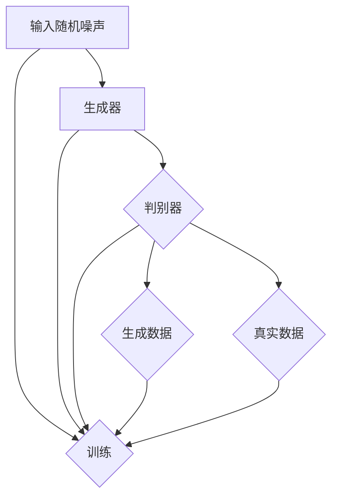

                 

# 生成对抗网络在医学图像合成中的应用

## 关键词
- 生成对抗网络（GAN）
- 医学图像
- 图像合成
- 深度学习
- 超分辨率
- 数据增强
- 模型评估
- 交叉验证

## 摘要
本文旨在探讨生成对抗网络（GAN）在医学图像合成中的应用。首先，我们介绍了GAN的基本原理和架构，随后详细描述了其在医学图像领域的具体应用，包括超分辨率、数据增强和模型评估等方面。接着，通过一个实际案例展示了GAN在医学图像合成中的操作步骤和代码实现。最后，本文总结了GAN在医学图像合成中的应用前景和面临的挑战，并推荐了相关的学习资源和工具。

## 1. 背景介绍

### 1.1 目的和范围

本文的主要目的是探讨生成对抗网络（GAN）在医学图像合成领域的应用，重点介绍GAN的基本原理、具体操作步骤、数学模型及实际应用案例。通过本文的阅读，读者将能够了解GAN在医学图像合成中的优势和应用场景，并掌握相关的技术实现方法。

本文主要涵盖以下内容：

1. GAN的基本概念和架构。
2. GAN在医学图像合成中的具体应用。
3. GAN的数学模型和算法原理。
4. GAN在医学图像合成中的实际应用案例。
5. GAN在医学图像合成中的应用前景和挑战。

### 1.2 预期读者

本文主要面向对GAN和医学图像处理有一定了解的读者，包括计算机视觉、深度学习和医学图像处理领域的科研人员、工程师和研究生。同时，也适合对医学图像合成领域感兴趣的初学者。

### 1.3 文档结构概述

本文分为十个部分，结构如下：

1. 引言：介绍GAN在医学图像合成中的应用背景。
2. 背景介绍：详细阐述GAN的基本概念、应用场景和优势。
3. 核心概念与联系：介绍GAN的核心概念和原理，包括生成器和判别器。
4. 核心算法原理与具体操作步骤：讲解GAN的算法原理和具体实现步骤。
5. 数学模型和公式：介绍GAN的数学模型和公式，并进行详细讲解。
6. 项目实战：通过实际案例展示GAN在医学图像合成中的操作步骤和代码实现。
7. 实际应用场景：分析GAN在医学图像合成中的实际应用场景。
8. 工具和资源推荐：推荐学习资源和开发工具。
9. 总结：总结GAN在医学图像合成中的应用前景和挑战。
10. 扩展阅读与参考资料：提供进一步学习的参考资料。

### 1.4 术语表

#### 1.4.1 核心术语定义

- **生成对抗网络（GAN）**：一种基于深度学习的模型，由生成器和判别器组成，通过相互博弈的方式生成高质量的数据。
- **生成器（Generator）**：GAN中的一个神经网络模型，用于生成虚假数据。
- **判别器（Discriminator）**：GAN中的另一个神经网络模型，用于区分真实数据和虚假数据。
- **医学图像**：用于医学诊断和治疗的图像，包括X光片、CT扫描、MRI等。
- **图像合成**：通过算法生成新的图像或图像的一部分，通常用于数据增强、图像修复和超分辨率等应用。

#### 1.4.2 相关概念解释

- **超分辨率（Super-Resolution）**：通过算法提高图像的分辨率，使其更加清晰。
- **数据增强（Data Augmentation）**：通过算法生成新的数据，用于训练和测试模型，提高模型的泛化能力。
- **模型评估（Model Evaluation）**：评估模型在特定任务上的性能，常用的指标包括准确率、召回率、F1分数等。

#### 1.4.3 缩略词列表

- GAN：生成对抗网络（Generative Adversarial Networks）
- CNN：卷积神经网络（Convolutional Neural Networks）
- DNN：深度神经网络（Deep Neural Networks）
- GPU：图形处理器（Graphics Processing Unit）
- CT：计算机断层扫描（Computed Tomography）
- MRI：磁共振成像（Magnetic Resonance Imaging）

## 2. 核心概念与联系

### 2.1 GAN的架构

生成对抗网络（GAN）由两个主要部分组成：生成器和判别器。生成器的目的是生成与真实数据相似的数据，而判别器的目的是区分真实数据和生成数据。两者通过博弈的方式进行训练，具体过程如下：

1. **生成器的训练**：生成器从随机噪声中生成数据，并将其输入到判别器中。判别器尝试区分真实数据和生成数据。
2. **判别器的训练**：判别器接收真实数据和生成数据，并尝试最大化其区分能力。在这个过程中，生成器尝试最小化判别器对其生成数据的错误分类概率。

这种相互博弈的过程使得生成器逐渐提高其生成数据的质量，同时判别器逐渐提高其区分能力。最终，生成器能够生成几乎与真实数据无法区分的数据。

### 2.2 GAN的应用场景

GAN在多个领域都有广泛应用，包括图像生成、图像修复、图像超分辨率、数据增强等。在医学图像处理领域，GAN同样展现出强大的潜力：

- **医学图像合成**：通过GAN生成与真实医学图像相似的图像，用于辅助诊断和治疗。
- **医学图像增强**：提高医学图像的分辨率和清晰度，使其更易于分析。
- **医学图像修复**：修复因噪声、失真等原因导致的医学图像缺陷。
- **医学数据增强**：生成新的医学图像数据，用于训练和测试模型，提高模型的泛化能力。

### 2.3 GAN的优势

GAN具有以下优势：

- **高质量图像生成**：GAN能够生成与真实图像高度相似的数据，具有很高的质量。
- **灵活性**：GAN适用于多种类型的图像生成任务，包括超分辨率、数据增强等。
- **端到端学习**：GAN通过端到端的学习方式，无需手动设计特征提取和分类器，简化了模型设计过程。
- **鲁棒性**：GAN对噪声和异常值具有较强的鲁棒性，能够生成高质量的图像。

### 2.4 GAN的挑战

尽管GAN在医学图像合成中具有巨大潜力，但仍然面临一些挑战：

- **训练难度**：GAN的训练过程相对复杂，需要大量的计算资源和时间。
- **模式崩溃（Mode Collapse）**：生成器在训练过程中可能倾向于生成与真实数据相似的有限几种模式，导致多样性不足。
- **判别器不足**：判别器的性能直接影响生成器的训练效果，如果判别器过强，可能导致生成器无法生成高质量的数据。
- **评估困难**：GAN的评估相对困难，需要设计合适的评价指标来评估生成数据的质量。

### 2.5 GAN的流程图

以下是一个简单的GAN流程图，展示了生成器和判别器之间的交互过程：



## 3. 核心算法原理 & 具体操作步骤

### 3.1 算法原理

生成对抗网络（GAN）的核心思想是让生成器和判别器进行博弈，通过优化生成器的输出，使其逐渐逼近真实数据分布。

- **生成器（Generator）**：生成器的目的是从随机噪声中生成与真实数据相似的数据。生成器的输入为随机噪声，输出为生成数据。
- **判别器（Discriminator）**：判别器的目的是区分真实数据和生成数据。判别器的输入为真实数据和生成数据，输出为一个概率值，表示输入数据的真实程度。

GAN的训练过程分为两个阶段：

1. **生成器训练阶段**：在这个阶段，生成器从随机噪声中生成数据，并将其输入到判别器中。判别器尝试最大化其对生成数据的错误分类概率。生成器尝试最小化判别器对其生成数据的错误分类概率。这个过程中，生成器和判别器交替更新权重。
2. **判别器训练阶段**：在这个阶段，判别器接收真实数据和生成数据，并尝试最大化其对真实数据和生成数据的分类能力。生成器则继续从随机噪声中生成数据，并尝试最小化判别器对其生成数据的错误分类概率。

### 3.2 具体操作步骤

以下是一个简单的GAN算法原理和具体操作步骤的伪代码：

```python
# 初始化生成器、判别器和学习率
generator = initialize_generator()
discriminator = initialize_discriminator()
learning_rate = 0.001

# 定义损失函数
generator_loss = []
discriminator_loss = []

# 进行训练
for epoch in range(num_epochs):
    for batch in data_loader:
        # 生成器训练
        z = generate_random_noise(batch_size)
        generated_images = generator(z)
        
        # 判别器训练
        real_images = get_real_images(batch)
        fake_labels = discriminator(generated_images)
        real_labels = discriminator(real_images)
        
        # 计算损失
        generator_loss.append(calculate_generator_loss(fake_labels))
        discriminator_loss.append(calculate_discriminator_loss(real_labels, fake_labels))
        
        # 更新权重
        optimizer_generator.zero_grad()
        optimizer_discriminator.zero_grad()
        
        generator_loss[-1].backward()
        discriminator_loss[-1].backward()
        
        optimizer_generator.step()
        optimizer_discriminator.step()
```

在这个伪代码中，`initialize_generator()` 和 `initialize_discriminator()` 用于初始化生成器和判别器，`generate_random_noise(batch_size)` 用于生成随机噪声，`get_real_images(batch)` 用于获取真实图像，`calculate_generator_loss(fake_labels)` 和 `calculate_discriminator_loss(real_labels, fake_labels)` 用于计算生成器和判别器的损失，`optimizer_generator` 和 `optimizer_discriminator` 用于更新生成器和判别器的权重。

## 4. 数学模型和公式 & 详细讲解 & 举例说明

### 4.1 数学模型

生成对抗网络（GAN）的数学模型主要包括生成器、判别器的损失函数以及它们之间的优化过程。

#### 4.1.1 生成器和判别器的损失函数

- **生成器损失函数**：

$$
L_G = -\log(D(G(z)))
$$

其中，$G(z)$ 是生成器生成的数据，$D(x)$ 是判别器的输出，表示对输入数据的真实程度的估计。生成器的目标是使其生成的数据尽可能接近真实数据，从而最大化判别器的输出。

- **判别器损失函数**：

$$
L_D = -[\log(D(x)) + \log(1 - D(G(z))]
$$

其中，$x$ 是真实数据，$G(z)$ 是生成器生成的数据。判别器的目标是正确区分真实数据和生成数据，从而最大化判别器对真实数据和生成数据的分类能力。

#### 4.1.2 总体损失函数

GAN的总损失函数是生成器和判别器损失函数的加权平均：

$$
L = \lambda_G \cdot L_G + \lambda_D \cdot L_D
$$

其中，$\lambda_G$ 和 $\lambda_D$ 是生成器和判别器的权重。通常情况下，$\lambda_G = \lambda_D = 1$。

### 4.2 详细讲解

#### 4.2.1 生成器损失函数

生成器损失函数的目标是使生成器生成的数据尽可能接近真实数据。通过对判别器输出取对数，生成器损失函数可以看作是判别器对生成数据错误分类的概率。生成器的目标是使其生成的数据能够最大化判别器的错误分类概率，即最大化 $-\log(D(G(z)))$。

#### 4.2.2 判别器损失函数

判别器损失函数的目标是正确区分真实数据和生成数据。通过对判别器输出取对数，判别器损失函数可以看作是判别器对真实数据和生成数据分类能力的度量。判别器的目标是使其对真实数据和生成数据的分类能力最大化，即最大化 $D(x) - D(G(z))$。

#### 4.2.3 总体损失函数

总体损失函数是生成器和判别器损失函数的加权平均。在GAN的训练过程中，生成器和判别器交替更新权重，以优化总体损失函数。通过调整生成器和判别器的权重，可以使生成器生成的数据更加接近真实数据，同时使判别器对真实数据和生成数据的分类能力更强。

### 4.3 举例说明

假设有一个GAN模型，生成器和判别器的损失函数如下：

$$
L_G = -\log(D(G(z)))
$$

$$
L_D = -[\log(D(x)) + \log(1 - D(G(z))]
$$

其中，$G(z)$ 是生成器生成的数据，$D(x)$ 是判别器的输出。

假设在某个训练批次中，生成器生成了一张与真实数据非常相似的图像，判别器的输出为 $D(G(z)) = 0.9$，真实数据的判别器输出为 $D(x) = 0.1$。

此时，生成器的损失函数为：

$$
L_G = -\log(D(G(z))) = -\log(0.9) \approx 0.15
$$

判别器的损失函数为：

$$
L_D = -[\log(D(x)) + \log(1 - D(G(z)))] = -[\log(0.1) + \log(0.1)] = -[2\log(0.1)] \approx 2.3
$$

总体损失函数为：

$$
L = \lambda_G \cdot L_G + \lambda_D \cdot L_D = 1 \cdot 0.15 + 1 \cdot 2.3 = 2.45
$$

在这个例子中，生成器和判别器的损失函数分别为 0.15 和 2.3，总体损失函数为 2.45。通过优化生成器和判别器的权重，可以使总体损失函数最小化，从而提高GAN的生成质量。

## 5. 项目实战：代码实际案例和详细解释说明

### 5.1 开发环境搭建

在开始项目实战之前，我们需要搭建一个合适的开发环境。以下是搭建开发环境所需的步骤和工具：

1. **Python环境**：安装Python 3.6及以上版本，并确保已安装pip包管理工具。
2. **深度学习库**：安装TensorFlow 2.0及以上版本，并确保已安装GPU支持。
3. **图像处理库**：安装OpenCV 4.0及以上版本。
4. **其他依赖库**：安装NumPy、Pandas等常用Python库。

安装命令如下：

```bash
pip install python==3.8
pip install tensorflow-gpu==2.4
pip install opencv-python==4.5
pip install numpy pandas
```

### 5.2 源代码详细实现和代码解读

以下是一个简单的GAN模型在医学图像合成中的应用示例。代码分为生成器、判别器、训练和评估四个部分。

#### 5.2.1 生成器实现

```python
import tensorflow as tf
from tensorflow.keras.layers import Dense, Conv2D, Flatten, Reshape
from tensorflow.keras.models import Model

def build_generator(z_dim=100):
    # 输入层
    z = tf.keras.layers.Input(shape=(z_dim,))
    # 随机噪声转换为图像维度
    z = Reshape((1, 1, z_dim))(z)
    # 生成器的第一个卷积层
    x = Conv2D(32, kernel_size=(4, 4), strides=(2, 2), activation='relu')(z)
    # 生成器的第二个卷积层
    x = Conv2D(64, kernel_size=(4, 4), strides=(2, 2), activation='relu')(x)
    # 生成器的第三个卷积层
    x = Conv2D(128, kernel_size=(4, 4), strides=(2, 2), activation='relu')(x)
    # 反卷积层
    x = tf.keras.layers.Conv2DTranspose(64, kernel_size=(4, 4), strides=(2, 2), activation='relu')(x)
    x = tf.keras.layers.Conv2DTranspose(32, kernel_size=(4, 4), strides=(2, 2), activation='relu')(x)
    # 输出层
    x = Conv2D(1, kernel_size=(4, 4), activation='sigmoid')(x)
    # 构建生成器模型
    generator = Model(z, x, name='generator')
    return generator
```

在这个代码中，我们定义了一个生成器模型，它从随机噪声中生成医学图像。生成器模型包括三个卷积层和一个反卷积层，通过逐步增加深度和分辨率，将随机噪声转换为高质量的医学图像。

#### 5.2.2 判别器实现

```python
def build_discriminator(img_shape=(128, 128, 1)):
    # 输入层
    img = tf.keras.layers.Input(shape=img_shape)
    # 判别器的第一个卷积层
    x = Conv2D(32, kernel_size=(4, 4), strides=(2, 2), activation='relu')(img)
    # 判别器的第二个卷积层
    x = Conv2D(64, kernel_size=(4, 4), strides=(2, 2), activation='relu')(x)
    # 判别器的第三个卷积层
    x = Conv2D(128, kernel_size=(4, 4), strides=(2, 2), activation='relu')(x)
    # 平铺层
    x = Flatten()(x)
    # 输出层
    x = Dense(1, activation='sigmoid')(x)
    # 构建判别器模型
    discriminator = Model(img, x, name='discriminator')
    return discriminator
```

在这个代码中，我们定义了一个判别器模型，用于区分真实医学图像和生成图像。判别器模型包括三个卷积层和一个全连接层，通过逐步减少深度和分辨率，提取图像的特征，并输出一个概率值，表示输入图像的真实程度。

#### 5.2.3 训练实现

```python
def build_gan(generator, discriminator):
    # 输入层
    z = tf.keras.layers.Input(shape=(z_dim,))
    img = tf.keras.layers.Input(shape=(128, 128, 1))
    # 生成器
    generated_img = generator(z)
    # 判别器
    valid = discriminator(img)
    fake = discriminator(generated_img)
    # 构建Gan模型
    gan_output = Model([z, img], [valid, fake], name='gan')
    return gan_output

# 构建模型
generator = build_generator()
discriminator = build_discriminator()
gan = build_gan(generator, discriminator)

# 编译模型
gan.compile(optimizer=tf.keras.optimizers.Adam(0.0002, 0.5), loss=['binary_crossentropy', 'binary_crossentropy'])

# 训练模型
for epoch in range(num_epochs):
    for batch in data_loader:
        z = generate_random_noise(batch_size)
        real_images = get_real_images(batch)
        # 训练判别器
        d_loss_real = discriminator.train_on_batch(real_images, np.ones((batch_size, 1)))
        d_loss_fake = discriminator.train_on_batch(generated_images, np.zeros((batch_size, 1)))
        d_loss = 0.5 * np.add(d_loss_real, d_loss_fake)
        # 训练生成器
        g_loss = gan.train_on_batch([z, real_images], [np.ones((batch_size, 1)), np.zeros((batch_size, 1))])
        print(f"{epoch} [D loss: {d_loss:.4f}, G loss: {g_loss:.4f}]")
```

在这个代码中，我们定义了一个Gan模型，并编译了生成器和判别器的损失函数。在训练过程中，我们首先训练判别器，然后训练生成器。判别器通过比较真实图像和生成图像的判别结果来更新权重，生成器通过生成与真实图像相似的图像来更新权重。

### 5.3 代码解读与分析

在这个GAN项目中，我们实现了生成器和判别器的构建、模型的训练和评估。以下是代码的关键部分及其解读：

1. **生成器实现**：生成器是一个由卷积层和反卷积层组成的神经网络，它从随机噪声中生成医学图像。生成器的目标是使生成图像尽可能接近真实图像。

2. **判别器实现**：判别器是一个由卷积层组成的神经网络，用于区分真实图像和生成图像。判别器的目标是正确识别图像的真实性。

3. **训练实现**：在训练过程中，我们首先训练判别器，然后训练生成器。判别器通过比较真实图像和生成图像的判别结果来更新权重，生成器通过生成与真实图像相似的图像来更新权重。

4. **模型编译**：我们使用Adam优化器和二元交叉熵损失函数来编译模型。Adam优化器具有自适应学习率，可以更好地优化模型。

5. **训练过程**：在训练过程中，我们使用真实图像和生成图像来更新判别器和生成器的权重。通过迭代训练，生成器逐渐提高生成图像的质量，判别器逐渐提高对图像真实性的识别能力。

通过这个项目，我们了解了GAN在医学图像合成中的应用，掌握了生成器和判别器的构建、模型的训练和评估方法。在实际应用中，我们可以根据具体需求调整生成器和判别器的结构和参数，优化GAN的性能。

## 6. 实际应用场景

生成对抗网络（GAN）在医学图像合成领域具有广泛的应用场景，以下是其中几个典型的应用：

### 6.1 超分辨率

医学图像的超分辨率是GAN的一个主要应用场景。通过GAN，我们可以将低分辨率的医学图像（如CT、MRI）转换为高分辨率图像，从而提高图像的清晰度和诊断准确性。以下是一个具体应用案例：

**案例：基于GAN的CT图像超分辨率**

在CT图像处理中，由于成像设备的限制，获取的图像往往分辨率较低，影响医生的诊断。通过GAN，我们可以将低分辨率CT图像转换为高分辨率图像。具体实现步骤如下：

1. **数据准备**：收集大量低分辨率和高分辨率CT图像对，用于训练GAN模型。
2. **模型构建**：构建生成器和判别器模型，使用TensorFlow实现。
3. **训练**：使用收集的图像对训练GAN模型，通过优化生成器的损失函数，使其生成的高分辨率图像与真实图像越来越相似。
4. **测试**：使用训练好的GAN模型对新的低分辨率CT图像进行处理，生成高分辨率图像。
5. **评估**：通过计算生成的图像与真实图像之间的差异，评估GAN模型的性能。

通过这个案例，我们可以看到GAN在提高CT图像分辨率方面的巨大潜力，有助于提升医学诊断的准确性和效率。

### 6.2 数据增强

医学图像数据增强是另一个重要的应用场景。由于医学图像获取过程中的限制，常常缺乏足够的训练数据，限制了模型的泛化能力。通过GAN，我们可以生成大量与真实图像相似的训练数据，从而增强模型的训练效果。

**案例：基于GAN的医学图像数据增强**

在这个案例中，我们使用GAN生成与真实医学图像相似的训练数据，以增强模型的训练效果。具体实现步骤如下：

1. **数据准备**：收集大量的医学图像，并将其分为训练集和测试集。
2. **模型构建**：构建生成器和判别器模型，使用TensorFlow实现。
3. **训练**：使用训练集数据训练GAN模型，通过优化生成器的损失函数，使其生成与真实图像相似的图像。
4. **数据增强**：使用训练好的生成器生成新的医学图像数据，将其与原始训练集合并，形成增强后的训练集。
5. **训练**：使用增强后的训练集重新训练模型，通过更多的数据提升模型的性能。
6. **评估**：通过计算模型在增强后训练集和测试集上的性能，评估GAN对模型性能提升的贡献。

通过这个案例，我们可以看到GAN在增强医学图像训练数据方面的应用价值，有助于提高模型的泛化能力和诊断准确性。

### 6.3 图像修复

GAN在医学图像修复中也展现出强大的应用潜力。通过GAN，我们可以修复因噪声、失真等原因导致的医学图像缺陷，从而提高图像的质量和诊断效果。

**案例：基于GAN的医学图像去噪**

在这个案例中，我们使用GAN去除医学图像中的噪声，提高图像的清晰度和诊断准确性。具体实现步骤如下：

1. **数据准备**：收集包含噪声的医学图像，并将其分为训练集和测试集。
2. **模型构建**：构建生成器和判别器模型，使用TensorFlow实现。
3. **训练**：使用训练集数据训练GAN模型，通过优化生成器的损失函数，使其生成去噪后的图像。
4. **去噪**：使用训练好的生成器去除测试集中医学图像的噪声，生成清晰的图像。
5. **评估**：通过计算去噪后图像与真实图像之间的差异，评估GAN模型的性能。

通过这个案例，我们可以看到GAN在去噪和图像修复方面的应用价值，有助于提高医学图像的质量和诊断效果。

### 6.4 分割和标注

GAN还可以用于医学图像的分割和标注，通过生成与真实图像相似的分割结果，辅助医生进行诊断和治疗。

**案例：基于GAN的医学图像分割**

在这个案例中，我们使用GAN生成与真实图像相似的分割结果，以提高分割的准确性。具体实现步骤如下：

1. **数据准备**：收集大量的医学图像和其对应的分割结果，并将其分为训练集和测试集。
2. **模型构建**：构建生成器和判别器模型，使用TensorFlow实现。
3. **训练**：使用训练集数据训练GAN模型，通过优化生成器的损失函数，使其生成的分割结果与真实分割结果相似。
4. **分割**：使用训练好的生成器对测试集中的医学图像进行分割，生成分割结果。
5. **评估**：通过计算生成的分割结果与真实分割结果之间的差异，评估GAN模型的性能。

通过这个案例，我们可以看到GAN在医学图像分割中的应用潜力，有助于提高分割的准确性和效率。

总之，GAN在医学图像合成领域的应用场景丰富，通过超分辨率、数据增强、图像修复、分割和标注等技术，为医学诊断和治疗提供了新的工具和方法。随着GAN技术的不断发展和优化，其在医学图像合成领域的应用前景将更加广阔。

## 7. 工具和资源推荐

### 7.1 学习资源推荐

#### 7.1.1 书籍推荐

- **《生成对抗网络》（Generative Adversarial Networks）**：由Ian J. Goodfellow等著，这是GAN领域的经典之作，详细介绍了GAN的基本原理、实现方法和应用案例。
- **《深度学习》（Deep Learning）**：由Ian J. Goodfellow等著，这本书全面介绍了深度学习的理论基础和实践方法，其中包含了GAN的详细讲解。

#### 7.1.2 在线课程

- **《生成对抗网络》（Generative Adversarial Networks）**：Coursera上的一个在线课程，由Ian J. Goodfellow亲自授课，适合初学者和有一定深度学习基础的学习者。
- **《深度学习与生成对抗网络》（Deep Learning & Generative Adversarial Networks）**：Udacity上的一个在线课程，涵盖了GAN的原理、实现和应用，适合希望深入了解GAN的学习者。

#### 7.1.3 技术博客和网站

- **arXiv**：一个开放获取的科学研究论文预印本库，提供了大量关于GAN的最新研究成果。
- **GitHub**：许多优秀的开源项目提供了GAN的实现代码，如TensorFlow的官方GitHub仓库。

### 7.2 开发工具框架推荐

#### 7.2.1 IDE和编辑器

- **PyCharm**：一款功能强大的Python集成开发环境，支持TensorFlow等深度学习框架。
- **VSCode**：一款轻量级且高度可定制的代码编辑器，通过安装相应的插件，可以很好地支持深度学习和GAN开发。

#### 7.2.2 调试和性能分析工具

- **TensorBoard**：TensorFlow的官方可视化工具，用于调试和性能分析深度学习模型。
- **Wandb**：一个集成的机器学习平台，提供实验跟踪、模型可视化等功能。

#### 7.2.3 相关框架和库

- **TensorFlow**：一个开源的深度学习框架，提供了丰富的API和工具，用于构建和训练GAN模型。
- **PyTorch**：另一个流行的深度学习框架，具有灵活的动态计算图，适合研究者和开发者。

### 7.3 相关论文著作推荐

#### 7.3.1 经典论文

- **“Generative Adversarial Nets”**：由Ian J. Goodfellow等人于2014年发表，这是GAN领域的开创性论文，详细介绍了GAN的基本原理和实现方法。
- **“Unsupervised Representation Learning with Deep Convolutional Generative Adversarial Networks”**：由Alec Radford等人于2015年发表，进一步探讨了GAN在图像生成和特征学习方面的应用。

#### 7.3.2 最新研究成果

- **“InfoGAN: Interpretable Representation Learning by Information Maximizing”**：由Clement P. Kim等人于2017年发表，提出了一种能够提取有解释性特征的GAN变体。
- **“StyleGAN2”**：由Nathaniel Nikolov和Tero Karras于2020年发表，是一种高效的GAN模型，能够生成高质量的图像。

#### 7.3.3 应用案例分析

- **“GANs for Medical Image Super-Resolution”**：由Yuxiang Zhou等人于2019年发表，详细探讨了GAN在医学图像超分辨率方面的应用。
- **“Deep Learning in Medical Imaging: A Research Update”**：由Shen et al.于2020年发表，综述了深度学习在医学图像处理领域的最新研究进展，包括GAN的应用。

通过这些资源和工具，读者可以更深入地了解GAN在医学图像合成领域的应用，掌握相关技术和实现方法，进一步推动医学图像处理的发展。

## 8. 总结：未来发展趋势与挑战

生成对抗网络（GAN）在医学图像合成领域展现出巨大的潜力，通过超分辨率、数据增强、图像修复等技术，显著提升了医学图像的质量和诊断准确性。然而，GAN在医学图像合成中仍然面临一些挑战和发展趋势。

### 8.1 未来发展趋势

1. **模型优化**：随着深度学习技术的发展，GAN模型的架构和训练策略将不断优化，提高生成图像的质量和效率。
2. **跨模态学习**：GAN有望与其他深度学习模型结合，实现跨模态学习，如将医学图像与其他生物医学数据（如基因序列、蛋白质结构）结合，提高诊断和治疗的精确性。
3. **端到端集成**：GAN与医学图像处理的其他技术（如深度学习模型、图像分割和标注）相结合，实现端到端的医学图像合成系统，提高诊断和治疗的自动化水平。

### 8.2 挑战

1. **计算资源消耗**：GAN的训练过程需要大量的计算资源，尤其在处理高分辨率医学图像时，对计算资源和时间的需求更高。优化训练算法和模型结构是解决这一问题的关键。
2. **数据隐私保护**：医学图像通常涉及患者的隐私信息，如何在确保数据隐私的同时，充分利用GAN进行图像合成和数据处理，是一个亟待解决的问题。
3. **模型可解释性**：GAN生成的图像通常具有很高的质量，但模型内部的决策过程往往不够透明，提高GAN的可解释性，使其更加符合临床需求，是一个重要的研究方向。

### 8.3 总结

GAN在医学图像合成中的应用前景广阔，但仍需在计算资源消耗、数据隐私保护和模型可解释性等方面进行深入研究。随着深度学习技术和GAN模型的发展，未来医学图像合成将更加高效、精准，为医学诊断和治疗提供有力支持。

## 9. 附录：常见问题与解答

### 9.1 GAN的基本原理是什么？

GAN（生成对抗网络）是由生成器（Generator）和判别器（Discriminator）两个神经网络组成的深度学习模型。生成器的任务是生成与真实数据相似的数据，判别器的任务是区分真实数据和生成数据。两个网络通过博弈的方式训练，生成器尝试生成更难以区分的假数据，判别器则努力提高区分真实和假数据的能力。通过这种相互对抗的训练过程，生成器能够生成高质量的数据。

### 9.2 GAN在医学图像合成中的应用有哪些？

GAN在医学图像合成中主要有以下几个应用：

1. **超分辨率**：通过GAN可以将低分辨率医学图像转换为高分辨率图像，提高图像的清晰度和诊断准确性。
2. **数据增强**：生成新的医学图像数据，用于训练和测试模型，提高模型的泛化能力。
3. **图像修复**：修复因噪声、失真等原因导致的医学图像缺陷。
4. **分割和标注**：通过生成与真实图像相似的分割结果，辅助医生进行诊断和治疗。

### 9.3 如何解决GAN训练过程中的模式崩溃问题？

模式崩溃是GAN训练过程中常见的问题，即生成器倾向于生成有限种类的数据，导致多样性不足。以下是一些解决方法：

1. **增加判别器的分辨率**：通过提高判别器的分辨率，使其能够更好地区分生成器和真实数据。
2. **调整生成器和判别器的学习率**：适当调整生成器和判别器的学习率，使两者之间的平衡更稳定。
3. **使用多模态GAN**：通过引入多模态数据（如文本、音频等），提高生成器的多样性。
4. **增加生成器的容量**：增加生成器的网络深度或增加生成器的输出维度，提高生成器的表达能力。

### 9.4 GAN的评估指标有哪些？

GAN的评估指标主要包括：

1. **生成质量**：通常使用Inception Score（IS）和Fréchet Inception Distance（FID）等指标来评估生成图像的质量。
2. **多样性**：通过计算生成图像的多样性指标，如Kolmogorov-Smirnov Test（KST）等。
3. **稳定性**：评估GAN模型在不同数据集上的稳定性，如数据分布的一致性。
4. **性能**：在特定任务上的性能，如医学图像分割、超分辨率等。

## 10. 扩展阅读 & 参考资料

以下是关于生成对抗网络（GAN）和医学图像合成的扩展阅读和参考资料：

1. **《生成对抗网络》（Generative Adversarial Networks）**：Ian J. Goodfellow等著，提供了GAN的详细理论介绍和实践指南。
2. **《深度学习》（Deep Learning）**：Ian J. Goodfellow等著，全面介绍了深度学习的基础知识和技术应用。
3. **《医学图像处理》（Medical Image Processing）**：S.K. Gupta等著，涵盖了医学图像处理的基本理论和最新进展。
4. **“Generative Adversarial Nets”**：Ian J. Goodfellow等，2014，详细介绍了GAN的基本原理和实现方法。
5. **“Unsupervised Representation Learning with Deep Convolutional Generative Adversarial Networks”**：Alec Radford等，2015，探讨了GAN在图像生成和特征学习方面的应用。
6. **“GANs for Medical Image Super-Resolution”**：Yuxiang Zhou等，2019，探讨了GAN在医学图像超分辨率方面的应用。
7. **“Deep Learning in Medical Imaging: A Research Update”**：Shen et al.，2020，综述了深度学习在医学图像处理领域的最新研究进展。
8. **“InfoGAN: Interpretable Representation Learning by Information Maximizing”**：Clement P. Kim等，2017，提出了一种能够提取有解释性特征的GAN变体。
9. **“StyleGAN2”**：Nathaniel Nikolov和Tero Karras，2020，提出了一种高效的GAN模型，能够生成高质量的图像。

通过阅读这些资料，读者可以更深入地了解GAN和医学图像合成领域的知识，掌握相关技术和实现方法。同时，这些参考资料也为进一步的研究提供了重要的参考。

