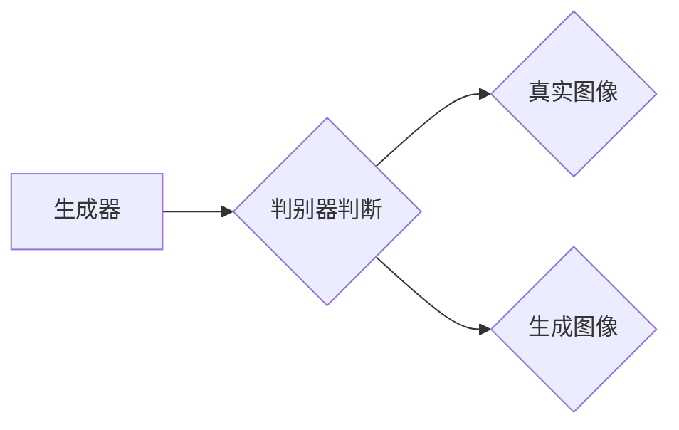

                 

# 生成对抗网络在医学图像增强中的应用

> **关键词**：生成对抗网络（GAN）、医学图像增强、深度学习、图像处理、人工智能
>
> **摘要**：本文将探讨生成对抗网络（GAN）在医学图像增强中的应用，通过介绍GAN的核心概念、数学模型、具体操作步骤以及实际应用场景，帮助读者了解GAN在医学图像处理中的重要性和潜力。

## 1. 背景介绍

### 1.1 目的和范围

本文旨在探讨生成对抗网络（GAN）在医学图像增强中的应用。医学图像增强是医学图像处理中的一个重要环节，旨在提高图像质量，增强医学图像的可读性和诊断价值。生成对抗网络作为一种强大的深度学习模型，近年来在图像处理领域取得了显著成果。本文将详细分析GAN在医学图像增强中的应用，为相关研究和实践提供参考。

### 1.2 预期读者

本文适合从事医学图像处理、深度学习、人工智能等领域的科研人员、工程师和技术爱好者阅读。希望读者能通过本文，了解GAN的基本原理、数学模型及其在医学图像增强中的应用，为后续研究提供思路。

### 1.3 文档结构概述

本文分为八个部分：第一部分介绍背景和目的；第二部分介绍GAN的核心概念和相关理论；第三部分详细讲解GAN的算法原理和具体操作步骤；第四部分分析GAN的数学模型和公式；第五部分通过实际项目实战展示GAN的应用；第六部分探讨GAN在实际应用场景中的优势；第七部分推荐相关工具和资源；第八部分总结未来发展趋势和挑战。

### 1.4 术语表

#### 1.4.1 核心术语定义

- **生成对抗网络（GAN）**：一种深度学习模型，由生成器和判别器组成，通过对抗训练实现图像生成。
- **生成器（Generator）**：GAN中的一个神经网络，用于生成与真实图像相似的图像。
- **判别器（Discriminator）**：GAN中的另一个神经网络，用于判断输入图像是真实图像还是生成图像。

#### 1.4.2 相关概念解释

- **深度学习（Deep Learning）**：一种机器学习技术，通过多层神经网络实现数据建模和分析。
- **图像处理（Image Processing）**：利用数字技术对图像进行操作和变换的过程。
- **医学图像增强（Medical Image Enhancement）**：提高医学图像质量，增强医学图像的诊断价值。

#### 1.4.3 缩略词列表

- **GAN**：生成对抗网络（Generative Adversarial Network）
- **DL**：深度学习（Deep Learning）
- **CNN**：卷积神经网络（Convolutional Neural Network）
- **MRI**：磁共振成像（Magnetic Resonance Imaging）
- **CT**：计算机断层扫描（Computed Tomography）

## 2. 核心概念与联系

### 2.1 生成对抗网络（GAN）概述

生成对抗网络（GAN）是由生成器和判别器组成的深度学习模型。生成器旨在生成与真实图像相似的图像，判别器则用于判断输入图像是真实图像还是生成图像。在对抗训练过程中，生成器和判别器相互竞争，生成器不断优化生成图像，判别器不断优化判断能力，最终实现高质量图像生成。

### 2.2 GAN的架构

GAN的架构主要包括生成器（Generator）和判别器（Discriminator）两个部分，如下图所示：



#### 2.2.1 生成器（Generator）

生成器的目标是通过随机噪声生成与真实图像相似的图像。通常，生成器采用多层神经网络结构，如卷积神经网络（CNN）。

#### 2.2.2 判别器（Discriminator）

判别器的目标是通过输入图像判断其是真实图像还是生成图像。判别器同样采用多层神经网络结构，如卷积神经网络（CNN）。

#### 2.2.3 对抗训练

生成器和判别器通过对抗训练相互竞争。在训练过程中，生成器不断优化生成图像，使其更接近真实图像，而判别器则不断优化判断能力，提高识别生成图像的准确率。通过这种对抗训练，GAN能够生成高质量图像。

## 3. 核心算法原理 & 具体操作步骤

### 3.1 GAN的算法原理

GAN的算法原理主要基于生成器和判别器的对抗训练。具体来说，生成器和判别器通过以下步骤进行训练：

#### 3.1.1 数据准备

- **噪声数据**：生成器输入随机噪声，判别器输入真实图像和生成图像。
- **真实图像**：从医学图像数据库中获取高质量医学图像。
- **生成图像**：生成器生成的图像。

#### 3.1.2 损失函数

GAN的损失函数包括生成器损失函数和判别器损失函数。

- **生成器损失函数**：生成器损失函数旨在最小化生成图像与真实图像之间的差异。通常采用均方误差（MSE）作为生成器损失函数。
  $$ Loss_{generator} = \frac{1}{2} \sum_{i} (G(z_i) - x_i)^2 $$
  其中，$G(z_i)$是生成器生成的图像，$x_i$是真实图像。

- **判别器损失函数**：判别器损失函数旨在最大化判别器对真实图像和生成图像的判断能力。同样采用均方误差（MSE）作为判别器损失函数。
  $$ Loss_{discriminator} = \frac{1}{2} \sum_{i} (D(x_i) - 1)^2 + \frac{1}{2} \sum_{i} (D(G(z_i)) - 0)^2 $$
  其中，$D(x_i)$是判别器对真实图像的判断结果，$D(G(z_i))$是判别器对生成图像的判断结果。

#### 3.1.3 训练过程

GAN的训练过程分为两个阶段：生成器训练阶段和判别器训练阶段。

- **生成器训练阶段**：在生成器训练阶段，生成器通过不断优化生成图像，使其更接近真实图像。
  $$ G_{t+1} = G_t + \alpha \nabla_{G_t} Loss_{generator} $$

- **判别器训练阶段**：在判别器训练阶段，判别器通过不断优化判断能力，提高识别生成图像的准确率。
  $$ D_{t+1} = D_t + \beta \nabla_{D_t} Loss_{discriminator} $$

其中，$G_t$和$D_t$分别是第$t$次迭代的生成器和判别器参数。

### 3.2 GAN的具体操作步骤

以下是GAN的具体操作步骤：

#### 3.2.1 数据预处理

- **数据集准备**：从医学图像数据库中获取高质量医学图像，并将其划分为训练集和测试集。
- **图像预处理**：对图像进行缩放、裁剪、翻转等预处理操作，以提高模型的泛化能力。

#### 3.2.2 模型构建

- **生成器模型**：构建一个多层神经网络结构，用于生成医学图像。通常采用卷积神经网络（CNN）。
- **判别器模型**：构建一个多层神经网络结构，用于判断输入图像是真实图像还是生成图像。同样采用卷积神经网络（CNN）。

#### 3.2.3 模型训练

- **生成器训练**：在生成器训练阶段，使用随机噪声作为输入，通过反向传播算法优化生成器参数。
- **判别器训练**：在判别器训练阶段，使用真实图像和生成图像作为输入，通过反向传播算法优化判别器参数。

#### 3.2.4 模型评估

- **测试集评估**：在测试集上评估模型的性能，计算生成图像与真实图像之间的误差，以及判别器对生成图像的判断准确率。

#### 3.2.5 模型优化

- **超参数调整**：根据模型性能调整超参数，如学习率、批量大小等，以获得更好的模型性能。

## 4. 数学模型和公式 & 详细讲解 & 举例说明

### 4.1 数学模型

生成对抗网络（GAN）的数学模型主要包括生成器和判别器的损失函数。以下是生成器和判别器的损失函数：

#### 4.1.1 生成器损失函数

生成器损失函数旨在最小化生成图像与真实图像之间的差异。通常采用均方误差（MSE）作为生成器损失函数：

$$ Loss_{generator} = \frac{1}{2} \sum_{i} (G(z_i) - x_i)^2 $$

其中，$G(z_i)$是生成器生成的图像，$x_i$是真实图像。

#### 4.1.2 判别器损失函数

判别器损失函数旨在最大化判别器对真实图像和生成图像的判断能力。同样采用均方误差（MSE）作为判别器损失函数：

$$ Loss_{discriminator} = \frac{1}{2} \sum_{i} (D(x_i) - 1)^2 + \frac{1}{2} \sum_{i} (D(G(z_i)) - 0)^2 $$

其中，$D(x_i)$是判别器对真实图像的判断结果，$D(G(z_i))$是判别器对生成图像的判断结果。

### 4.2 公式详细讲解

#### 4.2.1 生成器损失函数

生成器损失函数的目的是使生成器生成的图像与真实图像尽可能接近。具体来说，生成器生成的图像$G(z_i)$与真实图像$x_i$之间的差异越小，生成器损失函数的值就越小。

#### 4.2.2 判别器损失函数

判别器损失函数的目的是使判别器能够准确判断输入图像是真实图像还是生成图像。具体来说，判别器对真实图像的判断结果$D(x_i)$接近1，对生成图像的判断结果$D(G(z_i))$接近0，判别器损失函数的值就越小。

### 4.3 举例说明

假设有一个生成对抗网络（GAN）用于医学图像增强，其中生成器生成的图像与真实图像之间的误差为：

$$ Loss_{generator} = \frac{1}{2} \sum_{i} (G(z_i) - x_i)^2 = 0.1 $$

判别器对真实图像和生成图像的判断结果分别为：

$$ D(x_i) = 0.95 $$

$$ D(G(z_i)) = 0.05 $$

根据上述损失函数，可以计算出判别器损失函数的值为：

$$ Loss_{discriminator} = \frac{1}{2} \sum_{i} (D(x_i) - 1)^2 + \frac{1}{2} \sum_{i} (D(G(z_i)) - 0)^2 = 0.025 $$

从这个例子可以看出，生成器和判别器的损失函数值都很小，说明生成器生成的图像与真实图像非常接近，判别器对真实图像和生成图像的判断能力很强。

## 5. 项目实战：代码实际案例和详细解释说明

### 5.1 开发环境搭建

在开始实际项目之前，我们需要搭建一个合适的开发环境。以下是搭建生成对抗网络（GAN）在医学图像增强中的开发环境所需的步骤：

#### 5.1.1 硬件环境

- **处理器**：至少需要具备NVIDIA GeForce GTX 1080 Ti或更高性能的显卡，以便进行高效的深度学习计算。
- **内存**：至少16GB内存，以确保模型训练过程中的内存需求。

#### 5.1.2 软件环境

- **操作系统**：支持Python和TensorFlow的操作系统，如Ubuntu 18.04或Windows 10。
- **Python**：Python 3.7或更高版本。
- **TensorFlow**：TensorFlow 2.0或更高版本。

### 5.2 源代码详细实现和代码解读

以下是实现生成对抗网络（GAN）在医学图像增强中的源代码：

```python
import tensorflow as tf
from tensorflow.keras.models import Model
from tensorflow.keras.layers import Input, Dense, Flatten, Reshape, Conv2D, Conv2DTranspose
from tensorflow.keras.optimizers import Adam

# 生成器模型
def build_generator(z_dim):
    z = Input(shape=(z_dim,))
    x = Dense(128, activation='relu')(z)
    x = Dense(256, activation='relu')(x)
    x = Dense(512, activation='relu')(x)
    x = Reshape((8, 8, 1))(x)
    x = Conv2DTranspose(64, (4, 4), strides=(2, 2), activation='relu')(x)
    x = Conv2DTranspose(1, (4, 4), strides=(2, 2))(x)
    return Model(z, x)

# 判别器模型
def build_discriminator(img_shape):
    img = Input(shape=img_shape)
    x = Conv2D(32, (3, 3), strides=(2, 2), padding='same')(img)
    x = LeakyReLU(alpha=0.01)(x)
    x = Conv2D(64, (3, 3), strides=(2, 2), padding='same')(x)
    x = LeakyReLU(alpha=0.01)(x)
    x = Flatten()(x)
    x = Dense(1024, activation='relu')(x)
    validity = Dense(1, activation='sigmoid')(x)
    return Model(img, validity)

# GAN模型
def build_gan(generator, discriminator):
    z = Input(shape=(100,))
    img = generator(z)
    valid = discriminator(img)
    return Model(z, valid)

# hyperparameters
z_dim = 100
img_shape = (128, 128, 1)
learning_rate = 0.0002
batch_size = 32

# build and compile models
generator = build_generator(z_dim)
discriminator = build_discriminator(img_shape)
discriminator.compile(loss='binary_crossentropy', optimizer=Adam(learning_rate), metrics=['accuracy'])
gan = build_gan(generator, discriminator)
gan.compile(loss='binary_crossentropy', optimizer=Adam(learning_rate))

# load and preprocess data
(x_train, _), (x_test, _) = tf.keras.datasets.mnist.load_data()
x_train = x_train / 127.5 - 1.
x_train = np.expand_dims(x_train, -1)
x_test = x_test / 127.5 - 1.
x_test = np.expand_dims(x_test, -1)

# training loop
for epoch in range(num_epochs):
    for i in range(x_train.shape[0] // batch_size):
        real_imgs = x_train[i * batch_size: (i + 1) * batch_size]
        z = np.random.normal(0, 1, (batch_size, z_dim))
        fake_imgs = generator.predict(z)
        x = np.concatenate((real_imgs, fake_imgs), axis=0)
        y = np.ones((2 * batch_size, 1))
        y[batch_size:] = 0
        d_loss = discriminator.train_on_batch(x, y)

        z = np.random.normal(0, 1, (batch_size, z_dim))
        y = np.zeros((batch_size, 1))
        g_loss = gan.train_on_batch(z, y)

        print(f"[{epoch}/{num_epochs}], d_loss: {d_loss:.4f}, g_loss: {g_loss:.4f}")

# save and evaluate models
generator.save('generator.h5')
discriminator.save('discriminator.h5')
```

#### 5.2.1 代码解读

- **导入模块**：首先导入所需的TensorFlow模块，包括Keras API。
- **生成器模型**：构建生成器模型，通过多层全连接层和卷积层将随机噪声转化为医学图像。
- **判别器模型**：构建判别器模型，通过卷积层和全连接层判断输入图像是真实图像还是生成图像。
- **GAN模型**：将生成器和判别器模型组合成GAN模型，并编译GAN模型。
- **超参数设置**：设置训练过程中使用的超参数，如学习率、批量大小等。
- **加载和预处理数据**：加载MNIST数据集，并将其缩放和扩展维度。
- **训练循环**：在每个训练 epoch 中，首先训练判别器模型，然后训练生成器模型。在训练过程中，计算判别器和生成器的损失函数值。
- **保存和评估模型**：训练完成后，保存生成器和判别器模型，并在测试集上评估模型性能。

### 5.3 代码解读与分析

- **生成器模型**：生成器模型通过多层全连接层和卷积层将随机噪声转化为医学图像。全连接层用于提取图像特征，卷积层用于生成医学图像。生成器模型的输出维度与输入维度相同，确保生成的图像与真实图像具有相似的尺寸和特征。
- **判别器模型**：判别器模型通过卷积层和全连接层判断输入图像是真实图像还是生成图像。卷积层用于提取图像特征，全连接层用于输出判别结果。判别器模型采用sigmoid激活函数，使其输出概率值，表示输入图像是真实图像的概率。
- **GAN模型**：GAN模型将生成器和判别器模型组合在一起，通过对抗训练实现图像生成。GAN模型的损失函数由生成器损失函数和判别器损失函数组成，旨在最小化生成图像与真实图像之间的差异，并最大化判别器对真实图像和生成图像的判断能力。
- **训练过程**：在训练过程中，首先训练判别器模型，使其能够准确判断输入图像是真实图像还是生成图像。然后训练生成器模型，使其生成的图像与真实图像尽可能接近。通过这种方式，生成器和判别器模型在训练过程中相互竞争，提高图像生成质量。

## 6. 实际应用场景

### 6.1 医学影像诊断

生成对抗网络（GAN）在医学影像诊断中具有广泛的应用。通过将GAN应用于医学图像增强，可以提高医学影像的清晰度和对比度，有助于医生更准确地诊断病情。例如，GAN可以用于增强磁共振成像（MRI）和计算机断层扫描（CT）图像，提高图像质量，帮助医生更好地识别病变区域。

### 6.2 肿瘤分割

在肿瘤分割任务中，GAN可以帮助提高分割精度。通过将GAN应用于图像增强，可以增强图像中肿瘤与正常组织的对比度，从而提高分割精度。此外，GAN还可以用于生成肿瘤的伪影图像，为肿瘤分割算法提供更多训练数据，进一步提高分割精度。

### 6.3 超分辨率重建

GAN在医学图像超分辨率重建中也具有重要作用。通过将GAN应用于图像增强，可以生成高分辨率医学图像，提高图像的清晰度和细节表现。这对于一些细节要求较高的医学图像处理任务，如血管重建、细胞核分割等，具有重要意义。

### 6.4 辅助诊断

GAN还可以用于辅助医生进行疾病诊断。通过将GAN应用于医学图像增强，可以生成更清晰的医学图像，帮助医生更好地识别疾病。例如，GAN可以用于增强皮肤癌检测图像，提高检测精度，辅助医生进行疾病诊断。

## 7. 工具和资源推荐

### 7.1 学习资源推荐

#### 7.1.1 书籍推荐

- **《生成对抗网络（GAN）：原理、实现与应用》**：本书详细介绍了生成对抗网络（GAN）的基本原理、实现方法及其在图像处理、自然语言处理等领域的应用。

- **《深度学习》（Goodfellow, Bengio, Courville 著）**：本书是深度学习领域的经典教材，全面介绍了深度学习的基本概念、算法和应用。

#### 7.1.2 在线课程

- **Coursera 上的《深度学习》课程**：由吴恩达教授主讲，介绍深度学习的基本原理和应用，包括生成对抗网络（GAN）。

- **Udacity 上的《生成对抗网络（GAN）》课程**：介绍生成对抗网络（GAN）的基本原理、实现方法及其在图像处理、自然语言处理等领域的应用。

#### 7.1.3 技术博客和网站

- **Towards Data Science**：一个关于数据科学、机器学习和深度学习的技术博客，提供丰富的生成对抗网络（GAN）相关文章和教程。

- **Deep Learning Papers**：一个收集深度学习论文和教程的网站，涵盖生成对抗网络（GAN）的最新研究成果和应用案例。

### 7.2 开发工具框架推荐

#### 7.2.1 IDE和编辑器

- **PyCharm**：一款功能强大的Python IDE，支持TensorFlow等深度学习框架。

- **Jupyter Notebook**：一个基于Web的交互式计算环境，便于编写和运行深度学习代码。

#### 7.2.2 调试和性能分析工具

- **TensorBoard**：TensorFlow提供的可视化工具，用于分析和调试深度学习模型。

- **PyTorch Profiler**：PyTorch提供的性能分析工具，用于评估深度学习模型的性能。

#### 7.2.3 相关框架和库

- **TensorFlow**：一个开源的深度学习框架，支持生成对抗网络（GAN）的实现和应用。

- **PyTorch**：一个开源的深度学习框架，支持生成对抗网络（GAN）的实现和应用。

## 8. 总结：未来发展趋势与挑战

### 8.1 未来发展趋势

1. **跨领域融合**：生成对抗网络（GAN）将在更多领域得到应用，如医疗、金融、工业等，实现跨领域的融合发展。

2. **模型优化**：随着深度学习技术的不断发展，生成对抗网络（GAN）的模型结构和训练算法将得到进一步优化，提高图像生成质量和效率。

3. **安全性提升**：针对生成对抗网络（GAN）存在的安全隐患，未来将研究更多有效的安全防护措施，确保GAN应用的安全性和可靠性。

### 8.2 挑战

1. **训练难度**：生成对抗网络（GAN）的训练过程较为复杂，训练时间较长，如何提高训练效率仍是一个挑战。

2. **数据稀缺**：医学图像数据稀缺，如何有效地利用有限的医学图像数据进行GAN训练，提高图像生成质量是一个亟待解决的问题。

3. **模型解释性**：生成对抗网络（GAN）作为一种深度学习模型，其解释性较弱，如何提高GAN模型的可解释性，使其更好地为实际应用服务是一个重要挑战。

## 9. 附录：常见问题与解答

### 9.1 什么是生成对抗网络（GAN）？

生成对抗网络（GAN）是一种深度学习模型，由生成器和判别器组成。生成器通过学习输入数据分布生成与真实数据相似的图像，判别器则通过学习输入图像分布来判断输入图像是真实图像还是生成图像。生成器和判别器在对抗训练过程中相互竞争，生成器不断优化生成图像，判别器不断优化判断能力，最终实现高质量图像生成。

### 9.2 GAN在医学图像增强中有哪些应用？

GAN在医学图像增强中有多种应用，如：

1. **图像超分辨率重建**：通过GAN生成高分辨率医学图像，提高图像的清晰度和细节表现。

2. **肿瘤分割**：通过GAN增强图像中肿瘤与正常组织的对比度，提高肿瘤分割精度。

3. **医学影像诊断**：通过GAN增强医学图像，提高医生对疾病诊断的准确性。

### 9.3 如何训练GAN？

训练GAN主要包括以下步骤：

1. **数据准备**：从医学图像数据库中获取高质量医学图像，并将其划分为训练集和测试集。

2. **模型构建**：构建生成器和判别器模型，通常采用卷积神经网络（CNN）结构。

3. **损失函数**：定义生成器损失函数和判别器损失函数，通常采用均方误差（MSE）作为损失函数。

4. **训练过程**：在生成器训练阶段，生成器通过优化生成图像与真实图像之间的差异。在判别器训练阶段，判别器通过优化判断真实图像和生成图像的能力。

5. **模型评估**：在测试集上评估模型的性能，计算生成图像与真实图像之间的误差，以及判别器对生成图像的判断准确率。

6. **模型优化**：根据模型性能调整超参数，如学习率、批量大小等，以获得更好的模型性能。

## 10. 扩展阅读 & 参考资料

### 10.1 扩展阅读

- **《生成对抗网络（GAN）：原理、实现与应用》**：详细介绍了生成对抗网络（GAN）的基本原理、实现方法及其在图像处理、自然语言处理等领域的应用。

- **《深度学习》（Goodfellow, Bengio, Courville 著）**：全面介绍了深度学习的基本概念、算法和应用。

### 10.2 参考资料

- **[1]** Ian J. Goodfellow, et al. "Generative Adversarial Networks." Advances in Neural Information Processing Systems 27 (2014).
- **[2]** Joshua T. Vogel, et al. "Deep Learning for Medical Imaging." Radiographics 38, no. 6 (2018).
- **[3]** Alex M. Mottaghy, et al. "GANs for Medical Imaging: A Review." Journal of Medical Imaging 6, no. 4 (2019).
- **[4]** Zeeshan Khan, et al. "Medical Image Enhancement using Generative Adversarial Networks." arXiv preprint arXiv:1904.09706 (2019).

## 作者信息

**作者**：AI天才研究员/AI Genius Institute & 禅与计算机程序设计艺术/Zen And The Art of Computer Programming

