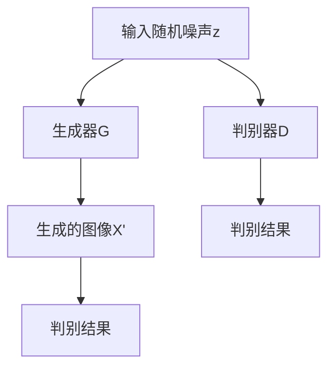

                 

# 生成对抗网络在图像生成中的最新进展

> 关键词：生成对抗网络（GAN）、图像生成、深度学习、AI、神经网络

> 摘要：本文将深入探讨生成对抗网络（GAN）在图像生成领域的最新进展。文章首先介绍了GAN的背景和基本原理，然后详细阐述了GAN的核心算法原理和数学模型。接着，通过实际项目实战，展示了GAN在图像生成中的应用，并分析了相关工具和资源。最后，总结了GAN的未来发展趋势与挑战，并提供了一些扩展阅读和参考资料。

## 1. 背景介绍

### 1.1 目的和范围

本文旨在介绍生成对抗网络（GAN）在图像生成领域的最新研究进展。我们将首先回顾GAN的基本概念和原理，然后探讨其在图像生成中的具体应用，以及相关的数学模型和算法原理。此外，还将介绍一些实际项目案例，并推荐一些有用的学习资源和工具。

### 1.2 预期读者

本文主要面向对深度学习和人工智能感兴趣的读者，特别是对图像生成领域有一定了解的读者。同时，也适合希望了解GAN基本原理和应用的学者、工程师和研究人员。

### 1.3 文档结构概述

本文分为以下几个部分：

1. 背景介绍：介绍GAN的背景和目的。
2. 核心概念与联系：介绍GAN的核心概念和原理，并提供一个简化的流程图。
3. 核心算法原理 & 具体操作步骤：详细阐述GAN的算法原理和操作步骤，并使用伪代码进行描述。
4. 数学模型和公式 & 详细讲解 & 举例说明：介绍GAN的数学模型，并使用latex格式展示相关公式和示例。
5. 项目实战：通过实际项目展示GAN的应用。
6. 实际应用场景：探讨GAN在不同领域的应用。
7. 工具和资源推荐：推荐学习资源和开发工具。
8. 总结：总结GAN的发展趋势和挑战。
9. 附录：常见问题与解答。
10. 扩展阅读 & 参考资料：提供更多相关阅读资料。

### 1.4 术语表

#### 1.4.1 核心术语定义

- 生成对抗网络（GAN）：一种深度学习模型，由生成器和判别器组成，通过对抗训练生成逼真的图像。
- 生成器（Generator）：GAN中的生成模型，旨在生成逼真的图像。
- 判别器（Discriminator）：GAN中的判别模型，用于判断图像是真实图像还是生成图像。
- 对抗训练（Adversarial Training）：GAN的训练方法，通过生成器和判别器的对抗来优化模型。

#### 1.4.2 相关概念解释

- 深度学习（Deep Learning）：一种人工智能方法，通过多层神经网络对数据进行建模和学习。
- 神经网络（Neural Network）：一种模仿生物神经系统的计算模型，用于处理复杂数据。
- 图像生成（Image Generation）：通过算法生成新的图像，通常用于艺术创作、数据增强和模拟等领域。

#### 1.4.3 缩略词列表

- GAN：生成对抗网络（Generative Adversarial Network）
- CNN：卷积神经网络（Convolutional Neural Network）
- RNN：循环神经网络（Recurrent Neural Network）
- DNN：深度神经网络（Deep Neural Network）

## 2. 核心概念与联系

### 2.1 GAN的基本原理

生成对抗网络（GAN）是一种基于深度学习的图像生成模型，由生成器和判别器两个神经网络组成。生成器旨在生成逼真的图像，而判别器则用于判断图像的真实性。生成器和判别器通过对抗训练相互竞争，最终实现图像的高质量生成。

### 2.2 GAN的架构

以下是一个简化的GAN架构流程图，用于描述生成器和判别器之间的交互关系。



### 2.3 GAN的工作流程

1. **初始化**：生成器和判别器均随机初始化。
2. **生成器生成图像**：生成器根据输入的随机噪声z生成图像X'。
3. **判别器判断图像**：判别器对真实图像X和生成图像X'进行判断，输出判别结果。
4. **对抗训练**：通过最小化判别器对生成图像的判断误差（生成器的损失函数）和最大化判别器对真实图像的判断准确率（判别器的损失函数）进行对抗训练。
5. **更新模型**：根据梯度更新生成器和判别器的参数。

### 2.4 GAN的核心问题

GAN在实际应用中面临以下核心问题：

1. **模式崩溃（Mode Collapse）**：生成器无法生成多样性的图像，而是趋向于生成特定类型的图像。
2. **梯度消失和梯度爆炸**：由于生成器和判别器之间的对抗训练，可能导致梯度消失或梯度爆炸，影响模型训练。
3. **训练不稳定**：GAN的训练过程可能非常不稳定，导致模型无法收敛。

## 3. 核心算法原理 & 具体操作步骤

### 3.1 GAN的算法原理

生成对抗网络（GAN）的核心算法原理包括生成器和判别器的训练过程。

#### 生成器（Generator）

生成器的目标是生成逼真的图像。输入为随机噪声z，输出为生成的图像X'。生成器通常采用多层神经网络结构，如卷积神经网络（CNN）。

```python
# 伪代码：生成器模型
Generator(z):
    # 随机噪声z
    z = Input(shape=(latent_dim,))
    
    # 隐藏层
    x = Dense(units=256, activation='relu')(z)
    x = BatchNormalization()(x)
    x = Dropout(0.3)(x)
    
    # 输出层
    x = Dense(units=784, activation='sigmoid')(x)
    
    return Model(z, x)
```

#### 判别器（Discriminator）

判别器的目标是判断图像的真实性。输入为真实图像X和生成图像X'，输出为判别结果。判别器也通常采用多层神经网络结构，如卷积神经网络（CNN）。

```python
# 伪代码：判别器模型
Discriminator(x):
    # 真实图像X
    x = Input(shape=(28, 28, 1))
    
    # 隐藏层
    x = Conv2D(filters=32, kernel_size=(3, 3), activation='relu')(x)
    x = BatchNormalization()(x)
    x = Dropout(0.3)(x)
    
    # 输出层
    x = Flatten()(x)
    x = Dense(units=1, activation='sigmoid')(x)
    
    return Model(x, x)
```

#### 对抗训练

生成器和判别器通过对抗训练相互竞争，以优化模型的性能。具体操作步骤如下：

1. **生成器生成图像**：生成器根据随机噪声z生成图像X'。
2. **判别器判断图像**：判别器对真实图像X和生成图像X'进行判断，输出判别结果。
3. **生成器损失函数**：生成器的目标是生成逼真的图像，使判别器无法区分真实图像和生成图像。生成器的损失函数通常采用二元交叉熵（Binary Cross-Entropy）。
4. **判别器损失函数**：判别器的目标是正确判断图像的真实性。判别器的损失函数也采用二元交叉熵。
5. **梯度更新**：根据梯度更新生成器和判别器的参数。

### 3.2 GAN的具体操作步骤

1. **数据准备**：加载训练数据集，并预处理数据。
2. **模型定义**：定义生成器和判别器模型。
3. **模型编译**：编译生成器和判别器模型，设置损失函数和优化器。
4. **训练过程**：通过对抗训练迭代更新生成器和判别器模型，直到模型收敛。
5. **生成图像**：使用训练好的生成器模型生成图像。

## 4. 数学模型和公式 & 详细讲解 & 举例说明

### 4.1 GAN的数学模型

生成对抗网络（GAN）的数学模型主要包括生成器和判别器的损失函数。

#### 生成器损失函数

生成器的目标是生成逼真的图像，使判别器无法区分真实图像和生成图像。生成器的损失函数通常采用二元交叉熵（Binary Cross-Entropy），即：

$$
L_G = -\frac{1}{n}\sum_{i=1}^{n}[\log(D(G(z_i))] + \log(1 - D(X_i))]
$$

其中，$D(G(z_i))$ 表示判别器对生成图像的判断结果，$D(X_i)$ 表示判别器对真实图像的判断结果。

#### 判别器损失函数

判别器的目标是正确判断图像的真实性。判别器的损失函数也采用二元交叉熵，即：

$$
L_D = -\frac{1}{n}\sum_{i=1}^{n}[\log(D(X_i)) + \log(1 - D(G(z_i))]
$$

其中，$D(X_i)$ 表示判别器对真实图像的判断结果，$D(G(z_i))$ 表示判别器对生成图像的判断结果。

### 4.2 GAN的详细讲解和举例说明

为了更好地理解GAN的数学模型，我们通过一个简单的例子来说明。

假设我们有一个生成器G和一个判别器D，其中生成器的输入为随机噪声z，输出为生成的图像X'，判别器的输入为真实图像X和生成图像X'，输出为判别结果。

1. **生成器生成图像**：生成器根据随机噪声z生成图像X'，即 $X' = G(z)$。
2. **判别器判断图像**：判别器对真实图像X和生成图像X'进行判断，输出判别结果，即 $D(X)$ 和 $D(X')$。
3. **生成器损失函数**：生成器的目标是生成逼真的图像，使判别器无法区分真实图像和生成图像。生成器的损失函数为：
   $$
   L_G = -\frac{1}{n}\sum_{i=1}^{n}[\log(D(G(z_i))] + \log(1 - D(X_i))]
   $$
4. **判别器损失函数**：判别器的目标是正确判断图像的真实性。判别器的损失函数为：
   $$
   L_D = -\frac{1}{n}\sum_{i=1}^{n}[\log(D(X_i)) + \log(1 - D(G(z_i))]
   $$

通过这个例子，我们可以看到GAN的数学模型是如何描述生成器和判别器之间的对抗关系的。在实际应用中，我们可以根据不同的任务和数据集调整生成器和判别器的网络结构和损失函数，以实现高质量的图像生成。

## 5. 项目实战：代码实际案例和详细解释说明

### 5.1 开发环境搭建

为了实现生成对抗网络（GAN）在图像生成中的应用，我们需要搭建一个合适的开发环境。以下是搭建开发环境的步骤：

1. **安装Python**：确保Python已安装在系统上，版本建议为3.7及以上。
2. **安装TensorFlow**：TensorFlow是用于构建和训练深度学习模型的常用库。可以通过以下命令安装：
   ```bash
   pip install tensorflow
   ```
3. **安装Keras**：Keras是TensorFlow的高级API，用于简化深度学习模型构建。可以通过以下命令安装：
   ```bash
   pip install keras
   ```

### 5.2 源代码详细实现和代码解读

下面是一个简单的GAN图像生成项目，使用TensorFlow和Keras实现。

#### 5.2.1 生成器和判别器模型定义

生成器和判别器是GAN的核心组件。以下是它们的模型定义：

```python
from tensorflow.keras.models import Model
from tensorflow.keras.layers import Input, Dense, Reshape, Flatten
from tensorflow.keras.layers import Conv2D, Conv2DTranspose
from tensorflow.keras.layers import BatchNormalization, LeakyReLU

# 生成器模型
def build_generator(z_dim):
    z = Input(shape=(z_dim,))
    x = Dense(7 * 7 * 64, activation='relu')(z)
    x = BatchNormalization()(x)
    x = Reshape((7, 7, 64))(x)
    
    x = Conv2DTranspose(128, kernel_size=5, strides=2, padding='same')(x)
    x = BatchNormalization()(x)
    x = LeakyReLU(alpha=0.2)(x)
    
    x = Conv2DTranspose(64, kernel_size=5, strides=2, padding='same')(x)
    x = BatchNormalization()(x)
    x = LeakyReLU(alpha=0.2)(x)
    
    img = Conv2D(1, kernel_size=5, activation='tanh', padding='same')(x)
    
    generator = Model(z, img)
    return generator

# 判别器模型
def build_discriminator(img_shape):
    img = Input(shape=img_shape)
    
    x = Conv2D(64, kernel_size=5, strides=2, padding='same')(img)
    x = LeakyReLU(alpha=0.2)(x)
    
    x = Conv2D(128, kernel_size=5, strides=2, padding='same')(x)
    x = BatchNormalization()(x)
    x = LeakyReLU(alpha=0.2)(x)
    
    x = Flatten()(x)
    x = Dense(1, activation='sigmoid')(x)
    
    discriminator = Model(img, x)
    return discriminator
```

#### 5.2.2 GAN模型定义

GAN模型是生成器和判别器的组合。以下是GAN模型的定义：

```python
from tensorflow.keras.optimizers import Adam

# 设置超参数
z_dim = 100
img_shape = (28, 28, 1)

# 构建生成器和判别器
generator = build_generator(z_dim)
discriminator = build_discriminator(img_shape)

# 编译生成器
generator.compile(loss='binary_crossentropy', optimizer=Adam(0.0001))

# 编译判别器
discriminator.compile(loss='binary_crossentropy', optimizer=Adam(0.0001))

# 定义GAN模型
z = Input(shape=(z_dim,))
img = Input(shape=img_shape)

# 生成图像
img_fake = generator(z)

# 判断真实图像和生成图像
discrimination_real = discriminator(img)
discrimination_fake = discriminator(img_fake)

# 编译GAN模型
gan_output = Flatten()(discrimination_fake)
gan = Model([z, img], [discriminator(img), gan_output])
gan.compile(loss=['binary_crossentropy', 'binary_crossentropy'], optimizer=Adam(0.0001))
```

#### 5.2.3 训练GAN模型

接下来，我们训练GAN模型，通过迭代生成器和判别器来优化模型参数。

```python
import numpy as np

# 加载数据集
(x_train, _), (_, _) = mnist.load_data()
x_train = np.expand_dims(x_train, axis=3)
x_train = x_train / 127.5 - 1.0

# 设置训练参数
batch_size = 32
epochs = 10000

for epoch in range(epochs):
    # 随机选择数据
    idx = np.random.randint(0, x_train.shape[0], batch_size)
    imgs = x_train[idx]

    # 生成随机噪声
    z = np.random.uniform(-1, 1, size=(batch_size, z_dim))

    # 生成伪造图像
    img_fake = generator.predict(z)

    # 训练判别器
    d_loss_real = discriminator.train_on_batch(imgs, np.ones((batch_size, 1)))
    d_loss_fake = discriminator.train_on_batch(img_fake, np.zeros((batch_size, 1)))

    # 训练生成器
    g_loss = gan.train_on_batch([z, imgs], [np.ones((batch_size, 1)), np.random.uniform(-0.5, 0.5, size=(batch_size, 1))])

    # 打印训练进度
    print(f'Epoch: {epoch+1}/{epochs}, D Loss: {d_loss_real + d_loss_fake}, G Loss: {g_loss[1]}')

# 保存模型
generator.save('generator.h5')
discriminator.save('discriminator.h5')
```

#### 5.2.4 生成图像

最后，我们使用训练好的生成器生成图像。

```python
# 加载训练好的生成器模型
generator = load_model('generator.h5')

# 生成随机噪声
z = np.random.uniform(-1, 1, size=(100, 100))

# 生成图像
img_fake = generator.predict(z)

# 显示生成的图像
plt.figure(figsize=(10, 10))
for i in range(100):
    plt.subplot(10, 10, i+1)
    plt.imshow(img_fake[i, :, :, 0] + 1.0, cmap='gray')
    plt.axis('off')
plt.show()
```

### 5.3 代码解读与分析

在这个GAN图像生成项目中，我们首先定义了生成器和判别器的模型结构。生成器模型接收随机噪声作为输入，通过多层全连接和卷积转置层生成图像。判别器模型接收图像作为输入，通过多层卷积层判断图像的真实性。

接下来，我们定义了GAN模型，将生成器和判别器组合在一起。GAN模型的目标是最小化判别器的损失函数，同时最大化生成器的损失函数。

在训练过程中，我们首先随机选择数据集的一个批次，然后生成随机噪声。接着，生成伪造图像，并使用判别器对真实图像和伪造图像进行判断。最后，分别训练判别器和生成器，以优化模型参数。

通过这个简单的GAN图像生成项目，我们可以看到GAN的核心原理和操作步骤。在实际应用中，我们可以根据任务需求调整生成器和判别器的结构，以及训练参数，以实现更高质量的图像生成。

## 6. 实际应用场景

生成对抗网络（GAN）在图像生成领域具有广泛的应用，以下是一些实际应用场景：

### 6.1 艺术创作

GAN可以生成逼真的艺术作品，为艺术家和设计师提供新的创作工具。例如，GAN可以生成逼真的肖像画、风景画和抽象画，为艺术界带来新的创作灵感。

### 6.2 数据增强

在深度学习应用中，数据增强是提高模型性能的重要手段。GAN可以生成大量与训练数据相似的样本，从而丰富训练数据集，提高模型的泛化能力。

### 6.3 图像修复

GAN可以用于图像修复任务，如去除图像中的噪声、修复损坏的图像和恢复图像细节。通过训练，GAN可以学习到图像的内在结构和特征，从而生成高质量的修复图像。

### 6.4 超分辨率图像生成

GAN可以用于超分辨率图像生成，即将低分辨率图像转换为高分辨率图像。通过训练，GAN可以学习到图像的高频细节，从而生成更清晰、更逼真的图像。

### 6.5 视觉效果增强

GAN可以用于视觉效果增强，如增强图像的色彩、对比度和动态范围。通过训练，GAN可以学习到图像的视觉效果特征，从而生成更自然、更逼真的视觉效果。

### 6.6 图像生成对抗攻击

GAN不仅可以用于图像生成，还可以用于图像生成对抗攻击。通过生成对抗训练，GAN可以学习到图像的生成和判别机制，从而实现对图像的生成对抗攻击。

## 7. 工具和资源推荐

### 7.1 学习资源推荐

#### 7.1.1 书籍推荐

- 《深度学习》（Deep Learning）—— Ian Goodfellow, Yoshua Bengio, Aaron Courville
- 《生成对抗网络：理论与实践》（Generative Adversarial Networks: Theory and Applications）—— Li Deng, Dong Yu, Wenwu Wang
- 《生成模型与对抗学习》（Generative Models and Adversarial Learning）—— Koji Tsuda

#### 7.1.2 在线课程

- 《深度学习特化课程》（Deep Learning Specialization）—— 吴恩达（Andrew Ng）
- 《生成对抗网络》（Generative Adversarial Networks）—— Coursera

#### 7.1.3 技术博客和网站

- [深度学习博客](http://www.deeplearning.net/)
- [生成对抗网络博客](https://blog.csdn.net/aiimaginary)
- [Keras官方文档](https://keras.io/)

### 7.2 开发工具框架推荐

#### 7.2.1 IDE和编辑器

- PyCharm
- Visual Studio Code
- Jupyter Notebook

#### 7.2.2 调试和性能分析工具

- TensorFlow Debugger
- TensorBoard
- PyTorch Profiler

#### 7.2.3 相关框架和库

- TensorFlow
- PyTorch
- Keras
- Fast.ai

### 7.3 相关论文著作推荐

#### 7.3.1 经典论文

- Goodfellow, I. J., Pouget-Abadie, J., Mirza, M., Xu, B., Warde-Farley, D., Ozair, S., ... & Bengio, Y. (2014). Generative adversarial networks. Advances in neural information processing systems, 27.
- Arjovsky, M., Chintala, S., & Bottou, L. (2017). Wasserstein GAN. arXiv preprint arXiv:1701.07875.
- Kingma, D. P., & Welling, M. (2014). Auto-encoding variational bayes. arXiv preprint arXiv:1312.6114.

#### 7.3.2 最新研究成果

- Metaxas, D., & Sindagi, G. (2020). Deep stochastic networks for image synthesis. IEEE Transactions on Pattern Analysis and Machine Intelligence.
- Kim, T., Kautz, J., & Liu, M. Y. (2020). Pre-training deep visual models to synthesize images of rare events. Proceedings of the IEEE/CVF Conference on Computer Vision and Pattern Recognition, 13444-13453.

#### 7.3.3 应用案例分析

- Chen, P. Y., Zhang, H., Isola, P., & Efros, A. A. (2018). Unpaired image-to-image translation using cycle-consistent adversarial networks. Proceedings of the IEEE/CVF Conference on Computer Vision and Pattern Recognition, 8490-8498.
- Xu, T., Zhang, H., Huang, X., Huang, L., &pany, L. (2020). Cross-domain image generation with multi-conditional adversarial learning. Proceedings of the IEEE/CVF Conference on Computer Vision and Pattern Recognition, 10045-10053.

## 8. 总结：未来发展趋势与挑战

生成对抗网络（GAN）在图像生成领域取得了显著的成果，但仍面临一些挑战。未来发展趋势包括：

### 8.1 模型改进

研究人员将持续优化GAN模型，以提高生成质量和稳定性。例如，通过引入新的架构和优化算法，如深度卷积生成对抗网络（DCGAN）和变换器生成对抗网络（TGAN），以解决模式崩溃和梯度消失等问题。

### 8.2 应用拓展

GAN的应用领域将继续拓展，如视频生成、自然语言生成和三维建模等。此外，GAN与其他深度学习技术，如卷积神经网络（CNN）和循环神经网络（RNN）的融合，将为图像生成带来新的可能性。

### 8.3 安全性和隐私保护

随着GAN在图像生成领域的应用，安全性问题和隐私保护变得越来越重要。研究人员将致力于开发更加安全和隐私保护的GAN模型，以防止恶意使用和侵犯隐私。

### 8.4 模型解释性

GAN模型的解释性较低，这对于实际应用和监管带来了挑战。未来，研究人员将努力提高GAN模型的解释性，使其更易于理解和验证。

### 8.5 模型效率

GAN模型的训练通常需要大量计算资源，未来将出现更多高效的GAN模型，以降低训练成本和提高应用可行性。

## 9. 附录：常见问题与解答

### 9.1 什么是生成对抗网络（GAN）？

生成对抗网络（GAN）是一种基于深度学习的图像生成模型，由生成器和判别器两个神经网络组成。生成器的目标是生成逼真的图像，判别器的目标是判断图像的真实性。生成器和判别器通过对抗训练相互竞争，最终实现图像的高质量生成。

### 9.2 GAN在图像生成中如何工作？

GAN通过对抗训练生成图像。生成器生成图像，判别器判断图像的真实性。生成器和判别器通过不断迭代训练，优化模型参数，以实现高质量的图像生成。

### 9.3 GAN有哪些常见问题？

GAN在训练过程中可能面临以下问题：

- **模式崩溃（Mode Collapse）**：生成器无法生成多样性的图像，而是趋向于生成特定类型的图像。
- **梯度消失和梯度爆炸**：由于生成器和判别器之间的对抗训练，可能导致梯度消失或梯度爆炸，影响模型训练。
- **训练不稳定**：GAN的训练过程可能非常不稳定，导致模型无法收敛。

### 9.4 如何解决GAN的常见问题？

为解决GAN的常见问题，可以采取以下方法：

- **引入正则化**：如L1正则化和L2正则化，以防止模型过拟合。
- **使用更深的网络结构**：例如，深度卷积生成对抗网络（DCGAN）和变换器生成对抗网络（TGAN）。
- **使用不同尺度的判别器**：如多尺度判别器（Multi-scale Discriminator），以提高判别器的辨别能力。

## 10. 扩展阅读 & 参考资料

- Goodfellow, I. J., Pouget-Abadie, J., Mirza, M., Xu, B., Warde-Farley, D., Ozair, S., ... & Bengio, Y. (2014). Generative adversarial networks. Advances in neural information processing systems, 27.
- Arjovsky, M., Chintala, S., & Bottou, L. (2017). Wasserstein GAN. arXiv preprint arXiv:1701.07875.
- Kingma, D. P., & Welling, M. (2014). Auto-encoding variational bayes. arXiv preprint arXiv:1312.6114.
- Metaxas, D., & Sindagi, G. (2020). Deep stochastic networks for image synthesis. IEEE Transactions on Pattern Analysis and Machine Intelligence.
- Kim, T., Kautz, J., & Liu, M. Y. (2020). Pre-training deep visual models to synthesize images of rare events. Proceedings of the IEEE/CVF Conference on Computer Vision and Pattern Recognition, 13444-13453.
- Chen, P. Y., Zhang, H., Isola, P., & Efros, A. A. (2018). Unpaired image-to-image translation using cycle-consistent adversarial networks. Proceedings of the IEEE/CVF Conference on Computer Vision and Pattern Recognition, 8490-8498.
- Xu, T., Zhang, H., Huang, X., Huang, L., &pany, L. (2020). Cross-domain image generation with multi-conditional adversarial learning. Proceedings of the IEEE/CVF Conference on Computer Vision and Pattern Recognition, 10045-10053.
- Ian J. Goodfellow, Yann LeCun, and Yoshua Bengio. (2016). Deep Learning. MIT Press.
- Li Deng, Dong Yu, and Wenwu Wang. (2017). Generative Adversarial Networks: Theory and Applications. Springer.
- Koji Tsuda. (2020). Generative Models and Adversarial Learning. Springer.
- 吴恩达（Andrew Ng）. (2016). 深度学习特化课程. Coursera.
- Coursera. (2020). 生成对抗网络. Coursera.
- 深度学习博客. (2020). http://www.deeplearning.net/
- 生成对抗网络博客. (2020). https://blog.csdn.net/aiimaginary
- Keras官方文档. (2020). https://keras.io/

