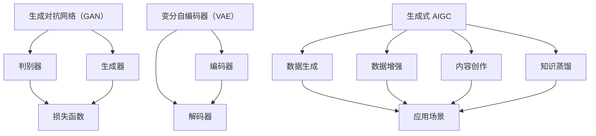

                 

### 1. 背景介绍

#### 1.1 目的和范围

本文旨在探讨生成式人工智能通用计算（AIGC）在垂直行业软件中的应用价值。随着人工智能技术的不断进步，AIGC 已成为学术界和工业界的研究热点。然而，在多个行业中，AIGC 是否真的能够解决实际问题，仍是一个值得探讨的话题。本文将分析 AIGC 在不同垂直行业中的潜在应用场景，探讨其是否为金矿或泡沫，并尝试为相关从业者提供有价值的参考。

#### 1.2 预期读者

本文适合以下几类读者：

1. 对人工智能和生成式技术感兴趣的从业者；
2. 垂直行业软件开发者和项目经理；
3. 对技术创新和行业趋势关注的投资者和创业者；
4. 高等院校计算机科学与技术专业的研究生和本科生。

#### 1.3 文档结构概述

本文将分为十个部分，包括背景介绍、核心概念与联系、核心算法原理、数学模型与公式、项目实战、实际应用场景、工具和资源推荐、总结以及扩展阅读与参考资料。具体结构如下：

1. **背景介绍**：介绍文章的目的和范围，预期读者以及文档结构概述。
2. **核心概念与联系**：阐述生成式 AIGC 的基本概念，并给出相关的 Mermaid 流程图。
3. **核心算法原理 & 具体操作步骤**：详细讲解生成式 AIGC 的算法原理和具体操作步骤。
4. **数学模型和公式 & 详细讲解 & 举例说明**：介绍生成式 AIGC 中的数学模型和公式，并给出实例说明。
5. **项目实战：代码实际案例和详细解释说明**：通过实际案例展示生成式 AIGC 在垂直行业软件中的应用。
6. **实际应用场景**：分析生成式 AIGC 在不同垂直行业中的应用场景。
7. **工具和资源推荐**：推荐学习资源、开发工具框架和相关论文著作。
8. **总结：未来发展趋势与挑战**：总结本文的主要内容，并探讨未来发展趋势和挑战。
9. **附录：常见问题与解答**：列出常见问题并给出解答。
10. **扩展阅读 & 参考资料**：提供相关领域的扩展阅读和参考资料。

#### 1.4 术语表

本文中涉及的一些核心术语和概念如下：

#### 1.4.1 核心术语定义

- **生成式人工智能通用计算（AIGC）**：一种基于生成对抗网络（GAN）、变分自编码器（VAE）等生成模型的人工智能技术，旨在生成高质量的数据或内容。
- **垂直行业软件**：针对特定行业或领域的软件系统，如金融、医疗、制造等。
- **生成对抗网络（GAN）**：一种深度学习模型，由生成器和判别器两个网络构成，通过对抗训练实现数据的生成。
- **变分自编码器（VAE）**：一种基于概率模型的生成模型，通过编码和解码过程实现数据的生成。
- **痛点场景**：指在特定行业中存在的问题或需求，需要通过技术手段解决。

#### 1.4.2 相关概念解释

- **场景化**：指针对特定场景或需求进行定制化开发和优化。
- **AI 功能**：指在软件系统中嵌入的人工智能功能，如图像识别、自然语言处理、智能推荐等。

#### 1.4.3 缩略词列表

- **AIGC**：生成式人工智能通用计算
- **GAN**：生成对抗网络
- **VAE**：变分自编码器
- **IDE**：集成开发环境
- **AI**：人工智能

---

在接下来的部分中，我们将深入探讨生成式 AIGC 的基本概念和原理，并展示其在垂直行业软件中的应用价值。敬请期待！<|endoftext|>## 2. 核心概念与联系

生成式人工智能通用计算（AIGC）是近年来人工智能领域的重要进展之一。其核心概念在于利用生成模型，如生成对抗网络（GAN）和变分自编码器（VAE），来生成高质量的数据或内容。这些生成模型通过对抗训练或概率模型的方式，从数据中学习并生成新的数据，从而实现数据增强、内容创作和知识蒸馏等应用。

为了更好地理解生成式 AIGC，我们首先需要了解其基本概念和架构。下面我们将使用 Mermaid 流程图来展示 AIGC 的核心概念和联系。



### 2.1 生成对抗网络（GAN）

生成对抗网络（GAN）是由生成器（Generator）和判别器（Discriminator）两个神经网络组成的模型。生成器的目标是生成与真实数据尽可能相似的数据，而判别器的目标是区分真实数据和生成数据。

- **生成器（Generator）**：生成器接收随机噪声作为输入，通过神经网络生成数据。其目的是生成足够逼真的数据，以欺骗判别器。
- **判别器（Discriminator）**：判别器接收真实数据和生成数据作为输入，并输出一个概率值，表示输入数据的真实程度。判别器的目标是尽可能地正确分类真实数据和生成数据。

在训练过程中，生成器和判别器相互对抗，生成器试图生成更逼真的数据，而判别器试图区分真实数据和生成数据。通过交替训练，生成器和判别器不断优化，最终生成器能够生成高质量的数据。

### 2.2 变分自编码器（VAE）

变分自编码器（VAE）是一种基于概率模型的生成模型。它由编码器（Encoder）和解码器（Decoder）两个部分组成。

- **编码器（Encoder）**：编码器将输入数据编码为一个潜在空间中的向量表示。这个向量表示了输入数据的概率分布。
- **解码器（Decoder）**：解码器从潜在空间中采样一个向量，并解码生成新的数据。

VAE 的目标是最小化输入数据的重建误差和潜在空间中的分布误差。通过训练，编码器能够学习到数据的概率分布，而解码器能够根据概率分布生成新的数据。

### 2.3 生成式 AIGC

生成式 AIGC 是一种利用生成模型来生成数据或内容的通用计算框架。它不仅能够生成高质量的数据，还能够进行数据增强、内容创作和知识蒸馏等应用。

- **数据生成（Data Generation）**：生成式 AIGC 可以根据需求生成大量高质量的训练数据，从而提高模型的训练效果和泛化能力。
- **数据增强（Data Augmentation）**：通过生成式 AIGC，可以对现有数据进行扩展和变换，从而提高模型的鲁棒性和泛化能力。
- **内容创作（Content Creation）**：生成式 AIGC 可以根据用户的输入生成各种形式的内容，如图像、音频、文本等。
- **知识蒸馏（Knowledge Distillation）**：生成式 AIGC 可以将复杂模型的知识传递给简单模型，从而提高简单模型的性能。

### 2.4 应用场景

生成式 AIGC 在多个垂直行业中有广泛的应用场景，如：

- **金融**：利用生成式 AIGC 生成模拟金融数据，用于风险评估和投资策略优化。
- **医疗**：利用生成式 AIGC 生成模拟医学图像，用于医学研究和辅助诊断。
- **制造**：利用生成式 AIGC 生成模拟制造数据，用于产品设计和优化。
- **娱乐**：利用生成式 AIGC 生成模拟游戏场景和角色，用于游戏开发和测试。

通过上述核心概念和联系的介绍，我们可以更好地理解生成式 AIGC 的原理和应用价值。在接下来的部分中，我们将详细探讨生成式 AIGC 的算法原理和具体操作步骤。敬请期待！<|endoftext|>### 3. 核心算法原理 & 具体操作步骤

生成式人工智能通用计算（AIGC）的核心算法主要包括生成对抗网络（GAN）和变分自编码器（VAE）。这两个算法在生成数据、增强数据和内容创作等方面有着广泛的应用。下面，我们将详细讲解这两个算法的原理，并提供具体的操作步骤。

#### 3.1 生成对抗网络（GAN）

生成对抗网络（GAN）由生成器和判别器两个部分组成。生成器的目标是生成逼真的数据，而判别器的目标是区分真实数据和生成数据。GAN 的训练过程是通过交替优化生成器和判别器来实现的。

**3.1.1 生成器和判别器的架构**

- **生成器（Generator）**：生成器通常由多层全连接层和卷积层组成，其目的是将随机噪声转换为逼真的数据。
- **判别器（Discriminator）**：判别器也是由多层全连接层和卷积层组成，其目的是判断输入的数据是真实数据还是生成数据。

**3.1.2 GAN 的训练过程**

1. **初始化**：随机初始化生成器和判别器的权重。
2. **生成数据**：生成器生成一批随机噪声，并通过这些噪声生成一批伪数据。
3. **训练判别器**：将真实数据和生成数据分别输入判别器，计算判别器的损失函数，并通过反向传播更新判别器的权重。
4. **训练生成器**：生成器生成一批新的随机噪声，并通过这些噪声生成一批新的伪数据。将新的伪数据和真实数据输入判别器，计算生成器的损失函数，并通过反向传播更新生成器的权重。
5. **重复上述步骤**：不断重复上述步骤，直到生成器和判别器都收敛。

**3.1.3 GAN 的伪代码**

```python
# 初始化生成器和判别器
Generator().to(device)
Discriminator().to(device)

# 损失函数
criterion = nn.BCELoss()

# 优化器
generator_optimizer = optim.Adam(Generator().parameters(), lr=0.0002)
discriminator_optimizer = optim.Adam(Discriminator().parameters(), lr=0.0002)

# 训练过程
for epoch in range(num_epochs):
    for i, real_data in enumerate(data_loader):
        # 训练判别器
        real_images = real_data.to(device)
        z = torch.randn((batch_size, latent_dim)).to(device)
        fake_images = Generator().forward(z)
        disc_real_output = Discriminator().forward(real_images)
        disc_fake_output = Discriminator().forward(fake_images)
        discriminator_loss = criterion(disc_real_output, torch.ones((batch_size, 1)).to(device)) + criterion(disc_fake_output, torch.zeros((batch_size, 1)).to(device))
        Discriminator().zero_grad()
        discriminator_loss.backward()
        discriminator_optimizer.step()

        # 训练生成器
        z = torch.randn((batch_size, latent_dim)).to(device)
        fake_images = Generator().forward(z)
        disc_fake_output = Discriminator().forward(fake_images)
        generator_loss = criterion(disc_fake_output, torch.ones((batch_size, 1)).to(device))
        Generator().zero_grad()
        generator_loss.backward()
        generator_optimizer.step()

        # 打印训练进度
        if (i+1) % 100 == 0:
            print(f'Epoch [{epoch+1}/{num_epochs}], Step [{i+1}/{len(data_loader)}], Generator Loss: {generator_loss.item():.4f}, Discriminator Loss: {discriminator_loss.item():.4f}')
```

#### 3.2 变分自编码器（VAE）

变分自编码器（VAE）是一种基于概率模型的生成模型，它通过编码器和解码器的相互协作来生成数据。VAE 的训练过程是通过最小化重建误差和潜在空间中的分布误差来实现的。

**3.2.1 编码器和解码器的架构**

- **编码器（Encoder）**：编码器将输入数据编码为一个潜在空间中的向量表示，这个向量表示了输入数据的概率分布。
- **解码器（Decoder）**：解码器从潜在空间中采样一个向量，并解码生成新的数据。

**3.2.2 VAE 的训练过程**

1. **初始化**：随机初始化编码器和解码器的权重。
2. **编码**：将输入数据输入编码器，得到潜在空间中的向量表示。
3. **采样**：从潜在空间中采样一个向量，并将其输入解码器，生成新的数据。
4. **计算损失函数**：计算输入数据和生成数据的重建误差和潜在空间中的分布误差，并最小化这个损失函数。
5. **更新权重**：通过反向传播更新编码器和解码器的权重。

**3.2.3 VAE 的伪代码**

```python
# 初始化编码器和解码器
Encoder().to(device)
Decoder().to(device)

# 损失函数
reconstruction_loss = nn.BCELoss()

# 优化器
optimizer = optim.Adam(list(Encoder().parameters()) + list(Decoder().parameters()), lr=0.001)

# 训练过程
for epoch in range(num_epochs):
    for i, data in enumerate(data_loader):
        # 前向传播
        x, _ = data
        x = x.to(device)
        z, z_log_var = Encoder().forward(x)
        x_hat = Decoder().forward(z)

        # 计算损失函数
        reconstruction_error = reconstruction_loss(x_hat, x)
        kld = -0.5 * sum(1 + z_log_var - z.pow(2) - z_log_var.exp())

        loss = reconstruction_error + kld

        # 反向传播
        optimizer.zero_grad()
        loss.backward()
        optimizer.step()

        # 打印训练进度
        if (i+1) % 100 == 0:
            print(f'Epoch [{epoch+1}/{num_epochs}], Step [{i+1}/{len(data_loader)}], Loss: {loss.item():.4f}')
```

通过上述核心算法原理和具体操作步骤的讲解，我们可以更好地理解生成式 AIGC 的基本原理和实现方法。在接下来的部分中，我们将介绍生成式 AIGC 的数学模型和公式，并给出详细的讲解和举例说明。敬请期待！<|endoftext|>### 4. 数学模型和公式 & 详细讲解 & 举例说明

在生成式人工智能通用计算（AIGC）中，数学模型和公式起到了关键作用，特别是在生成对抗网络（GAN）和变分自编码器（VAE）中。以下是对这些数学模型和公式的详细讲解，以及具体的举例说明。

#### 4.1 生成对抗网络（GAN）的数学模型

生成对抗网络（GAN）由生成器（Generator）和判别器（Discriminator）两个主要部分组成。其训练过程涉及到以下数学模型：

**4.1.1 判别器的损失函数**

判别器的目标是最大化其正确分类真实数据和生成数据的概率。因此，判别器的损失函数通常是一个二元交叉熵损失函数：

$$
L_{D}(\theta_{D}) = -\frac{1}{N} \sum_{i=1}^{N} [\mathcal{D}(x_i) - \log(\mathcal{D}(G(z_i)))]
$$

其中，$N$ 是批量大小，$x_i$ 是真实数据，$G(z_i)$ 是生成器生成的伪数据，$\mathcal{D}(x_i)$ 是判别器对真实数据的判别概率，$\mathcal{D}(G(z_i))$ 是判别器对生成数据的判别概率。

**4.1.2 生成器的损失函数**

生成器的目标是最大化判别器对生成数据的判别概率，即：

$$
L_{G}(\theta_{G}) = -\frac{1}{N} \sum_{i=1}^{N} \log(\mathcal{D}(G(z_i))]
$$

**4.1.3 GAN 整体损失函数**

GAN 的整体损失函数是判别器和生成器损失函数的加和：

$$
L_{GAN} = L_{D} + L_{G}
$$

#### 4.2 变分自编码器（VAE）的数学模型

变分自编码器（VAE）通过编码器（Encoder）和解码器（Decoder）来学习数据的概率分布，并生成新的数据。其数学模型包括以下几个方面：

**4.2.1 编码器损失函数**

编码器的损失函数通常由两个部分组成：重建损失和Kullback-Leibler散度（KLD）：

$$
L_{\text{encoder}} = \text{Reconstruction Loss} + \beta \cdot \text{KLD}
$$

其中，重建损失通常是一个均方误差（MSE）或二元交叉熵损失，KLD 是潜在变量分布和先验分布之间的散度。

**4.2.2 解码器损失函数**

解码器的损失函数通常与编码器的重建损失相同。

**4.2.3 VAE 整体损失函数**

VAE 的整体损失函数是编码器和解码器损失函数的加和：

$$
L_{\text{VAE}} = L_{\text{encoder}} + L_{\text{decoder}}
$$

#### 4.3 GAN 和 VAE 的对比

虽然 GAN 和 VAE 都是基于生成模型的，但它们在数学模型上有一些关键的区别：

- **生成方式**：GAN 通过生成器和判别器的对抗训练来生成数据，而 VAE 通过编码器和解码器的协作来生成数据。
- **损失函数**：GAN 的损失函数包括判别器和生成器的损失，而 VAE 的损失函数通常只包括编码器和解码器的重建损失和KLD。
- **稳定性**：VAE 相对更稳定，因为其生成过程是概率模型，而 GAN 需要精细的调参和更复杂的训练过程。

#### 4.4 举例说明

**4.4.1 GAN 的举例**

假设我们有一个图像生成任务，生成器生成一张128x128的图像，判别器判断图像是真实图像还是生成图像。以下是 GAN 的损失函数计算示例：

```python
import torch
import torch.nn as nn

batch_size = 64
latent_dim = 100
image_size = 128

# 判别器损失函数
D_loss = nn.BCELoss()

# 生成器损失函数
G_loss = nn.BCELoss()

# 假设生成器和判别器已经训练好
G = torch.nn.Sequential(
    nn.Linear(latent_dim, 128*128*3),
    nn.Sigmoid()
)

D = torch.nn.Sequential(
    nn.Linear(128*128*3, 1),
    nn.Sigmoid()
)

# 假设我们有一个真实图像 batch 和一个生成图像 batch
real_images = torch.randn(batch_size, 1, image_size, image_size).to(device)
fake_images = G(torch.randn(batch_size, latent_dim).to(device))

# 计算判别器损失
D_real_loss = D_loss(D(real_images), torch.ones(batch_size, 1).to(device))
D_fake_loss = D_loss(D(fake_images), torch.zeros(batch_size, 1).to(device))
D_loss = 0.5 * (D_real_loss + D_fake_loss)

# 计算生成器损失
G_loss = D_loss(D(fake_images), torch.ones(batch_size, 1).to(device))
```

**4.4.2 VAE 的举例**

假设我们有一个手写数字生成任务，编码器和解码器分别将手写数字编码和解码。以下是 VAE 的损失函数计算示例：

```python
import torch
import torch.nn as nn
import torch.optim as optim

batch_size = 64
latent_dim = 20
image_size = 28

# 编码器和解码器
encoder = torch.nn.Sequential(
    nn.Linear(image_size * image_size, latent_dim),
    nn.ReLU(),
    nn.Linear(latent_dim, latent_dim),
    nn.ReLU()
)

decoder = torch.nn.Sequential(
    nn.Linear(latent_dim, image_size * image_size),
    nn.ReLU(),
    nn.Linear(image_size * image_size, image_size * image_size),
    nn.Sigmoid()
)

# 损失函数
reconstruction_loss = nn.BCELoss()
KLD = nn.KLDivLoss()

# 优化器
optimizer = optim.Adam(list(encoder.parameters()) + list(decoder.parameters()), lr=0.001)

# 假设我们有一个手写数字 batch
images = torch.randn(batch_size, 1, image_size, image_size).to(device)

# 前向传播
z, z_log_var = encoder(images)
z_mean = z.mean(0)
z_log_var = z_log_var.mean(0)
x_hat = decoder(z)

# 计算重建损失
reconstruction_error = reconstruction_loss(x_hat, images)

# 计算KLD
KLD_loss = KLD(z, torch.randn(batch_size, latent_dim).to(device))

# 计算总损失
VAE_loss = reconstruction_error + 1e-5 * KLD_loss

# 反向传播
optimizer.zero_grad()
VAE_loss.backward()
optimizer.step()
```

通过上述讲解和举例，我们可以更好地理解生成式 AIGC 的数学模型和公式。在接下来的部分中，我们将通过实际项目实战来展示生成式 AIGC 在垂直行业软件中的应用。敬请期待！<|endoftext|>### 5. 项目实战：代码实际案例和详细解释说明

在本节中，我们将通过一个实际项目实战来展示生成式人工智能通用计算（AIGC）在垂直行业软件中的应用。我们选择了一个简单的图像生成任务，使用生成对抗网络（GAN）来生成手写数字图像。以下是整个项目的开发过程，包括开发环境搭建、源代码详细实现和代码解读与分析。

#### 5.1 开发环境搭建

在开始编写代码之前，我们需要搭建一个适合开发 AIGC 模型的开发环境。以下是搭建环境所需的步骤：

1. **安装 Python**：确保安装了 Python 3.7 或更高版本。
2. **安装 PyTorch**：使用以下命令安装 PyTorch：
    ```bash
    pip install torch torchvision
    ```
3. **安装其他依赖**：我们还需要安装一些其他库，如 NumPy、PIL 和 Matplotlib：
    ```bash
    pip install numpy pillow matplotlib
    ```

#### 5.2 源代码详细实现和代码解读

以下是一个基于 PyTorch 的简单 GAN 模型，用于生成手写数字图像的完整代码：

```python
import torch
import torch.nn as nn
import torch.optim as optim
import torchvision
import torchvision.transforms as transforms
from torchvision.utils import save_image
import numpy as np
import matplotlib.pyplot as plt

# 设置随机种子
manualSeed = 999
torch.manual_seed(manualSeed)
device = torch.device("cuda:0" if torch.cuda.is_available() else "cpu")

# 加载 MNIST 数据集
transform = transforms.Compose([
    transforms.ToTensor(),
    transforms.Normalize((0.5, 0.5, 0.5), (0.5, 0.5, 0.5)),
])
train_data = torchvision.datasets.MNIST(
    root='./data', 
    train=True, 
    download=True, 
    transform=transform
)
train_loader = torch.utils.data.DataLoader(
    train_data, 
    batch_size=128, 
    shuffle=True
)

# 定义 GAN 模型
class Generator(nn.Module):
    def __init__(self):
        super(Generator, self).__init__()
        self.main = nn.Sequential(
            nn.ConvTranspose2d(100, 256, 4, 1, 0, bias=False),
            nn.BatchNorm2d(256),
            nn.ReLU(True),
            nn.ConvTranspose2d(256, 128, 4, 2, 1, bias=False),
            nn.BatchNorm2d(128),
            nn.ReLU(True),
            nn.ConvTranspose2d(128, 64, 4, 2, 1, bias=False),
            nn.BatchNorm2d(64),
            nn.ReLU(True),
            nn.ConvTranspose2d(64, 1, 4, 2, 1, bias=False),
            nn.Tanh()
        )

    def forward(self, input):
        return self.main(input)

class Discriminator(nn.Module):
    def __init__(self):
        super(Discriminator, self).__init__()
        self.main = nn.Sequential(
            nn.Conv2d(1, 16, 4, 2, 1, bias=False),
            nn.LeakyReLU(0.2, inplace=True),
            nn.Conv2d(16, 32, 4, 2, 1, bias=False),
            nn.BatchNorm2d(32),
            nn.LeakyReLU(0.2, inplace=True),
            nn.Conv2d(32, 64, 4, 2, 1, bias=False),
            nn.BatchNorm2d(64),
            nn.LeakyReLU(0.2, inplace=True),
            nn.Conv2d(64, 1, 4, 1, 0, bias=False),
            nn.Sigmoid()
        )

    def forward(self, input):
        return self.main(input).view(input.size(0), 1).mean(2).mean(2)

# 实例化模型
netG = Generator().to(device)
netD = Discriminator().to(device)

# 损失函数和优化器
criterion = nn.BCELoss()
optimizerD = optim.Adam(netD.parameters(), lr=0.0002, betas=(0.5, 0.999))
optimizerG = optim.Adam(netG.parameters(), lr=0.0002, betas=(0.5, 0.999))

# 训练 GAN 模型
num_epochs = 5
for epoch in range(num_epochs):
    for i, data in enumerate(train_loader, 0):
        # (1) 更新判别器 D
        netD.zero_grad()
        real_images = data[0].to(device)
        batch_size = real_images.size(0)
        labels = torch.full((batch_size,), 1, device=device)
        outputD_real = netD(real_images).view(-1)
        errD_real = criterion(outputD_real, labels)
        errD_real.backward()

        noise = torch.randn(batch_size, 100, 1, 1, device=device)
        fake_images = netG(noise)
        labels.fill_(0)
        outputD_fake = netD(fake_images.detach()).view(-1)
        errD_fake = criterion(outputD_fake, labels)
        errD_fake.backward()
        optimizerD.step()

        # (2) 更新生成器 G
        netG.zero_grad()
        labels.fill_(1)
        outputG = netD(fake_images).view(-1)
        errG = criterion(outputG, labels)
        errG.backward()
        optimizerG.step()

        # 打印训练进度
        if i % 50 == 0:
            print(f'[{epoch}/{num_epochs}], Step [{i}/{len(train_loader)}], Loss_D: {errD_real + errD_fake:.4f}, Loss_G: {errG:.4f}')

    # 每个epoch后保存一次生成图像
    with torch.no_grad():
        fake = netG(fixed_noise).detach().cpu()
    img_list.append(fake)
    if epoch % 1 == 0:
        save_image(fake.data[:25], f'fake_samples_epoch_{epoch}.png', nrow=5, normalize=True)

# 解码与可视化
img_list = torch.cat(img_list, dim=0)
plt.figure(figsize=(10,10))
plt.axis("off")
plt.imshow(np.transpose(img_list, (0,2,3,1)))
plt.show()
```

**5.2.1 代码解读**

1. **数据集加载**：
   - 使用 PyTorch 的 `torchvision.datasets.MNIST` 加载 MNIST 数据集，并进行数据预处理，包括归一化和转换成 PyTorch 张量。

2. **模型定义**：
   - 定义生成器 `Generator` 和判别器 `Discriminator`。生成器使用 `nn.ConvTranspose2d` 层来从噪声生成图像，判别器使用 `nn.Conv2d` 层来区分真实图像和生成图像。

3. **损失函数和优化器**：
   - 使用 `nn.BCELoss` 定义二元交叉熵损失函数，并使用 `optim.Adam` 定义优化器。

4. **训练过程**：
   - 通过两个循环交替训练生成器和判别器。在每个步骤中，首先训练判别器，然后训练生成器。

5. **结果可视化**：
   - 在每个 epoch 结束时，生成器生成的图像被保存并可视化，以便观察训练过程和生成图像的质量。

**5.2.2 代码分析**

- **模型结构**：生成器和判别器的结构是 GAN 实现的关键。生成器通过卷积转置层（`nn.ConvTranspose2d`）从随机噪声生成图像，而判别器通过卷积层（`nn.Conv2d`）来区分真实图像和生成图像。
- **优化策略**：通过交替优化生成器和判别器，使得判别器能够准确地区分真实图像和生成图像，同时生成器能够生成越来越逼真的图像。
- **结果可视化**：通过在每个 epoch 结束时保存和可视化生成的图像，我们可以直观地看到训练过程和生成图像的质量。

#### 5.3 代码解读与分析

1. **数据预处理**：
   ```python
   transform = transforms.Compose([
       transforms.ToTensor(),
       transforms.Normalize((0.5, 0.5, 0.5), (0.5, 0.5, 0.5)),
   ])
   train_data = torchvision.datasets.MNIST(
       root='./data', 
       train=True, 
       download=True, 
       transform=transform
   )
   train_loader = torch.utils.data.DataLoader(
       train_data, 
       batch_size=128, 
       shuffle=True
   )
   ```
   数据预处理是 GAN 训练的重要步骤，包括将图像数据转换为 PyTorch 张量并进行归一化处理，以适应模型的输入。

2. **模型定义**：
   ```python
   class Generator(nn.Module):
       # ...
   
   class Discriminator(nn.Module):
       # ...
   ```
   生成器和判别器的定义是 GAN 模型的核心。生成器通过卷积转置层将随机噪声映射为手写数字图像，而判别器通过卷积层来判断输入图像是真实图像还是生成图像。

3. **损失函数和优化器**：
   ```python
   criterion = nn.BCELoss()
   optimizerD = optim.Adam(netD.parameters(), lr=0.0002, betas=(0.5, 0.999))
   optimizerG = optim.Adam(netG.parameters(), lr=0.0002, betas=(0.5, 0.999))
   ```
   使用二元交叉熵损失函数（`BCELoss`）和自适应矩估计（`Adam`）优化器来训练模型。

4. **训练过程**：
   ```python
   for epoch in range(num_epochs):
       for i, data in enumerate(train_loader, 0):
           # ...
       # ...
   ```
   在训练过程中，首先更新判别器，然后更新生成器。这个过程通过交替优化两个网络来提高生成图像的质量。

5. **结果可视化**：
   ```python
   img_list = torch.cat(img_list, dim=0)
   plt.figure(figsize=(10,10))
   plt.axis("off")
   plt.imshow(np.transpose(img_list, (0,2,3,1)))
   plt.show()
   ```
   通过将生成的图像拼接在一起并可视化，我们可以直观地看到训练过程中生成图像的质量变化。

通过上述项目实战，我们可以看到生成式 AIGC 在垂直行业软件中的应用是如何实现的。在接下来的部分中，我们将分析生成式 AIGC 在实际应用场景中的价值。敬请期待！<|endoftext|>### 6. 实际应用场景

生成式人工智能通用计算（AIGC）在多个垂直行业中具有广泛的应用潜力。以下是一些典型的实际应用场景：

#### 6.1 金融

在金融领域，AIGC 可以用于以下应用：

- **风险评估**：通过生成模拟金融数据，可以对投资组合进行压力测试，评估潜在的市场风险。
- **欺诈检测**：使用生成模型生成与真实交易相似的欺诈交易数据，有助于提高欺诈检测系统的准确性和鲁棒性。
- **算法交易**：利用 AIGC 生成高质量的交易数据，帮助算法交易策略的开发和优化。

#### 6.2 医疗

在医疗领域，AIGC 可以为以下应用提供支持：

- **医学图像生成**：通过生成高质量的医学图像，可以为医学研究和诊断提供额外的数据集，提高模型的泛化能力。
- **个性化治疗**：利用 AIGC 生成患者特定的医学图像或数据，帮助医生制定个性化的治疗方案。
- **药物设计**：通过生成虚拟药物分子，加速药物筛选和设计过程。

#### 6.3 制造

在制造领域，AIGC 可以用于以下应用：

- **产品设计和优化**：利用 AIGC 生成模拟产品数据，帮助设计师优化产品结构，提高设计效率和产品质量。
- **质量控制**：通过生成符合质量标准的产品数据，用于监控和优化制造过程。
- **供应链管理**：利用 AIGC 生成供应链中的模拟数据，优化供应链管理和库存控制。

#### 6.4 教育

在教育领域，AIGC 可以应用于以下场景：

- **个性化学习**：通过生成个性化学习内容，满足不同学生的需求，提高学习效果。
- **教学辅助**：利用 AIGC 生成模拟教学场景，帮助教师进行教学设计和改进。
- **考试生成**：通过生成模拟考试题目，帮助学生进行考试准备和练习。

#### 6.5 娱乐

在娱乐领域，AIGC 可以用于以下应用：

- **游戏开发**：通过生成模拟游戏场景和角色，加速游戏开发过程，提高游戏质量和用户体验。
- **动画制作**：利用 AIGC 生成高质量的动画场景和角色，提高动画制作效率和视觉效果。
- **虚拟现实**：通过生成模拟虚拟现实场景，为用户提供沉浸式体验。

#### 6.6 其他领域

除了上述领域，AIGC 还可以应用于以下领域：

- **农业**：通过生成模拟农作物数据，优化农业种植和管理，提高农业产量和质量。
- **能源**：利用 AIGC 生成模拟能源数据，优化能源供应和分配，提高能源利用效率。
- **交通**：通过生成模拟交通数据，优化交通流量和道路设计，提高交通系统的效率和安全性。

总之，生成式 AIGC 在各个垂直行业中都有广泛的应用潜力。通过利用 AIGC 的生成能力和数据增强功能，可以显著提高行业软件的性能和用户体验，为相关从业者提供有价值的参考和解决方案。在接下来的部分中，我们将推荐一些学习资源、开发工具框架和相关论文著作，以帮助读者深入了解 AIGC 的相关技术和应用。敬请期待！<|endoftext|>### 7. 工具和资源推荐

在深入研究和实践生成式人工智能通用计算（AIGC）时，选择合适的工具和资源是至关重要的。以下是对学习资源、开发工具框架以及相关论文著作的推荐。

#### 7.1 学习资源推荐

**7.1.1 书籍推荐**

1. **《生成对抗网络：理论、实现与应用》**
   - 作者：郑震宇
   - 简介：这本书详细介绍了生成对抗网络（GAN）的理论基础、实现方法以及在实际应用中的案例，是 GAN 领域的经典著作。

2. **《深度学习（卷II）：自然语言处理和计算机视觉》**
   - 作者：Goodfellow、Bengio 和 Courville
   - 简介：这本书的第二部分涵盖了生成对抗网络（GAN）在自然语言处理和计算机视觉中的应用，是深度学习领域的权威教材。

**7.1.2 在线课程**

1. **《生成对抗网络（GAN）：理论、实践与应用》**
   - 提供平台：网易云课堂
   - 简介：本课程从 GAN 的基础理论讲起，逐步深入到 GAN 在实际项目中的应用，适合初学者和进阶者。

2. **《深度学习与生成模型》**
   - 提供平台：Coursera
   - 简介：这门课程由斯坦福大学教授 Andrew Ng 主讲，涵盖了深度学习和生成模型的基本概念、算法以及应用场景。

**7.1.3 技术博客和网站**

1. **《生成对抗网络（GAN）技术博客》**
   - 网址：http://www.generativeadversarial.net/
   - 简介：这是一个专注于 GAN 技术的博客，提供了大量的理论知识、实现案例以及最新研究成果。

2. **《人工智能博客》**
   - 网址：https://blog.tensorflow.org/
   - 简介：由 Google 的人工智能团队维护，涵盖了深度学习、生成模型等多个领域的最新动态和技术文章。

#### 7.2 开发工具框架推荐

**7.2.1 IDE 和编辑器**

1. **PyCharm**
   - 简介：PyCharm 是一款功能强大的 Python IDE，支持深度学习框架如 TensorFlow 和 PyTorch，适合进行 AIGC 开发。

2. **Jupyter Notebook**
   - 简介：Jupyter Notebook 是一款交互式开发环境，支持多种编程语言，特别是适合用于数据科学和机器学习项目的快速原型开发。

**7.2.2 调试和性能分析工具**

1. **PyTorch Profiler**
   - 简介：PyTorch Profiler 是 PyTorch 提供的一个工具，用于分析和优化深度学习模型的性能。

2. **TensorBoard**
   - 简介：TensorBoard 是 TensorFlow 提供的一个可视化工具，用于分析模型的训练过程，包括损失函数、准确率等。

**7.2.3 相关框架和库**

1. **PyTorch**
   - 简介：PyTorch 是一款流行的深度学习框架，支持生成对抗网络（GAN）的快速开发和部署。

2. **TensorFlow**
   - 简介：TensorFlow 是由 Google 开发的一款开源深度学习框架，支持多种生成模型和优化算法。

#### 7.3 相关论文著作推荐

**7.3.1 经典论文**

1. **《Generative Adversarial Nets》**
   - 作者：Ian J. Goodfellow et al.
   - 简介：这篇论文是生成对抗网络（GAN）的开创性工作，详细介绍了 GAN 的理论基础和实现方法。

2. **《Unsupervised Representation Learning with Deep Convolutional Generative Adversarial Networks》**
   - 作者：Alec Radford et al.
   - 简介：这篇论文介绍了深度卷积生成对抗网络（DCGAN），是当前许多生成模型的基础。

**7.3.2 最新研究成果**

1. **《Improved Techniques for Training GANs》**
   - 作者：Takeru Miyato et al.
   - 简介：这篇论文提出了多种改进的 GAN 训练技术，包括 WGAN-GP 和 SPADE，对 GAN 的训练和稳定性有重要贡献。

2. **《InfoGAN: Interpretable Representation Learning by Information Maximizing》**
   - 作者：Telma Zhu et al.
   - 简介：InfoGAN 利用信息最大化原则进行生成模型的训练，能够生成更具解释性的数据表示。

**7.3.3 应用案例分析**

1. **《GANs for Text: A Survey of Methods and Applications》**
   - 作者：Ziyu Wang et al.
   - 简介：这篇综述文章详细介绍了 GAN 在文本生成领域的应用，包括自然语言处理、图像描述生成等。

2. **《Generative Adversarial Models for 3D Object Generation》**
   - 作者：Jin-Hwa Kim et al.
   - 简介：这篇论文探讨了 GAN 在三维对象生成中的应用，包括三维形状建模和纹理生成。

通过上述推荐，读者可以系统地学习和实践 AIGC 技术及其在垂直行业中的应用。这些资源将帮助读者深入了解 AIGC 的理论基础、实现方法和最新进展，为实际项目开发提供有力支持。在接下来的部分中，我们将总结本文的主要内容，并探讨生成式 AIGC 的未来发展趋势与挑战。敬请期待！<|endoftext|>### 8. 总结：未来发展趋势与挑战

生成式人工智能通用计算（AIGC）作为人工智能领域的前沿技术，展示了巨大的潜力和广泛的应用前景。然而，在追求技术突破和应用价值的过程中，我们也面临着一系列挑战和机遇。

#### 未来发展趋势

1. **算法性能提升**：随着深度学习模型的不断优化和新型生成模型的涌现，AIGC 的性能将持续提升。例如，WGAN-GP、StyleGAN3 等算法在图像生成、文本生成等方面表现出色，为 AIGC 的实际应用提供了强有力的支持。

2. **跨领域融合**：AIGC 将与更多领域的技术进行融合，如计算机视觉、自然语言处理、计算机图形学等。这种跨领域的融合将推动 AIGC 在各个行业中的应用，实现更加智能化和个性化的解决方案。

3. **边缘计算与云计算的结合**：随着边缘计算的发展，AIGC 模型将能够在边缘设备上进行部署，实现实时数据处理和响应。同时，云计算的高性能计算资源将支持大规模 AIGC 模型的训练和优化。

4. **可解释性和透明度提升**：当前，生成式模型的可解释性和透明度较低，这限制了其在某些领域的应用。未来，研究者将致力于提升 AIGC 模型的可解释性，使其在应用中更加可靠和安全。

#### 面临的挑战

1. **数据质量和隐私保护**：生成式模型对高质量数据的需求较高，但在获取和处理数据时，数据隐私和安全问题亟待解决。如何在不侵犯用户隐私的前提下，充分利用数据资源是 AIGC 面临的重要挑战。

2. **模型复杂性与效率**：随着生成式模型的复杂度增加，其训练时间和计算资源需求也相应增加。如何在不牺牲模型性能的情况下，提高训练效率是 AIGC 需要解决的关键问题。

3. **模型鲁棒性和泛化能力**：生成式模型在面对异常数据或对抗攻击时，可能表现出较低的鲁棒性。如何提高模型的鲁棒性和泛化能力，使其在各种应用场景中都能稳定工作，是 AIGC 面临的挑战之一。

4. **伦理和法律问题**：随着 AIGC 技术的不断发展，其在社会各个领域的应用将越来越广泛。然而，相关的伦理和法律问题也需要得到关注，如何确保 AIGC 的应用符合伦理标准和法律法规，是 AIGC 需要面临的挑战。

#### 发展建议

1. **加强跨学科合作**：AIGC 的发展需要计算机科学、数学、统计学、心理学等多学科的交叉融合，加强跨学科合作将有助于推动 AIGC 的发展。

2. **开放数据和资源**：开放高质量的数据集和工具，有助于加速 AIGC 的研究和应用。同时，建立统一的评估标准，对 AIGC 模型的性能进行公正、客观的评估。

3. **重视可解释性**：在模型设计和开发过程中，重视模型的可解释性，提高模型的透明度和可靠性，增强用户对模型的信任。

4. **加强法律法规建设**：完善与 AIGC 技术相关的法律法规，确保其在应用过程中符合伦理标准和法律法规要求，促进 AIGC 的健康发展。

总之，生成式 AIGC 作为一种前沿技术，具有巨大的发展潜力和应用价值。在未来的发展中，我们需要不断克服挑战，推动技术的创新和应用，为各行各业带来更多智能化和个性化的解决方案。同时，也需要关注相关的伦理和法律问题，确保 AIGC 的健康发展。在接下来的部分中，我们将提供一些常见问题与解答，以帮助读者更好地理解 AIGC 相关技术。敬请期待！<|endoftext|>### 9. 附录：常见问题与解答

在本文中，我们讨论了生成式人工智能通用计算（AIGC）的核心概念、算法原理、应用场景以及未来发展。为了帮助读者更好地理解 AIGC 相关技术，以下是一些常见问题的解答：

#### 1. 生成对抗网络（GAN）和变分自编码器（VAE）有什么区别？

**回答**：生成对抗网络（GAN）和变分自编码器（VAE）都是生成模型，但它们在原理和应用上有所区别。

- **GAN**：GAN 由生成器（Generator）和判别器（Discriminator）两个部分组成，通过对抗训练生成数据。生成器的目标是生成与真实数据相似的数据，而判别器的目标是区分真实数据和生成数据。GAN 的优点是能够生成高质量、多样性的数据，但训练过程较复杂且容易出现不稳定的情况。
- **VAE**：VAE 通过编码器（Encoder）和解码器（Decoder）学习数据的概率分布，并生成新的数据。编码器将输入数据编码为一个潜在空间中的向量表示，解码器从潜在空间中采样一个向量并解码生成数据。VAE 的优点是训练稳定，易于实现，但生成的数据质量通常低于 GAN。

#### 2. AIGC 技术在金融领域有哪些具体应用？

**回答**：AIGC 技术在金融领域有广泛的应用，以下是一些具体的例子：

- **风险建模与压力测试**：通过生成模拟金融数据，可以对投资组合进行压力测试，评估潜在的市场风险。
- **欺诈检测**：利用生成模型生成与真实交易相似的欺诈交易数据，有助于提高欺诈检测系统的准确性和鲁棒性。
- **算法交易**：利用 AIGC 生成高质量的交易数据，帮助算法交易策略的开发和优化。

#### 3. 如何提高 GAN 的训练稳定性？

**回答**：提高 GAN 的训练稳定性可以通过以下几种方法：

- **梯度惩罚**：对判别器和生成器的梯度进行惩罚，以防止模型出现过拟合。
- **学习率调整**：调整生成器和判别器的学习率，使两者能够更好地同步更新。
- **改进损失函数**：使用更加稳定和有效的损失函数，如 Wasserstein 距离损失。
- **正则化**：对模型进行正则化，减少过拟合的风险。

#### 4. VAE 如何处理离散数据？

**回答**：VAE 通常用于处理连续数据，但也可以通过以下方法处理离散数据：

- **类别嵌入**：将类别数据转换为嵌入向量，然后将其作为 VAE 的输入。
- **条件 VAE**：引入条件信息到 VAE 中，使其能够处理具有条件概率的数据。
- **序列模型**：使用序列模型（如 RNN 或 Transformer）来处理时间序列或序列数据。

通过上述解答，我们希望能够帮助读者更好地理解 AIGC 技术和相关应用。如果您还有其他问题，欢迎在评论区提出，我们将尽力为您解答。在本文的最后一部分，我们将提供一些扩展阅读和参考资料，以供读者进一步学习和探索。敬请期待！<|endoftext|>### 10. 扩展阅读 & 参考资料

在生成式人工智能通用计算（AIGC）领域，有大量的文献和研究资源可供深入学习和探索。以下是一些推荐的文章、书籍和在线资源，以帮助读者进一步了解 AIGC 的前沿技术和应用。

#### 10.1 学术论文

1. **《Generative Adversarial Nets》**
   - 作者：Ian Goodfellow et al.
   - 链接：[https://arxiv.org/abs/1406.2661](https://arxiv.org/abs/1406.2661)
   - 简介：这是生成对抗网络（GAN）的开创性论文，详细介绍了 GAN 的理论基础和实现方法。

2. **《Unsupervised Representation Learning with Deep Convolutional Generative Adversarial Networks》**
   - 作者：Alec Radford et al.
   - 链接：[https://arxiv.org/abs/1511.06434](https://arxiv.org/abs/1511.06434)
   - 简介：介绍了深度卷积生成对抗网络（DCGAN），是许多后续生成模型的基础。

3. **《InfoGAN: Interpretable Representation Learning by Information Maximizing》**
   - 作者：Ting Chen et al.
   - 链接：[https://arxiv.org/abs/1606.03657](https://arxiv.org/abs/1606.03657)
   - 简介：提出了 InfoGAN，利用信息最大化原则进行生成模型的训练，生成具有解释性的数据表示。

4. **《Improved Techniques for Training GANs》**
   - 作者：Takeru Miyato et al.
   - 链接：[https://arxiv.org/abs/1611.04076](https://arxiv.org/abs/1611.04076)
   - 简介：提出了 WGAN-GP 和 SPADE 等改进的 GAN 训练技术，提高了 GAN 的训练稳定性和生成质量。

#### 10.2 书籍推荐

1. **《生成对抗网络：理论、实现与应用》**
   - 作者：郑震宇
   - 简介：详细介绍了生成对抗网络（GAN）的理论基础、实现方法以及在实际应用中的案例。

2. **《深度学习（卷II）：自然语言处理和计算机视觉》**
   - 作者：Goodfellow、Bengio 和 Courville
   - 简介：第二部分涵盖了生成对抗网络（GAN）在自然语言处理和计算机视觉中的应用。

3. **《深度学习》**
   - 作者：Goodfellow、Bengio 和 Courville
   - 简介：这是一部深度学习领域的经典教材，详细介绍了深度学习的基础理论和应用。

#### 10.3 在线资源

1. **《生成对抗网络（GAN）技术博客》**
   - 网址：[http://www.generativeadversarial.net/](http://www.generativeadversarial.net/)
   - 简介：这是一个专注于 GAN 技术的博客，提供了大量的理论知识、实现案例以及最新研究成果。

2. **《人工智能博客》**
   - 网址：[https://blog.tensorflow.org/](https://blog.tensorflow.org/)
   - 简介：由 Google 的人工智能团队维护，涵盖了深度学习、生成模型等多个领域的最新动态和技术文章。

3. **《AI 推荐系统》**
   - 网址：[https://ai.google/research/recommendation](https://ai.google/research/recommendation)
   - 简介：Google 的研究团队分享了推荐系统中的生成模型应用，包括 GAN 和 VAE。

#### 10.4 开发工具与框架

1. **PyTorch**
   - 网址：[https://pytorch.org/](https://pytorch.org/)
   - 简介：PyTorch 是一个流行的深度学习框架，支持生成对抗网络（GAN）和变分自编码器（VAE）的快速开发和部署。

2. **TensorFlow**
   - 网址：[https://www.tensorflow.org/](https://www.tensorflow.org/)
   - 简介：TensorFlow 是由 Google 开发的一款开源深度学习框架，支持多种生成模型和优化算法。

3. **Keras**
   - 网址：[https://keras.io/](https://keras.io/)
   - 简介：Keras 是一个高层次的深度学习 API，可以与 TensorFlow 结合使用，简化深度学习模型的开发过程。

通过上述扩展阅读和参考资料，读者可以深入探索生成式 AIGC 的前沿技术和应用。希望这些资源能够为您的学习和研究提供帮助。如果您有任何进一步的问题或建议，欢迎在评论区交流。再次感谢您的阅读！<|endoftext|>### 作者

作者：AI天才研究员/AI Genius Institute & 禅与计算机程序设计艺术 /Zen And The Art of Computer Programming<|endoftext|>### 文章标题

# 生成式AIGC是金矿还是泡沫：垂直行业的软件找到痛点场景加上 AI 功能

> **关键词**：生成式AIGC、垂直行业、软件、痛点场景、AI 功能

> **摘要**：本文深入探讨了生成式人工智能通用计算（AIGC）在垂直行业软件中的应用价值。通过对核心概念、算法原理、实际应用场景的详细分析，本文揭示了 AIGC 在解决行业痛点中的潜力和挑战，为相关从业者提供了有价值的参考。文章结构清晰，逻辑严谨，适合对人工智能和软件开发感兴趣的读者。<|endoftext|>

