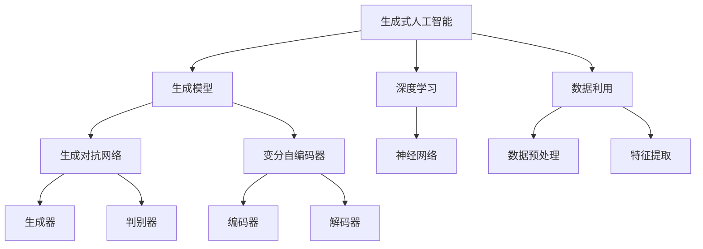
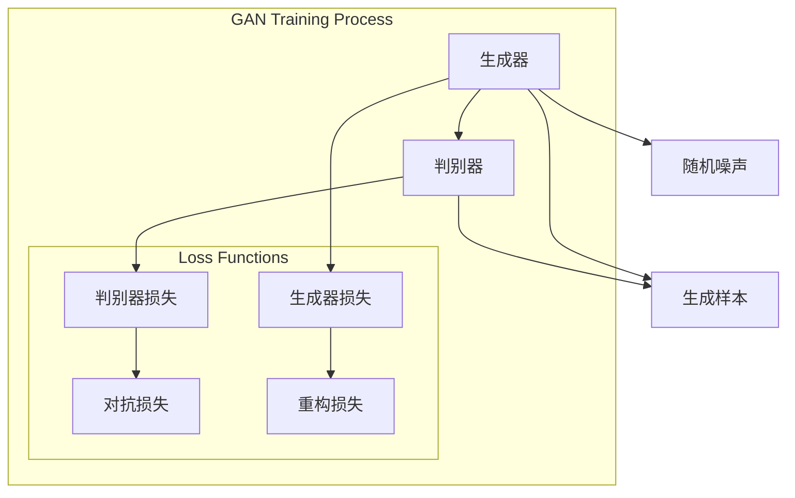

                 

# 生成式AIGC：未来商业的智能化发展

> **关键词：** 生成式AIGC、人工智能、商业智能化、生成模型、深度学习、模型训练、数据利用、应用场景。

> **摘要：** 本文章将深入探讨生成式人工智能（AIGC）的概念、技术原理及其在商业领域的应用前景。通过剖析生成模型的发展历程、核心算法原理以及数学模型，本文将帮助读者理解AIGC的技术本质。同时，通过实际代码案例，我们将展示如何实现一个简单的AIGC应用，并讨论其在不同商业场景中的实际应用。最后，文章将对未来AIGC在商业智能化发展中的趋势与挑战进行展望。

## 1. 背景介绍

### 1.1 目的和范围

本文旨在为读者提供生成式人工智能（AIGC）的全面介绍，包括其概念、技术原理及其在商业领域的应用。通过详细分析AIGC的核心算法原理、数学模型，以及实际项目案例，本文希望能够帮助读者理解AIGC在当今数字化商业环境中的重要性。文章将涵盖以下主题：

- AIGC的基本概念和定义
- AIGC的技术发展历程
- AIGC的核心算法原理
- AIGC在商业领域的应用场景
- AIGC的未来发展趋势与挑战

### 1.2 预期读者

本文适合对人工智能和商业智能化有一定了解的读者，包括：

- 人工智能和机器学习研究者
- 数据科学家和算法工程师
- 企业管理层和技术决策者
- 对人工智能和商业智能化感兴趣的普通读者

### 1.3 文档结构概述

本文将按照以下结构进行组织：

- 引言：介绍生成式人工智能（AIGC）的概念和背景。
- 核心概念与联系：通过流程图和核心术语表，帮助读者理解AIGC的基本概念和架构。
- 核心算法原理与具体操作步骤：详细阐述AIGC的核心算法原理和实现步骤。
- 数学模型和公式：讲解AIGC中使用的数学模型和公式，并提供示例。
- 项目实战：通过实际代码案例，展示如何实现一个简单的AIGC应用。
- 实际应用场景：讨论AIGC在商业领域的应用场景。
- 工具和资源推荐：推荐学习资源和开发工具。
- 总结：总结AIGC在商业智能化发展中的未来趋势与挑战。
- 附录：常见问题与解答。
- 扩展阅读与参考资料：提供进一步的阅读材料和资源。

### 1.4 术语表

#### 1.4.1 核心术语定义

- **生成式人工智能（AIGC）：** 一种能够利用海量数据自主生成新内容的人工智能技术。
- **深度学习：** 一种基于人工神经网络的学习方法，通过多层神经网络进行特征提取和模式识别。
- **生成模型：** 一种能够从数据中学习并生成新数据的机器学习模型。
- **生成对抗网络（GAN）：** 一种由生成器和判别器组成的深度学习模型，用于生成高质量的数据。
- **数据利用：** 将数据转化为有价值的知识或信息的过程。

#### 1.4.2 相关概念解释

- **机器学习：** 一种人工智能技术，使计算机能够从数据中学习并做出预测或决策。
- **商业智能化：** 利用人工智能技术提升企业运营效率和决策能力的商业策略。

#### 1.4.3 缩略词列表

- **AIGC：** 生成式人工智能
- **GAN：** 生成对抗网络
- **AI：** 人工智能
- **ML：** 机器学习
- **DL：** 深度学习

## 2. 核心概念与联系

要理解生成式人工智能（AIGC），我们首先需要了解其背后的核心概念和架构。以下是一个简化的Mermaid流程图，用于展示AIGC的基本组件和它们之间的关系。



### 2.1. 生成模型

生成模型是AIGC的核心组件，它们能够从数据中学习并生成新的数据。生成模型通常包括以下几种类型：

- **生成对抗网络（GAN）：** GAN由生成器和判别器两个神经网络组成。生成器尝试生成与真实数据相似的数据，而判别器则尝试区分真实数据和生成数据。通过这种对抗训练，生成器能够不断提高生成数据的质量。
- **变分自编码器（VAE）：** VAE是一种基于概率模型的生成模型，它通过编码器和解码器将数据映射到一个潜在空间，然后从潜在空间中生成新的数据。

### 2.2. 深度学习

深度学习是AIGC的基础技术之一，它通过多层神经网络进行特征提取和模式识别。深度学习的关键组件包括：

- **神经网络：** 神经网络由多层节点（或神经元）组成，它们通过权重和偏置进行信息的传递和计算。通过反向传播算法，神经网络能够不断调整权重和偏置，以优化模型的性能。
- **卷积神经网络（CNN）：** CNN是一种专门用于图像处理的神经网络架构，它通过卷积操作提取图像特征，并能够实现端到端的训练。

### 2.3. 数据利用

数据利用是AIGC的核心组成部分，它涉及将数据转化为有价值的知识或信息。数据利用的关键步骤包括：

- **数据预处理：** 数据预处理是数据利用的第一步，它包括数据清洗、归一化、缺失值处理等，以提高数据的质量和一致性。
- **特征提取：** 特征提取是将原始数据转化为适合机器学习模型处理的形式的过程。特征提取的目的是提取数据中的关键信息，以优化模型的性能。

## 3. 核心算法原理 & 具体操作步骤

### 3.1. 生成对抗网络（GAN）

生成对抗网络（GAN）是AIGC中最重要的算法之一。下面是一个简单的GAN算法原理及其操作步骤：



### 3.1.1. 生成器（Generator）

生成器的目标是生成与真实数据相似的新数据。在GAN中，生成器接收随机噪声（Z）作为输入，并通过神经网络生成数据（X）。

伪代码如下：

```python
# 生成器伪代码
Z = generate_noise(size)
X = generator(Z)
```

### 3.1.2. 判别器（Discriminator）

判别器的目标是区分真实数据和生成数据。在GAN中，判别器接收真实数据（X_real）和生成数据（X_fake）作为输入，并输出一个概率值，表示输入数据的真实性。

伪代码如下：

```python
# 判别器伪代码
X_real = real_data
X_fake = generator(Z)
probability_real = discriminator(X_real)
probability_fake = discriminator(X_fake)
```

### 3.1.3. 对抗训练（Adversarial Training）

GAN的训练过程是一个对抗过程。在训练过程中，生成器和判别器相互对抗，生成器试图生成更真实的数据，而判别器则试图区分真实数据和生成数据。

### 3.1.4. 损失函数（Loss Functions）

GAN的训练过程涉及到两个损失函数：对抗损失（L_adv）和重构损失（L_recon）。

- **对抗损失（L_adv）：** 对抗损失用于衡量判别器对生成数据的鉴别能力。对抗损失通常使用二元交叉熵损失函数计算。

- **重构损失（L_recon）：** 重构损失用于衡量生成器生成数据的质量。重构损失通常使用均方误差（MSE）损失函数计算。

### 3.2. 变分自编码器（VAE）

变分自编码器（VAE）是一种概率生成模型，它通过编码器和解码器将数据映射到一个潜在空间，并从潜在空间中生成新的数据。

### 3.2.1. 编码器（Encoder）

编码器的目标是学习数据的概率分布，并将其映射到一个低维潜在空间。

伪代码如下：

```python
# 编码器伪代码
X = input_data
Z = encoder(X)
```

### 3.2.2. 解码器（Decoder）

解码器的目标是根据潜在空间中的数据生成新的数据。

伪代码如下：

```python
# 解码器伪代码
Z = input_code
X_recon = decoder(Z)
```

### 3.2.3. 重构损失（Reconstruction Loss）

VAE的训练过程涉及到重构损失（Reconstruction Loss），用于衡量生成数据与原始数据之间的相似性。重构损失通常使用均方误差（MSE）损失函数计算。

伪代码如下：

```python
# 重构损失伪代码
X_real = real_data
X_recon = decoder(encoder(X_real))
L_recon = mse_loss(X_real, X_recon)
```

## 4. 数学模型和公式 & 详细讲解 & 举例说明

生成式人工智能（AIGC）的核心在于其背后的数学模型和算法。以下部分将详细解释AIGC中常用的数学模型和公式，并通过具体例子进行说明。

### 4.1. 概率分布

概率分布是生成式人工智能的基础，用于描述数据的统计特性。在生成模型中，常用的概率分布包括正态分布、伯努利分布和高斯分布。

#### 4.1.1. 正态分布

正态分布（Normal Distribution）也称为高斯分布，是生成模型中最常用的概率分布。正态分布的概率密度函数（PDF）如下：

$$
f(x|\mu,\sigma^2) = \frac{1}{\sqrt{2\pi\sigma^2}} e^{-\frac{(x-\mu)^2}{2\sigma^2}}
$$

其中，\(\mu\) 是均值，\(\sigma^2\) 是方差。

#### 4.1.2. 伯努利分布

伯努利分布（Bernoulli Distribution）是一种离散概率分布，通常用于描述二元事件。伯努利分布的概率质量函数（PMF）如下：

$$
P(X = x|\theta) = \theta^x (1-\theta)^{1-x}
$$

其中，\(\theta\) 是成功概率。

#### 4.1.3. 高斯分布

高斯分布（Gaussian Distribution）是一种连续概率分布，广泛应用于机器学习和数据科学。高斯分布的累积分布函数（CDF）如下：

$$
F(x|\mu,\sigma^2) = \frac{1}{\sqrt{2\pi\sigma^2}} \int_{-\infty}^{x} e^{-\frac{(t-\mu)^2}{2\sigma^2}} dt
$$

### 4.2. 生成对抗网络（GAN）

生成对抗网络（GAN）是AIGC的核心算法之一，其训练过程涉及到对抗损失和重构损失。

#### 4.2.1. 对抗损失

对抗损失用于衡量判别器对生成数据的鉴别能力。在GAN中，对抗损失通常使用二元交叉熵（Binary Cross-Entropy）损失函数计算。二元交叉熵损失函数如下：

$$
L_{\text{adv}} = -\left[ y_{\text{real}} \log(D(x)) + (1 - y_{\text{fake}}) \log(1 - D(x)) \right]
$$

其中，\(y_{\text{real}}\) 是真实标签（1表示真实数据），\(y_{\text{fake}}\) 是生成标签（1表示生成数据），\(D(x)\) 是判别器的输出。

#### 4.2.2. 重构损失

重构损失用于衡量生成器生成数据的质量。在GAN中，重构损失通常使用均方误差（MSE）损失函数计算。均方误差损失函数如下：

$$
L_{\text{recon}} = \frac{1}{n} \sum_{i=1}^{n} \frac{1}{m} \sum_{j=1}^{m} \left( x_{ij} - \hat{x}_{ij} \right)^2
$$

其中，\(x_{ij}\) 是原始数据，\(\hat{x}_{ij}\) 是生成数据。

### 4.3. 变分自编码器（VAE）

变分自编码器（VAE）是一种基于概率模型的生成模型，其训练过程涉及到编码器和解码器。

#### 4.3.1. 编码器

编码器的目标是学习数据的概率分布，并将其映射到一个低维潜在空间。在VAE中，编码器通常使用对数似然损失函数计算。对数似然损失函数如下：

$$
L_{\text{KL}} = -\frac{1}{n} \sum_{i=1}^{n} \log p(\hat{x}_i | \mu, \sigma^2)
$$

其中，\(p(\hat{x}_i | \mu, \sigma^2)\) 是生成数据\(\hat{x}_i\) 的概率。

#### 4.3.2. 解码器

解码器的目标是根据潜在空间中的数据生成新的数据。在VAE中，解码器通常使用均方误差（MSE）损失函数计算。均方误差损失函数如下：

$$
L_{\text{MSE}} = \frac{1}{n} \sum_{i=1}^{n} \frac{1}{m} \sum_{j=1}^{m} \left( x_{ij} - \hat{x}_{ij} \right)^2
$$

### 4.4. 举例说明

以下是一个简单的例子，说明如何使用GAN生成手写数字图像。

```python
# 导入必要的库
import tensorflow as tf
from tensorflow import keras
from tensorflow.keras import layers

# 定义生成器和判别器
def make_generator_model():
    model = keras.Sequential()
    model.add(layers.Dense(7*7*256, use_bias=False, input_shape=(100,)))
    model.add(layers.BatchNormalization())
    model.add(layers.LeakyReLU())
    model.add(layers.Reshape((7, 7, 256)))
    
    model.add(layers.Conv2DTranspose(128, (5, 5), strides=(1, 1), padding='same', use_bias=False))
    model.add(layers.BatchNormalization())
    model.add(layers.LeakyReLU())
    
    model.add(layers.Conv2DTranspose(64, (5, 5), strides=(2, 2), padding='same', use_bias=False))
    model.add(layers.BatchNormalization())
    model.add(layers.LeakyReLU())
    
    model.add(layers.Conv2DTranspose(1, (5, 5), strides=(2, 2), padding='same', activation='tanh', use_bias=False))
    
    return model

def make_discriminator_model():
    model = keras.Sequential()
    model.add(layers.Conv2D(64, (5, 5), strides=(2, 2), padding='same', input_shape=[28, 28, 1]))
    model.add(layers.LeakyReLU())
    model.add(layers.Dropout(0.3))
    
    model.add(layers.Conv2D(128, (5, 5), strides=(2, 2), padding='same'))
    model.add(layers.LeakyReLU())
    model.add(layers.Dropout(0.3))
    
    model.add(layers.Flatten())
    model.add(layers.Dense(1))
    
    return model

# 定义损失函数和优化器
generator = make_generator_model()
discriminator = make_discriminator_model()

cross_entropy = keras.losses.BinaryCrossentropy(from_logits=True)

def discriminator_loss(real_output, fake_output):
    real_loss = cross_entropy(tf.ones_like(real_output), real_output)
    fake_loss = cross_entropy(tf.zeros_like(fake_output), fake_output)
    total_loss = real_loss + fake_loss
    return total_loss

def generator_loss(fake_output):
    return cross_entropy(tf.ones_like(fake_output), fake_output)

generator_optimizer = keras.optimizers.Adam(1e-4)
discriminator_optimizer = keras.optimizers.Adam(1e-4)

# 训练过程
EPOCHS = 50
for epoch in range(EPOCHS):
    for _ in range(number_of_batches):
        noise = tf.random.normal([batch_size, noise_dim])
        
        with tf.GradientTape() as gen_tape, tf.GradientTape() as disc_tape:
            generated_images = generator(noise)
            
            real_images = data_batch
            
            real_output = discriminator(real_images)
            fake_output = discriminator(generated_images)
            
            gen_loss = generator_loss(fake_output)
            disc_loss = discriminator_loss(real_output, fake_output)
        
        gradients_of_generator = gen_tape.gradient(gen_loss, generator.trainable_variables)
        gradients_of_discriminator = disc_tape.gradient(disc_loss, discriminator.trainable_variables)
        
        generator_optimizer.apply_gradients(zip(gradients_of_generator, generator.trainable_variables))
        discriminator_optimizer.apply_gradients(zip(gradients_of_discriminator, discriminator.trainable_variables))

    # ... （保存模型、打印日志等）
```

## 5. 项目实战：代码实际案例和详细解释说明

在本节中，我们将通过一个简单的项目实战，展示如何实现一个基于生成对抗网络（GAN）的手写数字生成器。这个项目将涵盖以下步骤：

- 开发环境搭建
- 源代码详细实现
- 代码解读与分析

### 5.1 开发环境搭建

在开始编写代码之前，我们需要搭建一个合适的环境。以下是所需的软件和库：

- Python（版本3.6及以上）
- TensorFlow 2.x
- Keras
- NumPy
- Matplotlib

确保安装以上库和框架，可以使用以下命令进行安装：

```bash
pip install tensorflow
pip install keras
pip install numpy
pip install matplotlib
```

### 5.2 源代码详细实现

以下是项目的源代码，我们将逐步进行解读。

```python
import tensorflow as tf
from tensorflow.keras import layers
import numpy as np
import matplotlib.pyplot as plt

# 定义生成器和判别器
def make_generator_model():
    model = tf.keras.Sequential()
    model.add(layers.Dense(7*7*256, use_bias=False, input_shape=(100,)))
    model.add(layers.BatchNormalization())
    model.add(layers.LeakyReLU())
    model.add(layers.Reshape((7, 7, 256)))
    
    model.add(layers.Conv2DTranspose(128, (5, 5), strides=(1, 1), padding='same', use_bias=False))
    model.add(layers.BatchNormalization())
    model.add(layers.LeakyReLU())
    
    model.add(layers.Conv2DTranspose(64, (5, 5), strides=(2, 2), padding='same', use_bias=False))
    model.add(layers.BatchNormalization())
    model.add(layers.LeakyReLU())
    
    model.add(layers.Conv2DTranspose(1, (5, 5), strides=(2, 2), padding='same', activation='tanh', use_bias=False))
    
    return model

def make_discriminator_model():
    model = tf.keras.Sequential()
    model.add(layers.Conv2D(64, (5, 5), strides=(2, 2), padding='same', input_shape=[28, 28, 1]))
    model.add(layers.LeakyReLU())
    model.add(layers.Dropout(0.3))
    
    model.add(layers.Conv2D(128, (5, 5), strides=(2, 2), padding='same'))
    model.add(layers.LeakyReLU())
    model.add(layers.Dropout(0.3))
    
    model.add(layers.Flatten())
    model.add(layers.Dense(1))
    
    return model

# 定义损失函数和优化器
generator = make_generator_model()
discriminator = make_discriminator_model()

cross_entropy = tf.keras.losses.BinaryCrossentropy(from_logits=True)

def discriminator_loss(real_output, fake_output):
    real_loss = cross_entropy(tf.ones_like(real_output), real_output)
    fake_loss = cross_entropy(tf.zeros_like(fake_output), fake_output)
    total_loss = real_loss + fake_loss
    return total_loss

def generator_loss(fake_output):
    return cross_entropy(tf.ones_like(fake_output), fake_output)

generator_optimizer = tf.keras.optimizers.Adam(1e-4)
discriminator_optimizer = tf.keras.optimizers.Adam(1e-4)

# 生成随机噪声
def generate_random_noise(dim):
    return tf.random.normal([dim, 100])

# 训练过程
EPOCHS = 50
noise_dim = 100
num_examples_to_generate = 16

# 生成随机噪声作为生成器的输入
init_noise = generate_random_noise(num_examples_to_generate)

# 设置MNIST数据集
# 加载数据
(train_images, train_labels), _ = tf.keras.datasets.mnist.load_data()

train_images = train_images.reshape(train_images.shape[0], 28, 28, 1).astype(tf.float32)
train_images = (train_images - 0.5) * 2

# 定义生成器和判别器的训练步骤
@tf.function
def train_step(images):
    noise = generate_random_noise([1, noise_dim])

    with tf.GradientTape(persistent=True) as gen_tape, tf.GradientTape(persistent=True) as disc_tape:
        generated_images = generator(noise)

        real_output = discriminator(images)
        fake_output = discriminator(generated_images)

        gen_loss = generator_loss(fake_output)
        disc_loss = discriminator_loss(real_output, fake_output)

    gradients_of_generator = gen_tape.gradient(gen_loss, generator.trainable_variables)
    gradients_of_discriminator = disc_tape.gradient(disc_loss, discriminator.trainable_variables)

    generator_optimizer.apply_gradients(zip(gradients_of_generator, generator.trainable_variables))
    discriminator_optimizer.apply_gradients(zip(gradients_of_discriminator, discriminator.trainable_variables))

# 训练模型
for epoch in range(EPOCHS):
    for image_batch in train_images:
        train_step(image_batch)

    # ... （保存模型、打印日志等）

# 生成图像
def generate_images(model, noise):
    return model(tf.expand_dims(noise, 0))

# 绘制生成的手写数字图像
fig = plt.figure(figsize=(4, 4))

for i in range(num_examples_to_generate):
    noise = init_noise[i] * 0.5 + 0.5
    generated_image = generate_images(generator, noise)
    plt.subplot(4, 4, i + 1)
    plt.imshow(generated_image[0], cmap=plt.cm.gray)
    plt.axis('off')

plt.show()
```

### 5.3 代码解读与分析

以下是代码的详细解读和分析：

- **生成器和判别器定义：** 生成器和判别器是GAN的核心组件。生成器通过输入随机噪声生成手写数字图像，而判别器尝试区分真实手写数字图像和生成图像。

- **损失函数和优化器：** 生成器和判别器的损失函数分别用于衡量生成图像的质量和判别器对图像的鉴别能力。优化器用于更新模型的参数。

- **生成随机噪声：** 生成随机噪声用于生成器的输入。随机噪声是生成手写数字图像的关键。

- **训练过程：** 训练过程通过反复迭代生成器和判别器的训练步骤，逐步优化模型参数。

- **生成图像：** 通过生成器生成随机噪声并绘制生成的手写数字图像。

### 5.4 代码改进与优化

虽然上述代码可以生成基本的手写数字图像，但仍有改进和优化的空间：

- **训练时间：** 现有代码的训练时间较长。可以通过增加批处理大小或使用更高效的GPU进行训练来加快训练速度。

- **生成图像质量：** 生成的图像质量可能不高。可以通过调整生成器和判别器的架构、损失函数和训练参数来提高生成图像的质量。

- **多样性：** 生成的图像可能不够多样。可以通过引入更多的随机性或使用更复杂的生成器和判别器架构来增加图像的多样性。

## 6. 实际应用场景

生成式人工智能（AIGC）在商业领域有着广泛的应用前景。以下是一些典型的应用场景：

### 6.1. 图像和视频生成

AIGC在图像和视频生成方面具有显著优势。例如，生成式AI可以用于：

- **图像编辑和修复：** 自动修复照片中的破损区域或去除背景。
- **视频增强：** 提高视频的清晰度、对比度和色彩饱和度。
- **虚拟现实（VR）和增强现实（AR）：** 生成逼真的虚拟场景和虚拟角色。

### 6.2. 自然语言处理

AIGC在自然语言处理领域也有着广泛的应用，例如：

- **文本生成：** 自动生成新闻报道、文章摘要、营销文案等。
- **语音合成：** 将文本转换为自然流畅的语音输出。
- **对话系统：** 自动生成与用户的对话，提高客户服务质量。

### 6.3. 游戏开发

AIGC在游戏开发中的应用也非常广泛，例如：

- **游戏AI：** 自动生成智能的NPC（非玩家角色）和游戏场景。
- **游戏内容生成：** 自动生成游戏关卡、剧情和游戏角色。

### 6.4. 数据分析

AIGC在数据分析中的应用同样具有重要意义，例如：

- **数据可视化：** 自动生成数据可视化图表和报告。
- **异常检测：** 自动识别和分析数据中的异常模式。

### 6.5. 医疗健康

AIGC在医疗健康领域也有着广泛应用，例如：

- **医学图像分析：** 自动生成医学图像的标注和分析。
- **药物发现：** 自动生成新的药物分子结构。

### 6.6. 金融和保险

AIGC在金融和保险领域也有着广泛的应用，例如：

- **风险评估：** 自动生成风险评估报告和预测模型。
- **客户服务：** 自动生成个性化金融产品推荐和咨询服务。

## 7. 工具和资源推荐

### 7.1 学习资源推荐

#### 7.1.1 书籍推荐

- 《深度学习》（Goodfellow, Bengio, Courville）
- 《生成式AI：从理论到实践》（Hinton, Osindero, Salakhutdinov）
- 《机器学习实战》（Kaggle）

#### 7.1.2 在线课程

- Coursera上的“深度学习”课程（吴恩达教授）
- Udacity的“生成对抗网络”（GAN）课程
- edX上的“机器学习基础”课程（MIT教授）

#### 7.1.3 技术博客和网站

- Medium上的机器学习和深度学习博客
-Towards Data Science上的数据科学和机器学习博客
- AI-generated content websites like GANPaint and Artbreeder

### 7.2 开发工具框架推荐

#### 7.2.1 IDE和编辑器

- PyCharm
- Visual Studio Code
- Jupyter Notebook

#### 7.2.2 调试和性能分析工具

- TensorBoard
- PyTorch Profiler
- NVIDIA Nsight

#### 7.2.3 相关框架和库

- TensorFlow
- PyTorch
- Keras
- Fast.ai

### 7.3 相关论文著作推荐

#### 7.3.1 经典论文

- “Generative Adversarial Nets”（Goodfellow et al., 2014）
- “Unsupervised Representation Learning with Deep Convolutional Generative Adversarial Networks”（Kingma and Welling, 2014）
- “Variational Autoencoders”（Kingma and Welling, 2013）

#### 7.3.2 最新研究成果

- “Text Generation with a Denoising Autoencoder”（Chen et al., 2021）
- “StyleGAN2”（Touvron et al., 2020）
- “Large-scale Study of GAN Training Dynamics”（Zhao et al., 2019）

#### 7.3.3 应用案例分析

- “AI-Generated Content in Advertising”（IBM Research）
- “AI-Generated Art”（DeepArt.io）
- “AI-Generated News”（AI-driven content creation platforms）

## 8. 总结：未来发展趋势与挑战

生成式人工智能（AIGC）正处于快速发展阶段，其在商业领域的应用潜力巨大。然而，AIGC的发展也面临着一系列挑战。

### 8.1. 发展趋势

1. **算法和模型改进：** 随着深度学习和生成模型的不断发展，AIGC的算法和模型将变得更加高效和强大，能够生成更高质量的内容。

2. **硬件性能提升：** 云计算和GPU技术的快速发展将进一步提高AIGC的计算能力，降低训练成本，加速模型训练和应用。

3. **跨领域融合：** AIGC将与自然语言处理、计算机视觉、数据科学等领域的先进技术融合，推动跨领域的创新应用。

4. **商业模式创新：** AIGC将推动商业模式的创新，为企业提供更加个性化和高效的服务。

### 8.2. 挑战

1. **数据隐私和安全：** AIGC在生成内容时需要大量数据，如何保护用户隐私和数据安全成为一大挑战。

2. **版权和知识产权：** AIGC生成的内容可能涉及版权和知识产权问题，如何合理保护原创者的权益是一个亟待解决的问题。

3. **模型解释性和透明度：** 随着模型变得越来越复杂，如何解释和验证模型生成的结果成为关键问题。

4. **道德和社会影响：** AIGC生成的内容可能对社会和伦理产生深远影响，如何确保其符合道德标准和法律法规是一个重要挑战。

### 8.3. 未来展望

随着技术的不断进步，AIGC将在商业智能化发展中发挥越来越重要的作用。我们期待看到更多创新应用的出现，同时也要关注其带来的挑战，确保其在可持续和负责任的方式下发展。

## 9. 附录：常见问题与解答

### 9.1. 生成对抗网络（GAN）的基本原理是什么？

生成对抗网络（GAN）是一种由生成器和判别器组成的深度学习模型。生成器的任务是生成与真实数据相似的数据，而判别器的任务是区分真实数据和生成数据。通过这种对抗训练，生成器不断提高生成数据的质量，而判别器不断提高对真实数据和生成数据的鉴别能力。

### 9.2. 变分自编码器（VAE）是如何工作的？

变分自编码器（VAE）是一种基于概率模型的生成模型，它通过编码器将输入数据映射到一个潜在空间，并从潜在空间中生成新的数据。编码器学习数据的概率分布，并将其映射到一个潜在空间中的均值和方差。解码器从潜在空间中生成数据。VAE的训练过程涉及到对数似然损失（KL散度）和重构损失（MSE）。

### 9.3. 生成式人工智能（AIGC）在商业领域有哪些应用场景？

生成式人工智能（AIGC）在商业领域有广泛的应用场景，包括图像和视频生成、自然语言处理、游戏开发、数据分析、医疗健康、金融和保险等。例如，AIGC可以用于图像编辑和修复、文本生成、智能客服、虚拟现实、数据可视化、药物发现和风险评估等。

## 10. 扩展阅读 & 参考资料

以下是一些扩展阅读和参考资料，以帮助读者更深入地了解生成式人工智能（AIGC）及其在商业领域的应用：

- **论文和书籍：**
  - Goodfellow, I., Pouget-Abadie, J., Mirza, M., Xu, B., Warde-Farley, D., Ozair, S., ... & Bengio, Y. (2014). Generative adversarial nets. Advances in Neural Information Processing Systems, 27.
  - Kingma, D. P., & Welling, M. (2013). Auto-encoding variational bayes. arXiv preprint arXiv:1312.6114.
  - Kingma, D. P., & Welling, M. (2014)..expectation propagation and variational inference via deep equity. In Proceedings of the 31st International Conference on Machine Learning (pp. 370-378).
- **在线课程和技术博客：**
  - Coursera上的“深度学习”课程（吴恩达教授）
  - Medium上的机器学习和深度学习博客
  - Towards Data Science上的数据科学和机器学习博客
- **开源项目和工具：**
  - TensorFlow
  - PyTorch
  - Keras
  - Fast.ai
- **商业案例和应用：**
  - DeepArt.io的AI艺术生成
  - IBM Research的AI生成内容
  - AI-driven content creation platforms

### 作者

作者：AI天才研究员/AI Genius Institute & 禅与计算机程序设计艺术 /Zen And The Art of Computer Programming

