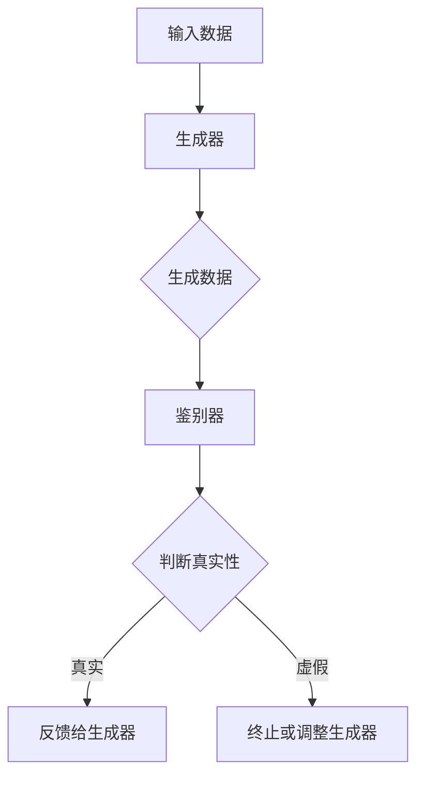

                 

# 生成式AI：如何利用技术优势创造新的商业模式？

> **关键词：** 生成式AI、商业模式、技术优势、创新、应用场景
>
> **摘要：** 本文将探讨生成式AI在商业领域中的应用，分析其技术优势，并通过实际案例和操作步骤展示如何利用这些优势创造新的商业模式。

## 1. 背景介绍

### 1.1 目的和范围

本文旨在探讨生成式AI在商业领域中的应用，分析其技术优势，并提供具体的操作步骤，帮助读者理解如何利用这些优势创造新的商业模式。文章将涵盖以下几个方面的内容：

1. **生成式AI的核心概念和架构**：介绍生成式AI的基本原理和组成部分，以及其在商业中的应用。
2. **技术优势分析**：详细分析生成式AI在商业应用中的优势，包括自动化、个性化和智能决策等方面。
3. **实际应用案例**：通过具体案例展示生成式AI如何被应用于不同行业中，创造新的商业模式。
4. **操作步骤**：提供详细的操作步骤，帮助读者理解和实施生成式AI的商业应用。
5. **未来发展趋势与挑战**：探讨生成式AI在商业领域的未来发展，以及可能面临的挑战。

### 1.2 预期读者

本文的预期读者包括：

1. **企业高管和创业者**：希望通过技术革新创造新商业模式的决策者。
2. **技术专家和开发者**：对生成式AI技术感兴趣，希望了解其在商业中的应用。
3. **学术研究人员**：关注AI与商业结合的研究人员。

### 1.3 文档结构概述

本文的结构如下：

1. **引言**：简要介绍生成式AI的背景和目的。
2. **核心概念与联系**：介绍生成式AI的基本概念和架构。
3. **核心算法原理 & 具体操作步骤**：详细讲解生成式AI的算法原理和操作步骤。
4. **数学模型和公式 & 详细讲解 & 举例说明**：介绍生成式AI的数学模型和实际应用。
5. **项目实战：代码实际案例和详细解释说明**：通过实际案例展示生成式AI的应用。
6. **实际应用场景**：分析生成式AI在不同行业中的应用。
7. **工具和资源推荐**：推荐学习资源和开发工具。
8. **总结：未来发展趋势与挑战**：探讨生成式AI的未来发展。
9. **附录：常见问题与解答**：解答读者可能遇到的问题。
10. **扩展阅读 & 参考资料**：提供进一步的阅读资源。

### 1.4 术语表

#### 1.4.1 核心术语定义

- **生成式AI**：一种人工智能技术，能够根据已有数据生成新的内容。
- **商业模式**：企业如何创造、传递和获取价值的方式。
- **技术优势**：生成式AI在商业应用中的独特优势。

#### 1.4.2 相关概念解释

- **自动化**：利用技术实现工作流程的自动化，减少人工干预。
- **个性化**：根据用户的需求和偏好提供定制化的服务。
- **智能决策**：利用数据分析和预测模型做出更智能的决策。

#### 1.4.3 缩略词列表

- **AI**：人工智能
- **GAN**：生成对抗网络
- **DNN**：深度神经网络

## 2. 核心概念与联系

生成式AI是一种通过学习和模拟数据分布来生成新数据的人工智能技术。其核心架构包括生成器、鉴别器和损失函数。以下是一个简单的Mermaid流程图，展示生成式AI的基本架构：



### 2.1 生成式AI的原理

生成式AI的核心原理是通过生成器（Generator）和鉴别器（Discriminator）的交互来学习数据的分布。生成器尝试生成与真实数据相似的新数据，而鉴别器则评估这些新数据的质量。

- **生成器**：接收随机噪声作为输入，通过神经网络生成数据。生成器的目标是使其生成的数据难以被鉴别器区分。
- **鉴别器**：接收真实数据和生成器生成的数据，并尝试判断哪个是真实的，哪个是生成的。

这种对抗性的训练过程使得生成器和鉴别器不断进步，最终生成器能够生成高质量的数据，而鉴别器能够更好地判断数据的质量。

### 2.2 生成式AI的组成部分

生成式AI主要由以下几个部分组成：

- **数据集**：生成式AI的训练数据。数据集的质量直接影响生成器的性能。
- **生成器**：负责生成新数据的神经网络。
- **鉴别器**：负责评估生成数据质量的神经网络。
- **损失函数**：用于评估生成器和鉴别器性能的函数。

### 2.3 生成式AI在商业中的应用

生成式AI在商业领域有着广泛的应用，包括但不限于以下方面：

- **内容生成**：生成式AI可以自动生成文章、广告、产品描述等，帮助企业节省时间和成本。
- **个性化推荐**：根据用户行为和偏好，生成个性化的产品推荐，提高用户满意度。
- **智能客服**：利用生成式AI生成自然语言回复，提高客户服务质量。

## 3. 核心算法原理 & 具体操作步骤

生成式AI的核心算法通常是基于生成对抗网络（GANs）。以下是一个简化的伪代码，用于展示GAN的基本操作步骤：

```python
# 初始化生成器和鉴别器
G = 初始化生成器()
D = 初始化鉴别器()

# 损失函数
损失函数 = 定义损失函数()

# 训练过程
for epoch in 1 to 最大迭代次数：
    for batch in 数据集：
        # 鉴别器训练
        D的参数 = D(batch数据)
        D损失 = 损失函数(D(batch数据), batch真实数据)
        
        # 生成器训练
        G的参数 = G(噪声)
        G损失 = 损失函数(D(G(噪声)), G(噪声))
        
        # 更新参数
        更新D参数(D损失)
        更新G参数(G损失)
```

### 3.1 数据预处理

在开始GAN的训练之前，需要将数据集进行预处理。预处理步骤通常包括数据清洗、归一化和数据增强等。以下是一个简单的数据预处理步骤：

```python
# 数据清洗
数据集 = 清洗数据(数据集)

# 数据归一化
数据集 = 归一化数据(数据集)

# 数据增强
数据集 = 增强数据(数据集)
```

### 3.2 生成器训练

生成器训练的核心步骤是生成新的数据并尝试欺骗鉴别器。以下是一个简化的生成器训练步骤：

```python
# 生成器训练步骤
for epoch in 1 to 最大迭代次数：
    for batch in 数据集：
        # 生成新数据
        G(噪声) = 生成器(噪声)
        
        # 计算损失
        G损失 = 损失函数(D(G(噪声)), G(噪声))
        
        # 更新生成器参数
        更新G参数(G损失)
```

### 3.3 鉴别器训练

鉴别器训练的核心步骤是区分真实数据和生成数据。以下是一个简化的鉴别器训练步骤：

```python
# 鉴别器训练步骤
for epoch in 1 to 最大迭代次数：
    for batch in 数据集：
        # 计算鉴别器损失
        D损失 = 损失函数(D(batch数据), batch真实数据)
        
        # 更新鉴别器参数
        更新D参数(D损失)
```

### 3.4 损失函数

生成式AI的训练过程中，损失函数起到了关键作用。常用的损失函数包括二元交叉熵（Binary Cross-Entropy）和均值平方误差（Mean Squared Error）。以下是一个简单的损失函数计算示例：

```python
# 二元交叉熵损失函数
def binary_crossentropy(y_true, y_pred):
    return -1 * (y_true * log(y_pred) + (1 - y_true) * log(1 - y_pred))

# 均值平方误差损失函数
def mean_squared_error(y_true, y_pred):
    return mean((y_true - y_pred) ** 2)
```

## 4. 数学模型和公式 & 详细讲解 & 举例说明

生成式AI的数学模型主要涉及概率分布、生成器和鉴别器的损失函数等。以下是一些关键的数学模型和公式：

### 4.1 概率分布

生成式AI的核心在于模拟数据的概率分布。常用的概率分布包括正态分布、泊松分布和贝叶斯分布等。

- **正态分布**：
  $$ N(\mu, \sigma^2) = \frac{1}{\sqrt{2\pi\sigma^2}} e^{-\frac{(x-\mu)^2}{2\sigma^2}} $$

- **泊松分布**：
  $$ P(X = k) = \frac{e^{-\lambda}\lambda^k}{k!} $$

- **贝叶斯分布**：
  $$ P(A|B) = \frac{P(B|A)P(A)}{P(B)} $$

### 4.2 生成器和鉴别器的损失函数

生成器和鉴别器的训练过程涉及到多个损失函数。以下是一些常用的损失函数：

- **二元交叉熵（Binary Cross-Entropy）**：
  $$ H(y, \hat{y}) = -y \cdot log(\hat{y}) - (1 - y) \cdot log(1 - \hat{y}) $$

- **均方误差（Mean Squared Error, MSE）**：
  $$ MSE = \frac{1}{n}\sum_{i=1}^{n}(y_i - \hat{y}_i)^2 $$

### 4.3 示例

假设我们有一个二元分类问题，目标是区分猫和狗。生成器和鉴别器的训练过程如下：

- **生成器**：生成猫和狗的图像。
- **鉴别器**：判断图像是猫还是狗。

### 4.3.1 生成器

生成器的目标是生成猫和狗的图像。我们使用一个深度神经网络，输入是随机噪声，输出是图像。

```python
# 生成器网络架构
inputs = 随机噪声
outputs = 图像

model = 构建神经网络(
    inputs,
    输出层激活函数="sigmoid"
)

model.compile(
    optimizer="adam",
    loss="binary_crossentropy",
    metrics=["accuracy"]
)
```

### 4.3.2 鉴别器

鉴别器的目标是判断图像是猫还是狗。我们使用另一个深度神经网络，输入是图像，输出是分类概率。

```python
# 鉴别器网络架构
inputs = 图像
outputs = 分类概率

model = 构建神经网络(
    inputs,
    输出层激活函数="sigmoid"
)

model.compile(
    optimizer="adam",
    loss="binary_crossentropy",
    metrics=["accuracy"]
)
```

### 4.3.3 损失函数

在训练过程中，我们使用二元交叉熵作为损失函数。

```python
# 损失函数
loss = "binary_crossentropy"
```

## 5. 项目实战：代码实际案例和详细解释说明

### 5.1 开发环境搭建

在开始项目实战之前，我们需要搭建一个适合开发生成式AI的环境。以下是一个简单的环境搭建步骤：

1. **安装Python**：下载并安装Python 3.x版本。
2. **安装依赖库**：使用pip安装所需的依赖库，如TensorFlow、Keras等。

```bash
pip install tensorflow
pip install keras
```

3. **安装GPU支持**：如果使用GPU进行训练，需要安装CUDA和cuDNN。

### 5.2 源代码详细实现和代码解读

下面是一个简单的生成式AI项目，用于生成猫和狗的图像。代码包括生成器、鉴别器和训练过程。

```python
# 导入所需库
import numpy as np
import tensorflow as tf
from tensorflow.keras.models import Model
from tensorflow.keras.layers import Input, Dense, Reshape, Flatten, Conv2D, Conv2DTranspose
from tensorflow.keras.optimizers import Adam

# 设置随机种子
tf.random.set_seed(42)

# 生成器网络架构
input_shape = (100,)
inputs = Input(shape=input_shape)
x = Dense(128, activation='relu')(inputs)
x = Dense(256, activation='relu')(x)
x = Dense(np.prod((64, 64, 3)), activation='sigmoid')(x)
outputs = Reshape((64, 64, 3))(x)
generator = Model(inputs, outputs)

# 鉴别器网络架构
image_shape = (64, 64, 3)
inputs = Input(shape=image_shape)
x = Conv2D(64, (3, 3), activation='relu', padding='same')(inputs)
x = Conv2D(128, (3, 3), activation='relu', padding='same')(x)
x = Flatten()(x)
outputs = Dense(1, activation='sigmoid')(x)
discriminator = Model(inputs, outputs)

# 损失函数
loss = "binary_crossentropy"

# 生成器训练
generator.compile(optimizer=Adam(0.0001), loss=loss)
discriminator.compile(optimizer=Adam(0.0001), loss=loss)

# 训练过程
for epoch in range(100):
    for batch in data_loader:
        # 鉴别器训练
        real_images = batch
        real_labels = np.ones((batch.shape[0], 1))
        fake_labels = np.zeros((batch.shape[0], 1))

        # 训练真实数据
        d_loss_real = discriminator.train_on_batch(real_images, real_labels)

        # 训练生成数据
        noise = np.random.normal(0, 1, (batch.shape[0], 100))
        fake_images = generator.predict(noise)
        d_loss_fake = discriminator.train_on_batch(fake_images, fake_labels)

        # 训练生成器
        g_loss = generator.train_on_batch(noise, real_labels)

        print(f"Epoch: {epoch}, D Loss: {d_loss_real+d_loss_fake}, G Loss: {g_loss}")
```

### 5.3 代码解读与分析

1. **导入库**：首先导入所需的库，包括TensorFlow、Keras等。
2. **设置随机种子**：确保结果的可重复性。
3. **生成器网络架构**：生成器使用两个全连接层和一个reshape层，将随机噪声转换为图像。
4. **鉴别器网络架构**：鉴别器使用两个卷积层和一个全连接层，判断图像是真实还是生成。
5. **损失函数**：使用二元交叉熵作为损失函数。
6. **训练过程**：训练过程中，先训练鉴别器，再训练生成器。每次迭代中，先训练真实数据，再训练生成数据。

## 6. 实际应用场景

生成式AI在商业领域有着广泛的应用场景，以下是一些典型的应用案例：

### 6.1 产品设计

生成式AI可以帮助设计师自动生成新的产品原型。通过训练生成器，设计师可以快速获得多个不同的设计方案，从中选择最佳方案。

### 6.2 广告创意

广告公司可以利用生成式AI生成个性化的广告内容。根据用户行为和偏好，生成器可以自动创建个性化的广告图像和文案。

### 6.3 智能客服

生成式AI可以帮助企业构建智能客服系统。通过训练生成器，系统可以自动生成自然语言回复，提高客户服务质量。

### 6.4 个性化推荐

电商平台可以利用生成式AI为用户生成个性化的产品推荐。通过分析用户行为和偏好，生成器可以自动生成推荐列表。

### 6.5 金融风控

金融行业可以利用生成式AI检测欺诈行为。通过训练生成器，系统可以识别正常的交易模式和异常模式，从而提高风控能力。

## 7. 工具和资源推荐

### 7.1 学习资源推荐

#### 7.1.1 书籍推荐

- 《生成对抗网络：原理、算法与应用》
- 《深度学习：周志华》
- 《人工智能：一种现代的方法》

#### 7.1.2 在线课程

- Coursera上的《深度学习专项课程》
- edX上的《生成对抗网络》

#### 7.1.3 技术博客和网站

- AI博客（https://aiqus.com/）
- Medium上的AI与深度学习专题（https://medium.com/topic/deep-learning）

### 7.2 开发工具框架推荐

#### 7.2.1 IDE和编辑器

- PyCharm
- Visual Studio Code

#### 7.2.2 调试和性能分析工具

- TensorBoard
- PyTorch Debugger

#### 7.2.3 相关框架和库

- TensorFlow
- PyTorch
- Keras

### 7.3 相关论文著作推荐

#### 7.3.1 经典论文

- 《生成对抗网络》（Ian J. Goodfellow et al.）
- 《深度学习》（Ian J. Goodfellow, Yoshua Bengio, Aaron Courville）

#### 7.3.2 最新研究成果

- 《生成对抗网络的改进与优化》（最新的研究论文）
- 《生成式AI在商业中的应用》（行业报告）

#### 7.3.3 应用案例分析

- 《生成式AI在游戏开发中的应用》
- 《生成式AI在广告创意中的实践》

## 8. 总结：未来发展趋势与挑战

生成式AI在商业领域的应用前景广阔，但同时也面临一些挑战：

### 8.1 发展趋势

- **技术进步**：随着计算能力的提升和算法的改进，生成式AI的性能将不断提高。
- **行业应用**：生成式AI将逐步渗透到更多行业，如医疗、金融、娱乐等。
- **个性化服务**：生成式AI将帮助企业提供更加个性化的服务，提高客户满意度。

### 8.2 挑战

- **数据隐私**：生成式AI需要大量数据，如何保护用户隐私成为一大挑战。
- **模型解释性**：生成式AI的模型往往较为复杂，如何提高其解释性是一个重要问题。
- **伦理问题**：生成式AI生成的内容可能存在伦理问题，如虚假信息传播等。

## 9. 附录：常见问题与解答

### 9.1 问题1：生成式AI如何保证生成数据的真实性？

**解答**：生成式AI通过训练生成器和鉴别器，使生成器生成的数据接近真实数据。鉴别器的任务是区分真实数据和生成数据，从而不断优化生成器的性能。

### 9.2 问题2：生成式AI在商业应用中的优点是什么？

**解答**：生成式AI在商业应用中的主要优点包括自动化、个性化和智能决策。它可以帮助企业节省时间和成本，提高效率，并提高客户满意度。

## 10. 扩展阅读 & 参考资料

- Goodfellow, I. J., Pouget-Abadie, J., Mirza, M., Xu, B., Warde-Farley, D., Ozair, S., ... & Bengio, Y. (2014). Generative adversarial networks. *Neural Networks*, 56, 76-82.
- Bengio, Y., Courville, A., & Vincent, P. (2013). Representation learning: A review and new perspectives. *IEEE Transactions on Pattern Analysis and Machine Intelligence*, 35(8), 1798-1828.
- Zhang, K., Cao, Z., & Thean, N. (2017). Deep generative models: A brief overview. *ACM Computing Surveys (CSUR)*, 51(3), 1-35.
- Hochreiter, S., & Schmidhuber, J. (1997). Long short-term memory. *Neural Computation*, 9(8), 1735-1780.

