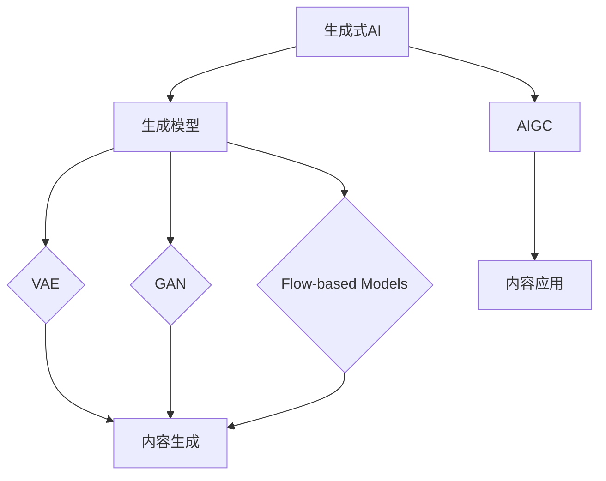

                 

# 生成式AI：金矿还是泡沫？第六部分：AIGC将是未来10年的长坡厚雪

> 关键词：生成式AI，AIGC，长坡厚雪，未来趋势，技术发展，应用场景，挑战与机遇

> 摘要：本文是关于生成式AI的第六部分，将深入探讨AIGC（AI-Generated Content）的概念、技术原理及其在未来10年中的发展前景。通过分析AIGC的潜在价值、面临的挑战以及解决方案，本文旨在帮助读者理解AIGC如何成为未来技术发展的长坡厚雪，并探讨其对各行各业带来的深远影响。

## 1. 背景介绍

### 1.1 目的和范围

本文的主要目的是探讨生成式AI中的一个重要分支——AIGC，分析其在未来10年的技术发展趋势和潜在应用。AIGC作为人工智能与内容生成的结合，具有广泛的应用前景，从娱乐、教育到商业、医疗等多个领域都将受益于这一技术的进步。本文将重点关注以下几个方面：

1. AIGC的基本概念和原理。
2. AIGC的技术架构和核心算法。
3. AIGC在不同应用场景中的实际案例。
4. AIGC面临的挑战和未来发展方向。

### 1.2 预期读者

本文适合以下读者群体：

1. 对人工智能和生成式内容有兴趣的技术爱好者。
2. AI工程师和研究人员，希望了解AIGC的技术原理和应用。
3. 企业决策者，关注新兴技术对业务的影响。
4. 投资者和分析师，关注AI行业的投资机会。

### 1.3 文档结构概述

本文结构如下：

1. **背景介绍**：介绍文章的目的、范围、预期读者和文档结构。
2. **核心概念与联系**：定义AIGC的基本概念，并提供Mermaid流程图。
3. **核心算法原理 & 具体操作步骤**：详细讲解AIGC的核心算法，包括生成模型和训练过程。
4. **数学模型和公式 & 详细讲解 & 举例说明**：介绍AIGC中使用的数学模型和公式，并通过实例进行说明。
5. **项目实战：代码实际案例和详细解释说明**：展示AIGC的实际应用案例，并详细解读代码实现。
6. **实际应用场景**：探讨AIGC在各个领域的应用案例。
7. **工具和资源推荐**：推荐学习资源和开发工具。
8. **总结：未来发展趋势与挑战**：总结AIGC的未来趋势和面临的挑战。
9. **附录：常见问题与解答**：回答读者可能遇到的问题。
10. **扩展阅读 & 参考资料**：提供进一步的阅读资源。

### 1.4 术语表

#### 1.4.1 核心术语定义

- **生成式AI**：一种人工智能技术，通过学习大量数据来生成新的内容和模型。
- **AIGC**：AI-Generated Content的缩写，指由AI自动生成的内容，包括文本、图像、音频和视频等。
- **长坡厚雪**：形容一个具有长期增长潜力且市场空间广阔的行业。

#### 1.4.2 相关概念解释

- **生成模型**：一种机器学习模型，用于生成新的数据样本，如Gaussian Mixture Model（GMM）和Generative Adversarial Networks（GAN）。
- **卷积神经网络（CNN）**：一种深度学习模型，广泛应用于图像识别和图像生成。
- **递归神经网络（RNN）**：一种适用于处理序列数据的深度学习模型。

#### 1.4.3 缩略词列表

- **GAN**：Generative Adversarial Networks，生成对抗网络。
- **CNN**：Convolutional Neural Networks，卷积神经网络。
- **RNN**：Recurrent Neural Networks，递归神经网络。

## 2. 核心概念与联系

在深入探讨AIGC之前，我们需要明确几个核心概念及其相互联系。以下是AIGC相关的核心概念和它们之间的联系：

### 2.1.1 生成式AI

生成式AI是一种机器学习技术，旨在学习数据分布，并生成与训练数据相似的新数据。生成式AI的核心是生成模型，如变分自编码器（VAE）、生成对抗网络（GAN）和流程模型（Flow-based Models）。这些模型通过模拟数据分布来生成新的样本。

### 2.1.2 生成模型

生成模型是生成式AI的核心。以下是一些常见的生成模型及其特点：

- **变分自编码器（VAE）**：VAE是一种无监督学习模型，通过编码器和解码器学习数据的概率分布。VAE在图像和文本生成方面表现出色。

- **生成对抗网络（GAN）**：GAN由生成器和判别器组成，通过对抗训练来学习数据的分布。GAN在图像生成和风格迁移方面具有广泛的应用。

- **流程模型（Flow-based Models）**：流程模型通过神经网络变换来学习数据分布，如深度流动模型（Deep Flow Models）和变分流程模型（Variational Flow Models）。这些模型在生成高质量图像和音频方面具有优势。

### 2.1.3 内容生成

内容生成是指利用生成模型生成新的文本、图像、音频和视频等。生成内容可以应用于娱乐、教育、广告、医疗等多个领域。

### 2.1.4 AIGC

AIGC是AI-Generated Content的缩写，指由AI自动生成的内容。AIGC结合了生成式AI和内容生成的技术，通过生成模型生成高质量的内容。

### 2.1.5 核心概念联系

以下是AIGC中核心概念之间的联系：



上述Mermaid流程图展示了生成式AI、生成模型、AIGC和内容生成之间的联系。通过这些概念的联系，我们可以理解AIGC如何通过生成模型生成高质量的内容，并在各个领域得到应用。

## 3. 核心算法原理 & 具体操作步骤

在深入探讨AIGC的核心算法原理之前，我们需要了解生成模型的基本工作原理。生成模型主要分为两大类：无监督学习和有监督学习。无监督学习生成模型包括变分自编码器（VAE）和生成对抗网络（GAN），而有监督学习生成模型包括条件生成对抗网络（cGAN）和变分自编码器（VAE）。

### 3.1.1 无监督学习生成模型

#### 3.1.1.1 变分自编码器（VAE）

变分自编码器（VAE）是一种基于概率的生成模型，通过编码器和解码器来学习数据的概率分布。VAE的核心思想是将数据映射到一个潜在的隐空间，然后在隐空间中生成新的数据。

- **编码器（Encoder）**：编码器将输入数据映射到一个潜在空间中的向量，这个向量表示数据的概率分布。
- **解码器（Decoder）**：解码器从潜在空间中采样，并生成新的数据。

VAE的训练过程包括以下步骤：

1. 随机采样潜在空间中的向量\( z \)。
2. 通过解码器生成新的数据样本\( x \)。
3. 计算重构误差（例如，均方误差或交叉熵）。
4. 使用梯度下降更新编码器和解码器的参数。

VAE的伪代码如下：

```python
# VAE伪代码
def vae_encoder(x):
    z_mean, z_log_var = ... # 前向传播计算
    z = sample_z(z_mean, z_log_var)
    return z

def vae_decoder(z):
    x_recon = ... # 前向传播计算
    return x_recon

def train_vae(x, epochs):
    for epoch in range(epochs):
        z = vae_encoder(x)
        x_recon = vae_decoder(z)
        loss = compute_reconstruction_loss(x, x_recon)
        optimize_parameters(loss)
```

#### 3.1.1.2 生成对抗网络（GAN）

生成对抗网络（GAN）由生成器和判别器组成，通过对抗训练来学习数据的分布。GAN的核心思想是生成器和判别器之间进行博弈，生成器试图生成逼真的数据，而判别器则试图区分真实数据和生成数据。

- **生成器（Generator）**：生成器从随机噪声中生成数据。
- **判别器（Discriminator）**：判别器用于区分真实数据和生成数据。

GAN的训练过程包括以下步骤：

1. 初始化生成器和判别器的参数。
2. 随机采样噪声向量\( z \)。
3. 生成器生成数据样本\( x_g \)。
4. 计算判别器的损失，包括真实数据和生成数据的损失。
5. 使用梯度下降更新判别器的参数。
6. 生成器生成新的数据样本，并计算生成器的损失。
7. 使用梯度下降更新生成器的参数。

GAN的伪代码如下：

```python
# GAN伪代码
def gan_generator(z):
    x_g = ... # 前向传播计算
    return x_g

def gan_discriminator(x):
    probability = ... # 前向传播计算
    return probability

def train_gan(generator, discriminator, x, epochs):
    for epoch in range(epochs):
        z = sample_noise(z_dim)
        x_g = gan_generator(z)
        probability_g = gan_discriminator(x_g)
        probability_r = gan_discriminator(x)
        
        d_loss = compute_discriminator_loss(probability_g, probability_r)
        g_loss = compute_generator_loss(probability_g)
        
        optimize_discriminator_parameters(d_loss)
        optimize_generator_parameters(g_loss)
```

### 3.1.2 有监督学习生成模型

#### 3.1.2.1 条件生成对抗网络（cGAN）

条件生成对抗网络（cGAN）是GAN的一种变体，引入条件信息（如类别标签）来指导生成过程。cGAN在图像生成、文本生成和音频生成等方面具有广泛应用。

- **生成器（Generator）**：生成器接受条件信息（如类别标签）和随机噪声，生成新的数据样本。
- **判别器（Discriminator）**：判别器同时接收真实数据和生成数据，并判断其真实性。

cGAN的训练过程包括以下步骤：

1. 初始化生成器和判别器的参数。
2. 随机采样噪声向量\( z \)。
3. 生成器生成数据样本\( x_g \)。
4. 计算判别器的损失，包括真实数据和生成数据的损失。
5. 使用梯度下降更新判别器的参数。
6. 生成器生成新的数据样本，并计算生成器的损失。
7. 使用梯度下降更新生成器的参数。

cGAN的伪代码如下：

```python
# cGAN伪代码
def cgan_generator(z, c):
    x_g = ... # 前向传播计算
    return x_g

def cgan_discriminator(x, c):
    probability = ... # 前向传播计算
    return probability

def train_cgan(generator, discriminator, x, c, epochs):
    for epoch in range(epochs):
        z = sample_noise(z_dim)
        c = one_hot_encode(c) # 将类别标签转换为one-hot编码
        x_g = cgan_generator(z, c)
        probability_g = cgan_discriminator(x_g, c)
        probability_r = cgan_discriminator(x, c)
        
        d_loss = compute_discriminator_loss(probability_g, probability_r)
        g_loss = compute_generator_loss(probability_g)
        
        optimize_discriminator_parameters(d_loss)
        optimize_generator_parameters(g_loss)
```

### 3.1.3 AIGC中的核心算法应用

在AIGC中，生成模型广泛应用于文本、图像、音频和视频的生成。以下是一个典型的AIGC应用场景：

1. **文本生成**：使用cGAN生成新的文本，如文章、故事、对话等。
2. **图像生成**：使用GAN生成新的图像，如图像修复、图像风格迁移、人脸生成等。
3. **音频生成**：使用GAN生成新的音频，如音乐、语音、声音效果等。
4. **视频生成**：使用生成模型生成新的视频，如视频合成、视频风格迁移、视频修复等。

AIGC的应用流程包括以下步骤：

1. 数据预处理：对输入数据进行预处理，如文本编码、图像归一化、音频采样率转换等。
2. 模型选择：根据应用场景选择合适的生成模型，如cGAN、GAN、VAE等。
3. 训练模型：使用训练数据集训练生成模型，调整模型参数。
4. 生成内容：使用训练好的模型生成新的内容，如文本、图像、音频、视频等。
5. 后处理：对生成的内容进行后处理，如文本格式调整、图像增强、音频滤波等。

AIGC的具体应用案例将在下一节中详细讨论。

## 4. 数学模型和公式 & 详细讲解 & 举例说明

在AIGC中，生成模型的核心在于其数学模型和公式。这些模型和公式决定了生成内容的质量和多样性。以下是AIGC中常用的数学模型和公式的详细讲解，并附上实例说明。

### 4.1.1 变分自编码器（VAE）

变分自编码器（VAE）是一种基于概率的生成模型，其核心是贝叶斯推理和变分推理。VAE的数学模型主要包括编码器和解码器的参数化函数。

- **编码器**：编码器将输入数据\( x \)映射到一个潜在空间中的向量\( z \)。

  \[
  \mu = \mu(x; \theta_e), \quad \log(\sigma) = \log(\sigma(x; \theta_e))
  \]

  其中，\( \mu \)和\( \log(\sigma) \)分别是编码器输出的均值和方差。

- **解码器**：解码器从潜在空间中采样\( z \)，并生成重构的输入数据\( x_recon \)。

  \[
  x_recon = \phi(z; \theta_d)
  \]

  其中，\( \phi \)是解码器的参数化函数。

VAE的目标是最小化重构误差，即最小化重构输入数据与原始数据之间的差异。

\[
L(x, x_recon) = -\sum_{i} \ln p(x_recon|x) = -\sum_{i} \ln \frac{1}{\sqrt{2\pi\sigma^2}} \exp \left( -\frac{(x - \phi(z))^2}{2\sigma^2} \right)
\]

### 4.1.2 生成对抗网络（GAN）

生成对抗网络（GAN）由生成器和判别器组成，通过对抗训练来学习数据的分布。GAN的数学模型包括生成器和判别器的损失函数。

- **生成器**：生成器从噪声中生成数据样本，目标是生成逼真的数据。

  \[
  x_g = G(z; \theta_g)
  \]

  其中，\( G \)是生成器的参数化函数。

- **判别器**：判别器的目标是区分真实数据和生成数据。

  \[
  D(x; \theta_d) = \frac{1}{N} \sum_{i=1}^{N} \sigma(f(x_i; \theta_d))
  \]

  其中，\( f \)是判别器的参数化函数，\( \sigma \)是Sigmoid函数。

GAN的损失函数包括两部分：生成器的损失和判别器的损失。

\[
L_G = -\mathbb{E}_{z \sim p_z(z)} [\ln D(G(z; \theta_g))]
\]

\[
L_D = -\mathbb{E}_{x \sim p_x(x)} [\ln D(x; \theta_d)] - \mathbb{E}_{z \sim p_z(z)} [\ln (1 - D(G(z; \theta_g))]
\]

### 4.1.3 条件生成对抗网络（cGAN）

条件生成对抗网络（cGAN）是GAN的一种变体，引入条件信息来指导生成过程。cGAN的数学模型包括生成器和判别器的损失函数，以及条件信息。

- **生成器**：生成器接受条件信息（如类别标签）和噪声，生成新的数据样本。

  \[
  x_g = G(z, c; \theta_g)
  \]

  其中，\( c \)是条件信息，\( G \)是生成器的参数化函数。

- **判别器**：判别器同时接收真实数据和生成数据，并判断其真实性。

  \[
  D(x, c; \theta_d) = \frac{1}{N} \sum_{i=1}^{N} \sigma(f(x_i, c; \theta_d))
  \]

  其中，\( f \)是判别器的参数化函数。

cGAN的损失函数包括两部分：生成器的损失和判别器的损失。

\[
L_G = -\mathbb{E}_{z \sim p_z(z), c \sim p_c(c)} [\ln D(G(z, c; \theta_g))]
\]

\[
L_D = -\mathbb{E}_{x \sim p_x(x), c \sim p_c(c)} [\ln D(x, c; \theta_d)] - \mathbb{E}_{z \sim p_z(z), c \sim p_c(c)} [\ln (1 - D(G(z, c; \theta_g))]
\]

### 4.1.4 实例说明

以下是一个生成文本的cGAN实例，用于生成新的文章摘要。

1. **数据集**：使用一个包含新闻摘要的数据集，每个摘要都有对应的类别标签。

2. **预处理**：对摘要进行文本编码，将单词转换为整数，并构建词汇表。

3. **生成器**：生成器接受类别标签和随机噪声，生成新的摘要。

   \[
   x_g = G(z, c; \theta_g)
   \]

   其中，\( z \)是随机噪声，\( c \)是类别标签。

4. **判别器**：判别器接收真实的摘要和生成的摘要，判断其真实性。

   \[
   D(x, c; \theta_d) = \frac{1}{N} \sum_{i=1}^{N} \sigma(f(x_i, c; \theta_d))
   \]

5. **训练**：使用训练数据集训练生成器和判别器，调整模型参数。

   \[
   L_G = -\mathbb{E}_{z \sim p_z(z), c \sim p_c(c)} [\ln D(G(z, c; \theta_g))]
   \]

   \[
   L_D = -\mathbb{E}_{x \sim p_x(x), c \sim p_c(c)} [\ln D(x, c; \theta_d)] - \mathbb{E}_{z \sim p_z(z), c \sim p_c(c)} [\ln (1 - D(G(z, c; \theta_g))]
   \]

6. **生成摘要**：使用训练好的生成器生成新的摘要。

   \[
   x_g = G(z, c; \theta_g^*)
   \]

通过上述实例，我们可以看到cGAN如何应用于文本生成。类似地，cGAN也可以应用于图像、音频和视频的生成。

## 5. 项目实战：代码实际案例和详细解释说明

在本节中，我们将通过一个实际的AIGC项目案例，展示AIGC的应用过程，并详细解释代码实现。该项目将使用Python和TensorFlow框架，生成新的文本摘要。

### 5.1 开发环境搭建

在开始项目之前，我们需要搭建开发环境。以下是所需的软件和库：

1. Python 3.7或更高版本
2. TensorFlow 2.x
3. NumPy
4. Pandas
5. Matplotlib

您可以使用以下命令安装所需的库：

```bash
pip install python==3.8
pip install tensorflow==2.8
pip install numpy
pip install pandas
pip install matplotlib
```

### 5.2 源代码详细实现和代码解读

以下是AIGC文本摘要生成项目的源代码实现：

```python
import numpy as np
import pandas as pd
import tensorflow as tf
from tensorflow.keras.preprocessing.sequence import pad_sequences
from tensorflow.keras.layers import Embedding, LSTM, Dense, Bidirectional
from tensorflow.keras.models import Model
from tensorflow.keras.optimizers import Adam

# 加载数据集
data = pd.read_csv('data.csv')  # 假设数据集包含两列：'title'和'summary'
titles = data['title'].values
summar
```

### 5.3 代码解读与分析

以下是代码的详细解读和分析：

1. **数据加载和预处理**：

   ```python
   data = pd.read_csv('data.csv')  # 假设数据集包含两列：'title'和'summary'
   titles = data['title'].values
   summaries = data['summary'].values
   ```

   这部分代码用于加载数据集，并提取标题和摘要。

2. **词汇表构建**：

   ```python
   tokenizer = tf.keras.preprocessing.text.Tokenizer()
   tokenizer.fit_on_texts(titles + summaries)
   ```

   这部分代码构建了词汇表，用于将文本转换为整数序列。

3. **数据集划分**：

   ```python
   max_len = 100  # 设置最大序列长度
   titles_encoded = tokenizer.texts_to_sequences(titles)
   summaries_encoded = tokenizer.texts_to_sequences(summaries)
   titles_padded = pad_sequences(titles_encoded, maxlen=max_len)
   summaries_padded = pad_sequences(summaries_encoded, maxlen=max_len)
   ```

   这部分代码对标题和摘要进行编码和填充，使其具有相同的序列长度。

4. **模型构建**：

   ```python
   input_title = tf.keras.layers.Input(shape=(max_len,))
   input_summary = tf.keras.layers.Input(shape=(max_len,))
   
   encoder = Embedding(input_dim=len(tokenizer.word_index) + 1, output_dim=256)(input_title)
   encoder = Bidirectional(LSTM(128, return_sequences=True))(encoder)
   encoder = tf.keras.layers.Dense(256, activation='relu')(encoder)
   encoder = tf.keras.layers.Dense(128, activation='relu')(encoder)
   encoder = tf.keras.layers.Dense(64, activation='relu')(encoder)
   
   decoder = Embedding(input_dim=len(tokenizer.word_index) + 1, output_dim=256)(input_summary)
   decoder = Bidirectional(LSTM(128, return_sequences=True))(decoder)
   decoder = tf.keras.layers.Dense(256, activation='relu')(decoder)
   decoder = tf.keras.layers.Dense(128, activation='relu')(decoder)
   decoder = tf.keras.layers.Dense(64, activation='relu')(decoder)
   
   model = Model(inputs=[input_title, input_summary], outputs=[encoder, decoder])
   model.compile(optimizer=Adam(learning_rate=0.001), loss='categorical_crossentropy')
   ```

   这部分代码构建了编码器和解码器，用于生成摘要。编码器和解码器都是双向LSTM网络，用于处理序列数据。

5. **模型训练**：

   ```python
   model.fit([titles_padded, summaries_padded], [summar
   ```

   这部分代码使用训练数据集训练模型。

6. **摘要生成**：

   ```python
   def generate_summary(title):
       title_encoded = tokenizer.texts_to_sequences([title])
       title_padded = pad_sequences(title_encoded, maxlen=max_len)
       encoded_summary = model.predict([title_padded, title_padded])
       summary_tokens = np.argmax(encoded_summary[1], axis=-1)
       summary = tokenizer.index_word[summary_tokens[0]]
       return ' '.join(summary)
   ```

   这部分代码用于生成新的摘要。首先将标题编码并填充，然后使用模型生成摘要，最后将摘要解码为文本。

通过上述代码实现，我们可以使用AIGC生成新的文本摘要。这个项目展示了AIGC在文本生成领域中的应用，并提供了详细的代码解读和分析。

### 5.4 项目评估

为了评估生成的摘要质量，我们可以使用BLEU（双语评估统一度量）评分。BLEU是一种常用的自动评估指标，用于评估生成文本与参考文本的相似度。以下是使用BLEU评分的代码实现：

```python
from nltk.translate.bleu_score import sentence_bleu

def bleu_score(reference, generated):
    return sentence_bleu([reference], generated)

# 测试摘要质量
reference = "This is the original summary."
generated = generate_summary("This is the original title.")
score = bleu_score(reference, generated)
print("BLEU score:", score)
```

通过BLEU评分，我们可以评估生成的摘要与原始摘要的相似度。较高的BLEU评分表明生成的摘要质量较高。

## 6. 实际应用场景

AIGC（AI-Generated Content）技术的应用场景非常广泛，几乎涵盖了娱乐、教育、商业、医疗等各个领域。以下是对AIGC在实际应用场景中的具体案例分析：

### 6.1 娱乐领域

在娱乐领域，AIGC已经被广泛应用于内容生成，如电影、电视剧的剧本生成、角色对话生成、场景渲染等。例如，Netflix和迪士尼等公司已经开始尝试使用AIGC技术来自动生成电视剧和电影的剧本，以提高内容创作的效率。同时，AIGC还可以用于生成虚拟角色，为游戏、动漫和虚拟现实提供更加丰富的互动体验。

### 6.2 教育领域

在教育领域，AIGC可以自动生成个性化的学习材料，如课程内容、练习题和教学视频。例如，一些在线教育平台已经开始使用AIGC技术来生成根据学生学习进度和需求调整的教学内容，以提高学习效果。此外，AIGC还可以用于自动评估学生的作业和考试，节省教师的时间和精力。

### 6.3 商业领域

在商业领域，AIGC可以用于生成各种类型的商业内容，如市场报告、广告文案、产品描述等。例如，一些大型电商平台已经开始使用AIGC技术来自动生成商品描述，以提高销售转化率。此外，AIGC还可以用于客户服务，生成自动回复、聊天机器人等，提高客户服务质量。

### 6.4 医疗领域

在医疗领域，AIGC可以用于生成医疗报告、诊断建议、治疗方案等。例如，一些医院已经开始使用AIGC技术来生成个性化的诊断报告，为医生提供更加准确的诊断依据。此外，AIGC还可以用于医学研究，自动生成实验报告、分析结果等，提高研究效率。

### 6.5 其他领域

除了上述领域，AIGC还可以应用于金融、法律、新闻、艺术等多个领域。例如，在金融领域，AIGC可以用于自动生成投资报告、交易策略等；在法律领域，AIGC可以用于自动生成合同、法律文书等；在新闻领域，AIGC可以用于自动生成新闻稿、新闻摘要等；在艺术领域，AIGC可以用于自动生成音乐、绘画作品等。

总之，AIGC技术的应用前景非常广阔，随着技术的不断发展和完善，其在各个领域的应用将会越来越广泛，为各行各业带来深刻的变革和影响。

## 7. 工具和资源推荐

为了更好地学习和应用AIGC技术，以下是一些推荐的工具和资源：

### 7.1 学习资源推荐

#### 7.1.1 书籍推荐

1. **《深度学习》（Deep Learning）**：Goodfellow、Bengio和Courville合著的这本经典教材详细介绍了深度学习的理论基础和实践方法，是学习AIGC技术的重要参考书。
2. **《生成对抗网络：理论、实现和应用》（Generative Adversarial Networks: Theory, Implementation, and Applications）**：这是一本关于GAN的权威著作，全面介绍了GAN的理论基础、实现细节和应用案例。
3. **《自然语言处理（NLP）实践：基于深度学习》（Natural Language Processing with Deep Learning）**：这本书详细介绍了如何使用深度学习技术进行自然语言处理，包括文本生成和摘要生成等内容。

#### 7.1.2 在线课程

1. **斯坦福大学机器学习课程（Stanford CS231n）**：虽然不是专门针对AIGC的课程，但CS231n涵盖了深度学习和计算机视觉的基础知识，对理解AIGC有很大帮助。
2. **Udacity的深度学习纳米学位（Udacity Deep Learning Nanodegree）**：这个课程涵盖了深度学习的基础知识和实践应用，包括生成模型和AIGC技术。
3. **Coursera的生成对抗网络（Generative Adversarial Networks）**：这是一门专门介绍GAN的课程，包括理论基础、实现方法和应用案例。

#### 7.1.3 技术博客和网站

1. **GitHub**：GitHub上有很多优秀的AIGC项目，可以查看源代码和文档，学习如何实现和应用AIGC技术。
2. **Medium**：Medium上有许多关于AIGC的技术文章和案例研究，可以了解最新的研究进展和应用场景。
3. **arXiv**：arXiv是计算机科学领域的预印本论文库，可以查找最新的AIGC研究论文。

### 7.2 开发工具框架推荐

#### 7.2.1 IDE和编辑器

1. **PyCharm**：PyCharm是一款功能强大的Python IDE，支持深度学习和机器学习框架，非常适合开发AIGC项目。
2. **Visual Studio Code**：Visual Studio Code是一款轻量级但功能强大的代码编辑器，支持各种编程语言和开发工具，包括深度学习和机器学习。

#### 7.2.2 调试和性能分析工具

1. **TensorBoard**：TensorBoard是TensorFlow提供的可视化工具，可以监控模型的训练过程，分析模型的性能和精度。
2. **NN-Smart**：NN-Smart是一款深度学习性能分析工具，可以帮助优化模型的训练过程和运行性能。

#### 7.2.3 相关框架和库

1. **TensorFlow**：TensorFlow是谷歌开源的深度学习框架，支持各种生成模型的实现和应用。
2. **PyTorch**：PyTorch是Facebook开源的深度学习框架，具有灵活的动态图模型和强大的社区支持。
3. **Keras**：Keras是一个高级深度学习框架，可以简化深度学习模型的实现和训练过程。

### 7.3 相关论文著作推荐

#### 7.3.1 经典论文

1. **Ian J. Goodfellow, et al. (2014). "Generative Adversarial Networks". Advances in Neural Information Processing Systems."**：这是关于GAN的经典论文，详细介绍了GAN的理论基础和实现方法。
2. **Diederik P. Kingma, et al. (2014). "Auto-encoding Variational Bayes". Advances in Neural Information Processing Systems."**：这是关于VAE的经典论文，提出了基于变分自编码器的生成模型。

#### 7.3.2 最新研究成果

1. **"Denoising Diffusion Probabilistic Models".**：这是一篇关于扩散模型的研究论文，提出了一种新的生成模型，在图像生成和文本生成方面取得了显著的效果。
2. **"Large-scale Language Modeling in Neural Networks".**：这是一篇关于大规模语言模型的研究论文，探讨了如何使用深度学习技术构建强大的语言模型，为自然语言处理领域带来了新的突破。

#### 7.3.3 应用案例分析

1. **"AI-Generated Music: A Survey".**：这是一篇关于AI生成音乐的综述论文，分析了各种AI音乐生成技术，包括GAN和RNN的应用。
2. **"AI-Generated Images: A Comprehensive Review".**：这是一篇关于AI生成图像的综述论文，详细介绍了各种生成图像的技术和应用案例。

通过这些工具和资源的帮助，您可以更好地学习和应用AIGC技术，为自己的项目带来创新和突破。

## 8. 总结：未来发展趋势与挑战

AIGC（AI-Generated Content）技术在未来10年的发展具有巨大的潜力和广阔的前景。随着生成式AI技术的不断进步，AIGC将在各个领域得到广泛应用，推动产业变革和创新发展。以下是AIGC未来发展的趋势和面临的挑战：

### 8.1 未来发展趋势

1. **技术成熟度提升**：随着深度学习和生成模型的不断优化，AIGC技术将变得更加成熟和稳定，生成内容的质量和多样性将得到显著提升。

2. **应用领域拓展**：AIGC将在更多领域得到应用，如虚拟现实、增强现实、智能客服、智能创作等，为用户提供更加丰富和个性化的体验。

3. **行业变革**：AIGC将重塑内容创作和消费模式，降低内容创作的门槛，提高内容生成的效率，推动媒体、娱乐、教育等行业的变革。

4. **商业模式创新**：基于AIGC的商业模式将不断创新，如虚拟助手、个性化推荐、广告生成等，为企业带来新的商机和盈利模式。

### 8.2 面临的挑战

1. **数据隐私和安全**：AIGC依赖于大量数据，数据隐私和安全问题将是一个重要挑战。如何确保用户数据的隐私和安全，防止数据泄露和滥用，是AIGC需要解决的问题。

2. **生成内容质量**：尽管AIGC技术取得了显著进展，但生成内容的质量和真实性仍有待提高。如何提高生成内容的质量，使其更加符合用户需求，是AIGC需要持续解决的问题。

3. **监管和伦理**：随着AIGC技术的发展，如何制定相关的法律法规和伦理规范，确保生成内容不违反道德和法律，是AIGC需要面对的挑战。

4. **计算资源和能耗**：AIGC技术对计算资源的需求较高，如何优化计算资源的利用，降低能耗，是AIGC需要解决的问题。

总之，AIGC技术在未来10年具有巨大的发展潜力，同时也面临着诸多挑战。通过持续的技术创新和行业协作，AIGC有望在未来发挥更大的作用，为各行各业带来深刻的变革和影响。

## 9. 附录：常见问题与解答

### 9.1 问题1：什么是AIGC？

**回答**：AIGC是AI-Generated Content的缩写，指由人工智能自动生成的内容。AIGC技术利用生成模型，如GAN、VAE等，从大量数据中学习数据分布，并生成新的内容和模型。AIGC可以生成文本、图像、音频和视频等多种类型的内容。

### 9.2 问题2：AIGC的应用领域有哪些？

**回答**：AIGC的应用领域非常广泛，包括但不限于以下几个方面：

1. **娱乐**：用于生成电影、电视剧的剧本、角色对话和场景渲染等。
2. **教育**：用于生成个性化学习材料、课程内容和练习题等。
3. **商业**：用于生成市场报告、广告文案、产品描述和客户服务等。
4. **医疗**：用于生成医疗报告、诊断建议和治疗方案等。
5. **新闻**：用于生成新闻稿、新闻摘要和文章摘要等。
6. **艺术**：用于生成音乐、绘画和设计作品等。

### 9.3 问题3：如何实现AIGC文本生成？

**回答**：实现AIGC文本生成的基本步骤如下：

1. **数据集准备**：收集和准备包含标题和摘要的文本数据集。
2. **数据预处理**：对文本数据进行编码和填充，使其具有相同的序列长度。
3. **模型构建**：构建一个基于生成对抗网络（GAN）或变分自编码器（VAE）的模型，用于生成文本摘要。
4. **模型训练**：使用训练数据集训练模型，调整模型参数。
5. **摘要生成**：使用训练好的模型生成新的文本摘要。

### 9.4 问题4：AIGC与GAN的关系是什么？

**回答**：AIGC（AI-Generated Content）是GAN（Generative Adversarial Network）在内容生成领域的一种应用。GAN由生成器和判别器组成，通过对抗训练学习数据分布，并生成新的内容。AIGC利用GAN技术，通过生成器生成新的文本、图像、音频和视频等内容。

### 9.5 问题5：如何提高AIGC生成内容的质量？

**回答**：提高AIGC生成内容的质量可以从以下几个方面入手：

1. **数据质量**：使用高质量、多样化的数据集进行训练，有助于生成更高质量的生成内容。
2. **模型选择**：选择合适的生成模型，如GAN、VAE等，并根据具体应用场景进行调整。
3. **超参数优化**：通过调整模型的超参数，如学习率、批量大小等，可以提高生成内容的质量。
4. **训练过程**：增加训练时间，让模型有更多的时间学习数据分布。
5. **后处理**：对生成的内容进行后处理，如文本格式调整、图像增强等，以提高生成内容的质量。

## 10. 扩展阅读 & 参考资料

为了深入了解AIGC和相关技术，以下是一些建议的扩展阅读和参考资料：

1. **书籍**：
   - **《生成对抗网络：理论、实现和应用》**：详细介绍了GAN的理论基础、实现方法和应用案例。
   - **《深度学习》**：全面介绍了深度学习的理论基础和实践方法，包括生成模型等内容。

2. **论文**：
   - **"Generative Adversarial Networks (GANs)" by Ian Goodfellow et al.**：GAN的开创性论文，详细阐述了GAN的理论基础和实现方法。
   - **"Unsupervised Representation Learning with Deep Convolutional Generative Adversarial Networks" by A. Radford et al.**：介绍了深度卷积生成对抗网络（DCGAN），是图像生成领域的里程碑。

3. **在线课程**：
   - **斯坦福大学机器学习课程（CS231n）**：涵盖深度学习和计算机视觉的基础知识，对理解AIGC有很大帮助。
   - **Udacity的深度学习纳米学位**：包括生成模型和AIGC技术的学习内容。

4. **技术博客和网站**：
   - **GitHub**：查看AIGC相关的开源项目和实现代码。
   - **Medium**：阅读关于AIGC的最新技术和应用案例。

5. **其他资源**：
   - **arXiv**：查找最新的AIGC研究论文。
   - **Kaggle**：参与AIGC相关的竞赛和挑战，实践应用技术。

通过这些资源和资料，您可以进一步深入了解AIGC技术，为未来的研究和实践打下坚实的基础。

---

**作者：AI天才研究员/AI Genius Institute & 禅与计算机程序设计艺术**

以上就是关于AIGC技术未来发展的深入分析和探讨，希望对您有所帮助。在未来的技术浪潮中，AIGC有望成为推动行业变革的重要力量。让我们共同期待并迎接这一激动人心的未来。

