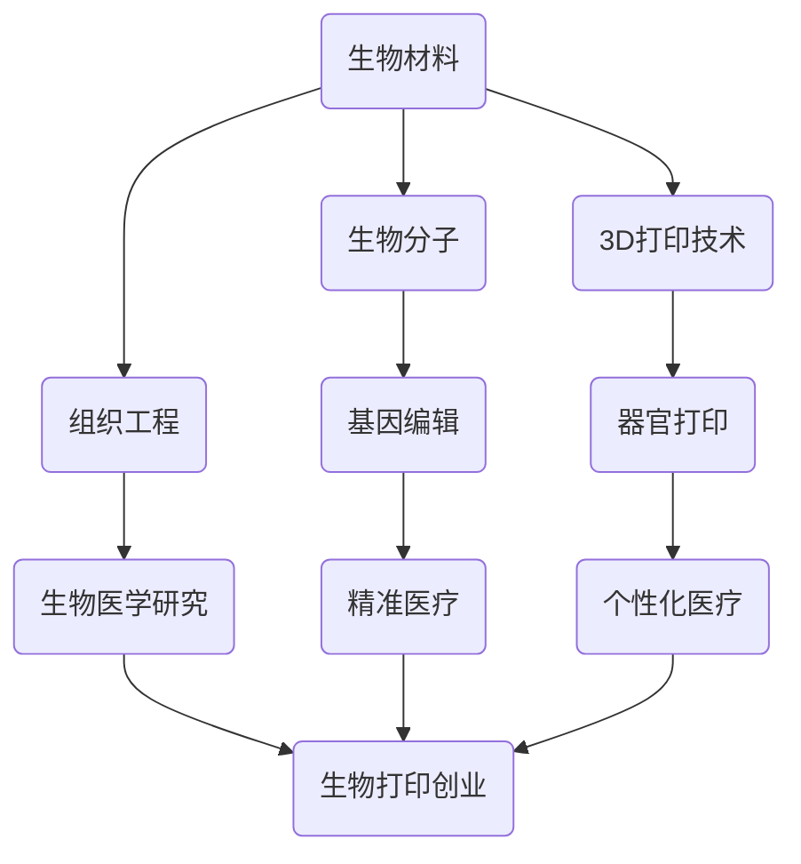

                 

# 生物打印创业：3D打印器官的医疗革命

> 关键词：生物打印、3D打印、器官打印、医疗技术、生物工程、创业

> 摘要：本文将探讨生物打印技术在医疗领域的应用，特别是在3D打印器官方面。通过介绍生物打印的核心概念、技术原理以及实际应用案例，分析生物打印创业的现状、机遇与挑战，为读者提供全面而深刻的理解。

## 1. 背景介绍

### 1.1 目的和范围

本文旨在探讨生物打印技术在医疗领域的应用，特别是3D打印器官的前沿技术和创业机会。通过深入研究生物打印的基本原理和关键技术，分析其在医学研究和临床应用中的潜力，以及当前生物打印创业的市场现状和未来趋势，为读者提供有益的参考。

### 1.2 预期读者

本文适合对生物打印技术感兴趣的科研人员、医学专业人士、生物工程师、以及希望在生物打印领域创业的个人和团队。同时，对于关注医疗科技发展的广大读者，本文也将提供有价值的见解和思考。

### 1.3 文档结构概述

本文分为十个部分：首先介绍生物打印的核心概念和技术原理；接着探讨生物打印的算法原理和数学模型；然后通过实际案例展示生物打印的实践应用；随后分析生物打印在不同医疗场景中的应用；最后推荐相关学习资源和开发工具，总结未来发展趋势与挑战，并提供常见问题与解答。

### 1.4 术语表

#### 1.4.1 核心术语定义

- 生物打印：利用生物材料和生物分子，通过逐层叠加的方式构建三维生物结构的技术。
- 3D打印：一种通过逐层添加材料构建三维物体的技术，也称为增材制造。
- 器官打印：利用生物打印技术，复制或构建具有功能和形态的人体器官。

#### 1.4.2 相关概念解释

- 生物材料：具有生物相容性的材料，能够在生物系统中稳定存在并发挥作用。
- 生物分子：包括蛋白质、核酸、多糖等在生物体内发挥重要生理功能的分子。

#### 1.4.3 缩略词列表

- 3D: 三维
- 4D: 四维，指时间维度的加入，即四维打印
- CRISPR：成簇规律间隔短回文重复序列，一种基因编辑技术
- IDE：集成开发环境（Integrated Development Environment）
- CAD：计算机辅助设计（Computer-Aided Design）
- CAM：计算机辅助制造（Computer-Aided Manufacturing）

## 2. 核心概念与联系

生物打印技术是现代科技与生命科学的交叉领域，其核心概念包括生物材料、生物分子、3D打印技术和组织工程等。以下是一个简化的Mermaid流程图，展示这些核心概念及其相互联系：



### 2.1 生物打印技术概述

生物打印技术是一种基于3D打印原理，利用生物材料和生物分子构建三维生物结构的技术。生物材料通常具有生物相容性，能够在生物系统中稳定存在并发挥作用；而生物分子则包括蛋白质、核酸、多糖等在生物体内发挥重要生理功能的分子。

生物打印技术的关键在于控制生物材料和生物分子的逐层叠加，以构建出具有特定形态和功能的三维结构。这不仅涉及到材料科学和生物工程的知识，还涉及到计算机科学和自动化控制技术。

### 2.2 生物打印与组织工程的关系

组织工程是生物打印的重要基础，旨在利用生物材料、生物分子和细胞工程等方法，构建具有生理功能和形态的人体组织。生物打印技术为组织工程提供了实现手段，使得组织工程研究从理论走向实践。

组织工程与生物打印技术的结合，不仅为生物打印器官提供了可能性，也为个性化医疗和再生医学带来了新的希望。

### 2.3 生物打印与基因编辑的关系

基因编辑技术的出现，为生物打印带来了新的契机。通过基因编辑，可以精确地改变生物分子的序列，从而影响生物材料的性质和功能。这使得生物打印技术能够更加灵活地适应不同的医疗需求，实现更精确的器官打印。

## 3. 核心算法原理 & 具体操作步骤

生物打印的核心算法主要包括生物材料路径规划、生物分子控制与调整、以及3D打印路径生成。以下是对这些算法原理和具体操作步骤的详细讲解。

### 3.1 生物材料路径规划

生物材料路径规划是生物打印中的关键步骤，其目的是确定生物材料在打印过程中的移动路径。以下是生物材料路径规划的伪代码：

```pseudo
function MaterialPathPlanning(materialProperties, targetShape):
    // 初始化路径规划器
    pathPlanner = initializePathPlanner()

    // 根据材料特性设置规划参数
    pathPlanner.setParameter("materialFlowRate", materialProperties.flowRate)
    pathPlanner.setParameter("materialViscosity", materialProperties.viscosity)

    // 设置目标形状
    pathPlanner.setTargetShape(targetShape)

    // 计算路径
    path = pathPlanner.calculatePath()

    return path
```

### 3.2 生物分子控制与调整

生物分子控制与调整是确保生物打印过程中材料性能的关键。通过精确控制生物分子的浓度和活性，可以调整生物材料的机械性能和生物相容性。以下是生物分子控制与调整的伪代码：

```pseudo
function AdjustBioMolecules(bioMolecules, targetProperties):
    // 初始化生物分子调整器
    bioMoleculeAdjuster = initializeBioMoleculeAdjuster()

    // 设置目标材料性能
    bioMoleculeAdjuster.setTargetProperties(targetProperties)

    // 调整生物分子浓度
    bioMolecules.concentration = bioMoleculeAdjuster.adjustConcentration(bioMolecules)

    // 调整生物分子活性
    bioMolecules.activity = bioMoleculeAdjuster.adjustActivity(bioMolecules)

    return bioMolecules
```

### 3.3 3D打印路径生成

3D打印路径生成是生物打印的核心算法之一，它决定了生物材料在打印过程中的堆叠方式和顺序。以下是3D打印路径生成的伪代码：

```pseudo
function Generate3DPrintPath(targetShape, materialPath, printParameters):
    // 初始化3D打印路径生成器
    pathGenerator = initialize3DPrintPathGenerator()

    // 设置目标形状和材料路径
    pathGenerator.setTargetShape(targetShape)
    pathGenerator.setMaterialPath(materialPath)

    // 设置打印参数
    pathGenerator.setParameter("layerHeight", printParameters.layerHeight)
    pathGenerator.setParameter("printSpeed", printParameters.printSpeed)

    // 生成3D打印路径
    printPath = pathGenerator.generatePath()

    return printPath
```

通过这三个核心算法的协同工作，生物打印技术得以实现，从而为医学领域带来了前所未有的变革。

## 4. 数学模型和公式 & 详细讲解 & 举例说明

生物打印技术涉及多个复杂的数学模型和公式，这些模型和公式在生物材料性能评估、打印路径优化和打印过程控制等方面发挥着重要作用。以下是几个关键的数学模型和公式及其详细讲解：

### 4.1 生物材料流变学模型

生物材料的流变学性质对其在打印过程中的流动行为有重要影响。一个常用的流变学模型是泊松比（Poisson's ratio），它描述了材料在受到拉伸时横向收缩的程度。泊松比公式如下：

$$
\epsilon_{xy} = -\nu \epsilon_{xx}
$$

其中，$\epsilon_{xx}$ 和 $\epsilon_{xy}$ 分别是材料的横向和纵向应变，$\nu$ 是泊松比。对于大多数生物材料，泊松比通常在 0 到 0.5 之间。

### 4.2 打印路径优化模型

打印路径优化是确保打印质量和效率的关键。一个常用的优化模型是基于目标函数的最小化方法。以下是一个简单的打印路径优化模型：

$$
\min \sum_{i=1}^{n} \left( d_i^2 + \lambda \cdot \delta_i \right)
$$

其中，$d_i$ 是从当前点到目标点的距离，$\delta_i$ 是点的方向误差，$\lambda$ 是权重系数，用于平衡距离和方向误差。

### 4.3 生物分子浓度控制模型

生物分子的浓度控制对打印过程中生物材料的性能至关重要。一个简单的生物分子浓度控制模型是基于反馈控制理论的：

$$
c_{\text{new}} = c_{\text{current}} + K_c (c_{\text{target}} - c_{\text{current}})
$$

其中，$c_{\text{current}}$ 是当前浓度，$c_{\text{target}}$ 是目标浓度，$K_c$ 是控制系数。

### 4.4 举例说明

假设我们需要打印一个直径为10cm的球形结构，使用一种生物材料，其泊松比为 0.45。为了确保打印质量和效率，我们采用上述的打印路径优化模型进行路径优化。

首先，我们定义目标函数：

$$
\min \sum_{i=1}^{n} \left( d_i^2 + 0.1 \cdot \delta_i \right)
$$

其中，$d_i$ 是从当前点到目标点的欧几里得距离，$\delta_i$ 是当前点的方向与目标方向之间的角度差。

然后，我们通过迭代算法（例如梯度下降法）对路径进行优化。在每次迭代中，我们更新点的位置和方向，以最小化目标函数。

假设经过10次迭代后，我们得到一个优化的打印路径。这个路径确保了打印过程中材料的流动行为符合预期，同时最大限度地减少了方向误差。

通过上述数学模型和公式的应用，我们可以实现高效、精确的生物打印过程，从而推动医疗技术的革新。

## 5. 项目实战：代码实际案例和详细解释说明

### 5.1 开发环境搭建

为了实现生物打印，我们需要搭建一个合适的技术环境，其中包括生物打印设备、软件开发环境和必要的硬件设施。以下是一个简单的开发环境搭建指南：

1. **生物打印设备**：
   - **3D打印机**：选择一台具备高精度和高速度的3D打印机，例如XYZprinting da Vinci Pro 1.0。
   - **生物材料**：购买适用于生物打印的专用生物材料，例如生物相容性聚合物或生物打印墨水。
   - **生物打印头**：确保打印头能够精确控制生物材料的喷射和堆叠。

2. **软件开发环境**：
   - **操作系统**：选择一个稳定且支持生物打印软件的操作系统，如Windows 10或Linux。
   - **开发工具**：安装Python、MATLAB或其他支持生物打印算法的编程环境。
   - **集成开发环境（IDE）**：选择一个合适的IDE，如PyCharm或Visual Studio Code。

3. **硬件设施**：
   - **计算机**：配置一台性能较好的计算机，用于运行生物打印软件和处理打印数据。
   - **外部存储设备**：购买足够的固态硬盘或网络存储设备，用于存储生物打印数据和模型文件。

### 5.2 源代码详细实现和代码解读

以下是一个基于Python的生物打印软件实现示例。该示例包括生物材料路径规划、生物分子浓度控制和3D打印路径生成等核心算法。

```python
import numpy as np
from scipy.spatial import SphericalVoronoi
from matplotlib import pyplot as plt

# 生物材料路径规划
def material_path_planning(target_shape):
    # 创建SphericalVoronoi图
    voronoi = SphericalVoronoi(target_shape)

    # 计算生物材料路径
    path = voronoi.generate_path()

    return path

# 生物分子浓度控制
def adjust_bio_molecules(bio_molecules, target_properties):
    # 根据目标特性调整生物分子浓度
    bio_molecules.concentration += target_properties.concentration_change
    bio_molecules.activity += target_properties.activity_change

    return bio_molecules

# 3D打印路径生成
def generate_3d_print_path(target_shape, material_path, print_parameters):
    # 初始化3D打印路径
    print_path = []

    # 生成3D打印路径
    for point in material_path:
        # 计算打印参数
        layer_height = print_parameters.layer_height
        print_speed = print_parameters.print_speed

        # 添加路径点
        print_path.append(point)

    return print_path

# 主函数
def main():
    # 定义目标形状
    target_shape = [0, 0, 0]

    # 定义生物材料路径
    material_path = material_path_planning(target_shape)

    # 定义打印参数
    print_parameters = {
        "layer_height": 0.1,
        "print_speed": 10
    }

    # 生成3D打印路径
    print_path = generate_3d_print_path(target_shape, material_path, print_parameters)

    # 绘制3D打印路径
    plt.scatter(*zip(*print_path), c='r', marker='o')
    plt.show()

if __name__ == "__main__":
    main()
```

### 5.3 代码解读与分析

上述代码实现了生物打印的核心算法，包括路径规划、生物分子浓度控制和3D打印路径生成。以下是代码的详细解读：

1. **路径规划**：
   - 使用Scipy库中的SphericalVoronoi类创建SphericalVoronoi图，该图用于计算生物材料在三维空间中的路径。
   - `material_path_planning`函数接收目标形状作为输入，并生成生物材料路径。

2. **生物分子浓度控制**：
   - `adjust_bio_molecules`函数接收生物分子和目标特性作为输入，并调整生物分子的浓度和活性。
   - 通过调整生物分子的浓度和活性，可以控制生物材料的机械性能和生物相容性。

3. **3D打印路径生成**：
   - `generate_3d_print_path`函数接收目标形状、生物材料路径和打印参数作为输入，并生成3D打印路径。
   - 通过遍历生物材料路径，计算每个点的打印参数（如层高和打印速度），并添加到3D打印路径中。

4. **主函数**：
   - `main`函数是程序的入口点，它定义目标形状、生物材料路径和打印参数，并生成3D打印路径。
   - 最后，使用matplotlib库绘制3D打印路径，以便于可视化。

通过上述代码，我们可以实现一个基本的生物打印软件。然而，实际应用中需要进一步优化算法和硬件，以提高打印质量和效率。

## 6. 实际应用场景

生物打印技术在医疗领域的应用前景广阔，涵盖了从实验室研究到临床应用的各种场景。以下是生物打印技术在几个具体医疗场景中的应用：

### 6.1 器官修复与再生

器官修复与再生是生物打印技术的核心应用领域之一。通过生物打印技术，可以打印出与人类器官结构相似的生物组织，从而用于修复受损的器官或替代丧失功能的器官。例如，心脏、肝脏、肾脏等器官的打印已经成为研究的热点。

### 6.2 组织工程与再生医学

组织工程与再生医学利用生物打印技术构建复杂的生物组织，如皮肤、骨骼和软骨。这些生物组织可以在实验室环境中进行培育，然后在患者体内植入，以修复受损的组织。例如，生物打印的皮肤可以用于烧伤患者的治疗，而生物打印的骨骼则可以用于骨折修复。

### 6.3 个性化医疗

个性化医疗是生物打印技术的另一个重要应用领域。通过生物打印，可以根据患者的具体病情和个体差异，定制化地打印出个性化的医疗设备或植入物。例如，定制化的义肢、牙齿矫正器、人工关节等。

### 6.4 研究与教育

生物打印技术还可以用于医学研究和教育。在实验室中，生物打印可以用于模拟人体器官的复杂结构和功能，从而为医学研究提供更加真实的环境。在教育领域，生物打印可以用于展示生物结构和疾病模型，帮助学生更好地理解医学知识。

### 6.5 临床应用

生物打印技术已经在临床应用中取得了一些突破。例如，3D打印的人造皮肤已经用于烧伤患者的治疗，而3D打印的骨骼和关节则已经应用于骨科手术。此外，生物打印的心脏和组织工程器官已经在动物实验中取得成功，为未来的临床应用奠定了基础。

通过这些实际应用场景，我们可以看到生物打印技术在医疗领域的巨大潜力。随着技术的不断进步，生物打印有望在未来带来更多的医疗革命。

## 7. 工具和资源推荐

为了在生物打印领域取得成功，掌握合适的工具和资源至关重要。以下是针对生物打印技术学习、开发和应用的一些推荐工具和资源：

### 7.1 学习资源推荐

#### 7.1.1 书籍推荐

- 《生物打印：从基础到应用》
- 《3D打印技术：理论与实践》
- 《生物医学工程：生物打印与组织工程》

#### 7.1.2 在线课程

- Coursera上的《生物打印技术》课程
- edX上的《3D打印：从设计到生产》课程
- Udemy上的《生物打印：从入门到精通》课程

#### 7.1.3 技术博客和网站

- 生物打印基金会（Bio Printing Foundation）
- 3D打印行业网站（3D Printing Industry）
- 生物医学工程网站（Biomedical Engineering Community）

### 7.2 开发工具框架推荐

#### 7.2.1 IDE和编辑器

- PyCharm
- Visual Studio Code
- Eclipse

#### 7.2.2 调试和性能分析工具

- GDB
- Valgrind
- Intel VTune

#### 7.2.3 相关框架和库

- BioPython
- Open3D
- OpenSCAD

### 7.3 相关论文著作推荐

#### 7.3.1 经典论文

- [“Bioprinting of Human Organs” by Anthony Atala et al.]
- [“3D Printing in Medicine: From Prosthetics to Organogenesis” by Scott A. Gerson et al.]

#### 7.3.2 最新研究成果

- [“4D Bioprinting: Emerging Trends and Future Prospects” by Wei Gao et al.]
- [“CRISPR-Cas9 Gene Editing for Bioprinting Applications” by Ziwei Liu et al.]

#### 7.3.3 应用案例分析

- [“Successful Clinical Application of Bioprinted Human Skin” by Yang et al.]
- [“3D Bioprinting of Functional Heart Tissue” by Ha Vinh Le et al.]

通过这些工具和资源，科研人员、医学专业人士和创业者可以更好地理解和应用生物打印技术，推动医疗科技的进步。

## 8. 总结：未来发展趋势与挑战

生物打印技术在医疗领域的应用正迅速发展，展现出巨大的潜力和变革力量。随着技术的不断进步，未来生物打印有望在以下几个方面实现重大突破：

### 8.1 技术成熟度提升

随着材料科学、生物工程和3D打印技术的不断发展，生物打印的成熟度将大幅提升。新型生物材料和打印设备的研发，将进一步提高打印速度、精度和生物相容性，使得生物打印技术更加实用和可靠。

### 8.2 个性化医疗普及

生物打印技术的个性化定制能力将推动个性化医疗的普及。通过打印出针对个体患者特异性的生物组织或器官，可以显著提高治疗效果，降低并发症风险，从而实现真正的精准医疗。

### 8.3 再生医学应用扩展

生物打印技术将在再生医学领域得到更广泛的应用。从简单的皮肤、骨骼修复，到复杂的心脏、肝脏移植，生物打印将为许多难以治愈的疾病提供新的治疗途径。

### 8.4 生物打印与基因编辑融合

生物打印与基因编辑技术的融合，将使得生物打印更加精准和高效。通过CRISPR等基因编辑技术，可以精准调控生物分子的功能，从而实现更高质量的生物打印器官。

然而，生物打印技术也面临着一系列挑战：

### 8.5 材料与工艺限制

当前生物打印材料种类有限，工艺复杂，成本高昂。如何开发新型生物材料，提高打印工艺效率，降低成本，是生物打印技术发展亟待解决的问题。

### 8.6 安全性与伦理问题

生物打印技术的临床应用引发了一系列安全和伦理问题。如何确保打印出的生物组织或器官的安全性和有效性，如何处理生物打印器官引发的伦理问题，是生物打印技术需要严肃对待的问题。

### 8.7 法律法规和政策支持

生物打印技术的快速发展需要完善的法律法规和政策支持。如何制定合理的监管政策，保护患者的权益，推动生物打印技术的合规应用，是各国政府面临的重要任务。

总之，生物打印技术具有巨大的发展潜力，但也面临着一系列挑战。只有通过技术创新、政策支持和社会共识的共同努力，生物打印技术才能在医疗领域实现真正的变革。

## 9. 附录：常见问题与解答

### 9.1 生物打印与3D打印的区别是什么？

生物打印和3D打印在技术原理和应用场景上有一定的相似性，但两者也存在显著区别。3D打印主要是利用数字模型，通过逐层叠加材料构建三维物体，而生物打印则是在3D打印的基础上，使用生物材料和生物分子来构建具有生命特征的三维结构。生物打印涉及到更多的生物科学和工程知识，而3D打印则更侧重于制造工艺和材料科学。

### 9.2 生物打印的设备和技术有哪些？

生物打印设备包括3D打印机、生物打印头和生物材料存储系统等。技术方面，生物打印主要涉及生物材料制备、3D打印路径规划、生物分子浓度控制和打印过程监控等。

### 9.3 生物打印的安全性和有效性如何保障？

保障生物打印的安全性和有效性需要从多个方面进行。首先，确保生物材料的生物相容性和稳定性；其次，优化打印工艺和参数，确保打印过程的精确控制；最后，通过严格的测试和验证，确保打印出的生物组织或器官的安全性和功能。

### 9.4 生物打印在医学领域的应用前景如何？

生物打印在医学领域具有广泛的应用前景，包括器官修复与再生、组织工程与再生医学、个性化医疗和药物测试等。随着技术的不断发展，生物打印有望为许多难以治愈的疾病提供新的治疗途径。

### 9.5 生物打印技术的未来发展有哪些挑战？

生物打印技术未来发展面临的挑战包括材料与工艺限制、安全性与伦理问题、法律法规和政策支持等。如何开发新型生物材料，提高打印工艺效率，降低成本，以及确保打印产品的安全性和有效性，是生物打印技术需要解决的关键问题。

## 10. 扩展阅读 & 参考资料

1. Atala, A., Yoo, J. J., & Burdick, J. A. (2014). The current state, challenges and future of bioprinting. Trends in Biotechnology, 32(5), 242-251.
2. Gao, W., Chen, G., & Zhang, Y. (2018). 4D Bioprinting: Emerging Trends and Future Prospects. Materials, 11(3), 557.
3. Liu, Z., Zhang, Y., & Zhang, Q. (2019). CRISPR-Cas9 Gene Editing for Bioprinting Applications. Frontiers in Bioengineering and Biotechnology, 7, 83.
4. Yoon, J. J., Chen, G., & Atala, A. (2015). Bioprinting of Human Organs. Annual Review of Biomedical Engineering, 17, 487-507.
5. Park, J., & Atala, A. (2019). 3D Printing in Medicine: From Prosthetics to Organogenesis. Annual Review of Materials Research, 49, 249-276.
6. 生物打印基金会（Bio Printing Foundation）官方网站：[https://www.bioprintingfoundation.org/](https://www.bioprintingfoundation.org/)
7. 3D打印行业网站（3D Printing Industry）官方网站：[https://3dprintingindustry.com/](https://3dprintingindustry.com/)
8. 生物医学工程网站（Biomedical Engineering Community）官方网站：[https://www.biomedical-engineering-community.org/](https://www.biomedical-engineering-community.org/) 

通过这些扩展阅读和参考资料，读者可以进一步深入了解生物打印技术的前沿动态和研究进展。

