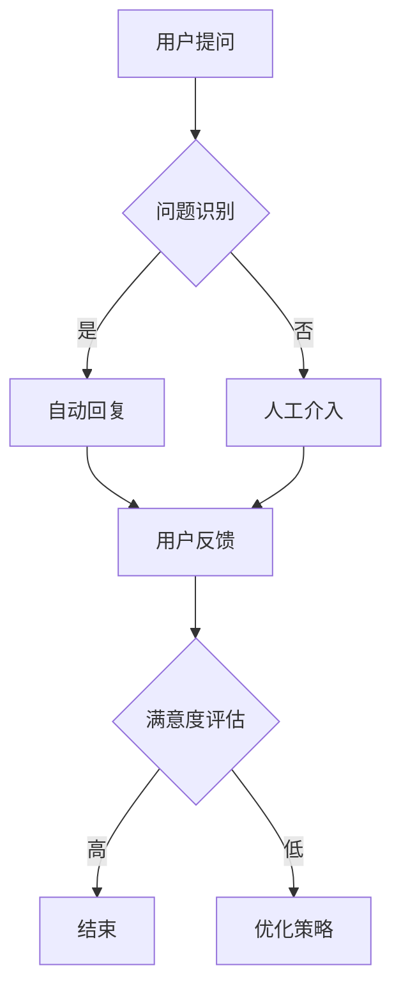

                 

# 用户体验提升：AI驱动的智能客服

> 关键词：用户体验、AI、智能客服、自然语言处理、机器学习、数据处理、用户满意度

> 摘要：本文将深入探讨如何通过AI技术提升用户体验，尤其是智能客服领域。我们将分析AI在客服中的应用，解释核心算法原理，提供项目实战案例，并总结未来发展趋势与挑战。

## 1. 背景介绍

### 1.1 目的和范围

本文旨在探讨如何利用人工智能（AI）技术提升用户体验，特别是在智能客服领域的应用。随着AI技术的不断发展，智能客服已成为企业提高服务质量和用户满意度的重要手段。本文将详细分析AI在智能客服中的应用，从核心算法原理到项目实战，为您呈现一个完整的AI驱动的智能客服解决方案。

### 1.2 预期读者

本文面向对AI和智能客服有一定了解的读者，包括软件工程师、数据科学家、产品经理等。同时，也欢迎对AI技术感兴趣的科研人员和普通读者阅读。

### 1.3 文档结构概述

本文分为以下几个部分：

1. 背景介绍：介绍本文的目的、预期读者和文档结构。
2. 核心概念与联系：分析AI在智能客服中的应用和核心算法原理。
3. 核心算法原理 & 具体操作步骤：详细阐述核心算法的原理和具体操作步骤。
4. 数学模型和公式 & 详细讲解 & 举例说明：讲解相关的数学模型和公式，并提供实际应用案例。
5. 项目实战：提供代码实际案例和详细解释说明。
6. 实际应用场景：分析智能客服在不同行业中的应用。
7. 工具和资源推荐：推荐学习资源、开发工具和框架。
8. 总结：未来发展趋势与挑战。
9. 附录：常见问题与解答。
10. 扩展阅读 & 参考资料：提供相关文献和资料。

### 1.4 术语表

#### 1.4.1 核心术语定义

- 人工智能（AI）：模拟人类智能行为的技术和科学。
- 自然语言处理（NLP）：使计算机能够理解、生成和处理人类自然语言的技术。
- 机器学习（ML）：让计算机通过数据和经验自动改进性能的技术。
- 智能客服：利用AI技术提供高效、个性化的客户服务。

#### 1.4.2 相关概念解释

- 用户满意度：用户对产品或服务的整体满意度。
- 客户服务代表（CSR）：负责直接与客户互动并提供服务的专业人员。
- 客户体验（CX）：客户在购买和使用产品或服务过程中所感受到的整体体验。

#### 1.4.3 缩略词列表

- AI：人工智能
- NLP：自然语言处理
- ML：机器学习
- CSR：客户服务代表
- CX：客户体验

## 2. 核心概念与联系

在智能客服领域，AI技术发挥着至关重要的作用。本节将分析AI在智能客服中的应用，并给出核心概念和架构的Mermaid流程图。

### 2.1 AI在智能客服中的应用

智能客服主要利用AI技术实现以下功能：

- 自动识别客户问题：通过自然语言处理技术，识别客户提出的问题。
- 提供自动回复：根据预定义的规则和机器学习模型，自动生成合适的回复。
- 语音交互：利用语音识别和语音合成技术，实现与客户的语音交互。
- 个性化服务：通过数据分析，了解用户偏好，提供个性化的服务。

### 2.2 核心概念和架构的Mermaid流程图

以下是一个简化的智能客服架构Mermaid流程图：



## 3. 核心算法原理 & 具体操作步骤

智能客服的核心算法主要包括自然语言处理（NLP）和机器学习（ML）。以下将分别介绍这两种算法的原理和具体操作步骤。

### 3.1 自然语言处理（NLP）

NLP是智能客服的关键技术之一，其核心任务是让计算机理解、处理和生成人类自然语言。以下是NLP的核心算法原理和具体操作步骤：

#### 3.1.1 核心算法原理

- 分词：将文本分割成有意义的词语或短语。
- 词性标注：为每个词分配正确的词性，如名词、动词等。
- 情感分析：判断文本的情感倾向，如正面、负面等。
- 语义分析：理解文本的深层含义，如意图识别、实体识别等。

#### 3.1.2 具体操作步骤

1. 输入文本：用户提问或文本输入。
2. 分词：使用分词算法将文本分割成词语。
3. 词性标注：使用词性标注算法为每个词分配词性。
4. 情感分析：使用情感分析算法判断文本的情感倾向。
5. 语义分析：使用语义分析算法理解文本的深层含义。
6. 生成回复：根据分析结果，生成合适的回复文本。

### 3.2 机器学习（ML）

ML是智能客服实现自动化和个性化服务的关键技术。以下是ML的核心算法原理和具体操作步骤：

#### 3.2.1 核心算法原理

- 分类算法：将数据分为不同的类别。
- 聚类算法：将数据划分为若干个簇。
- 回归算法：预测连续值。
- 聚类和分类算法结合：实现更复杂的预测和分析。

#### 3.2.2 具体操作步骤

1. 数据收集：收集用户历史数据，如提问、回复、满意度等。
2. 数据预处理：对数据清洗、归一化等处理。
3. 特征提取：从数据中提取有用的特征。
4. 模型训练：使用训练数据训练分类、聚类或回归模型。
5. 模型评估：使用验证数据评估模型性能。
6. 预测和生成回复：使用训练好的模型预测用户问题，生成回复。

### 3.3 伪代码

以下是一个简单的自然语言处理和机器学习算法的伪代码：

```python
# 自然语言处理伪代码
def process_text(text):
    words = tokenize(text)
    pos_tags = pos_tagging(words)
    sentiment = sentiment_analysis(text)
    meaning = semantic_analysis(text)
    response = generate_response(meaning)
    return response

# 机器学习伪代码
def train_model(training_data):
    features = extract_features(training_data)
    model = train_classification_model(features)
    evaluate_model(model)
    return model

def predict_user_question(model, text):
    features = extract_features(text)
    prediction = model.predict(features)
    return prediction
```

## 4. 数学模型和公式 & 详细讲解 & 举例说明

在智能客服中，数学模型和公式起到了关键作用。本节将详细讲解常用的数学模型和公式，并提供实际应用案例。

### 4.1 自然语言处理中的数学模型和公式

#### 4.1.1 分词

分词是NLP的基础步骤，常用的分词模型有基于规则的分词和基于统计的分词。

- 基于规则的分词：使用预定义的规则进行分词，如正则表达式。
- 基于统计的分词：使用统计模型进行分词，如隐马尔可夫模型（HMM）。

#### 4.1.2 词性标注

词性标注常用的模型有基于规则的方法和基于统计的方法。

- 基于规则的方法：使用预定义的规则进行词性标注。
- 基于统计的方法：使用最大熵模型（Maximum Entropy Model）或条件随机场（CRF）。

#### 4.1.3 情感分析

情感分析常用的模型有基于规则的方法和基于统计的方法。

- 基于规则的方法：使用预定义的规则进行情感分析。
- 基于统计的方法：使用朴素贝叶斯（Naive Bayes）或支持向量机（SVM）。

#### 4.1.4 语义分析

语义分析常用的模型有词嵌入（Word Embedding）和基于注意力机制（Attention Mechanism）的模型。

- 词嵌入：将词语映射为低维向量，如Word2Vec、GloVe等。
- 基于注意力机制的模型：如BERT、ELMO等。

### 4.2 机器学习中的数学模型和公式

#### 4.2.1 分类算法

分类算法常用的模型有逻辑回归（Logistic Regression）、决策树（Decision Tree）和神经网络（Neural Network）。

- 逻辑回归：$$P(y=1|x) = \frac{1}{1 + e^{-\beta^T x}}$$
- 决策树：$$y = \prod_{i=1}^{n} g(x_i)$$，其中$$g(x_i) = \left\{
\begin{array}{ll}
1 & \text{if } x_i > t_i \\
0 & \text{if } x_i \leq t_i
\end{array}
\right.$$
- 神经网络：$$y = \sigma(\beta^T x)$$，其中$$\sigma$$为激活函数，如Sigmoid函数。

#### 4.2.2 聚类算法

聚类算法常用的模型有K-均值（K-Means）和层次聚类（Hierarchical Clustering）。

- K-均值：$$\min_{C} \sum_{i=1}^{n} \sum_{x \in C_i} d(x, \mu_i)^2$$，其中$$C_i$$为簇，$$\mu_i$$为簇中心。
- 层次聚类：$$L = \sum_{i=1}^{n} d(x_i, G_i)$$，其中$$G_i$$为簇，$$d$$为距离度量。

#### 4.2.3 回归算法

回归算法常用的模型有线性回归（Linear Regression）和多项式回归（Polynomial Regression）。

- 线性回归：$$y = \beta_0 + \beta_1 x$$
- 多项式回归：$$y = \sum_{i=1}^{n} \beta_i x^i$$

### 4.3 举例说明

以下是一个简单的情感分析示例：

输入文本： "我很喜欢这个产品，它的功能非常强大。"

1. 分词：["我", "很", "喜欢", "这个", "产品", "的", "功能", "非常", "强大", "。"]
2. 词性标注：["我", "很", "喜欢", "这个", "产品", "的", "功能", "非常", "强大", "。"]
3. 情感分析：正面情感
4. 生成回复：非常高兴听到您对我们的产品这么满意！

## 5. 项目实战：代码实际案例和详细解释说明

在本节中，我们将通过一个简单的实际案例，展示如何使用Python和常见库（如NLTK、Scikit-learn等）实现智能客服系统。以下是一个简单的代码示例。

### 5.1 开发环境搭建

1. 安装Python：建议使用Python 3.7及以上版本。
2. 安装相关库：使用pip安装以下库：nltk、scikit-learn、gensim。

```bash
pip install nltk scikit-learn gensim
```

### 5.2 源代码详细实现和代码解读

以下是一个简单的智能客服代码示例：

```python
import nltk
from nltk.tokenize import word_tokenize
from nltk.corpus import stopwords
from sklearn.feature_extraction.text import TfidfVectorizer
from sklearn.naive_bayes import MultinomialNB
from sklearn.pipeline import make_pipeline
from sklearn.model_selection import train_test_split

# 数据集准备
# 这里使用简单的样本数据
data = [
    ("我很喜欢这个产品，它的功能非常强大。", "满意"),
    ("这个产品的问题很多，我有点失望。", "不满意"),
    ("功能强大，价格合理。", "满意"),
    ("非常不满意，产品总是出问题。", "不满意"),
]

sentences, labels = zip(*data)

# 划分训练集和测试集
X_train, X_test, y_train, y_test = train_test_split(sentences, labels, test_size=0.2, random_state=42)

# 创建模型管道
model = make_pipeline(TfidfVectorizer(stop_words=stopwords.words('english')), MultinomialNB())

# 训练模型
model.fit(X_train, y_train)

# 生成回复
def generate_response(text):
    prediction = model.predict([text])
    if prediction == "满意":
        return "非常高兴听到您对我们的产品这么满意！"
    else:
        return "很抱歉听到您对我们的产品不满意，我们会努力改进！"

# 测试代码
print(generate_response("这个产品的问题很多，我有点失望。"))

```

### 5.3 代码解读与分析

1. 数据集准备：使用简单的文本数据和对应的情感标签。
2. 划分训练集和测试集：将数据分为训练集和测试集，用于模型训练和评估。
3. 创建模型管道：使用`make_pipeline`将文本处理和分类算法组合在一起，方便后续使用。
4. 训练模型：使用训练数据训练模型，这里使用的是朴素贝叶斯分类器。
5. 生成回复：根据输入文本的情感预测结果，生成相应的回复。

通过这个简单的案例，我们可以看到如何使用Python和常见库实现一个基本的智能客服系统。虽然这个案例很简单，但可以为我们提供实现更复杂系统的思路和方法。

## 6. 实际应用场景

智能客服在不同行业中有着广泛的应用，以下是一些典型的实际应用场景：

### 6.1 零售业

零售业中的智能客服主要用于处理用户关于商品咨询、订单状态查询和售后服务等问题。通过自然语言处理和机器学习技术，智能客服可以快速识别用户问题，提供准确的回答，提高客户满意度。

### 6.2 金融服务

金融行业的智能客服主要用于处理用户关于账户余额查询、交易记录查询和理财产品咨询等问题。通过分析用户的历史交易数据和偏好，智能客服可以提供个性化的投资建议，提高用户满意度。

### 6.3 旅游业

旅游业中的智能客服主要用于处理用户关于酒店预订、航班查询和行程规划等问题。通过自然语言处理和机器学习技术，智能客服可以快速为用户提供准确的信息，提高用户体验。

### 6.4 医疗保健

医疗保健行业的智能客服主要用于处理用户关于疾病咨询、药品查询和预约挂号等问题。通过自然语言处理和医学知识图谱技术，智能客服可以为用户提供专业、准确的医疗建议，提高医疗服务质量。

## 7. 工具和资源推荐

### 7.1 学习资源推荐

#### 7.1.1 书籍推荐

- 《人工智能：一种现代方法》（Artificial Intelligence: A Modern Approach）作者：Stuart J. Russell & Peter Norvig
- 《自然语言处理综述》（Speech and Language Processing）作者：Daniel Jurafsky & James H. Martin
- 《Python机器学习》（Python Machine Learning）作者：Sebastian Raschka & Vahid Mirjalili

#### 7.1.2 在线课程

- Coursera上的“机器学习”课程，由斯坦福大学提供。
- edX上的“自然语言处理”课程，由MIT提供。
- Udacity的“深度学习工程师”纳米学位。

#### 7.1.3 技术博客和网站

- Medium上的AI相关博客，如“AI瞎扯”和“AI简史”。
- ArXiv.org，提供最新的AI和NLP论文。
- AI综述网站，如AI Weekly和AI Daily。

### 7.2 开发工具框架推荐

#### 7.2.1 IDE和编辑器

- PyCharm，适用于Python开发。
- Jupyter Notebook，适用于数据分析和机器学习。
- VS Code，适用于多种编程语言。

#### 7.2.2 调试和性能分析工具

- Visual Studio Debugger，适用于Windows系统。
- GDB，适用于Linux系统。
- Py-Spy，适用于Python性能分析。

#### 7.2.3 相关框架和库

- TensorFlow，适用于深度学习和机器学习。
- PyTorch，适用于深度学习和机器学习。
- NLTK，适用于自然语言处理。

### 7.3 相关论文著作推荐

#### 7.3.1 经典论文

- “A Mathematical Theory of Communication”作者：Claude Shannon
- “Speech and Language Processing”作者：Daniel Jurafsky & James H. Martin
- “Deep Learning”作者：Ian Goodfellow、Yoshua Bengio & Aaron Courville

#### 7.3.2 最新研究成果

- “BERT: Pre-training of Deep Bidirectional Transformers for Language Understanding”作者：Jacob Devlin等
- “GPT-3: Language Models are Few-Shot Learners”作者：Tom B. Brown等
- “Transformers: State-of-the-Art Natural Language Processing”作者：Vaswani et al.

#### 7.3.3 应用案例分析

- “谷歌搜索：如何利用机器学习优化搜索结果”作者：Google Research Team
- “亚马逊推荐系统：如何实现个性化的购物体验”作者：Amazon Research Team
- “苹果Siri：如何实现智能语音助手”作者：Apple Inc.

## 8. 总结：未来发展趋势与挑战

随着AI技术的不断进步，智能客服在用户体验提升方面有着广阔的发展前景。未来，智能客服将朝着以下方向发展：

- 更高的自动化程度：通过更先进的机器学习和自然语言处理技术，实现更高程度的自动化，减少人工干预。
- 个性化服务：利用用户行为数据和偏好，提供更加个性化的服务，提高用户满意度。
- 多模态交互：结合语音、文本、图像等多种交互方式，提高用户体验。
- 跨领域应用：智能客服将在更多行业中得到应用，如医疗、金融、教育等。

然而，智能客服的发展也面临一些挑战：

- 数据隐私和安全：如何保护用户数据隐私，确保用户信息安全，是智能客服发展的关键问题。
- 伦理问题：智能客服是否会在某些情况下做出不道德的决定，如自动驾驶汽车事故等。
- 技术更新迭代：如何跟上技术的快速迭代，保持智能客服系统的竞争力。

总之，智能客服作为AI技术的重要应用领域，在用户体验提升方面具有巨大的潜力。未来，随着技术的不断进步，智能客服将在更多场景中得到应用，成为企业提高服务质量和用户满意度的关键因素。

## 9. 附录：常见问题与解答

### 9.1 什么是自然语言处理（NLP）？

自然语言处理（NLP）是计算机科学和人工智能的一个分支，旨在让计算机理解和处理人类自然语言。它涉及语音识别、文本分析、语言生成等多个方面，目标是使计算机能够与人类进行更自然的交互。

### 9.2 智能客服如何提升用户体验？

智能客服通过自然语言处理和机器学习技术，实现以下功能：

- 自动识别用户问题：快速理解用户提出的问题。
- 自动生成回复：根据用户问题和历史数据，自动生成合适的回复。
- 语音交互：利用语音识别和语音合成技术，实现与用户的语音交互。
- 个性化服务：通过分析用户历史数据和偏好，提供个性化的服务。

### 9.3 智能客服如何处理多语言问题？

智能客服可以使用多语言处理技术，如机器翻译和跨语言信息检索，处理多语言问题。此外，还可以使用语言检测技术，自动识别用户的语言，并使用相应的语言模型进行交互。

### 9.4 智能客服在医疗领域有哪些应用？

智能客服在医疗领域的主要应用包括：

- 疾病咨询：为用户提供常见疾病的咨询和预防建议。
- 药品查询：为用户提供药品信息、副作用和用药指南。
- 预约挂号：帮助用户在线预约挂号和医生咨询。
- 健康管理：根据用户的历史数据和健康数据，提供个性化的健康建议。

## 10. 扩展阅读 & 参考资料

本文介绍了用户体验提升：AI驱动的智能客服的相关知识，包括背景介绍、核心概念与联系、核心算法原理、数学模型和公式、项目实战、实际应用场景、工具和资源推荐、总结、常见问题与解答等。

为了深入了解相关主题，以下是推荐的一些扩展阅读和参考资料：

- 《人工智能：一种现代方法》（Artificial Intelligence: A Modern Approach）作者：Stuart J. Russell & Peter Norvig
- 《自然语言处理综述》（Speech and Language Processing）作者：Daniel Jurafsky & James H. Martin
- 《Python机器学习》（Python Machine Learning）作者：Sebastian Raschka & Vahid Mirjalili
- Coursera上的“机器学习”课程，由斯坦福大学提供。
- edX上的“自然语言处理”课程，由MIT提供。
- Udacity的“深度学习工程师”纳米学位。

此外，还可以查阅以下论文和文献：

- “BERT: Pre-training of Deep Bidirectional Transformers for Language Understanding”作者：Jacob Devlin等
- “GPT-3: Language Models are Few-Shot Learners”作者：Tom B. Brown等
- “Transformers: State-of-the-Art Natural Language Processing”作者：Vaswani et al.

希望这些资料能够帮助您更深入地了解用户体验提升：AI驱动的智能客服的相关知识。如果您有任何问题或建议，欢迎在评论区留言，谢谢！作者：AI天才研究员/AI Genius Institute & 禅与计算机程序设计艺术 /Zen And The Art of Computer Programming

