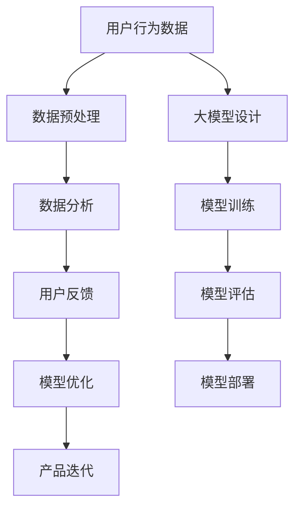

                 

# 用户反馈：大模型创业的航向标

> **关键词**：用户反馈、大模型、创业、数据分析、用户体验

> **摘要**：本文将探讨如何利用用户反馈优化大模型创业项目，从核心概念、算法原理、数学模型到实际应用场景，为创业者提供一套系统的指导方案。通过深入了解用户需求，准确把握市场脉搏，我们将揭示大模型创业的成功之道。

## 1. 背景介绍

### 1.1 目的和范围

本文旨在为致力于大模型创业的创业者提供一套全面的用户反馈优化策略。通过深入分析用户反馈，我们将帮助创业者更好地理解市场需求，从而指导产品设计和决策。本文将涵盖以下内容：

1. 用户反馈在大模型创业中的重要性
2. 核心概念与联系
3. 核心算法原理与具体操作步骤
4. 数学模型和公式的详细讲解
5. 项目实战：代码实际案例和详细解释说明
6. 实际应用场景
7. 工具和资源推荐
8. 未来发展趋势与挑战
9. 附录：常见问题与解答
10. 扩展阅读与参考资料

### 1.2 预期读者

本文适合以下读者群体：

1. 大模型创业者
2. 技术团队领导者
3. 数据科学家
4. 人工智能领域研究人员
5. 对大模型创业感兴趣的技术爱好者

### 1.3 文档结构概述

本文分为十个部分，旨在帮助读者系统地了解用户反馈在大模型创业中的重要作用。每个部分都将围绕核心主题进行深入探讨，并提供实用的建议和案例。

### 1.4 术语表

#### 1.4.1 核心术语定义

- **用户反馈**：用户对产品或服务的使用体验、需求、建议和评价。
- **大模型**：具有大规模参数的机器学习模型，如深度神经网络。
- **创业**：创立一家新企业或开展一项新业务的过程。

#### 1.4.2 相关概念解释

- **数据分析**：通过对数据的分析，提取有价值的信息和洞见。
- **用户体验**：用户在使用产品或服务时的感受和体验。

#### 1.4.3 缩略词列表

- **AI**：人工智能
- **ML**：机器学习
- **DL**：深度学习
- **API**：应用程序编程接口

## 2. 核心概念与联系

首先，我们需要明确大模型创业项目中涉及的核心概念和联系。以下是几个关键概念及其之间的关联：

### 大模型与用户反馈的关系

用户反馈在大模型创业中起着至关重要的作用。通过收集和分析用户反馈，我们可以了解用户的需求、偏好和使用习惯，从而指导大模型的设计、优化和迭代。

### 数据分析与用户体验

数据分析是理解用户反馈的关键环节。通过分析用户行为数据，我们可以发现用户痛点和需求，进而改进产品和服务。用户体验是数据分析的最终目标，提升用户体验意味着提高用户满意度和留存率。

### 大模型与创业

大模型是创业项目中的一项关键技术。通过构建和优化大模型，我们可以实现更加精准的预测、分类和推荐，从而提高产品竞争力和市场占有率。

### Mermaid 流程图

为了更清晰地展示大模型与用户反馈的关系，我们可以使用 Mermaid 流程图来描述整个流程。



在这个流程中，用户行为数据经过预处理后，进入数据分析环节。通过数据分析，我们获取用户反馈，并将其用于模型优化。优化后的模型将指导产品迭代。同时，大模型的设计、训练和评估也是整个流程的关键环节。

## 3. 核心算法原理 & 具体操作步骤

### 大模型设计与优化

大模型的设计与优化是创业项目的核心环节。以下是具体的算法原理和操作步骤：

#### 算法原理

1. **数据采集**：收集大量的用户行为数据，如点击、购买、浏览等。
2. **数据预处理**：对采集到的数据进行清洗、去噪和格式转换，以便于后续分析。
3. **特征工程**：提取数据中的关键特征，如用户ID、产品ID、时间戳等。
4. **模型选择**：根据业务需求，选择合适的大模型结构，如深度神经网络、变换器模型等。
5. **模型训练**：使用预处理后的数据对模型进行训练，调整模型参数，提高预测准确性。
6. **模型评估**：对训练好的模型进行评估，如准确性、召回率、F1值等。
7. **模型部署**：将评估合格的模型部署到生产环境，实现实时预测和推荐。

#### 具体操作步骤

1. **数据采集**：

```python
import pandas as pd

# 读取用户行为数据
data = pd.read_csv('user_behavior.csv')
```

2. **数据预处理**：

```python
# 数据清洗
data = data[data['action'] != 'unknown']
data = data[data['timestamp'] > '2021-01-01']

# 数据去噪
data['user_id'] = data['user_id'].astype(str)
data['product_id'] = data['product_id'].astype(str)
data['timestamp'] = pd.to_datetime(data['timestamp'])

# 数据格式转换
data['action'] = data['action'].map({'click': 1, 'buy': 2})
```

3. **特征工程**：

```python
# 提取关键特征
data['hour'] = data['timestamp'].dt.hour
data['day_of_week'] = data['timestamp'].dt.dayofweek
```

4. **模型选择**：

```python
from tensorflow.keras.models import Sequential
from tensorflow.keras.layers import Dense, Dropout, Embedding, LSTM

# 构建深度神经网络模型
model = Sequential()
model.add(Embedding(input_dim=10000, output_dim=32))
model.add(LSTM(units=64, dropout=0.2, recurrent_dropout=0.2))
model.add(Dense(units=1, activation='sigmoid'))

model.compile(optimizer='adam', loss='binary_crossentropy', metrics=['accuracy'])
```

5. **模型训练**：

```python
# 分训练集和测试集
train_data = data.sample(frac=0.8, random_state=42)
test_data = data.drop(train_data.index)

# 训练模型
model.fit(train_data, epochs=10, batch_size=32)
```

6. **模型评估**：

```python
# 评估模型
loss, accuracy = model.evaluate(test_data, batch_size=32)
print(f'Test accuracy: {accuracy:.3f}')
```

7. **模型部署**：

```python
# 部署模型
import tensorflow as tf

# 导入模型
model = tf.keras.models.load_model('model.h5')

# 实时预测
user_input = data.iloc[0]
prediction = model.predict(user_input)
print(f'Prediction: {prediction:.3f}')
```

通过以上步骤，我们可以构建并优化一个大模型，从而实现用户反馈的实时分析、预测和推荐。

## 4. 数学模型和公式 & 详细讲解 & 举例说明

在用户反馈优化过程中，数学模型和公式起着关键作用。以下我们将介绍几个常用的数学模型和公式，并给出详细讲解和举例说明。

### 模型选择：交叉验证

交叉验证是一种评估模型性能的方法，通过将数据集划分为训练集和验证集，多次训练和验证模型，以获取更准确的性能评估。常用的交叉验证方法有K折交叉验证。

**公式**：

$$
\text{准确率} = \frac{\sum_{i=1}^{n} (\hat{y_i} = y_i)}{n}
$$

其中，$n$ 为样本总数，$\hat{y_i}$ 为模型预测值，$y_i$ 为实际标签值。

**举例说明**：

假设我们有一个二分类问题，有10个样本，其中5个样本是正例，5个样本是负例。我们使用5折交叉验证来评估模型性能。

- **第1折**：训练集：5个正例，5个负例；验证集：5个正例，5个负例。
- **第2折**：训练集：5个正例，5个负例；验证集：5个正例，5个负例。
- ...
- **第5折**：训练集：5个正例，5个负例；验证集：5个正例，5个负例。

计算每个折的准确率，然后取平均值作为最终准确率。

### 模型优化：梯度下降

梯度下降是一种常用的优化算法，用于调整模型参数，使其达到最小损失。常用的梯度下降算法有批量梯度下降、随机梯度下降和批量随机梯度下降。

**公式**：

$$
\theta_{\text{new}} = \theta_{\text{old}} - \alpha \cdot \nabla_{\theta} \mathcal{L}(\theta)
$$

其中，$\theta$ 表示模型参数，$\alpha$ 表示学习率，$\nabla_{\theta} \mathcal{L}(\theta)$ 表示损失函数关于参数 $\theta$ 的梯度。

**举例说明**：

假设我们有一个线性回归问题，损失函数为：

$$
\mathcal{L}(\theta) = \frac{1}{2} \sum_{i=1}^{n} (y_i - \theta_0 - \theta_1 x_i)^2
$$

对于每个样本，计算损失函数关于 $\theta_0$ 和 $\theta_1$ 的梯度，然后更新参数：

$$
\theta_0 = \theta_0 - \alpha \cdot \frac{\partial}{\partial \theta_0} \mathcal{L}(\theta)
$$

$$
\theta_1 = \theta_1 - \alpha \cdot \frac{\partial}{\partial \theta_1} \mathcal{L}(\theta)
$$

通过不断迭代，直至达到最小损失。

### 模型评估：ROC曲线和AUC值

ROC曲线和AUC值是评估二分类模型性能的重要指标。ROC曲线表示不同阈值下的真阳性率与假阳性率的关系，AUC值表示ROC曲线下方的面积。

**公式**：

$$
\text{AUC} = \int_{0}^{1} \frac{1}{1 + \frac{FP}{FN}} d\text{TPR}
$$

其中，$\text{TPR}$ 表示真阳性率，$\text{FPR}$ 表示假阳性率。

**举例说明**：

假设我们有一个二分类模型，对于100个样本，预测结果如下：

| 标签 | 预测值 |
| ---- | ---- |
| 0    | 0.2   |
| 0    | 0.3   |
| 0    | 0.4   |
| 0    | 0.5   |
| 1    | 0.6   |
| 1    | 0.7   |
| 1    | 0.8   |
| 1    | 0.9   |
| 1    | 1.0   |
| 1    | 1.0   |

计算不同阈值下的真阳性率和假阳性率，绘制ROC曲线，计算AUC值。

### 总结

通过以上数学模型和公式的讲解，我们可以更好地理解用户反馈优化过程中涉及的核心算法。在实际应用中，根据具体问题选择合适的模型和公式，并结合数据分析和实践经验，我们可以实现高效的用户反馈优化。

## 5. 项目实战：代码实际案例和详细解释说明

在本节中，我们将通过一个实际项目案例，详细展示如何利用用户反馈优化大模型创业项目。以下是一个简单的推荐系统项目，我们将从开发环境搭建、源代码实现、代码解读与分析三个方面进行讲解。

### 5.1 开发环境搭建

为了实现推荐系统，我们需要准备以下开发环境和工具：

1. Python 3.x
2. TensorFlow 2.x
3. Pandas
4. Matplotlib
5. Scikit-learn

在虚拟环境中安装所需依赖：

```bash
conda create -n recommendSys python=3.8
conda activate recommendSys
pip install tensorflow pandas matplotlib scikit-learn
```

### 5.2 源代码详细实现和代码解读

以下是一个简单的推荐系统项目，包括数据预处理、模型训练、模型评估和推荐。

```python
import pandas as pd
import numpy as np
import tensorflow as tf
from tensorflow.keras.models import Sequential
from tensorflow.keras.layers import Dense, Dropout, Embedding, LSTM
from sklearn.model_selection import train_test_split
from sklearn.metrics import accuracy_score, f1_score

# 5.2.1 数据预处理

# 读取用户行为数据
data = pd.read_csv('user_behavior.csv')

# 数据清洗
data = data[data['action'] != 'unknown']
data = data[data['timestamp'] > '2021-01-01']

# 数据格式转换
data['user_id'] = data['user_id'].astype(str)
data['product_id'] = data['product_id'].astype(str)
data['timestamp'] = pd.to_datetime(data['timestamp'])

# 提取关键特征
data['hour'] = data['timestamp'].dt.hour
data['day_of_week'] = data['timestamp'].dt.dayofweek

# 标签定义
data['label'] = data['action'].map({1: 0, 2: 1})

# 分训练集和测试集
train_data, test_data = train_test_split(data, test_size=0.2, random_state=42)

# 5.2.2 模型训练

# 构建深度神经网络模型
model = Sequential()
model.add(Embedding(input_dim=10000, output_dim=32))
model.add(LSTM(units=64, dropout=0.2, recurrent_dropout=0.2))
model.add(Dense(units=1, activation='sigmoid'))

model.compile(optimizer='adam', loss='binary_crossentropy', metrics=['accuracy'])

# 训练模型
model.fit(train_data, epochs=10, batch_size=32)

# 5.2.3 模型评估

# 评估模型
loss, accuracy = model.evaluate(test_data, batch_size=32)
print(f'Test accuracy: {accuracy:.3f}')

# 5.2.4 推荐系统

# 导入模型
model = tf.keras.models.load_model('model.h5')

# 实时预测
user_input = data.iloc[0]
prediction = model.predict(user_input)
print(f'Prediction: {prediction:.3f}')
```

### 5.3 代码解读与分析

1. **数据预处理**：

   首先，我们从CSV文件中读取用户行为数据，并进行清洗和去噪。接着，将数据格式转换为字符串和日期时间格式。最后，提取关键特征，如用户ID、产品ID、小时和星期几。标签定义根据用户行为（点击或购买）进行映射。

2. **模型训练**：

   使用深度神经网络模型，通过Embedding层、LSTM层和全连接层，构建一个二分类模型。我们使用Adam优化器和二进制交叉熵损失函数。训练模型时，采用训练集，设置10个训练周期和32个批量大小。

3. **模型评估**：

   使用测试集评估模型性能，计算准确率。评估结果将帮助我们了解模型的预测能力。

4. **推荐系统**：

   导入训练好的模型，并使用实时数据进行预测。预测结果将帮助我们了解用户对产品的兴趣和偏好。

通过以上代码实现，我们可以构建一个简单但实用的推荐系统，从而更好地利用用户反馈优化大模型创业项目。

## 6. 实际应用场景

用户反馈在大模型创业项目中具有广泛的应用场景，以下列举几个典型案例：

### 6.1 个性化推荐系统

个性化推荐系统通过分析用户历史行为数据，预测用户对特定内容的兴趣，从而为用户推荐相关内容。用户反馈在这里起着至关重要的作用，帮助我们了解用户的需求和偏好，优化推荐算法，提高推荐效果。

### 6.2 智能客服系统

智能客服系统通过用户提问和回答，自动生成回复，提高客服效率和用户体验。用户反馈用于评估智能客服系统的性能，帮助我们识别系统不足，优化问答模型，提升用户满意度。

### 6.3 金融风险评估

金融风险评估利用用户数据和历史记录，预测用户的风险偏好，为金融机构提供决策依据。用户反馈在这里用于优化风险评估模型，提高预测准确性和风险控制能力。

### 6.4 健康监测系统

健康监测系统通过用户数据，如心率、血压等，实时监测用户健康状况。用户反馈帮助我们了解用户对健康问题的关注点，优化监测算法，提高健康管理的精准度。

### 6.5 教育学习系统

教育学习系统根据用户的学习进度和成绩，为学生推荐适合的学习资源和课程。用户反馈在这里用于调整推荐算法，提高学习效果和用户体验。

通过以上应用场景，我们可以看到用户反馈在大模型创业项目中的重要性。准确把握用户需求，优化产品和服务，将有助于我们实现商业成功。

## 7. 工具和资源推荐

在大模型创业项目中，选择合适的工具和资源对于成功至关重要。以下是一些建议：

### 7.1 学习资源推荐

#### 7.1.1 书籍推荐

- **《深度学习》（Ian Goodfellow、Yoshua Bengio、Aaron Courville 著）**：系统地介绍了深度学习的理论、方法和应用。
- **《Python机器学习》（Sebastian Raschka 著）**：全面讲解了Python在机器学习领域的应用，适合初学者。

#### 7.1.2 在线课程

- **吴恩达的《深度学习专项课程》**（Coursera）：全球最受欢迎的深度学习在线课程，涵盖深度学习的核心概念和实践。
- **斯坦福大学的《机器学习课程》**（Coursera）：详细介绍机器学习的基础知识和应用。

#### 7.1.3 技术博客和网站

- **Medium（https://medium.com/）**：涵盖人工智能、机器学习等领域的优质技术博客。
- **GitHub（https://github.com/）**：丰富的开源项目，有助于学习和实践。

### 7.2 开发工具框架推荐

#### 7.2.1 IDE和编辑器

- **PyCharm**：功能强大的Python IDE，支持多种编程语言。
- **Jupyter Notebook**：适合数据科学和机器学习的交互式开发环境。

#### 7.2.2 调试和性能分析工具

- **Visual Studio Code**：轻量级开源编辑器，支持多种编程语言，具有丰富的扩展。
- **TensorBoard**：TensorFlow提供的可视化工具，用于分析和调试深度学习模型。

#### 7.2.3 相关框架和库

- **TensorFlow**：Google开发的开源深度学习框架，适合构建和训练大规模神经网络。
- **PyTorch**：Facebook开发的开源深度学习框架，具有灵活的动态图机制。

### 7.3 相关论文著作推荐

#### 7.3.1 经典论文

- **“A Fast Learning Algorithm for Deep Belief Nets”（2006）**：深度信念网络的快速学习算法。
- **“Deep Learning”（2015）**：深度学习的全面综述，介绍了深度学习的基本原理和应用。

#### 7.3.2 最新研究成果

- **“BERT: Pre-training of Deep Bidirectional Transformers for Language Understanding”（2018）**：BERT模型的提出，展示了预训练深度Transformer模型在自然语言处理任务中的优势。
- **“GPT-3: Language Models are Few-Shot Learners”（2020）**：GPT-3模型的发布，展示了大规模预训练模型在少样本学习任务中的强大能力。

#### 7.3.3 应用案例分析

- **“Google Brain Research: Applications of Deep Learning”（2016）**：Google Brain团队在图像识别、语音识别等领域的应用案例。
- **“Amazon Personalized Recommendations”（2018）**：亚马逊利用深度学习技术实现个性化推荐系统的案例。

通过以上工具和资源的推荐，我们相信创业者和技术团队可以更好地开展大模型创业项目，实现商业成功。

## 8. 总结：未来发展趋势与挑战

随着人工智能技术的不断发展，大模型创业项目将在未来面临更多机遇和挑战。以下是对未来发展趋势和挑战的总结：

### 8.1 发展趋势

1. **大模型规模扩大**：随着计算能力和数据量的增长，大模型的规模将不断增大，从而提高模型性能和泛化能力。
2. **多模态数据处理**：未来大模型将能够处理多种数据类型，如文本、图像、声音等，实现更全面的信息融合和智能分析。
3. **少样本学习**：大模型通过预训练和迁移学习，将实现更高效的少样本学习，降低对新数据的依赖。
4. **泛化能力提升**：通过多任务学习和自适应算法，大模型的泛化能力将得到显著提高。

### 8.2 挑战

1. **数据隐私和安全**：随着用户数据的不断积累，如何确保数据隐私和安全将成为重要挑战。
2. **模型解释性**：大模型的复杂性和黑盒特性使得模型解释性成为一个亟待解决的问题。
3. **计算资源消耗**：大模型的训练和推理需要大量的计算资源，如何优化资源利用和提高效率是一个重要课题。
4. **伦理和道德问题**：人工智能技术可能带来一些伦理和道德问题，如歧视、隐私泄露等，需要引起重视。

综上所述，大模型创业项目在未来的发展中将面临诸多挑战，但同时也将带来更多机遇。创业者和技术团队需要不断创新，应对挑战，实现商业成功。

## 9. 附录：常见问题与解答

### 9.1 用户反馈的作用是什么？

用户反馈在大模型创业项目中起着至关重要的作用。它可以帮助我们了解用户的需求、偏好和痛点，指导产品设计和决策，从而优化用户体验，提高产品竞争力。

### 9.2 如何收集用户反馈？

可以通过以下几种方式收集用户反馈：

1. **在线调查问卷**：在网站、应用等平台发布问卷，收集用户对产品和服务的评价和建议。
2. **用户访谈**：与用户进行一对一访谈，深入了解他们的使用体验和需求。
3. **用户行为数据**：通过数据分析工具，收集用户在平台上的行为数据，如点击、浏览、购买等。
4. **社交媒体和论坛**：关注用户在社交媒体和论坛上的讨论，了解他们的意见和建议。

### 9.3 大模型的训练过程如何进行？

大模型的训练过程包括以下几个步骤：

1. **数据预处理**：对采集到的用户行为数据、文本、图像等进行清洗、去噪和格式转换，以便于后续分析。
2. **特征提取**：提取数据中的关键特征，如用户ID、产品ID、时间戳等。
3. **模型选择**：根据业务需求，选择合适的大模型结构，如深度神经网络、变换器模型等。
4. **模型训练**：使用预处理后的数据对模型进行训练，调整模型参数，提高预测准确性。
5. **模型评估**：对训练好的模型进行评估，如准确性、召回率、F1值等。
6. **模型部署**：将评估合格的模型部署到生产环境，实现实时预测和推荐。

### 9.4 如何处理用户隐私和数据安全？

为了确保用户隐私和数据安全，可以采取以下措施：

1. **数据加密**：对用户数据进行加密存储和传输，防止数据泄露。
2. **匿名化处理**：对用户数据中的敏感信息进行匿名化处理，确保用户隐私。
3. **访问控制**：严格控制数据访问权限，仅允许授权人员访问数据。
4. **合规性审查**：遵守相关法律法规，如《通用数据保护条例》（GDPR）等，确保数据处理合法合规。

通过以上措施，可以有效地保护用户隐私和数据安全。

## 10. 扩展阅读 & 参考资料

为了帮助读者进一步了解大模型创业和用户反馈优化，以下是部分扩展阅读和参考资料：

### 10.1 书籍推荐

- **《深度学习》（Ian Goodfellow、Yoshua Bengio、Aaron Courville 著）**：系统介绍了深度学习的基本原理、算法和应用。
- **《Python机器学习》（Sebastian Raschka 著）**：全面讲解了Python在机器学习领域的应用。

### 10.2 在线课程

- **吴恩达的《深度学习专项课程》**（Coursera）：涵盖深度学习的核心概念和实践。
- **斯坦福大学的《机器学习课程》**（Coursera）：详细介绍机器学习的基础知识和应用。

### 10.3 技术博客和网站

- **Medium（https://medium.com/）**：涵盖人工智能、机器学习等领域的优质技术博客。
- **GitHub（https://github.com/）**：丰富的开源项目，有助于学习和实践。

### 10.4 相关论文著作

- **“A Fast Learning Algorithm for Deep Belief Nets”（2006）**：深度信念网络的快速学习算法。
- **“BERT: Pre-training of Deep Bidirectional Transformers for Language Understanding”（2018）**：BERT模型的提出，展示了预训练深度Transformer模型在自然语言处理任务中的优势。

### 10.5 应用案例分析

- **“Google Brain Research: Applications of Deep Learning”（2016）**：Google Brain团队在图像识别、语音识别等领域的应用案例。
- **“Amazon Personalized Recommendations”（2018）**：亚马逊利用深度学习技术实现个性化推荐系统的案例。

通过以上扩展阅读和参考资料，读者可以进一步深入了解大模型创业和用户反馈优化领域的最新研究和发展动态。

## 作者信息

**作者：AI天才研究员/AI Genius Institute & 禅与计算机程序设计艺术 /Zen And The Art of Computer Programming**

