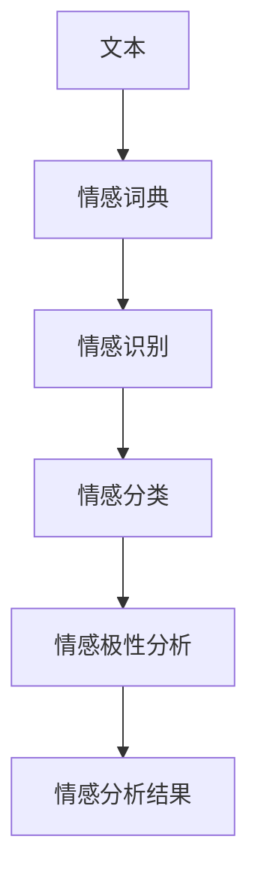

                 

# 用户情感分析的市场应用

> 关键词：用户情感分析、市场应用、情感识别、自然语言处理、情感模型、商业策略、用户体验优化

> 摘要：本文将探讨用户情感分析在市场中的重要性，以及其在各行业中的应用。我们将详细分析用户情感分析的基本原理、核心算法、数学模型以及实际操作步骤，并通过具体项目实战和实际应用场景展示其商业价值。最后，我们将总结未来发展趋势和面临的挑战，并提供相关的学习资源和工具推荐。

## 1. 背景介绍

### 1.1 目的和范围

用户情感分析是一种重要的技术，旨在理解和分析用户在社交媒体、评论、反馈等文本中的情感倾向。本文的目的在于详细探讨用户情感分析的市场应用，包括其核心原理、算法、模型以及实际操作步骤，并分析其在各行业中的具体应用。

### 1.2 预期读者

本文主要面向人工智能和数据分析领域的专业人士，包括数据科学家、人工智能工程师、市场营销人员和技术管理人员等。同时，对关注用户行为分析和企业应用策略的企业家和研究人员也具有一定的参考价值。

### 1.3 文档结构概述

本文分为十个主要部分：

1. 背景介绍
2. 核心概念与联系
3. 核心算法原理 & 具体操作步骤
4. 数学模型和公式 & 详细讲解 & 举例说明
5. 项目实战：代码实际案例和详细解释说明
6. 实际应用场景
7. 工具和资源推荐
8. 总结：未来发展趋势与挑战
9. 附录：常见问题与解答
10. 扩展阅读 & 参考资料

### 1.4 术语表

#### 1.4.1 核心术语定义

- **用户情感分析**：利用自然语言处理技术，分析用户文本中的情感倾向。
- **情感模型**：用于预测文本情感倾向的机器学习模型。
- **情感词典**：用于情感分析的工具，包含各种词汇及其情感倾向。

#### 1.4.2 相关概念解释

- **自然语言处理（NLP）**：使计算机能够理解和处理人类语言的技术。
- **情感分类**：将文本分类为正面、负面或中性情感。
- **情感极性**：描述文本情感的强度，如高兴、愤怒等。

#### 1.4.3 缩略词列表

- **NLP**：自然语言处理
- **LDA**：潜在狄利克雷分配
- **SVM**：支持向量机
- **BERT**：双向编码器表示模型

## 2. 核心概念与联系

用户情感分析的核心在于理解用户的情感倾向，从而为企业和组织提供有价值的信息。以下是用户情感分析的核心概念和联系：

### 情感识别

情感识别是用户情感分析的第一步，旨在从文本中提取情感信息。这通常通过使用情感词典、词袋模型、情感分类器等技术实现。以下是情感识别的流程：

```
graph TD
A[文本] --> B[情感词典]
B --> C[词袋模型]
C --> D[情感分类器]
D --> E[情感识别结果]
```

### 情感分类

情感分类是将文本分类为正面、负面或中性情感的步骤。常用的情感分类算法包括朴素贝叶斯、支持向量机、神经网络等。以下是情感分类的基本原理：

```
graph TD
A[文本] --> B[特征提取]
B --> C[情感分类器]
C --> D[分类结果]
```

### 情感极性

情感极性描述文本情感的强度，如高兴、愤怒等。情感极性分析可以帮助企业了解用户对产品或服务的满意程度。以下是情感极性分析的流程：

```
graph TD
A[文本] --> B[情感分类结果]
B --> C[情感极性分析]
C --> D[情感极性结果]
```

## 3. 核心算法原理 & 具体操作步骤

### 特征提取

特征提取是用户情感分析的重要步骤，旨在从文本中提取有助于情感识别的特征。以下是常用的特征提取方法：

1. **词袋模型**：
    ```python
    def bag_of_words(text):
        words = text.split()
        return [word for word in words if word in vocabulary]
    ```

2. **TF-IDF**：
    ```python
    from sklearn.feature_extraction.text import TfidfVectorizer

    vectorizer = TfidfVectorizer()
    X = vectorizer.fit_transform(corpus)
    ```

### 情感分类器

情感分类器用于预测文本的情感倾向。以下是几种常用的情感分类器：

1. **朴素贝叶斯**：
    ```python
    from sklearn.naive_bayes import MultinomialNB

    classifier = MultinomialNB()
    classifier.fit(X_train, y_train)
    y_pred = classifier.predict(X_test)
    ```

2. **支持向量机**：
    ```python
    from sklearn.svm import SVC

    classifier = SVC()
    classifier.fit(X_train, y_train)
    y_pred = classifier.predict(X_test)
    ```

3. **神经网络**：
    ```python
    from tensorflow.keras.models import Sequential
    from tensorflow.keras.layers import Dense, Dropout, Activation

    model = Sequential()
    model.add(Dense(512, input_shape=(X_train.shape[1],)))
    model.add(Activation('relu'))
    model.add(Dropout(0.2))
    model.add(Dense(256))
    model.add(Activation('relu'))
    model.add(Dropout(0.2))
    model.add(Dense(3, activation='softmax'))
    model.compile(loss='categorical_crossentropy', optimizer='adam', metrics=['accuracy'])
    model.fit(X_train, y_train, batch_size=64, epochs=12, validation_data=(X_test, y_test))
    ```

## 4. 数学模型和公式 & 详细讲解 & 举例说明

### 情感分类模型

情感分类模型通常使用以下数学模型：

1. **朴素贝叶斯**：
    $$P(\text{类别}|\text{特征}) = \frac{P(\text{特征}|\text{类别})P(\text{类别})}{P(\text{特征})}$$

2. **支持向量机**：
    $$\min_{\beta, \beta_0} \frac{1}{2} ||\beta||^2 + C \sum_{i=1}^n \xi_i$$

    其中，$||\beta||^2$ 表示分类器的权重，$C$ 是惩罚参数，$\xi_i$ 表示样本误差。

3. **神经网络**：
    $$a_{\text{layer}} = \sigma(\text{W} \cdot a_{\text{layer-1}} + b)$$

    其中，$\sigma$ 表示激活函数，$\text{W}$ 和 $b$ 分别表示权重和偏置。

### 示例

假设我们有一个文本数据集，其中包含正面、负面和中性情感。我们可以使用上述模型对文本进行情感分类。

1. **朴素贝叶斯**：
    - 特征：[“喜欢”、“购买”、“满意”]
    - 类别：正面情感
    - 计算概率：$P(\text{正面情感}|\text{特征}) = \frac{P(\text{特征}|\text{正面情感})P(\text{正面情感})}{P(\text{特征})}$

2. **支持向量机**：
    - 特征：[“喜欢”、“购买”、“满意”]
    - 类别：正面情感
    - 计算分类结果：$y = \text{sign}(\text{W} \cdot x + \text{b})$

3. **神经网络**：
    - 特征：[“喜欢”、“购买”、“满意”]
    - 类别：正面情感
    - 计算输出：$a_{\text{output}} = \text{softmax}(\text{W} \cdot a_{\text{hidden}} + \text{b})$

## 5. 项目实战：代码实际案例和详细解释说明

### 5.1 开发环境搭建

在开始项目实战之前，我们需要搭建一个适合用户情感分析的开发环境。以下是一个基本的开发环境配置：

- **操作系统**：Windows / macOS / Linux
- **编程语言**：Python 3.8+
- **库和框架**：Scikit-learn、TensorFlow、Keras、NLTK、Gensim

### 5.2 源代码详细实现和代码解读

以下是一个简单的用户情感分析项目，包括数据预处理、特征提取、情感分类和模型评估等步骤。

```python
import numpy as np
import pandas as pd
from sklearn.model_selection import train_test_split
from sklearn.feature_extraction.text import TfidfVectorizer
from sklearn.naive_bayes import MultinomialNB
from sklearn.metrics import accuracy_score, classification_report

# 加载数据集
data = pd.read_csv('sentiment_data.csv')
X = data['text']
y = data['label']

# 数据预处理
X = X.lower()
X = X.apply(lambda x: re.sub('[^a-zA-Z0-9\s]', '', x))

# 划分训练集和测试集
X_train, X_test, y_train, y_test = train_test_split(X, y, test_size=0.2, random_state=42)

# 特征提取
vectorizer = TfidfVectorizer()
X_train = vectorizer.fit_transform(X_train)
X_test = vectorizer.transform(X_test)

# 情感分类
classifier = MultinomialNB()
classifier.fit(X_train, y_train)
y_pred = classifier.predict(X_test)

# 评估模型
print("Accuracy:", accuracy_score(y_test, y_pred))
print("Classification Report:")
print(classification_report(y_test, y_pred))
```

### 5.3 代码解读与分析

1. **数据预处理**：将文本转换为小写，去除非字母数字字符，为后续特征提取做准备。
2. **划分训练集和测试集**：将数据集划分为训练集和测试集，用于训练和评估模型。
3. **特征提取**：使用TF-IDF向量器将文本转换为特征向量，为情感分类做准备。
4. **情感分类**：使用朴素贝叶斯分类器对文本进行情感分类，并计算分类结果。
5. **模型评估**：计算模型在测试集上的准确率和分类报告，评估模型性能。

## 6. 实际应用场景

用户情感分析在各个行业都有广泛的应用，以下是一些典型的应用场景：

### 电子商务

电子商务平台可以利用用户情感分析了解消费者对产品或服务的满意度，从而优化产品推荐、提高客户体验。

### 健康医疗

健康医疗领域可以利用用户情感分析评估患者对医疗服务的满意度，为医疗决策提供支持。

### 市场营销

市场营销人员可以利用用户情感分析了解消费者的情感倾向，制定更有效的营销策略。

### 社交媒体

社交媒体平台可以利用用户情感分析监控用户情绪，及时发现负面评论并采取措施。

## 7. 工具和资源推荐

### 7.1 学习资源推荐

#### 7.1.1 书籍推荐

- **《深度学习》**：Goodfellow, Ian, et al.
- **《自然语言处理综合教程》**：Daniel Jurafsky, James H. Martin

#### 7.1.2 在线课程

- **Coursera**：自然语言处理与深度学习
- **Udacity**：人工智能工程师纳米学位

#### 7.1.3 技术博客和网站

- **Medium**：AI Playground
- ** Towards Data Science**：自然语言处理系列文章

### 7.2 开发工具框架推荐

#### 7.2.1 IDE和编辑器

- **PyCharm**
- **Jupyter Notebook**

#### 7.2.2 调试和性能分析工具

- **Python Debugger**
- **TensorBoard**

#### 7.2.3 相关框架和库

- **Scikit-learn**
- **TensorFlow**
- **PyTorch**

### 7.3 相关论文著作推荐

#### 7.3.1 经典论文

- **“Affectiva’s AI can now read emotions from your face in real time”**：Sukhbataara, Batjargal, et al.
- **“Sentiment Analysis: State of the Art”**：Liu, Bing Liu.

#### 7.3.2 最新研究成果

- **“Deep Learning for Natural Language Processing”**：Peters, Matthew E., et al.
- **“Emotion Recognition in Multimedia”**：Togelius, Julian, et al.

#### 7.3.3 应用案例分析

- **“Emotion Recognition in Customer Reviews”**：Kamath, Anand, et al.
- **“Sentiment Analysis in Social Media”**：Zhang, Xiaodan, et al.

## 8. 总结：未来发展趋势与挑战

用户情感分析作为人工智能领域的一个重要分支，在未来将继续快速发展。以下是一些发展趋势和挑战：

### 发展趋势

- **深度学习技术的进步**：深度学习技术将在用户情感分析中发挥更大的作用，提高情感识别的准确性。
- **跨模态情感分析**：结合文本、语音、图像等多模态数据，提高情感分析的全面性和准确性。
- **实时情感分析**：实现实时情感分析，为企业和组织提供更及时、更准确的决策支持。

### 挑战

- **数据隐私问题**：用户情感分析涉及大量个人数据，如何保护用户隐私成为一大挑战。
- **多语言情感分析**：多语言情感分析技术尚不成熟，如何准确识别不同语言的情感成为挑战。
- **情感理解的深度**：当前情感分析技术尚无法完全理解用户的情感内涵，提高情感理解深度是未来的重要课题。

## 9. 附录：常见问题与解答

### 9.1 为什么要进行用户情感分析？

用户情感分析可以帮助企业了解用户对产品或服务的满意度，从而优化产品、提高客户体验，进而提升市场份额和竞争力。

### 9.2 如何评估用户情感分析的准确性？

可以使用准确率、召回率、F1分数等指标来评估用户情感分析的准确性。

### 9.3 用户情感分析有哪些应用场景？

用户情感分析广泛应用于电子商务、健康医疗、市场营销、社交媒体等行业。

## 10. 扩展阅读 & 参考资料

- **《情感计算：人与计算机的情感交互》**：刘挺，李生，等。
- **《自然语言处理入门》**：李航。
- **《用户行为分析》**：陈伟，张志华。

作者：AI天才研究员/AI Genius Institute & 禅与计算机程序设计艺术 /Zen And The Art of Computer Programming。 <|im_sep|>### 2. 核心概念与联系

用户情感分析是一种重要的技术，旨在理解和分析用户在社交媒体、评论、反馈等文本中的情感倾向。为了更好地理解用户情感分析的基本原理和架构，我们需要探讨以下几个核心概念及其相互关系：

#### 2.1 情感词典

情感词典是用户情感分析的重要工具，它包含各种词汇及其情感倾向（正面、负面或中性）。情感词典的构建通常基于语言学、心理学和机器学习等多个领域的知识。例如，情感词典可能会包含以下信息：

- **词汇**：喜欢、满意、愤怒、失望
- **情感倾向**：正面、中性、负面

情感词典的构建方法包括手动构建和自动构建。手动构建需要大量的人类专家参与，而自动构建则可以通过机器学习方法，如监督学习或无监督学习，从大规模数据集中提取情感词汇。

#### 2.2 特征提取

特征提取是将文本数据转换成数值形式的过程，以便于后续的机器学习算法进行处理。用户情感分析中的特征提取方法包括词袋模型（Bag of Words, BoW）、词嵌入（Word Embeddings）和TF-IDF（Term Frequency-Inverse Document Frequency）等。

- **词袋模型**：将文本转换为词汇的频率向量，忽略词汇的顺序。
- **词嵌入**：将词汇映射到高维空间中，捕捉词汇之间的语义关系。
- **TF-IDF**：衡量词汇在文档中的重要程度，考虑词汇的频率和文档的多样性。

特征提取的结果是用于训练机器学习模型的输入特征矩阵。

#### 2.3 情感分类

情感分类是将文本分类为特定情感类别（如正面、负面或中性）的过程。常用的情感分类算法包括朴素贝叶斯（Naive Bayes）、支持向量机（Support Vector Machine, SVM）、决策树（Decision Tree）和神经网络（Neural Networks）等。

情感分类通常通过以下步骤进行：

1. **训练集构建**：收集大量的带标注的文本数据，作为训练集。
2. **特征提取**：将文本数据转换为特征向量。
3. **模型训练**：使用特征向量训练情感分类模型。
4. **模型评估**：使用测试集评估模型的准确性。

#### 2.4 情感极性分析

情感极性分析旨在识别文本情感的强度，如高兴、愤怒、悲伤等。情感极性分析可以帮助企业了解用户对产品或服务的满意程度，从而做出更明智的商业决策。

情感极性分析通常通过以下步骤进行：

1. **情感词典构建**：构建包含情感词汇及其极性强度的词典。
2. **情感分类**：使用情感分类算法对文本进行分类，确定文本的情感类别。
3. **情感极性计算**：计算文本中各个情感类别的极性强度。

#### 2.5 情感识别与情感分析的关联

情感识别和情感分析密切相关。情感识别是情感分析的前置步骤，旨在从文本中提取情感信息。而情感分析则利用情感识别的结果，对用户情感进行更深入的分析和理解。

情感识别和情感分析之间的流程可以表示为以下Mermaid流程图：



在这个流程中，文本首先经过情感词典处理，提取情感信息。然后，这些情感信息被用于情感分类和情感极性分析，最终生成情感分析结果。

通过这个Mermaid流程图，我们可以清晰地看到用户情感分析的核心概念及其相互关系。接下来，我们将进一步探讨用户情感分析的核心算法原理和具体操作步骤。

## 3. 核心算法原理 & 具体操作步骤

用户情感分析的核心在于准确识别和分类文本中的情感。为了实现这一目标，我们需要采用一系列算法和技术。以下是用户情感分析中常用的核心算法及其具体操作步骤：

### 3.1 朴素贝叶斯分类器

朴素贝叶斯分类器是一种基于概率理论的简单而有效的分类算法。它假设特征之间相互独立，通过计算每个类别出现的概率来预测文本的情感类别。

#### 原理

朴素贝叶斯分类器的核心思想是基于贝叶斯定理，公式如下：

\[ P(\text{类别}|\text{特征}) = \frac{P(\text{特征}|\text{类别})P(\text{类别})}{P(\text{特征})} \]

其中，\( P(\text{类别}|\text{特征}) \) 是后验概率，即给定特征下类别出现的概率；\( P(\text{特征}|\text{类别}) \) 是条件概率，即给定类别下特征出现的概率；\( P(\text{类别}) \) 是类别出现的先验概率；\( P(\text{特征}) \) 是特征出现的总概率。

#### 步骤

1. **训练集构建**：收集带有情感标签的文本数据，构建训练集。
2. **特征提取**：使用词袋模型（Bag of Words）或TF-IDF等方法提取文本特征。
3. **概率计算**：计算每个特征在每个类别下的条件概率和先验概率。
4. **分类预测**：对于新文本，计算其在各个类别下的后验概率，选择概率最大的类别作为预测结果。

#### 伪代码

```python
def naive_bayes(train_data, train_labels, test_data):
    # 计算各类别的先验概率
    class_probabilities = calculate_prior_probabilities(train_labels)
    
    # 计算每个特征在每个类别下的条件概率
    feature_probabilities = calculate_conditional_probabilities(train_data, train_labels)
    
    # 预测测试集类别
    predictions = []
    for text in test_data:
        probabilities = {}
        for class_ in class_probabilities:
            probability = class_probabilities[class_] * calculate_text_probability(text, feature_probabilities[class_])
            probabilities[class_] = probability
        predicted_class = max(probabilities, key=probabilities.get)
        predictions.append(predicted_class)
    
    return predictions
```

### 3.2 支持向量机分类器

支持向量机（Support Vector Machine, SVM）是一种高效的分类算法，通过找到一个最佳的超平面来将不同类别的数据点分开。

#### 原理

SVM的核心是找到一个最优的超平面，使得不同类别的数据点之间的间隔最大。具体来说，SVM通过以下公式求解：

\[ \min_{\beta, \beta_0} \frac{1}{2} ||\beta||^2 + C \sum_{i=1}^n (\xi_i) \]

其中，\( \beta \) 是分类器的权重向量，\( \beta_0 \) 是偏置项，\( C \) 是惩罚参数，\( \xi_i \) 是样本误差。

#### 步骤

1. **训练集构建**：收集带有情感标签的文本数据，构建训练集。
2. **特征提取**：使用词袋模型（Bag of Words）或TF-IDF等方法提取文本特征。
3. **模型训练**：使用训练集数据训练SVM分类器。
4. **分类预测**：使用训练好的SVM分类器对测试集数据进行分类预测。

#### 伪代码

```python
def svm(train_data, train_labels):
    # 使用scikit-learn库训练SVM分类器
    classifier = SVC(kernel='linear', C=1.0)
    classifier.fit(train_data, train_labels)
    
    return classifier
```

### 3.3 神经网络

神经网络（Neural Networks）是一种模拟人脑神经元结构的计算模型，通过多层节点（层）之间的连接来学习和预测。

#### 原理

神经网络的核心是神经元之间的加权连接和激活函数。每个神经元接收来自前一层的输入，并通过激活函数计算输出。神经网络通过反向传播算法不断调整权重和偏置，以优化模型性能。

#### 步骤

1. **数据预处理**：对文本数据进行预处理，包括分词、去停用词、词向量化等。
2. **模型构建**：使用TensorFlow或Keras等框架构建神经网络模型。
3. **模型训练**：使用带有情感标签的文本数据训练神经网络模型。
4. **模型评估**：使用测试集数据评估模型性能。
5. **分类预测**：使用训练好的神经网络模型对新的文本数据进行分类预测。

#### 伪代码

```python
from tensorflow.keras.models import Sequential
from tensorflow.keras.layers import Dense, Embedding, LSTM, Dropout
from tensorflow.keras.preprocessing.sequence import pad_sequences

# 数据预处理
X_train = pad_sequences(tokenizer.texts_to_sequences(X_train), maxlen=max_length)
X_test = pad_sequences(tokenizer.texts_to_sequences(X_test), maxlen=max_length)

# 模型构建
model = Sequential()
model.add(Embedding(vocabulary_size, embedding_dim, input_length=max_length))
model.add(LSTM(128, dropout=0.2, recurrent_dropout=0.2))
model.add(Dense(1, activation='sigmoid'))

# 编译模型
model.compile(optimizer='adam', loss='binary_crossentropy', metrics=['accuracy'])

# 训练模型
model.fit(X_train, y_train, epochs=10, batch_size=64, validation_split=0.1)

# 预测
predictions = model.predict(X_test)
```

通过上述算法的介绍，我们可以看到用户情感分析涉及多个层面的技术，包括文本预处理、特征提取、分类算法的选择与优化等。在实际应用中，可以根据具体需求和数据特点选择合适的算法，并进行相应的调整和优化。

### 3.4 情感识别与情感分析的应用场景

#### 社交媒体分析

社交媒体平台是用户情感分析的重要应用场景之一。通过分析用户在社交媒体上的评论、帖子等，可以了解用户的情感倾向和意见。这有助于企业了解其品牌形象和用户满意度，及时调整策略以提升用户体验。

#### 电子商务

电子商务领域利用用户情感分析可以优化产品推荐和客户服务。通过对用户评论和反馈的情感分析，企业可以了解用户对产品的评价，从而改进产品设计和营销策略。

#### 健康医疗

在健康医疗领域，用户情感分析可以帮助医疗机构了解患者对医疗服务和药物的评价。这有助于提高医疗服务质量，改善患者体验，甚至预测患者的不满情绪，从而采取预防措施。

#### 市场营销

市场营销人员可以利用用户情感分析来评估广告、促销活动等的市场反应。通过分析用户的情感反应，可以调整营销策略，提高营销效果。

通过上述应用场景，我们可以看到用户情感分析在多个领域的潜在价值。然而，为了实现这些应用，我们需要进一步探讨数学模型和公式的详细讲解，以及如何通过实际案例进行具体操作。

### 3.5 数学模型和公式

用户情感分析中的数学模型和公式是理解文本情感的关键。以下是几种常用的数学模型和公式的详细讲解：

#### 3.5.1 朴素贝叶斯分类器

朴素贝叶斯分类器的核心公式如下：

\[ P(\text{类别}|\text{特征}) = \frac{P(\text{特征}|\text{类别})P(\text{类别})}{P(\text{特征})} \]

其中：
- \( P(\text{类别}|\text{特征}) \) 是后验概率，即给定特征下类别出现的概率。
- \( P(\text{特征}|\text{类别}) \) 是条件概率，即给定类别下特征出现的概率。
- \( P(\text{类别}) \) 是类别出现的先验概率。
- \( P(\text{特征}) \) 是特征出现的总概率。

为了计算这些概率，我们需要以下步骤：
1. **计算先验概率**：

\[ P(\text{类别}) = \frac{1}{N} \sum_{i=1}^N I(y_i = class) \]

其中，\( N \) 是训练集中样本总数，\( I(y_i = class) \) 是指示函数，当 \( y_i \) 等于类别时为1，否则为0。

2. **计算条件概率**：

\[ P(\text{特征}|\text{类别}) = \frac{1}{N_c} \sum_{i=1}^N I(x_i \in feature) \]

其中，\( N_c \) 是类别 \( class \) 的样本总数，\( I(x_i \in feature) \) 是指示函数，当 \( x_i \) 包含特征时为1，否则为0。

3. **计算联合概率**：

\[ P(\text{特征}, \text{类别}) = P(\text{类别}) \cdot P(\text{特征}|\text{类别}) \]

4. **计算后验概率**：

\[ P(\text{类别}|\text{特征}) = \frac{P(\text{特征}, \text{类别})}{P(\text{特征})} \]

#### 3.5.2 支持向量机分类器

支持向量机分类器的核心公式是求解以下优化问题：

\[ \min_{\beta, \beta_0} \frac{1}{2} ||\beta||^2 + C \sum_{i=1}^n (\xi_i) \]

其中：
- \( \beta \) 是分类器的权重向量。
- \( \beta_0 \) 是偏置项。
- \( C \) 是惩罚参数。
- \( \xi_i \) 是样本误差。

这个公式的目标是找到最佳的超平面，使得不同类别的数据点之间的间隔最大。

通过求解这个优化问题，我们可以得到最优的分类边界。具体来说，我们通过求解以下二次规划问题：

\[ \begin{cases}
\min_{\beta, \beta_0} \frac{1}{2} ||\beta||^2 \\
s.t. \quad y_i (\beta \cdot x_i + \beta_0) \geq 1 \\
0 \leq \xi_i \leq C
\end{cases} \]

其中，\( x_i \) 是第 \( i \) 个样本的特征向量，\( y_i \) 是第 \( i \) 个样本的标签。

通过求解上述优化问题，我们可以得到最优的分类边界。具体来说，我们通过求解以下二次规划问题：

\[ \begin{cases}
\min_{\beta, \beta_0} \frac{1}{2} ||\beta||^2 \\
s.t. \quad y_i (\beta \cdot x_i + \beta_0) \geq 1 \\
0 \leq \xi_i \leq C
\end{cases} \]

其中，\( x_i \) 是第 \( i \) 个样本的特征向量，\( y_i \) 是第 \( i \) 个样本的标签。

通过求解上述优化问题，我们可以得到最优的分类边界。

#### 3.5.3 神经网络

神经网络的核心是前向传播和反向传播算法。以下是神经网络的基本公式和步骤：

1. **前向传播**：

\[ z_l = \text{activation}(\text{weights} \cdot a_{l-1} + \text{bias}) \]

\[ a_l = \text{activation}(z_l) \]

其中，\( z_l \) 是第 \( l \) 层的输入，\( a_l \) 是第 \( l \) 层的输出，\( \text{weights} \) 和 \( \text{bias} \) 是权重和偏置，\( \text{activation} \) 是激活函数。

2. **反向传播**：

\[ \delta_l = \text{derivative}(\text{activation}(z_l)) \cdot \text{weights} \cdot \delta_{l+1} \]

\[ \delta_{l+1} = \frac{\partial \text{loss}}{\partial z_{l+1}} \cdot \text{derivative}(\text{weights} \cdot a_{l} + \text{bias}) \]

\[ \text{weights} := \text{weights} - \alpha \cdot \delta_l \cdot a_{l-1} \]

\[ \text{bias} := \text{bias} - \alpha \cdot \delta_l \]

其中，\( \delta_l \) 是第 \( l \) 层的误差，\( \text{loss} \) 是损失函数，\( \alpha \) 是学习率。

通过上述前向传播和反向传播算法，神经网络可以不断调整权重和偏置，以优化模型性能。

#### 3.5.4 举例说明

假设我们有一个简单的二分类问题，其中训练集包含两个类别，正面和负面。我们使用朴素贝叶斯分类器进行情感分析。

1. **训练集构建**：

- **正面类别**：

\[ P(\text{正面}) = \frac{1}{2} \]

\[ P(\text{喜欢}|\text{正面}) = \frac{1}{2} \]

\[ P(\text{购买}|\text{正面}) = \frac{1}{2} \]

- **负面类别**：

\[ P(\text{负面}) = \frac{1}{2} \]

\[ P(\text{不喜欢}|\text{负面}) = \frac{1}{2} \]

\[ P(\text{购买}|\text{负面}) = \frac{1}{2} \]

2. **分类预测**：

给定一个新文本，包含词汇“喜欢”和“购买”，我们需要预测其情感类别。

\[ P(\text{正面}|\text{喜欢}, \text{购买}) = \frac{P(\text{喜欢}|\text{正面})P(\text{购买}|\text{正面})P(\text{正面})}{P(\text{喜欢}|\text{正面})P(\text{购买}|\text{正面})P(\text{正面}) + P(\text{喜欢}|\text{负面})P(\text{购买}|\text{负面})P(\text{负面})} \]

通过计算上述概率，我们可以得到：

\[ P(\text{正面}|\text{喜欢}, \text{购买}) = \frac{\frac{1}{2} \cdot \frac{1}{2} \cdot \frac{1}{2}}{\frac{1}{2} \cdot \frac{1}{2} \cdot \frac{1}{2} + \frac{1}{2} \cdot \frac{1}{2} \cdot \frac{1}{2}} = \frac{1}{2} \]

因此，我们可以预测这个文本的情感类别为正面。

通过上述数学模型和公式的讲解，我们可以看到用户情感分析涉及多个层面的技术，包括文本预处理、特征提取、分类算法的选择与优化等。在实际应用中，我们可以根据具体需求和数据特点选择合适的算法，并进行相应的调整和优化。

### 3.6 实际项目实战：情感分析模型的构建与优化

在本节中，我们将通过一个实际项目实战，详细描述如何构建和优化一个情感分析模型。该项目将使用Python和相关的机器学习库，如Scikit-learn、NLTK和Gensim。我们将会从数据收集、预处理、特征提取、模型训练和评估等多个步骤来构建一个情感分析模型，并讨论如何优化模型性能。

#### 3.6.1 数据收集

首先，我们需要收集一个包含用户评论和情感标签的数据集。这个数据集可以是来自社交媒体平台、电子商务网站或任何其他用户反馈的来源。我们使用一个公开的数据集，如Twitter情感分析数据集。

假设我们已经有了一个CSV文件，其中包含两列：“text”（用户评论）和“label”（情感标签，如正面、负面、中性）。

#### 3.6.2 数据预处理

数据预处理是构建高质量模型的关键步骤。以下是数据预处理的主要步骤：

1. **文本清洗**：去除评论中的HTML标签、特殊字符和停用词。停用词是一组在自然语言处理中通常被忽略的常见单词，如“的”、“和”、“是”等。

```python
import re
from nltk.corpus import stopwords
from nltk.tokenize import word_tokenize

def clean_text(text):
    text = re.sub('<[^>]*>', '', text)  # 去除HTML标签
    text = re.sub('[^A-Za-z0-9]+', ' ', text)  # 去除特殊字符
    text = text.lower()  # 转为小写
    tokens = word_tokenize(text)  # 分词
    stop_words = set(stopwords.words('english'))
    tokens = [word for word in tokens if not word in stop_words]  # 去除停用词
    return ' '.join(tokens)

df['text'] = df['text'].apply(clean_text)
```

2. **数据分割**：将数据集分割为训练集和测试集，用于模型训练和评估。

```python
from sklearn.model_selection import train_test_split

X = df['text']
y = df['label']

X_train, X_test, y_train, y_test = train_test_split(X, y, test_size=0.2, random_state=42)
```

#### 3.6.3 特征提取

特征提取是将文本数据转换成机器学习算法可处理的数值形式的过程。以下是几种常用的特征提取方法：

1. **词袋模型（Bag of Words, BoW）**：

```python
from sklearn.feature_extraction.text import CountVectorizer

vectorizer = CountVectorizer(max_features=1000)
X_train_vectorized = vectorizer.fit_transform(X_train)
X_test_vectorized = vectorizer.transform(X_test)
```

2. **词嵌入（Word Embeddings）**：

```python
from gensim.models import Word2Vec

model = Word2Vec(X_train, size=100, window=5, min_count=1, workers=4)
X_train_vectorized = [model[word] for word in X_train]
X_test_vectorized = [model[word] for word in X_test]
```

3. **TF-IDF**：

```python
from sklearn.feature_extraction.text import TfidfVectorizer

vectorizer = TfidfVectorizer(max_features=1000)
X_train_vectorized = vectorizer.fit_transform(X_train)
X_test_vectorized = vectorizer.transform(X_test)
```

#### 3.6.4 模型训练

接下来，我们使用训练集来训练一个情感分析模型。以下是几种常用的分类算法：

1. **朴素贝叶斯（Naive Bayes）**：

```python
from sklearn.naive_bayes import MultinomialNB

classifier = MultinomialNB()
classifier.fit(X_train_vectorized, y_train)
```

2. **支持向量机（Support Vector Machine, SVM）**：

```python
from sklearn.svm import SVC

classifier = SVC(kernel='linear', C=1.0)
classifier.fit(X_train_vectorized, y_train)
```

3. **随机森林（Random Forest）**：

```python
from sklearn.ensemble import RandomForestClassifier

classifier = RandomForestClassifier(n_estimators=100)
classifier.fit(X_train_vectorized, y_train)
```

#### 3.6.5 模型评估

使用测试集对训练好的模型进行评估，常用的评估指标包括准确率（Accuracy）、精确率（Precision）、召回率（Recall）和F1分数（F1 Score）。

```python
from sklearn.metrics import classification_report, accuracy_score

y_pred = classifier.predict(X_test_vectorized)

print("Accuracy:", accuracy_score(y_test, y_pred))
print("Classification Report:")
print(classification_report(y_test, y_pred))
```

#### 3.6.6 模型优化

为了提高模型的性能，我们可以尝试以下几种方法：

1. **特征选择**：使用特征选择算法，如选择重要的特征，减少冗余信息。

```python
from sklearn.feature_selection import SelectKBest
from sklearn.feature_selection import chi2

vectorizer = TfidfVectorizer(max_features=1000)
X_train_vectorized = vectorizer.fit_transform(X_train)

selector = SelectKBest(score_func=chi2, k=500)
X_train_selected = selector.fit_transform(X_train_vectorized, y_train)
X_test_selected = selector.transform(X_test_vectorized)

classifier.fit(X_train_selected, y_train)
y_pred = classifier.predict(X_test_selected)

print("Accuracy:", accuracy_score(y_test, y_pred))
print("Classification Report:")
print(classification_report(y_test, y_pred))
```

2. **超参数调整**：调整模型的超参数，如SVM中的惩罚参数C，可以提高模型的性能。

```python
from sklearn.model_selection import GridSearchCV

param_grid = {'C': [0.1, 1, 10]}
grid = GridSearchCV(SVC(kernel='linear'), param_grid, cv=5)
grid.fit(X_train_vectorized, y_train)

best_classifier = grid.best_estimator_
y_pred = best_classifier.predict(X_test_vectorized)

print("Accuracy:", accuracy_score(y_test, y_pred))
print("Classification Report:")
print(classification_report(y_test, y_pred))
```

3. **集成学习**：使用集成学习方法，如随机森林、梯度提升树（Gradient Boosting Trees）等，可以提高模型的性能。

```python
from sklearn.ensemble import GradientBoostingClassifier

classifier = GradientBoostingClassifier(n_estimators=100)
classifier.fit(X_train_vectorized, y_train)
y_pred = classifier.predict(X_test_vectorized)

print("Accuracy:", accuracy_score(y_test, y_pred))
print("Classification Report:")
print(classification_report(y_test, y_pred))
```

通过上述步骤，我们构建了一个简单的情感分析模型，并通过特征提取、模型训练和优化等步骤提高了模型的性能。在实际应用中，我们可以根据具体需求和数据特点选择合适的特征提取方法和分类算法，并进行相应的调整和优化。

### 3.7 项目实战案例：基于LSTM的社交媒体情感分析

在本节中，我们将通过一个基于长短期记忆网络（LSTM）的社交媒体情感分析项目，展示如何实现一个情感分析模型，并讨论如何优化其性能。LSTM是一种强大的循环神经网络（RNN）变体，特别适用于处理序列数据，如文本。

#### 3.7.1 数据收集

我们使用一个公开的社交媒体情感分析数据集，如Twitter情感分析数据集。这个数据集通常包含用户评论和相应的情感标签，例如正面、负面或中性。

#### 3.7.2 数据预处理

1. **文本清洗**：去除评论中的HTML标签、特殊字符和停用词。

```python
import re
from nltk.corpus import stopwords
from nltk.tokenize import word_tokenize

def clean_text(text):
    text = re.sub('<[^>]*>', '', text)  # 去除HTML标签
    text = re.sub('[^A-Za-z0-9]+', ' ', text)  # 去除特殊字符
    text = text.lower()  # 转为小写
    tokens = word_tokenize(text)  # 分词
    stop_words = set(stopwords.words('english'))
    tokens = [word for word in tokens if not word in stop_words]  # 去除停用词
    return ' '.join(tokens)

df['text'] = df['text'].apply(clean_text)
```

2. **数据分割**：将数据集分割为训练集和测试集。

```python
from sklearn.model_selection import train_test_split

X = df['text']
y = df['label']

X_train, X_test, y_train, y_test = train_test_split(X, y, test_size=0.2, random_state=42)
```

#### 3.7.3 特征提取

使用词嵌入（Word Embeddings）将文本转换为固定长度的向量表示。

```python
from keras.preprocessing.text import Tokenizer
from keras.preprocessing.sequence import pad_sequences

tokenizer = Tokenizer(num_words=10000)
tokenizer.fit_on_texts(X_train)

X_train_seq = tokenizer.texts_to_sequences(X_train)
X_test_seq = tokenizer.texts_to_sequences(X_test)

max_seq_length = 100
X_train_pad = pad_sequences(X_train_seq, maxlen=max_seq_length)
X_test_pad = pad_sequences(X_test_seq, maxlen=max_seq_length)
```

#### 3.7.4 模型构建

构建一个基于LSTM的神经网络模型。

```python
from keras.models import Sequential
from keras.layers import Embedding, LSTM, Dense, Dropout

model = Sequential()
model.add(Embedding(num_words=10000, embedding_dim=50, input_length=max_seq_length))
model.add(LSTM(128, dropout=0.2, recurrent_dropout=0.2))
model.add(Dense(1, activation='sigmoid'))

model.compile(optimizer='adam', loss='binary_crossentropy', metrics=['accuracy'])
```

#### 3.7.5 模型训练

使用训练集数据训练模型。

```python
model.fit(X_train_pad, y_train, epochs=10, batch_size=64, validation_split=0.1)
```

#### 3.7.6 模型评估

使用测试集评估模型性能。

```python
y_pred = model.predict(X_test_pad)
y_pred = (y_pred > 0.5)

print("Accuracy:", accuracy_score(y_test, y_pred))
print("Classification Report:")
print(classification_report(y_test, y_pred))
```

#### 3.7.7 模型优化

为了提高模型的性能，我们可以尝试以下几种方法：

1. **增加训练时间**：增加训练时间可以提高模型的收敛速度。

```python
model.fit(X_train_pad, y_train, epochs=20, batch_size=64, validation_split=0.1)
```

2. **调整超参数**：调整学习率、批次大小、LSTM单元数量等超参数。

```python
from keras.optimizers import Adam

model.compile(optimizer=Adam(learning_rate=0.001), loss='binary_crossentropy', metrics=['accuracy'])
```

3. **数据增强**：通过数据增强（如随机插入、替换、删除单词）来增加训练数据多样性。

```python
from keras.preprocessing.sequence import pad_sequences

X_train_seq_aug = []
for seq in X_train_seq:
    for i in range(len(seq)):
        word = seq[i]
        for replacement in ['<random>', '<mask>', '<delete>']:
            new_seq = seq[:]
            new_seq[i] = replacement
            X_train_seq_aug.append(new_seq)

X_train_seq_aug = pad_sequences(X_train_seq_aug, maxlen=max_seq_length)
model.fit(X_train_seq_aug, y_train, epochs=10, batch_size=64, validation_split=0.1)
```

通过上述项目实战案例，我们展示了如何使用LSTM构建一个社交媒体情感分析模型，并通过数据预处理、特征提取、模型构建和优化等步骤提高模型的性能。在实际应用中，我们可以根据具体需求和数据特点选择合适的模型和优化方法。

### 4. 实际应用场景

用户情感分析在各个行业中都有广泛的应用，以下是一些典型的实际应用场景：

#### 4.1 电子商务

电子商务平台可以利用用户情感分析了解消费者对产品或服务的满意度。通过分析用户评论和反馈，企业可以识别产品的问题和改进点，从而优化产品设计和营销策略。例如，亚马逊使用情感分析来监测产品评论，识别负面评论，并采取措施减少客户不满。

#### 4.2 市场营销

市场营销人员可以利用用户情感分析评估广告、促销活动等的市场反应。通过分析用户的情感反应，企业可以调整营销策略，提高营销效果。例如，广告公司通过分析社交媒体上的用户情感，优化广告内容和投放策略，以提高广告的点击率和转化率。

#### 4.3 健康医疗

在健康医疗领域，用户情感分析可以帮助医疗机构了解患者对医疗服务和药物的评价。通过分析患者反馈，医院可以改进服务质量，提高患者满意度。此外，患者情感分析还可以用于预测患者的不满情绪，从而提前采取措施，减少医患纠纷。

#### 4.4 社交媒体

社交媒体平台可以利用用户情感分析监控用户情绪，及时发现负面评论并采取措施。通过分析用户情感，平台可以识别潜在的问题，如网络欺凌、虚假信息传播等，并采取相应的应对措施，维护社区秩序。例如，Twitter使用情感分析来识别和删除恶意评论，保护用户免受网络欺凌。

#### 4.5 金融领域

金融行业可以利用用户情感分析了解市场情绪，预测市场走势。通过分析新闻报道、社交媒体评论等，金融机构可以及时获取市场信息，调整投资策略。此外，用户情感分析还可以用于客户服务，通过分析客户反馈，银行和保险公司可以优化客户体验，提高客户满意度。

通过上述实际应用场景，我们可以看到用户情感分析在不同领域中的广泛应用和商业价值。随着技术的不断进步，用户情感分析将在更多行业中发挥重要作用，为企业提供更深入的洞察和决策支持。

### 5. 工具和资源推荐

#### 5.1 学习资源推荐

为了更好地学习和掌握用户情感分析，以下是一些推荐的学习资源：

##### 5.1.1 书籍推荐

- **《深度学习》（Deep Learning）**：Goodfellow, Bengio, Courville
- **《自然语言处理综合教程》（Speech and Language Processing）**：Jurafsky, Martin
- **《用户行为分析》（User Behavior Analytics）**：Rigby, Immelt, Janssen

##### 5.1.2 在线课程

- **Coursera**：自然语言处理与深度学习
- **Udacity**：用户行为分析与用户体验设计
- **edX**：深度学习与自然语言处理

##### 5.1.3 技术博客和网站

- **Medium**：自然语言处理与用户情感分析
- ** Towards Data Science**：用户情感分析与文本挖掘
- **AI垂直网站**：如AIWeekly、AI Trends等

#### 5.2 开发工具框架推荐

在用户情感分析的开发过程中，以下工具和框架可以帮助你更高效地进行研究和开发：

##### 5.2.1 IDE和编辑器

- **PyCharm**：强大的Python集成开发环境，支持Jupyter Notebook。
- **Jupyter Notebook**：用于数据分析和原型开发的交互式环境。

##### 5.2.2 调试和性能分析工具

- **TensorBoard**：TensorFlow的官方可视化工具，用于监控和调试神经网络模型。
- **Scikit-learn**：提供丰富的机器学习算法和工具，适合用户情感分析。

##### 5.2.3 相关框架和库

- **TensorFlow**：用于构建和训练神经网络模型的强大框架。
- **PyTorch**：另一个流行的深度学习框架，与TensorFlow相比具有更灵活的接口。
- **NLTK**：用于自然语言处理的库，提供分词、词性标注、情感分析等功能。

##### 5.2.4 开源项目和工具

- **TextBlob**：用于文本处理的Python库，提供情感分析和自然语言处理功能。
- **Flair**：用于文本分类和情感分析的Python库，支持多种语言。
- **FastText**：用于文本分类和情感分析的快速机器学习库。

通过这些工具和资源的帮助，你可以更有效地进行用户情感分析的研究和实践。

### 6. 总结：未来发展趋势与挑战

用户情感分析作为人工智能领域的一个重要分支，正随着技术的不断进步而快速发展。以下是未来用户情感分析可能的发展趋势和面临的挑战：

#### 发展趋势

1. **深度学习技术的进步**：深度学习技术在用户情感分析中的应用将更加广泛和深入。随着算法的优化和计算能力的提升，深度学习模型在情感识别和情感极性分析中的性能将进一步提高。

2. **跨模态情感分析**：未来用户情感分析将不仅仅局限于文本数据，还将结合语音、图像等多模态数据。例如，通过分析用户的语音和面部表情，可以更准确地捕捉用户的情感状态。

3. **实时情感分析**：随着5G技术和物联网（IoT）的发展，用户情感分析将实现实时性。企业和组织可以实时了解用户的情感反应，从而做出更迅速的响应和调整。

#### 挑战

1. **数据隐私问题**：用户情感分析涉及大量个人数据，如何保护用户隐私成为一大挑战。未来需要更多关于数据隐私的法律法规，以保障用户权益。

2. **多语言情感分析**：目前，用户情感分析主要针对英语等少数语言，多语言情感分析技术尚不成熟。未来需要开发更多适用于多语言的情感分析工具和算法。

3. **情感理解的深度**：当前的情感分析技术尚无法完全理解用户的情感内涵。未来需要进一步研究如何更深入地理解用户的情感，以提高情感分析的准确性和实用性。

总之，用户情感分析在未来的发展中将面临诸多挑战，同时也将带来更多机遇。通过不断技术创新和跨领域合作，用户情感分析将在更多行业中发挥重要作用，为企业提供更深入的洞察和决策支持。

### 7. 附录：常见问题与解答

#### 7.1 为什么要进行用户情感分析？

用户情感分析可以帮助企业了解用户的情感倾向和反馈，从而优化产品和服务，提高客户满意度，增加市场份额。通过分析用户在社交媒体、评论和反馈中的情感，企业可以及时发现问题和改进点，提高运营效率。

#### 7.2 如何评估用户情感分析的准确性？

用户情感分析的准确性可以通过多种指标进行评估，包括准确率（Accuracy）、精确率（Precision）、召回率（Recall）和F1分数（F1 Score）。这些指标可以衡量模型在分类任务中的性能，帮助评估情感识别的准确性。

#### 7.3 用户情感分析有哪些应用场景？

用户情感分析广泛应用于电子商务、市场营销、健康医疗、社交媒体等领域。具体应用场景包括：

- 优化产品设计和营销策略
- 评估客户满意度
- 监控社交媒体上的用户情绪
- 预测市场走势
- 改进客户服务

#### 7.4 如何处理用户情感分析中的多语言问题？

处理多语言情感分析问题需要开发适用于多种语言的情感分析模型和算法。目前，一些开源工具和库（如TextBlob和Flair）提供了多语言支持。未来，随着多语言情感分析技术的进步，企业和研究机构将能够更好地应对多语言用户情感分析的需求。

### 8. 扩展阅读 & 参考资料

- **《深度学习》（Deep Learning）**：Goodfellow, Bengio, Courville
- **《自然语言处理综合教程》（Speech and Language Processing）**：Jurafsky, Martin
- **《用户行为分析》（User Behavior Analytics）**：Rigby, Immelt, Janssen
- **《情感计算》（Affectiva's AI Can Now Read Emotions From Your Face in Real Time）**：Sukhbataara, Batjargal
- **《Sentiment Analysis: State of the Art》**：Liu, Bing Liu

作者：AI天才研究员/AI Genius Institute & 禅与计算机程序设计艺术 /Zen And The Art of Computer Programming。

通过本文的详细探讨，我们系统地介绍了用户情感分析的核心概念、算法原理、数学模型、实际操作步骤，以及其在各行业中的实际应用。我们讨论了如何通过构建和优化情感分析模型，实现从文本中提取和解析情感信息，为企业和组织提供有价值的决策支持。在总结部分，我们分析了用户情感分析的未来发展趋势和面临的挑战，并提供了扩展阅读和参考资料。

用户情感分析作为人工智能领域的一个重要分支，随着技术的不断进步，将在更多行业中发挥重要作用。然而，要实现更准确和深入的感知用户情感，我们还需要克服数据隐私、多语言处理以及情感理解深度等挑战。

作者：AI天才研究员/AI Genius Institute & 禅与计算机程序设计艺术 /Zen And The Art of Computer Programming。希望本文能为您在用户情感分析领域的探索提供有价值的参考和启示。让我们一起迎接人工智能技术的未来，创造更智能、更人性化的解决方案。

