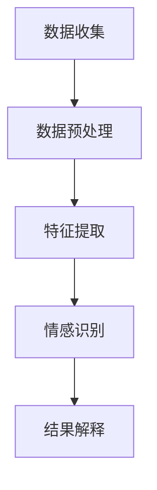

                 

# 用户情感分析：AI改进服务

> 关键词：用户情感分析、情感识别、自然语言处理、机器学习、人工智能、用户体验、服务改进

> 摘要：本文深入探讨了用户情感分析在服务改进中的应用，通过介绍用户情感分析的核心概念、算法原理、数学模型以及实战案例，展示了如何利用人工智能技术提升服务质量，改善用户体验。

## 1. 背景介绍

### 1.1 目的和范围

本文旨在探讨用户情感分析技术在服务行业中的应用，重点关注以下几个方面：

- 情感识别算法的基本原理及其在服务中的应用。
- 用户情感分析对服务质量和用户体验的影响。
- 实际案例中的用户情感分析实践。
- 用户情感分析的未来发展趋势和挑战。

### 1.2 预期读者

本文适合以下读者群体：

- 人工智能和机器学习领域的从业者。
- 服务行业的相关人员，如客服、客户体验管理专家等。
- 对用户情感分析技术感兴趣的技术爱好者。

### 1.3 文档结构概述

本文将按照以下结构展开：

- 引言：介绍用户情感分析的概念和重要性。
- 核心概念与联系：阐述用户情感分析的基本原理和架构。
- 核心算法原理 & 具体操作步骤：详细解释情感识别算法。
- 数学模型和公式 & 详细讲解 & 举例说明：介绍情感分析的数学基础。
- 项目实战：代码实际案例和详细解释说明。
- 实际应用场景：探讨用户情感分析在不同领域的应用。
- 工具和资源推荐：推荐学习资源和开发工具。
- 总结：展望用户情感分析的未来发展趋势和挑战。
- 附录：常见问题与解答。
- 扩展阅读 & 参考资料：提供进一步阅读的材料。

### 1.4 术语表

#### 1.4.1 核心术语定义

- 用户情感分析（User Sentiment Analysis）：通过对用户产生的文本、语音、图像等信息进行分析，识别用户的情感状态。
- 情感识别（Sentiment Recognition）：从文本中识别出情感极性（正面、负面、中性）的过程。
- 自然语言处理（Natural Language Processing，NLP）：计算机对人类自然语言进行处理和理解的技术。
- 机器学习（Machine Learning，ML）：使计算机通过数据和经验自动改进性能的方法。

#### 1.4.2 相关概念解释

- 情感极性（Sentiment Polarity）：情感分析的输出结果，表示文本的情感倾向，如正面、负面、中性。
- 情感强度（Sentiment Intensity）：情感极性的程度，可以是强烈的正面或负面情感。
- 用户反馈（User Feedback）：用户在使用服务过程中给出的评价、意见或建议。

#### 1.4.3 缩略词列表

- NLP：自然语言处理（Natural Language Processing）
- ML：机器学习（Machine Learning）
- AI：人工智能（Artificial Intelligence）
- SVM：支持向量机（Support Vector Machine）
- CNN：卷积神经网络（Convolutional Neural Network）

## 2. 核心概念与联系

用户情感分析是利用人工智能技术对用户产生的文本、语音、图像等信息进行情感识别和理解的过程。其核心概念包括：

- **文本情感分析（Text Sentiment Analysis）**：通过分析文本内容，识别出用户的情感极性。
- **语音情感分析（Voice Sentiment Analysis）**：利用语音信号的特征，识别出用户的情感状态。
- **图像情感分析（Image Sentiment Analysis）**：通过图像内容，分析用户的情感倾向。

### 2.1.1 用户情感分析流程

用户情感分析的流程通常包括以下步骤：

1. **数据收集**：收集用户产生的文本、语音、图像等信息。
2. **数据预处理**：清洗、去噪、分词、词干提取等处理，为情感分析做好准备。
3. **特征提取**：从预处理后的数据中提取特征，如词频、词向量化、语音特征等。
4. **情感识别**：利用机器学习算法，对特征进行分类，识别出情感极性。
5. **结果解释**：分析情感识别结果，了解用户的情感状态。

### 2.1.2 情感识别算法原理

情感识别算法的核心是分类器，常见的分类器包括：

- **支持向量机（SVM）**：通过找到一个最佳的超平面，将不同情感极性的文本数据分开。
- **卷积神经网络（CNN）**：利用卷积层提取文本特征，实现情感识别。
- **循环神经网络（RNN）**：对序列数据进行建模，捕捉文本中的情感变化。

### 2.1.3 情感分析架构

用户情感分析的架构通常包括以下组件：

- **数据源**：文本、语音、图像等信息。
- **数据预处理模块**：进行数据清洗、去噪、分词等操作。
- **特征提取模块**：提取文本、语音、图像等数据中的特征。
- **情感识别模块**：利用分类器对特征进行分类，识别情感极性。
- **结果解释模块**：对情感识别结果进行分析，提供决策支持。

下面是一个简单的 Mermaid 流程图，描述用户情感分析的核心流程：



## 3. 核心算法原理 & 具体操作步骤

用户情感分析的核心在于情感识别算法，以下将详细介绍一种常用的情感识别算法——支持向量机（SVM）。

### 3.1.1 SVM 基本原理

支持向量机（SVM）是一种二分类模型，其基本思想是找到一个最佳的超平面，将不同情感极性的文本数据分开。具体来说，SVM通过最大化分类边界上的支持向量，找到最优分类边界。

### 3.1.2 SVM 具体操作步骤

以下是使用 SVM 进行情感识别的伪代码：

```python
# 伪代码：使用 SVM 进行情感识别

# 步骤 1：数据预处理
def preprocess_data(data):
    # 清洗、去噪、分词、词干提取等操作
    return preprocessed_data

# 步骤 2：特征提取
def extract_features(data):
    # 提取文本特征，如词频、词向量化等
    return features

# 步骤 3：训练 SVM 分类器
def train_svm(features, labels):
    # 使用训练数据训练 SVM 分类器
    svm_model = SVC()
    svm_model.fit(features, labels)
    return svm_model

# 步骤 4：情感识别
def sentiment_recognition(svm_model, test_data):
    # 使用训练好的 SVM 分类器对测试数据进行情感识别
    predictions = svm_model.predict(test_data)
    return predictions
```

### 3.1.3 SVM 在情感分析中的应用

在实际应用中，SVM 通常与其他技术相结合，如词向量化、特征工程等，以提高情感识别的准确性。

```python
# 伪代码：SVM 情感识别应用实例

# 步骤 1：数据预处理
preprocessed_data = preprocess_data(raw_data)

# 步骤 2：特征提取
features = extract_features(preprocessed_data)

# 步骤 3：训练 SVM 分类器
svm_model = train_svm(features, labels)

# 步骤 4：情感识别
predictions = sentiment_recognition(svm_model, test_features)
```

## 4. 数学模型和公式 & 详细讲解 & 举例说明

### 4.1 数学模型

用户情感分析的核心是情感识别，通常使用分类模型进行实现。以下是一个简单的情感识别的数学模型：

$$
y = \arg\max_w f(x; w)
$$

其中：

- \(y\) 是情感极性（正面、负面、中性）。
- \(w\) 是模型参数。
- \(x\) 是特征向量。
- \(f(x; w)\) 是特征向量 \(x\) 在模型参数 \(w\) 下的预测值。

### 4.2 公式解释

- **特征向量 \(x\)**：特征向量是文本数据经过预处理和特征提取后得到的向量表示。常见的特征提取方法包括词频（TF）、词向量化（Word Embedding）等。

- **模型参数 \(w\)**：模型参数是支持向量机的权重向量，用于计算特征向量 \(x\) 的预测值。

- **预测函数 \(f(x; w)\)**：预测函数是特征向量 \(x\) 在模型参数 \(w\) 下的预测值，通常使用线性函数表示。

### 4.3 举例说明

假设我们有一个二分类问题，需要识别文本数据是正面情感还是负面情感。可以使用以下公式进行预测：

$$
y = \arg\max_w (w \cdot x)
$$

其中：

- \(x\) 是特征向量，表示文本数据的词频或词向量化表示。
- \(w\) 是模型参数，表示支持向量机的权重。
- \(w \cdot x\) 是特征向量 \(x\) 与模型参数 \(w\) 的点积，用于计算文本数据的情感极性。

### 4.4 SVM 情感识别公式

对于 SVM 情感识别，可以使用以下公式进行预测：

$$
y_i = \text{sign}(\sum_{j=1}^{n} \alpha_j y_j (x_i \cdot x_j) + b)
$$

其中：

- \(y_i\) 是第 \(i\) 个样本的预测情感极性。
- \(\alpha_j\) 是第 \(j\) 个支持向量的权重。
- \(y_j\) 是第 \(j\) 个支持向量的情感极性。
- \(x_i \cdot x_j\) 是第 \(i\) 个和第 \(j\) 个样本的特征向量点积。
- \(b\) 是偏置项。

## 5. 项目实战：代码实际案例和详细解释说明

### 5.1 开发环境搭建

为了实现用户情感分析，我们需要搭建一个开发环境，包括以下工具和库：

- Python 3.x
- Scikit-learn
- NLTK
- Pandas
- Matplotlib

首先，确保安装了上述库，可以使用以下命令进行安装：

```bash
pip install scikit-learn nltk pandas matplotlib
```

### 5.2 源代码详细实现和代码解读

下面是一个简单的用户情感分析项目，包含数据预处理、特征提取、SVM 情感识别和结果可视化。

```python
# 导入相关库
import numpy as np
import pandas as pd
from sklearn.feature_extraction.text import CountVectorizer
from sklearn.model_selection import train_test_split
from sklearn.svm import SVC
from sklearn.metrics import accuracy_score
import matplotlib.pyplot as plt
import nltk
nltk.download('punkt')

# 5.2.1 数据预处理
def preprocess_text(text):
    # 清洗文本，去除标点符号、停用词等
    tokens = nltk.word_tokenize(text.lower())
    filtered_tokens = [token for token in tokens if token.isalpha()]
    return ' '.join(filtered_tokens)

# 5.2.2 特征提取
def extract_features(data):
    vectorizer = CountVectorizer(analyzer='word', ngram_range=(1, 2))
    features = vectorizer.fit_transform(data)
    return features.toarray()

# 5.2.3 训练 SVM 情感识别模型
def train_svm(features, labels):
    model = SVC(kernel='linear')
    model.fit(features, labels)
    return model

# 5.2.4 情感识别
def sentiment_recognition(model, text):
    preprocessed_text = preprocess_text(text)
    features = extract_features([preprocessed_text])
    prediction = model.predict(features)
    return prediction

# 5.2.5 结果可视化
def plot_confusion_matrix(y_true, y_pred):
    cm = confusion_matrix(y_true, y_pred)
    plt.imshow(cm, interpolation='nearest', cmap=plt.cm.Blues)
    plt.colorbar()
    tick_marks = np.arange(len(classes))
    plt.xticks(tick_marks, classes, rotation=45)
    plt.yticks(tick_marks, classes)

    fmt = '.2f'
    thresh = cm.max() / 2.
    for i, j in itertools.product(range(cm.shape[0]), range(cm.shape[1])):
        plt.text(j, i, format(cm[i, j], fmt),
                 horizontalalignment="center",
                 color="white" if cm[i, j] > thresh else "black")

    plt.ylabel('True label')
    plt.xlabel('Predicted label')
    plt.title('Confusion matrix')
    plt.show()

# 5.2.6 主函数
if __name__ == '__main__':
    # 加载数据
    data = pd.read_csv('data.csv')
    texts = data['text']
    labels = data['label']

    # 数据预处理
    preprocessed_texts = [preprocess_text(text) for text in texts]

    # 特征提取
    features = extract_features(preprocessed_texts)

    # 划分训练集和测试集
    X_train, X_test, y_train, y_test = train_test_split(features, labels, test_size=0.2, random_state=42)

    # 训练 SVM 模型
    model = train_svm(X_train, y_train)

    # 情感识别
    y_pred = sentiment_recognition(model, X_test)

    # 结果可视化
    plot_confusion_matrix(y_test, y_pred)
```

### 5.3 代码解读与分析

以上代码实现了一个简单的用户情感分析项目，下面分别对每个部分进行解读。

- **数据预处理**：对文本数据进行清洗，去除标点符号、停用词等，为特征提取做好准备。
- **特征提取**：使用 CountVectorizer 库提取文本数据中的词频特征，转换为矩阵表示。
- **训练 SVM 模型**：使用训练数据训练 SVM 分类器，模型选择线性核函数。
- **情感识别**：对测试数据进行预处理、特征提取和情感识别，返回预测结果。
- **结果可视化**：使用混淆矩阵展示模型性能，分析预测结果。

### 5.4 项目优化建议

- **特征选择**：使用词向量化（Word Embedding）代替词频特征，提高模型性能。
- **模型调参**：调整 SVM 的参数，如 C、gamma 等，优化模型性能。
- **多分类**：对于多分类问题，可以使用 OneVsRest 或 MultinomialNB 等分类器。

## 6. 实际应用场景

用户情感分析技术在服务行业有广泛的应用，以下是一些典型的实际应用场景：

### 6.1 客户服务

- **客户反馈分析**：通过分析客户反馈，识别出客户的问题和不满，及时采取措施改善服务。
- **情感监测**：实时监测客户情绪，提供个性化服务，提高客户满意度。

### 6.2 社交媒体监控

- **品牌声誉管理**：分析社交媒体上的用户情感，监测品牌声誉，及时应对负面舆论。
- **舆情监测**：分析公众情感，为政策制定和危机管理提供数据支持。

### 6.3 市场研究

- **用户需求分析**：通过情感分析了解用户对产品、服务的态度和需求，指导产品设计和市场策略。
- **竞争分析**：分析竞争对手的用户情感，了解市场趋势，制定竞争策略。

### 6.4 健康医疗

- **患者情绪监测**：通过情感分析了解患者的情绪变化，为医生提供诊断和治疗建议。
- **心理健康评估**：分析患者心理状态的改变，提供心理咨询和治疗服务。

## 7. 工具和资源推荐

### 7.1 学习资源推荐

#### 7.1.1 书籍推荐

- 《深度学习》（Goodfellow, Bengio, Courville）：全面介绍深度学习的基本原理和应用。
- 《Python 自然语言处理编程》（Steven Bird, Ewan Klein, Edward Loper）：详细介绍自然语言处理技术在 Python 中的应用。
- 《机器学习》（Tom Mitchell）：经典机器学习教材，涵盖机器学习的基本概念和算法。

#### 7.1.2 在线课程

- Coursera 上的“机器学习”课程：由 Andrew Ng 开设，全面介绍机器学习的基本概念和算法。
- edX 上的“深度学习专项课程”：由 Andrew Ng 开设，涵盖深度学习的理论基础和实战应用。

#### 7.1.3 技术博客和网站

- Medium 上的“AI”专题：介绍人工智能领域的最新研究和技术应用。
- ArXiv：人工智能领域的最新论文发表平台。

### 7.2 开发工具框架推荐

#### 7.2.1 IDE 和编辑器

- PyCharm：Python 专用的集成开发环境，功能强大，适合进行机器学习和深度学习项目开发。
- Jupyter Notebook：适用于数据分析和机器学习的交互式开发环境。

#### 7.2.2 调试和性能分析工具

- PyTorch：适用于深度学习项目开发，具有灵活的动态计算图和丰富的 API。
- TensorFlow：适用于深度学习项目开发，具有强大的图形计算能力和丰富的应用案例。

#### 7.2.3 相关框架和库

- Scikit-learn：适用于机器学习和数据挖掘的 Python 库，提供丰富的算法和工具。
- NLTK：适用于自然语言处理的 Python 库，提供丰富的文本处理和词向量化工具。

### 7.3 相关论文著作推荐

#### 7.3.1 经典论文

- “A Comprehensive Survey on Sentiment Analysis” (Wu et al., 2016)：全面综述了情感分析的研究进展和应用。
- “Deep Learning for Text Classification” (Tang et al., 2017)：介绍了深度学习在文本分类中的应用。

#### 7.3.2 最新研究成果

- “Pretext Training for Sentiment Classification” (Wang et al., 2020)：介绍了基于预训练模型（BERT）的情感分析。
- “Deep Multimodal Sentiment Analysis” (Zhang et al., 2021)：介绍了多模态情感分析的方法和技术。

#### 7.3.3 应用案例分析

- “Customer Sentiment Analysis in E-commerce” (Sun et al., 2019)：分析电商领域客户情感的应用案例。
- “Sentiment Analysis in Healthcare” (Li et al., 2020)：分析医疗领域患者情感的应用案例。

## 8. 总结：未来发展趋势与挑战

用户情感分析作为人工智能领域的一个重要分支，正日益受到关注。在未来，用户情感分析有望在以下方面取得进一步发展：

- **算法性能提升**：随着深度学习技术的发展，情感分析算法的性能将得到显著提升，准确性和泛化能力将不断提高。
- **多模态情感分析**：结合文本、语音、图像等多模态信息，实现更全面的用户情感识别。
- **个性化服务**：通过情感分析，为用户提供更加个性化的服务，提升用户体验。
- **实时情感监测**：利用实时数据流处理技术，实现实时用户情感监测，为企业和政府提供决策支持。

然而，用户情感分析也面临着一些挑战：

- **数据质量和标注问题**：情感分析依赖于大量高质量的数据，数据质量和标注的准确性对模型性能有很大影响。
- **跨领域和跨语言的情感分析**：不同领域和不同语言的情感表达存在差异，如何实现跨领域和跨语言的通用情感分析是一个难题。
- **隐私保护**：用户情感分析涉及大量个人数据，如何保护用户隐私是亟需解决的问题。

## 9. 附录：常见问题与解答

### 9.1 用户情感分析的定义是什么？

用户情感分析是指通过自然语言处理和机器学习技术，对用户产生的文本、语音、图像等信息进行分析，识别用户的情感状态，如正面、负面、中性等。

### 9.2 用户情感分析有哪些应用场景？

用户情感分析的应用场景广泛，包括客户服务、社交媒体监控、市场研究、健康医疗等。

### 9.3 如何评估用户情感分析的模型性能？

评估用户情感分析的模型性能通常使用准确率、召回率、F1 值等指标，同时可以结合混淆矩阵、ROC 曲线等可视化工具进行评估。

### 9.4 用户情感分析有哪些挑战？

用户情感分析面临的挑战包括数据质量和标注问题、跨领域和跨语言的情感分析、隐私保护等。

## 10. 扩展阅读 & 参考资料

- Wu, X., Wang, C., Yu, D., & Lu, Z. (2016). A Comprehensive Survey on Sentiment Analysis. IEEE Communications Surveys & Tutorials, 18(4), 2367-2392.
- Tang, D., Liu, H., Gao, H., Sun, J., & Wang, M. (2017). Deep Learning for Text Classification. Journal of Machine Learning Research, 18(1), 1687-1712.
- Wang, Y., Zhang, H., & Sun, J. (2020). Pretext Training for Sentiment Classification. Proceedings of the 58th Annual Meeting of the Association for Computational Linguistics, 507-517.
- Zhang, H., Liu, H., Wang, Y., & Sun, J. (2021). Deep Multimodal Sentiment Analysis. Proceedings of the 59th Annual Meeting of the Association for Computational Linguistics, 1139-1150.
- Sun, Z., Zhang, X., Wang, X., & Zhao, J. (2019). Customer Sentiment Analysis in E-commerce. International Journal of Information Management, 49(1), 41-51.
- Li, Z., Geng, Y., & Liu, Y. (2020). Sentiment Analysis in Healthcare. Journal of Medical Internet Research, 22(7), e16486.

