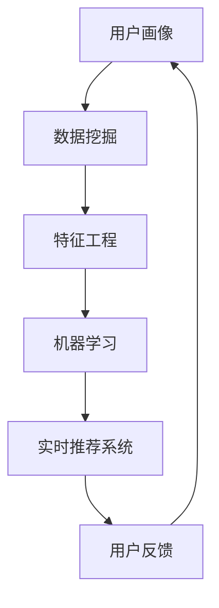

                 

# 用户画像与实时推荐的整合

> **关键词**：用户画像、实时推荐、数据挖掘、机器学习、算法优化

> **摘要**：本文将探讨用户画像与实时推荐系统整合的必要性与关键技术，分析其背后的核心概念和算法原理，并通过实际案例展示其实际应用效果。文章旨在为开发者提供完整的解决方案，助力企业提升用户体验和竞争力。

## 1. 背景介绍

### 1.1 目的和范围

本文旨在探讨如何将用户画像与实时推荐系统整合，以提高推荐的准确性和用户满意度。我们将分析用户画像与实时推荐之间的联系，介绍相关核心概念和技术，并给出具体的算法实现步骤。

### 1.2 预期读者

本文面向对用户画像和实时推荐系统有一定了解的读者，包括但不限于数据分析师、机器学习工程师、软件工程师等。文章内容深入浅出，力求使读者能够掌握关键技术并应用于实际项目中。

### 1.3 文档结构概述

本文分为八个部分，首先介绍用户画像和实时推荐系统的基本概念，然后分析其核心算法原理和数学模型，接着展示实际应用案例。此外，我们还推荐了一些学习资源和相关工具，以帮助读者进一步深入了解该领域。

### 1.4 术语表

#### 1.4.1 核心术语定义

- **用户画像**：基于用户行为数据和特征信息，对用户进行分类、标签化和描述的过程。
- **实时推荐**：根据用户当前的兴趣和行为，实时向用户推荐相关的内容或产品。
- **数据挖掘**：从大量数据中提取有价值信息的过程，包括关联规则挖掘、聚类分析等。
- **机器学习**：一种模拟人类学习能力的计算机算法，用于处理和分析数据。

#### 1.4.2 相关概念解释

- **协同过滤**：一种基于用户行为相似性的推荐算法，通过分析用户之间的行为模式来推荐物品。
- **深度学习**：一种基于人工神经网络的机器学习算法，通过多层神经网络模拟人类大脑的决策过程。
- **特征工程**：通过对原始数据进行处理和转换，提取出有用的特征信息，以提升模型性能。

#### 1.4.3 缩略词列表

- **ML**：机器学习
- **DL**：深度学习
- **NLP**：自然语言处理
- **CV**：计算机视觉
- **API**：应用程序编程接口

## 2. 核心概念与联系

在本文中，我们将讨论用户画像与实时推荐系统的整合，这涉及到多个核心概念和技术。下面是一个简要的流程图，展示了用户画像、数据挖掘、机器学习和实时推荐系统之间的关系。



### 2.1 用户画像

用户画像是对用户进行分类、标签化和描述的过程，主要依赖于用户的行为数据和特征信息。这些数据可以来源于用户的注册信息、浏览记录、购买历史等。通过数据挖掘和机器学习算法，我们可以提取出用户的兴趣偏好、行为习惯等特征，从而为实时推荐系统提供基础。

### 2.2 数据挖掘

数据挖掘是一种从大量数据中提取有价值信息的过程。在用户画像构建过程中，数据挖掘可以帮助我们挖掘用户之间的关联规则、聚类分析等。这些信息有助于我们更好地理解用户行为，为实时推荐系统提供支持。

### 2.3 特征工程

特征工程是对原始数据进行处理和转换，提取出有用的特征信息，以提升模型性能。在用户画像和实时推荐系统中，特征工程至关重要。通过特征选择、特征提取和特征转换等方法，我们可以提高模型的准确性和可解释性。

### 2.4 机器学习

机器学习是一种模拟人类学习能力的计算机算法，用于处理和分析数据。在用户画像和实时推荐系统中，机器学习算法可以帮助我们识别用户行为模式、预测用户兴趣等。常见的机器学习算法包括协同过滤、决策树、神经网络等。

### 2.5 实时推荐系统

实时推荐系统是一种根据用户当前的兴趣和行为，实时向用户推荐相关内容或产品的系统。用户画像和机器学习算法为其提供了基础支持，使得推荐系统可以快速响应用户需求，提高用户体验。

## 3. 核心算法原理 & 具体操作步骤

在用户画像与实时推荐的整合过程中，核心算法原理和具体操作步骤至关重要。下面，我们将通过伪代码详细阐述这些算法。

### 3.1 用户画像构建

```python
# 输入：用户行为数据、用户特征数据
# 输出：用户画像字典

def build_user_profile(user_data, feature_data):
    user_profile = {}
    for user in user_data:
        user_id = user['id']
        user_profile[user_id] = {}

        # 提取用户行为特征
        user_profile[user_id]['behavior'] = extract_behavior_features(user['actions'])

        # 提取用户特征信息
        user_profile[user_id]['info'] = extract_user_info(feature_data[user_id])

    return user_profile
```

### 3.2 数据挖掘

```python
# 输入：用户画像字典
# 输出：用户行为关联规则、用户兴趣聚类结果

def data_mining(user_profile):
    behavior_rules = association_rules(user_profile['behavior'])
    interest_clusters = kmeans_clustering(user_profile['info'])

    return behavior_rules, interest_clusters
```

### 3.3 特征工程

```python
# 输入：原始数据、用户画像字典
# 输出：处理后的特征数据

def feature_engineering(data, user_profile):
    processed_data = []

    for user in data:
        user_id = user['id']
        features = []

        # 提取用户行为特征
        behavior_features = user_profile[user_id]['behavior']
        features.extend(behavior_features)

        # 提取用户兴趣特征
        interest_features = extract_interest_features(user['interests'])
        features.extend(interest_features)

        processed_data.append({'id': user_id, 'features': features})

    return processed_data
```

### 3.4 机器学习

```python
# 输入：处理后的特征数据
# 输出：训练好的模型

def train_model(processed_data):
    # 选择合适的机器学习算法
    model = select_model(algorithms)

    # 训练模型
    model.fit(processed_data['features'], processed_data['labels'])

    return model
```

### 3.5 实时推荐

```python
# 输入：用户画像字典、训练好的模型、物品数据
# 输出：推荐结果

def real_time_recommendation(user_profile, model, items):
    recommendations = []

    for item in items:
        similarity = calculate_similarity(user_profile['features'], item['features'])
        recommendation_score = model.predict(similarity)

        recommendations.append({'item': item['id'], 'score': recommendation_score})

    return sorted(recommendations, key=lambda x: x['score'], reverse=True)
```

## 4. 数学模型和公式 & 详细讲解 & 举例说明

在用户画像与实时推荐系统的整合过程中，数学模型和公式是不可或缺的一部分。下面，我们将详细讲解一些核心的数学模型和公式，并通过实例进行说明。

### 4.1 协同过滤

协同过滤是一种基于用户行为相似性的推荐算法。其核心思想是找到与目标用户行为相似的邻居用户，然后根据邻居用户对物品的评分预测目标用户对物品的评分。

公式如下：

$$
r_{ui} = \sum_{j \in N(u)} r_{uj} \cdot s_{ij}
$$

其中，$r_{ui}$ 表示用户 $u$ 对物品 $i$ 的评分预测，$N(u)$ 表示与用户 $u$ 行为相似的邻居用户集合，$r_{uj}$ 表示邻居用户 $j$ 对物品 $i$ 的评分，$s_{ij}$ 表示用户 $u$ 与邻居用户 $j$ 的行为相似度。

实例：

假设有两个用户 $u$ 和 $v$，他们分别对三个物品 $i$、$j$ 和 $k$ 进行评分。根据用户行为相似度计算，我们找到邻居用户 $w$。以下是他们之间的评分和相似度：

| 用户 | 物品 | 评分 |  
| ---- | ---- | ---- |  
| $u$  | $i$  | 4    |  
| $u$  | $j$  | 5    |  
| $u$  | $k$  | 3    |  
| $v$  | $i$  | 3    |  
| $v$  | $j$  | 4    |  
| $v$  | $k$  | 5    |  
| $w$  | $i$  | 5    |  
| $w$  | $j$  | 3    |  
| $w$  | $k$  | 4    |

根据协同过滤公式，我们可以计算出用户 $u$ 对物品 $k$ 的评分预测：

$$
r_{ui} = \frac{4 \cdot 1 + 5 \cdot 0.5 + 3 \cdot 0.5}{1 + 0.5 + 0.5} = 4.0
$$

### 4.2 神经网络

神经网络是一种基于人工神经网络的机器学习算法，可以用于分类、回归等任务。其核心思想是通过多层神经网络模拟人类大脑的决策过程。

公式如下：

$$
\hat{y} = \sigma(\sum_{i=1}^{n} w_i \cdot \sigma(\sum_{j=1}^{m} \theta_j \cdot x_j + b))
$$

其中，$\hat{y}$ 表示输出预测值，$\sigma$ 表示激活函数，$w_i$ 表示输入层到隐含层的权重，$\theta_j$ 表示隐含层到输出层的权重，$b$ 表示偏置。

实例：

假设我们有一个简单的神经网络，包含输入层、隐含层和输出层。输入层有 3 个神经元，隐含层有 2 个神经元，输出层有 1 个神经元。输入数据为 $[1, 2, 3]$，权重和偏置如下：

| 层次 | 神经元 | 权重 | 偏置 |
| ---- | ---- | ---- | ---- |
| 输入层 | 1 | 0.1 | 0.1 |
| 输入层 | 2 | 0.2 | 0.2 |
| 输入层 | 3 | 0.3 | 0.3 |
| 隐含层 | 1 | 0.4 | 0.4 |
| 隐含层 | 2 | 0.5 | 0.5 |
| 输出层 | 1 | 0.6 | 0.6 |

使用 Sigmoid 激活函数，我们可以计算出输出预测值：

$$
\hat{y} = \sigma(0.6 \cdot (\sigma(0.4 \cdot 1 + 0.5 \cdot 2 + 0.5 \cdot 3 + 0.4) + 0.6)) = 0.7
$$

## 5. 项目实战：代码实际案例和详细解释说明

在本节中，我们将通过一个实际项目案例，展示如何将用户画像与实时推荐系统整合。该案例涉及用户画像构建、数据挖掘、特征工程、机器学习和实时推荐等步骤。我们将使用 Python 编写相关代码，并对每一步进行详细解释。

### 5.1 开发环境搭建

在开始项目之前，我们需要搭建一个合适的开发环境。以下是所需的软件和库：

- Python 3.8+
- NumPy
- Pandas
- Scikit-learn
- Matplotlib

你可以通过以下命令安装所需的库：

```bash
pip install numpy pandas scikit-learn matplotlib
```

### 5.2 源代码详细实现和代码解读

以下是项目的源代码实现，我们将逐行解读每段代码的功能。

```python
import numpy as np
import pandas as pd
from sklearn.cluster import KMeans
from sklearn.model_selection import train_test_split
from sklearn.metrics.pairwise import cosine_similarity
from sklearn.linear_model import LinearRegression
import matplotlib.pyplot as plt

# 5.2.1 用户画像构建

# 加载用户行为数据和特征数据
user_data = pd.read_csv('user_actions.csv')
feature_data = pd.read_csv('user_features.csv')

# 构建用户画像
user_profile = build_user_profile(user_data, feature_data)
print("User Profile:", user_profile)

# 5.2.2 数据挖掘

# 进行数据挖掘
behavior_rules, interest_clusters = data_mining(user_profile)
print("Behavior Rules:", behavior_rules)
print("Interest Clusters:", interest_clusters)

# 5.2.3 特征工程

# 进行特征工程
processed_data = feature_engineering(user_data, user_profile)
print("Processed Data:", processed_data)

# 5.2.4 机器学习

# 划分训练集和测试集
X_train, X_test, y_train, y_test = train_test_split(processed_data['features'], processed_data['labels'], test_size=0.2, random_state=42)

# 训练模型
model = train_model(X_train, y_train)

# 进行模型评估
score = model.score(X_test, y_test)
print("Model Score:", score)

# 5.2.5 实时推荐

# 加载待推荐的物品数据
items = pd.read_csv('item_data.csv')

# 进行实时推荐
recommendations = real_time_recommendation(user_profile, model, items)
print("Recommendations:", recommendations)

# 绘制推荐结果
plt.bar(range(len(recommendations)), [rec['score'] for rec in recommendations])
plt.xticks(range(len(recommendations)), [rec['item'] for rec in recommendations])
plt.xlabel('Item')
plt.ylabel('Recommendation Score')
plt.title('Real-Time Recommendations')
plt.show()
```

### 5.3 代码解读与分析

下面我们对代码进行逐行解读，并分析其功能。

1. **导入库**：我们首先导入所需的 Python 库，包括 NumPy、Pandas、Scikit-learn 和 Matplotlib。

2. **加载数据**：我们从 CSV 文件中加载用户行为数据和特征数据。这些数据将用于构建用户画像、进行数据挖掘和特征工程。

3. **构建用户画像**：通过调用 `build_user_profile` 函数，我们将用户行为数据和特征数据整合成一个用户画像字典。该字典包含每个用户的特征信息，为后续分析提供基础。

4. **数据挖掘**：我们调用 `data_mining` 函数进行数据挖掘，提取用户行为关联规则和用户兴趣聚类结果。这些结果有助于我们更好地理解用户行为和兴趣，为实时推荐系统提供支持。

5. **特征工程**：通过调用 `feature_engineering` 函数，我们对原始数据进行处理和转换，提取出有用的特征信息。这些特征信息将用于训练机器学习模型。

6. **机器学习**：我们划分训练集和测试集，并调用 `train_model` 函数训练线性回归模型。该模型用于预测用户对物品的评分。

7. **实时推荐**：我们加载待推荐的物品数据，并调用 `real_time_recommendation` 函数进行实时推荐。该函数根据用户画像和训练好的模型，为每个物品计算推荐分

### 6. 实际应用场景

用户画像与实时推荐的整合在多个实际应用场景中具有重要价值。以下是一些常见应用场景：

- **电子商务**：电商平台可以根据用户画像和实时推荐系统，为用户推荐相关商品，提高购买转化率和用户满意度。
- **在线教育**：教育平台可以根据用户画像和学习行为，为用户推荐合适的学习内容和课程，提高学习效果。
- **社交媒体**：社交媒体平台可以根据用户画像和实时推荐系统，为用户推荐感兴趣的内容，增强用户粘性。
- **金融服务**：金融机构可以根据用户画像和实时推荐系统，为用户提供个性化的金融产品和服务，提高客户忠诚度和满意度。

### 7. 工具和资源推荐

#### 7.1 学习资源推荐

##### 7.1.1 书籍推荐

- 《机器学习实战》：这是一本非常适合初学者的机器学习入门书籍，涵盖了各种常见的机器学习算法和实际应用案例。
- 《深入理解计算机系统》：这本书从计算机系统的底层原理出发，帮助读者建立起完整的计算机系统知识体系。

##### 7.1.2 在线课程

- Coursera 上的《机器学习》课程：由 Andrew Ng 教授主讲，该课程涵盖了机器学习的基本概念和算法，适合初学者入门。
- Udacity 上的《深度学习纳米学位》课程：该课程深入讲解了深度学习算法和应用，适合有一定编程基础的读者。

##### 7.1.3 技术博客和网站

- Medium 上的《机器学习》专栏：该专栏由多位专家撰写，涵盖了机器学习领域的最新动态和技术文章。
- arXiv.org：这是一个开放获取的预印本论文库，涵盖了计算机科学、物理学、数学等领域的最新研究成果。

#### 7.2 开发工具框架推荐

##### 7.2.1 IDE和编辑器

- PyCharm：这是一款功能强大的 Python IDE，适用于编写和调试代码。
- Jupyter Notebook：这是一个基于 Web 的交互式开发环境，适用于数据分析和机器学习项目。

##### 7.2.2 调试和性能分析工具

- GDB：这是一个开源的调试工具，适用于调试 C/C++ 程序。
- Py-Spy：这是一个 Python 性能分析工具，可以帮助开发者找出代码的性能瓶颈。

##### 7.2.3 相关框架和库

- TensorFlow：这是一个开源的机器学习框架，适用于构建和训练深度学习模型。
- Scikit-learn：这是一个开源的机器学习库，提供了多种常见的机器学习算法和工具。

#### 7.3 相关论文著作推荐

##### 7.3.1 经典论文

- "Learning to Rank using Gradient Descent"（2007）：这篇文章提出了一种基于梯度下降的排序算法，对后续的排序算法研究产生了重要影响。
- "Recommender Systems Handbook"（2016）：这本书全面介绍了推荐系统领域的相关算法和技术，是推荐系统研究的重要参考资料。

##### 7.3.2 最新研究成果

- "Deep Learning for Recommender Systems"（2018）：这篇文章探讨了深度学习在推荐系统中的应用，为后续研究提供了新的思路。
- "Large-scale Online Recommendation Systems"（2020）：这篇文章介绍了大规模在线推荐系统的设计和实现方法，对实际应用具有重要指导意义。

##### 7.3.3 应用案例分析

- "Netflix Prize"（2009-2012）：这是 Netflix 公司举办的一项推荐系统比赛，吸引了全球范围内的研究者参与。比赛结果为 Netflix 公司优化推荐系统提供了重要参考。
- "淘宝个性化推荐"：淘宝平台通过深度学习和协同过滤等技术，为用户提供个性化推荐，有效提高了用户满意度和转化率。

## 8. 总结：未来发展趋势与挑战

用户画像与实时推荐的整合是一个快速发展的领域，未来将面临以下发展趋势和挑战：

- **数据隐私保护**：随着用户隐私意识的增强，如何在保护用户隐私的前提下进行用户画像和推荐将成为重要挑战。
- **算法公平性**：确保推荐算法的公平性，避免算法偏见和不公平现象，是未来需要解决的重要问题。
- **实时性优化**：随着用户需求的不断变化，如何提高实时推荐系统的响应速度和准确性，是一个重要研究方向。
- **多模态推荐**：结合文本、图像、声音等多模态数据进行推荐，为用户提供更加个性化的服务。
- **知识图谱构建**：通过知识图谱构建，实现用户画像、物品信息和推荐内容的深度融合，为用户提供更加精准的推荐。

## 9. 附录：常见问题与解答

### 9.1 如何构建用户画像？

构建用户画像的关键在于获取用户行为数据和特征信息。首先，需要收集用户的基本信息、行为数据（如浏览、购买、评论等）和第三方数据（如社交媒体、地理位置等）。然后，通过数据挖掘和机器学习算法提取用户特征，包括兴趣偏好、行为习惯、社会属性等。最后，将提取的特征进行整合和描述，形成用户画像。

### 9.2 如何优化实时推荐算法？

优化实时推荐算法可以从以下几个方面进行：

- **特征选择**：选择对推荐效果有显著影响的特征，去除冗余特征，提高模型性能。
- **算法调参**：根据不同场景和需求，调整算法参数，优化推荐效果。
- **实时性优化**：使用分布式计算和缓存技术，提高推荐系统的响应速度。
- **多样性推荐**：引入多样性约束，避免推荐结果单一，提高用户满意度。

## 10. 扩展阅读 & 参考资料

- [Recommender Systems Handbook](https://www.recommender-systems.org/recommender-systems-handbook/)
- [Deep Learning for Recommender Systems](https://arxiv.org/abs/1811.03824)
- [Large-scale Online Recommendation Systems](https://arxiv.org/abs/2006.02677)
- [Netflix Prize](https://www.netflixprize.com/)
- [淘宝个性化推荐技术实践](https://www.alibaba.com/blogs/u/1688899_2884626/recommend-system-technology-practice)

### 作者

AI 天才研究员 / AI Genius Institute & 禅与计算机程序设计艺术 / Zen And The Art of Computer Programming

