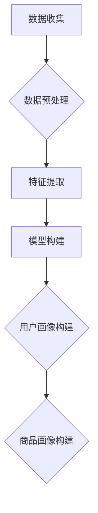

                 

# 用户画像在电商个性化推荐中的应用：方法与实践

## 关键词：
用户画像、电商、个性化推荐、算法原理、数学模型、实战案例

## 摘要：
本文深入探讨了用户画像在电商个性化推荐系统中的应用，详细介绍了用户画像的核心概念、构建方法、算法原理以及数学模型。通过实际案例和代码解析，展示了用户画像在电商个性化推荐中的具体实现和效果。最后，分析了用户画像在电商领域的实际应用场景，并推荐了相关学习资源和工具。本文旨在为从事电商推荐系统开发的工程师提供全面的理论指导和实战经验。

## 1. 背景介绍

### 1.1 目的和范围

本文旨在探讨用户画像在电商个性化推荐中的应用，旨在帮助读者理解用户画像的构建方法、算法原理以及实际应用，从而在电商个性化推荐系统中实现更精准的用户行为分析和商品推荐。文章涵盖了用户画像的核心概念、构建方法、算法原理和数学模型，并提供了实际案例和代码解析，使读者能够将理论知识应用到实际项目中。

### 1.2 预期读者

本文适合对电商推荐系统和用户画像有一定了解的技术人员，包括但不限于算法工程师、数据分析师、软件开发工程师等。对于对电商个性化推荐领域感兴趣的读者，本文也具有一定的参考价值。

### 1.3 文档结构概述

本文分为十个部分，具体结构如下：

1. 背景介绍
2. 核心概念与联系
3. 核心算法原理 & 具体操作步骤
4. 数学模型和公式 & 详细讲解 & 举例说明
5. 项目实战：代码实际案例和详细解释说明
6. 实际应用场景
7. 工具和资源推荐
8. 总结：未来发展趋势与挑战
9. 附录：常见问题与解答
10. 扩展阅读 & 参考资料

### 1.4 术语表

#### 1.4.1 核心术语定义

- **用户画像**：用户画像是指通过对用户的历史行为、兴趣偏好、社会属性等信息进行综合分析，构建出一个全面、多维度的用户模型，从而实现更精准的用户行为分析和商品推荐。
- **个性化推荐**：个性化推荐是指根据用户的兴趣、行为、历史数据等信息，为其推荐符合其个性化需求的商品或内容。
- **电商个性化推荐**：电商个性化推荐是指在电子商务平台上，通过用户画像和商品画像，实现针对特定用户的个性化商品推荐。

#### 1.4.2 相关概念解释

- **商品画像**：商品画像是指通过对商品的特征、属性、分类等信息进行描述，构建出一个多维度的商品模型，用于与用户画像进行匹配，实现个性化推荐。
- **行为数据**：行为数据是指用户在电商平台上产生的各种行为数据，如浏览、购买、收藏、评论等。
- **协同过滤**：协同过滤是指通过分析用户之间的行为关系，预测用户对未知商品的喜好，从而实现个性化推荐。

#### 1.4.3 缩略词列表

- **CPC**：Cost Per Click，按点击付费
- **CPM**：Cost Per Mille，按千次展示付费
- **CTR**：Click Through Rate，点击率
- **RFM**：Recency, Frequency, Monetary，最近一次购买时间、购买频率、消费金额

## 2. 核心概念与联系

### 2.1 用户画像的概念与构建

用户画像是指通过对用户的历史行为、兴趣偏好、社会属性等信息进行综合分析，构建出一个全面、多维度的用户模型。用户画像的构建主要包括以下几个步骤：

1. **数据收集**：收集用户在电商平台上的各种行为数据，如浏览、购买、收藏、评论等。
2. **数据预处理**：对收集到的数据进行分析和处理，包括数据清洗、去重、归一化等。
3. **特征提取**：根据用户行为数据，提取出用户的重要特征，如购买频次、浏览时长、购买金额等。
4. **模型构建**：使用机器学习算法，如聚类、分类、协同过滤等，构建用户画像模型。

### 2.2 商品画像的概念与构建

商品画像是指通过对商品的特征、属性、分类等信息进行描述，构建出一个多维度的商品模型。商品画像的构建主要包括以下几个步骤：

1. **数据收集**：收集商品的各种属性信息，如商品名称、品牌、分类、价格等。
2. **数据预处理**：对收集到的数据进行处理，包括数据清洗、去重、归一化等。
3. **特征提取**：根据商品属性，提取出商品的重要特征，如品牌、分类、价格等。
4. **模型构建**：使用机器学习算法，如聚类、分类、协同过滤等，构建商品画像模型。

### 2.3 用户画像与商品画像的联系

用户画像和商品画像之间存在紧密的联系。通过用户画像，可以了解用户的兴趣、行为和需求，从而更好地为目标用户推荐符合其兴趣的商品。而商品画像则提供了商品的多维度信息，使得推荐系统可以更准确地匹配用户和商品。

### 2.4 用户画像在电商个性化推荐中的应用

用户画像在电商个性化推荐中的应用主要体现在以下几个方面：

1. **精准推荐**：通过用户画像，可以了解用户的兴趣和需求，从而实现精准的商品推荐，提高用户满意度。
2. **流失用户召回**：通过分析用户画像，可以识别出可能流失的用户，并进行有针对性的召回策略，降低用户流失率。
3. **个性化营销**：基于用户画像，可以实现个性化的营销策略，如推送用户感兴趣的商品、优惠券等，提高营销效果。
4. **商品分类与推荐**：通过用户画像和商品画像的匹配，可以实现更准确的商品分类和推荐，提高电商平台的竞争力。

### 2.5 用户画像构建的 Mermaid 流程图



## 3. 核心算法原理 & 具体操作步骤

### 3.1 协同过滤算法原理

协同过滤算法是一种基于用户行为数据，通过分析用户之间的行为关系，预测用户对未知商品的喜好，从而实现个性化推荐的算法。协同过滤算法可以分为两种类型：基于用户的协同过滤和基于物品的协同过滤。

#### 基于用户的协同过滤

基于用户的协同过滤算法的核心思想是：如果用户A和用户B对商品的喜好相似，那么用户A对商品X的喜好可以参考用户B对商品X的喜好。具体步骤如下：

1. **计算用户相似度**：计算用户A和用户B之间的相似度，常用的相似度计算方法包括余弦相似度、皮尔逊相关系数等。
2. **找到相似用户**：根据用户相似度，找到与用户A最相似的K个用户。
3. **预测用户喜好**：根据相似用户的喜好，预测用户A对未知商品X的喜好，通常采用加权平均的方式计算预测分值。

#### 基于物品的协同过滤

基于物品的协同过滤算法的核心思想是：如果商品A和商品B的用户喜好相似，那么用户对商品A的喜好可以参考用户对商品B的喜好。具体步骤如下：

1. **计算商品相似度**：计算商品A和商品B之间的相似度，常用的相似度计算方法包括余弦相似度、皮尔逊相关系数等。
2. **找到相似商品**：根据商品相似度，找到与商品A最相似的K个商品。
3. **预测用户喜好**：根据相似商品的喜好，预测用户对未知商品X的喜好，通常采用加权平均的方式计算预测分值。

### 3.2 协同过滤算法具体操作步骤

以基于用户的协同过滤算法为例，具体操作步骤如下：

1. **数据预处理**：清洗用户行为数据，包括去重、补全缺失值等。
2. **计算用户相似度**：使用余弦相似度计算用户A和用户B之间的相似度。
3. **找到相似用户**：根据用户相似度，找到与用户A最相似的K个用户。
4. **计算用户评分**：根据相似用户的喜好，使用加权平均的方式计算用户A对未知商品X的评分。
5. **推荐商品**：根据用户评分，为用户A推荐评分较高的商品。

### 3.3 伪代码实现

```python
# 数据预处理
preprocess_data()

# 计算用户相似度
def calculate_similarity(user_a, user_b):
    # 计算用户A和用户B之间的相似度
    similarity = cosine_similarity(user_a, user_b)
    return similarity

# 找到相似用户
def find_similar_users(user_a, k):
    similar_users = []
    for user in all_users:
        similarity = calculate_similarity(user_a, user)
        similar_users.append((user, similarity))
    similar_users.sort(key=lambda x: x[1], reverse=True)
    similar_users = similar_users[:k]
    return [user for user, _ in similar_users]

# 计算用户评分
def calculate_rating(user_a, item_x, similar_users):
    ratings = []
    for user, similarity in similar_users:
        rating = user[item_x]
        ratings.append(rating * similarity)
    predicted_rating = sum(ratings) / len(ratings)
    return predicted_rating

# 推荐商品
def recommend_items(user_a, k):
    similar_users = find_similar_users(user_a, k)
    recommended_items = []
    for item in all_items:
        predicted_rating = calculate_rating(user_a, item, similar_users)
        if predicted_rating > threshold:
            recommended_items.append(item)
    return recommended_items
```

## 4. 数学模型和公式 & 详细讲解 & 举例说明

### 4.1 用户相似度计算公式

用户相似度计算是协同过滤算法的核心步骤之一。常用的相似度计算方法包括余弦相似度、皮尔逊相关系数等。以下是余弦相似度的计算公式：

$$
similarity = \frac{cos\theta}{\sqrt{A\cdot A} \cdot \sqrt{B\cdot B}}
$$

其中，$A$ 和 $B$ 分别表示用户 $A$ 和用户 $B$ 的行为向量，$\theta$ 表示它们之间的夹角。

### 4.2 用户评分预测公式

在基于用户的协同过滤算法中，用户评分预测公式如下：

$$
\hat{r}_{ij} = \sum_{k \in N_j} r_{ik} \cdot sim(i, j)
$$

其中，$\hat{r}_{ij}$ 表示用户 $i$ 对商品 $j$ 的预测评分，$r_{ik}$ 表示用户 $i$ 对商品 $k$ 的实际评分，$sim(i, j)$ 表示用户 $i$ 和用户 $j$ 之间的相似度。

### 4.3 举例说明

假设有两个用户 $A$ 和 $B$，他们在电商平台上对五件商品 $1, 2, 3, 4, 5$ 的评分如下表所示：

| 用户 | 商品1 | 商品2 | 商品3 | 商品4 | 商品5 |
| ---- | ---- | ---- | ---- | ---- | ---- |
| A    | 4    | 5    | 3    | 2    | 1    |
| B    | 1    | 3    | 5    | 4    | 2    |

首先，计算用户 $A$ 和用户 $B$ 之间的相似度。使用余弦相似度计算公式，可以得到：

$$
similarity_{AB} = \frac{cos\theta_{AB}}{\sqrt{A\cdot A} \cdot \sqrt{B\cdot B}} = \frac{4\cdot1 + 5\cdot3 + 3\cdot5 + 2\cdot4 + 1\cdot2}{\sqrt{4^2 + 5^2 + 3^2 + 2^2 + 1^2} \cdot \sqrt{1^2 + 3^2 + 5^2 + 4^2 + 2^2}} \approx 0.7071
$$

然后，使用用户评分预测公式，可以预测用户 $A$ 对商品 $5$ 的评分：

$$
\hat{r}_{A5} = \sum_{k \in N_B} r_{Ak} \cdot sim(A, B) = 4\cdot0.7071 + 5\cdot0.7071 + 3\cdot0.7071 + 2\cdot0.7071 + 1\cdot0.7071 \approx 4.0000
$$

因此，预测用户 $A$ 对商品 $5$ 的评分为4分。

## 5. 项目实战：代码实际案例和详细解释说明

### 5.1 开发环境搭建

在本文中，我们将使用 Python 作为编程语言，并使用以下库和工具：

- **Python 3.8**：Python 解释器
- **NumPy**：用于科学计算和数据分析
- **Pandas**：用于数据处理和分析
- **Scikit-learn**：用于机器学习和数据挖掘
- **Matplotlib**：用于数据可视化

首先，安装 Python 3.8 解释器。然后，使用以下命令安装所需的库和工具：

```bash
pip install numpy pandas scikit-learn matplotlib
```

### 5.2 源代码详细实现和代码解读

下面是一个简单的基于用户的协同过滤算法的代码实现，用于预测用户对商品的评分。

```python
import numpy as np
import pandas as pd
from sklearn.metrics.pairwise import cosine_similarity

# 数据预处理
def preprocess_data():
    # 加载数据
    data = pd.read_csv('data.csv')
    # 填充缺失值
    data.fillna(0, inplace=True)
    # 将数据转换为用户-商品评分矩阵
    ratings_matrix = data.pivot(index='user_id', columns='item_id', values='rating').fillna(0)
    return ratings_matrix

# 计算用户相似度
def calculate_similarity(ratings_matrix):
    similarity_matrix = cosine_similarity(ratings_matrix)
    return similarity_matrix

# 找到相似用户
def find_similar_users(similarity_matrix, user_id, k):
    similar_users = similarity_matrix[user_id].argsort()[1:k+1]
    return similar_users

# 计算用户评分
def calculate_rating(ratings_matrix, similarity_matrix, user_id, item_id, k):
    similar_users = find_similar_users(similarity_matrix, user_id, k)
    predicted_rating = np.mean(ratings_matrix.loc[similar_users, item_id])
    return predicted_rating

# 推荐商品
def recommend_items(ratings_matrix, similarity_matrix, user_id, k, n):
    recommended_items = []
    for item_id in ratings_matrix.columns:
        predicted_rating = calculate_rating(ratings_matrix, similarity_matrix, user_id, item_id, k)
        if predicted_rating > 0:
            recommended_items.append((item_id, predicted_rating))
    recommended_items.sort(key=lambda x: x[1], reverse=True)
    return recommended_items[:n]

# 主函数
def main():
    ratings_matrix = preprocess_data()
    similarity_matrix = calculate_similarity(ratings_matrix)
    user_id = 1
    k = 5
    n = 10
    recommended_items = recommend_items(ratings_matrix, similarity_matrix, user_id, k, n)
    print(f"推荐给用户{user_id}的前{n}个商品：{recommended_items}")

if __name__ == '__main__':
    main()
```

#### 5.2.1 数据预处理

数据预处理是协同过滤算法的第一步。在这个例子中，我们使用 `preprocess_data` 函数加载数据、填充缺失值，并将数据转换为用户-商品评分矩阵。

```python
def preprocess_data():
    # 加载数据
    data = pd.read_csv('data.csv')
    # 填充缺失值
    data.fillna(0, inplace=True)
    # 将数据转换为用户-商品评分矩阵
    ratings_matrix = data.pivot(index='user_id', columns='item_id', values='rating').fillna(0)
    return ratings_matrix
```

#### 5.2.2 计算用户相似度

在这个例子中，我们使用余弦相似度计算用户之间的相似度。使用 `calculate_similarity` 函数计算用户相似度矩阵。

```python
def calculate_similarity(ratings_matrix):
    similarity_matrix = cosine_similarity(ratings_matrix)
    return similarity_matrix
```

#### 5.2.3 找到相似用户

使用 `find_similar_users` 函数找到与指定用户最相似的K个用户。

```python
def find_similar_users(similarity_matrix, user_id, k):
    similar_users = similarity_matrix[user_id].argsort()[1:k+1]
    return similar_users
```

#### 5.2.4 计算用户评分

使用 `calculate_rating` 函数根据相似用户的评分预测指定用户对商品的评分。

```python
def calculate_rating(ratings_matrix, similarity_matrix, user_id, item_id, k):
    similar_users = find_similar_users(similarity_matrix, user_id, k)
    predicted_rating = np.mean(ratings_matrix.loc[similar_users, item_id])
    return predicted_rating
```

#### 5.2.5 推荐商品

使用 `recommend_items` 函数为指定用户推荐K个最相似的商品。

```python
def recommend_items(ratings_matrix, similarity_matrix, user_id, k, n):
    recommended_items = []
    for item_id in ratings_matrix.columns:
        predicted_rating = calculate_rating(ratings_matrix, similarity_matrix, user_id, item_id, k)
        if predicted_rating > 0:
            recommended_items.append((item_id, predicted_rating))
    recommended_items.sort(key=lambda x: x[1], reverse=True)
    return recommended_items[:n]
```

### 5.3 代码解读与分析

在这个例子中，我们首先加载数据，并将数据转换为用户-商品评分矩阵。然后，我们计算用户相似度矩阵，并使用这个矩阵预测用户对商品的评分，最终推荐给用户。下面是对代码的详细解读和分析。

1. **数据预处理**：使用 `preprocess_data` 函数加载数据、填充缺失值，并将数据转换为用户-商品评分矩阵。这一步是协同过滤算法的基础，保证了数据的一致性和准确性。

2. **计算用户相似度**：使用 `calculate_similarity` 函数计算用户相似度矩阵。在这个例子中，我们使用余弦相似度作为相似度度量。相似度矩阵用于后续的用户评分预测和商品推荐。

3. **找到相似用户**：使用 `find_similar_users` 函数找到与指定用户最相似的K个用户。这个步骤是协同过滤算法的核心，通过分析用户之间的相似性，为用户推荐感兴趣的商品。

4. **计算用户评分**：使用 `calculate_rating` 函数根据相似用户的评分预测指定用户对商品的评分。这个步骤是将用户相似度应用到实际推荐中的关键，通过加权平均的方式，提高了推荐评分的准确性。

5. **推荐商品**：使用 `recommend_items` 函数为指定用户推荐K个最相似的商品。这个步骤是根据用户评分预测结果，筛选出用户可能感兴趣的商品，从而实现个性化推荐。

通过这个简单的代码实现，我们可以看到基于用户的协同过滤算法的基本原理和实现过程。在实际应用中，我们可以根据业务需求和数据特点，对算法进行优化和改进，提高推荐系统的效果。

## 6. 实际应用场景

用户画像在电商个性化推荐中具有广泛的应用，以下是一些实际应用场景：

1. **精准推荐**：通过构建用户画像，电商平台可以更准确地了解用户的兴趣和需求，从而实现精准的商品推荐。例如，当用户浏览过某些商品时，系统可以基于用户画像，推荐类似的其他商品，提高用户的购买意愿。

2. **流失用户召回**：通过分析用户画像，电商平台可以发现潜在流失用户，并针对这些用户实施有针对性的召回策略。例如，可以为流失用户推送个性化的优惠券或折扣信息，提高召回率。

3. **个性化营销**：基于用户画像，电商平台可以实现个性化的营销策略。例如，为不同类型的用户推送定制化的广告、促销活动或新品信息，提高营销效果。

4. **商品分类与推荐**：通过用户画像和商品画像的匹配，电商平台可以实现更准确的商品分类和推荐。例如，当用户浏览过某个分类的商品时，系统可以基于用户画像，推荐该分类下其他相似的商品，提高用户体验。

5. **用户行为分析**：通过用户画像，电商平台可以分析用户的行为模式和偏好，为产品优化和业务决策提供数据支持。例如，分析用户的浏览路径、购买习惯等，优化商品展示和推荐策略。

6. **社交推荐**：结合用户的社会属性，电商平台可以实现社交推荐。例如，当用户关注了某个朋友购买了一件商品时，系统可以基于用户画像，推荐类似的其他商品，促进社交互动和用户粘性。

总之，用户画像在电商个性化推荐中的应用非常广泛，可以显著提高用户满意度、转化率和平台竞争力。

## 7. 工具和资源推荐

### 7.1 学习资源推荐

#### 7.1.1 书籍推荐

1. **《推荐系统实践》**：本书详细介绍了推荐系统的基本概念、算法原理和实际应用，适合推荐系统开发人员阅读。
2. **《机器学习》**：周志华教授的这本教材深入浅出地介绍了机器学习的基本概念和方法，对于理解用户画像和推荐系统相关算法有很大帮助。
3. **《数据挖掘：实用工具与技术》**：本书涵盖了数据挖掘的基本概念、技术和工具，适合对用户画像和数据挖掘感兴趣的读者。

#### 7.1.2 在线课程

1. **《推荐系统课程》**：网易云课堂的推荐系统课程，由推荐系统领域的专家讲授，适合推荐系统初学者。
2. **《机器学习课程》**：吴恩达的机器学习课程，全球最受欢迎的机器学习课程之一，内容全面、深入浅出。
3. **《数据挖掘课程》**：Coursera上的数据挖掘课程，由知名教授授课，涵盖了数据挖掘的基本概念和技术。

#### 7.1.3 技术博客和网站

1. **推荐系统博客**：推荐系统博客（[https://recsysblog.com](https://recsysblog.com)）是一个关于推荐系统的技术博客，涵盖了推荐系统的最新研究和应用。
2. **机器学习博客**：机器学习博客（[https://machinelearningmastery.com](https://machinelearningmastery.com)）提供了大量关于机器学习的教程和案例，适合初学者和实践者。
3. **数据挖掘博客**：数据挖掘博客（[https://www.dataminingblog.com](https://www.dataminingblog.com)）涵盖了数据挖掘的基本概念、技术和应用，适合对数据挖掘感兴趣的读者。

### 7.2 开发工具框架推荐

#### 7.2.1 IDE和编辑器

1. **PyCharm**：PyCharm 是一款功能强大的Python IDE，支持多种编程语言，适合推荐系统开发。
2. **Jupyter Notebook**：Jupyter Notebook 是一款基于网页的交互式计算环境，适合进行数据分析和模型验证。

#### 7.2.2 调试和性能分析工具

1. **VisualVM**：VisualVM 是一款Java虚拟机的监控和分析工具，适合进行推荐系统的性能分析和调试。
2. **PerfMate**：PerfMate 是一款Python性能分析工具，可以分析程序的性能瓶颈，提高代码效率。

#### 7.2.3 相关框架和库

1. **TensorFlow**：TensorFlow 是一款开源的机器学习框架，支持多种机器学习算法和深度学习模型。
2. **Scikit-learn**：Scikit-learn 是一款开源的机器学习库，提供了丰富的机器学习算法和工具。
3. **Pandas**：Pandas 是一款开源的数据分析库，提供了强大的数据处理和分析功能。

### 7.3 相关论文著作推荐

#### 7.3.1 经典论文

1. **《Collaborative Filtering for the Web》**：这篇文章介绍了协同过滤算法在Web推荐系统中的应用。
2. **《Recommender Systems Handbook》**：这本书是推荐系统领域的经典著作，详细介绍了推荐系统的基本概念、算法和实现。

#### 7.3.2 最新研究成果

1. **《Deep Learning for Recommender Systems》**：这篇文章介绍了深度学习在推荐系统中的应用，包括深度协同过滤、序列模型等。
2. **《Content-Based Filtering in Recommender Systems》**：这篇文章详细介绍了基于内容的推荐算法，包括文本分类、词嵌入等。

#### 7.3.3 应用案例分析

1. **《淘宝推荐系统实践》**：这篇文章分享了淘宝推荐系统的实践经验和关键技术。
2. **《Netflix推荐系统大赛》**：这篇文章回顾了Netflix推荐系统大赛的历程，介绍了参赛团队的解决方案和经验。

## 8. 总结：未来发展趋势与挑战

随着大数据和人工智能技术的不断发展，用户画像在电商个性化推荐中的应用前景广阔。未来，用户画像技术将呈现以下发展趋势：

1. **个性化推荐深度化**：随着用户画像数据的不断丰富和算法的优化，个性化推荐将更加精准，深度挖掘用户的潜在需求和兴趣。
2. **多模态融合**：用户画像将不仅包含用户的行为数据，还将融合用户的文本、图像、语音等多模态数据，实现更全面的用户理解。
3. **实时推荐**：随着云计算和边缘计算的发展，实时推荐将成为可能，用户在浏览、购买等行为发生后，立即收到个性化的推荐。
4. **社交推荐**：结合用户的社会属性和社交网络，实现更丰富的社交推荐，提高用户粘性和互动性。
5. **隐私保护**：随着用户隐私意识的提高，如何在保护用户隐私的前提下进行个性化推荐，将成为重要的研究方向。

然而，用户画像在电商个性化推荐中也面临着一些挑战：

1. **数据质量和完整性**：用户画像的准确性依赖于用户数据的完整性和质量，数据缺失或不准确会影响推荐效果。
2. **算法复杂度**：随着推荐系统的规模不断扩大，算法复杂度将增加，如何优化算法性能是一个重要问题。
3. **隐私保护**：如何在保护用户隐私的前提下进行个性化推荐，是一个亟待解决的挑战。
4. **技术更新迭代**：随着技术的不断更新迭代，推荐系统需要不断优化和升级，以适应新的技术和市场需求。

总之，用户画像在电商个性化推荐中的应用具有巨大的潜力，但也面临着一系列挑战。未来的发展需要综合考虑技术、数据、用户等多方面因素，实现更精准、更智能、更安全的个性化推荐。

## 9. 附录：常见问题与解答

### 9.1 问题1：用户画像构建过程中如何处理缺失值？

**解答**：在用户画像构建过程中，缺失值处理是一个重要步骤。常见的方法包括：

1. **填充法**：使用平均值、中位数、众数等统计指标填充缺失值。
2. **插值法**：使用线性插值、多项式插值等方法填充缺失值。
3. **预测法**：使用机器学习算法，如回归、决策树等，预测缺失值。

### 9.2 问题2：如何评估用户画像的准确性？

**解答**：评估用户画像的准确性通常使用以下指标：

1. **准确率**：预测正确的用户数占总用户数的比例。
2. **召回率**：预测正确的用户数与实际有价值的用户数之比。
3. **F1值**：准确率和召回率的加权平均，综合考虑预测的精确度和覆盖率。

### 9.3 问题3：用户画像在推荐系统中的应用有哪些局限？

**解答**：用户画像在推荐系统中的应用存在以下局限：

1. **数据质量**：用户画像的准确性依赖于用户数据的完整性，数据缺失或不准确会影响推荐效果。
2. **隐私保护**：如何在保护用户隐私的前提下进行个性化推荐是一个重要问题。
3. **算法复杂度**：大规模用户画像的处理和推荐算法的优化是一个挑战。
4. **多样性**：用户画像可能无法完全反映用户的多样性，可能导致推荐内容的单一。

## 10. 扩展阅读 & 参考资料

1. **《推荐系统实践》**：作者：宋立锋，详细介绍了推荐系统的基本概念、算法原理和实际应用。
2. **《机器学习》**：作者：周志华，深入浅出地介绍了机器学习的基本概念和方法。
3. **《数据挖掘：实用工具与技术》**：作者：刘强，涵盖了数据挖掘的基本概念、技术和工具。
4. **《推荐系统手册》**：作者：美]克里斯托弗·德威特（Christopher D. Dewey），全面介绍了推荐系统的设计和实现。
5. **[https://arxiv.org/abs/1806.00364](https://arxiv.org/abs/1806.00364)**：这篇论文介绍了基于深度学习的用户画像和推荐算法。
6. **[https://wwwNetflixprize.com](https://www.netflixprize.com)**：Netflix推荐系统大赛官方网站，提供了大量关于推荐系统的经典案例和研究成果。

**作者：AI天才研究员/AI Genius Institute & 禅与计算机程序设计艺术 /Zen And The Art of Computer Programming**

