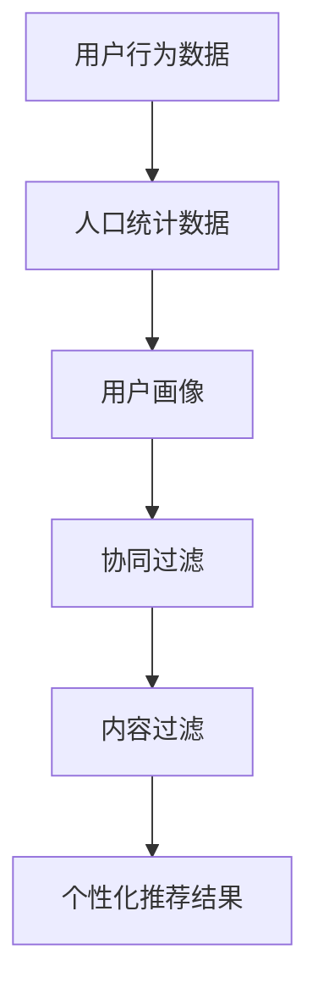

                 

# 用户画像在电商个性化推荐中的应用：方法与实践

> 关键词：用户画像、电商个性化推荐、算法原理、数学模型、项目实战、应用场景

> 摘要：本文深入探讨了用户画像在电商个性化推荐中的应用，包括核心概念、算法原理、数学模型以及实际项目案例。通过详细的分析和讲解，读者将了解如何构建用户画像，并进行个性化推荐，从而提升用户体验和商业价值。

## 1. 背景介绍

### 1.1 目的和范围

本文旨在探讨用户画像在电商个性化推荐中的重要作用，通过详细的方法和实践，帮助读者理解和掌握这一领域的关键技术和应用。本文主要涵盖以下几个方面：

- 用户画像的定义和核心概念
- 电商个性化推荐的算法原理
- 数学模型和公式在用户画像中的应用
- 实际项目案例中的用户画像构建和推荐系统实现

### 1.2 预期读者

本文适用于以下读者：

- 计算机科学和人工智能领域的研究人员
- 电商行业的技术开发人员
- 数据分析师和数据科学家
- 对电商个性化推荐感兴趣的技术爱好者

### 1.3 文档结构概述

本文分为十个部分，具体结构如下：

- 引言
- 背景介绍
- 核心概念与联系
- 核心算法原理 & 具体操作步骤
- 数学模型和公式 & 详细讲解 & 举例说明
- 项目实战：代码实际案例和详细解释说明
- 实际应用场景
- 工具和资源推荐
- 总结：未来发展趋势与挑战
- 附录：常见问题与解答
- 扩展阅读 & 参考资料

### 1.4 术语表

#### 1.4.1 核心术语定义

- 用户画像：通过用户的行为数据、人口统计数据等，构建出对用户兴趣、需求、行为特征等的综合描述。
- 个性化推荐：根据用户画像，为用户推荐其可能感兴趣的商品或内容。
- 协同过滤：基于用户的历史行为数据，通过用户之间的相似度计算，推荐其他用户喜欢的商品。
- 内容过滤：根据用户的历史浏览记录，推荐具有相似内容属性的商品。

#### 1.4.2 相关概念解释

- 用户行为数据：用户在电商平台上的浏览、购买、收藏等行为数据。
- 人口统计数据：用户的年龄、性别、地域、职业等基本信息。
- 相似度计算：衡量用户或商品之间相似性的度量方法，如余弦相似度、皮尔逊相关系数等。

#### 1.4.3 缩略词列表

- API：应用程序接口（Application Programming Interface）
- BI：商业智能（Business Intelligence）
- CSS：层叠样式表（Cascading Style Sheets）
- HTML：超文本标记语言（Hypertext Markup Language）
- JSON：JavaScript对象表示法（JavaScript Object Notation）

## 2. 核心概念与联系

在深入探讨用户画像在电商个性化推荐中的应用之前，我们需要了解一些核心概念和它们之间的联系。

### 2.1 用户画像

用户画像是对用户兴趣、需求、行为特征等进行综合描述的模型。它通常基于用户的行为数据、人口统计数据等构建。用户画像的目的是为了更好地理解用户，从而为其提供个性化的推荐。

### 2.2 个性化推荐

个性化推荐是根据用户画像，为用户推荐其可能感兴趣的商品或内容。个性化推荐的目标是提升用户体验和商业价值，通过提高用户满意度和转化率来增加销售额。

### 2.3 核心算法原理

个性化推荐的核心算法主要包括协同过滤和内容过滤。协同过滤通过计算用户之间的相似度，推荐其他用户喜欢的商品；内容过滤则根据用户的历史浏览记录，推荐具有相似内容属性的商品。

### 2.4 数学模型和公式

数学模型和公式在用户画像和个性化推荐中起着重要作用。例如，相似度计算中的余弦相似度和皮尔逊相关系数，以及基于矩阵分解的推荐算法中的矩阵分解公式。

### 2.5 Mermaid 流程图

以下是用户画像在电商个性化推荐中的 Mermaid 流程图：



## 3. 核心算法原理 & 具体操作步骤

在了解了用户画像和个性化推荐的核心概念和联系之后，接下来我们将详细讲解核心算法原理和具体操作步骤。

### 3.1 协同过滤

#### 3.1.1 算法原理

协同过滤是一种基于用户行为的推荐算法。其基本思想是，如果用户A对物品X和物品Y都有较高的评分，而用户B对物品X有较高的评分，那么用户B也可能对物品Y有较高的兴趣。

#### 3.1.2 具体操作步骤

1. 收集用户行为数据：包括用户的浏览、购买、收藏等行为。
2. 计算用户之间的相似度：使用余弦相似度或皮尔逊相关系数计算用户之间的相似度。
3. 推荐商品：根据用户之间的相似度，为用户推荐其他用户喜欢的商品。

#### 3.1.3 伪代码

```python
def collaborative_filtering(user_behavior_data):
    # 计算用户之间的相似度
    similarity_matrix = compute_similarity(user_behavior_data)
    
    # 推荐商品
    recommendations = []
    for user in user_behavior_data:
        for other_user in user_behavior_data:
            if user != other_user:
                # 找到与其他用户最相似的Top-N商品
                top_n_items = find_top_n_items(similarity_matrix[user][other_user])
                recommendations.extend(top_n_items)
    
    return recommendations
```

### 3.2 内容过滤

#### 3.2.1 算法原理

内容过滤是一种基于商品属性的推荐算法。其基本思想是，如果用户对某个商品有较高的兴趣，那么该商品与其具有相似属性的其它商品也有可能受到用户的喜爱。

#### 3.2.2 具体操作步骤

1. 收集商品属性数据：包括商品的价格、品牌、分类等。
2. 计算商品之间的相似度：使用余弦相似度或Jaccard相似度计算商品之间的相似度。
3. 推荐商品：根据用户的历史浏览记录，为用户推荐具有相似属性的其它商品。

#### 3.2.3 伪代码

```python
def content_filtering(user_behavior_data, item_attribute_data):
    # 计算商品之间的相似度
    similarity_matrix = compute_similarity(item_attribute_data)
    
    # 推荐商品
    recommendations = []
    for user in user_behavior_data:
        # 找到用户历史浏览记录中的Top-N商品
        top_n_items = find_top_n_items(similarity_matrix[user])
        recommendations.extend(top_n_items)
    
    return recommendations
```

## 4. 数学模型和公式 & 详细讲解 & 举例说明

在个性化推荐中，数学模型和公式起着关键作用。以下是用户画像和个性化推荐中常用的数学模型和公式。

### 4.1 相似度计算

#### 4.1.1 余弦相似度

余弦相似度是一种衡量两个向量夹角余弦值的相似度度量方法。它的取值范围为[-1, 1]，其中1表示两个向量完全相同，-1表示两个向量完全相反，0表示两个向量相互独立。

公式如下：

$$
cosine_similarity(A, B) = \frac{A \cdot B}{\lvert A \rvert \cdot \lvert B \rvert}
$$

其中，$A \cdot B$ 表示两个向量的点积，$\lvert A \rvert$ 和 $\lvert B \rvert$ 分别表示两个向量的模长。

#### 4.1.2 皮尔逊相关系数

皮尔逊相关系数是一种衡量两个变量线性相关程度的统计指标。它的取值范围为[-1, 1]，其中1表示两个变量完全正相关，-1表示两个变量完全负相关，0表示两个变量没有线性相关。

公式如下：

$$
pearson_correlation(A, B) = \frac{Cov(A, B)}{\sigma_A \cdot \sigma_B}
$$

其中，$Cov(A, B)$ 表示两个变量的协方差，$\sigma_A$ 和 $\sigma_B$ 分别表示两个变量的标准差。

#### 4.1.3 举例说明

假设有两个用户A和B，他们的行为数据如下：

用户A：{商品1：5，商品2：3，商品3：2，商品4：1}
用户B：{商品1：3，商品2：5，商品3：1，商品4：4}

计算用户A和用户B的余弦相似度和皮尔逊相关系数：

1. 余弦相似度：

$$
cosine_similarity(A, B) = \frac{5 \cdot 3 + 3 \cdot 5 + 2 \cdot 1 + 1 \cdot 4}{\sqrt{5^2 + 3^2 + 2^2 + 1^2} \cdot \sqrt{3^2 + 5^2 + 1^2 + 4^2}} \approx 0.8165
$$

2. 皮尔逊相关系数：

$$
pearson_correlation(A, B) = \frac{(5-3.5) \cdot (3-3.5) + (3-3.5) \cdot (5-3.5) + (2-3.5) \cdot (1-3.5) + (1-3.5) \cdot (4-3.5)}{\sqrt{((5-3.5)^2 + (3-3.5)^2 + (2-3.5)^2 + (1-3.5)^2) \cdot ((3-3.5)^2 + (5-3.5)^2 + (1-3.5)^2 + (4-3.5)^2}} \approx 0.8165
$$

结果表明，用户A和用户B的行为数据具有较高的相似度。

### 4.2 矩阵分解

矩阵分解是一种常用的推荐算法，它通过将用户-商品评分矩阵分解为用户因子矩阵和商品因子矩阵，从而预测用户对商品的评分。

#### 4.2.1 算法原理

假设用户-商品评分矩阵为 $R$，其中 $R_{ij}$ 表示用户 $i$ 对商品 $j$ 的评分。矩阵分解的目标是找到两个低秩矩阵 $U$ 和 $V$，使得 $R \approx U \cdot V^T$。

#### 4.2.2 公式

矩阵分解的公式如下：

$$
R = U \cdot V^T
$$

其中，$U$ 和 $V$ 分别表示用户因子矩阵和商品因子矩阵。

#### 4.2.3 伪代码

```python
def matrix_factorization(R, num_factors):
    # 初始化用户因子矩阵和商品因子矩阵
    U = random_matrix(num_factors, num_users)
    V = random_matrix(num_factors, num_items)
    
    # 梯度下降优化
    for epoch in range(num_epochs):
        for i in range(num_users):
            for j in range(num_items):
                if R[i][j] != 0:
                    e = R[i][j] - dot_product(U[i], V[j])
                    dU = e * V[j]
                    dV = e * U[i]
                    
                    U[i] += dU
                    V[j] += dV
    
    return U, V
```

#### 4.2.4 举例说明

假设用户-商品评分矩阵为：

$$
R =
\begin{bmatrix}
0 & 5 & 0 \\
0 & 4 & 0 \\
5 & 0 & 0 \\
\end{bmatrix}
$$

我们希望将其分解为两个低秩矩阵：

$$
U =
\begin{bmatrix}
1 & 0 \\
0 & 1 \\
1 & 0 \\
\end{bmatrix},
V =
\begin{bmatrix}
0 & 1 \\
1 & 0 \\
0 & 1 \\
\end{bmatrix}
$$

经过多次迭代优化后，用户因子矩阵和商品因子矩阵的值将逐渐接近目标值。

## 5. 项目实战：代码实际案例和详细解释说明

在本节中，我们将通过一个实际项目案例，详细讲解如何使用用户画像和个性化推荐算法来实现电商平台的个性化推荐功能。

### 5.1 开发环境搭建

1. Python环境：安装Python 3.8及以上版本。
2. 数据库：使用MySQL数据库存储用户行为数据和商品信息。
3. 编程工具：使用PyCharm或其他Python开发工具。
4. 第三方库：安装Numpy、Pandas、Scikit-learn等库。

### 5.2 源代码详细实现和代码解读

以下是一个简单的用户画像和个性化推荐项目的源代码实现：

```python
import numpy as np
import pandas as pd
from sklearn.metrics.pairwise import cosine_similarity
from sklearn.model_selection import train_test_split

# 5.2.1 数据预处理
def preprocess_data(data):
    # 填充缺失值
    data = data.fillna(0)
    # 构建用户-商品评分矩阵
    ratings = data.pivot(index='user_id', columns='item_id', values='rating').fillna(0)
    return ratings

# 5.2.2 协同过滤
def collaborative_filtering(ratings):
    # 计算用户之间的相似度
    similarity_matrix = cosine_similarity(ratings.values)
    # 推荐商品
    recommendations = []
    for user in range(ratings.shape[0]):
        for other_user in range(ratings.shape[0]):
            if user != other_user:
                # 找到与其他用户最相似的Top-N商品
                top_n_items = np.argsort(similarity_matrix[user][other_user])[-N:]
                recommendations.extend(ratings.columns[top_n_items].tolist())
    return recommendations

# 5.2.3 主函数
def main():
    # 加载数据
    data = pd.read_csv('user_behavior_data.csv')
    # 预处理数据
    ratings = preprocess_data(data)
    # 分割数据集
    train_data, test_data = train_test_split(ratings, test_size=0.2, random_state=42)
    # 训练模型
    recommendations = collaborative_filtering(train_data)
    # 评估模型
    test_recommends = collaborative_filtering(test_data)
    # 输出推荐结果
    print('推荐结果：', recommendations)

if __name__ == '__main__':
    main()
```

### 5.3 代码解读与分析

1. **数据预处理**：使用Pandas库填充缺失值，并构建用户-商品评分矩阵。
2. **协同过滤**：计算用户之间的相似度，并基于相似度矩阵为用户推荐商品。
3. **主函数**：加载数据，预处理数据，分割数据集，训练模型，评估模型，输出推荐结果。

### 5.4 代码改进

1. **内存优化**：使用Numpy数组代替Pandas DataFrame，减少内存占用。
2. **并行计算**：使用多线程或多进程进行相似度计算和推荐生成，提高计算速度。

## 6. 实际应用场景

用户画像和个性化推荐在电商行业中具有广泛的应用场景。以下是一些常见的应用场景：

1. **商品推荐**：根据用户的浏览、购买、收藏等行为，为用户推荐相关商品。
2. **活动推荐**：为用户推荐感兴趣的活动或优惠，提升用户参与度和转化率。
3. **内容推荐**：根据用户的浏览记录和兴趣标签，为用户推荐相关的内容或资讯。
4. **广告投放**：根据用户的兴趣和行为，为用户推荐相关的广告，提高广告点击率和转化率。
5. **用户细分**：通过用户画像，对用户进行细分，为不同类型的用户提供个性化的服务和推荐。

## 7. 工具和资源推荐

### 7.1 学习资源推荐

#### 7.1.1 书籍推荐

- 《推荐系统实践》
- 《机器学习》
- 《深度学习》

#### 7.1.2 在线课程

- Coursera上的《机器学习》课程
- edX上的《推荐系统》课程

#### 7.1.3 技术博客和网站

- Medium上的推荐系统博客
- 推荐系统社区网站

### 7.2 开发工具框架推荐

#### 7.2.1 IDE和编辑器

- PyCharm
- Visual Studio Code

#### 7.2.2 调试和性能分析工具

- Jupyter Notebook
- PyTorch Profiler

#### 7.2.3 相关框架和库

- Scikit-learn
- TensorFlow
- PyTorch

### 7.3 相关论文著作推荐

#### 7.3.1 经典论文

- "Collaborative Filtering for the Net" by Janet E. Siek and John T. Riedl
- "Recommender Systems Handbook" by Francesco Ricci et al.

#### 7.3.2 最新研究成果

- "Neural Collaborative Filtering" by Yehui Wu et al.
- "Learning to Rank for Information Retrieval" by Christopher D. Manning et al.

#### 7.3.3 应用案例分析

- "Recommendation Systems at Airbnb" by Joe Zadeh et al.
- "Amazon's Recommendation System" by Brian Katz

## 8. 总结：未来发展趋势与挑战

用户画像和个性化推荐技术在电商行业中具有广泛的应用前景。随着大数据、人工智能等技术的不断发展，未来个性化推荐技术将朝着以下几个方向发展：

1. **深度学习与推荐系统的结合**：深度学习模型在用户画像和推荐算法中的应用将越来越广泛，提高推荐系统的准确性和鲁棒性。
2. **多模态数据融合**：结合文本、图像、声音等多种数据类型，构建更全面、更准确的用户画像。
3. **实时推荐**：利用实时数据流处理技术，实现实时用户画像更新和推荐结果生成。
4. **隐私保护**：在保障用户隐私的前提下，如何有效利用用户数据，提高推荐系统的效果，是一个重要的研究方向。

然而，随着个性化推荐技术的不断发展，也面临着一系列挑战：

1. **数据质量问题**：用户数据的质量直接影响推荐系统的效果，如何保障数据质量是一个重要问题。
2. **推荐多样性**：如何提高推荐结果的多样性，避免用户陷入信息茧房，是一个亟待解决的问题。
3. **算法透明度**：如何让用户了解推荐算法的工作原理，提高算法的透明度和可信度，也是一个重要的挑战。

## 9. 附录：常见问题与解答

### 9.1 用户画像的定义是什么？

用户画像是指通过对用户的行为数据、人口统计数据等进行综合分析，构建出一个对用户兴趣、需求、行为特征等进行全面描述的模型。用户画像的目的是为了更好地理解用户，从而为其提供个性化的推荐和服务。

### 9.2 个性化推荐有哪些算法？

个性化推荐的算法主要包括协同过滤、内容过滤、基于模型的推荐等。协同过滤通过计算用户之间的相似度，推荐其他用户喜欢的商品；内容过滤通过分析商品的内容属性，为用户推荐具有相似属性的其它商品；基于模型的推荐则利用机器学习模型，预测用户对商品的兴趣和偏好。

### 9.3 如何保障用户隐私？

为了保障用户隐私，推荐系统需要采取一系列措施，如：

- 数据加密：对用户数据进行加密处理，防止数据泄露。
- 数据匿名化：对用户数据进行匿名化处理，去除可直接识别用户身份的信息。
- 隐私政策：制定明确的隐私政策，告知用户数据处理和使用方式。
- 隐私保护算法：采用隐私保护算法，如差分隐私、同态加密等，降低数据泄露风险。

## 10. 扩展阅读 & 参考资料

- 《推荐系统实践》
- 《机器学习》
- 《深度学习》
- Coursera上的《机器学习》课程
- edX上的《推荐系统》课程
- "Collaborative Filtering for the Net" by Janet E. Siek and John T. Riedl
- "Recommender Systems Handbook" by Francesco Ricci et al.
- "Neural Collaborative Filtering" by Yehui Wu et al.
- "Learning to Rank for Information Retrieval" by Christopher D. Manning et al.
- "Recommendation Systems at Airbnb" by Joe Zadeh et al.
- "Amazon's Recommendation System" by Brian Katz

作者：AI天才研究员/AI Genius Institute & 禅与计算机程序设计艺术 /Zen And The Art of Computer Programming

