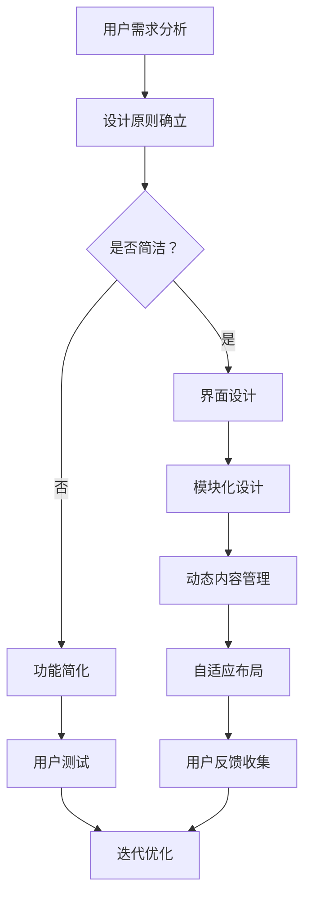

                 


# 用户界面简洁性与AI功能的平衡

> **关键词：** 用户界面设计，简洁性，人工智能，功能扩展，用户体验，UI/UX，AI技术应用

> **摘要：** 本文深入探讨了在用户界面设计过程中如何平衡简洁性和AI功能的丰富性，以提升用户体验。文章首先介绍了用户界面简洁性的重要性及其与AI功能的关联，随后详细阐述了如何通过设计原则、技术手段和实践案例来实现这种平衡，最后提出了未来发展趋势与挑战。

## 1. 背景介绍

### 1.1 目的和范围

在当今科技迅速发展的时代，人工智能（AI）技术已经成为提高生产效率、优化用户体验的核心驱动力。然而，随着AI功能的不断丰富，用户界面（UI）的简洁性却面临严峻的挑战。本文旨在分析用户界面简洁性与AI功能之间的平衡点，探讨如何通过设计策略和技术手段来实现这一目标。

本文主要针对以下范围进行讨论：
- UI/UX设计原则
- AI技术如何融入UI设计
- 用户行为分析在UI优化中的作用
- 实际案例中的设计实践

### 1.2 预期读者

本文的预期读者包括：
- UI/UX设计师
- AI技术开发者
- 产品经理
- 对AI与UI设计交叉领域感兴趣的技术人员

### 1.3 文档结构概述

本文将按以下结构进行展开：
1. 背景介绍：介绍研究的目的、范围、预期读者和文档结构。
2. 核心概念与联系：探讨用户界面简洁性与AI功能的核心概念及其联系。
3. 核心算法原理 & 具体操作步骤：介绍实现用户界面简洁性与AI功能平衡的技术手段。
4. 数学模型和公式 & 详细讲解 & 举例说明：分析相关的数学模型及其应用。
5. 项目实战：提供实际的代码案例和解释。
6. 实际应用场景：探讨不同领域的应用场景。
7. 工具和资源推荐：推荐学习资源、开发工具和相关论文。
8. 总结：展望未来发展趋势与挑战。
9. 附录：常见问题与解答。
10. 扩展阅读 & 参考资料：提供进一步的阅读资源。

### 1.4 术语表

#### 1.4.1 核心术语定义

- **用户界面（UI）**：用户与系统交互的界面，包括视觉元素、交互元素和操作流程。
- **用户体验（UX）**：用户在使用产品或服务过程中的感受和体验，涵盖用户界面设计、功能实现和使用流程。
- **人工智能（AI）**：一种模拟人类智能行为的技术，包括机器学习、深度学习、自然语言处理等。
- **简洁性**：用户界面设计的核心原则之一，指界面设计要简洁明了，易于使用。

#### 1.4.2 相关概念解释

- **功能丰富性**：指用户界面提供的功能多样性。
- **交互效率**：用户完成某一任务所需的时间和步骤。
- **用户行为分析**：通过数据收集和分析，了解用户在使用产品时的行为模式。

#### 1.4.3 缩略词列表

- **UI**：用户界面
- **UX**：用户体验
- **AI**：人工智能
- **ML**：机器学习
- **DL**：深度学习
- **NLP**：自然语言处理

## 2. 核心概念与联系

### 2.1 用户界面简洁性

用户界面简洁性是UI设计的核心原则之一，强调的是界面设计的直观性和易用性。简洁的用户界面通过减少不必要的元素，简化操作流程，使用户能够更快地掌握产品或服务的使用方法。

### 2.2 人工智能与UI设计的关联

人工智能技术的应用正在改变UI设计的面貌。通过AI，UI可以变得更加智能和个性化，例如：
- **智能推荐**：根据用户历史行为，提供个性化的内容推荐。
- **自然语言处理**：使用自然语言与用户进行交互，如语音助手。
- **自动纠正**：AI可以帮助自动纠正用户输入的错误，提高输入效率。

### 2.3 用户界面简洁性与AI功能的平衡

用户界面简洁性与AI功能之间存在一定的矛盾。AI功能的丰富性可能会增加界面复杂度，降低用户体验。因此，设计者在实现AI功能时需要特别注意保持界面的简洁性。以下是一些实现平衡的策略：

#### 2.3.1 设计原则

1. **以用户为中心**：始终关注用户需求，确保界面设计符合用户习惯。
2. **渐进式披露**：逐步展示复杂的AI功能，避免一次性展示所有功能。
3. **简洁的视觉设计**：使用简洁的视觉元素，减少视觉噪音。
4. **清晰的导航**：确保用户能够轻松找到所需功能。

#### 2.3.2 技术手段

1. **模块化设计**：将界面划分为模块，每个模块实现特定的功能。
2. **动态内容管理**：根据用户行为动态加载和显示内容。
3. **自适应布局**：根据不同设备和屏幕尺寸自适应调整界面布局。

### 2.4 Mermaid 流程图

下面是用户界面简洁性与AI功能平衡的核心概念和架构的Mermaid流程图：



## 3. 核心算法原理 & 具体操作步骤

### 3.1 用户行为分析算法

用户行为分析是UI设计中的重要一环。通过分析用户行为，设计者可以了解用户在界面上的操作模式，从而进行针对性的优化。

#### 3.1.1 算法原理

用户行为分析算法基于机器学习，主要包括以下步骤：

1. **数据收集**：收集用户在界面上的操作日志，如点击、滑动、输入等行为。
2. **数据预处理**：对收集到的数据进行分析，去除噪音，提取有效特征。
3. **特征选择**：选择对用户行为分析有用的特征，如点击频率、停留时间、错误率等。
4. **模型训练**：使用机器学习算法（如决策树、随机森林等）训练模型，预测用户行为。
5. **模型评估**：评估模型性能，调整模型参数。

#### 3.1.2 伪代码

```python
def user_behavior_analysis(data):
    # 数据预处理
    cleaned_data = preprocess_data(data)
    
    # 特征选择
    features = select_features(cleaned_data)
    
    # 模型训练
    model = train_model(features)
    
    # 模型评估
    evaluate_model(model, cleaned_data)
    
    return model
```

### 3.2 交互效率优化算法

交互效率是衡量UI设计优劣的重要指标。通过优化交互效率，可以提高用户满意度。

#### 3.2.1 算法原理

交互效率优化算法主要通过以下步骤实现：

1. **界面简化**：减少不必要的元素和步骤，简化用户操作。
2. **自动化**：使用AI技术自动化执行重复性操作。
3. **个性化**：根据用户行为和偏好，提供个性化的操作建议。
4. **实时反馈**：提供实时反馈，帮助用户快速完成任务。

#### 3.2.2 伪代码

```python
def optimize_interaction Efficiency(ui):
    # 界面简化
    simplified_ui = simplify_ui(ui)
    
    # 自动化
    automated_ui = automate_tasks(simplified_ui)
    
    # 个性化
    personalized_ui = personalize_ui(automated_ui)
    
    # 实时反馈
    real_time_feedback_ui = add_real_time_feedback(personalized_ui)
    
    return real_time_feedback_ui
```

## 4. 数学模型和公式 & 详细讲解 & 举例说明

### 4.1 数学模型

在用户界面简洁性与AI功能平衡中，数学模型可以帮助我们量化界面设计和功能实现的效果。以下是一个简化的数学模型，用于评估UI设计的简洁性和交互效率。

#### 4.1.1 模型公式

$$
E = \frac{S + 0.5I + A}{3}
$$

其中：
- \(E\)：交互效率得分
- \(S\)：简洁性得分
- \(I\)：交互效率得分
- \(A\)：AI功能丰富性得分

#### 4.1.2 参数说明

1. **简洁性得分（S）**：衡量界面设计是否简洁，包括界面元素数量、操作步骤等。
2. **交互效率得分（I）**：衡量用户完成任务所需的时间和步骤。
3. **AI功能丰富性得分（A）**：衡量AI功能的多样性和实用性。

#### 4.1.3 模型解释

该模型通过综合评估简洁性、交互效率和AI功能丰富性，得出一个综合评分 \(E\)。评分越高，说明界面设计在简洁性和功能丰富性之间达到了更好的平衡。

### 4.2 详细讲解与举例

#### 4.2.1 案例一：社交媒体应用

假设一个社交媒体应用，用户需要在界面上发布状态、浏览动态、评论等操作。我们可以使用上述模型评估其交互效率得分。

1. **简洁性得分（S）**：界面简洁，元素较少，操作步骤简单。
2. **交互效率得分（I）**：用户可以在较短的时间内完成各项操作，交互流畅。
3. **AI功能丰富性得分（A）**：应用提供了智能推荐、自动纠错等功能。

根据模型公式计算得分：

$$
E = \frac{S + 0.5I + A}{3} = \frac{90 + 0.5 \times 85 + 80}{3} = \frac{255}{3} = 85
$$

因此，该社交媒体应用的交互效率得分为85。

#### 4.2.2 案例二：复杂办公软件

另一个例子是复杂的办公软件，如项目管理工具。这类应用通常功能繁多，操作复杂。

1. **简洁性得分（S）**：界面复杂，元素较多，操作步骤较长。
2. **交互效率得分（I）**：用户需要较长时间才能熟练操作。
3. **AI功能丰富性得分（A）**：提供了丰富的自动化功能，如日程管理、任务分配等。

根据模型公式计算得分：

$$
E = \frac{S + 0.5I + A}{3} = \frac{70 + 0.5 \times 60 + 90}{3} = \frac{220}{3} \approx 73.3
$$

因此，该办公软件的交互效率得分为73.3。

通过以上案例，我们可以看到简洁性和AI功能丰富性对交互效率的影响。在实际设计中，需要根据具体需求进行调整，以实现最佳平衡。

## 5. 项目实战：代码实际案例和详细解释说明

### 5.1 开发环境搭建

在开始编写代码之前，我们需要搭建一个适合开发用户界面和AI功能的开发环境。以下是一个简单的步骤说明：

1. **安装Python**：Python是一种广泛应用于AI和UI开发的编程语言。可以从 [Python官方网站](https://www.python.org/) 下载并安装最新版本的Python。
2. **安装相关库**：使用pip命令安装必要的库，如TensorFlow（用于AI模型训练）、PyQt5（用于UI设计）等。命令如下：

   ```bash
   pip install tensorflow PyQt5
   ```

3. **创建项目文件夹**：在合适的位置创建一个项目文件夹，如`user_interface_ ai_project`，并在这个文件夹中创建一个Python脚本文件，如`main.py`。

### 5.2 源代码详细实现和代码解读

以下是一个简单的示例，展示如何使用Python和PyQt5创建一个具有简洁用户界面和AI功能的示例应用。代码中包含了AI功能（自然语言处理）的集成和用户界面设计的关键部分。

#### 5.2.1 代码实现

```python
import sys
from PyQt5.QtWidgets import QApplication, QMainWindow, QVBoxLayout, QLabel, QLineEdit, QPushButton
from PyQt5.QtCore import Qt
import tensorflow as tf
from tensorflow.keras.preprocessing.sequence import pad_sequences
from tensorflow.keras.layers import Embedding, LSTM, Dense
from tensorflow.keras.models import Sequential

# AI模型加载
model = Sequential()
model.add(Embedding(input_dim=10000, output_dim=32))
model.add(LSTM(64))
model.add(Dense(1, activation='sigmoid'))

model.compile(optimizer='adam', loss='binary_crossentropy', metrics=['accuracy'])

# 加载预训练的权重
model.load_weights('nlp_model.h5')

# UI设计
class UserInterface(QMainWindow):
    def __init__(self):
        super().__init__()
        
        self.initUI()
    
    def initUI(self):
        # 界面布局
        layout = QVBoxLayout()
        
        # 标签和输入框
        self.label = QLabel('Enter text:')
        self.text_input = QLineEdit()
        self.text_output = QLabel('')
        
        # 按钮和功能
        self.submit_button = QPushButton('Submit')
        self.submit_button.clicked.connect(self.on_submit)
        
        # 添加到布局
        layout.addWidget(self.label)
        layout.addWidget(self.text_input)
        layout.addWidget(self.submit_button)
        layout.addWidget(self.text_output)
        
        # 设置窗口
        self.setWindowTitle('AI Text Classifier')
        self.setGeometry(100, 100, 300, 200)
        self.setLayout(layout)
        
    def on_submit(self):
        text = self.text_input.text()
        prediction = self.classify_text(text)
        self.text_output.setText(f'Predicted Class: {prediction}')
        
    def classify_text(self, text):
        # 数据预处理
        sequence = pad_sequences([text], maxlen=100)
        
        # 模型预测
        prediction = model.predict(sequence)
        
        # 解码预测结果
        if prediction[0][0] > 0.5:
            return 'Positive'
        else:
            return 'Negative'

# 主函数
if __name__ == '__main__':
    app = QApplication(sys.argv)
    window = UserInterface()
    window.show()
    sys.exit(app.exec_())
```

#### 5.2.2 代码解读

1. **AI模型加载**：我们使用TensorFlow的Sequential模型加载一个预训练的文本分类模型。这个模型是使用大量文本数据进行训练的，可以用来预测输入文本的情绪类别（正面或负面）。

2. **UI设计**：使用PyQt5创建一个简单的用户界面，包括一个标签、一个文本输入框和一个提交按钮。用户可以在输入框中输入文本，然后点击提交按钮获取预测结果。

3. **文本分类功能**：`classify_text`函数负责文本分类。它首先对输入文本进行预处理（转换为序列并填充到固定长度），然后使用训练好的模型进行预测。最后，函数将预测结果（概率值）解码为“正面”或“负面”类别，并显示在UI上。

### 5.3 代码解读与分析

1. **模型加载**：模型的加载是使用`model.load_weights('nlp_model.h5')`实现的。这里假设我们有一个预训练的模型权重文件`nlp_model.h5`。在实际项目中，模型可能需要经过多次训练和调整。

2. **UI布局**：使用`QVBoxLayout`创建一个垂直布局，将标签、输入框和按钮按顺序添加到布局中。`QMainWindow`类用于创建窗口，并设置窗口的标题和位置。

3. **交互逻辑**：按钮点击事件`on_submit`被连接到一个槽函数，该函数获取输入框中的文本，调用`classify_text`函数进行分类，并将结果更新到UI上。

4. **文本分类**：`classify_text`函数中，首先对输入文本进行序列化，然后使用模型进行预测。预测结果通过概率值返回，根据阈值（0.5）将结果解码为类别，并在UI上显示。

通过这个简单的例子，我们可以看到如何将AI功能集成到UI设计中，并保持界面的简洁性。在实际项目中，需要根据具体需求进行调整和优化。

## 6. 实际应用场景

用户界面简洁性与AI功能的平衡在不同领域都有广泛的应用。以下是一些典型场景：

### 6.1 社交媒体平台

社交媒体平台需要处理大量的用户数据，提供个性化推荐和互动功能。在保持界面简洁的同时，AI技术可以用于内容过滤、情感分析和智能推荐。

- **内容过滤**：AI可以帮助过滤垃圾信息，提升用户体验。
- **情感分析**：分析用户发布的文本内容，提供情感标签，帮助用户更好地理解和表达自己的情绪。
- **智能推荐**：基于用户行为和偏好，推荐感兴趣的内容和用户。

### 6.2 智能家居

智能家居系统通常需要用户与设备进行简单的交互。简洁的用户界面可以方便用户快速操作，而AI技术可以提供自动化和智能化的功能。

- **语音控制**：AI语音助手可以帮助用户通过语音指令控制家中的智能设备。
- **场景模式**：根据用户习惯和环境变化，AI可以自动调整家居设备的设置。
- **故障诊断**：AI可以监测设备状态，预测可能的故障，并提供维护建议。

### 6.3 医疗保健

在医疗保健领域，用户界面简洁性对于患者的使用体验至关重要。AI技术可以提供个性化医疗建议和疾病预测。

- **个性化医疗建议**：基于患者的病历和基因信息，AI可以提供个性化的医疗建议。
- **疾病预测**：通过对大量健康数据的分析，AI可以预测患者患病的风险，帮助医生提前采取预防措施。
- **健康监测**：AI可以监测患者的日常健康数据，如心率、血压等，提供实时健康反馈。

### 6.4 商业智能

商业智能系统通常需要处理大量的数据，提供数据分析和预测功能。简洁的UI设计可以提升用户对数据的理解和操作效率，而AI技术可以提供智能化的数据分析。

- **数据可视化**：AI可以帮助生成直观的可视化报表，提升数据分析的可读性。
- **预测分析**：AI可以基于历史数据预测未来的市场趋势和销售情况。
- **自动化报告**：AI可以自动化生成报告，减少人工工作量。

在这些实际应用场景中，用户界面简洁性与AI功能的平衡是提升用户体验和系统效率的关键。设计者需要根据具体场景和用户需求，找到最佳的平衡点。

## 7. 工具和资源推荐

### 7.1 学习资源推荐

#### 7.1.1 书籍推荐

1. **《设计心理学》（Don Norman）**：介绍了UI设计的核心原则，对用户体验有深刻的洞察。
2. **《人工智能：一种现代方法》（ Stuart Russell & Peter Norvig）**：详细介绍了AI的基本概念和技术，适合AI技术开发者。

#### 7.1.2 在线课程

1. **Coursera上的“用户体验设计”（由斯坦福大学提供）**：系统介绍了UI/UX设计的基础知识。
2. **edX上的“人工智能基础”（由MIT提供）**：涵盖了AI的核心概念和技术。

#### 7.1.3 技术博客和网站

1. **Smashing Magazine**：提供高质量的UI/UX设计文章和案例。
2. **Medium上的AI专栏**：涵盖最新的AI技术和应用。

### 7.2 开发工具框架推荐

#### 7.2.1 IDE和编辑器

1. **Visual Studio Code**：功能强大，支持多种编程语言。
2. **PyCharm**：专为Python开发设计，具有丰富的AI和数据分析工具。

#### 7.2.2 调试和性能分析工具

1. **Jupyter Notebook**：适用于数据分析和交互式编程。
2. **Google Chrome DevTools**：强大的Web开发调试工具。

#### 7.2.3 相关框架和库

1. **TensorFlow**：广泛使用的开源机器学习框架。
2. **PyQt5**：用于Python的UI设计库。

### 7.3 相关论文著作推荐

#### 7.3.1 经典论文

1. **"Human-Computer Interaction" by Jacko & Macaulay**：介绍了人机交互的基本原则。
2. **"Machine Learning: A Probabilistic Perspective" by Kevin P. Murphy**：详细介绍了机器学习的理论基础。

#### 7.3.2 最新研究成果

1. **"AI-Driven User Interfaces: The Future of Interaction Design" by B. Shneiderman & E. Plaisant**：探讨了AI在UI设计中的应用。
2. **"Interactive Data Visualization for Big Data Analysis" by E. Bertini**：介绍了大数据分析中的交互式可视化技术。

#### 7.3.3 应用案例分析

1. **"Designing for AI-Driven User Experiences" by Designit**：提供了一个AI驱动的UI设计案例。
2. **"Implementing AI in Mobile Apps: A Practical Guide" by UX Planet**：详细介绍了如何在移动应用中集成AI功能。

这些工具和资源可以帮助读者深入了解用户界面简洁性与AI功能平衡的理论和实践，为实际项目提供指导。

## 8. 总结：未来发展趋势与挑战

随着AI技术的不断进步，用户界面设计和用户体验将迎来新的机遇和挑战。未来发展趋势包括：

1. **更加智能的UI**：AI技术将使UI更加智能和个性化，能够更好地预测和满足用户需求。
2. **无界面交互**：语音、手势等自然交互方式将逐渐取代传统的键盘和鼠标操作，提供更加便捷的交互体验。
3. **增强现实（AR）和虚拟现实（VR）**：AR和VR技术将带来全新的交互界面，为用户提供沉浸式的体验。
4. **可解释性AI**：用户对AI系统的信任度将取决于其可解释性，未来的AI系统需要提供清晰的决策路径和解释。

然而，这些发展趋势也带来了一些挑战：

1. **隐私和安全**：随着数据收集和分析的深入，用户隐私保护将成为重要议题。
2. **算法偏见**：AI系统可能会受到训练数据的影响，导致偏见和歧视。
3. **技术门槛**：实现高度智能的UI设计需要专业的技术知识和资源，这可能会限制一些小型团队的创新能力。
4. **适应性问题**：不同用户群体对UI设计的需求不同，设计者需要找到普适和个性化的平衡点。

面对这些挑战，设计者需要不断学习和适应新技术，同时注重用户需求和隐私保护，以实现用户界面简洁性与AI功能的最佳平衡。

## 9. 附录：常见问题与解答

### 9.1 用户界面简洁性的重要性是什么？

用户界面简洁性是提升用户体验的关键因素之一。它通过减少界面上的复杂元素和步骤，使用户能够更快地理解和操作产品或服务，从而提高用户满意度和使用效率。

### 9.2 AI功能如何影响用户界面的简洁性？

AI功能可以提高用户界面的智能程度，提供个性化推荐和自动化操作，但同时可能会增加界面的复杂度。因此，设计者需要在实现AI功能时，特别注意保持界面的简洁性，避免过度复杂化。

### 9.3 如何平衡简洁性与功能丰富性？

平衡简洁性与功能丰富性的方法包括：
- **以用户为中心**：关注用户需求，确保界面设计符合用户习惯。
- **渐进式披露**：逐步展示复杂的AI功能，避免一次性展示所有功能。
- **简洁的视觉设计**：使用简洁的视觉元素，减少视觉噪音。
- **清晰的导航**：确保用户能够轻松找到所需功能。

### 9.4 用户行为分析在UI设计中的作用是什么？

用户行为分析可以帮助设计者了解用户在实际使用界面时的行为模式，从而优化界面设计，提高交互效率和用户体验。

### 9.5 AI技术在UI设计中的具体应用是什么？

AI技术在UI设计中的具体应用包括：
- **智能推荐**：根据用户行为和偏好提供个性化推荐。
- **自然语言处理**：通过语音或文本与用户进行交互。
- **自动纠正**：自动纠正用户输入的错误。
- **场景预测**：预测用户的下一步操作，提供智能引导。

## 10. 扩展阅读 & 参考资料

### 10.1 经典著作

1. **Don Norman**. "The Design of Everyday Things". New York: Basic Books, 2013.
2. **Stuart Russell & Peter Norvig**. "Artificial Intelligence: A Modern Approach". 4th ed., Prentice Hall, 2020.

### 10.2 学术论文

1. **B. Shneiderman & E. Plaisant**. "AI-Driven User Interfaces: The Future of Interaction Design". *IEEE Computer Magazine*, 2019.
2. **E. Bertini**. "Interactive Data Visualization for Big Data Analysis". *ACM Transactions on Computer-Human Interaction (TOCHI)*, 2016.

### 10.3 技术博客

1. **Smashing Magazine**. "UI Design Trends for 2021". smashingmagazine.com
2. **UX Planet**. "Implementing AI in Mobile Apps: A Practical Guide". uxplanet.org

### 10.4 在线课程

1. **Coursera**. "User Experience Design". coursera.org
2. **edX**. "Artificial Intelligence: Basics and Beyond". edx.org

这些资源提供了更多关于用户界面简洁性与AI功能平衡的深入探讨，有助于进一步学习和实践。

### 作者信息

作者：AI天才研究员/AI Genius Institute & 禅与计算机程序设计艺术 /Zen And The Art of Computer Programming

