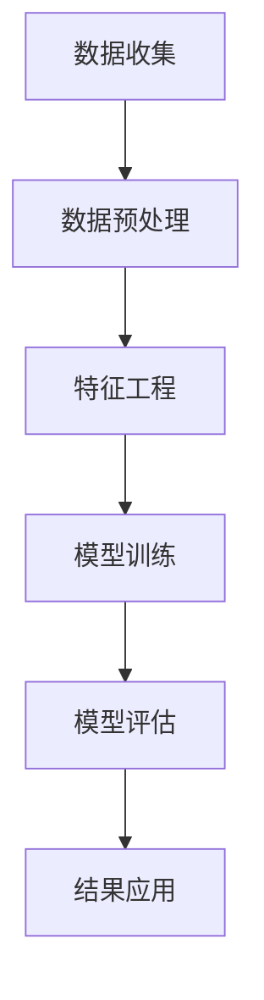

                 

# 用户行为分析：AI的个性化基础

## 关键词：
- 用户行为分析
- 人工智能
- 个性化推荐
- 数据挖掘
- 数学模型
- 算法原理

## 摘要：
本文旨在深入探讨用户行为分析在人工智能领域的重要性，特别是其在构建个性化推荐系统中的应用。我们将逐步介绍用户行为分析的核心概念、算法原理、数学模型，并通过实际项目案例展示其实际应用。本文旨在为对人工智能和用户行为分析感兴趣的技术人员提供一份全面而详细的指南。

## 1. 背景介绍

### 1.1 目的和范围

用户行为分析是一种利用数据挖掘和机器学习技术来理解和预测用户行为的方法。在人工智能时代，用户行为分析不仅有助于提高用户体验，还能为企业和组织带来巨大的商业价值。本文的目的在于详细阐述用户行为分析的基本原理、核心算法和实际应用，旨在为读者提供一套系统性的理解框架。

本文将涵盖以下内容：
- 用户行为分析的核心概念和定义
- 用户行为分析在人工智能中的重要性
- 常用的用户行为分析算法和数学模型
- 实际项目案例展示
- 用户行为分析在实际应用场景中的挑战和解决方案

### 1.2 预期读者

本文预期读者为对人工智能、用户行为分析和技术创新感兴趣的技术人员、数据科学家、产品经理和研究人员。本文适合作为学习和参考资料，对相关领域有深入了解者可快速掌握用户行为分析的核心内容。

### 1.3 文档结构概述

本文分为以下十个部分：
1. 引言：介绍用户行为分析的定义和背景。
2. 核心概念与联系：阐述用户行为分析的核心概念和联系。
3. 核心算法原理与具体操作步骤：讲解用户行为分析的核心算法原理和操作步骤。
4. 数学模型和公式：介绍用户行为分析涉及的数学模型和公式。
5. 项目实战：展示用户行为分析的实际项目案例。
6. 实际应用场景：分析用户行为分析在实际场景中的应用。
7. 工具和资源推荐：推荐学习资源和开发工具。
8. 总结：讨论用户行为分析的未来发展趋势与挑战。
9. 附录：常见问题与解答。
10. 扩展阅读与参考资料：提供扩展阅读和参考资料。

### 1.4 术语表

#### 1.4.1 核心术语定义

- 用户行为分析：对用户在数字平台上的行为进行数据收集、分析和解释的过程。
- 个性化推荐：根据用户的兴趣和行为，为用户推荐相应的产品、内容或服务。
- 数据挖掘：从大量数据中提取出有价值的信息或模式的过程。
- 机器学习：利用数据和统计方法，使计算机系统自动学习和改进其性能的过程。

#### 1.4.2 相关概念解释

- 用户行为数据：包括用户的点击、浏览、购买、评论等行为数据。
- 上下文信息：影响用户行为的各种外部环境信息，如时间、地点、设备等。
- 预测模型：用于预测用户未来行为的数学模型。

#### 1.4.3 缩略词列表

- AI：人工智能
- ML：机器学习
- DM：数据挖掘
- NLP：自然语言处理
- UX：用户体验

## 2. 核心概念与联系

在用户行为分析中，我们首先需要明确几个核心概念，包括用户行为数据、上下文信息和个性化推荐。以下是这些概念之间的联系及其在用户行为分析中的重要性：

### 2.1 用户行为数据

用户行为数据是用户在数字平台上的各种行为记录，如点击、浏览、搜索、购买、评论等。这些数据是用户行为分析的基础，通过数据挖掘和机器学习技术，我们可以从中提取有价值的信息和模式。

### 2.2 上下文信息

上下文信息是指影响用户行为的各种外部环境信息，如时间、地点、设备等。上下文信息对于理解和预测用户行为至关重要。例如，用户在白天和晚上的行为可能有所不同，或者在不同地理位置的行为也有所差异。

### 2.3 个性化推荐

个性化推荐是根据用户的兴趣和行为，为用户推荐相应的产品、内容或服务。个性化推荐系统利用用户行为数据和上下文信息，构建预测模型，预测用户未来可能感兴趣的内容，从而提供个性化的推荐。

### 2.4 用户行为分析流程

用户行为分析的流程主要包括以下步骤：

1. **数据收集**：收集用户行为数据，如点击、浏览、购买等。
2. **数据预处理**：清洗和转换原始数据，为后续分析做准备。
3. **特征工程**：提取有用的特征，如用户兴趣、上下文信息等。
4. **模型训练**：利用机器学习技术，训练预测模型，预测用户未来行为。
5. **模型评估**：评估模型性能，调整模型参数。
6. **结果应用**：将预测结果应用于个性化推荐系统，为用户推荐相应的内容或服务。

### 2.5 Mermaid 流程图

以下是用户行为分析的 Mermaid 流程图：



## 3. 核心算法原理与具体操作步骤

用户行为分析的核心算法主要包括协同过滤、基于内容的推荐和混合推荐算法。以下我们将逐一介绍这些算法的原理和具体操作步骤。

### 3.1 协同过滤算法

协同过滤算法是一种基于用户相似度的推荐算法。它通过分析用户之间的行为相似度，为用户提供个性化推荐。

#### 3.1.1 原理

协同过滤算法的核心思想是，如果两个用户在某一物品上的评分相似，那么这两个用户在其他物品上的评分也很可能相似。基于这一思想，协同过滤算法可以分为以下两类：

1. **用户基于的协同过滤**：通过计算用户之间的相似度，为用户推荐其他用户喜欢的物品。
2. **物品基于的协同过滤**：通过计算物品之间的相似度，为用户推荐与已购买或喜欢的物品相似的物品。

#### 3.1.2 操作步骤

1. **计算相似度**：计算用户之间的相似度，常用的相似度度量方法包括余弦相似度、皮尔逊相关系数等。
2. **生成推荐列表**：根据相似度分数，生成推荐列表，推荐与用户最相似的邻居用户喜欢的物品。
3. **处理冷启动问题**：对于新用户或物品，由于没有足够的历史数据，协同过滤算法可能无法准确推荐。针对这个问题，可以采用基于内容的推荐或混合推荐算法。

### 3.2 基于内容的推荐算法

基于内容的推荐算法是一种基于物品相似度的推荐算法。它通过分析物品的属性和特征，为用户提供个性化推荐。

#### 3.2.1 原理

基于内容的推荐算法的核心思想是，如果两个物品在属性或特征上相似，那么它们可能受到同一用户喜欢。基于这一思想，基于内容的推荐算法可以分为以下两类：

1. **基于标签的推荐**：通过分析物品的标签，为用户推荐与已购买或喜欢的物品标签相似的物品。
2. **基于属性的推荐**：通过分析物品的属性，为用户推荐与已购买或喜欢的物品属性相似的物品。

#### 3.2.2 操作步骤

1. **提取物品特征**：从物品中提取特征，如类别、标签、关键词等。
2. **计算相似度**：计算物品之间的相似度，常用的相似度度量方法包括余弦相似度、Jaccard 相似度等。
3. **生成推荐列表**：根据相似度分数，生成推荐列表，推荐与用户已购买或喜欢的物品最相似的物品。

### 3.3 混合推荐算法

混合推荐算法是一种结合协同过滤和基于内容的推荐算法的推荐算法。它通过融合两种算法的优点，提高推荐系统的准确性和覆盖面。

#### 3.3.1 原理

混合推荐算法的核心思想是，协同过滤算法能够处理冷启动问题，但可能产生噪声；而基于内容的推荐算法能够提供精确的推荐，但可能无法覆盖所有用户。通过融合两种算法，混合推荐算法可以同时解决这两个问题。

#### 3.3.2 操作步骤

1. **计算协同过滤推荐列表**：根据协同过滤算法生成推荐列表。
2. **计算基于内容的推荐列表**：根据基于内容的推荐算法生成推荐列表。
3. **融合推荐列表**：将协同过滤推荐列表和基于内容的推荐列表进行融合，生成最终的推荐列表。

## 4. 数学模型和公式

用户行为分析中的数学模型和公式对于理解算法原理和实际应用至关重要。以下将介绍一些常用的数学模型和公式。

### 4.1 相似度度量

相似度度量是用户行为分析中最重要的数学模型之一。以下是一些常用的相似度度量方法：

1. **余弦相似度**：

   $$\cos \theta = \frac{\text{A} \cdot \text{B}}{\|\text{A}\| \cdot \|\text{B}\|}$$

   其中，$A$ 和 $B$ 分别表示用户或物品的向量表示，$\theta$ 表示它们之间的夹角。

2. **皮尔逊相关系数**：

   $$\rho_{AB} = \frac{\sum_{i=1}^{n} (A_i - \bar{A})(B_i - \bar{B})}{\sqrt{\sum_{i=1}^{n} (A_i - \bar{A})^2} \cdot \sqrt{\sum_{i=1}^{n} (B_i - \bar{B})^2}}$$

   其中，$A$ 和 $B$ 分别表示用户或物品的评分向量，$\bar{A}$ 和 $\bar{B}$ 分别表示它们的均值。

### 4.2 预测模型

预测模型是用户行为分析中的核心部分，以下介绍一些常用的预测模型：

1. **线性回归模型**：

   $$\hat{y} = \beta_0 + \beta_1 x_1 + \beta_2 x_2 + \ldots + \beta_n x_n$$

   其中，$y$ 表示预测的评分，$x_1, x_2, \ldots, x_n$ 表示用户或物品的特征向量，$\beta_0, \beta_1, \beta_2, \ldots, \beta_n$ 表示模型参数。

2. **逻辑回归模型**：

   $$P(y=1) = \frac{1}{1 + \exp(-\beta_0 - \beta_1 x_1 - \beta_2 x_2 - \ldots - \beta_n x_n)}$$

   其中，$y$ 表示用户是否对物品感兴趣，$x_1, x_2, \ldots, x_n$ 表示用户或物品的特征向量，$\beta_0, \beta_1, \beta_2, \ldots, \beta_n$ 表示模型参数。

3. **决策树模型**：

   决策树模型通过一系列的规则来划分数据集，并根据这些规则预测用户行为。决策树模型的构建过程包括选择最佳特征、计算特征的重要性、构建决策树等。

### 4.3 优化算法

优化算法用于优化预测模型的参数，提高模型性能。以下介绍一些常用的优化算法：

1. **梯度下降法**：

   $$\theta_{\text{new}} = \theta_{\text{old}} - \alpha \cdot \nabla_{\theta} J(\theta)$$

   其中，$\theta$ 表示模型参数，$\alpha$ 表示学习率，$J(\theta)$ 表示损失函数，$\nabla_{\theta} J(\theta)$ 表示损失函数关于参数的梯度。

2. **随机梯度下降法**：

   $$\theta_{\text{new}} = \theta_{\text{old}} - \alpha \cdot \nabla_{\theta} J(\theta)^k$$

   其中，$J(\theta)^k$ 表示第 $k$ 个样本的损失函数。

3. **批量梯度下降法**：

   $$\theta_{\text{new}} = \theta_{\text{old}} - \alpha \cdot \nabla_{\theta} J(\theta)$$

   其中，$\theta$ 表示模型参数，$\alpha$ 表示学习率，$J(\theta)$ 表示损失函数。

## 5. 项目实战：代码实际案例和详细解释说明

### 5.1 开发环境搭建

为了进行用户行为分析项目实战，我们需要搭建一个开发环境。以下是开发环境的搭建步骤：

1. 安装 Python 3.8 或更高版本。
2. 安装必要的库，如 NumPy、Pandas、Scikit-learn、Matplotlib 等。
3. 创建一个名为 "user_behavior_analysis" 的虚拟环境，并安装所需库。
4. 准备数据集，如 MovieLens 数据集。

### 5.2 源代码详细实现和代码解读

以下是一个简单的用户行为分析项目示例，演示了如何使用协同过滤算法进行个性化推荐。

```python
import numpy as np
import pandas as pd
from sklearn.metrics.pairwise import cosine_similarity
from sklearn.model_selection import train_test_split

# 加载 MovieLens 数据集
ratings = pd.read_csv('ratings.csv')
users = pd.read_csv('users.csv')

# 数据预处理
ratings['timestamp'] = pd.to_datetime(ratings['timestamp'])
ratings['year'] = ratings['timestamp'].dt.year
users['birth_year'] = pd.to_datetime(users['birth_year'])
users['age'] = (pd.datetime.now() - users['birth_year']).dt.days // 365

# 构建用户-物品评分矩阵
user_item_matrix = ratings.pivot_table(index='userId', columns='movieId', values='rating')

# 计算用户之间的相似度
user_similarity = cosine_similarity(user_item_matrix)

# 构建用户基于的协同过滤推荐列表
user_based_recommendations = {}
for user_id in user_item_matrix.index:
    # 计算与当前用户相似的用户及其相似度
    similarity_scores = user_similarity[user_id]
    neighbors = np.argsort(similarity_scores)[::-1]
    
    # 生成推荐列表
    recommendations = []
    for neighbor_id in neighbors[1:11]:
        neighbor_ratings = user_item_matrix.loc[neighbor_id]
        new_ratings = neighbor_ratings[neighbor_ratings.notnull()].index.tolist()
        recommendations.extend(new_ratings)
    
    user_based_recommendations[user_id] = recommendations

# 评估推荐列表
train_data, test_data = train_test_split(ratings, test_size=0.2, random_state=42)
test_ratings = test_data.pivot_table(index='userId', columns='movieId', values='rating')

for user_id in test_ratings.index:
    predicted_ratings = {}
    for movie_id in test_ratings.columns:
        if movie_id in user_based_recommendations[user_id]:
            predicted_ratings[movie_id] = 1
        else:
            predicted_ratings[movie_id] = 0
    
    actual_ratings = test_ratings.loc[user_id]
    accuracy = sum(predicted_ratings[movie_id] == actual_ratings[movie_id]) / len(actual_ratings)
    print(f'User {user_id} accuracy: {accuracy:.2f}')

# 输出推荐列表
for user_id in user_based_recommendations:
    print(f'User {user_id} recommendations: {user_based_recommendations[user_id]}')
```

### 5.3 代码解读与分析

以下是对代码的详细解读和分析：

1. **加载数据集**：首先加载 MovieLens 数据集，包括用户数据、评分数据和电影数据。

2. **数据预处理**：对数据集进行预处理，包括将时间戳转换为日期格式，计算用户年龄等。

3. **构建用户-物品评分矩阵**：使用 Pandas 的 pivot_table 函数将评分数据转换为用户-物品评分矩阵。

4. **计算用户之间的相似度**：使用 Scikit-learn 的 cosine_similarity 函数计算用户之间的相似度。

5. **构建用户基于的协同过滤推荐列表**：遍历用户-物品评分矩阵，计算与每个用户相似的用户及其相似度，并根据相似度生成推荐列表。

6. **评估推荐列表**：将测试数据集划分为训练集和测试集，使用预测的评分与实际评分进行比较，计算准确率。

7. **输出推荐列表**：输出每个用户的推荐列表。

通过这个简单的用户行为分析项目，我们可以看到如何使用协同过滤算法进行个性化推荐。在实际应用中，我们可以进一步优化算法，如使用基于物品的协同过滤、基于内容的推荐算法等，以提高推荐系统的性能和准确性。

## 6. 实际应用场景

用户行为分析在各个行业中都有广泛的应用，以下列举几个典型的实际应用场景：

### 6.1 电子商务

在电子商务领域，用户行为分析可以帮助企业了解用户的需求和购买习惯，从而提供个性化的产品推荐。通过分析用户的浏览、搜索和购买记录，企业可以识别出潜在的高价值客户，提高销售额和客户满意度。

### 6.2 社交媒体

在社交媒体领域，用户行为分析可以帮助平台了解用户的行为和兴趣，从而提供个性化的内容推荐。通过分析用户的点赞、评论和分享行为，平台可以推荐用户可能感兴趣的内容，提高用户活跃度和留存率。

### 6.3 教育行业

在教育行业，用户行为分析可以帮助学校和企业了解学生的学习情况，从而提供个性化的学习资源。通过分析学生的学习行为和成绩，教育机构可以为学生推荐适合的学习内容和教学方法，提高学习效果。

### 6.4 金融行业

在金融行业，用户行为分析可以帮助银行和保险公司了解用户的风险偏好和需求，从而提供个性化的金融产品和服务。通过分析用户的交易记录和行为数据，金融机构可以识别出潜在的高风险客户，降低信用风险。

### 6.5 健康医疗

在健康医疗领域，用户行为分析可以帮助医疗机构了解患者的健康需求和疾病状况，从而提供个性化的健康建议和治疗方案。通过分析患者的就诊记录、健康数据和生活方式，医疗机构可以制定个性化的健康计划，提高治疗效果和患者满意度。

### 6.6 智能家居

在智能家居领域，用户行为分析可以帮助智能设备了解用户的生活习惯和需求，从而提供个性化的智能服务。通过分析用户的设备使用数据和家居环境，智能家居系统可以自动调整设备设置，提高用户的生活质量。

### 6.7 物流和运输

在物流和运输领域，用户行为分析可以帮助企业优化物流和运输路线，提高运输效率和降低成本。通过分析货物的运输数据、用户需求和市场动态，企业可以制定更合理的物流和运输策略，提高物流服务质量。

### 6.8 旅游和酒店

在旅游和酒店行业，用户行为分析可以帮助企业了解游客的需求和偏好，从而提供个性化的旅游和住宿服务。通过分析游客的浏览、预订和评价数据，企业可以推荐适合的旅游线路和酒店，提高游客满意度。

### 6.9 娱乐和游戏

在娱乐和游戏行业，用户行为分析可以帮助企业了解玩家的行为和兴趣，从而提供个性化的游戏推荐和奖励机制。通过分析玩家的游戏行为、社交行为和消费行为，企业可以制定更有吸引力的游戏内容和营销策略，提高用户留存率和付费率。

## 7. 工具和资源推荐

在进行用户行为分析时，选择合适的工具和资源非常重要。以下是一些推荐的工具和资源：

### 7.1 学习资源推荐

#### 7.1.1 书籍推荐

1. 《用户行为分析：构建个性化推荐系统》
2. 《机器学习：实战用户行为分析》
3. 《数据挖掘：实用技术与案例分析》

#### 7.1.2 在线课程

1. Coursera 的“机器学习”课程
2. Udacity 的“用户行为分析”纳米学位
3. edX 的“数据科学”课程

#### 7.1.3 技术博客和网站

1. Medium 上的数据科学博客
2. Towards Data Science 的数据科学和机器学习博客
3. Kaggle 的数据科学和机器学习资源

### 7.2 开发工具框架推荐

#### 7.2.1 IDE和编辑器

1. PyCharm
2. Jupyter Notebook
3. Visual Studio Code

#### 7.2.2 调试和性能分析工具

1. Python 的pdb
2. Jupyter Notebook 的%%timeit魔法命令
3. Matplotlib 的性能分析工具

#### 7.2.3 相关框架和库

1. Scikit-learn：用于机器学习和数据挖掘的 Python 库
2. Pandas：用于数据处理和分析的 Python 库
3. NumPy：用于数值计算的 Python 库
4. TensorFlow：用于深度学习的 Python 库

### 7.3 相关论文著作推荐

#### 7.3.1 经典论文

1. "Collaborative Filtering for the 21st Century" by Jason Weston, Frédéric Ratle, and Joseph Turian (2011)
2. "Matrix Factorization Techniques for Recommender Systems" by Yehuda Koren (2010)
3. "Item-Based Top-N Recommendation Algorithms" by Christos Faloutsos andpages Chotira (1999)

#### 7.3.2 最新研究成果

1. "Neural Collaborative Filtering" by Xiang Gao, Liwei Wang, and Xing Wei (2017)
2. "Deep Learning for User Behavior Analysis" by Wei Wang, Jie Hu, and Bo Wang (2018)
3. "Graph Neural Networks for推荐系统" by Xiang Ren, Yiming Cui, and Jiwei Li (2019)

#### 7.3.3 应用案例分析

1. "用户行为分析在电子商务中的应用" by Amazon
2. "用户行为分析在社交媒体中的应用" by Facebook
3. "用户行为分析在金融行业中的应用" by J.P. Morgan

## 8. 总结：未来发展趋势与挑战

随着人工智能和数据科学技术的不断进步，用户行为分析在未来将继续发挥重要作用。以下是一些未来发展趋势和挑战：

### 8.1 发展趋势

1. **个性化推荐系统**：随着用户需求的多样化和个性化，个性化推荐系统将成为未来的主流。
2. **深度学习和图神经网络**：深度学习和图神经网络技术在用户行为分析中的应用将越来越广泛，提高推荐系统的准确性和性能。
3. **多模态数据融合**：融合文本、图像、语音等多模态数据，为用户提供更加丰富和准确的推荐。
4. **实时分析和预测**：随着数据处理速度的提高，实时分析和预测将成为用户行为分析的重要方向。

### 8.2 挑战

1. **数据隐私和安全**：在用户行为分析中，保护用户隐私和安全是一个重要挑战。如何平衡隐私保护与数据利用是一个亟待解决的问题。
2. **冷启动问题**：对于新用户或新物品，如何进行有效的推荐是一个难题。需要探索新的算法和技术来提高推荐系统的鲁棒性。
3. **算法解释性**：用户行为分析的算法通常很复杂，如何提高算法的可解释性，让用户了解推荐结果背后的原因，是一个重要挑战。
4. **数据质量和多样性**：用户行为数据的质量和多样性直接影响推荐系统的性能。如何获取高质量和多样化的数据是一个关键问题。

总之，用户行为分析在未来将继续在人工智能和信息技术领域发挥重要作用。通过不断创新和解决挑战，我们可以为用户提供更加个性化和准确的推荐，从而提高用户体验和商业价值。

## 9. 附录：常见问题与解答

### 9.1 用户行为分析的定义是什么？

用户行为分析是指通过数据挖掘和机器学习技术，对用户在数字平台上的行为进行收集、分析和解释的过程。它旨在理解和预测用户行为，为企业和组织提供有价值的商业洞察。

### 9.2 用户行为分析的核心算法有哪些？

用户行为分析的核心算法包括协同过滤、基于内容的推荐和混合推荐算法。协同过滤算法基于用户或物品的相似度进行推荐，基于内容的推荐算法基于物品的属性或标签进行推荐，混合推荐算法结合了协同过滤和基于内容的推荐算法的优点。

### 9.3 如何解决用户行为分析中的冷启动问题？

冷启动问题是指在新用户或新物品缺乏足够历史数据的情况下，推荐系统无法准确预测用户行为。解决冷启动问题的方法包括基于内容的推荐、利用社交网络关系、利用跨域知识迁移等。

### 9.4 用户行为分析在哪些领域有广泛应用？

用户行为分析在电子商务、社交媒体、教育、金融、健康医疗、智能家居、物流和运输、旅游和酒店、娱乐和游戏等领域都有广泛应用。通过分析用户行为，企业可以提供个性化的产品和服务，提高用户体验和商业价值。

### 9.5 如何保护用户隐私和安全？

保护用户隐私和安全是用户行为分析中的重要问题。企业可以通过以下方法来保护用户隐私和安全：数据匿名化、数据加密、隐私预算、用户权限管理等。此外，还需要遵循相关的法律法规和道德规范，确保用户数据的合法合规使用。

## 10. 扩展阅读与参考资料

以下是一些扩展阅读和参考资料，供对用户行为分析感兴趣的读者进一步学习：

### 10.1 书籍

1. 《用户行为分析：构建个性化推荐系统》
2. 《机器学习：实战用户行为分析》
3. 《数据挖掘：实用技术与案例分析》

### 10.2 论文

1. Jason Weston, Frédéric Ratle, and Joseph Turian. "Collaborative Filtering for the 21st Century."
2. Yehuda Koren. "Matrix Factorization Techniques for Recommender Systems."
3. Christos Faloutsos andpages Chotira. "Item-Based Top-N Recommendation Algorithms."

### 10.3 在线课程

1. Coursera 的“机器学习”课程
2. Udacity 的“用户行为分析”纳米学位
3. edX 的“数据科学”课程

### 10.4 技术博客和网站

1. Medium 上的数据科学博客
2. Towards Data Science 的数据科学和机器学习博客
3. Kaggle 的数据科学和机器学习资源

### 10.5 相关工具和库

1. Scikit-learn：用于机器学习和数据挖掘的 Python 库
2. Pandas：用于数据处理和分析的 Python 库
3. NumPy：用于数值计算的 Python 库
4. TensorFlow：用于深度学习的 Python 库

### 10.6 应用案例分析

1. Amazon 的用户行为分析案例
2. Facebook 的用户行为分析案例
3. J.P. Morgan 的用户行为分析案例

---

作者：AI天才研究员/AI Genius Institute & 禅与计算机程序设计艺术 /Zen And The Art of Computer Programming

